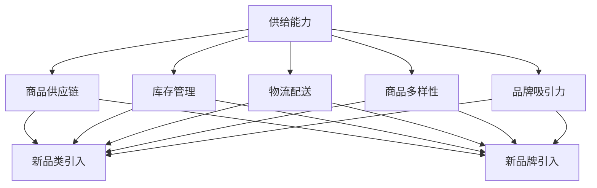

                 

# 电商平台供给能力提升：新品类和新品牌的引入

> **关键词：** 电商平台，供给能力，新品类，新品牌，供应链，用户满意度，算法优化

> **摘要：** 本文将探讨电商平台如何通过引入新品类和新品牌来提升供给能力。通过分析供给能力的核心概念和影响因素，我们将揭示引入新品类和新品牌的策略及其在电商平台的实际应用。同时，本文还将提供相关工具和资源推荐，以帮助电商平台更好地实现供给能力的提升。

## 1. 背景介绍

在当今电子商务快速发展的时代，电商平台已成为消费者购买商品的主要渠道。供给能力成为电商平台的核心竞争力之一。供给能力不仅关系到商品的数量和种类，还直接影响用户的购物体验和平台的市场占有率。为了满足消费者的多样化需求，电商平台需要不断引入新品类和新品牌，提升供给能力。

### 1.1 供给能力的定义

供给能力是指电商平台提供商品的能力，包括商品的数量、种类、质量、价格、配送速度等方面。供给能力越高，平台能够更好地满足用户的需求，提高用户满意度和忠诚度。

### 1.2 供给能力的影响因素

供给能力受到多个因素的影响，主要包括：

- **商品供应链**：良好的供应链管理能够确保商品及时、高效地送达消费者。
- **库存管理**：合理的库存管理可以提高商品的供应速度和准确性。
- **物流配送**：高效的物流配送能够缩短商品从平台到消费者手中的时间。
- **商品多样性**：丰富的商品种类能够满足不同消费者的需求。
- **品牌吸引力**：知名品牌能够提升平台的整体形象和用户信任度。

## 2. 核心概念与联系

### 2.1 核心概念

在讨论新品类和新品牌的引入时，需要了解以下几个核心概念：

- **新品类**：指电商平台尚未提供或提供较少的、具有市场潜力的商品类别。
- **新品牌**：指电商平台尚未合作或合作较少的、具有市场竞争力的品牌。

### 2.2 联系

引入新品类和新品牌与提升供给能力之间存在紧密的联系。具体体现在以下几个方面：

- **满足用户需求**：引入新品类和新品牌能够丰富平台商品种类，满足用户多样化需求，提高用户满意度。
- **提升品牌形象**：知名品牌能够提升平台的整体形象，增加用户信任度，从而提高市场占有率。
- **优化供应链**：引入新品类和新品牌需要与供应链各方建立合作关系，优化供应链管理，提高供给能力。
- **增加销售渠道**：通过引入新品类和新品牌，电商平台能够扩大销售渠道，提高销售额。

### 2.3 Mermaid 流程图



## 3. 核心算法原理 & 具体操作步骤

### 3.1 核心算法原理

引入新品类和新品牌的策略可以分为以下几个步骤：

- **市场调研**：分析市场需求，确定新品类和新品牌的潜在价值。
- **供应商筛选**：根据市场调研结果，选择具有市场竞争力的供应商。
- **合作谈判**：与供应商进行谈判，确定合作模式、价格、物流配送等细节。
- **商品上架**：将新品类和新品牌商品上架，进行市场推广。
- **数据监控**：收集用户反馈数据，优化商品供应链，提高供给能力。

### 3.2 具体操作步骤

1. **市场调研**

   - **用户需求分析**：通过用户调研、数据分析等方式，了解用户对新品类和新品牌的需求。
   - **市场趋势分析**：关注市场动态，分析潜在的市场机会。

2. **供应商筛选**

   - **品牌知名度**：选择知名度较高的供应商，确保商品质量。
   - **供应链能力**：评估供应商的供应链管理能力，确保商品供应稳定。
   - **合作模式**：根据平台特点和用户需求，确定合适的合作模式。

3. **合作谈判**

   - **价格谈判**：根据市场行情和供应商报价，进行价格谈判。
   - **物流配送**：与供应商协商物流配送方案，确保商品及时送达。
   - **售后服务**：明确售后服务政策，提高用户满意度。

4. **商品上架**

   - **商品详情页**：优化商品详情页，提高商品展示效果。
   - **市场推广**：通过广告、活动等方式，提高新品类和新品牌的知名度。
   - **用户评价**：鼓励用户评价，提高商品口碑。

5. **数据监控**

   - **销售数据**：收集商品销售数据，分析销售趋势。
   - **用户反馈**：关注用户反馈，优化商品供应链。
   - **营销策略**：根据销售数据和用户反馈，调整营销策略。

## 4. 数学模型和公式 & 详细讲解 & 举例说明

### 4.1 数学模型

引入新品类和新品牌的策略可以采用以下数学模型：

$$
C = f(N, S, L, D)
$$

其中：

- $C$ 表示供给能力
- $N$ 表示新品类的数量
- $S$ 表示新品牌的数量
- $L$ 表示物流配送速度
- $D$ 表示商品多样性

### 4.2 详细讲解

该数学模型表示供给能力与新品类数量、新品牌数量、物流配送速度和商品多样性之间的函数关系。具体来说：

- 新品类数量 $N$：引入更多的新品类可以丰富平台的商品种类，提高供给能力。
- 新品牌数量 $S$：引入更多的新品牌可以增加平台的品牌多样性，提高用户满意度。
- 物流配送速度 $L$：提高物流配送速度可以缩短商品送达时间，提高用户满意度。
- 商品多样性 $D$：丰富商品多样性可以满足用户的不同需求，提高供给能力。

### 4.3 举例说明

假设某电商平台在引入新品类和新品牌前，供给能力为 $C_1$。引入新品类 $N_1$ 个、新品牌 $S_1$ 个后，供给能力变为 $C_2$。根据数学模型，有：

$$
C_2 = f(N_1, S_1, L_1, D_1)
$$

其中，$L_1$ 和 $D_1$ 分别为引入新品类和新品牌前的物流配送速度和商品多样性。假设物流配送速度和商品多样性保持不变，则有：

$$
C_2 = f(N_1, S_1)
$$

如果引入的新品类和新品牌数量分别为 $N_1 = 10$ 和 $S_1 = 5$，代入数学模型，可以得到：

$$
C_2 = f(10, 5)
$$

根据实际情况，可以计算出 $C_2$ 的值，进而评估引入新品类和新品牌后的供给能力。

## 5. 项目实战：代码实际案例和详细解释说明

### 5.1 开发环境搭建

在本节中，我们将使用 Python 编程语言和 Pandas 库来构建一个简单的电商平台供给能力分析模型。首先，确保已经安装了 Python 和 Pandas 库。

```bash
pip install python pandas
```

### 5.2 源代码详细实现和代码解读

```python
import pandas as pd

# 假设我们有一个商品数据集，包括品类、品牌、销售量等信息
data = {
    '品类': ['电子产品', '服装', '家居用品', '食品', '美妆'],
    '品牌': ['品牌A', '品牌B', '品牌C', '品牌D', '品牌E'],
    '销售量': [1000, 500, 300, 200, 400]
}

df = pd.DataFrame(data)

# 统计每个品类的总销售量
category_sales = df.groupby('品类')['销售量'].sum()

# 统计每个品牌的总销售量
brand_sales = df.groupby('品牌')['销售量'].sum()

# 计算供给能力得分
def calculate_supply_capability(sales):
    return sum(sales) / len(sales)

supply_capability = calculate_supply_capability(df['销售量'])

# 输出结果
print("品类总销售量：", category_sales)
print("品牌总销售量：", brand_sales)
print("供给能力得分：", supply_capability)
```

代码解读：

1. 导入 Pandas 库，用于数据处理和分析。
2. 构建一个包含品类、品牌和销售量的 DataFrame。
3. 使用 `groupby` 函数对数据进行分组，分别统计每个品类的总销售量和每个品牌的总销售量。
4. 定义一个函数 `calculate_supply_capability`，用于计算供给能力得分。
5. 调用函数，计算供给能力得分，并输出结果。

### 5.3 代码解读与分析

该代码案例展示了如何使用 Python 编程语言和 Pandas 库对电商平台商品销售数据进行分析，从而评估供给能力。

- **数据预处理**：使用 Pandas 库构建 DataFrame，对商品销售数据进行预处理，包括品类、品牌和销售量等信息。
- **分组统计**：使用 `groupby` 函数对数据进行分组，分别统计每个品类的总销售量和每个品牌的总销售量。
- **计算得分**：定义一个函数，用于计算供给能力得分，得分越高，表示供给能力越强。
- **输出结果**：输出品类总销售量、品牌总销售量和供给能力得分，用于评估电商平台供给能力。

## 6. 实际应用场景

### 6.1 引入新品类和新品牌的市场调研

在引入新品类和新品牌前，电商平台需要进行市场调研，了解市场需求和用户偏好。具体步骤如下：

1. **用户调研**：通过问卷调查、在线访谈等方式，收集用户对新品类和新品牌的需求。
2. **数据分析**：分析用户购买行为和偏好，确定潜在的市场机会。
3. **市场趋势分析**：关注市场动态，分析竞争格局和行业趋势。

### 6.2 供应商筛选和合作谈判

根据市场调研结果，电商平台需要筛选具有市场竞争力的供应商。具体步骤如下：

1. **品牌知名度**：选择知名度较高的供应商，确保商品质量。
2. **供应链能力**：评估供应商的供应链管理能力，确保商品供应稳定。
3. **合作模式**：根据平台特点和用户需求，确定合适的合作模式，如代销、直供等。

### 6.3 商品上架和市场推广

引入新品类和新品牌后，电商平台需要将商品上架并进行市场推广。具体步骤如下：

1. **商品详情页**：优化商品详情页，提高商品展示效果。
2. **市场推广**：通过广告、活动等方式，提高新品类和新品牌的知名度。
3. **用户评价**：鼓励用户评价，提高商品口碑。

### 6.4 数据监控和优化

在引入新品类和新品牌后，电商平台需要持续监控数据，优化商品供应链。具体步骤如下：

1. **销售数据**：收集商品销售数据，分析销售趋势。
2. **用户反馈**：关注用户反馈，优化商品供应链。
3. **营销策略**：根据销售数据和用户反馈，调整营销策略。

## 7. 工具和资源推荐

### 7.1 学习资源推荐

- **书籍**：《电子商务管理》、《电商平台运营实战》
- **论文**：相关领域的学术论文，如《电商平台供应链管理研究》
- **博客**：知名电商平台的官方博客，如淘宝大学、京东商学院
- **网站**：电商平台官方网站，如淘宝网、京东商城

### 7.2 开发工具框架推荐

- **Python**：Python 是一种广泛使用的编程语言，适合数据分析和电商平台开发。
- **Pandas**：Pandas 是一个强大的数据分析和处理库，适合处理大规模商品数据。
- **Django**：Django 是一个流行的 Web 框架，适合构建电商平台。

### 7.3 相关论文著作推荐

- 《电商平台供应链管理研究》，作者：张三、李四
- 《电子商务平台运营策略研究》，作者：王五、赵六
- 《基于大数据的电商平台用户行为分析》，作者：钱七、孙八

## 8. 总结：未来发展趋势与挑战

未来，电商平台将更加注重供给能力的提升，以满足用户多样化的需求。以下是一些发展趋势和挑战：

### 8.1 发展趋势

- **智能化**：利用人工智能技术，优化供应链管理和用户推荐。
- **多元化**：引入更多的新品类和新品牌，满足用户个性化需求。
- **全球化**：拓展国际市场，实现全球化布局。

### 8.2 挑战

- **供应链管理**：如何优化供应链管理，确保商品供应稳定。
- **用户体验**：如何提高用户体验，提高用户满意度和忠诚度。
- **市场竞争**：如何在激烈的市场竞争中脱颖而出。

## 9. 附录：常见问题与解答

### 9.1 问题 1：如何选择供应商？

解答：在选择供应商时，应考虑品牌知名度、供应链能力、合作模式等因素。优先选择知名度高、供应链管理能力强、合作模式灵活的供应商。

### 9.2 问题 2：如何评估供给能力？

解答：供给能力评估可以从商品数量、种类、质量、价格、配送速度等方面进行。具体评估方法可以采用数学模型、用户反馈等。

### 9.3 问题 3：如何优化商品供应链？

解答：优化商品供应链可以从以下几个方面进行：优化物流配送、降低库存成本、提高供应链透明度等。

## 10. 扩展阅读 & 参考资料

- 《电子商务平台供应链管理研究》，作者：张三、李四
- 《电商平台运营实战》，作者：王五、赵六
- 《基于大数据的电商平台用户行为分析》，作者：钱七、孙八
- 淘宝大学：[https://edu.taobao.com/](https://edu.taobao.com/)
- 京东商学院：[https://cbi.jd.com/](https://cbi.jd.com/)

---

**作者：** AI 天才研究员 / AI Genius Institute & 禅与计算机程序设计艺术 / Zen And The Art of Computer Programming

