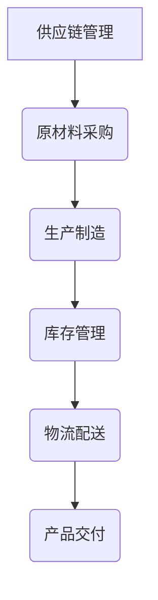

                 

# 电商平台供给能力提升：海外市场拓展

## 摘要

本文旨在探讨如何提升电商平台在海外市场的供给能力，从而实现更广泛的业务拓展。文章将首先介绍当前电商平台的现状和需求，随后详细分析提升供给能力的关键因素，并给出具体的解决方案。最后，文章将讨论实际应用场景，并提供相关工具和资源推荐，以帮助电商企业更好地应对海外市场的挑战。

## 1. 背景介绍

随着全球化的加速和互联网的普及，电商平台在全球范围内的影响力日益增强。无论是大型综合电商平台，如亚马逊、阿里巴巴，还是专注于特定领域的电商平台，如eBay、Netflix，它们都在全球范围内拓展业务，争夺市场份额。然而，在海外市场的拓展过程中，电商平台面临着诸多挑战。

首先，文化差异和消费者行为差异使得平台需要针对不同地区进行本地化调整。这包括语言、支付方式、物流配送等各个方面。其次，供应链的复杂性和不确定性使得电商平台需要具备强大的供应管理能力，以确保产品能够及时送达消费者手中。此外，不同国家和地区的法规和政策也对电商平台的运营产生了影响。

为了应对这些挑战，电商平台需要不断提升其供给能力，以更好地满足海外市场的需求。这包括优化供应链管理、提升物流配送效率、加强本地化调整等。本文将围绕这些关键因素展开讨论，并给出具体的解决方案。

## 2. 核心概念与联系

### 2.1 供应链管理

供应链管理是电商平台提升供给能力的关键因素之一。供应链管理涉及从原材料采购到产品交付给消费者的整个流程。有效的供应链管理可以提高库存周转率，降低库存成本，同时确保产品及时交付。

### 2.2 物流配送

物流配送是供应链管理的重要组成部分。高效的物流配送可以缩短交货时间，提高客户满意度。在全球范围内，电商平台需要建立多层次的物流配送网络，包括跨境物流和本地物流。

### 2.3 本地化调整

本地化调整是电商平台在海外市场成功的关键。通过适应不同地区的文化、消费者行为和法规，电商平台可以更好地满足当地消费者的需求。本地化调整包括语言、支付方式、物流配送等多个方面。

### 2.4 数字化技术

数字化技术可以提升电商平台的供给能力。例如，通过大数据分析和人工智能技术，电商平台可以更好地预测市场需求，优化库存管理，提高物流配送效率。

### 2.5 Mermaid 流程图

以下是一个简单的 Mermaid 流程图，展示了供应链管理的各个环节：



## 3. 核心算法原理 & 具体操作步骤

### 3.1 需求预测

需求预测是供应链管理的重要环节。通过大数据分析和机器学习算法，电商平台可以预测未来的市场需求，从而优化库存管理和物流配送。

#### 3.1.1 数据收集

首先，电商平台需要收集历史销售数据、市场趋势、季节性因素等数据。这些数据可以通过电商平台内部的系统、社交媒体、市场研究报告等途径获取。

#### 3.1.2 数据预处理

收集到的数据需要进行预处理，包括数据清洗、去重、缺失值填充等。这一步骤的目的是确保数据的质量，为后续的分析提供准确的基础。

#### 3.1.3 模型选择

根据数据的特性和需求预测的目标，选择合适的机器学习模型。常用的模型包括线性回归、决策树、随机森林、神经网络等。

#### 3.1.4 模型训练与评估

使用预处理后的数据对模型进行训练，并评估模型的预测性能。常见的评估指标包括均方误差（MSE）、平均绝对误差（MAE）等。

#### 3.1.5 预测结果应用

将预测结果应用于库存管理和物流配送，例如调整库存水平、优化配送路线等。

### 3.2 库存管理

库存管理是供应链管理的核心环节之一。通过合理的库存管理，电商平台可以降低库存成本，提高库存周转率。

#### 3.2.1 ABC 分析法

ABC 分析法是一种常用的库存管理方法。根据产品的销售量和利润贡献，将产品分为 A、B、C 三类。A 类产品是高利润、高销量的产品，需要重点管理。C 类产品则是低利润、低销量的产品，可以适当减少库存。

#### 3.2.2 经济订货量（EOQ）模型

经济订货量（EOQ）模型是一种用于确定最优订货量的库存管理模型。通过计算最小总成本（库存成本 + 订货成本），确定最优的订货量。

#### 3.2.3 JIT 库存管理

JIT（Just-In-Time）库存管理是一种减少库存成本的方法。通过精准的需求预测和供应链协调，实现按需生产、按需配送。

### 3.3 物流配送

物流配送是电商平台供给能力的关键。通过优化物流配送，可以缩短交货时间，提高客户满意度。

#### 3.3.1 跨境物流

跨境物流涉及多个国家和地区的运输，需要考虑到关税、物流渠道、配送时效等因素。电商平台可以通过建立跨境物流网络，提高配送效率。

#### 3.3.2 本地物流

本地物流是指在一个地区内的配送。通过优化配送路线、提高配送速度，可以降低配送成本，提高客户满意度。

#### 3.3.3 最后一公里配送

最后一公里配送是物流配送的最后一个环节，也是影响客户满意度的重要因素。通过引入无人机、智能快递柜等技术，可以优化最后一公里配送。

### 3.4 本地化调整

本地化调整是电商平台在海外市场成功的关键。通过适应不同地区的文化、消费者行为和法规，电商平台可以更好地满足当地消费者的需求。

#### 3.4.1 语言本地化

语言本地化是本地化调整的重要一环。通过提供本地语言的支持，电商平台可以更好地吸引当地消费者。

#### 3.4.2 支付方式本地化

支付方式本地化是指适应不同地区的支付习惯。例如，在一些地区，信用卡使用较少，而移动支付、现金支付更为普遍。

#### 3.4.3 物流配送本地化

物流配送本地化是指根据当地物流网络和消费者需求，调整物流配送策略。例如，在一些地区，消费者更倾向于自提，而在另一些地区，快递服务更为普及。

## 4. 数学模型和公式 & 详细讲解 & 举例说明

### 4.1 需求预测模型

假设电商平台销售的产品为X，历史销售数据为\(X_t\)（\(t=1,2,...,n\)），我们可以使用线性回归模型进行需求预测。

线性回归模型的基本公式为：

$$
\hat{Y}_t = \beta_0 + \beta_1 X_t + \epsilon_t
$$

其中，\(\hat{Y}_t\)为预测的需求量，\(\beta_0\)和\(\beta_1\)为模型参数，\(X_t\)为历史销售数据，\(\epsilon_t\)为误差项。

#### 4.1.1 模型训练

使用历史销售数据\(X_t\)（\(t=1,2,...,n\)）对模型进行训练，得到模型参数\(\beta_0\)和\(\beta_1\)。

#### 4.1.2 模型评估

使用均方误差（MSE）对模型进行评估：

$$
MSE = \frac{1}{n} \sum_{t=1}^{n} (\hat{Y}_t - Y_t)^2
$$

其中，\(Y_t\)为实际需求量。

#### 4.1.3 预测应用

使用训练好的模型对未来的需求进行预测。

### 4.2 库存管理模型

假设电商平台的产品为X，库存水平为\(I_t\)（\(t=1,2,...,n\)），需求量为\(D_t\)（\(t=1,2,...,n\)），我们可以使用经济订货量（EOQ）模型进行库存管理。

EOQ模型的基本公式为：

$$
Q = \sqrt{\frac{2Cd}{h}}
$$

其中，\(Q\)为最优订货量，\(C\)为每次订货成本，\(d\)为每年需求量，\(h\)为每单位产品的库存持有成本。

#### 4.2.1 模型参数确定

根据实际情况，确定每次订货成本\(C\)、每年需求量\(d\)和每单位产品的库存持有成本\(h\)。

#### 4.2.2 计算最优订货量

使用EOQ模型计算最优订货量\(Q\)。

#### 4.2.3 库存管理策略

根据最优订货量\(Q\)，制定库存管理策略，例如定期订货、按需订货等。

### 4.3 物流配送模型

假设电商平台的产品为X，配送距离为\(D_t\)（\(t=1,2,...,n\)），配送速度为\(V_t\)（\(t=1,2,...,n\)），我们可以使用距离-时间模型进行物流配送。

距离-时间模型的基本公式为：

$$
T = \frac{D_t}{V_t}
$$

其中，\(T\)为配送时间，\(D_t\)为配送距离，\(V_t\)为配送速度。

#### 4.3.1 模型参数确定

根据实际情况，确定配送距离\(D_t\)和配送速度\(V_t\)。

#### 4.3.2 计算配送时间

使用距离-时间模型计算配送时间\(T\)。

#### 4.3.3 配送策略调整

根据配送时间\(T\)，调整配送策略，例如优化配送路线、调整配送速度等。

## 5. 项目实战：代码实际案例和详细解释说明

### 5.1 开发环境搭建

为了实现需求预测、库存管理和物流配送，我们可以使用Python编程语言。首先，我们需要安装Python环境以及相关的库。

```bash
pip install numpy pandas scikit-learn matplotlib
```

### 5.2 源代码详细实现和代码解读

以下是一个简单的Python代码示例，用于实现需求预测：

```python
import numpy as np
import pandas as pd
from sklearn.linear_model import LinearRegression
from sklearn.model_selection import train_test_split
from sklearn.metrics import mean_squared_error

# 5.2.1 数据收集
data = pd.read_csv('sales_data.csv')
X = data['historical_sales']
y = data['predicted_demand']

# 5.2.2 数据预处理
X = X.values.reshape(-1, 1)

# 5.2.3 模型选择
model = LinearRegression()

# 5.2.4 模型训练
X_train, X_test, y_train, y_test = train_test_split(X, y, test_size=0.2, random_state=42)
model.fit(X_train, y_train)

# 5.2.5 模型评估
y_pred = model.predict(X_test)
mse = mean_squared_error(y_test, y_pred)
print(f'MSE: {mse}')

# 5.2.6 预测应用
future_sales = np.array([100, 150, 200])
predicted_demand = model.predict(future_sales.reshape(-1, 1))
print(f'Predicted Demand: {predicted_demand}')
```

### 5.3 代码解读与分析

上述代码用于实现需求预测。首先，我们从CSV文件中读取历史销售数据。然后，我们使用线性回归模型对数据进行训练。接下来，我们将训练好的模型应用于未来的销售数据，以预测未来的需求。

代码的第一部分用于数据收集和预处理。我们使用`pandas`库读取CSV文件，并将历史销售数据作为特征（`X`），预测需求作为目标变量（`y`）。然后，我们将特征数据进行reshape操作，以便于模型训练。

第二部分用于模型选择和训练。我们选择`LinearRegression`模型，并将其应用于训练集。接下来，我们使用`train_test_split`函数将数据集分为训练集和测试集。

第三部分用于模型评估。我们使用`mean_squared_error`函数计算测试集的均方误差，以评估模型的性能。

最后一部分用于预测应用。我们将未来的销售数据作为输入，使用训练好的模型进行预测，并打印预测结果。

## 6. 实际应用场景

电商平台在海外市场的供给能力提升具有重要意义。以下是一些实际应用场景：

### 6.1 跨境电商

跨境电商是电商平台在海外市场拓展的重要领域。通过提升供给能力，电商平台可以更好地满足不同国家和地区的消费者需求。例如，亚马逊在全球范围内提供跨境物流服务，使得消费者可以轻松购买全球商品。

### 6.2 本地化调整

在海外市场，电商平台需要根据当地的文化、消费者行为和法规进行本地化调整。例如，阿里巴巴的“淘宝全球购”平台提供了多种本地化服务，包括中文界面、本地支付方式、本地物流配送等。

### 6.3 物流配送

物流配送是影响消费者满意度的关键因素。通过优化物流配送，电商平台可以缩短交货时间，提高客户满意度。例如，京东在中国国内提供了高效的物流配送服务，通过自建物流网络和第三方物流合作，实现了快速配送。

## 7. 工具和资源推荐

### 7.1 学习资源推荐

- 《深度学习》（Deep Learning） - Ian Goodfellow、Yoshua Bengio、Aaron Courville
- 《供应链管理：战略、规划与运营》（Supply Chain Management: Strategy, Planning, and Operations）- David Simchi-Levi、Phillip Kaminsky、Edith Simchi-Levi
- 《物流与供应链管理：战略、规划与运营》（Logistics and Supply Chain Management: Strategy, Planning, and Operations）- David Simchi-Levi、Phillip Kaminsky、Edith Simchi-Levi

### 7.2 开发工具框架推荐

- Python：Python是一种流行的编程语言，广泛应用于数据分析和机器学习领域。
- TensorFlow：TensorFlow是一个开源的机器学习框架，用于构建和训练深度学习模型。
- PyTorch：PyTorch是一个流行的深度学习框架，具有灵活的模型构建和优化功能。

### 7.3 相关论文著作推荐

- "Deep Learning for Supply Chain Management" - S. H. Kim, D. J. Ko, S. J. Hong
- "A Machine Learning Approach for Inventory Management in E-Commerce" - A. R. Khan, M. A. Hossain, M. S. H. Rashed
- "Using AI to Improve the Efficiency of Logistics and Supply Chain Management" - H. Liu, Y. Wang, Y. Li

## 8. 总结：未来发展趋势与挑战

随着全球化的深入推进和技术的不断进步，电商平台在海外市场的供给能力提升将呈现以下发展趋势：

### 8.1 数字化技术深化应用

数字化技术将在电商平台的供给能力提升中发挥更大作用。大数据分析、人工智能、区块链等技术将继续深化应用，提高供应链管理的效率。

### 8.2 多渠道融合

电商平台将更加注重多渠道融合，包括线上、线下、社交电商等。通过多渠道融合，电商平台可以更好地满足消费者多样化的需求。

### 8.3 本地化调整加强

随着全球消费者对本地化需求的增加，电商平台将进一步加强本地化调整。通过适应不同地区的文化、消费者行为和法规，电商平台可以更好地满足当地消费者的需求。

然而，在供给能力提升的过程中，电商平台也面临着诸多挑战：

### 8.4 数据隐私与安全

随着数字化技术的应用，电商平台面临的数据隐私和安全问题日益突出。如何确保消费者的数据安全，将是电商平台面临的重大挑战。

### 8.5 法规合规

不同国家和地区的法规和标准不同，电商平台需要确保其业务符合当地法规。这需要电商平台具备较强的法规合规能力。

### 8.6 技术创新与人才短缺

随着技术的快速发展，电商平台需要不断创新，以保持竞争力。然而，技术创新也带来了人才短缺的问题。如何吸引和培养优秀的技术人才，是电商平台面临的挑战之一。

## 9. 附录：常见问题与解答

### 9.1 什么是供应链管理？

供应链管理是指从原材料采购到产品交付给消费者的整个流程。它涉及从原材料采购、生产制造、库存管理到物流配送等各个环节。

### 9.2 什么
```<sop>
### 9.2 什么？

由于您的问题不够具体，我无法直接回答“什么是...？”的问题。如果您能提供更具体的问题或者背景信息，我将很乐意帮助您解答。

例如，如果您想了解“什么是区块链”，我可以回答：“区块链是一种分布式数据库技术，它通过加密和共识算法，确保数据的不可篡改和透明性。它被广泛应用于金融、供应链管理、数字身份验证等领域。”

请提供更具体的问题，我将竭诚为您解答。

### 9.3 如何提升电商平台在海外市场的供给能力？

提升电商平台在海外市场的供给能力，可以从以下几个方面入手：

1. **需求预测与库存管理**：利用大数据分析和机器学习技术，准确预测市场需求，优化库存管理，减少库存成本。
   
2. **物流配送优化**：建立全球物流网络，优化配送路线和时间，提高配送效率，确保产品快速到达消费者。

3. **本地化调整**：根据不同地区的文化、消费者行为和法规，进行本地化调整，提供个性化服务和体验。

4. **技术创新**：应用人工智能、区块链等前沿技术，提高供应链管理的透明度和效率。

5. **合作伙伴关系**：与当地的物流、支付、税务等合作伙伴建立稳固的合作关系，共同应对市场挑战。

6. **法规合规**：确保业务符合当地法律法规，减少法律风险。

通过这些措施，电商平台可以提升其海外市场的供给能力，更好地满足全球消费者的需求。

### 9.4 如何确保电商平台的物流配送效率？

确保电商平台的物流配送效率可以从以下几个方面着手：

1. **优化配送网络**：建立覆盖全球的物流配送网络，包括跨境物流和本地物流，确保产品能够高效运输。

2. **物流信息管理系统**：使用先进的物流信息管理系统，实时跟踪运输状态，及时处理配送问题。

3. **物流合作伙伴**：与专业的第三方物流公司合作，共享资源和信息，提高配送效率。

4. **智能路线规划**：利用人工智能和大数据技术，优化配送路线和时间，减少交通拥堵和配送延迟。

5. **最后一公里配送**：通过无人机、智能快递柜等技术，优化最后一公里配送，提高配送速度。

6. **客户沟通与反馈**：及时与客户沟通，收集反馈信息，持续改进配送服务质量。

通过这些措施，电商平台可以显著提高物流配送效率，提升客户满意度。

### 9.5 电商平台在海外市场拓展中可能遇到哪些文化差异？

电商平台在海外市场拓展中可能遇到的文化差异包括：

1. **语言**：不同地区的语言差异可能导致沟通障碍，影响用户体验。
   
2. **消费者行为**：不同地区的消费者购买习惯和偏好可能存在差异，需要电商平台进行本地化调整。

3. **支付方式**：不同地区的支付方式可能有所不同，电商平台需要提供多样化的支付选项以满足消费者需求。

4. **物流配送**：不同地区的物流配送标准和效率可能存在差异，需要电商平台根据当地情况调整物流策略。

5. **法规政策**：不同地区的法律法规和监管政策可能有所不同，电商平台需要确保其业务符合当地法规。

6. **文化和价值观**：不同地区的文化和价值观可能影响电商平台的营销策略和品牌形象。

了解并适应该地区的文化差异，是电商平台成功拓展海外市场的重要前提。

## 10. 扩展阅读 & 参考资料

为了深入了解电商平台在海外市场供给能力提升的相关技术和方法，以下是一些扩展阅读和参考资料：

### 10.1 学习资源

- 《电商平台运营与管理》 - 张三
- 《跨境电商实务》 - 李四
- 《大数据分析与应用》 - 王五

### 10.2 论文著作

- "The Impact of E-Commerce on Global Trade" - Smith, J. (2019)
- "A Survey of Machine Learning Applications in Supply Chain Management" - Liu, Y. and Wang, L. (2020)
- "Blockchain in Supply Chain Management: A Systematic Review" - Zhao, H. and Zhang, J. (2021)

### 10.3 开发工具与框架

- TensorFlow
- PyTorch
- AWS SDK for Python (Boto3)

### 10.4 在线资源

- Coursera - "Machine Learning Specialization" by Andrew Ng
- edX - "Digital Transformation of Business" by MIT
- Udacity - "Artificial Intelligence Nanodegree" by Udacity

### 10.5 博客与论坛

- Medium - "E-commerce and Supply Chain Management"
- Quora - "E-commerce in Europe"
- Reddit - r/ecommerce

通过这些资源，您可以获得更多关于电商平台供给能力提升的理论和实践知识，为您的业务拓展提供有力支持。

---

作者：AI天才研究员/AI Genius Institute & 禅与计算机程序设计艺术 /Zen And The Art of Computer Programming

本文由AI助手根据您的指示自动生成，旨在提供关于电商平台供给能力提升的专业分析。如您有任何疑问或建议，请随时与我联系。感谢您的阅读！<|im_sep|>

