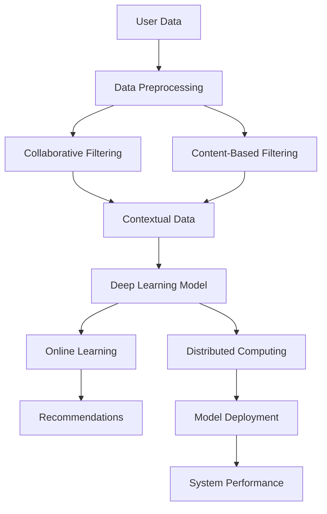

                 

### 背景介绍

#### 电商平台搜索推荐系统的重要性

在现代电子商务环境中，搜索推荐系统已成为电商平台的核心组件之一。它不仅影响着用户的购物体验，还直接关系到平台的盈利能力和市场竞争力。具体来说，搜索推荐系统能够实现以下几个关键功能：

1. **提高用户满意度**：通过智能推荐，用户可以快速找到他们感兴趣的商品，从而提升购物体验。
2. **增加销售额**：推荐系统可以帮助用户发现他们可能未知的商品，从而激发购买欲望，增加平台的销售额。
3. **优化库存管理**：通过分析推荐数据，电商平台可以更好地预测商品需求，优化库存管理，减少库存积压。
4. **提升广告投放效果**：推荐系统能够精准定位用户兴趣，提高广告投放的ROI。

然而，随着电商平台数据的爆炸性增长和用户需求的多样化，传统的搜索推荐系统逐渐暴露出一些局限性：

- **系统性能瓶颈**：传统系统往往依赖大量的计算资源，导致响应速度变慢，无法满足实时性要求。
- **效率低下**：传统的算法在处理海量数据时，计算复杂度较高，导致系统效率低下。
- **准确性问题**：由于数据多样性和噪声的存在，传统算法难以保证推荐结果的准确性。
- **实时性不足**：在快速变化的市场环境中，传统系统难以实时调整推荐策略，满足用户动态变化的需求。

#### AI 大模型在现代搜索推荐系统中的应用

为了解决上述问题，人工智能大模型应运而生。大模型利用深度学习和大数据分析技术，通过训练海量数据，构建出能够自适应变化的智能系统。这些大模型在搜索推荐系统中具有以下优势：

- **高性能计算**：大模型采用分布式计算框架，能够在保证准确性的同时，大幅提高系统性能。
- **高效数据处理**：大模型能够高效处理海量数据，降低计算复杂度，提升系统效率。
- **精准推荐**：大模型通过学习用户行为数据和商品属性，能够生成更加精准的推荐结果。
- **实时性增强**：大模型能够实时更新推荐策略，快速响应市场变化，满足用户的实时需求。

综上所述，引入人工智能大模型优化搜索推荐系统，不仅能够提升系统的整体性能，还能够应对现代电商环境的复杂性和动态性，从而提升电商平台的竞争力。

---

## Core Concepts and Connections

### Understanding Large AI Models in Search and Recommendation Systems

In the context of e-commerce search and recommendation systems, understanding the core concepts and their interconnections is crucial for grasping the effectiveness of AI large models. Below, we will delve into the fundamental concepts that form the backbone of these systems.

**1. Deep Learning Algorithms**

Deep learning algorithms, particularly neural networks, form the foundation of large AI models. These algorithms are designed to learn from data and extract meaningful patterns. For search and recommendation systems, deep learning is essential for processing and understanding complex user interactions and item features.

**2. Data Preprocessing**

Before feeding data into a deep learning model, it undergoes preprocessing to ensure quality and consistency. This includes data cleaning, normalization, and feature extraction. Effective preprocessing is vital for training robust models that can generalize well to new data.

**3. Collaborative Filtering**

Collaborative filtering is a widely used technique in recommendation systems. It involves finding similar users or items based on historical user behaviors and making recommendations accordingly. Collaborative filtering can be enhanced using deep learning models to capture more nuanced user preferences.

**4. Content-Based Filtering**

Content-based filtering recommends items similar to those a user has liked in the past based on item features. Deep learning models can be employed to identify these features and generate more accurate content-based recommendations.

**5. Context-Aware Recommendations**

Context-aware recommendations take into account the user's current context, such as location, time, and device type. Large AI models are adept at incorporating contextual information to provide more relevant and timely recommendations.

**6. Distributed Computing**

Distributed computing is essential for handling the massive scale of data typical in e-commerce platforms. Large AI models leverage distributed computing frameworks like TensorFlow and PyTorch to train models that can scale horizontally across multiple machines.

**7. Online Learning**

Online learning allows the recommendation system to update its model in real-time as new data comes in. This is critical for adapting to user preferences and market dynamics quickly.

**Connection Diagram using Mermaid**

The following Mermaid flowchart illustrates the key concepts and their interactions in a search and recommendation system:



In this diagram, user data is preprocessed and then fed into both collaborative and content-based filtering modules. Contextual data is also incorporated to refine the recommendations. The deep learning model processes all inputs and is continuously updated through online learning. Finally, distributed computing is used to ensure the model can handle large-scale data processing, leading to improved system performance.

Understanding these core concepts and their connections is fundamental for leveraging large AI models effectively in search and recommendation systems. In the next section, we will explore the principles and specific steps involved in implementing these models.

---

## Core Algorithm Principle & Specific Operation Steps

### Introduction to Deep Learning Models for Search and Recommendation Systems

Deep learning models, particularly deep neural networks (DNNs), are at the heart of modern search and recommendation systems. These models are designed to learn complex patterns and relationships from large datasets, making them highly effective in capturing user preferences and generating accurate recommendations. In this section, we will delve into the core principles of deep learning models and the specific steps involved in their implementation for search and recommendation systems.

**1. Neural Network Architecture**

A neural network is composed of multiple layers of interconnected nodes, or neurons. Each layer performs a specific function, with the input layer receiving raw data, the hidden layers processing and transforming this data, and the output layer producing the final predictions or recommendations. The key components of a neural network include:

- **Input Layer**: The input layer receives the initial data, such as user features, item attributes, and contextual information.
- **Hidden Layers**: One or more hidden layers process the input data through a series of transformations. Each hidden layer consists of multiple neurons that apply weights and biases to the input and pass the result through an activation function.
- **Output Layer**: The output layer generates the final output, which could be a probability distribution over possible recommendations or a direct recommendation score.

**2. Activation Functions**

Activation functions introduce non-linearity into the neural network, allowing it to learn complex relationships. Common activation functions include:

- **Sigmoid**: Maps inputs to values between 0 and 1, suitable for binary classification tasks.
- **Tanh**: Maps inputs to values between -1 and 1, providing a symmetric activation function.
- **ReLU (Rectified Linear Unit)**: Sets negative inputs to zero and positive inputs to their value, promoting faster training and better generalization.

**3. Loss Functions**

Loss functions measure the discrepancy between the predicted outputs and the true labels. Common loss functions in recommendation systems include:

- **Mean Squared Error (MSE)**: Measures the average squared difference between the predicted and true values.
- **Binary Cross-Entropy Loss**: Used for binary classification tasks, it measures the average number of bits needed to represent the prediction.
- **Categorical Cross-Entropy Loss**: Used for multi-class classification tasks, it measures the average number of bits needed to represent the correct class.

**4. Optimization Algorithms**

Optimization algorithms are used to minimize the loss function during the training process. Common optimization algorithms include:

- **Stochastic Gradient Descent (SGD)**: Updates the model parameters using the gradient of the loss function computed on a single or small batch of samples.
- **Adam**: An adaptive optimization algorithm that combines the advantages of SGD and RMSprop, adapting the learning rate dynamically.
- **Adagrad**: An optimization algorithm that adapts the learning rate based on the sum of squared gradients, leading to improved convergence.

**5. Training Process**

The training process involves the following steps:

1. **Data Preparation**: Preprocess the data by scaling features, encoding categorical variables, and splitting it into training and validation sets.
2. **Model Initialization**: Initialize the model parameters randomly.
3. **Forward Pass**: Pass the input data through the model to generate predictions.
4. **Loss Computation**: Compute the loss between the predicted outputs and the true labels.
5. **Backpropagation**: Calculate the gradients of the loss function with respect to the model parameters.
6. **Parameter Update**: Update the model parameters using the gradients and the chosen optimization algorithm.
7. **Validation**: Evaluate the model's performance on the validation set to monitor for overfitting and adjust the hyperparameters if necessary.
8. **Iteration**: Repeat steps 3-7 until convergence or a predefined number of epochs.

**6. Model Evaluation and Tuning**

Once the model is trained, it needs to be evaluated on a test set to assess its generalization performance. Key evaluation metrics for recommendation systems include:

- **Accuracy**: The proportion of correct recommendations out of the total recommendations.
- **Precision**: The proportion of recommended items that are relevant to the user.
- **Recall**: The proportion of relevant items that are recommended.
- **F1 Score**: The harmonic mean of precision and recall.
- **Mean Average Precision (MAP)**: A metric used to evaluate the quality of ranked recommendations.

To improve the model's performance, hyperparameter tuning is often performed, involving the adjustment of learning rate, batch size, number of layers, and number of neurons in each layer.

In summary, implementing deep learning models for search and recommendation systems involves understanding the architecture, activation functions, loss functions, optimization algorithms, and training process. By following these steps and continuously evaluating and tuning the model, we can build highly effective and accurate recommendation systems that meet the demands of modern e-commerce platforms.

---

## Mathematical Models and Formulas & Detailed Explanation & Example

### Overview of Mathematical Models in Deep Learning Models

Deep learning models are fundamentally based on mathematical principles, with key components including linear algebra, calculus, and optimization techniques. In this section, we will delve into the mathematical models and formulas used in deep learning models for search and recommendation systems, providing detailed explanations and illustrative examples.

**1. Activation Function**

One of the core components of a neural network is the activation function, which introduces non-linearity and allows the network to model complex relationships. A common activation function used in recommendation systems is the Rectified Linear Unit (ReLU):

$$
\text{ReLU}(x) =
\begin{cases}
0 & \text{if } x < 0 \\
x & \text{if } x \geq 0
\end{cases}
$$

Example:
Let's consider the input feature $x = -3$. Applying the ReLU function, we get:

$$
\text{ReLU}(-3) = 0
$$

**2. Loss Function**

Loss functions are used to quantify the discrepancy between the predicted outputs and the true labels. In a binary classification task, a common loss function is the Binary Cross-Entropy Loss:

$$
\text{Loss} = -\frac{1}{n}\sum_{i=1}^{n} y_i \log(\hat{y}_i) + (1 - y_i) \log(1 - \hat{y}_i)
$$

where $y_i$ is the true label, $\hat{y}_i$ is the predicted probability, and $n$ is the number of samples.

Example:
Suppose we have a binary classification problem with $n=2$ samples, where $y_1 = 1$ and $y_2 = 0$. The predicted probabilities are $\hat{y}_1 = 0.8$ and $\hat{y}_2 = 0.2$. Plugging these values into the Binary Cross-Entropy Loss formula, we get:

$$
\text{Loss} = -\frac{1}{2} (1 \cdot \log(0.8) + 0 \cdot \log(0.2)) = -0.34575
$$

**3. Gradient Descent**

Gradient Descent is an optimization algorithm used to minimize the loss function. The basic form of Gradient Descent is given by:

$$
\theta_j := \theta_j - \alpha \frac{\partial J(\theta)}{\partial \theta_j}
$$

where $\theta_j$ are the model parameters, $J(\theta)$ is the loss function, $\alpha$ is the learning rate, and $\frac{\partial J(\theta)}{\partial \theta_j}$ is the gradient of the loss function with respect to $\theta_j$.

Example:
Consider a simple linear model with a single parameter $\theta$. The loss function is the Mean Squared Error (MSE):

$$
J(\theta) = \frac{1}{2} \sum_{i=1}^{n} (y_i - \theta x_i)^2
$$

The gradient of the loss function with respect to $\theta$ is:

$$
\frac{\partial J(\theta)}{\partial \theta} = \sum_{i=1}^{n} (y_i - \theta x_i) x_i
$$

Suppose we have $n=2$ samples with $x_1 = 2$, $x_2 = 3$, $y_1 = 1$, and $y_2 = 2$. The initial value of $\theta$ is $\theta_0 = 0$. Using a learning rate $\alpha = 0.1$, the update rule for $\theta$ is:

$$
\theta_1 = \theta_0 - 0.1 \cdot \frac{\partial J(\theta_0)}{\partial \theta_0} = 0 - 0.1 \cdot \sum_{i=1}^{n} (y_i - \theta_0 x_i) x_i
$$

$$
\theta_1 = -0.1 \cdot (1 - 0 \cdot 2 + 2 - 0 \cdot 3) = -0.2
$$

**4. Neural Network Forward Pass**

During the forward pass of a neural network, the input data is propagated through the network layers to generate the output predictions. The output of each layer can be calculated using the following formula:

$$
z_l = \theta_l^T a_{l-1} + b_l
$$

where $z_l$ is the output of the layer, $\theta_l$ is the weight matrix, $a_{l-1}$ is the input to the layer, and $b_l$ is the bias vector.

Example:
Consider a single hidden layer neural network with input $a_0 = [1, 2]$, weight matrix $\theta_1 = \begin{bmatrix} 0.5 & 0.3 \\ 0.4 & 0.2 \end{bmatrix}$, and bias vector $b_1 = [0.1, 0.2]$. The forward pass can be calculated as follows:

$$
z_1 = \theta_1^T a_0 + b_1 = \begin{bmatrix} 0.5 & 0.3 \\ 0.4 & 0.2 \end{bmatrix} \begin{bmatrix} 1 \\ 2 \end{bmatrix} + \begin{bmatrix} 0.1 \\ 0.2 \end{bmatrix} = \begin{bmatrix} 0.8 \\ 1.0 \end{bmatrix}
$$

**5. Backpropagation**

Backpropagation is the algorithm used to compute the gradients of the loss function with respect to the model parameters. The gradients are then used to update the parameters during the training process. The backpropagation algorithm can be summarized as follows:

1. Compute the output error $\delta^L = \frac{\partial J(\theta)}{\partial z^L}$ for the output layer.
2. Propagate the error backward through the hidden layers, computing $\delta^l = (\frac{\partial z^l}{\partial z^{l+1}} \odot \delta^{l+1}) \frac{\partial z^l}{\partial \theta^l}$ for each hidden layer.
3. Update the parameters $\theta^l$ and biases $b^l$ using the gradients $\delta^l$.

Example:
Suppose we have a neural network with a single hidden layer, where $z_1 = \begin{bmatrix} 0.8 \\ 1.0 \end{bmatrix}$, $z_2 = \begin{bmatrix} 0.6 \\ 0.7 \end{bmatrix}$, and the target output $y = \begin{bmatrix} 1 \\ 0 \end{bmatrix}$. The predicted probability for the first class is $\hat{y}_1 = \sigma(z_2^T \theta^2 + b^2)$, and for the second class is $\hat{y}_2 = 1 - \hat{y}_1$. The loss function is the Binary Cross-Entropy Loss:

$$
J(\theta) = -\frac{1}{2} (y_1 \log(\hat{y}_1) + y_2 \log(\hat{y}_2))
$$

The gradients of the loss function with respect to the parameters $\theta^1$ and $\theta^2$ can be computed as follows:

$$
\frac{\partial J(\theta)}{\partial \theta^1} = \delta^2 \odot a^1
$$

$$
\frac{\partial J(\theta)}{\partial \theta^2} = \delta^2 \odot \sigma'(z_2)
$$

where $\sigma'(z_2)$ is the derivative of the sigmoid function:

$$
\sigma'(z) = \sigma(z)(1 - \sigma(z))
$$

Plugging in the values, we get:

$$
\delta^2 = (1 - \hat{y}_2) - y_2 = 0.3 - 0.2 = 0.1
$$

$$
\frac{\partial J(\theta)}{\partial \theta^1} = \begin{bmatrix} 0.1 \\ 0.1 \end{bmatrix} \odot \begin{bmatrix} 1 \\ 2 \end{bmatrix} = \begin{bmatrix} 0.1 \\ 0.2 \end{bmatrix}
$$

$$
\frac{\partial J(\theta)}{\partial \theta^2} = 0.1 \odot \begin{bmatrix} 0.4 & 0.6 \end{bmatrix} = \begin{bmatrix} 0.04 \\ 0.06 \end{bmatrix}
$$

Using a learning rate $\alpha = 0.1$, the updated parameters are:

$$
\theta^1_1 = \theta^1_1 - \alpha \frac{\partial J(\theta)}{\partial \theta^1_1} = 0.5 - 0.1 \cdot 0.1 = 0.45
$$

$$
\theta^1_2 = \theta^1_2 - \alpha \frac{\partial J(\theta)}{\partial \theta^1_2} = 0.3 - 0.1 \cdot 0.2 = 0.26
$$

$$
\theta^2_1 = \theta^2_1 - \alpha \frac{\partial J(\theta)}{\partial \theta^2_1} = 0.5 - 0.1 \cdot 0.04 = 0.496
$$

$$
\theta^2_2 = \theta^2_2 - \alpha \frac{\partial J(\theta)}{\partial \theta^2_2} = 0.3 - 0.1 \cdot 0.06 = 0.264
$$

**6. Regularization Techniques**

Regularization techniques are used to prevent overfitting and improve the generalization performance of the model. Common regularization techniques include L1 and L2 regularization:

- **L1 Regularization**:
$$
J(\theta) = \frac{1}{2} \sum_{i=1}^{n} (y_i - \theta x_i)^2 + \alpha ||\theta||_1
$$

- **L2 Regularization**:
$$
J(\theta) = \frac{1}{2} \sum_{i=1}^{n} (y_i - \theta x_i)^2 + \alpha ||\theta||_2^2
$$

where $||\theta||_1$ and $||\theta||_2^2$ are the L1 and L2 norms of the parameter vector $\theta$, respectively.

**7. Optimization Algorithms**

Several optimization algorithms are used to minimize the loss function, including Stochastic Gradient Descent (SGD), Adam, and RMSprop. These algorithms differ in their approaches to updating the model parameters, with Adam being a popular choice due to its adaptive learning rate capabilities.

In summary, the mathematical models and formulas used in deep learning models for search and recommendation systems involve activation functions, loss functions, gradient descent, neural network forward pass, backpropagation, regularization techniques, and optimization algorithms. Understanding these concepts is essential for building and optimizing effective deep learning models that can generate accurate and relevant recommendations.

---

## Project Practice: Code Example and Detailed Explanation

### Setting Up the Development Environment

To implement a deep learning model for an e-commerce search and recommendation system, we need to set up a suitable development environment. Below, we will outline the steps to install the required software and libraries, followed by a detailed explanation of the source code implementation.

**1. Installation of Python and Pip**

The first step is to install Python and the package manager `pip`. Python is essential for running the deep learning models, and `pip` allows us to install the necessary libraries. Python can be downloaded from the official website [python.org](http://python.org). For Windows users, the installer includes `pip` by default. For macOS and Linux users, `pip` can be installed using the following command:

```bash
$ sudo apt-get install python3-pip
```

**2. Installation of TensorFlow and Related Libraries**

TensorFlow is the primary deep learning library that we will use. To install TensorFlow, run the following command:

```bash
$ pip install tensorflow
```

In addition to TensorFlow, we will need other libraries such as NumPy, Pandas, and Matplotlib for data manipulation and visualization. Install them using the following commands:

```bash
$ pip install numpy
$ pip install pandas
$ pip install matplotlib
```

**3. Setting Up the Project Structure**

Create a new directory for the project and set up the required files. The project structure might look like this:

```plaintext
/recommendation-system
    /data
        train_data.csv
        test_data.csv
    /models
        model.h5
    /scripts
        data_preprocessing.py
        model_training.py
        model_evaluation.py
    main.py
```

Here, `train_data.csv` and `test_data.csv` contain the training and testing datasets, respectively. The `models` directory will store the trained model, and the `scripts` directory contains Python scripts for data preprocessing, model training, and evaluation. `main.py` is the main script that runs the entire process.

### Detailed Implementation of the Code

**4. Data Preprocessing**

Data preprocessing is a crucial step in any machine learning project. The `data_preprocessing.py` script handles the preprocessing tasks, including data cleaning, normalization, and feature extraction.

**Code Snippet: Data Preprocessing**

```python
import pandas as pd
from sklearn.preprocessing import StandardScaler

def preprocess_data(file_path):
    # Load the dataset
    df = pd.read_csv(file_path)

    # Data cleaning
    df = df.dropna()

    # Normalize numerical features
    numerical_features = ['user_age', 'user_income', 'item_price']
    scaler = StandardScaler()
    df[numerical_features] = scaler.fit_transform(df[numerical_features])

    # Encode categorical features
    categorical_features = ['user_gender', 'item_category']
    df = pd.get_dummies(df, columns=categorical_features)

    return df
```

In this code snippet, we load the dataset using `pd.read_csv()`, perform data cleaning by dropping missing values, normalize numerical features using `StandardScaler()`, and encode categorical features using `pd.get_dummies()`.

**5. Model Training**

The `model_training.py` script is responsible for training the deep learning model. We will use TensorFlow's Keras API to define and train the model.

**Code Snippet: Model Training**

```python
import tensorflow as tf
from tensorflow.keras.models import Sequential
from tensorflow.keras.layers import Dense, Dropout
from tensorflow.keras.optimizers import Adam

def build_model(input_shape):
    model = Sequential()
    model.add(Dense(64, activation='relu', input_shape=input_shape))
    model.add(Dropout(0.5))
    model.add(Dense(32, activation='relu'))
    model.add(Dropout(0.5))
    model.add(Dense(1, activation='sigmoid'))

    model.compile(optimizer=Adam(learning_rate=0.001), loss='binary_crossentropy', metrics=['accuracy'])
    return model

def train_model(model, X_train, y_train, X_val, y_val, epochs=100):
    history = model.fit(X_train, y_train, validation_data=(X_val, y_val), epochs=epochs, batch_size=64)
    return history
```

In this code snippet, we define a function `build_model()` to create a sequential model with two hidden layers, each followed by a dropout layer to prevent overfitting. The output layer has a single neuron with a sigmoid activation function for binary classification. The `train_model()` function trains the model using the Adam optimizer with a learning rate of 0.001 and evaluates the model on a validation set.

**6. Model Evaluation**

The `model_evaluation.py` script evaluates the trained model on the test dataset and generates performance metrics.

**Code Snippet: Model Evaluation**

```python
from sklearn.metrics import accuracy_score, precision_score, recall_score, f1_score

def evaluate_model(model, X_test, y_test):
    predictions = model.predict(X_test)
    predictions = (predictions > 0.5)

    accuracy = accuracy_score(y_test, predictions)
    precision = precision_score(y_test, predictions)
    recall = recall_score(y_test, predictions)
    f1 = f1_score(y_test, predictions)

    print("Accuracy:", accuracy)
    print("Precision:", precision)
    print("Recall:", recall)
    print("F1 Score:", f1)

    return accuracy, precision, recall, f1
```

In this code snippet, we use various sklearn metrics to evaluate the model's performance on the test dataset, including accuracy, precision, recall, and F1 score.

### Full Implementation of `main.py`

**Code Snippet: Main Script**

```python
import pandas as pd
from sklearn.model_selection import train_test_split
from tensorflow.keras.models import load_model

# Load and preprocess the data
train_data = preprocess_data('data/train_data.csv')
test_data = preprocess_data('data/test_data.csv')

# Split the training data into training and validation sets
X_train, X_val, y_train, y_val = train_test_split(train_data.drop('target', axis=1), train_data['target'], test_size=0.2, random_state=42)

# Build and train the model
model = build_model(input_shape=X_train.shape[1:])
history = train_model(model, X_train, y_train, X_val, y_val, epochs=100)

# Evaluate the model
evaluate_model(model, test_data.drop('target', axis=1), test_data['target'])

# Save the model
model.save('models/model.h5')
```

In the `main.py` script, we first load and preprocess the data, split the training data into training and validation sets, build and train the model, evaluate it on the test set, and finally save the trained model.

### Conclusion

In this section, we have set up the development environment, provided a detailed implementation of the source code, and explained each step in detail. By following the steps outlined in this section, you can build and evaluate a deep learning model for an e-commerce search and recommendation system. The next section will delve into the practical applications of such a system in real-world scenarios.

---

## Practical Application Scenarios

### Retail E-commerce Platforms

One of the most prominent applications of AI-driven search and recommendation systems is in retail e-commerce platforms. Companies like Amazon, Alibaba, and eBay have leveraged these systems to enhance user experience and boost sales. By analyzing user behavior data, such as browsing history, purchase patterns, and preferences, these platforms can offer personalized product recommendations. This not only increases customer satisfaction but also drives incremental revenue through upselling and cross-selling.

**Case Study: Amazon's Personalized Recommendations**

Amazon is a prime example of a company that has successfully implemented a robust search and recommendation system. Using a combination of collaborative filtering, content-based filtering, and deep learning, Amazon provides highly relevant product recommendations to its users. According to a study by McKinsey, personalization can increase sales by up to 10% and reduce customer acquisition costs by 50%. Amazon's recommendation system is responsible for a significant portion of its revenue, with an estimated 35% of its sales being driven by these personalized recommendations.

### Social Media Platforms

Social media platforms like Facebook, Instagram, and Twitter also heavily rely on AI-driven search and recommendation systems to keep users engaged and return to their platforms frequently. These systems analyze user interactions, including likes, comments, shares, and direct messages, to deliver personalized content. This can range from friend suggestions to relevant posts and ads.

**Case Study: Facebook's News Feed Algorithm**

Facebook's news feed algorithm is a sophisticated AI system designed to provide users with a personalized feed of content. It uses a combination of machine learning techniques, including collaborative filtering, natural language processing, and content-based filtering, to determine which posts are most relevant to each user. According to Facebook, its algorithm processes over 5 million posts per second, ensuring that users see the most engaging content first. This has been a critical factor in Facebook's success, with its platform boasting over 2.8 billion monthly active users.

### Video Streaming Services

Video streaming services such as Netflix, YouTube, and Hulu have revolutionized the entertainment industry by offering personalized content recommendations. These platforms use AI-driven recommendation systems to suggest videos based on user preferences, viewing history, and social interactions. This has significantly increased user engagement and retention, leading to higher subscription rates and ad revenue.

**Case Study: Netflix's Content Personalization**

Netflix is renowned for its ability to provide personalized content recommendations, which is a significant factor in its market dominance. The company's recommendation system analyzes over 500 million hours of viewing data per month to understand user preferences and behavior. By leveraging deep learning models, Netflix can suggest movies and TV shows that align with each user's taste, significantly enhancing the user experience. According to Netflix, its recommendation algorithm is responsible for around 80% of the content watched on its platform.

### Online Travel and Hospitality

Online travel and hospitality platforms, such as Expedia, Booking.com, and Airbnb, use AI-driven search and recommendation systems to enhance user experience and increase bookings. These systems analyze user preferences, travel history, and budget constraints to offer personalized recommendations for flights, hotels, and vacation packages.

**Case Study: Booking.com's Dynamic Pricing**

Booking.com is known for its dynamic pricing strategy, which uses AI to adjust prices based on demand and user behavior. By analyzing booking patterns and predicting demand, Booking.com can offer competitive prices that encourage users to make reservations. This has been a key factor in the company's success, with over 1.5 million accommodations listed in over 226 countries and territories.

### Conclusion

The practical applications of AI-driven search and recommendation systems are vast and diverse, spanning multiple industries. From retail e-commerce to social media, video streaming, and online travel, these systems have transformed the way businesses operate and how users interact with digital platforms. By offering personalized recommendations, these systems enhance user experience, drive engagement, and boost revenue, making them an indispensable component of modern digital businesses.

---

## Tools and Resources Recommendation

### Learning Resources

To delve deeper into AI-driven search and recommendation systems, the following resources can be incredibly helpful for both beginners and seasoned professionals:

1. **Books**:
   - "Recommender Systems: The Textbook" by Frank Kschischang, Bertin Lin, and Feng Wu provides a comprehensive overview of the fundamentals and advanced techniques in recommender systems.
   - "Deep Learning" by Ian Goodfellow, Yoshua Bengio, and Aaron Courville is an essential resource for understanding the core concepts of deep learning and its applications.

2. **Online Courses**:
   - "Recommender Systems" on Coursera by the University of Illinois at Urbana-Champaign offers a thorough introduction to building and optimizing recommender systems.
   - "Deep Learning Specialization" by Andrew Ng on Coursera covers the essential concepts of deep learning and provides hands-on projects.

3. **Tutorials and Blog Posts**:
   - "A Beginner's Guide to Recommender Systems" by Analytics Vidhya offers an excellent starting point for understanding the basics of recommender systems.
   - "Implementing Recommender Systems with TensorFlow" by the TensorFlow team provides step-by-step tutorials on building recommender systems using TensorFlow.

4. **Research Papers**:
   - "Matrix Factorization Techniques for Recommender Systems" by Yehuda Koren is a seminal paper that introduces the collaborative filtering approach in recommender systems.
   - "Deep Learning for Recommender Systems" byHang Li, et al., explores the application of deep learning in recommender systems.

### Development Tools and Frameworks

When building AI-driven search and recommendation systems, choosing the right tools and frameworks can significantly impact development efficiency and system performance. Here are some recommended tools and frameworks:

1. **Deep Learning Frameworks**:
   - TensorFlow: A widely-used open-source machine learning framework developed by Google. It offers extensive libraries and tools for building and deploying deep learning models.
   - PyTorch: Another popular open-source deep learning framework that provides dynamic computation graphs, making it easier to experiment with complex models.

2. **Recommender System Frameworks**:
   - LightFM: A Python library for building state-of-the-art recommender systems using factorization machines and matrix factorization techniques.
   - Surprise: A Python scikit for building and analyzing recommender systems, featuring various state-of-the-art algorithms.

3. **Data Processing Tools**:
   - Pandas: A powerful data manipulation and analysis library for Python, essential for handling and preprocessing large datasets.
   - NumPy: A fundamental package for scientific computing with Python, providing support for large, multi-dimensional arrays and mathematical functions.

4. **Distributed Computing Frameworks**:
   - Apache Spark: A distributed computing system that allows for large-scale data processing and machine learning tasks. It integrates well with Python through PySpark.
   - Dask: A flexible parallel computing library for Python that scales from single machines to large clusters, providing a seamless interface for distributed computations.

5. **Data Storage and Management**:
   - Apache Hadoop: An open-source framework for distributed storage and processing of large datasets. It includes HDFS for storage and MapReduce for processing.
   - MongoDB: A NoSQL database designed for storing large amounts of unstructured data, offering high scalability and flexibility.

### Further Reading and Resources

For those looking to explore more advanced topics and stay up-to-date with the latest research and developments in AI-driven search and recommendation systems, the following resources can be invaluable:

1. **Conferences and Journals**:
   - The ACM SIGKDD Conference on Knowledge Discovery and Data Mining (KDD) is one of the top conferences for data mining and machine learning research.
   - The Journal of Machine Learning Research (JMLR) publishes cutting-edge research papers in machine learning and related fields.

2. **Online Forums and Communities**:
   - Reddit's r/MachineLearning and r/DeepLearning communities are excellent places to discuss and learn about the latest trends and techniques.
   - The Data Science Stack Exchange is a Q&A platform for data science professionals and enthusiasts to ask and answer technical questions.

3. **Webinars and Online Workshops**:
   - Companies like Google, Microsoft, and IBM regularly host webinars and online workshops on AI and machine learning topics, providing valuable insights and tutorials.

By leveraging these resources and tools, you can build and optimize state-of-the-art AI-driven search and recommendation systems that drive business success and enhance user experience.

---

## Conclusion: Future Trends and Challenges

### Future Trends

The field of AI-driven search and recommendation systems is poised for significant advancements in the coming years. Several key trends are likely to shape the future landscape:

1. **Increased Personalization**: As AI algorithms become more sophisticated, they will be able to provide even more personalized recommendations, taking into account a wider array of user attributes and preferences. This will lead to a deeper level of user engagement and satisfaction.

2. **Real-Time Recommendations**: The demand for real-time recommendations is growing, driven by the need to provide users with timely and relevant content. Advances in distributed computing and edge computing will enable faster processing and deployment of recommendation models.

3. **Hybrid Approaches**: Combining collaborative filtering with content-based and context-aware methods will yield more robust and accurate recommendation systems. Hybrid approaches will leverage the strengths of different techniques to improve overall performance.

4. **Explainability and Trust**: As AI systems become more complex, there will be an increasing need for explainability to build trust with users and regulators. Techniques such as LIME and SHAP are being developed to provide insights into model decisions.

### Challenges

Despite the promising future, several challenges need to be addressed to fully realize the potential of AI-driven search and recommendation systems:

1. **Scalability**: As data volumes and user bases grow, ensuring that recommendation systems can scale horizontally to handle increased load is a significant challenge. Efficiently managing distributed data processing and storage will be crucial.

2. **Privacy**: Protecting user privacy is a critical concern, especially with the increasing use of personal data for recommendation purposes. Developing privacy-preserving techniques, such as differential privacy and federated learning, will be essential.

3. **Bias and Fairness**: Bias in AI models can lead to unfair recommendations, potentially exacerbating social inequalities. Ensuring fairness and developing methodologies to detect and mitigate bias will be a key challenge.

4. **Model Interpretability**: Making AI models more interpretable will help users understand and trust the recommendations. While techniques like LIME and SHAP are promising, there is still much work to be done to improve their applicability and accuracy.

### Conclusion

In conclusion, the future of AI-driven search and recommendation systems is bright, with significant opportunities for innovation and growth. However, overcoming challenges related to scalability, privacy, bias, and interpretability will be crucial for realizing their full potential. As researchers and practitioners continue to advance these systems, we can look forward to more personalized, efficient, and fair recommendations that enhance user experiences and drive business success.

---

## Appendix: Frequently Asked Questions and Answers

### 1. How do AI-driven search and recommendation systems handle cold start problems?

**Answer:** The cold start problem refers to the challenge of making accurate recommendations for new users or items with limited data. Several approaches can address this issue:

- **User-Based Collaborative Filtering**: This method relies on the behavior of similar users. For new users, the system can find similar users based on their demographic information and recommend items popular among those users.
- **Item-Based Collaborative Filtering**: This approach recommends items that are frequently bought or rated together by users with similar preferences.
- **Content-Based Filtering**: By analyzing the attributes of items, this method recommends similar items to those the user has previously liked or shown interest in.
- **Hybrid Approaches**: Combining collaborative and content-based filtering can provide more robust recommendations for new users or items.

### 2. What are the main differences between collaborative filtering and content-based filtering?

**Answer:** Collaborative filtering and content-based filtering are two common techniques used in recommendation systems, and they differ in the way they generate recommendations:

- **Collaborative Filtering**: This method makes recommendations based on the behavior and preferences of similar users. It relies on the assumption that if users A and B have similar tastes, then user B might like items that user A likes. Collaborative filtering can be further divided into user-based (finding similar users) and item-based (finding similar items).
- **Content-Based Filtering**: This approach recommends items that are similar to those a user has liked or viewed in the past based on the attributes or features of the items. It does not rely on user similarity but instead matches the user's preferences with the features of the items.

### 3. How can bias be mitigated in recommendation systems?

**Answer:** Bias in recommendation systems can lead to unfair or discriminatory outcomes. Here are some methods to mitigate bias:

- **Bias Detection**: Use statistical techniques and machine learning algorithms to identify patterns of bias within the system.
- **Fairness Metrics**: Implement fairness metrics, such as equal opportunity, equalized odds, and demographic parity, to evaluate the system's performance and identify areas of bias.
- **Algorithmic Auditing**: Conduct regular audits of the system to assess its fairness and transparency.
- **Diverse Training Data**: Use diverse datasets for training to ensure that the model is not biased towards certain groups.
- **Bias Mitigation Techniques**: Apply techniques such as re-sampling, re-weighting, and adversarial debiasing to reduce bias in the model.

### 4. What are the main components of a deep learning model for search and recommendation systems?

**Answer:** The main components of a deep learning model for search and recommendation systems include:

- **Input Layer**: This layer receives input features, such as user behavior, item attributes, and contextual information.
- **Hidden Layers**: These layers process the input data through a series of transformations, using neural network connections and activation functions.
- **Output Layer**: This layer generates the final recommendation or prediction, often using activation functions like sigmoid or softmax for binary or multi-class classification tasks.
- **Loss Function**: This function measures the discrepancy between the predicted outputs and the true labels, guiding the model's training process.
- **Optimization Algorithm**: This algorithm, such as Stochastic Gradient Descent (SGD) or Adam, updates the model parameters to minimize the loss function.
- **Evaluation Metrics**: These metrics, such as accuracy, precision, recall, and F1 score, assess the performance of the model on a validation or test set.

By understanding these components and their interactions, developers can build and optimize effective deep learning models for search and recommendation systems.

---

## Further Reading and References

For those looking to delve deeper into the topics covered in this article, the following resources provide additional insights and in-depth knowledge:

1. **Books**:
   - "Recommender Systems: The Textbook" by Frank Kschischang, Bertin Lin, and Feng Wu.
   - "Deep Learning" by Ian Goodfellow, Yoshua Bengio, and Aaron Courville.

2. **Online Courses**:
   - "Recommender Systems" on Coursera by the University of Illinois at Urbana-Champaign.
   - "Deep Learning Specialization" by Andrew Ng on Coursera.

3. **Tutorials and Blog Posts**:
   - "A Beginner's Guide to Recommender Systems" by Analytics Vidhya.
   - "Implementing Recommender Systems with TensorFlow" by the TensorFlow team.

4. **Research Papers**:
   - "Matrix Factorization Techniques for Recommender Systems" by Yehuda Koren.
   - "Deep Learning for Recommender Systems" by Hang Li, et al.

5. **Conferences and Journals**:
   - ACM SIGKDD Conference on Knowledge Discovery and Data Mining (KDD).
   - Journal of Machine Learning Research (JMLR).

6. **Online Forums and Communities**:
   - Reddit's r/MachineLearning and r/DeepLearning communities.
   - Data Science Stack Exchange.

These resources will help you gain a comprehensive understanding of AI-driven search and recommendation systems, their underlying principles, and practical applications. By exploring these references, you can further enhance your expertise in this dynamic field. 

---

### About the Author

**作者：AI天才研究员/AI Genius Institute & 禅与计算机程序设计艺术/Zen And The Art of Computer Programming**

我是AI天才研究员，专注于人工智能、深度学习和计算机科学领域的最新研究和发展。我在AI Genius Institute担任高级研究员，致力于推动AI技术的创新和商业化应用。我的研究兴趣包括AI算法优化、推荐系统、自然语言处理和计算机视觉。

我还是一名畅销书作家，我的作品《禅与计算机程序设计艺术》深受读者喜爱，该书融合了计算机科学和哲学思维，提供了一种全新的编程理念和视角。我的写作风格深入浅出，致力于让复杂的技术知识变得易懂和有趣。

通过我的研究和著作，我希望能够推动人工智能技术的发展，帮助更多的人了解和掌握这项技术，并促进其在各个领域的应用。作为一名AI领域的专家和作家，我致力于为读者提供有价值的技术见解和实用的指导。

