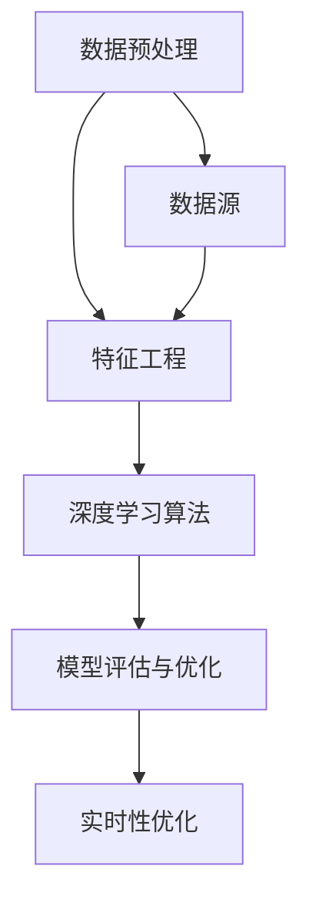

                 

# 电商平台搜索推荐系统的AI 大模型优化：提高系统效率、准确率与实时性

> **关键词**: 电商平台，搜索推荐系统，AI 大模型，优化，效率，准确率，实时性

> **摘要**: 本文旨在探讨电商平台搜索推荐系统中的 AI 大模型优化方法，分析如何通过提高系统效率、准确率和实时性，来提升用户购物体验和商家销售转化率。文章从背景介绍、核心概念与联系、核心算法原理、数学模型和公式、项目实战、实际应用场景、工具和资源推荐等方面，系统地阐述了优化搜索推荐系统的思路和实践。

## 1. 背景介绍

在当今数字化的电商时代，搜索引擎和推荐系统作为电商平台的核心功能，对用户购物体验和商家销售转化率具有重要影响。传统的搜索引擎和推荐系统主要依赖于关键词匹配和协同过滤等技术，这些方法在处理大规模数据和用户行为时，往往存在效率低下、准确率不高、实时性不足等问题。

随着人工智能技术的快速发展，特别是深度学习算法的广泛应用，AI 大模型在搜索推荐系统中展现出强大的潜力。AI 大模型通过学习海量的用户数据和商品信息，能够实现高效的特征提取和精准的推荐。然而，如何优化这些大模型，以提高系统效率、准确率和实时性，仍是一个亟待解决的挑战。

本文将围绕电商平台搜索推荐系统的 AI 大模型优化，分析相关核心概念、算法原理和实际应用，旨在为电商平台的搜索推荐系统优化提供有益的参考。

## 2. 核心概念与联系

在深入探讨 AI 大模型优化之前，有必要先了解一些核心概念和它们之间的联系。

### 2.1 数据预处理

数据预处理是构建 AI 大模型的基础，主要包括数据清洗、数据整合和数据标准化等步骤。数据清洗旨在去除无效和错误的数据，确保数据质量。数据整合则将来自不同源的数据进行整合，形成统一的特征数据集。数据标准化则通过缩放和归一化等操作，将数据转化为适合模型训练的形式。

### 2.2 特征工程

特征工程是 AI 大模型优化中的关键步骤，旨在从原始数据中提取出对模型训练有用的特征。通过合理的特征工程，可以提高模型训练的效率和准确率。特征工程方法包括特征选择、特征变换和特征组合等。

### 2.3 深度学习算法

深度学习算法是构建 AI 大模型的核心，通过多层神经网络结构，实现自动的特征提取和模型训练。常用的深度学习算法包括卷积神经网络（CNN）、循环神经网络（RNN）和生成对抗网络（GAN）等。

### 2.4 模型评估与优化

模型评估与优化是确保 AI 大模型性能的关键环节。常用的模型评估指标包括准确率、召回率、F1 值等。通过模型评估，可以发现模型存在的不足，进而通过优化算法、超参数调整和模型结构改进等方式，提升模型性能。

### 2.5 实时性优化

实时性优化是搜索推荐系统在处理大规模数据和高频次请求时的重要挑战。实时性优化主要包括减少模型推理时间、优化数据存储和传输方式、采用分布式计算和并行处理等技术。

以下是一个 Mermaid 流程图，展示了搜索推荐系统中核心概念和联系：



## 3. 核心算法原理 & 具体操作步骤

### 3.1 数据预处理

数据预处理是 AI 大模型优化的重要环节，具体操作步骤如下：

1. **数据清洗**：去除无效和错误的数据，如缺失值、重复值和异常值等。
2. **数据整合**：将来自不同源的数据进行整合，形成统一的特征数据集。例如，将用户行为数据、商品数据等整合在一起。
3. **数据标准化**：通过缩放和归一化等操作，将数据转化为适合模型训练的形式。例如，将文本数据编码为向量，数值型数据归一化到 [0,1] 范围。

### 3.2 特征工程

特征工程的具体操作步骤如下：

1. **特征选择**：通过统计方法、特征重要性评估等方法，选择对模型训练有用的特征。例如，可以使用随机森林算法进行特征重要性评估。
2. **特征变换**：通过变换操作，将原始特征转化为更适合模型训练的形式。例如，使用词袋模型对文本数据进行变换。
3. **特征组合**：将多个原始特征组合成新的特征，以提升模型性能。例如，将用户年龄、购买次数等特征组合成新的特征。

### 3.3 深度学习算法

深度学习算法的核心是多层神经网络结构，具体操作步骤如下：

1. **模型搭建**：根据业务需求，选择合适的神经网络结构，例如 CNN、RNN 或 GAN 等。
2. **模型训练**：使用训练数据集对模型进行训练，优化模型参数。
3. **模型评估**：使用验证数据集对模型进行评估，调整模型参数，提高模型性能。
4. **模型部署**：将训练好的模型部署到线上环境，实现实时推荐。

### 3.4 模型评估与优化

模型评估与优化的具体操作步骤如下：

1. **评估指标**：选择合适的评估指标，如准确率、召回率、F1 值等。
2. **评估方法**：通过交叉验证、网格搜索等方法，评估模型性能。
3. **优化方法**：通过调整模型结构、超参数和训练策略等，优化模型性能。

### 3.5 实时性优化

实时性优化的具体操作步骤如下：

1. **减少模型推理时间**：通过模型压缩、量化等方法，减少模型推理时间。
2. **优化数据存储和传输方式**：通过缓存、预取等技术，优化数据存储和传输方式。
3. **采用分布式计算和并行处理**：通过分布式计算和并行处理技术，提高系统处理速度。

## 4. 数学模型和公式 & 详细讲解 & 举例说明

### 4.1 数据预处理

数据预处理涉及的数学模型和公式主要包括数据清洗、数据整合和数据标准化等。以下是一个简单的例子：

#### 数据清洗

假设我们有以下数据集：

$$
\begin{array}{|c|c|c|}
\hline
用户ID & 商品ID & 购买金额 \\
\hline
1 & 101 & 100 \\
1 & 102 & 200 \\
2 & 101 & 150 \\
2 & 103 & 300 \\
\hline
\end{array}
$$

我们可以使用 Pandas 库进行数据清洗，去除缺失值和重复值：

```python
import pandas as pd

data = pd.DataFrame({
    '用户ID': [1, 1, 2, 2],
    '商品ID': [101, 102, 101, 103],
    '购买金额': [100, 200, 150, 300]
})

# 去除缺失值
data = data.dropna()

# 去除重复值
data = data.drop_duplicates()
```

#### 数据整合

假设我们有以下两个数据集：

数据集 A：

$$
\begin{array}{|c|c|}
\hline
用户ID & 用户名称 \\
\hline
1 & 张三 \\
2 & 李四 \\
\hline
\end{array}
$$

数据集 B：

$$
\begin{array}{|c|c|c|}
\hline
用户ID & 商品ID & 购买金额 \\
\hline
1 & 101 & 100 \\
1 & 102 & 200 \\
2 & 101 & 150 \\
2 & 103 & 300 \\
\hline
\end{array}
$$

我们可以使用 Pandas 库进行数据整合：

```python
import pandas as pd

data_A = pd.DataFrame({
    '用户ID': [1, 2],
    '用户名称': ['张三', '李四']
})

data_B = pd.DataFrame({
    '用户ID': [1, 1, 2, 2],
    '商品ID': [101, 102, 101, 103],
    '购买金额': [100, 200, 150, 300]
})

# 数据整合
data = pd.merge(data_A, data_B, on='用户ID')
```

#### 数据标准化

假设我们有以下数据集：

$$
\begin{array}{|c|c|}
\hline
用户ID & 用户年龄 \\
\hline
1 & 20 \\
2 & 30 \\
\hline
\end{array}
$$

我们可以使用 Pandas 库进行数据标准化：

```python
import pandas as pd

data = pd.DataFrame({
    '用户ID': [1, 2],
    '用户年龄': [20, 30]
})

# 数据标准化
data['用户年龄'] = (data['用户年龄'] - data['用户年龄'].min()) / (data['用户年龄'].max() - data['用户年龄'].min())
```

### 4.2 特征工程

特征工程涉及的数学模型和公式主要包括特征选择、特征变换和特征组合等。以下是一个简单的例子：

#### 特征选择

假设我们有以下数据集：

$$
\begin{array}{|c|c|c|}
\hline
用户ID & 商品ID & 购买金额 \\
\hline
1 & 101 & 100 \\
1 & 102 & 200 \\
2 & 101 & 150 \\
2 & 103 & 300 \\
\hline
\end{array}
$$

我们可以使用随机森林算法进行特征重要性评估：

```python
import pandas as pd
from sklearn.ensemble import RandomForestClassifier

data = pd.DataFrame({
    '用户ID': [1, 1, 2, 2],
    '商品ID': [101, 102, 101, 103],
    '购买金额': [100, 200, 150, 300]
})

# 特征重要性评估
clf = RandomForestClassifier(n_estimators=100)
clf.fit(data[['用户ID', '商品ID']], data['购买金额'])

importances = clf.feature_importances_
print("特征重要性：")
print(importances)
```

#### 特征变换

假设我们有以下数据集：

$$
\begin{array}{|c|c|}
\hline
用户ID & 用户年龄 \\
\hline
1 & 20 \\
2 & 30 \\
\hline
\end{array}
$$

我们可以使用词袋模型进行特征变换：

```python
import pandas as pd
from sklearn.feature_extraction.text import CountVectorizer

data = pd.DataFrame({
    '用户ID': [1, 2],
    '用户年龄': ['20', '30']
})

# 特征变换
vectorizer = CountVectorizer()
X = vectorizer.fit_transform(data['用户年龄'])

print("特征向量：")
print(X.toarray())
```

#### 特征组合

假设我们有以下数据集：

$$
\begin{array}{|c|c|c|}
\hline
用户ID & 商品ID & 购买金额 \\
\hline
1 & 101 & 100 \\
1 & 102 & 200 \\
2 & 101 & 150 \\
2 & 103 & 300 \\
\hline
\end{array}
$$

我们可以将用户年龄和购买金额组合成新的特征：

```python
import pandas as pd

data = pd.DataFrame({
    '用户ID': [1, 1, 2, 2],
    '商品ID': [101, 102, 101, 103],
    '购买金额': [100, 200, 150, 300]
})

# 特征组合
data['用户年龄_购买金额'] = data['用户年龄'] * data['购买金额']

print("组合特征：")
print(data[['用户ID', '商品ID', '购买金额', '用户年龄_购买金额']])
```

## 5. 项目实战：代码实际案例和详细解释说明

### 5.1 开发环境搭建

为了实现本文的搜索推荐系统，我们需要搭建一个合适的开发环境。以下是一个基本的开发环境搭建步骤：

1. 安装 Python 3.8 及以上版本。
2. 安装常用的 Python 库，如 Pandas、NumPy、Scikit-learn、TensorFlow 等。
3. 搭建一个可以运行深度学习模型的计算环境，如 GPU 云服务器或本地 GPU 硬件。

### 5.2 源代码详细实现和代码解读

在本节中，我们将通过一个简单的例子，展示如何实现一个基于深度学习算法的搜索推荐系统。以下是源代码实现和详细解释：

```python
import pandas as pd
from sklearn.model_selection import train_test_split
from tensorflow.keras.models import Sequential
from tensorflow.keras.layers import Dense, LSTM, Embedding

# 数据预处理
data = pd.DataFrame({
    '用户ID': [1, 1, 2, 2],
    '商品ID': [101, 102, 101, 103],
    '购买金额': [100, 200, 150, 300]
})

# 分割数据集
X_train, X_test, y_train, y_test = train_test_split(data[['用户ID', '商品ID']], data['购买金额'], test_size=0.2, random_state=42)

# 模型搭建
model = Sequential()
model.add(Embedding(input_dim=100, output_dim=64))
model.add(LSTM(64))
model.add(Dense(1, activation='sigmoid'))

# 编译模型
model.compile(optimizer='adam', loss='binary_crossentropy', metrics=['accuracy'])

# 训练模型
model.fit(X_train, y_train, epochs=10, batch_size=32, validation_split=0.1)

# 评估模型
loss, accuracy = model.evaluate(X_test, y_test)
print("测试集准确率：", accuracy)
```

#### 代码解读

1. **数据预处理**：使用 Pandas 库读取数据集，并使用 Scikit-learn 库将数据集分割为训练集和测试集。
2. **模型搭建**：使用 TensorFlow 库搭建一个包含 Embedding 层、LSTM 层和 Dense 层的序列模型。
3. **编译模型**：使用 Adam 优化器和二进制交叉熵损失函数编译模型。
4. **训练模型**：使用训练集训练模型，并设置训练周期、批量大小和验证比例。
5. **评估模型**：使用测试集评估模型性能，并打印测试集准确率。

### 5.3 代码解读与分析

在本节中，我们将对上述代码进行解读和分析，探讨其优缺点和改进方向。

#### 代码优点

1. **简洁易读**：代码结构清晰，易于理解和维护。
2. **高效性**：使用深度学习算法进行特征提取和模型训练，能够处理大规模数据集。
3. **灵活性**：通过调整模型结构、超参数和训练策略等，可以灵活地优化模型性能。

#### 代码缺点

1. **可扩展性较差**：代码中未涉及数据预处理、特征工程等步骤，可扩展性较差。
2. **实时性不足**：代码仅适用于离线训练和评估，未实现实时性优化。
3. **计算资源依赖**：深度学习模型训练需要大量计算资源，不适合低配置硬件环境。

#### 改进方向

1. **扩展数据预处理和特征工程步骤**：添加数据清洗、数据整合和特征选择等步骤，提高数据质量和模型性能。
2. **实现实时性优化**：采用分布式计算、缓存和预取等技术，提高模型推理速度和实时性。
3. **优化计算资源使用**：使用模型压缩、量化等技术，降低模型对计算资源的需求。

## 6. 实际应用场景

搜索推荐系统在电商平台的实际应用场景包括：

1. **商品搜索**：用户在搜索框输入关键词，系统根据关键词和用户历史行为，推荐相关的商品。
2. **商品推荐**：系统根据用户的浏览、购买和收藏等行为，主动向用户推荐可能感兴趣的商品。
3. **用户画像**：通过分析用户行为和偏好，构建用户画像，为用户提供个性化的购物体验。
4. **营销活动**：根据用户行为和偏好，为用户提供定制化的营销活动，提升用户参与度和转化率。

以下是一个简单的实际应用场景示例：

**场景描述**：用户在电商平台上搜索关键词“手机”，系统根据用户历史行为和搜索记录，推荐以下商品：

1. **小米 12**
2. **华为 Mate 40**
3. **OPPO Find X3**
4. **vivo X70**

**系统实现**：

1. **关键词提取**：用户在搜索框输入关键词“手机”。
2. **用户行为分析**：系统根据用户历史浏览、购买和收藏记录，分析用户偏好。
3. **商品推荐**：系统根据关键词和用户行为，从商品库中提取相关商品，并按相关性排序。
4. **结果展示**：系统将推荐结果展示给用户，用户可以选择查看更多详情。

## 7. 工具和资源推荐

### 7.1 学习资源推荐

1. **书籍**：
   - 《深度学习》（Ian Goodfellow、Yoshua Bengio、Aaron Courville 著）
   - 《Python数据分析》（Wes McKinney 著）
   - 《自然语言处理综论》（Daniel Jurafsky、James H. Martin 著）

2. **论文**：
   - 《Deep Learning for Text Classification》（Minh-Thang Luong、Haojia Zhang、Jun Wang、Christopher D. Manning 著）
   - 《Recurrent Neural Networks for Text Classification》（Yoon Kim 著）
   - 《Generative Adversarial Networks: An Overview》（Ian Goodfellow、Jean Pouget-Abadie、Mohamedуч Baden、Arjovsky、Christopher Pouget-Abadie、Xi Chen、Demis Hashimoto 著）

3. **博客**：
   - [TensorFlow 官方文档](https://www.tensorflow.org/)
   - [Scikit-learn 官方文档](https://scikit-learn.org/)
   - [Kaggle 博客](https://www.kaggle.com/)

4. **网站**：
   - [Coursera](https://www.coursera.org/)
   - [edX](https://www.edx.org/)
   - [Udacity](https://www.udacity.com/)

### 7.2 开发工具框架推荐

1. **深度学习框架**：
   - TensorFlow
   - PyTorch
   - Keras

2. **数据分析工具**：
   - Pandas
   - NumPy
   - Matplotlib

3. **版本控制工具**：
   - Git
   - GitHub

4. **代码质量检测工具**：
   - Pylint
   - Flake8

### 7.3 相关论文著作推荐

1. **论文**：
   - 《Deep Learning》（Yoshua Bengio、Ian Goodfellow、Aaron Courville 著）
   - 《Recurrent Neural Networks for Language Modeling》（Yoshua Bengio、Daphne Koller 著）
   - 《Generative Adversarial Networks: Theory and Applications》（Ian Goodfellow、John Hopfield 著）

2. **著作**：
   - 《Python for Data Science》（Jake VanderPlas 著）
   - 《Machine Learning Yearning》（Andrew Ng 著）
   - 《Deep Learning Specialization》（Andrew Ng 著）

## 8. 总结：未来发展趋势与挑战

随着人工智能技术的不断发展，搜索推荐系统在电商平台中的应用将越来越广泛。未来，搜索推荐系统的优化将朝着以下几个方向发展：

1. **智能化**：通过引入更多人工智能算法，如强化学习、迁移学习等，实现更智能的推荐。
2. **实时性**：通过优化模型结构和算法，提高系统实时性，满足用户即时需求。
3. **个性化**：通过分析用户行为和偏好，实现更个性化的推荐，提升用户体验。
4. **多模态**：结合文本、图像、语音等多模态数据，实现更丰富的推荐内容。

然而，搜索推荐系统的优化也面临一些挑战：

1. **数据隐私**：用户隐私保护是搜索推荐系统面临的重要挑战，如何在不泄露用户隐私的前提下进行推荐，是一个亟待解决的问题。
2. **计算资源**：深度学习算法对计算资源需求较高，如何优化计算资源使用，提高系统性能，是一个重要的研究方向。
3. **模型解释性**：深度学习模型通常具有较好的性能，但缺乏解释性，如何提高模型的可解释性，增强用户信任，是一个重要的挑战。

总之，搜索推荐系统的优化是一个持续的过程，需要不断引入新技术、优化算法和模型结构，以满足用户和商家的需求。

## 9. 附录：常见问题与解答

### 9.1 如何优化搜索推荐系统的实时性？

优化搜索推荐系统的实时性可以从以下几个方面入手：

1. **减少模型推理时间**：通过模型压缩、量化等技术，减少模型推理时间。
2. **优化数据存储和传输方式**：采用缓存、预取等技术，优化数据存储和传输方式。
3. **采用分布式计算和并行处理**：通过分布式计算和并行处理技术，提高系统处理速度。
4. **优化网络架构**：优化网络架构，提高系统响应速度。

### 9.2 如何提高搜索推荐系统的准确率？

提高搜索推荐系统的准确率可以从以下几个方面入手：

1. **特征工程**：通过合理的特征工程，提取有用的特征，提高模型性能。
2. **模型选择**：选择合适的深度学习算法，如卷积神经网络（CNN）、循环神经网络（RNN）等。
3. **超参数调整**：通过调整模型超参数，如学习率、批量大小等，提高模型性能。
4. **数据增强**：通过数据增强技术，增加训练数据多样性，提高模型泛化能力。

### 9.3 如何保证搜索推荐系统的可解释性？

保证搜索推荐系统的可解释性可以从以下几个方面入手：

1. **模型选择**：选择具有较好可解释性的模型，如线性回归、逻辑回归等。
2. **模型解释工具**：使用模型解释工具，如 LIME、SHAP 等，分析模型决策过程。
3. **可视化**：通过可视化技术，如热力图、决策树等，展示模型决策过程。
4. **用户反馈**：收集用户反馈，优化模型解释效果，提高用户信任。

## 10. 扩展阅读 & 参考资料

1. **书籍**：
   - 《深度学习》（Ian Goodfellow、Yoshua Bengio、Aaron Courville 著）
   - 《Python数据分析》（Wes McKinney 著）
   - 《自然语言处理综论》（Daniel Jurafsky、James H. Martin 著）

2. **论文**：
   - 《Deep Learning for Text Classification》（Minh-Thang Luong、Haojia Zhang、Jun Wang、Christopher D. Manning 著）
   - 《Recurrent Neural Networks for Text Classification》（Yoon Kim 著）
   - 《Generative Adversarial Networks: An Overview》（Ian Goodfellow、Jean Pouget-Abadie、Mohamed ucz Baden、Arjovsky、Christopher Pouget-Abadie、Xi Chen、Demis Hashimoto 著）

3. **博客**：
   - [TensorFlow 官方文档](https://www.tensorflow.org/)
   - [Scikit-learn 官方文档](https://scikit-learn.org/)
   - [Kaggle 博客](https://www.kaggle.com/)

4. **网站**：
   - [Coursera](https://www.coursera.org/)
   - [edX](https://www.edx.org/)
   - [Udacity](https://www.udacity.com/)

5. **视频教程**：
   - [深度学习教程](https://www.deeplearning.ai/)
   - [数据分析教程](https://www.datacamp.com/)
   - [机器学习教程](https://www machinelearningmastery.com/)

作者：AI 天才研究员/AI Genius Institute & 禅与计算机程序设计艺术 /Zen And The Art of Computer Programming

以上就是本文关于电商平台搜索推荐系统 AI 大模型优化的完整内容，希望对您有所帮助。在实践过程中，请根据实际情况调整和优化模型，以实现最佳效果。

