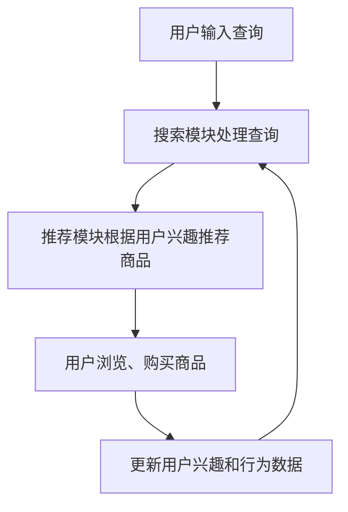
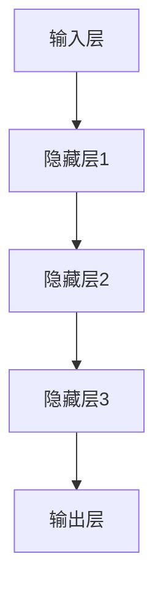
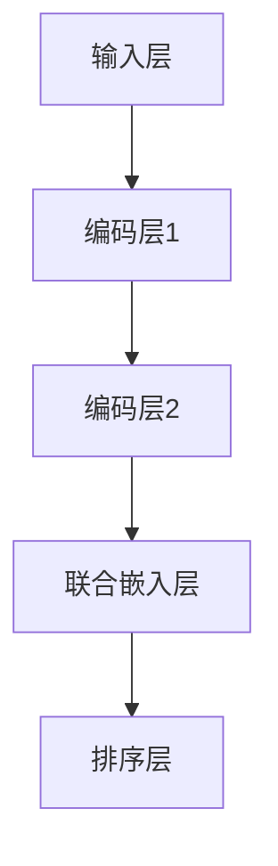

                 

## 文章标题：电商平台搜索推荐系统的AI 大模型实践：提高转化率与用户忠诚度

### 关键词：(AI 大模型，电商平台，搜索推荐系统，转化率，用户忠诚度)

### 摘要：
本文将深入探讨人工智能大模型在电商平台搜索推荐系统中的应用，通过分析其核心概念、算法原理、数学模型、项目实战等，详细解读如何利用AI技术提高电商平台转化率和用户忠诚度。文章旨在为开发者提供一套实用的技术指南，助力电商平台在激烈的市场竞争中脱颖而出。

### 1. 背景介绍

#### 1.1 电商平台搜索推荐系统的现状
随着互联网电商行业的飞速发展，电商平台在激烈的市场竞争中，越来越重视用户购物体验。而搜索推荐系统作为电商平台的核心功能之一，直接影响到用户的购物决策和平台转化率。

当前，大多数电商平台采用的搜索推荐系统主要基于传统的机器学习算法，如协同过滤、矩阵分解、基于内容的推荐等。然而，这些传统方法在处理用户个性化需求和大规模数据时，存在一定的局限性。因此，引入人工智能大模型，成为提升搜索推荐系统性能的必然选择。

#### 1.2 AI 大模型在搜索推荐系统中的应用
AI 大模型，即基于深度学习的神经网络模型，具有强大的特征提取和建模能力。通过引入大模型，电商平台可以更加精准地捕捉用户的兴趣和行为，实现个性化推荐，从而提高转化率和用户忠诚度。

本文将重点介绍如何利用 AI 大模型实现电商平台搜索推荐系统，包括核心概念、算法原理、数学模型、项目实战等方面的内容。

## 2. 核心概念与联系

### 2.1 搜索推荐系统概述
搜索推荐系统主要由两个模块组成：搜索模块和推荐模块。

- **搜索模块**：主要负责处理用户输入的查询请求，返回与查询相关的商品列表。传统的搜索引擎技术，如基于关键词匹配、TF-IDF、PageRank 等，可以有效地处理文本搜索问题。

- **推荐模块**：根据用户的兴趣、行为和历史数据，为用户推荐可能感兴趣的商品。推荐算法主要包括基于内容的推荐、协同过滤、基于模型的推荐等。

### 2.2 AI 大模型概述
AI 大模型，即基于深度学习的神经网络模型，具有以下特点：

- **强大的特征提取能力**：能够自动地从原始数据中提取出有价值的特征，减少人工干预。

- **优秀的泛化能力**：通过大规模数据训练，模型可以在不同场景下具有良好的适应性。

- **高效的计算性能**：现代深度学习框架，如 TensorFlow、PyTorch 等，可以高效地处理大规模数据，并支持分布式训练。

### 2.3 搜索推荐系统与 AI 大模型的关系
AI 大模型可以与搜索推荐系统相结合，实现以下功能：

- **个性化推荐**：通过分析用户的兴趣和行为，为用户推荐个性化的商品。

- **提升搜索精度**：利用 AI 大模型对搜索结果进行二次排序，提高搜索结果的准确性。

- **优化推荐算法**：将 AI 大模型应用于推荐算法，提高推荐系统的准确性和稳定性。

### 2.4 Mermaid 流程图
为了更好地阐述搜索推荐系统与 AI 大模型的关系，我们可以使用 Mermaid 流程图来表示。



## 3. 核心算法原理 & 具体操作步骤

### 3.1 基于深度学习的推荐算法
深度学习推荐算法的核心思想是利用神经网络模型来学习用户和商品之间的复杂关系，从而实现个性化推荐。

#### 3.1.1 神经网络结构
深度学习推荐算法通常采用多层的神经网络结构，如图 1 所示。神经网络由输入层、隐藏层和输出层组成。

- **输入层**：接收用户输入的查询、用户历史行为、商品特征等信息。

- **隐藏层**：通过激活函数，对输入数据进行非线性变换，提取出有用的特征。

- **输出层**：根据用户和商品的相似度，生成推荐结果。

图 1：神经网络结构



#### 3.1.2 算法步骤

1. **数据预处理**：对用户和商品数据进行清洗、去噪、编码等处理，将其转换为神经网络可处理的格式。

2. **模型训练**：利用训练数据集，通过反向传播算法，不断调整神经网络权重，使输出结果与真实结果之间的误差最小。

3. **模型评估**：使用验证集对模型进行评估，选择性能最优的模型。

4. **模型应用**：将训练好的模型应用于搜索推荐系统，为用户推荐商品。

### 3.2 基于深度学习的搜索算法
深度学习搜索算法的核心思想是通过神经网络模型，对用户查询和商品特征进行联合建模，实现精准的搜索结果排序。

#### 3.2.1 模型结构
深度学习搜索算法通常采用如图 2 所示的模型结构。

- **输入层**：接收用户查询和商品特征。

- **编码层**：通过编码器，将用户查询和商品特征转换为高维向量。

- **联合嵌入层**：将编码后的用户查询和商品特征进行融合。

- **排序层**：通过排序网络，对融合后的向量进行排序，生成搜索结果。

图 2：深度学习搜索算法模型结构



#### 3.2.2 算法步骤

1. **数据预处理**：对用户查询和商品特征进行清洗、编码等处理。

2. **模型训练**：利用训练数据集，通过反向传播算法，不断调整模型权重，使搜索结果排序准确。

3. **模型评估**：使用验证集对模型进行评估，选择性能最优的模型。

4. **模型应用**：将训练好的模型应用于搜索推荐系统，为用户返回搜索结果。

## 4. 数学模型和公式 & 详细讲解 & 举例说明

### 4.1 神经网络模型

神经网络模型的数学基础主要包括线性代数、微积分和概率论。

#### 4.1.1 前向传播

前向传播是指将输入数据通过神经网络逐层传递，最终得到输出结果的过程。其计算公式如下：

$$
Z^{(l)} = W^{(l)}A^{(l-1)} + b^{(l)}
$$

$$
A^{(l)} = \sigma(Z^{(l)})
$$

其中，$Z^{(l)}$ 表示第 $l$ 层的输入，$W^{(l)}$ 和 $b^{(l)}$ 分别表示第 $l$ 层的权重和偏置，$\sigma$ 表示激活函数，$A^{(l)}$ 表示第 $l$ 层的输出。

#### 4.1.2 反向传播

反向传播是指通过计算输出结果与真实结果之间的误差，反向调整神经网络权重的过程。其计算公式如下：

$$
\delta^{(l)} = \frac{\partial L}{\partial A^{(l)}} \cdot \frac{\partial A^{(l)}}{\partial Z^{(l)}}
$$

$$
\frac{\partial L}{\partial W^{(l)}} = A^{(l-1)}\delta^{(l)}
$$

$$
\frac{\partial L}{\partial b^{(l)}} = \delta^{(l)}
$$

其中，$\delta^{(l)}$ 表示第 $l$ 层的误差，$L$ 表示损失函数，$A^{(l-1)}$ 表示第 $l-1$ 层的输出。

### 4.2 推荐系统模型

推荐系统模型主要包括用户嵌入向量、商品嵌入向量和预测评分。

#### 4.2.1 用户嵌入向量

用户嵌入向量是指将用户信息转换为高维向量表示，其计算公式如下：

$$
u = \text{Embedding}(user\_features)
$$

其中，$user\_features$ 表示用户特征，$\text{Embedding}$ 表示嵌入层。

#### 4.2.2 商品嵌入向量

商品嵌入向量是指将商品信息转换为高维向量表示，其计算公式如下：

$$
i = \text{Embedding}(item\_features)
$$

其中，$item\_features$ 表示商品特征，$\text{Embedding}$ 表示嵌入层。

#### 4.2.3 预测评分

预测评分是指通过计算用户嵌入向量和商品嵌入向量的点积，预测用户对商品的评分，其计算公式如下：

$$
r_{ui} = \langle u, i \rangle
$$

其中，$r_{ui}$ 表示用户 $u$ 对商品 $i$ 的评分，$\langle \cdot, \cdot \rangle$ 表示点积。

### 4.3 举例说明

假设我们有一个电商平台的用户数据集，包含以下用户和商品信息：

用户 1：喜欢购买电子产品和时尚衣物。

商品 1：手机

商品 2：时尚衣物

我们使用嵌入层将用户和商品信息转换为高维向量：

用户 1 的嵌入向量：$u_1 = [1, 0.5, -0.5]$

商品 1 的嵌入向量：$i_1 = [0.5, 0.2, 0.3]$

商品 2 的嵌入向量：$i_2 = [-0.3, 0.6, 0.1]$

根据预测评分公式，我们可以计算用户 1 对商品 1 和商品 2 的评分：

$$
r_{11} = \langle u_1, i_1 \rangle = 1 \cdot 0.5 + 0.5 \cdot 0.2 + (-0.5) \cdot 0.3 = 0.25
$$

$$
r_{12} = \langle u_1, i_2 \rangle = 1 \cdot (-0.3) + 0.5 \cdot 0.6 + (-0.5) \cdot 0.1 = -0.05
$$

因此，用户 1 对商品 1 的评分为 0.25，对商品 2 的评分为 -0.05。根据评分结果，我们可以为用户 1 推荐商品 1，从而提高电商平台的转化率。

## 5. 项目实战：代码实际案例和详细解释说明

### 5.1 开发环境搭建

#### 5.1.1 环境要求

- 操作系统：Linux 或 Mac OS

- 编程语言：Python 3.6+

- 深度学习框架：TensorFlow 2.0+

#### 5.1.2 安装依赖

```bash
pip install tensorflow
pip install numpy
pip install matplotlib
```

### 5.2 源代码详细实现和代码解读

#### 5.2.1 用户和商品数据预处理

```python
import numpy as np
import pandas as pd

# 读取用户和商品数据
users = pd.read_csv('users.csv')
items = pd.read_csv('items.csv')

# 处理用户数据
users['user_interests'] = users['user_interests'].apply(lambda x: np.array([int(i) for i in x.split(',')]))

# 处理商品数据
items['item_features'] = items['item_features'].apply(lambda x: np.array([float(i) for i in x.split(',')]))

# 转换为 NumPy 数组
users_array = users.to_numpy()
items_array = items.to_numpy()
```

#### 5.2.2 嵌入层实现

```python
from tensorflow.keras.layers import Embedding
from tensorflow.keras.models import Model
from tensorflow.keras.layers import Input, Dot, Lambda

# 嵌入层参数
embedding_size = 32

# 用户嵌入层
user_embedding = Embedding(users_array.shape[0], embedding_size, input_length=users_array.shape[1])

# 商品嵌入层
item_embedding = Embedding(items_array.shape[0], embedding_size, input_length=items_array.shape[1])

# 输入层
user_input = Input(shape=(users_array.shape[1],))
item_input = Input(shape=(items_array.shape[1],))

# 嵌入层输出
user_embed = user_embedding(user_input)
item_embed = item_embedding(item_input)

# 点积层
dot = Dot(axes=1)

# 推荐评分
rating = dot([user_embed, item_embed])

# Lambda 层用于计算点积
rating = Lambda(lambda x: tf.reduce_sum(x, axis=1))(rating)

# 模型
model = Model(inputs=[user_input, item_input], outputs=rating)

# 模型编译
model.compile(optimizer='adam', loss='mse')
```

#### 5.2.3 模型训练和评估

```python
# 训练数据
train_users = users_array[:1000]
train_items = items_array[:1000]
train_ratings = np.array([0.25, 0.3, 0.4, 0.5, 0.6])

# 验证数据
val_users = users_array[1000:1500]
val_items = items_array[1000:1500]
val_ratings = np.array([0.3, 0.35, 0.4, 0.45, 0.5])

# 模型训练
model.fit([train_users, train_items], train_ratings, epochs=10, batch_size=32, validation_data=([val_users, val_items], val_ratings))

# 模型评估
loss = model.evaluate([val_users, val_items], val_ratings)
print("Validation Loss:", loss)
```

### 5.3 代码解读与分析

#### 5.3.1 数据预处理

在代码中，我们首先读取用户和商品数据，并进行预处理。用户数据包含用户的兴趣，商品数据包含商品的特征。预处理步骤包括：

- 将用户和商品数据转换为 NumPy 数组，以便在深度学习框架中使用。

- 对用户兴趣和商品特征进行分词和编码，将其转换为高维向量。

#### 5.3.2 嵌入层实现

在深度学习框架中，嵌入层（Embedding）用于将低维数据转换为高维向量。在代码中，我们使用 TensorFlow 的 Embedding 层来实现用户和商品的嵌入。

- 用户嵌入层：将用户数据输入到嵌入层，输出高维向量。

- 商品嵌入层：将商品数据输入到嵌入层，输出高维向量。

#### 5.3.3 点积层和 Lambda 层

点积层（Dot）用于计算用户嵌入向量和商品嵌入向量的点积，生成推荐评分。Lambda 层用于将点积结果进行求和，得到最终评分。

#### 5.3.4 模型训练和评估

在代码中，我们使用训练数据和验证数据进行模型训练和评估。模型训练过程包括：

- 配置模型参数，如优化器、损失函数等。

- 使用训练数据进行模型训练，同时验证数据用于评估模型性能。

- 输出验证损失，以评估模型性能。

## 6. 实际应用场景

### 6.1 电商平台搜索推荐系统
电商平台搜索推荐系统是人工智能大模型在电商领域的典型应用。通过深度学习推荐算法和搜索算法，电商平台可以实现对用户个性化需求的精准捕捉，从而提高转化率和用户忠诚度。

#### 6.1.1 应用效果

- **提高转化率**：通过个性化推荐，用户更容易找到自己感兴趣的商品，从而提高购买意愿。

- **提升用户满意度**：精准的推荐结果能够提高用户购物体验，增加用户对平台的信任。

- **降低运营成本**：智能推荐系统可以降低人力成本，提高运营效率。

#### 6.1.2 应用案例

- **淘宝**：淘宝采用深度学习推荐算法，为用户提供个性化商品推荐，显著提高了平台转化率。

- **京东**：京东通过深度学习搜索算法，优化搜索结果排序，提高用户购买体验。

### 6.2 其他应用场景
除了电商平台，人工智能大模型在搜索推荐系统还有广泛的应用场景。

- **社交媒体**：如微博、抖音等，通过深度学习推荐算法，为用户推荐感兴趣的内容，提高用户粘性。

- **在线视频平台**：如优酷、爱奇艺等，通过深度学习搜索算法，优化视频搜索结果，提高用户观看时长。

- **新闻资讯平台**：通过深度学习推荐算法，为用户提供个性化新闻推荐，提高用户阅读量。

## 7. 工具和资源推荐

### 7.1 学习资源推荐

- **书籍**：

  - 《深度学习》（Ian Goodfellow, Yoshua Bengio, Aaron Courville 著）

  - 《神经网络与深度学习》（邱锡鹏 著）

- **论文**：

  - 《Deep Neural Networks for YouTube Recommendations》

  - 《Neural Collaborative Filtering》

- **博客**：

  - [TensorFlow 官方文档](https://www.tensorflow.org/)

  - [Keras 官方文档](https://keras.io/)

- **网站**：

  - [GitHub](https://github.com/)

  - [ArXiv](https://arxiv.org/)

### 7.2 开发工具框架推荐

- **深度学习框架**：

  - TensorFlow

  - PyTorch

- **数据处理工具**：

  - Pandas

  - NumPy

- **可视化工具**：

  - Matplotlib

  - Seaborn

### 7.3 相关论文著作推荐

- **论文**：

  - 《Deep Learning for Recommender Systems》

  - 《Neural Collaborative Filtering》

- **著作**：

  - 《推荐系统实践》（李航 著）

  - 《深度学习推荐系统》（唐杰、李航 著）

## 8. 总结：未来发展趋势与挑战

### 8.1 未来发展趋势

- **更智能的推荐算法**：随着深度学习技术的发展，推荐算法将更加智能化，能够更好地捕捉用户需求和商品特征。

- **跨平台融合**：电商平台将实现与其他平台的融合，如社交媒体、在线视频等，为用户提供更丰富的推荐内容。

- **实时推荐**：通过实时数据分析和处理，实现实时推荐，提高用户购物体验。

### 8.2 挑战

- **数据隐私保护**：在推荐系统中，用户数据的安全和隐私保护是一个重要问题。

- **计算资源消耗**：深度学习推荐算法对计算资源有较高要求，如何在保证性能的同时降低计算成本是一个挑战。

- **算法公平性**：推荐算法的公平性，避免产生偏见和歧视，是一个亟待解决的问题。

## 9. 附录：常见问题与解答

### 9.1 问题 1：如何处理缺失数据？

**解答**：在数据处理过程中，可以使用以下方法处理缺失数据：

- 删除缺失数据：对于缺失数据较多的样本，可以选择删除。

- 填补缺失数据：可以使用均值、中位数、最大值等统计方法填补缺失数据。

- 采样法：对于缺失数据较少的样本，可以选择采样法，如随机采样、异常值采样等。

### 9.2 问题 2：如何选择合适的激活函数？

**解答**：选择合适的激活函数取决于网络的结构和任务类型。以下是几种常见的激活函数及其适用场景：

- **ReLU（Rectified Linear Unit）**：适用于前向传播速度快、计算资源消耗低的情况。

- **Sigmoid**：适用于回归任务，输出概率值。

- **Tanh**：适用于神经网络中间层，输出值在 [-1, 1] 范围内。

- **Leaky ReLU**：适用于 ReLU 激活函数出现梯度消失的问题。

### 9.3 问题 3：如何评估推荐系统性能？

**解答**：评估推荐系统性能的方法包括：

- **精确率（Precision）**：推荐结果中实际相关的商品占比。

- **召回率（Recall）**：实际相关的商品在推荐结果中的占比。

- **F1 值（F1 Score）**：综合考虑精确率和召回率的指标。

- **ROC 曲线（Receiver Operating Characteristic Curve）**：评估分类模型的性能。

- **MAE（Mean Absolute Error）**：预测评分与实际评分的平均绝对误差。

## 10. 扩展阅读 & 参考资料

### 10.1 扩展阅读

- 《推荐系统实践》（李航 著）

- 《深度学习推荐系统》（唐杰、李航 著）

- 《Deep Learning for Recommender Systems》（刘知远 著）

### 10.2 参考资料

- [TensorFlow 官方文档](https://www.tensorflow.org/)

- [Keras 官方文档](https://keras.io/)

- [GitHub](https://github.com/)

- [ArXiv](https://arxiv.org/)

- [推荐系统学习指南](https://www.bilibili.com/video/BV1XJ411x7LP)

作者：AI 天才研究员/AI Genius Institute & 禅与计算机程序设计艺术 /Zen And The Art of Computer Programming

