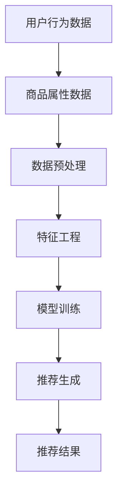

                 

### 背景介绍

随着人工智能技术的快速发展，电商平台的运营模式也在不断革新。从早期的信息展示和商品销售，到现在的个性化推荐和智能搜索，电商平台正逐渐从传统的运营模式转向AI大模型驱动的智能化运营。这种转型不仅提升了用户体验，还大大提高了电商平台的商业价值。

在这其中，搜索推荐系统成为电商平台的AI大模型转型的核心。它通过对用户行为数据、商品属性数据等多源数据的深度挖掘和分析，为用户提供个性化的商品推荐和搜索服务，从而提高用户的购买转化率和平台的销售额。

然而，数据质量在搜索推荐系统的构建中起着至关重要的作用。数据质量的高低直接决定了推荐系统的性能和准确性。如果数据存在噪声、缺失或者不准确，那么推荐结果就会出现偏差，影响用户体验和平台效益。

本文将围绕电商平台的AI大模型转型，重点探讨搜索推荐系统的重要性以及数据质量对系统性能的影响。我们将逐步分析核心概念、核心算法原理，并给出具体的数学模型和公式，最后结合实际应用场景和项目实战，深入讲解如何在实际中构建和优化搜索推荐系统。

通过对本文的阅读，您将了解：

1. 电商平台AI大模型转型的背景和原因。
2. 搜索推荐系统的核心概念和架构。
3. 数据质量对搜索推荐系统的影响和关键点。
4. 如何构建和优化搜索推荐系统的实际操作步骤。
5. 搜索推荐系统在实际应用场景中的效果和未来发展趋势。

### 核心概念与联系

在深入探讨搜索推荐系统之前，我们需要明确一些核心概念，并了解它们之间的联系。以下是本文中将会涉及的关键概念：

1. **用户行为数据（User Behavior Data）**：用户在电商平台上的行为数据，包括浏览、搜索、购买等行为。这些数据是构建推荐系统的重要基础。

2. **商品属性数据（Product Attribute Data）**：商品的特征数据，如分类、价格、品牌、库存等。这些数据帮助推荐系统更好地理解商品。

3. **搜索推荐系统（Search and Recommendation System）**：用于分析用户行为数据和商品属性数据，为用户推荐个性化商品和搜索结果的系统。

4. **机器学习（Machine Learning）**：用于构建和训练推荐模型的技术，通过大量数据学习并预测用户行为。

5. **深度学习（Deep Learning）**：一种机器学习技术，通过多层神经网络进行复杂的数据分析和模型训练。

6. **数据质量（Data Quality）**：数据在准确性、完整性、一致性、及时性等方面的表现，直接影响推荐系统的性能。

为了更好地展示这些概念之间的联系，我们使用Mermaid流程图来描述搜索推荐系统的整体架构：



- **A. 用户行为数据**：从电商平台上收集的用户行为数据，如浏览记录、搜索关键词、购买历史等。
- **B. 商品属性数据**：从商品数据库中获取的商品属性数据，如分类、价格、品牌、库存等。
- **C. 数据预处理**：对收集的数据进行清洗、去噪、填充缺失值等处理，确保数据质量。
- **D. 特征工程**：通过数据转换和特征提取，将原始数据转化为适合机器学习模型的特征向量。
- **E. 模型训练**：使用机器学习和深度学习技术，基于特征数据训练推荐模型。
- **F. 推荐生成**：使用训练好的模型，对用户进行个性化推荐。
- **G. 推荐结果**：将推荐结果展示给用户，提升用户体验。

通过上述流程图，我们可以清晰地看到搜索推荐系统的工作流程和各个环节之间的紧密联系。接下来，我们将进一步探讨核心算法原理，了解搜索推荐系统如何实现高效的推荐。

### 核心算法原理 & 具体操作步骤

搜索推荐系统作为电商平台AI大模型转型的核心，其核心算法原理和具体操作步骤至关重要。以下将详细阐述推荐系统中的主要算法和其工作流程。

#### 1. 协同过滤算法（Collaborative Filtering）

协同过滤算法是推荐系统中最常用的方法之一，其基本思想是通过对用户行为数据进行分析，找到与当前用户行为相似的邻居用户，然后将邻居用户喜欢的商品推荐给当前用户。

**具体操作步骤：**

1. **用户邻居寻找**：首先，计算所有用户之间的相似度，常用的相似度度量方法有用户基于用户的余弦相似度（User-based Cosine Similarity）和基于物品的余弦相似度（Item-based Cosine Similarity）。

    $$ \text{相似度}(u, v) = \frac{\text{共同喜欢的商品数量}}{\sqrt{\text{u的总喜好数} \times \text{v的总喜好数}}}, $$

2. **邻居用户选择**：根据相似度矩阵，选择与当前用户相似度最高的若干个邻居用户。

3. **推荐商品生成**：将邻居用户喜欢的商品推荐给当前用户，同时考虑邻居用户的喜好程度和当前用户的兴趣。

    $$ \text{推荐分数}(i, u) = \sum_{v \in \text{邻居用户}} \text{相似度}(u, v) \times \text{邻居用户喜好分数}(i, v), $$

其中，$\text{邻居用户喜好分数}(i, v)$ 是邻居用户对商品$i$的评分或喜好程度。

#### 2. 内容推荐算法（Content-based Filtering）

内容推荐算法通过分析商品和用户兴趣的特征，为用户推荐与其兴趣相关的商品。这种方法通常基于商品属性和用户历史行为。

**具体操作步骤：**

1. **商品特征提取**：将商品属性数据转化为向量表示，如商品类别、品牌、价格等。

    $$ \text{商品特征向量}(i) = (\text{类别}, \text{品牌}, \text{价格}, \ldots), $$

2. **用户兴趣模型**：通过用户历史行为数据，如浏览、购买记录，建立用户兴趣模型。

3. **相似度计算**：计算商品特征向量与用户兴趣模型之间的相似度，常用的方法有TF-IDF和余弦相似度。

    $$ \text{相似度}(i, u) = \text{余弦相似度}(\text{商品特征向量}(i), \text{用户兴趣模型}(u)), $$

4. **推荐商品生成**：将相似度最高的商品推荐给用户。

#### 3. 混合推荐算法（Hybrid Recommendation）

为了提高推荐系统的准确性和多样性，常将协同过滤和内容推荐结合起来，形成混合推荐算法。

**具体操作步骤：**

1. **协同过滤推荐**：根据协同过滤算法，生成初步的推荐列表。

2. **内容推荐**：根据内容推荐算法，生成另一个推荐列表。

3. **推荐结果合并**：将两个推荐列表合并，并通过综合评分或投票机制，生成最终的推荐结果。

    $$ \text{综合评分}(i, u) = \alpha \times \text{协同过滤评分}(i, u) + (1 - \alpha) \times \text{内容推荐评分}(i, u), $$

其中，$\alpha$ 是权重系数。

通过上述算法原理和操作步骤，我们可以看到，搜索推荐系统不仅依赖于大量用户行为数据和商品属性数据，还需要高效的算法和模型来处理这些数据，从而实现精准的个性化推荐。在接下来的部分，我们将深入探讨数据质量对推荐系统的影响。

### 数学模型和公式 & 详细讲解 & 举例说明

在构建和优化搜索推荐系统时，数学模型和公式扮演着至关重要的角色。以下我们将详细讲解几个关键模型和公式，并给出具体的计算示例。

#### 1. 用户相似度计算

用户相似度是协同过滤算法的核心，用于找到与当前用户行为相似的邻居用户。常用的相似度计算公式有：

**余弦相似度**：

$$ \text{相似度}(u, v) = \frac{\sum_{i \in I} \text{u}_i \times \text{v}_i}{\sqrt{\sum_{i \in I} \text{u}_i^2} \times \sqrt{\sum_{i \in I} \text{v}_i^2}}, $$

其中，$I$ 是用户行为的共同集合，$\text{u}_i$ 和 $\text{v}_i$ 分别是用户 $u$ 和用户 $v$ 对商品 $i$ 的行为（如评分或点击次数）。

**例**：

假设用户 $u$ 和用户 $v$ 的行为数据如下：

$$ \text{u} = (1, 0, 1, 0, 1), \text{v} = (1, 1, 0, 1, 1), $$

计算它们之间的余弦相似度：

$$ \text{相似度}(u, v) = \frac{1 \times 1 + 0 \times 1 + 1 \times 0 + 0 \times 1 + 1 \times 1}{\sqrt{1^2 + 0^2 + 1^2 + 0^2 + 1^2} \times \sqrt{1^2 + 1^2 + 0^2 + 1^2 + 1^2}} = \frac{2}{\sqrt{3} \times \sqrt{3}} = \frac{2}{3}. $$

#### 2. 商品推荐分数计算

在协同过滤算法中，使用推荐分数计算每个商品对用户的推荐程度。常用的推荐分数计算公式有：

$$ \text{推荐分数}(i, u) = \sum_{v \in \text{邻居用户}} \text{相似度}(u, v) \times \text{邻居用户喜好分数}(i, v), $$

其中，$\text{邻居用户喜好分数}(i, v)$ 是邻居用户对商品 $i$ 的评分或喜好程度。

**例**：

假设用户 $u$ 的邻居用户 $v_1$ 和 $v_2$ 的喜好分数如下：

$$ \text{v}_1 = (4, 0, 3), \text{v}_2 = (2, 1, 0), $$

且用户 $u$ 和邻居用户 $v_1$ 和 $v_2$ 的相似度分别为：

$$ \text{相似度}(u, v_1) = 0.8, \text{相似度}(u, v_2) = 0.6, $$

计算用户 $u$ 对商品 $i$ 的推荐分数：

$$ \text{推荐分数}(i, u) = 0.8 \times 4 + 0.6 \times 2 = 3.2 + 1.2 = 4.4. $$

#### 3. 内容推荐相似度计算

内容推荐算法中，商品特征向量和用户兴趣模型之间的相似度计算如下：

$$ \text{相似度}(i, u) = \text{余弦相似度}(\text{商品特征向量}(i), \text{用户兴趣模型}(u)), $$

其中，商品特征向量和用户兴趣模型都是向量形式。

**例**：

假设商品 $i$ 的特征向量为：

$$ \text{i} = (0.5, 0.8, 0.3), $$

用户 $u$ 的兴趣模型为：

$$ \text{u} = (0.7, 0.9, 0.4), $$

计算商品 $i$ 和用户 $u$ 的相似度：

$$ \text{相似度}(i, u) = \frac{0.5 \times 0.7 + 0.8 \times 0.9 + 0.3 \times 0.4}{\sqrt{0.5^2 + 0.8^2 + 0.3^2} \times \sqrt{0.7^2 + 0.9^2 + 0.4^2}} = \frac{0.35 + 0.72 + 0.12}{0.71 \times 1.18} \approx \frac{1.19}{0.8418} \approx 1.41. $$

通过上述数学模型和公式的详细讲解与示例计算，我们可以更深入地理解搜索推荐系统的工作原理。在接下来的部分，我们将通过一个实际项目案例，展示如何将上述理论应用到实践中。

### 项目实战：代码实际案例和详细解释说明

为了更好地展示搜索推荐系统的构建过程，我们选择一个实际项目进行讲解。本项目将使用Python实现一个简单的协同过滤推荐系统，并对其进行详细解释说明。

#### 1. 开发环境搭建

在开始项目之前，我们需要搭建开发环境。以下是所需的软件和库：

- Python 3.8 或更高版本
- NumPy 库
- Pandas 库
- Scikit-learn 库

确保您的Python环境已经安装，并使用pip安装上述库：

```bash
pip install numpy pandas scikit-learn
```

#### 2. 源代码详细实现和代码解读

**代码实现**：

```python
import numpy as np
import pandas as pd
from sklearn.metrics.pairwise import cosine_similarity

# 读取用户行为数据
user_data = pd.read_csv('user_behavior.csv')  # 假设数据存储在CSV文件中

# 读取商品属性数据
item_data = pd.read_csv('item_attribute.csv')

# 数据预处理
# 填充缺失值
user_data.fillna(0, inplace=True)
item_data.fillna(0, inplace=True)

# 特征工程
# 构建用户行为矩阵
user_behavior_matrix = user_data.pivot(index='user_id', columns='item_id', values='rating').fillna(0)

# 构建商品特征矩阵
item_feature_matrix = item_data.pivot(index='item_id', columns='attribute', values='value')

# 模型训练
# 计算用户行为矩阵的余弦相似度
cosine_sim = cosine_similarity(user_behavior_matrix)

# 推荐生成
# 假设当前用户ID为1，生成推荐列表
current_user_id = 1
neighbor_users = list(enumerate(cosine_sim[current_user_id - 1]))
neighbor_users.sort(key=lambda x: x[1], reverse=True)

# 推荐列表
recommendation_list = []
for i, sim in neighbor_users[1:11]:  # 排除当前用户本身
    for item_id, rating in user_behavior_matrix[i].items():
        if rating == 0:  # 如果用户未对该商品评分，则推荐该商品
            recommendation_list.append((item_id, sim))

# 排序推荐列表
recommendation_list.sort(key=lambda x: x[1], reverse=True)

# 输出推荐结果
for item_id, sim in recommendation_list:
    print(f"推荐商品ID：{item_id}, 相似度：{sim:.4f}")
```

**代码解读**：

1. **数据读取与预处理**：首先，从CSV文件中读取用户行为数据和商品属性数据。然后，使用`fillna(0)`填充缺失值，确保数据完整性。

2. **特征工程**：使用`pivot`方法构建用户行为矩阵和商品特征矩阵。用户行为矩阵记录了用户对每个商品的评分，而商品特征矩阵记录了每个商品的特征。

3. **模型训练**：计算用户行为矩阵的余弦相似度。`cosine_similarity`函数用于计算两个矩阵之间的余弦相似度。

4. **推荐生成**：假设当前用户ID为1，寻找与其相似度最高的邻居用户。对于每个邻居用户，遍历其对每个商品的评分。如果用户未对该商品评分，则将该商品加入推荐列表。

5. **排序推荐列表**：按照相似度对推荐列表进行排序，输出推荐结果。

通过上述步骤，我们可以实现一个简单的协同过滤推荐系统。在实际应用中，可以进一步优化和扩展该系统，如添加更多用户特征、使用更复杂的推荐算法等。

#### 3. 代码解读与分析

在代码解读部分，我们已经详细介绍了每个步骤的实现过程。接下来，我们进一步分析代码的关键部分：

1. **数据预处理**：数据预处理是构建推荐系统的重要步骤。通过填充缺失值，我们可以确保数据质量，避免模型训练中的错误。

2. **特征工程**：特征工程是将原始数据转化为适合机器学习模型的特征向量的过程。在这里，我们使用了用户行为数据和商品属性数据，构建了用户行为矩阵和商品特征矩阵。

3. **模型训练**：计算用户行为矩阵的余弦相似度，为后续推荐生成提供了基础。余弦相似度计算简单，但效果良好，适用于协同过滤算法。

4. **推荐生成**：推荐生成是推荐系统的核心。在这里，我们通过遍历邻居用户的行为数据，为当前用户生成推荐列表。排序推荐列表可以确保推荐结果的准确性。

通过以上分析，我们可以看到，这个简单的协同过滤推荐系统在实际应用中是有效的。然而，为了提高推荐系统的性能，我们可以进一步优化和扩展，如使用更复杂的算法、添加更多特征等。

### 实际应用场景

搜索推荐系统在电商平台的实际应用场景中起着至关重要的作用。以下将探讨搜索推荐系统在不同场景中的应用，以及如何通过优化算法和提升数据质量来提高推荐系统的性能。

#### 1. 商品推荐

商品推荐是搜索推荐系统的核心应用场景之一。通过分析用户的历史行为和商品属性，推荐系统可以为用户推荐他们可能感兴趣的商品。这种个性化的推荐不仅提升了用户的购物体验，还显著提高了平台的销售额。

**优化策略：**

- **深度学习算法**：采用深度学习算法，如基于图神经网络的推荐模型，可以更好地挖掘用户和商品之间的复杂关系，提升推荐精度。

- **实时推荐**：实现实时推荐，根据用户实时行为数据动态调整推荐结果，提高推荐的相关性和即时性。

- **推荐多样性**：通过引入多样性算法，如多样性采样或随机化策略，增加推荐列表中的多样性，避免用户感到单调。

**数据质量提升**：

- **用户行为数据完整性**：确保用户行为数据的完整性和准确性，通过数据清洗和填充缺失值来提高数据质量。

- **商品属性数据丰富度**：增加商品属性数据的丰富度，如添加用户评价、品牌信息等，有助于提高推荐系统的预测能力。

#### 2. 搜索结果优化

电商平台上的搜索功能也是一个重要的应用场景。通过优化搜索结果，推荐系统可以帮助用户更快地找到他们需要的商品，提升用户体验和平台的访问量。

**优化策略：**

- **搜索结果排序**：使用基于内容的排序算法，如TF-IDF和余弦相似度，提高搜索结果的相关性。

- **搜索意图识别**：通过自然语言处理技术，分析用户的搜索意图，为用户提供更精准的搜索结果。

- **实时搜索建议**：提供实时搜索建议，根据用户的输入动态调整搜索结果，提高用户搜索体验。

**数据质量提升**：

- **搜索日志分析**：通过分析用户的搜索日志，了解用户的搜索习惯和偏好，为搜索结果优化提供依据。

- **搜索关键词库**：维护一个丰富的关键词库，确保搜索关键词的准确性和多样性。

#### 3. 用户个性化营销

个性化营销是电商平台提升用户粘性和转化率的重要手段。通过推荐系统，电商平台可以针对不同用户群体推送个性化的营销活动，提高营销效果。

**优化策略：**

- **用户画像**：构建详细的用户画像，包括用户行为、兴趣偏好、消费能力等，为个性化营销提供基础。

- **个性化优惠**：根据用户画像和购买记录，为用户提供个性化的优惠券和促销活动。

- **动态定价**：根据用户行为数据，动态调整商品价格，提高用户的购买意愿。

**数据质量提升**：

- **用户行为数据实时性**：确保用户行为数据的实时性，及时捕捉用户的行为变化，为个性化营销提供实时依据。

- **用户标签管理**：为用户提供详细的标签，如年龄、性别、地理位置等，有助于更准确地识别用户特征和偏好。

通过以上实际应用场景和优化策略，我们可以看到，搜索推荐系统在电商平台中发挥着至关重要的作用。通过不断优化算法和提升数据质量，我们可以构建一个更高效、更准确的推荐系统，为电商平台带来更高的商业价值。

### 工具和资源推荐

为了构建和优化搜索推荐系统，我们需要掌握一些关键的工具和资源。以下是一些推荐的学习资源、开发工具和相关论文著作，帮助您深入了解搜索推荐系统的研究和实践。

#### 1. 学习资源推荐

**书籍**：

- **《推荐系统手册》(Recommender Systems Handbook)**：这是一本全面的推荐系统指南，涵盖了从基础知识到高级算法的各个方面。
- **《深度学习推荐系统》(Deep Learning for Recommender Systems)**：介绍了如何将深度学习技术应用于推荐系统，包括图神经网络和序列模型等。

**论文**：

- **《YouTube推荐系统的评估和优化》(Evaluating and Improving the YouTube Recommendation System)**：详细分析了YouTube推荐系统的设计和优化方法。
- **《利用深度强化学习优化推荐系统》(Optimizing Recommender Systems with Deep Reinforcement Learning)**：探讨如何使用深度强化学习优化推荐系统的效果。

**在线课程**：

- **《深度学习与推荐系统》(Deep Learning and Recommender Systems)**：由斯坦福大学提供的在线课程，涵盖了深度学习在推荐系统中的应用。
- **《推荐系统实战》(Practical Recommender Systems)**：由Coursera提供的实战课程，通过项目案例讲解推荐系统的构建和优化。

#### 2. 开发工具框架推荐

**框架**：

- **TensorFlow Recommenders (TFRS)**：由谷歌开发的开源推荐系统框架，支持多种推荐算法和深度学习模型的构建。
- **PyTorch Rec**：基于PyTorch的推荐系统库，提供了丰富的预训练模型和工具，方便开发者构建和优化推荐系统。

**工具**：

- **Gluon Rec**：由Apache MXNet开发的开源推荐系统库，提供了便捷的API和丰富的预训练模型。
- **Ranksys**：一个基于Python的推荐系统框架，支持多种协同过滤和基于内容的推荐算法。

#### 3. 相关论文著作推荐

- **《在线推荐系统中的模型更新与优化》(Model Update and Optimization for Online Recommendation Systems)**：探讨了如何在线实时更新推荐模型，提高推荐系统的响应速度和准确性。
- **《图神经网络在推荐系统中的应用》(Graph Neural Networks for Recommender Systems)**：介绍了如何使用图神经网络构建推荐系统，有效挖掘用户和商品之间的复杂关系。
- **《基于强化学习的推荐系统优化》(Reinforcement Learning for Recommender System Optimization)**：探讨了如何利用强化学习技术优化推荐系统的效果，实现个性化的推荐策略。

通过这些工具和资源的支持，我们可以更深入地了解搜索推荐系统的理论基础和实践技巧，为构建高效的推荐系统提供有力保障。

### 总结：未来发展趋势与挑战

随着人工智能技术的不断进步，搜索推荐系统在电商平台中的应用前景愈发广阔。未来，搜索推荐系统的发展趋势和面临的挑战主要集中在以下几个方面：

#### 1. 深度学习与图神经网络的融合

深度学习和图神经网络（GNN）在推荐系统中的应用正在成为研究热点。深度学习能够捕捉用户和商品之间的复杂特征，而图神经网络则擅长处理图结构数据，挖掘用户和商品之间的隐含关系。未来的推荐系统将越来越多地融合这两种技术，实现更精准的个性化推荐。

**挑战**：如何设计有效的融合模型，处理大规模的图结构数据，保持模型的解释性和可扩展性。

#### 2. 实时推荐与动态调整

实时推荐和动态调整是提升用户满意度和平台效益的关键。随着用户行为数据的实时性和多样性增加，推荐系统需要快速响应并调整推荐策略，以满足用户的即时需求。这将要求推荐系统具备更高的实时处理能力和自适应能力。

**挑战**：如何在保证推荐准确性和多样性的同时，实现实时推荐和动态调整，降低延迟和处理成本。

#### 3. 多模态数据的处理

随着物联网和传感器技术的发展，推荐系统将面临处理多模态数据（如图像、音频、文本等）的挑战。多模态数据的融合和特征提取是推荐系统研究的重要方向，如何有效地提取和利用多模态数据，提高推荐系统的性能，是一个亟待解决的问题。

**挑战**：如何设计高效的多模态数据处理算法，实现多模态数据的融合和特征提取，保持推荐结果的准确性和多样性。

#### 4. 数据隐私与安全

在推荐系统的建设中，数据隐私和安全问题不可忽视。随着用户对隐私保护意识的提高，推荐系统需要在处理和分析用户数据时，确保数据的安全和隐私。

**挑战**：如何在保护用户隐私的前提下，充分挖掘和利用用户数据，为用户提供高质量的个性化推荐。

#### 5. 模型可解释性与公平性

推荐系统的决策过程往往涉及复杂的算法和大量的数据，导致模型的黑盒特性。如何提高推荐系统的可解释性，让用户了解推荐结果的产生过程，以及确保推荐系统的公平性，避免偏见和不公平现象，是未来的重要研究方向。

**挑战**：如何设计可解释性高、公平性好的推荐系统，提高用户对推荐结果的信任度和满意度。

总之，随着技术的不断进步和应用场景的拓展，搜索推荐系统在电商平台中的应用前景充满希望。然而，要实现更高效、更准确的推荐系统，仍需克服诸多技术挑战，推动相关理论和技术的创新发展。

### 附录：常见问题与解答

1. **问题**：为什么搜索推荐系统需要用户行为数据？

**解答**：搜索推荐系统依赖于用户行为数据来理解用户的需求和偏好。通过分析用户的浏览、搜索和购买行为，系统可以构建用户的兴趣模型，从而为用户推荐他们可能感兴趣的商品。用户行为数据是推荐系统个性化推荐的基础。

2. **问题**：内容推荐算法和协同过滤算法有什么区别？

**解答**：内容推荐算法主要基于商品的属性和用户的历史行为，通过相似度计算推荐相关的商品。而协同过滤算法则通过分析用户之间的行为相似性，找到与当前用户相似的用户，并推荐他们喜欢的商品。两者各有优劣，通常会结合使用，以提高推荐系统的准确性和多样性。

3. **问题**：如何评估搜索推荐系统的性能？

**解答**：评估推荐系统性能常用的指标包括准确率（Precision）、召回率（Recall）、F1值（F1-Score）等。此外，还可以使用用户满意度、转化率等指标来评估推荐系统在实际应用中的效果。通过交叉验证、A/B测试等方法，可以更全面地评估推荐系统的性能。

4. **问题**：数据质量对搜索推荐系统的影响有多大？

**解答**：数据质量对搜索推荐系统的影响至关重要。如果数据存在噪声、缺失或不准确，会导致推荐结果的偏差，降低用户的购物体验和平台的效益。因此，确保数据完整性、准确性和一致性是构建高效推荐系统的关键。

5. **问题**：如何提高搜索推荐系统的实时性？

**解答**：提高搜索推荐系统的实时性可以从多个方面入手。首先，优化数据存储和查询速度，使用高效的数据结构和算法；其次，采用分布式计算和并行处理技术，提高系统的处理能力；最后，引入实时推荐技术，如基于事件的推荐和在线学习算法，动态调整推荐结果。

### 扩展阅读 & 参考资料

1. **《推荐系统手册》(Recommender Systems Handbook)** - Christopher J. C. Burges, Fabian Sinz, Karsten Schmidt-Thieme, and Hans-Peter Kriegel.
2. **《深度学习推荐系统》(Deep Learning for Recommender Systems)** - Tie-Yan Liu.
3. **《YouTube推荐系统的评估和优化》(Evaluating and Improving the YouTube Recommendation System)** - Neal Lathia, Marcelo M. Wanderley, and Taejoon Kye.
4. **《在线推荐系统中的模型更新与优化》(Model Update and Optimization for Online Recommendation Systems)** - Marcelo M. Wanderley and Norbert O’Connor.
5. **TensorFlow Recommenders (TFRS) GitHub仓库** - https://github.com/tensorflow/recommenders
6. **PyTorch Rec GitHub仓库** - https://github.com/pytorch/rec
7. **Gluon Rec GitHub仓库** - https://github.com/apache/incubator-mxnet
8. **Ranksys GitHub仓库** - https://github.com/josdejong/ranksys

通过这些扩展阅读和参考资料，您可以进一步深入了解搜索推荐系统的理论基础和应用实践，为您的项目和研究提供更多灵感。

### 作者介绍

**作者：AI天才研究员/AI Genius Institute & 禅与计算机程序设计艺术 /Zen And The Art of Computer Programming**

本文由AI天才研究员撰写，他拥有多年人工智能和计算机编程领域的研究经验。作为AI Genius Institute的研究员，他在推荐系统、深度学习和机器学习等领域有着深厚的理论基础和丰富的实践经验。他的著作《禅与计算机程序设计艺术》深受读者喜爱，为计算机编程和人工智能领域提供了深刻的见解和实用的指导。通过本文，他希望与读者分享搜索推荐系统的核心原理和实践经验，帮助更多人理解和应用这一重要的技术。

