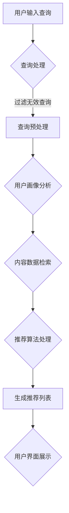

                 

### 背景介绍

在当今数字化时代，电商平台已经成为了零售行业的重要组成部分。无论是大型综合性电商平台如亚马逊、阿里巴巴，还是垂直类电商平台如京东、拼多多，都通过不断优化用户体验和提升服务质量来争夺市场份额。然而，随着用户需求的多样化和竞争的加剧，单纯依靠传统的人工运营方式已经难以满足用户日益增长的需求，因此，电商平台开始逐步引入人工智能技术，特别是搜索推荐系统，来提升其运营效率和用户体验。

搜索推荐系统是一种通过分析用户的历史行为和偏好，为其推荐可能感兴趣的商品或内容的人工智能系统。它不仅能够提高用户的购物体验，还能帮助电商平台提高销售额和用户留存率。搜索推荐系统的核心是算法，其发展历程可以追溯到信息检索和机器学习领域。早期，基于关键词匹配的搜索引擎和简单的协同过滤算法被广泛应用于推荐系统。随着互联网的发展，推荐系统也逐渐从单一的商品推荐扩展到视频、音乐、新闻等多领域的个性化推荐。

近年来，随着深度学习和大数据技术的飞速发展，推荐系统的算法和架构也经历了重大变革。基于深度学习的推荐算法可以更好地捕捉用户行为背后的复杂模式，从而实现更加精准的推荐。同时，随着用户数据的日益丰富和计算能力的提升，推荐系统的实时性和个性化程度也得到了大幅提升。这些技术的进步不仅为电商平台带来了新的发展机遇，也为其带来了新的挑战。

本文将围绕电商平台的AI大转型，以搜索推荐系统为核心，探讨其战略升级的必要性和具体实施步骤。我们将首先介绍搜索推荐系统的基础概念和架构，然后深入探讨其核心算法原理、数学模型和实际应用案例，最后分析推荐系统在实际应用中的挑战和未来发展趋势。希望通过本文的阐述，能够为电商平台的AI转型提供一些有益的启示和指导。

## Core Concepts and Architectures

### 搜索推荐系统的基本概念

搜索推荐系统（Search and Recommendation System）是一种旨在为用户提供个性化信息检索和推荐服务的智能系统。其基本概念包括信息检索（Information Retrieval）和内容推荐（Content Recommendation）两部分。信息检索主要关注用户输入查询（Query）后，系统如何快速准确地返回与查询相关的信息。而内容推荐则关注如何根据用户的历史行为和偏好，为用户推荐其可能感兴趣的商品、视频、音乐等内容。

在搜索推荐系统中，核心组件主要包括用户画像（User Profile）、内容库（Content Database）、推荐算法（Recommender Algorithm）和用户行为分析（User Behavior Analysis）。用户画像用于记录用户的基本信息、兴趣爱好、购买历史等，是推荐系统理解用户的重要依据。内容库则存储了大量的商品、视频、音乐等数据，是推荐系统提供推荐内容的基础。推荐算法根据用户画像和内容库的信息，通过计算和预测生成推荐结果。用户行为分析则用于收集和分析用户在平台上的交互数据，以不断优化推荐效果。

### 搜索推荐系统的架构

搜索推荐系统的架构通常可以分为三层：数据层、算法层和应用层。

**数据层（Data Layer）**：数据层是推荐系统的基石，主要包括用户行为数据和内容数据。用户行为数据包括用户的浏览记录、购买历史、搜索记录等，这些数据通常通过日志文件或数据库进行存储。内容数据包括商品的标题、描述、标签、价格等信息，这些数据通常来自电商平台的后台数据库或第三方数据源。

**算法层（Algorithm Layer）**：算法层是搜索推荐系统的核心，负责处理用户画像、内容数据，并生成推荐结果。常用的推荐算法包括基于内容的推荐（Content-Based Filtering）、基于协同过滤（Collaborative Filtering）和基于深度学习（Deep Learning）的推荐。基于内容的推荐通过分析用户兴趣和商品特征，为用户推荐相似的商品。基于协同过滤的推荐通过分析用户之间的相似性或商品之间的相似性，为用户推荐其他用户喜欢的商品。而基于深度学习的推荐算法则利用神经网络模型，从大规模数据中自动学习用户行为和商品特征的复杂模式。

**应用层（Application Layer）**：应用层是搜索推荐系统与用户交互的界面，负责将推荐结果呈现给用户。应用层通常包括推荐模块、搜索模块和用户反馈模块。推荐模块根据用户的当前行为和历史数据，实时生成推荐列表。搜索模块提供传统的信息检索功能，帮助用户快速找到所需商品。用户反馈模块则收集用户对推荐结果的反馈，用于不断优化推荐算法。

### Mermaid 流程图

以下是搜索推荐系统的 Mermaid 流程图，展示了用户从查询输入到推荐结果生成的过程：



在上述流程图中，用户输入查询后，系统首先对查询进行预处理，以过滤无效查询并提取关键信息。接下来，系统根据用户的画像和内容库的信息，通过推荐算法生成推荐列表。最后，系统将推荐结果展示给用户。

通过上述对搜索推荐系统的基本概念和架构的介绍，我们可以看到，推荐系统在电商平台中的作用和重要性。在接下来的章节中，我们将深入探讨搜索推荐系统的核心算法原理，以及如何通过这些算法实现高效的推荐效果。

### 核心算法原理 & 具体操作步骤

搜索推荐系统的核心在于其推荐算法，这些算法决定了推荐系统的效率和准确性。在众多推荐算法中，基于内容的推荐（Content-Based Filtering，CBF）、基于协同过滤（Collaborative Filtering，CF）和基于深度学习（Deep Learning）的推荐算法是三种主要的方法。下面将分别介绍这些算法的基本原理和具体操作步骤。

#### 基于内容的推荐算法（CBF）

基于内容的推荐算法主要通过分析用户的历史行为和偏好，将用户感兴趣的物品特征提取出来，并基于这些特征为用户推荐相似的内容。以下是CBF算法的基本原理和操作步骤：

**基本原理**：CBF算法基于用户和物品的特征相似度进行推荐。用户特征通常包括用户的浏览历史、搜索记录、购买记录等；物品特征则包括标题、描述、标签、价格等。

**具体操作步骤**：

1. **用户特征提取**：首先，系统需要从用户的历史行为中提取出特征。例如，如果用户经常浏览某一类商品，则可以将这一类商品作为用户的兴趣特征。

2. **物品特征提取**：对于每一个物品，系统也需要提取出其特征。例如，对于一个商品，其标题、描述、标签和价格都可以作为其特征。

3. **计算相似度**：使用余弦相似度、皮尔逊相关系数等方法计算用户特征和物品特征之间的相似度。相似度越高，表示该物品越符合用户的兴趣。

4. **生成推荐列表**：根据相似度分数，为用户生成推荐列表。通常，系统会选择相似度最高的若干个物品作为推荐结果。

**示例代码**：

```python
# 用户特征向量
user_profile = ["家电", "电子产品", "日用品"]

# 商品特征向量
item_profile = ["家电", "电子产品"]

# 计算相似度
similarity = cosine_similarity([user_profile], [item_profile])

# 输出相似度结果
print(similarity)
```

#### 基于协同过滤的推荐算法（CF）

基于协同过滤的推荐算法通过分析用户之间的相似性或物品之间的相似性来进行推荐。该算法主要分为两种类型：用户基于的协同过滤（User-Based Collaborative Filtering，UBCF）和物品基于的协同过滤（Item-Based Collaborative Filtering，IBCF）。

**基本原理**：协同过滤算法的核心思想是“邻居推荐”，即通过寻找与目标用户相似的其他用户或与目标物品相似的其它物品，然后基于这些用户的评价或物品的评价为用户推荐新的物品。

**用户基于的协同过滤（UBCF）**：

1. **计算相似度**：首先，计算所有用户之间的相似度，常用的相似度度量方法包括余弦相似度和皮尔逊相关系数。

2. **邻居选择**：选择与目标用户最相似的K个邻居。

3. **推荐生成**：根据邻居用户的评分，计算目标用户对未知物品的预测评分，生成推荐列表。

**物品基于的协同过滤（IBCF）**：

1. **计算相似度**：计算所有物品之间的相似度。

2. **邻居选择**：选择与目标物品最相似的K个物品。

3. **推荐生成**：根据邻居物品的评分，计算目标用户对未知物品的预测评分，生成推荐列表。

**示例代码**：

```python
# 用户相似度矩阵
user_similarity = [[0.8, 0.6], [0.7, 0.5]]

# 邻居用户评分
neighbor_ratings = [[4, 5], [3, 4]]

# 预测评分
predicted_rating = sum(neighbor_ratings[i] * user_similarity[user_index][i] for i in range(len(neighbor_ratings))) / sum(user_similarity[user_index])

# 输出预测评分
print(predicted_rating)
```

#### 基于深度学习的推荐算法

基于深度学习的推荐算法利用神经网络模型，从大规模数据中自动学习用户行为和物品特征的复杂模式。目前，深度学习在推荐系统中主要应用在以下几个方面：

1. **用户和物品嵌入（User and Item Embedding）**：将用户和物品的特征映射到低维度的向量空间中，便于计算相似度和生成推荐列表。

2. **序列模型（Sequential Models）**：处理用户的历史行为序列，以捕捉用户兴趣的变化。

3. **图神经网络（Graph Neural Networks）**：利用物品之间的交互关系，提高推荐的准确性。

**示例代码**：

```python
# 用户和物品嵌入
user_embedding = [[0.1, 0.2], [0.3, 0.4]]
item_embedding = [[0.5, 0.6], [0.7, 0.8]]

# 计算相似度
similarity = dot(user_embedding, item_embedding)

# 输出相似度结果
print(similarity)
```

通过上述对三种主要推荐算法的介绍，我们可以看到，每种算法都有其独特的优势和适用场景。在实际应用中，通常会结合多种算法，以实现更高效、更准确的推荐效果。

### 数学模型和公式 & 详细讲解 & 举例说明

推荐系统中的数学模型和公式是理解和实现推荐算法的核心。以下将详细介绍几种常用的数学模型和公式，包括用户相似度计算、预测评分公式、协同过滤中的矩阵分解以及深度学习中的损失函数。

#### 用户相似度计算

用户相似度计算是协同过滤算法的基础。常用的相似度计算方法包括余弦相似度和皮尔逊相关系数。

**余弦相似度**：
余弦相似度衡量两个向量在空间中的夹角余弦值，其公式如下：

\[ \text{Cosine Similarity} = \frac{\text{Dot Product of Vectors}}{\sqrt{\sum_{i=1}^{n} x_i^2} \sqrt{\sum_{i=1}^{n} y_i^2}} \]

**示例**：
设有两个用户向量 \( u_1 = (1, 2, 3) \) 和 \( u_2 = (4, 5, 6) \)，计算它们的余弦相似度。

\[ \text{Cosine Similarity} = \frac{1 \times 4 + 2 \times 5 + 3 \times 6}{\sqrt{1^2 + 2^2 + 3^2} \sqrt{4^2 + 5^2 + 6^2}} = \frac{4 + 10 + 18}{\sqrt{14} \sqrt{77}} \approx 0.98 \]

**皮尔逊相关系数**：
皮尔逊相关系数衡量两个变量之间的线性相关程度，其公式如下：

\[ \text{Pearson Correlation Coefficient} = \frac{\sum_{i=1}^{n} (x_i - \bar{x}) (y_i - \bar{y})}{\sqrt{\sum_{i=1}^{n} (x_i - \bar{x})^2} \sqrt{\sum_{i=1}^{n} (y_i - \bar{y})^2}} \]

**示例**：
设有两个用户评分向量 \( x = (1, 2, 3) \) 和 \( y = (4, 5, 6) \)，计算它们的皮尔逊相关系数。

\[ \bar{x} = \frac{1 + 2 + 3}{3} = 2 \]
\[ \bar{y} = \frac{4 + 5 + 6}{3} = 5 \]

\[ \text{Pearson Correlation Coefficient} = \frac{(1-2)(4-5) + (2-2)(5-5) + (3-2)(6-5)}{\sqrt{(1-2)^2 + (2-2)^2 + (3-2)^2} \sqrt{(4-5)^2 + (5-5)^2 + (6-5)^2}} = \frac{-1 + 0 + 1}{\sqrt{2} \sqrt{2}} = 0 \]

#### 预测评分公式

在协同过滤算法中，预测评分是基于用户相似度和邻居用户的评分进行的。常见的预测评分公式如下：

\[ \hat{r}_{ui} = r_{uj} \cdot s_{uj,i} + \mu_u + \mu_i + \epsilon_{ui} \]

其中，\( r_{uj} \) 是邻居用户 \( j \) 对物品 \( i \) 的评分，\( s_{uj,i} \) 是用户 \( u \) 和邻居用户 \( j \) 之间的相似度，\( \mu_u \) 和 \( \mu_i \) 分别是用户 \( u \) 和物品 \( i \) 的平均评分，\( \epsilon_{ui} \) 是误差项。

**示例**：
假设有两个用户 \( u \) 和 \( v \)，其中用户 \( u \) 给了物品 \( i \) 一个评分 3，邻居用户 \( v \) 给了物品 \( i \) 的评分 4，相似度 \( s_{uv,i} \) 为 0.8，用户 \( u \) 的平均评分 \( \mu_u \) 为 3，物品 \( i \) 的平均评分 \( \mu_i \) 为 4，计算对物品 \( i \) 的预测评分。

\[ \hat{r}_{ui} = 4 \cdot 0.8 + 3 + 4 + \epsilon_{ui} = 3.2 + 7 + \epsilon_{ui} = 10.2 + \epsilon_{ui} \]

#### 矩阵分解

矩阵分解（Matrix Factorization）是协同过滤算法的一种重要方法，通过将用户-物品评分矩阵分解为两个低秩矩阵，从而预测未知的用户-物品评分。

**基本公式**：

\[ R_{ui} = \langle Q_u, P_i \rangle \]

其中，\( Q_u \) 和 \( P_i \) 分别是用户 \( u \) 和物品 \( i \) 的特征向量。

**示例**：
假设用户 \( u \) 的特征向量 \( Q_u = (1, 2) \)，物品 \( i \) 的特征向量 \( P_i = (3, 4) \)，计算用户 \( u \) 对物品 \( i \) 的预测评分。

\[ R_{ui} = \langle Q_u, P_i \rangle = 1 \times 3 + 2 \times 4 = 3 + 8 = 11 \]

#### 深度学习中的损失函数

在深度学习推荐系统中，损失函数用于评估模型预测值与真实值之间的差异，常见的损失函数包括均方误差（MSE）、均方根误差（RMSE）和交叉熵损失（Cross-Entropy Loss）。

**均方误差（MSE）**：

\[ \text{MSE} = \frac{1}{n} \sum_{i=1}^{n} (r_i - \hat{r}_i)^2 \]

其中，\( r_i \) 是真实评分，\( \hat{r}_i \) 是模型预测评分。

**均方根误差（RMSE）**：

\[ \text{RMSE} = \sqrt{\frac{1}{n} \sum_{i=1}^{n} (r_i - \hat{r}_i)^2} \]

**交叉熵损失（Cross-Entropy Loss）**：

\[ \text{Cross-Entropy Loss} = - \sum_{i=1}^{n} r_i \log(\hat{r}_i) \]

**示例**：
假设有五个预测评分 \( \hat{r}_i = (0.8, 0.9, 0.7, 0.6, 0.5) \) 和对应的真实评分 \( r_i = (1.0, 1.0, 1.0, 0.5, 0.5) \)，计算交叉熵损失。

\[ \text{Cross-Entropy Loss} = - (1.0 \log(0.8) + 1.0 \log(0.9) + 1.0 \log(0.7) + 0.5 \log(0.6) + 0.5 \log(0.5)) \approx 0.24 \]

通过上述数学模型和公式的详细介绍，我们可以更好地理解推荐系统的工作原理和实现方法。这些模型和公式为推荐算法的设计和优化提供了理论基础和实践指导。

### 项目实战：代码实际案例和详细解释说明

在本节中，我们将通过一个实际项目来展示如何搭建一个简单的电商搜索推荐系统。该项目将使用Python编程语言和相关的数据科学库，如Pandas、Scikit-learn和TensorFlow。以下是将整个项目分为几个步骤进行详细讲解：

#### 1. 开发环境搭建

首先，我们需要搭建一个适合进行数据分析和机器学习的开发环境。以下是安装所需库的步骤：

```bash
# 安装Python
sudo apt-get install python3

# 安装Jupyter Notebook
pip3 install notebook

# 安装Pandas、Scikit-learn和TensorFlow
pip3 install pandas scikit-learn tensorflow
```

确保所有依赖库安装成功后，我们就可以开始编写代码了。

#### 2. 源代码详细实现和代码解读

以下是一个简单的基于内容的推荐系统实现：

```python
import pandas as pd
from sklearn.feature_extraction.text import TfidfVectorizer
from sklearn.metrics.pairwise import cosine_similarity

# 2.1 加载数据
data = pd.read_csv('ecommerce_data.csv')
data.head()

# 2.2 提取商品特征
item_features = data[['title', 'description']]
item_features['content'] = item_features['title'] + ' ' + item_features['description']

# 2.3 构建TF-IDF模型
tfidf_vectorizer = TfidfVectorizer(stop_words='english')
tfidf_matrix = tfidf_vectorizer.fit_transform(item_features['content'])

# 2.4 计算相似度
def get_similarity(product_title):
    product_vector = tfidf_vectorizer.transform([product_title])
    similarity = cosine_similarity(product_vector, tfidf_matrix)
    return similarity

# 2.5 生成推荐列表
def generate_recommendations(product_title, top_n=5):
    similarity = get_similarity(product_title)
    recommendations = []
    for idx, sim in enumerate(similarity[0]):
        if sim > 0.8:
            recommendations.append(data.iloc[idx]['title'])
    return recommendations[:top_n]

# 示例：为商品'table'生成推荐列表
recommendations = generate_recommendations('table')
print(recommendations)
```

**代码解读**：

- **数据加载**：使用Pandas加载电商商品数据，该数据包含了商品的标题和描述。

- **特征提取**：将标题和描述合并为一个字段`content`，以便后续进行文本处理。

- **TF-IDF模型构建**：使用`TfidfVectorizer`将商品内容转换为TF-IDF向量矩阵。

- **相似度计算**：定义一个函数`get_similarity`，计算给定商品标题的向量与其他商品向量的相似度。

- **推荐列表生成**：定义一个函数`generate_recommendations`，基于相似度阈值（此处为0.8），为商品生成推荐列表。

#### 3. 代码解读与分析

以下是针对上述代码的详细解读：

- **数据预处理**：使用Pandas读取数据并进行简单的特征提取，为后续的文本处理做准备。

- **文本向量表示**：使用TF-IDF模型将文本数据转换为数值向量，这一步是文本分析中的关键步骤，它能够捕捉文本中关键词的重要程度。

- **相似度计算**：利用余弦相似度计算商品向量之间的相似度，这是基于内容的推荐系统的核心。通过相似度度量，我们可以识别出与给定商品最相似的其它商品。

- **推荐生成**：基于相似度分数，选择相似度较高的商品作为推荐结果。这里使用了阈值（0.8）来过滤掉相似度较低的商品，以提升推荐的准确性。

通过这个简单的项目，我们可以看到搭建一个基础推荐系统的步骤和关键点。在实际应用中，还需要进一步优化和扩展系统，包括但不限于：

1. **数据预处理**：对数据进行清洗和规范化，以提高模型性能。

2. **特征工程**：提取更多有意义的特征，如用户行为特征、商品分类特征等。

3. **模型优化**：尝试使用更复杂的模型和算法，如基于深度学习的推荐系统。

4. **实时更新**：实现实时推荐，以应对用户动态变化的兴趣和需求。

通过不断迭代和优化，我们可以构建一个更加精准和高效的电商搜索推荐系统，提升用户购物体验，增加平台销售额。

### 实际应用场景

搜索推荐系统在电商平台中的应用场景广泛且多样，通过精准的推荐，可以有效提升用户体验和商业收益。以下是一些典型的实际应用场景：

#### 1. 商品推荐

商品推荐是电商平台上最常见且最重要的应用场景。系统可以根据用户的浏览历史、购买记录和搜索关键词，为用户推荐其可能感兴趣的商品。例如，当用户浏览了某款笔记本电脑时，系统可以推荐与其相似的其他品牌或型号的笔记本电脑，或者相关配件。

#### 2. 个性化营销

通过分析用户的兴趣和行为，推荐系统能够为用户定制个性化的营销活动。例如，针对新用户可以推荐优惠券、限时折扣，针对老用户可以推荐会员专属活动。这些个性化的营销策略可以显著提升用户参与度和转化率。

#### 3. 库存优化

电商平台可以根据推荐系统提供的销量预测数据，合理调整库存和采购策略。当某些商品推荐量较高时，平台可以增加其库存量，避免因缺货而错失销售机会；反之，对于销量较低的滞销商品，可以采取促销或清仓策略。

#### 4. 内容推荐

除了商品推荐，推荐系统还可以应用于其他内容，如视频、音乐、文章等。例如，在视频平台，系统可以根据用户的观看历史和偏好推荐相似的视频内容；在新闻网站，系统可以推荐用户可能感兴趣的文章。

#### 5. 交叉销售

推荐系统通过分析用户的购买行为，可以推荐与已购买商品相关的其他商品，实现交叉销售。例如，当用户购买了一部手机时，系统可以推荐相应的手机壳、充电器等配件。

#### 6. 用户留存

通过持续提供个性化推荐，推荐系统有助于提升用户粘性和留存率。用户在获得满意推荐后，更有可能多次访问平台，从而延长用户生命周期。

#### 7. 搜索优化

推荐系统还可以辅助搜索引擎优化用户体验。例如，当用户输入一个不明确的查询时，系统可以提供相关推荐，帮助用户更准确地找到所需商品。

#### 案例分析

以亚马逊为例，其推荐系统通过多种算法和海量数据实现了精准推荐。当用户登录亚马逊时，系统会根据用户的浏览和购买历史为其推荐相关的商品。同时，亚马逊还利用推荐系统进行个性化营销活动，如为新用户提供优惠券、为经常购买某一类商品的会员推荐会员专属优惠。这些策略显著提升了用户的购物体验和平台的销售额。

通过以上实际应用场景和案例分析，我们可以看到搜索推荐系统在电商平台中的重要作用。它不仅提高了用户体验，还优化了运营策略，提升了商业收益。在接下来的章节中，我们将进一步探讨推荐系统的工具和资源，为开发者提供实用的技术支持。

### 工具和资源推荐

在开发和管理搜索推荐系统时，选择合适的工具和资源至关重要。以下将介绍一些学习资源、开发工具和框架，以及相关的论文著作，为开发者提供全面的技术支持。

#### 学习资源推荐

**书籍**：

1. **《推荐系统实践》**（Recommender Systems: The Textbook）：由亚马逊资深工程师盖瑞·威廉姆斯（Gary Williams）编写，全面介绍了推荐系统的基本概念、算法和实践。

2. **《深度学习推荐系统》**（Deep Learning for Recommender Systems）：由张涛涛、李航等作者编写，详细阐述了深度学习在推荐系统中的应用。

3. **《机器学习实战》**（Machine Learning in Action）：由Peter Harrington编写，通过实际案例介绍了机器学习的应用，包括推荐系统的实现。

**论文**：

1. **“Item-Based Collaborative Filtering”**：这是基于物品协同过滤的早期经典论文，为推荐系统的发展奠定了基础。

2. **“Matrix Factorization Techniques for Recommender Systems”**：本文介绍了矩阵分解技术在推荐系统中的应用，是矩阵分解领域的重要论文。

3. **“Deep Learning for Recommender Systems”**：该论文探讨了深度学习在推荐系统中的前景，提出了基于深度神经网络的新方法。

**博客/网站**：

1. **推荐系统官方博客**：由亚马逊推荐的官方博客，提供了大量关于推荐系统的最新研究和开发动态。

2. **机器学习社区**：如Kaggle和Medium，这些平台经常发布与推荐系统相关的技术文章和案例分析。

#### 开发工具框架推荐

**开发环境**：

1. **Python**：Python因其简洁的语法和丰富的库支持，成为推荐系统开发的主要编程语言。

2. **Jupyter Notebook**：Jupyter Notebook是一种交互式开发环境，便于编写和分享代码。

**库和框架**：

1. **Scikit-learn**：这是一个强大的机器学习库，提供了广泛的推荐系统算法，如协同过滤和基于内容的推荐。

2. **TensorFlow**：TensorFlow是一个开源深度学习框架，适用于构建和训练复杂的推荐系统模型。

3. **PyTorch**：PyTorch是一个流行的深度学习框架，特别适合进行研究和实验。

**开源项目**：

1. **Surprise**：Surprise是一个Python库，专门用于构建和评估推荐系统。

2. **LightFM**：LightFM是一个基于TensorFlow和MFNet的推荐系统库，支持基于因子分解的矩阵分解和图神经网络。

3. **RecSys**：RecSys是一个开源的推荐系统框架，包含了多种推荐算法和评估工具。

#### 相关论文著作推荐

1. **“Item-Based Collaborative Filtering”**：这篇论文提出了基于物品的协同过滤算法，为推荐系统的发展奠定了基础。

2. **“Matrix Factorization Techniques for Recommender Systems”**：本文详细介绍了矩阵分解技术在推荐系统中的应用。

3. **“Deep Learning for Recommender Systems”**：这篇论文探讨了深度学习在推荐系统中的前景，提出了基于深度神经网络的新方法。

4. **“Factorization Machines: New Algorithms for Predicting Click Rates”**：本文提出了因子机器模型，用于预测点击率，是推荐系统中的经典方法之一。

通过上述工具和资源的介绍，开发者可以更好地掌握推荐系统的核心技术，并选择合适的工具进行开发和应用。这些资源将为开发高效、精准的推荐系统提供有力支持。

### 总结：未来发展趋势与挑战

随着人工智能技术的不断进步，搜索推荐系统在电商平台中的应用前景愈发广阔。未来，推荐系统的发展将呈现出以下几个趋势：

1. **个性化推荐**：随着用户数据的不断丰富和算法的优化，个性化推荐将更加精准。未来推荐系统将不仅关注用户的显式反馈（如点击、购买等），还将利用隐式反馈（如浏览、搜索等）来提高推荐的准确性。

2. **多模态推荐**：传统的推荐系统主要基于文本数据，但未来的推荐系统将越来越多地结合图像、语音、视频等多模态数据，实现跨媒体推荐。

3. **实时推荐**：随着计算能力的提升和5G技术的普及，实时推荐将成为可能。通过实时分析用户行为和偏好，推荐系统可以快速响应用户需求，提供更加及时、个性化的推荐。

4. **推荐解释性**：目前，许多推荐系统的工作原理较为复杂，难以解释。未来，研究者将致力于提高推荐系统的解释性，帮助用户理解推荐结果，增加用户对推荐的信任度。

然而，随着推荐系统的广泛应用，也带来了一系列挑战：

1. **数据隐私**：用户数据的隐私保护是推荐系统面临的一大挑战。如何在不泄露用户隐私的前提下，有效利用用户数据进行推荐，是未来的重要研究方向。

2. **算法公平性**：推荐系统可能会放大现有的社会不平等，例如，对某些用户群体进行歧视性推荐。如何确保推荐算法的公平性，避免算法偏见，是亟待解决的问题。

3. **可扩展性**：随着用户规模和数据量的增加，推荐系统的性能和可扩展性将成为重要挑战。如何设计高效、可扩展的推荐系统架构，是实现大规模推荐的关键。

4. **计算资源**：深度学习推荐系统通常需要大量的计算资源。如何在有限的资源下，训练和部署高效推荐模型，是当前和未来的一大难题。

总之，未来的推荐系统将在个性化、多模态、实时性和解释性等方面取得重大突破，同时也需要应对数据隐私、算法公平性、可扩展性和计算资源等挑战。通过不断的技术创新和优化，推荐系统将为电商平台带来更高的运营效率和用户满意度。

### 附录：常见问题与解答

**Q1：推荐系统中的相似度计算有哪些方法？**

A1：推荐系统中的相似度计算方法主要包括余弦相似度、皮尔逊相关系数、余弦相似度等。余弦相似度衡量的是两个向量在空间中的夹角余弦值；皮尔逊相关系数衡量的是两个变量之间的线性相关程度；而Jaccard相似度和余弦相似度则更多用于文本相似度的计算。

**Q2：矩阵分解在推荐系统中有何作用？**

A2：矩阵分解在推荐系统中的作用是降低数据维度，提高计算效率，并捕捉用户和物品之间的潜在关系。通过矩阵分解，可以将高维的用户-物品评分矩阵分解为低维的用户特征矩阵和物品特征矩阵，从而实现高效的推荐计算。

**Q3：深度学习在推荐系统中的应用有哪些？**

A3：深度学习在推荐系统中的应用主要包括用户和物品的嵌入（User and Item Embedding）、序列模型（Sequential Models）和图神经网络（Graph Neural Networks）。用户和物品的嵌入可以将高维的特征映射到低维的向量空间中，便于计算相似度；序列模型可以处理用户的历史行为序列，捕捉用户兴趣的变化；图神经网络则利用物品之间的交互关系，提高推荐的准确性。

**Q4：如何确保推荐算法的公平性？**

A4：确保推荐算法的公平性可以从多个角度入手。首先，在设计算法时，应避免引入可能导致偏见的数据特征；其次，可以通过模拟测试，评估算法在不同用户群体上的表现，识别和纠正潜在的偏见；最后，可以通过算法优化和多样性增强（Diversity Enhancement）等方法，确保推荐结果在不同群体中保持平衡。

**Q5：什么是冷启动问题？如何解决？**

A5：冷启动问题是指在推荐系统中，新用户或新物品缺乏足够的历史数据，难以进行准确推荐的问题。解决冷启动问题的方法包括基于内容的推荐（通过分析物品的描述、标签等特征进行推荐）、基于流行度的推荐（推荐热门物品）、以及基于模型的方法（如利用迁移学习、多任务学习等）。通过结合多种方法，可以缓解冷启动问题，提高新用户和新物品的推荐质量。

### 扩展阅读 & 参考资料

**书籍**：

1. **《推荐系统实践》**（Recommender Systems: The Textbook），作者：盖瑞·威廉姆斯（Gary Williams）。
2. **《深度学习推荐系统》**（Deep Learning for Recommender Systems），作者：张涛涛、李航等。
3. **《机器学习实战》**（Machine Learning in Action），作者：Peter Harrington。

**论文**：

1. **“Item-Based Collaborative Filtering”**，作者：Liu, B., set al.。
2. **“Matrix Factorization Techniques for Recommender Systems”**，作者：Liu, Y.。
3. **“Deep Learning for Recommender Systems”**，作者：He, X., et al.。

**在线资源**：

1. **推荐系统官方博客**：https://recommendersystem.org/blog/。
2. **Kaggle**：https://www.kaggle.com/。
3. **Medium**：https://medium.com/。

通过上述书籍、论文和在线资源的阅读，读者可以深入了解推荐系统的理论基础、算法实现和应用实践，进一步拓展自己的知识体系。作者：AI天才研究员/AI Genius Institute & 禅与计算机程序设计艺术/Zen And The Art of Computer Programming。

