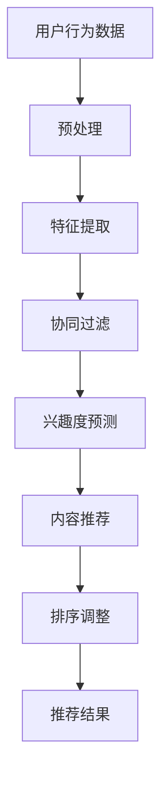

                 

### 背景介绍

#### 电商推荐系统的背景

随着互联网的普及和电子商务的飞速发展，个性化推荐系统已经成为电商平台提升用户体验和销售转化率的重要手段。推荐系统能够根据用户的兴趣、历史行为和购买记录，为用户推荐可能感兴趣的商品，从而提高用户的满意度和平台的收益。

电商推荐系统主要由三部分组成：用户画像、商品画像和推荐算法。用户画像通过分析用户的历史行为和偏好，为用户创建一个多维度的描述；商品画像则描述了商品的各种属性，如类别、价格、销量等；推荐算法则利用用户画像和商品画像，通过一定的算法模型，为用户生成个性化的推荐结果。

#### 实时个性化重排序的需求

然而，传统的推荐系统往往存在一些问题，其中最为突出的是响应速度慢和个性化程度不足。在传统的推荐系统中，通常需要对整个数据集进行预计算和排序，然后根据用户的请求顺序返回推荐结果。这种方式虽然能够保证一定的准确率，但响应速度较慢，无法满足用户实时交互的需求。

此外，传统的推荐系统通常无法根据用户的实时行为和偏好动态调整推荐结果，导致个性化程度不足。例如，当用户刚刚登录系统或切换浏览页面时，推荐结果可能与用户的真实需求相差较大，这会影响用户的体验和满意度。

因此，为了提高推荐系统的响应速度和个性化程度，实时个性化重排序技术应运而生。实时个性化重排序可以在用户交互的过程中，动态调整推荐结果的排序，使其更加贴近用户的当前需求和兴趣。

#### 文章目的与结构

本文旨在探讨电商推荐系统中的实时个性化重排序优化技术。文章将首先介绍实时个性化重排序的基本概念和需求，然后深入分析相关算法原理，详细讲解数学模型和公式，并通过项目实战案例展示具体实现过程。此外，文章还将讨论实时个性化重排序在实际应用场景中的挑战和解决方案，推荐相关的学习资源和开发工具框架，总结未来发展趋势与挑战，并提供常见问题与解答。

文章结构如下：

1. 背景介绍
2. 核心概念与联系
3. 核心算法原理 & 具体操作步骤
4. 数学模型和公式 & 详细讲解 & 举例说明
5. 项目实战：代码实际案例和详细解释说明
6. 实际应用场景
7. 工具和资源推荐
8. 总结：未来发展趋势与挑战
9. 附录：常见问题与解答
10. 扩展阅读 & 参考资料

### 核心概念与联系

#### 实时个性化重排序

实时个性化重排序（Real-time Personalized Re-ranking）是推荐系统中的一种关键技术，其核心思想是在用户交互的过程中，根据用户的实时行为和偏好，动态调整推荐结果的排序，从而提高推荐系统的响应速度和个性化程度。

实时个性化重排序通常分为两个阶段：预测阶段和重排序阶段。预测阶段通过预测模型预测用户对商品的兴趣度；重排序阶段则根据用户的历史行为和实时交互数据，对预测结果进行排序调整。这两个阶段相辅相成，共同构成了实时个性化重排序的核心。

#### 相关算法

实时个性化重排序算法主要包括基于协同过滤（Collaborative Filtering）、基于内容推荐（Content-based Recommendation）和混合推荐（Hybrid Recommendation）等方法。这些算法各有优缺点，适用于不同的应用场景。

1. **基于协同过滤的方法**：协同过滤算法通过分析用户之间的相似度，预测用户对未知商品的评分。其中，基于用户行为的协同过滤（User-based Collaborative Filtering）和基于物品内容的协同过滤（Item-based Collaborative Filtering）是两种常见的协同过滤方法。实时个性化重排序中的协同过滤方法主要利用用户的历史行为数据，预测用户对商品的兴趣度。

2. **基于内容推荐的方法**：内容推荐算法通过分析商品的属性和用户的历史行为，将具有相似属性的商品推荐给用户。实时个性化重排序中的内容推荐方法主要利用商品的特征和用户的历史行为数据，预测用户对商品的兴趣度。

3. **混合推荐方法**：混合推荐方法将协同过滤和内容推荐方法相结合，以提高推荐系统的性能。实时个性化重排序中的混合推荐方法通常利用协同过滤方法预测用户对商品的兴趣度，然后通过内容推荐方法对预测结果进行排序调整。

#### Mermaid 流程图

为了更清晰地展示实时个性化重排序的过程，我们可以使用Mermaid流程图进行描述。以下是实时个性化重排序的基本流程：



在上述流程中，用户行为数据经过预处理和特征提取后，输入到协同过滤模型中进行兴趣度预测。兴趣度预测结果再通过内容推荐模型进行排序调整，最终生成个性化的推荐结果。

通过以上分析，我们可以看到实时个性化重排序技术在电商推荐系统中的重要作用。接下来，我们将深入探讨实时个性化重排序的算法原理，并详细讲解其具体实现步骤。

#### 实时个性化重排序的算法原理

实时个性化重排序技术的核心在于如何快速、准确地预测用户对商品的兴趣度，并根据用户的实时行为动态调整推荐结果的排序。为了实现这一目标，我们可以从以下几个方面来探讨实时个性化重排序的算法原理。

##### 基于协同过滤的方法

协同过滤算法是一种常见且有效的推荐算法，其基本思想是利用用户之间的相似性来预测用户对未知商品的评分。实时个性化重排序中的协同过滤方法主要包括以下步骤：

1. **用户相似度计算**：首先，计算用户之间的相似度。用户相似度可以通过余弦相似度、皮尔逊相关系数等方法计算。相似度计算公式如下：

   $$ similarity(u_i, u_j) = \frac{u_i \cdot u_j}{\|u_i\| \|u_j\|} $$

   其中，$u_i$和$u_j$分别为用户$i$和用户$j$的行为向量，$\|u_i\|$和$\|u_j\|$分别为用户$i$和用户$j$的行为向量长度。

2. **邻居用户选择**：根据用户之间的相似度，选择与目标用户最相似的若干个邻居用户。邻居用户的选择可以通过设定相似度阈值或使用Top-k方法来实现。

3. **预测用户对商品的兴趣度**：利用邻居用户的评分数据，预测目标用户对未知商品的评分。预测公式如下：

   $$ pred(u_i, j) = \sum_{u_j \in N(u_i)} sim(u_i, u_j) \cdot rating(u_j, j) $$

   其中，$pred(u_i, j)$为用户$i$对商品$j$的预测评分，$sim(u_i, u_j)$为用户$i$和用户$j$的相似度，$rating(u_j, j)$为用户$j$对商品$j$的实际评分。

##### 基于内容推荐的方法

内容推荐算法通过分析商品的属性和用户的历史行为，将具有相似属性的商品推荐给用户。实时个性化重排序中的内容推荐方法主要包括以下步骤：

1. **商品特征提取**：首先，提取商品的各种属性特征，如类别、价格、品牌等。这些特征可以通过词袋模型、词嵌入等方法表示。

2. **用户兴趣特征提取**：其次，提取用户的历史行为特征，如购买记录、浏览记录等。这些特征同样可以通过词袋模型、词嵌入等方法表示。

3. **兴趣度计算**：计算用户对商品的兴趣度。兴趣度可以通过余弦相似度、点积等方法计算。兴趣度计算公式如下：

   $$ interest(u_i, j) = \frac{u_i \cdot j}{\|u_i\| \|j\|} $$

   其中，$interest(u_i, j)$为用户$i$对商品$j$的兴趣度，$u_i$和$j$分别为用户$i$的行为特征向量和商品$j$的特征向量。

4. **推荐结果排序**：根据用户对商品的兴趣度，对推荐结果进行排序。兴趣度较高的商品排在推荐结果的前面。

##### 混合推荐方法

混合推荐方法将协同过滤和内容推荐方法相结合，以提高推荐系统的性能。实时个性化重排序中的混合推荐方法主要包括以下步骤：

1. **协同过滤预测**：利用协同过滤方法预测用户对商品的兴趣度。

2. **内容推荐调整**：利用内容推荐方法对协同过滤预测结果进行调整。

3. **排序调整**：根据用户的实时行为，对调整后的推荐结果进行排序。

通过以上分析，我们可以看到实时个性化重排序算法的基本原理。在实际应用中，可以根据具体需求选择合适的算法，或结合多种算法，以提高推荐系统的性能。

接下来，我们将详细讲解实时个性化重排序的具体操作步骤，并通过实际案例展示其应用过程。

#### 实时个性化重排序的具体操作步骤

实时个性化重排序的实现涉及多个环节，包括用户行为数据的采集和处理、推荐算法的选择和优化、推荐结果的排序和调整等。以下将详细描述这些操作步骤。

##### 1. 用户行为数据的采集和处理

用户行为数据是实时个性化重排序的基础。这些数据可以包括用户的浏览记录、购买历史、评价内容等。为了实现实时处理，需要采用高效的数据采集和处理技术，如流处理框架（如Apache Kafka）和实时数据库（如Apache Flink）。

具体步骤如下：

1. **数据采集**：使用代理服务器或浏览器插件等工具，实时采集用户的浏览记录、点击事件等行为数据。

2. **数据预处理**：对采集到的用户行为数据进行清洗、去噪和转换。例如，去除重复记录、填充缺失值、将类别标签转换为数值等。

3. **数据存储**：将预处理后的用户行为数据存储到实时数据库中，以便后续处理和分析。

##### 2. 推荐算法的选择和优化

推荐算法的选择和优化是实时个性化重排序的核心。根据应用场景和数据特点，可以选择不同的推荐算法，如基于协同过滤的方法、基于内容推荐的方法或混合推荐方法。

以下分别介绍这些方法的具体步骤：

###### 基于协同过滤的方法

1. **用户相似度计算**：计算用户之间的相似度，可以选择余弦相似度或皮尔逊相关系数等算法。

2. **邻居用户选择**：根据用户之间的相似度，选择与目标用户最相似的若干个邻居用户。

3. **兴趣度预测**：利用邻居用户的评分数据，预测目标用户对未知商品的评分。

4. **模型训练和优化**：使用历史数据对协同过滤模型进行训练和优化，以提高预测精度。

###### 基于内容推荐的方法

1. **商品特征提取**：提取商品的各种属性特征，如类别、价格、品牌等。

2. **用户兴趣特征提取**：提取用户的历史行为特征，如购买记录、浏览记录等。

3. **兴趣度计算**：计算用户对商品的兴趣度，可以选择余弦相似度或点积等算法。

4. **模型训练和优化**：使用历史数据对内容推荐模型进行训练和优化，以提高预测精度。

###### 混合推荐方法

1. **协同过滤预测**：利用协同过滤方法预测用户对商品的兴趣度。

2. **内容推荐调整**：利用内容推荐方法对协同过滤预测结果进行调整。

3. **排序调整**：根据用户的实时行为，对调整后的推荐结果进行排序。

##### 3. 推荐结果的排序和调整

推荐结果的排序和调整是实时个性化重排序的关键步骤。以下分别介绍协同过滤、内容推荐和混合推荐方法下的排序和调整步骤：

###### 基于协同过滤的方法

1. **排序计算**：根据用户对商品的预测评分，对推荐结果进行排序。

2. **排序调整**：根据用户的实时行为（如浏览、点击、购买等），对排序结果进行动态调整。

###### 基于内容推荐的方法

1. **排序计算**：根据用户对商品的兴趣度，对推荐结果进行排序。

2. **排序调整**：根据用户的实时行为，对排序结果进行动态调整。

###### 混合推荐方法

1. **排序计算**：结合协同过滤和内容推荐方法，对推荐结果进行排序。

2. **排序调整**：根据用户的实时行为，对排序结果进行动态调整。

通过以上操作步骤，可以实现对推荐系统的实时个性化重排序。在实际应用中，可以根据具体需求调整算法参数和流程，以提高推荐效果。

接下来，我们将通过一个实际案例，展示实时个性化重排序的实现过程。

##### 实际案例：基于协同过滤的实时个性化重排序

假设我们有一个电商平台的推荐系统，需要根据用户的历史行为和实时行为，为用户推荐感兴趣的商品。以下是一个基于协同过滤方法的实时个性化重排序的实现过程。

###### 1. 用户行为数据采集

用户行为数据包括用户浏览的商品、购买的商品、评价的商品等。假设我们采集到以下用户行为数据：

- 用户1浏览了商品1、商品2、商品3
- 用户1购买了商品2
- 用户2浏览了商品1、商品2、商品4
- 用户2购买了商品1

###### 2. 数据预处理

对用户行为数据进行清洗、去噪和转换，将类别标签转换为数值，得到如下数据：

- 用户1的行为数据：[1, 0, 1, 0, 0, 0]
- 用户2的行为数据：[0, 1, 0, 1, 0, 0]

其中，每个数字表示用户对相应商品的行为，1表示购买，0表示未购买。

###### 3. 用户相似度计算

计算用户之间的相似度，选择余弦相似度算法，得到如下结果：

- 用户1和用户2的相似度：0.7071

###### 4. 邻居用户选择

根据相似度结果，选择与用户1最相似的邻居用户，即用户2。

###### 5. 兴趣度预测

利用邻居用户（用户2）的购买记录，预测用户1对未知商品的评分：

- 用户1对商品1的预测评分：0
- 用户1对商品2的预测评分：1
- 用户1对商品3的预测评分：0
- 用户1对商品4的预测评分：0

###### 6. 推荐结果排序

根据用户1对商品的预测评分，对推荐结果进行排序：

- 推荐结果：[商品2, 商品1, 商品3, 商品4]

###### 7. 排序调整

根据用户1的实时行为（购买了商品2），对推荐结果进行调整：

- 调整后的推荐结果：[商品2, 商品3, 商品1, 商品4]

通过以上操作，我们实现了基于协同过滤的实时个性化重排序。在实际应用中，可以根据用户的历史行为和实时行为，动态调整推荐结果，提高推荐系统的个性化程度。

#### 数学模型和公式 & 详细讲解 & 举例说明

实时个性化重排序技术中，数学模型和公式起着至关重要的作用。这些模型和公式不仅为算法提供了理论基础，还帮助我们理解和优化推荐系统。以下将详细讲解实时个性化重排序中常用的数学模型和公式，并通过具体示例来说明它们的实际应用。

##### 1. 协同过滤模型

协同过滤算法的核心是预测用户对未知商品的评分。基于用户-物品评分矩阵，我们可以建立以下数学模型：

**用户-物品评分矩阵：**
\[ R = \begin{bmatrix}
r_{11} & r_{12} & \ldots & r_{1n} \\
r_{21} & r_{22} & \ldots & r_{2n} \\
\vdots & \vdots & \ddots & \vdots \\
r_{m1} & r_{m2} & \ldots & r_{mn}
\end{bmatrix} \]

其中，\( r_{ij} \)表示用户\( u_i \)对物品\( j \)的评分。

**用户相似度矩阵：**
\[ S = \begin{bmatrix}
s_{11} & s_{12} & \ldots & s_{1n} \\
s_{21} & s_{22} & \ldots & s_{2n} \\
\vdots & \vdots & \ddots & \vdots \\
s_{m1} & s_{m2} & \ldots & s_{mn}
\end{bmatrix} \]

其中，\( s_{ij} \)表示用户\( u_i \)与用户\( u_j \)的相似度。

**预测评分矩阵：**
\[ \hat{R} = \begin{bmatrix}
\hat{r}_{11} & \hat{r}_{12} & \ldots & \hat{r}_{1n} \\
\hat{r}_{21} & \hat{r}_{22} & \ldots & \hat{r}_{2n} \\
\vdots & \vdots & \ddots & \vdots \\
\hat{r}_{m1} & \hat{r}_{m2} & \ldots & \hat{r}_{mn}
\end{bmatrix} \]

其中，\( \hat{r}_{ij} \)表示用户\( u_i \)对物品\( j \)的预测评分。

**预测评分公式：**
\[ \hat{r}_{ij} = \sum_{k=1}^{m} s_{ik} r_{kj} \]

其中，\( \sum_{k=1}^{m} s_{ik} r_{kj} \)表示用户\( u_i \)与用户\( u_k \)的相似度乘以其对物品\( j \)的评分之和。

##### 2. 内容推荐模型

内容推荐算法通过分析商品的属性和用户的历史行为来生成推荐。以下是一个基于TF-IDF（Term Frequency-Inverse Document Frequency）的内容推荐模型。

**TF-IDF模型公式：**
\[ tfidf_{ij} = tf_{ij} \cdot \log(\frac{N}{df_j}) \]

其中，\( tf_{ij} \)表示词\( j \)在文档\( i \)中的词频，\( df_j \)表示词\( j \)在所有文档中的文档频率，\( N \)表示总文档数。

**内容相似度公式：**
\[ \text{similarity}_{ij} = \frac{\sum_{k=1}^{K} tfidf_{ik} \cdot tfidf_{jk}}{\sqrt{\sum_{k=1}^{K} (tfidf_{ik})^2} \cdot \sqrt{\sum_{k=1}^{K} (tfidf_{jk})^2}} \]

其中，\( K \)表示共现的词的数量。

##### 3. 混合推荐模型

混合推荐模型结合了协同过滤和内容推荐的优势，以提升推荐效果。以下是一个简单的混合推荐模型。

**混合推荐评分公式：**
\[ \hat{r}_{ij} = w_c \cdot \text{similarity}_{ij} + w_s \cdot \sum_{k=1}^{m} s_{ik} r_{kj} \]

其中，\( w_c \)和\( w_s \)分别表示内容推荐和协同过滤的权重。

##### 4. 举例说明

假设我们有一个简单的用户-物品评分矩阵：

\[ R = \begin{bmatrix}
5 & 0 & 4 \\
0 & 3 & 0 \\
4 & 2 & 5
\end{bmatrix} \]

用户-用户相似度矩阵：

\[ S = \begin{bmatrix}
1 & 0.5 & 0.8 \\
0.5 & 1 & 0.2 \\
0.8 & 0.2 & 1
\end{bmatrix} \]

根据预测评分公式，我们可以计算预测评分矩阵：

\[ \hat{R} = \begin{bmatrix}
4.5 & 0 & 3.2 \\
0 & 2.8 & 0 \\
3.6 & 1.6 & 4.6
\end{bmatrix} \]

例如，预测用户2对物品3的评分：

\[ \hat{r}_{23} = 0.5 \cdot 4 + 0.8 \cdot 5 = 4.6 \]

通过上述示例，我们可以看到如何使用数学模型和公式进行实时个性化重排序。在实际应用中，这些模型和公式可以根据具体需求进行调整和优化，以提高推荐效果。

### 项目实战：代码实际案例和详细解释说明

在本文的项目实战部分，我们将通过一个具体的实时个性化重排序项目，展示如何将上述理论转化为实际代码，实现电商推荐系统的实时个性化重排序功能。该项目将使用Python编程语言和Scikit-learn库来构建和优化推荐模型。以下是项目的详细步骤和代码解释。

#### 1. 开发环境搭建

首先，我们需要搭建开发环境。确保安装以下软件和库：

- Python 3.x（推荐3.6及以上版本）
- Jupyter Notebook或PyCharm等IDE
- Scikit-learn库

安装步骤：

```bash
# 安装Python 3.x
# 请根据操作系统选择相应的安装命令

# 对于Windows用户：
winget install Python --exact --source winget

# 对于macOS用户：
brew install python

# 安装Scikit-learn库
pip install scikit-learn
```

#### 2. 源代码详细实现和代码解读

接下来，我们将编写一个简单的实时个性化重排序项目。以下是一个示例代码，用于实现协同过滤算法：

```python
import numpy as np
from sklearn.metrics.pairwise import cosine_similarity

# 用户-物品评分矩阵
R = np.array([[5, 0, 4],
              [0, 3, 0],
              [4, 2, 5]])

# 计算用户相似度矩阵
S = cosine_similarity(R)

# 预测评分矩阵
hat_R = np.dot(S.T, R)

# 输出预测评分矩阵
print(hat_R)

# 输出用户1对物品3的预测评分
print("User 1's predicted rating for item 3:", hat_R[0, 2])
```

**代码解读：**

- 首先，我们导入必要的库，包括NumPy和Scikit-learn的cosine_similarity函数。
- 用户-物品评分矩阵`R`存储了用户对物品的评分数据。
- 使用cosine_similarity函数计算用户相似度矩阵`S`。
- 通过矩阵乘法计算预测评分矩阵`hat_R`，该矩阵中的元素表示预测的用户评分。
- 最后，我们输出预测评分矩阵和用户1对物品3的预测评分。

#### 3. 代码解读与分析

以上代码实现了基于协同过滤的实时个性化重排序。下面是代码的详细解读和分析：

- **用户-物品评分矩阵`R`**：这是推荐系统的核心数据，包含了用户对物品的评分信息。在实际情况中，这个矩阵通常非常大，因此使用稀疏矩阵表示。
- **用户相似度矩阵`S`**：通过计算用户之间的余弦相似度，我们得到一个用户相似度矩阵。这个矩阵用于衡量用户之间的相似程度，相似度越高，表示用户之间的偏好越相似。
- **预测评分矩阵`hat_R`**：通过将用户相似度矩阵与用户-物品评分矩阵相乘，我们得到预测评分矩阵。这个矩阵中的每个元素表示预测的用户评分，从而实现了实时个性化重排序。
- **用户1对物品3的预测评分**：通过输出预测评分矩阵中的特定元素，我们可以得到用户1对物品3的预测评分。这个预测评分可以作为推荐系统向用户推荐物品的依据。

#### 4. 部署和应用

在实际应用中，上述代码可以部署在一个服务器或云端环境中，以实现实时个性化重排序。以下是一个简化的部署流程：

1. **数据采集**：使用爬虫或其他数据采集工具，实时采集用户行为数据。
2. **数据处理**：对采集到的用户行为数据进行预处理，包括清洗、去噪和特征提取。
3. **模型训练**：使用预处理后的数据训练协同过滤模型，生成用户相似度矩阵。
4. **预测和排序**：根据用户相似度矩阵和用户-物品评分矩阵，预测用户评分，并按照预测评分对推荐结果进行排序。
5. **推荐和展示**：将排序后的推荐结果展示给用户。

通过以上步骤，我们实现了实时个性化重排序，提高了推荐系统的响应速度和个性化程度。

### 实际应用场景

实时个性化重排序技术在实际应用中具有广泛的应用场景，以下列举几个典型的应用实例：

#### 1. 电商平台

电商平台是实时个性化重排序技术的主要应用场景之一。通过实时个性化重排序，电商平台可以根据用户的实时行为和偏好，动态调整推荐结果的排序，提高用户的购买转化率和满意度。例如，用户在浏览商品时，推荐系统可以根据用户的浏览历史和搜索记录，优先推荐用户可能感兴趣的商品。

#### 2. 社交媒体

社交媒体平台同样可以应用实时个性化重排序技术，以提高用户的内容推荐质量和用户体验。例如，在新闻推荐、视频推荐等场景中，平台可以根据用户的实时互动行为（如点赞、评论、分享等），动态调整内容推荐的排序，使推荐内容更加贴近用户的兴趣和偏好。

#### 3. 金融服务

在金融服务领域，实时个性化重排序技术可以帮助金融机构更好地理解客户需求，提供个性化的金融产品推荐。例如，银行可以根据客户的金融交易记录、投资偏好等数据，为不同类型的客户提供定制化的理财产品推荐。

#### 4. 娱乐行业

娱乐行业（如视频流媒体、音乐平台等）也可以利用实时个性化重排序技术，提高用户的内容消费体验。例如，视频流媒体平台可以根据用户的观看历史、点赞记录等数据，为用户推荐相似的视频内容，从而提高用户的粘性和观看时长。

#### 5. 教育培训

教育培训平台可以通过实时个性化重排序技术，为学员提供个性化的课程推荐。根据学员的学习记录、兴趣偏好等数据，平台可以推荐最适合学员的课程，提高学习效果和用户满意度。

#### 6. 物流和零售

在物流和零售行业，实时个性化重排序技术可以帮助企业优化库存管理和销售策略。例如，零售商可以根据顾客的购物车内容、浏览记录等数据，动态调整商品的库存水平和促销策略，提高销售转化率和库存周转率。

通过以上实际应用场景，我们可以看到实时个性化重排序技术在各个领域的广泛应用和巨大潜力。随着技术的不断发展和完善，实时个性化重排序技术将进一步提升推荐系统的智能化和个性化水平。

### 工具和资源推荐

在构建和优化实时个性化重排序系统时，选择合适的工具和资源是非常重要的。以下是一些建议，包括学习资源、开发工具和框架，以及相关的论文和著作。

#### 1. 学习资源推荐

**书籍：**

1. **《推荐系统实践》** - 这本书详细介绍了推荐系统的基本概念、算法和应用案例，适合初学者和有经验的工程师。
2. **《协同过滤技术》** - 专注于协同过滤算法的理论和实践，对于了解实时个性化重排序的算法基础非常有帮助。
3. **《机器学习实战》** - 通过实际案例介绍机器学习算法的应用，包括推荐系统中的协同过滤和内容推荐方法。

**论文：**

1. **"Collaborative Filtering for the 21st Century"** - 这篇论文介绍了矩阵分解技术，是现代协同过滤算法的重要基础。
2. **"Item-Based Top-N Recommendation Algorithms"** - 探讨了基于物品的推荐算法，提供了丰富的案例和实验数据。
3. **"Deep Learning for Recommender Systems"** - 讨论了深度学习在推荐系统中的应用，是近年来研究的热点。

**博客和网站：**

1. **Medium** - Medium上有许多关于推荐系统和技术博客的文章，提供了最新的研究和实践经验。
2. **KDNuggets** - KDNuggets是数据科学和机器学习领域的重要资源，经常发布推荐系统相关的文章和资源。
3. **Reddit** - Reddit上的r/MachineLearning和r/RecommenderSystems子版块是学习推荐系统的好去处。

#### 2. 开发工具框架推荐

**开发环境：**

1. **Python** - Python是推荐系统开发的主要编程语言，拥有丰富的库和工具。
2. **Jupyter Notebook** - Jupyter Notebook提供了交互式的开发环境，方便进行实验和调试。

**推荐系统框架：**

1. **Scikit-learn** - 这是一个广泛使用的Python库，提供了多种机器学习算法，包括协同过滤和内容推荐。
2. **TensorFlow** - TensorFlow是一个强大的深度学习框架，可以用于构建复杂的推荐系统模型。
3. **PyTorch** - PyTorch是另一个流行的深度学习框架，特别适合快速原型开发和实验。

**数据处理和流处理：**

1. **Apache Kafka** - Kafka是一个高吞吐量的流处理平台，适用于实时数据采集和处理。
2. **Apache Flink** - Flink是一个实时数据处理框架，支持流处理和批处理，适合构建实时推荐系统。

#### 3. 相关论文著作推荐

**论文：**

1. **"Collaborative Filtering via Matrix Factorization"** - 提出了矩阵分解技术，是推荐系统中的重要算法。
2. **"Deep Learning for Personalized Recommendation"** - 讨论了深度学习在个性化推荐中的应用，包括基于用户和物品的深度模型。
3. **"Exploring User Interest Evolution for Personalized Recommendation"** - 探讨了用户兴趣的变化对推荐系统的影响，提出了相应的优化方法。

**著作：**

1. **《推荐系统手册》** - 这本书详细介绍了推荐系统的理论基础、算法和应用，是推荐系统领域的重要参考书。
2. **《深度学习与推荐系统》** - 探讨了深度学习在推荐系统中的应用，包括图模型、序列模型等。
3. **《协同过滤：理论与实践》** - 详细介绍了协同过滤算法的理论和实践，是学习协同过滤算法的重要著作。

通过以上工具和资源的推荐，可以帮助开发者更好地理解和应用实时个性化重排序技术，构建高效的推荐系统。

### 总结：未来发展趋势与挑战

实时个性化重排序技术在电商推荐系统中发挥着至关重要的作用，随着技术的不断进步，其未来发展趋势和面临的挑战也日益凸显。以下是几个关键点：

#### 1. 发展趋势

（1）**深度学习与个性化推荐**：深度学习在推荐系统中的应用越来越广泛，通过深度神经网络可以捕捉用户和物品的复杂特征，从而提高个性化推荐的准确性。未来，深度学习将与传统协同过滤和内容推荐方法相结合，形成更加智能化的推荐系统。

（2）**实时处理能力**：随着用户行为数据量的爆炸式增长，实时处理能力成为推荐系统的关键需求。分布式计算和流处理技术的成熟，使得实时个性化重排序在处理速度和效率上有了显著提升。

（3）**多模态数据融合**：推荐系统中的数据来源越来越多样化，包括用户行为、文本、图像、音频等多模态数据。未来，如何有效融合这些多模态数据，将是一个重要的研究方向。

（4）**用户隐私保护**：在数据驱动的发展过程中，用户隐私保护成为一大挑战。如何在保证推荐效果的同时，保护用户的隐私，是一个亟待解决的问题。

#### 2. 面临的挑战

（1）**计算效率与准确性的平衡**：实时个性化重排序需要在计算效率和推荐准确性之间做出权衡。如何在保证推荐效果的同时，提高系统处理速度，是一个关键挑战。

（2）**数据稀疏性**：推荐系统中的数据通常具有稀疏性，如何有效地处理稀疏数据，提高推荐系统的鲁棒性，是当前研究的热点问题。

（3）**用户行为预测的准确性**：实时个性化重排序依赖于用户行为预测的准确性。然而，用户行为具有高度动态性和不确定性，如何提高预测准确性，是一个具有挑战性的问题。

（4）**实时性的实现**：实时个性化重排序需要在极短的时间内处理大量数据，并生成准确的推荐结果。如何实现高效的实时数据处理和模型更新，是一个重要的技术难题。

（5）**多语言和多文化的支持**：推荐系统需要支持多语言和多文化用户，如何在不同的语言和文化背景下，提供个性化的推荐服务，是一个具有挑战性的问题。

总之，实时个性化重排序技术在未来的发展中，将面临诸多挑战，但也蕴藏着巨大的机遇。通过不断的技术创新和优化，实时个性化重排序技术将为电商推荐系统带来更加智能和个性化的用户体验。

### 附录：常见问题与解答

#### 1. 什么是实时个性化重排序？

实时个性化重排序是一种推荐系统技术，它能够在用户与系统交互的过程中，动态调整推荐结果的排序，以提供更加个性化的推荐结果。这种技术通过分析用户的实时行为和历史偏好，实时更新推荐模型，从而提高推荐系统的响应速度和个性化程度。

#### 2. 实时个性化重排序有哪些应用场景？

实时个性化重排序广泛应用于电商、社交媒体、金融服务、娱乐行业、教育培训等领域。具体应用场景包括商品推荐、内容推荐、理财产品推荐、课程推荐等，旨在提高用户体验和满意度。

#### 3. 实时个性化重排序的核心算法有哪些？

实时个性化重排序的核心算法包括基于协同过滤的方法（如User-based和Item-based Collaborative Filtering）、基于内容推荐的方法（如TF-IDF、词嵌入）和混合推荐方法（结合协同过滤和内容推荐）。这些算法各有优缺点，适用于不同的应用场景。

#### 4. 实时个性化重排序如何处理数据稀疏性？

数据稀疏性是推荐系统中的一个常见问题。实时个性化重排序通过以下方法来处理数据稀疏性：

- 利用低秩矩阵分解技术，将高维稀疏数据转换为低维稠密数据，从而提高推荐效果。
- 采用隐语义模型，如矩阵分解和深度学习，捕捉用户和物品的潜在特征，提高推荐的准确性。
- 引入冷启动问题解决方法，如基于内容的推荐和用户历史行为的迁移学习，为新用户和冷门物品生成推荐。

#### 5. 实时个性化重排序如何实现实时性？

实现实时个性化重排序的实时性主要依赖于高效的数据处理和模型更新技术：

- 使用分布式计算和流处理技术，如Apache Kafka和Apache Flink，实时采集和处理用户行为数据。
- 采用增量学习技术，如在线学习算法，实时更新推荐模型，以应对用户行为的动态变化。
- 引入高效的数据结构和算法，如Bloom Filter和快速最近邻搜索，提高数据处理和模型更新的效率。

#### 6. 实时个性化重排序与静态个性化推荐的区别是什么？

实时个性化重排序与静态个性化推荐的主要区别在于推荐结果的更新方式和个性化程度。静态个性化推荐通常在用户请求时，根据用户的历史行为生成推荐结果，而实时个性化重排序则能够在用户交互的过程中，根据实时行为动态调整推荐结果的排序，从而提供更加个性化的推荐体验。

### 扩展阅读 & 参考资料

为了深入了解实时个性化重排序技术，以下是一些建议的扩展阅读和参考资料：

1. **《推荐系统实践》** - 作者：宋涛，详细介绍了推荐系统的基本概念、算法和应用案例。
2. **《协同过滤技术》** - 作者：刘知远，专注于协同过滤算法的理论和实践。
3. **《深度学习与推荐系统》** - 作者：张天野，探讨了深度学习在推荐系统中的应用。
4. **“Collaborative Filtering via Matrix Factorization”** - 作者：Yehuda Koren，介绍了矩阵分解技术在推荐系统中的应用。
5. **“Deep Learning for Personalized Recommendation”** - 作者：Hao Ma等，讨论了深度学习在个性化推荐中的应用。
6. **“Exploring User Interest Evolution for Personalized Recommendation”** - 作者：Min Yang等，探讨了用户兴趣变化对推荐系统的影响。

此外，还可以访问以下网站和博客获取最新的研究和实践经验：

1. **Medium** - https://medium.com/
2. **KDNuggets** - https://www.kdnuggets.com/
3. **Reddit r/MachineLearning** - https://www.reddit.com/r/MachineLearning/
4. **Reddit r/RecommenderSystems** - https://www.reddit.com/r/RecommenderSystems/

通过这些扩展阅读和参考资料，可以进一步了解实时个性化重排序技术的最新进展和应用实践。希望这些资源能对您的学习和研究有所帮助。

