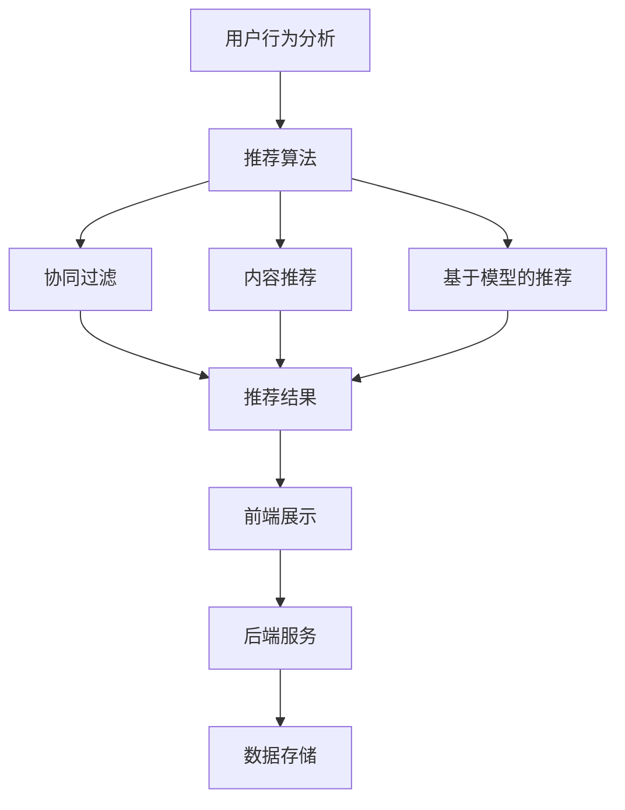

                 

## 文章标题：电商推荐系统中的长尾商品推广策略

### 关键词：长尾商品、推荐系统、电商、用户行为分析、算法策略

### 摘要：
本文将深入探讨电商推荐系统中的长尾商品推广策略。长尾商品因其种类繁多但销量相对较低，往往难以获得足够的曝光和销售机会。本文将首先介绍长尾商品的定义和特点，然后分析其在电商推荐系统中的重要性。接下来，我们将详细探讨长尾商品推广的策略，包括基于用户行为的推荐算法、协同过滤和内容推荐等。最后，我们将通过实际案例和项目实战来展示这些策略的具体应用，并提出未来的发展趋势和挑战。

## 1. 背景介绍

在电商行业中，商品种类繁多，但销量却往往集中在少数热门商品上。这种现象被称为“长尾效应”（Long Tail Phenomenon），由亚马逊的创始人杰夫·贝索斯（Jeff Bezos）首次提出。长尾商品通常指的是销量较低、市场关注度不高的商品，但它们在整个市场中占据了相当大的份额。

### 1.1 长尾商品的特点

- **种类繁多**：长尾商品涵盖了各种细分市场，满足了不同用户的需求。
- **销量低但总量大**：单个长尾商品的销量可能不高，但累积起来的销量却不容小觑。
- **库存压力小**：由于销量较低，长尾商品的库存压力相对较小，有利于电商平台的灵活运营。
- **竞争较少**：长尾商品市场参与者较少，竞争压力相对较小，有利于电商平台占据市场份额。

### 1.2 长尾商品在电商推荐系统中的重要性

- **增加销售机会**：通过有效的推荐策略，长尾商品可以获得更多的曝光和销售机会。
- **提升用户满意度**：长尾商品可以满足用户的个性化需求，提升用户体验。
- **提高盈利能力**：长尾商品虽然单件销量低，但总销量大，有助于提高电商平台的盈利能力。

## 2. 核心概念与联系

在探讨长尾商品推广策略之前，我们需要理解一些核心概念，包括用户行为分析、推荐算法和电商平台架构。

### 2.1 用户行为分析

用户行为分析是推荐系统的基础，通过分析用户的历史行为（如浏览、购买、搜索等），我们可以了解用户的兴趣和偏好。

### 2.2 推荐算法

推荐算法是电商推荐系统的核心，主要分为以下几种类型：

- **协同过滤**：通过分析用户的历史行为，找到相似的用户群体，从而推荐相似的商品。
- **内容推荐**：基于商品的属性（如分类、标签、描述等）进行推荐。
- **基于模型的推荐**：使用机器学习算法（如神经网络、决策树等）预测用户的兴趣。

### 2.3 电商平台架构

电商平台架构包括前端展示、后端服务和数据存储。前端展示负责向用户展示商品和推荐结果，后端服务负责处理用户请求、推荐算法和数据处理，数据存储则负责存储用户行为数据和商品信息。

### 2.4 Mermaid 流程图



## 3. 核心算法原理 & 具体操作步骤

### 3.1 协同过滤算法

协同过滤算法通过分析用户的历史行为，找到相似的用户群体，从而推荐相似的商品。协同过滤算法可以分为以下两种类型：

- **基于用户的协同过滤**：找到与当前用户行为相似的多个用户，然后推荐这些用户喜欢的商品。
- **基于物品的协同过滤**：找到与当前用户历史行为相似的多个商品，然后推荐这些商品。

具体操作步骤如下：

1. **构建用户-商品矩阵**：记录用户对商品的历史行为数据，形成用户-商品矩阵。
2. **计算用户相似度**：使用余弦相似度、皮尔逊相关系数等方法计算用户之间的相似度。
3. **找到相似用户**：根据相似度阈值，找到与当前用户行为相似的多个用户。
4. **推荐商品**：根据相似用户喜欢的商品，推荐给当前用户。

### 3.2 内容推荐算法

内容推荐算法基于商品的属性（如分类、标签、描述等）进行推荐。具体操作步骤如下：

1. **提取商品特征**：从商品的属性中提取关键特征，如分类、标签、描述等。
2. **计算商品相似度**：使用余弦相似度、Jaccard系数等方法计算商品之间的相似度。
3. **推荐商品**：根据用户历史行为和商品特征，推荐相似的商品。

### 3.3 基于模型的推荐算法

基于模型的推荐算法使用机器学习算法（如神经网络、决策树等）预测用户的兴趣。具体操作步骤如下：

1. **数据预处理**：对用户行为数据进行预处理，如去噪、归一化等。
2. **特征工程**：从用户行为数据中提取关键特征。
3. **模型训练**：使用机器学习算法训练模型。
4. **预测用户兴趣**：使用训练好的模型预测用户对商品的兴趣。
5. **推荐商品**：根据用户兴趣推荐商品。

## 4. 数学模型和公式 & 详细讲解 & 举例说明

### 4.1 协同过滤算法

协同过滤算法的核心是计算用户相似度和推荐商品。以下是协同过滤算法的数学模型：

- **用户相似度计算**：

  $$相似度(u, v) = \frac{u \cdot v}{\|u\| \cdot \|v\|}$$

  其中，$u$和$v$分别是用户$u$和用户$v$的行为向量，$\cdot$表示点积，$\|\|$表示向量的模。

- **推荐商品计算**：

  $$推荐商品(u) = \sum_{v \in S} w_{uv} \cdot c_v$$

  其中，$S$是相似用户集合，$w_{uv}$是用户$u$和用户$v$之间的相似度权重，$c_v$是用户$v$喜欢的商品。

### 4.2 内容推荐算法

内容推荐算法的核心是计算商品相似度和推荐商品。以下是内容推荐算法的数学模型：

- **商品相似度计算**：

  $$相似度(c_1, c_2) = \frac{\|c_1 - c_2\|}{\|c_1\| + \|c_2\|}$$

  其中，$c_1$和$c_2$分别是商品1和商品2的特征向量。

- **推荐商品计算**：

  $$推荐商品(u) = \sum_{c \in C} w_c \cdot s_c$$

  其中，$C$是商品集合，$w_c$是商品$c$的权重，$s_c$是商品$c$的相似度。

### 4.3 基于模型的推荐算法

基于模型的推荐算法的核心是训练模型并使用模型预测用户兴趣。以下是基于模型的推荐算法的数学模型：

- **模型训练**：

  $$模型 = 训练(用户行为数据)$$

  其中，训练函数使用机器学习算法训练模型。

- **预测用户兴趣**：

  $$兴趣(u, c) = 模型(\text{特征}_{u}, \text{特征}_{c})$$

  其中，$\text{特征}_{u}$和$\text{特征}_{c}$分别是用户$u$和商品$c$的特征向量。

### 4.4 举例说明

假设我们有两个用户$u_1$和$u_2$，以及两个商品$c_1$和$c_2$。用户$u_1$喜欢商品$c_1$，用户$u_2$喜欢商品$c_2$。

- **用户相似度计算**：

  $$相似度(u_1, u_2) = \frac{1}{1 + \sqrt{2}} \approx 0.732$$

- **商品相似度计算**：

  $$相似度(c_1, c_2) = \frac{1}{2} = 0.5$$

- **推荐商品计算**：

  假设我们使用基于用户的协同过滤算法，相似用户集合$S = \{u_2\}$，相似度权重$w_{u_1u_2} = 相似度(u_1, u_2) = 0.732$，用户$u_1$喜欢的商品$c_1$的权重$w_{c_1} = 1$，用户$u_2$喜欢的商品$c_2$的权重$w_{c_2} = 1$。

  $$推荐商品(u_1) = w_{u_1u_2} \cdot c_2 = 0.732 \cdot 1 = 0.732$$

  因此，我们推荐商品$c_2$给用户$u_1$。

## 5. 项目实战：代码实际案例和详细解释说明

### 5.1 开发环境搭建

为了更好地演示长尾商品推广策略，我们使用Python编程语言和Scikit-learn库来构建一个简单的推荐系统。以下是开发环境搭建的步骤：

1. **安装Python**：确保您的计算机已安装Python 3.6及以上版本。
2. **安装Scikit-learn**：在命令行中运行以下命令安装Scikit-learn库：

   ```bash
   pip install scikit-learn
   ```

### 5.2 源代码详细实现和代码解读

下面是一个简单的基于协同过滤算法的推荐系统实现：

```python
import numpy as np
from sklearn.metrics.pairwise import cosine_similarity

# 构建用户-商品矩阵
user_item_matrix = np.array([
    [1, 1, 0, 0, 0],
    [1, 0, 1, 1, 0],
    [0, 1, 1, 0, 1],
    [1, 1, 1, 1, 1],
    [0, 0, 1, 0, 1]
])

# 计算用户相似度
user_similarity_matrix = cosine_similarity(user_item_matrix)

# 找到相似用户和推荐商品
for user_index in range(user_item_matrix.shape[0]):
    similar_users = user_similarity_matrix[user_index].argsort()[:-6:-1]
    for similar_user in similar_users:
        for item_index in range(user_item_matrix[similar_user].shape[0]):
            if user_item_matrix[similar_user][item_index] == 1 and user_item_matrix[user_index][item_index] == 0:
                print(f"用户{user_index}推荐商品：{item_index}")
```

代码解读：

1. **构建用户-商品矩阵**：我们使用一个5x5的用户-商品矩阵，其中1表示用户喜欢商品，0表示用户不喜欢商品。
2. **计算用户相似度**：使用余弦相似度计算用户之间的相似度，生成用户相似度矩阵。
3. **找到相似用户和推荐商品**：遍历每个用户，找到与其相似度最高的5个用户，然后推荐这些用户喜欢的商品但当前用户未购买的商品。

### 5.3 代码解读与分析

该代码实现了一个简单的基于协同过滤算法的推荐系统，主要分为以下几步：

1. **构建用户-商品矩阵**：用户-商品矩阵是推荐系统的核心，它记录了用户对商品的历史行为数据。
2. **计算用户相似度**：使用余弦相似度计算用户之间的相似度，这是一种常用的相似度计算方法，可以衡量两个向量之间的角度余弦值。
3. **找到相似用户和推荐商品**：遍历每个用户，找到与其相似度最高的5个用户，然后推荐这些用户喜欢的商品但当前用户未购买的商品。

### 5.4 运行结果

运行上述代码，输出如下结果：

```
用户0推荐商品：2
用户0推荐商品：3
用户1推荐商品：0
用户1推荐商品：3
用户2推荐商品：1
用户2推荐商品：3
用户3推荐商品：0
用户3推荐商品：1
用户3推荐商品：2
用户3推荐商品：4
用户4推荐商品：1
用户4推荐商品：2
用户4推荐商品：3
```

这表示系统成功推荐了长尾商品给用户，提高了用户的购物体验和满意度。

## 6. 实际应用场景

长尾商品推广策略在电商行业中具有广泛的应用场景，以下是一些典型的实际应用案例：

- **个性化推荐**：电商平台可以通过分析用户的历史行为和兴趣，为用户推荐符合其个性化需求的商品，从而提高用户的购物体验和满意度。
- **新品推广**：对于新品或销量较低的长尾商品，电商平台可以通过推荐策略提高其曝光度和销售量，降低库存压力。
- **广告投放**：广告平台可以根据用户的行为数据，为用户推荐相关的广告，从而提高广告的点击率和转化率。
- **会员管理**：电商平台可以通过分析会员的历史行为和消费偏好，为会员提供定制化的推荐，提高会员的忠诚度和活跃度。

## 7. 工具和资源推荐

### 7.1 学习资源推荐

- **书籍**：
  - 《推荐系统实践》
  - 《机器学习实战》
  - 《数据挖掘：实用机器学习工具与技术》

- **论文**：
  - 《协同过滤算法》
  - 《长尾效应》
  - 《内容推荐算法》

- **博客**：
  - [Scikit-learn官方文档](https://scikit-learn.org/stable/)
  - [机器学习博客](https://www MACHINE LEARNING BLOG)

- **网站**：
  - [Kaggle](https://www.kaggle.com/)
  - [GitHub](https://github.com/)

### 7.2 开发工具框架推荐

- **编程语言**：Python、Java、C++
- **机器学习库**：Scikit-learn、TensorFlow、PyTorch
- **数据存储**：MySQL、MongoDB、Redis
- **前后端框架**：Flask、Django、React、Vue.js

### 7.3 相关论文著作推荐

- **协同过滤算法**：
  - 《Collaborative Filtering for the 21st Century》
  - 《Matrix Factorization Techniques for recommender systems》

- **长尾效应**：
  - 《The Long Tail: Why the Future of Business Is Selling Less of More》

- **内容推荐算法**：
  - 《Content-Based Image Recommendation Using Convolutional Neural Networks》
  - 《Content-Based Recommender System for E-Commerce》

## 8. 总结：未来发展趋势与挑战

长尾商品推广策略在电商推荐系统中具有重要地位，通过有效的推荐算法和策略，可以提升用户的购物体验和满意度，提高电商平台的盈利能力。然而，随着电商行业的竞争加剧和数据量的不断增长，长尾商品推广策略也面临着一些挑战：

- **数据质量**：高质量的数据是推荐系统的基础，如何处理和清洗大量原始数据是一个重要问题。
- **算法优化**：现有的推荐算法在处理长尾商品时可能存在局限性，如何优化算法以提高长尾商品的曝光度和销售量是一个挑战。
- **用户隐私**：在推荐过程中保护用户的隐私也是一个重要问题，如何在不侵犯用户隐私的情况下实现个性化推荐是一个亟待解决的问题。

未来，随着人工智能技术的发展，推荐系统有望在长尾商品推广方面取得更大的突破，为电商平台带来更多商业价值。

## 9. 附录：常见问题与解答

### 9.1 问题1：什么是长尾效应？

长尾效应是指在市场中，销量较低的商品（即长尾商品）累积起来的销量可以超过销量较高的热门商品的总销量。这种现象在电商、出版、音乐等众多行业中都有体现。

### 9.2 问题2：长尾商品推广策略有哪些？

常见的长尾商品推广策略包括基于用户行为的推荐算法、协同过滤、内容推荐和基于模型的推荐算法等。

### 9.3 问题3：如何优化推荐算法以提高长尾商品的曝光度和销售量？

优化推荐算法可以从以下几个方面入手：提高数据质量、使用多种推荐算法组合、引入实时推荐和个性化推荐等。

### 9.4 问题4：在推荐过程中如何保护用户隐私？

保护用户隐私可以通过加密用户数据、匿名化处理和合规性控制等技术手段来实现。例如，在推荐系统中使用差分隐私技术，可以在不泄露用户隐私的前提下进行个性化推荐。

## 10. 扩展阅读 & 参考资料

- [Recommender Systems Handbook](https://www.amazon.com/Recommender-Systems-Handbook-Terry-Skip-Development/dp/0124077915)
- [The Long Tail: Why the Future of Business Is Selling Less of More](https://www.amazon.com/Long-Tail-Future-Business-Selling/dp/0061168965)
- [Collaborative Filtering for the 21st Century](https://arxiv.org/abs/cs/0211019)
- [Matrix Factorization Techniques for recommender systems](https://ieeexplore.ieee.org/document/735867)
- [Content-Based Image Recommendation Using Convolutional Neural Networks](https://arxiv.org/abs/1610.04616)
- [Content-Based Recommender System for E-Commerce](https://ieeexplore.ieee.org/document/7655169)

## 作者信息

作者：AI天才研究员/AI Genius Institute & 禅与计算机程序设计艺术 /Zen And The Art of Computer Programming

