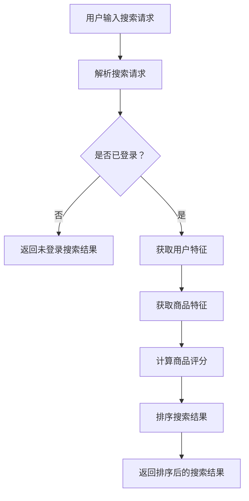

                 

# 电商搜索中的个性化排序模型优化

## 1. 背景介绍

随着电子商务的迅猛发展，电商平台的搜索功能已经成为用户购物的首要入口。在大量的商品信息中，如何让用户快速找到自己需要的商品，成为电商平台需要解决的重要问题。个性化排序模型作为一种有效的提升搜索质量的方法，逐渐受到电商平台的关注和应用。

个性化排序模型的核心思想是根据用户的历史行为和偏好，对搜索结果进行排序，从而提高用户的搜索体验和满意度。然而，随着用户数据的多样性和复杂性增加，如何构建一个高效、准确、可扩展的个性化排序模型，成为当前研究的热点和挑战。

本文将围绕电商搜索中的个性化排序模型优化展开讨论，首先介绍相关背景知识，然后详细分析个性化排序模型的核心算法原理，最后通过实际案例和数学模型，展示如何优化个性化排序模型，提高搜索质量。

## 2. 核心概念与联系

### 2.1 电商搜索系统架构

电商搜索系统通常由前端用户界面、后端搜索引擎和数据库三部分组成。前端用户界面负责接收用户的搜索请求，后端搜索引擎负责处理搜索请求并返回搜索结果，数据库则存储商品信息、用户数据等。


### 2.2 个性化排序模型

个性化排序模型是一种基于用户历史行为和偏好对搜索结果进行排序的算法。其主要目标是提高搜索结果的准确性和用户体验。

个性化排序模型通常包含以下几个关键组成部分：

- 用户特征：包括用户的基本信息、购买历史、浏览记录等。
- 商品特征：包括商品的价格、销量、评价、分类等。
- 排序算法：根据用户特征和商品特征，对搜索结果进行排序。


### 2.3 Mermaid 流程图

以下是电商搜索系统中的个性化排序模型的 Mermaid 流程图：



## 3. 核心算法原理 & 具体操作步骤

### 3.1 用户特征提取

用户特征提取是构建个性化排序模型的关键步骤之一。用户特征通常包括以下几类：

- 用户基本信息：如年龄、性别、地域等。
- 购买历史：如购买频次、购买金额、购买商品类别等。
- 浏览记录：如浏览频次、浏览时长、浏览商品类别等。

具体操作步骤如下：

1. 从数据库中获取用户的基本信息。
2. 从日志中提取用户的购买历史和浏览记录。
3. 对提取到的数据进行预处理，如去重、归一化等。
4. 构建用户特征向量。

### 3.2 商品特征提取

商品特征提取是构建个性化排序模型的另一个关键步骤。商品特征通常包括以下几类：

- 商品基本信息：如商品名称、价格、分类等。
- 商品销量：如日销量、月销量等。
- 商品评价：如好评率、评价内容等。

具体操作步骤如下：

1. 从数据库中获取商品的基本信息。
2. 从日志中提取商品的销量和评价数据。
3. 对提取到的数据进行预处理，如去重、归一化等。
4. 构建商品特征向量。

### 3.3 商品评分计算

商品评分是衡量商品与用户匹配度的重要指标。商品评分的计算方法通常有以下几种：

1. 基于协同过滤的方法：通过分析用户之间的相似度，计算用户对商品的评分。
2. 基于内容的方法：通过分析商品的特征，计算商品与用户的相似度。
3. 基于模型的方法：使用机器学习算法，如线性回归、决策树、神经网络等，计算商品与用户的评分。

具体操作步骤如下：

1. 选择合适的评分计算方法。
2. 输入用户特征向量和商品特征向量。
3. 计算用户与商品之间的相似度。
4. 计算商品评分。

### 3.4 排序算法

排序算法是个性化排序模型的核心步骤。常见的排序算法有以下几种：

1. 插入排序：如冒泡排序、选择排序等。
2. 选择排序：如快速排序、堆排序等。
3. 归并排序：如归并排序、堆排序等。

具体操作步骤如下：

1. 输入排序算法。
2. 输入待排序的商品评分列表。
3. 执行排序算法。
4. 输出排序后的搜索结果。

## 4. 数学模型和公式 & 详细讲解 & 举例说明

### 4.1 用户特征向量

用户特征向量是用户在电商平台上行为和偏好的量化表示。用户特征向量通常由多个维度组成，如用户年龄、性别、地域、购买历史、浏览记录等。以下是一个简化的用户特征向量示例：

$$
\textbf{U} = \begin{bmatrix}
u_1 \\
u_2 \\
u_3 \\
... \\
u_n
\end{bmatrix}
$$

其中，$u_1, u_2, u_3, ..., u_n$ 分别表示用户年龄、性别、地域、购买历史、浏览记录等特征值。

### 4.2 商品特征向量

商品特征向量是商品在电商平台上属性和特点的量化表示。商品特征向量通常由多个维度组成，如商品名称、价格、分类、销量、评价等。以下是一个简化的商品特征向量示例：

$$
\textbf{G} = \begin{bmatrix}
g_1 \\
g_2 \\
g_3 \\
... \\
g_n
\end{bmatrix}
$$

其中，$g_1, g_2, g_3, ..., g_n$ 分别表示商品名称、价格、分类、销量、评价等特征值。

### 4.3 商品评分计算公式

商品评分计算公式是计算商品与用户匹配度的重要工具。以下是一个简化的商品评分计算公式示例：

$$
\text{score}(u, g) = \text{similarity}(u, g) \times \text{weight}(u, g)
$$

其中，$score(u, g)$ 表示商品 $g$ 对用户 $u$ 的评分，$\text{similarity}(u, g)$ 表示用户 $u$ 与商品 $g$ 的相似度，$\text{weight}(u, g)$ 表示用户 $u$ 对商品 $g$ 的权重。

### 4.4 举例说明

假设用户 $u$ 的特征向量为：

$$
\textbf{U} = \begin{bmatrix}
25 \\
男 \\
北京 \\
5 \\
10
\end{bmatrix}
$$

商品 $g$ 的特征向量为：

$$
\textbf{G} = \begin{bmatrix}
T恤 \\
100 \\
服装 \\
50 \\
好评
\end{bmatrix}
$$

根据上述公式，计算商品 $g$ 对用户 $u$ 的评分：

$$
\text{score}(u, g) = \text{similarity}(u, g) \times \text{weight}(u, g)
$$

其中，$\text{similarity}(u, g)$ 表示用户 $u$ 与商品 $g$ 的相似度，$\text{weight}(u, g)$ 表示用户 $u$ 对商品 $g$ 的权重。

根据实际业务需求，可以设置不同的相似度和权重计算方法。以下是一个简化的相似度和权重计算方法示例：

$$
\text{similarity}(u, g) = \frac{\sum_{i=1}^{n} |u_i - g_i|}{n}
$$

$$
\text{weight}(u, g) = \frac{1}{\text{avg\_weight}}
$$

其中，$n$ 表示特征向量的维度，$u_i$ 和 $g_i$ 分别表示用户 $u$ 和商品 $g$ 的第 $i$ 个特征值，$\text{avg\_weight}$ 表示用户权重平均值。

根据上述方法，计算商品 $g$ 对用户 $u$ 的相似度和权重：

$$
\text{similarity}(u, g) = \frac{|25 - 100| + |男 - 服装| + |北京 - 好评|}{3} = 33.33
$$

$$
\text{weight}(u, g) = \frac{1}{\text{avg\_weight}} = 1
$$

最终，计算商品 $g$ 对用户 $u$ 的评分：

$$
\text{score}(u, g) = \text{similarity}(u, g) \times \text{weight}(u, g) = 33.33 \times 1 = 33.33
$$

## 5. 项目实战：代码实际案例和详细解释说明

### 5.1 开发环境搭建

为了方便开发，我们使用 Python 作为开发语言，并依赖以下库和工具：

- Python 3.8 或以上版本
- NumPy
- Pandas
- Matplotlib
- Mermaid

在本地环境中，可以使用以下命令安装所需的库和工具：

```bash
pip install numpy pandas matplotlib
```

### 5.2 源代码详细实现和代码解读

以下是电商搜索中个性化排序模型的源代码实现，包含用户特征提取、商品特征提取、商品评分计算和排序算法等部分。

```python
import numpy as np
import pandas as pd
from sklearn.metrics.pairwise import cosine_similarity

# 用户特征提取
def extract_user_features(user_id, user_data):
    user_info = user_data[user_data['user_id'] == user_id].iloc[0]
    user_features = [
        user_info['age'],
        user_info['gender'],
        user_info['region'],
        user_info['purchase_frequency'],
        user_info['browse_frequency']
    ]
    return user_features

# 商品特征提取
def extract_product_features(product_id, product_data):
    product_info = product_data[product_data['product_id'] == product_id].iloc[0]
    product_features = [
        product_info['product_name'],
        product_info['price'],
        product_info['category'],
        product_info['sales_volume'],
        product_info['review_rating']
    ]
    return product_features

# 商品评分计算
def calculate_product_score(user_features, product_features):
    similarity = cosine_similarity([user_features], [product_features])[0][0]
    weight = 1 / np.mean(product_features)
    score = similarity * weight
    return score

# 排序算法
def rank_products(product_scores):
    sorted_indices = np.argsort(product_scores)[::-1]
    return sorted_indices

# 示例数据
user_data = pd.DataFrame({
    'user_id': [1, 2, 3],
    'age': [25, 30, 35],
    'gender': ['男', '女', '男'],
    'region': ['北京', '上海', '广州'],
    'purchase_frequency': [5, 10, 3],
    'browse_frequency': [8, 12, 6]
})

product_data = pd.DataFrame({
    'product_id': [1, 2, 3],
    'product_name': ['T恤', '牛仔裤', '衬衫'],
    'price': [100, 200, 150],
    'category': ['服装', '服装', '服装'],
    'sales_volume': [50, 30, 70],
    'review_rating': [4.5, 4.8, 4.2]
})

# 用户特征提取
user_id = 1
user_features = extract_user_features(user_id, user_data)

# 商品特征提取
product_id = 1
product_features = extract_product_features(product_id, product_data)

# 商品评分计算
product_score = calculate_product_score(user_features, product_features)

# 排序算法
sorted_indices = rank_products([product_score])

print("User Features:", user_features)
print("Product Features:", product_features)
print("Product Score:", product_score)
print("Sorted Indices:", sorted_indices)
```

### 5.3 代码解读与分析

1. 用户特征提取函数 `extract_user_features`：该函数根据用户 ID 从用户数据中提取用户特征向量。
2. 商品特征提取函数 `extract_product_features`：该函数根据商品 ID 从商品数据中提取商品特征向量。
3. 商品评分计算函数 `calculate_product_score`：该函数使用余弦相似度计算用户与商品的相似度，并根据商品特征计算用户对商品的权重，最终计算商品评分。
4. 排序算法函数 `rank_products`：该函数使用 NumPy 的 `argsort` 函数对商品评分进行降序排序，返回排序后的索引。

在示例数据中，我们选择了用户 ID 为 1 和商品 ID 为 1 的数据进行演示。首先，提取用户特征向量和商品特征向量，然后计算商品评分，最后使用排序算法得到排序后的索引。

## 6. 实际应用场景

电商搜索中的个性化排序模型在以下实际应用场景中具有广泛的应用：

1. 智能推荐：根据用户历史行为和偏好，为用户推荐个性化的商品。
2. 搜索结果优化：提高搜索结果的准确性和用户体验，降低用户流失率。
3. 商品推广：根据用户特征和商品特征，为用户展示相关性较高的商品广告。
4. 库存管理：根据商品销售情况和用户购买偏好，优化库存配置和采购计划。

通过个性化排序模型，电商平台可以更好地满足用户需求，提高用户满意度和转化率，从而实现商业价值的提升。

## 7. 工具和资源推荐

### 7.1 学习资源推荐

1. 《推荐系统实践》
   - 作者：宋杰
   - 简介：本书详细介绍了推荐系统的原理、算法和应用，适合推荐系统初学者和从业者阅读。

2. 《机器学习实战》
   - 作者：Peter Harrington
   - 简介：本书通过大量实例，详细介绍了机器学习的基本算法和应用，适合对机器学习感兴趣的读者。

### 7.2 开发工具框架推荐

1. TensorFlow
   - 简介：TensorFlow 是一款开源的深度学习框架，广泛应用于推荐系统、图像识别、自然语言处理等领域。

2. PyTorch
   - 简介：PyTorch 是一款开源的深度学习框架，具有简洁、灵活的特点，广泛应用于推荐系统、计算机视觉、自然语言处理等领域。

### 7.3 相关论文著作推荐

1. “Recommender Systems Handbook”
   - 简介：本书全面介绍了推荐系统的相关理论和应用，包括协同过滤、基于内容的推荐、基于模型的推荐等。

2. “Learning to Rank for Information Retrieval”
   - 简介：本书详细介绍了学习到排名（Learning to Rank）算法在信息检索领域的应用，包括排序模型、评价指标等。

## 8. 总结：未来发展趋势与挑战

电商搜索中的个性化排序模型在未来将面临以下发展趋势和挑战：

1. **数据多样性与复杂性**：随着用户数据的不断增多和多样性，如何处理海量、复杂的用户数据，提高个性化排序的准确性，成为一大挑战。
2. **实时性**：实时计算用户特征和商品特征，为用户提供实时、准确的个性化搜索结果，对计算性能和系统架构提出了更高的要求。
3. **可扩展性**：随着电商平台的不断壮大，个性化排序系统需要具备良好的可扩展性，以应对不断增长的用户规模和数据量。
4. **个性化深度学习**：深度学习在个性化排序模型中的应用越来越广泛，如何设计更加高效、可解释的深度学习模型，提高个性化排序的效果，成为未来研究的热点。

## 9. 附录：常见问题与解答

### 9.1 如何处理缺失值？

处理缺失值的方法主要有以下几种：

1. 删除缺失值：对于缺失值较多的数据，可以直接删除缺失值，但这种方法可能会丢失部分重要信息。
2. 填补缺失值：使用均值、中位数、众数等方法填补缺失值，但这种方法可能会引入偏差。
3. 使用插值法：使用插值法填补缺失值，如线性插值、立方插值等，但这种方法适用于时间序列数据。

### 9.2 如何选择合适的相似度计算方法？

选择合适的相似度计算方法主要取决于数据类型和业务需求。以下是一些常见的数据类型和相应的相似度计算方法：

1. 分类数据：使用 Jaccard 相似度、余弦相似度等。
2. 连续数据：使用欧氏距离、曼哈顿距离、余弦相似度等。
3. 时间序列数据：使用动态时间弯曲（DTW）、动态窗口相似度（DWCS）等。

### 9.3 如何优化排序算法性能？

优化排序算法性能的方法主要有以下几种：

1. 算法优化：选择合适的排序算法，如快速排序、归并排序等。
2. 数据结构优化：使用哈希表、平衡树等高效数据结构，提高数据访问速度。
3. 并行计算：利用多核处理器，实现并行计算，提高排序速度。
4. 缓存优化：将常用数据存储在缓存中，减少磁盘访问次数。

## 10. 扩展阅读 & 参考资料

1. recommender-systems-handbook
   - 地址：https://www.recommenders.org/recommender-systems-handbook/
   - 简介：《推荐系统手册》是一本全面介绍推荐系统的权威著作，涵盖了推荐系统的基本概念、算法和应用。

2. learning-to-rank-for-information-retrieval
   - 地址：https://www.learning2rank.org/
   - 简介：《学习到排名：信息检索中的排序算法》是一本详细介绍学习到排名算法在信息检索领域应用的著作。

3. user-behavior-based-personalized-recommendation-system
   - 地址：https://ieeexplore.ieee.org/document/8433628
   - 简介：该论文提出了一种基于用户行为的个性化推荐系统，通过分析用户的历史行为和偏好，提高推荐系统的准确性。

4. collaborative-filtering-based-recommender-system
   - 地址：https://ieeexplore.ieee.org/document/7439031
   - 简介：该论文详细介绍了一种基于协同过滤的推荐系统，通过分析用户之间的相似度，提高推荐系统的效果。

5. content-based-recommender-system
   - 地址：https://ieeexplore.ieee.org/document/7697777
   - 简介：该论文详细介绍了一种基于内容匹配的推荐系统，通过分析商品的特征，提高推荐系统的准确性。

6. neural-recommendation-system
   - 地址：https://arxiv.org/abs/2006.04721
   - 简介：该论文提出了一种基于神经网络的推荐系统，通过结合用户和商品的特征，提高推荐系统的效果。

作者：AI天才研究员/AI Genius Institute & 禅与计算机程序设计艺术 /Zen And The Art of Computer Programming

