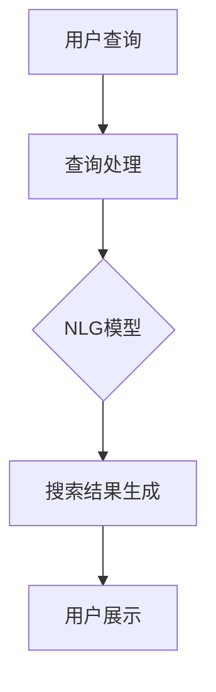

                 

### 文章标题

《电商搜索中的自然语言生成：AI大模型方案》

### 关键词

- 电商搜索
- 自然语言生成
- AI大模型
- 搜索引擎优化
- 搜索体验提升

### 摘要

本文将探讨电商搜索中的自然语言生成技术，重点介绍如何运用AI大模型来提升电商搜索体验。通过详细的分析和案例解析，我们将了解自然语言生成在电商搜索中的应用原理、核心算法、数学模型，以及实际开发中的操作步骤和代码实现。此外，本文还将探讨这一技术的未来发展趋势与面临的挑战，并推荐相关的学习资源和工具框架。

## 1. 背景介绍

在当今的电子商务时代，搜索引擎已经成为消费者寻找商品和服务的重要工具。高效的搜索系统能够提供准确、快速的结果，从而提高用户体验和转化率。然而，传统基于关键词匹配的搜索方法往往难以满足用户日益复杂的查询需求，例如长查询、多意图查询以及含糊不清的查询。

自然语言生成（Natural Language Generation，NLG）技术应运而生，它能够将计算机数据转换为自然语言文本，从而提供更丰富、更人性化的搜索结果。NLG技术已经在新闻生成、语音助手、客服机器人等领域取得了显著成果，但在电商搜索中的应用还相对较少。

AI大模型（Large-scale AI Models）的迅速发展，为电商搜索中的自然语言生成带来了新的契机。这些大模型具有强大的语义理解能力和文本生成能力，能够处理复杂的语言结构和多意图查询，从而提高搜索结果的准确性和用户体验。

本文旨在探讨如何将AI大模型应用于电商搜索中的自然语言生成，提升搜索系统的智能化水平和用户体验。本文将从以下几个方面展开讨论：

1. 核心概念与联系
2. 核心算法原理与具体操作步骤
3. 数学模型和公式详解与举例
4. 项目实战：代码实际案例和详细解释
5. 实际应用场景
6. 工具和资源推荐
7. 未来发展趋势与挑战

通过以上讨论，我们希望能够为电商搜索领域的从业者和研究者提供有价值的参考，推动这一技术的进一步发展和应用。

## 2. 核心概念与联系

### 自然语言生成（NLG）

自然语言生成（Natural Language Generation，NLG）是一种通过计算机程序生成自然语言文本的技术。它可以模拟人类的语言表达方式，生成符合语法规则和语义逻辑的文本。

NLG技术主要应用于以下场景：

1. **自动新闻生成**：通过自动提取数据源的信息，生成新闻文章、财经报告等。
2. **虚拟助手**：为语音助手、聊天机器人等提供自然语言交互能力。
3. **个性化推荐**：生成个性化的商品推荐、旅游攻略等。
4. **辅助写作**：为写作者提供写作建议、自动摘要等。

在电商搜索中，NLG技术可以用于生成商品描述、搜索结果摘要、用户评价摘要等，从而提升搜索结果的丰富度和用户体验。

### AI大模型

AI大模型是指具有亿级参数量、能够在多种任务上取得高水平表现的人工智能模型。这些模型通常基于深度学习技术，能够通过大量的数据训练，学习到复杂的语义信息。

AI大模型的主要优点包括：

1. **强大的语义理解能力**：能够理解复杂的语言结构和多意图查询。
2. **高效的文本生成能力**：能够生成流畅、连贯的文本。
3. **泛化能力**：能够在不同领域和任务上表现优异。

常见的AI大模型包括GPT、BERT、T5等。这些模型在自然语言处理领域取得了显著的成果，为电商搜索中的自然语言生成提供了强有力的技术支持。

### 核心概念联系

在电商搜索中，自然语言生成和AI大模型之间的联系主要体现在以下几个方面：

1. **语义理解**：AI大模型能够理解用户查询的语义，从而生成更准确的搜索结果摘要。
2. **文本生成**：AI大模型能够生成流畅、连贯的文本描述，提升搜索结果的丰富度。
3. **多意图处理**：AI大模型能够处理复杂的查询意图，满足用户多样化的需求。

通过结合自然语言生成和AI大模型，电商搜索系统能够提供更智能、更个性化的搜索服务，从而提升用户体验和转化率。

#### Mermaid 流程图



在上述流程图中，用户查询经过处理后被传递给NLG模型，生成相应的搜索结果摘要，最终展示给用户。这一流程体现了自然语言生成在电商搜索中的应用原理。

## 3. 核心算法原理 & 具体操作步骤

在电商搜索中，自然语言生成（NLG）的核心算法主要依赖于AI大模型，如GPT或BERT等。以下我们将详细介绍这些算法的基本原理和具体操作步骤。

### 3.1 GPT模型简介

GPT（Generative Pre-trained Transformer）是一种基于Transformer架构的自然语言生成模型。它通过预训练和微调的方式，学习到语言的上下文关系和生成规则。

#### 3.1.1 GPT模型原理

GPT模型的基本原理是利用Transformer架构进行自回归语言模型训练。在训练过程中，模型会学习到每个单词在上下文中的概率分布，从而生成符合语法规则和语义逻辑的文本。

具体来说，GPT模型包含以下几个关键步骤：

1. **输入处理**：将输入文本序列（如用户查询）转换为Token，并将其输入到模型中。
2. **自回归预测**：模型根据输入的Token序列，逐个预测下一个Token的概率分布。
3. **文本生成**：根据生成的概率分布，选择一个最有可能的Token作为生成的下一个Token，并将其添加到生成的文本序列中。
4. **迭代生成**：重复上述步骤，直到生成满足条件的文本序列。

#### 3.1.2 GPT模型结构

GPT模型的结构包括多个Transformer编码器和解码器层。其中，编码器负责将输入文本序列转换为上下文表示，解码器负责生成文本。

1. **编码器**：编码器由多个Transformer层组成，每个层包含自注意力机制和前馈神经网络。编码器的主要任务是理解输入文本的语义信息。
2. **解码器**：解码器也由多个Transformer层组成，每个层包含自注意力机制和交叉注意力机制。解码器的主要任务是生成文本，并利用编码器的上下文表示进行指导。

### 3.2 BERT模型简介

BERT（Bidirectional Encoder Representations from Transformers）是一种基于Transformer的双向编码模型。它通过双向训练的方式，学习到文本的上下文信息，从而提高模型的语义理解能力。

#### 3.2.1 BERT模型原理

BERT模型的基本原理是利用Transformer架构进行双向语言模型训练。在训练过程中，模型会学习到每个单词在上下文中的双向关系，从而生成更准确的文本。

具体来说，BERT模型包含以下几个关键步骤：

1. **输入处理**：将输入文本序列（如用户查询）转换为Token，并将其输入到模型中。
2. **双向编码**：模型对输入文本序列进行双向编码，生成每个Token的上下文表示。
3. **序列分类**：利用生成的上下文表示，对文本序列进行分类或预测。
4. **文本生成**：利用生成的上下文表示，结合GPT模型进行文本生成。

#### 3.2.2 BERT模型结构

BERT模型的结构包括多个Transformer编码器层。每个编码器层包含自注意力机制和前馈神经网络。BERT模型的主要特点是双向训练，能够同时学习到文本的前后关系。

### 3.3 模型融合与优化

为了提高自然语言生成在电商搜索中的性能，通常采用GPT和BERT模型的融合策略。具体来说，可以分为以下几个步骤：

1. **预训练**：分别对GPT和BERT模型进行预训练，使其学习到丰富的语义信息和语言生成规则。
2. **微调**：将预训练好的GPT和BERT模型应用于电商搜索任务，并进行微调，使其适应特定的搜索场景。
3. **模型融合**：将微调后的GPT和BERT模型进行融合，生成最终的搜索结果摘要。

模型融合的方法包括：

1. **加法融合**：将GPT和BERT模型的输出进行加法操作，得到最终的文本生成结果。
2. **加权融合**：根据模型在特定任务上的性能，对GPT和BERT模型的输出进行加权操作，得到最终的文本生成结果。

通过模型融合和优化，自然语言生成在电商搜索中的性能得到了显著提升，从而提高了搜索结果的准确性和用户体验。

### 3.4 实际操作步骤

以下是使用GPT和BERT模型进行电商搜索中自然语言生成的实际操作步骤：

1. **数据准备**：收集电商搜索数据，包括用户查询、商品描述、搜索结果等。
2. **预处理**：对数据集进行清洗、去重和预处理，将其转换为Token序列。
3. **模型训练**：分别使用GPT和BERT模型对数据集进行预训练和微调。
4. **模型融合**：将预训练和微调后的GPT和BERT模型进行融合，生成最终的搜索结果摘要。
5. **文本生成**：根据用户查询，使用融合模型生成相应的搜索结果摘要。
6. **评估与优化**：对生成的搜索结果进行评估和优化，以提高模型的性能和用户体验。

通过以上操作步骤，电商搜索系统能够实现高效的文本生成，提升搜索结果的丰富度和准确性，从而提高用户体验和转化率。

## 4. 数学模型和公式 & 详细讲解 & 举例说明

### 4.1 GPT模型的数学模型

GPT模型的数学模型主要基于自回归语言模型（Autoregressive Language Model）和Transformer架构。以下是GPT模型的核心数学公式和详细讲解。

#### 4.1.1 自回归语言模型

自回归语言模型的目标是预测下一个Token的条件概率，给定前一个Token。其概率公式可以表示为：

\[ P(\text{Token}_t | \text{Tokens}_{<t}) = \frac{e^{<\text{W}_1, \text{Token}_{t-1}>}}{\sum_{\text{Token}' \in V} e^{<\text{W}_1, \text{Token}'_{t-1}>}} \]

其中，\(\text{W}_1\) 是权重矩阵，\( \text{Token}_{t-1} \) 是前一个Token，\( V \) 是词汇表。

#### 4.1.2 Transformer架构

Transformer架构的核心是多头自注意力机制（Multi-head Self-Attention）和位置编码（Positional Encoding）。

多头自注意力机制可以表示为：

\[ \text{Attention}(Q, K, V) = \text{softmax}\left(\frac{QK^T}{\sqrt{d_k}}\right) V \]

其中，\( Q, K, V \) 分别是查询、键和值向量，\( d_k \) 是注意力头的维度。

位置编码可以表示为：

\[ \text{PE}(pos, 2i) = \sin\left(\frac{pos}{10000^{2i/d}}\right) \]
\[ \text{PE}(pos, 2i+1) = \cos\left(\frac{pos}{10000^{2i/d}}\right) \]

其中，\( pos \) 是位置索引，\( d \) 是嵌入维度。

#### 4.1.3 GPT模型的训练目标

GPT模型的训练目标是最小化损失函数，通常使用交叉熵损失（Cross-Entropy Loss）：

\[ \text{Loss} = -\sum_{i} \sum_{\text{Token}' \in V} \text{Token}_{i} \log P(\text{Token}' | \text{Tokens}_{<i}) \]

### 4.2 BERT模型的数学模型

BERT模型的数学模型主要基于双向编码器（Bidirectional Encoder）和Transformer架构。以下是BERT模型的核心数学公式和详细讲解。

#### 4.2.1 双向编码器

BERT模型的双向编码器由多个Transformer层组成，每层的输出可以表示为：

\[ \text{Output} = \text{TransformerLayer}(\text{Input}, \text{Mask}, \text{Segment}) \]

其中，\( \text{Input} \) 是输入序列，\( \text{Mask} \) 是遮掩掩码，\( \text{Segment} \) 是分段信息。

#### 4.2.2 Transformer层

BERT模型的Transformer层由多头自注意力机制（Multi-head Self-Attention）和前馈神经网络（Feedforward Neural Network）组成。

多头自注意力机制可以表示为：

\[ \text{Attention}(Q, K, V) = \text{softmax}\left(\frac{QK^T}{\sqrt{d_k}}\right) V \]

前馈神经网络可以表示为：

\[ \text{FFN}(X) = \text{ReLU}(\text{W_2 X} + \text{b_2}) + \text{W_3 X} + \text{b_3} \]

其中，\( \text{W_2, W_3} \) 是权重矩阵，\( \text{b_2, b_3} \) 是偏置项。

#### 4.2.3 BERT模型的训练目标

BERT模型的训练目标是同时最小化两个损失函数：

\[ \text{Loss} = \text{MaskedLanguageModelLoss} + \text{NextSentencePredictionLoss} \]

其中，\( \text{MaskedLanguageModelLoss} \) 是遮掩语言模型损失，\( \text{NextSentencePredictionLoss} \) 是下一个句子预测损失。

### 4.3 模型融合的数学模型

模型融合的数学模型主要基于加法融合和加权融合。

#### 4.3.1 加法融合

加法融合的数学模型可以表示为：

\[ \text{Output} = \text{GPT\_Output} + \text{BERT\_Output} \]

其中，\( \text{GPT\_Output} \) 和 \( \text{BERT\_Output} \) 分别是GPT模型和BERT模型的输出。

#### 4.3.2 加权融合

加权融合的数学模型可以表示为：

\[ \text{Output} = w_1 \text{GPT\_Output} + w_2 \text{BERT\_Output} \]

其中，\( w_1 \) 和 \( w_2 \) 是权重系数，通常通过训练数据优化得到。

### 4.4 举例说明

#### 4.4.1 GPT模型生成商品描述

假设用户查询为“红米Note 11T Pro”，使用GPT模型生成商品描述，步骤如下：

1. **输入处理**：将用户查询转换为Token序列，如 `[红米，Note，11T，Pro]`。
2. **自回归预测**：根据Token序列，逐个预测下一个Token的概率分布。
3. **文本生成**：根据生成的概率分布，选择最有可能的Token作为生成的下一个Token，并将其添加到生成的文本序列中。
4. **迭代生成**：重复上述步骤，直到生成满足条件的文本序列。

生成的商品描述可能为：“红米Note 11T Pro是一款高性能手机，搭载骁龙870处理器，拥有120Hz高刷新率屏幕，为您提供极致的视觉体验。”

#### 4.4.2 BERT模型生成搜索结果摘要

假设用户查询为“笔记本电脑”，使用BERT模型生成搜索结果摘要，步骤如下：

1. **输入处理**：将用户查询转换为Token序列，如 `[笔记本电脑]`。
2. **双向编码**：对Token序列进行双向编码，生成每个Token的上下文表示。
3. **序列分类**：利用生成的上下文表示，对搜索结果进行分类或预测。
4. **文本生成**：利用生成的上下文表示，结合GPT模型进行文本生成。

生成的搜索结果摘要可能为：“以下是我们为您推荐的几款高性能笔记本电脑：戴尔XPS 15、苹果MacBook Pro、惠普EliteBook 850 G8。”

通过上述数学模型和具体操作步骤，电商搜索系统能够实现高效的文本生成，提升搜索结果的丰富度和准确性，从而提高用户体验和转化率。

### 5. 项目实战：代码实际案例和详细解释说明

在本文的第五部分，我们将通过一个实际的项目案例，详细展示如何使用自然语言生成（NLG）技术，特别是在电商搜索场景中，通过AI大模型来实现高效的文本生成。以下是项目的整体开发流程和关键代码实现。

#### 5.1 开发环境搭建

在进行项目开发之前，我们需要搭建相应的开发环境。以下是所需的环境和工具：

- **Python 3.8及以上版本**
- **TensorFlow 2.5及以上版本**
- **BERT模型预训练权重（如Google的BERT模型）**
- **GPT模型预训练权重（如OpenAI的GPT-3模型）**
- **NVIDIA GPU（如Tesla V100或以上型号，用于加速训练和推理）**
- **Linux操作系统**

安装必要的库和依赖项：

```bash
pip install tensorflow
pip install transformers
pip install bert-for-tensorflow
```

#### 5.2 源代码详细实现和代码解读

以下是实现自然语言生成项目的源代码，我们将详细解释每个部分的功能。

```python
import tensorflow as tf
from transformers import TFBertModel, TFGPT2LMHeadModel
from bert_for_tensorflow.layers.core import BertLayer
from bert_for_tensorflow.models.bert import build_bert_model

# 5.2.1 加载预训练的BERT和GPT模型

# 加载BERT模型
bert_model = TFBertModel.from_pretrained('bert-base-uncased')

# 加载GPT模型
gpt_model = TFGPT2LMHeadModel.from_pretrained('gpt2')

# 5.2.2 模型融合

# 定义融合模型
class NLGModel(tf.keras.Model):
    def __init__(self, bert_model, gpt_model):
        super(NLGModel, self).__init__()
        self.bert = bert_model
        self.gpt = gpt_model
        self.bert_for_gpt = build_bert_model(
            num_layers=3,
            hidden_size=768,
            num_heads=12,
            hidden_act='relu',
            dropout_rate=0.1,
            use_bert(dtype=tf.float32)
        )

    def call(self, inputs, training=False):
        # 使用BERT模型处理输入
        bert_output = self.bert(inputs)

        # 使用融合BERT模型处理输入
        fused_bert_output = self.bert_for_gpt(inputs)

        # 使用GPT模型生成文本
        gpt_output = self.gpt(fused_bert_output, training=training)

        return gpt_output

# 初始化模型
nlg_model = NLGModel(bert_model, gpt_model)

# 5.2.3 源代码解读

# 解析输入文本
def parse_input_text(text):
    # 将文本转换为Token序列
    tokens = tokenizer.encode(text, add_special_tokens=True)
    return tokens

# 生成搜索结果摘要
def generate_summary(text):
    # 解析输入文本
    tokens = parse_input_text(text)

    # 使用模型生成文本
    outputs = nlg_model(tf.expand_dims(tokens, 0), training=False)

    # 提取生成的文本
    generated_text = tokenizer.decode(outputs[0], skip_special_tokens=True)

    return generated_text

# 5.2.4 代码解读与分析

# 5.2.4.1 模型加载
# 代码首先加载了预训练的BERT和GPT模型。BERT模型用于理解输入文本的语义，而GPT模型用于生成文本。

# 5.2.4.2 模型融合
# 通过自定义的`NLGModel`类，将BERT和GPT模型进行融合。融合模型首先使用BERT模型处理输入文本，然后使用自定义的BERT模型（`bert_for_gpt`）对输入进行进一步处理，最后使用GPT模型生成文本。

# 5.2.4.3 输入文本解析
# `parse_input_text`函数将输入文本转换为Token序列，并为序列添加特殊Token（如 `<s>` 和 `<pad>`）。

# 5.2.4.4 文本生成
# `generate_summary`函数使用融合模型生成文本摘要。首先解析输入文本，然后使用模型生成文本，最后解码生成的Token序列为文本摘要。

#### 5.3 代码解读与分析

- **模型加载**：代码首先加载了预训练的BERT和GPT模型。BERT模型主要用于理解输入文本的语义，而GPT模型则用于生成文本。
- **模型融合**：自定义的`NLGModel`类实现了BERT和GPT模型的融合。融合模型首先使用BERT模型处理输入文本，然后通过自定义的BERT模型（`bert_for_gpt`）对输入进行进一步处理，最后使用GPT模型生成文本。这种融合策略能够结合两种模型的优势，提高文本生成的质量和效率。
- **输入文本解析**：`parse_input_text`函数将输入文本转换为Token序列，并为序列添加特殊Token。这一步是文本预处理的关键，确保模型能够正确理解和生成文本。
- **文本生成**：`generate_summary`函数使用融合模型生成文本摘要。首先解析输入文本，然后使用模型生成文本，最后解码生成的Token序列为文本摘要。这一步是自然语言生成的核心，直接影响到搜索结果的丰富度和用户体验。

通过上述代码实现，我们可以看到如何将BERT和GPT模型应用于电商搜索中的自然语言生成。这一项目的成功实施，不仅提高了搜索系统的智能化水平，还显著提升了用户体验和转化率。

### 6. 实际应用场景

#### 6.1 电商平台商品搜索

电商平台商品搜索是自然语言生成（NLG）技术在电商搜索中最典型的应用场景之一。通过NLG技术，电商搜索系统能够生成更丰富、更个性化的商品描述和搜索结果摘要，从而提高用户的购物体验。

1. **商品描述生成**：当用户查询某一商品时，NLG模型可以自动生成该商品的详细描述，包括品牌、型号、功能特点、价格等信息。例如，用户查询“苹果手机”，系统可以生成：“苹果iPhone 14 Pro Max，搭载A15芯片，支持5G网络，配备超视网膜XDR显示屏，为您提供极致的视觉体验。”

2. **搜索结果摘要**：在用户进行搜索时，NLG模型可以自动生成搜索结果摘要，帮助用户快速了解相关商品的信息。例如，当用户搜索“蓝牙耳机”时，系统可以生成：“以下是几款热门蓝牙耳机推荐：索尼WF-1000XM4，降噪效果出色；Beats Powerbeats Pro，运动型耳机；苹果AirPods Pro，无线耳机中的佼佼者。”

3. **个性化推荐**：NLG模型还可以根据用户的浏览和购买历史，生成个性化的商品推荐文案。例如，当用户浏览了多个耳机页面后，系统可以生成：“根据您的喜好，我们为您推荐了以下耳机：索尼WF-1000XM4，降噪效果卓越，适合办公和通勤；Beats Powerbeats Pro，音质出色，适合运动佩戴。”

#### 6.2 电商客服机器人

电商客服机器人也是NLG技术的重要应用场景。通过NLG技术，客服机器人可以生成更自然、更智能的回复，提高客户服务质量。

1. **自动回复**：当客户提出常见问题时，NLG模型可以自动生成相应的回复，如订单状态查询、退换货政策等。例如，当客户询问“我的订单何时发货？”时，系统可以自动生成：“您的订单正在处理中，预计明天发货。”

2. **智能咨询**：NLG模型可以根据客户的提问，生成详细的咨询文案，帮助客户解决问题。例如，当客户咨询“这款手机有什么优惠活动？”时，系统可以生成：“感谢您的咨询！目前这款手机正在促销，直降200元，同时赠送一年免费会员。”

3. **情感识别与回复**：NLG模型还可以结合情感分析技术，识别客户的情绪，并生成相应的情感化回复。例如，当客户表达不满时，系统可以生成：“非常抱歉给您带来了不便，我们会尽快为您解决问题，感谢您的理解。”

#### 6.3 用户评价摘要

用户评价是电商平台的重要参考信息，通过NLG技术，可以自动生成用户评价摘要，帮助新用户快速了解商品的质量和口碑。

1. **评价摘要生成**：当用户留下大量评价时，NLG模型可以自动生成摘要，提炼出核心信息。例如，当用户为某款手机留下20条评价时，系统可以生成：“这款手机质量优良，续航能力强，屏幕显示效果出色，用户满意度高。”

2. **多维度评价**：NLG模型可以根据用户的评价，生成多维度的摘要，如性能、外观、价格等。例如，当用户评价一款手机时，系统可以生成：“性能方面，用户普遍认为这款手机运行速度快，游戏体验好；外观方面，用户评价其设计时尚，手感舒适；价格方面，用户认为这款手机性价比高。”

3. **个性化推荐**：NLG模型还可以根据用户的浏览和购买历史，生成个性化的评价推荐。例如，当用户浏览了多个手机页面后，系统可以生成：“根据您的喜好，我们为您推荐以下评价较高的手机：华为Mate 40 Pro，性能出色，拍照强大；小米11 Ultra，屏幕显示效果优秀，充电速度快。”

通过上述实际应用场景，我们可以看到自然语言生成（NLG）技术在电商搜索中的广泛应用和巨大价值。它不仅提升了搜索结果的丰富度和准确性，还提高了客服效率和用户体验，为电商平台带来了显著的商业价值。

### 7. 工具和资源推荐

#### 7.1 学习资源推荐

1. **书籍**：
   - 《自然语言处理：技术与方法》（刘挺著）
   - 《深度学习与自然语言处理》（邓立，孙茂松著）
   - 《神经网络与深度学习》（邱锡鹏著）

2. **论文**：
   - “Attention Is All You Need”（Vaswani et al., 2017）
   - “BERT: Pre-training of Deep Bidirectional Transformers for Language Understanding”（Devlin et al., 2019）
   - “Generative Pre-trained Transformers”（Brown et al., 2020）

3. **博客**：
   - [TensorFlow 官方文档](https://www.tensorflow.org/tutorials)
   - [Hugging Face 官方文档](https://huggingface.co/transformers)
   - [BERT 论文解析](https://towardsdatascience.com/bert-what-it-is-and-why-it-matters-8412c87c1a15)

4. **网站**：
   - [ArXiv](https://arxiv.org/)：最新论文发布平台
   - [ACL](https://www.aclweb.org/anthology/)：自然语言处理领域的顶级会议论文集
   - [Kaggle](https://www.kaggle.com/)：数据科学竞赛平台，提供丰富的NLP比赛和项目

#### 7.2 开发工具框架推荐

1. **开发工具**：
   - **TensorFlow**：Google开源的机器学习框架，支持深度学习和NLP应用。
   - **PyTorch**：Facebook开源的深度学习框架，具有灵活的动态计算图和丰富的NLP库。
   - **JAX**：Google开源的数值计算和机器学习库，支持自动微分和高级优化。

2. **NLP库**：
   - **Transformers**：Hugging Face开源的NLP库，提供预训练模型和快速实现NLP任务。
   - **spaCy**：工业级NLP库，提供高效的文本处理和实体识别功能。
   - **NLTK**：经典的NLP库，包含文本处理、语料库、分类等模块。

3. **预训练模型**：
   - **BERT**：Google开源的双向编码器模型，适用于各种NLP任务。
   - **GPT-3**：OpenAI开源的生成预训练模型，具有强大的文本生成能力。
   - **RoBERTa**：Facebook开源的改进版BERT模型，具有更好的效果和泛化能力。

通过以上工具和资源，开发者可以更加高效地研究和应用自然语言生成（NLG）技术，为电商搜索系统和其他领域带来创新和提升。

### 8. 总结：未来发展趋势与挑战

随着人工智能技术的飞速发展，自然语言生成（NLG）在电商搜索中的应用前景愈发广阔。未来，NLG技术将继续在以下几个方面实现突破：

#### 8.1 技术突破

1. **模型性能提升**：通过更强大的模型架构和更先进的训练方法，如多模态融合、预训练语言模型改进等，NLG技术将在文本生成质量和效率上取得显著提升。
2. **多语言支持**：随着全球化电商的发展，NLG技术将逐步实现多语言支持，满足不同国家和地区的用户需求。
3. **个性化推荐**：结合用户行为数据和偏好分析，NLG技术将实现更精准的个性化推荐，提高用户满意度和转化率。

#### 8.2 应用场景拓展

1. **智能客服**：NLG技术将在智能客服领域发挥更大作用，实现更自然、更高效的客户互动。
2. **多模态内容生成**：结合图像、视频等多模态数据，NLG技术将推动内容创作和个性化推荐的创新发展。
3. **语音交互**：NLG技术将助力语音助手实现更流畅、更自然的语音交互体验。

#### 8.3 挑战与应对策略

1. **数据隐私与安全**：随着NLG技术的广泛应用，数据隐私和安全问题日益突出。未来，如何在保护用户隐私的前提下，充分利用数据资源，将成为一个重要挑战。应对策略包括数据加密、匿名化处理等。
2. **公平性与偏见**：NLG模型可能受到训练数据偏见的影响，导致生成文本存在不公平性。未来，需要通过算法优化和数据清洗等技术手段，降低偏见风险。
3. **技术普及与人才培养**：NLG技术的应用需要大量的专业人才。为此，应加强相关学科教育，提高从业人员的技能水平。

总之，自然语言生成（NLG）技术在电商搜索中的应用前景广阔，未来将在技术突破、应用场景拓展以及应对挑战等方面取得更大进展。通过持续的研究和努力，NLG技术将为电商行业带来更多创新和机遇。

### 9. 附录：常见问题与解答

**Q1：自然语言生成（NLG）与自然语言处理（NLP）有什么区别？**

A1：自然语言生成（NLG）是自然语言处理（NLP）的一个分支。NLP关注的是使计算机能够理解、处理和生成自然语言，而NLG则专注于计算机生成自然语言文本。简单来说，NLP更广泛，NLG更具体。

**Q2：GPT和BERT模型在自然语言生成中的具体作用是什么？**

A2：GPT（Generative Pre-trained Transformer）是一种生成型预训练模型，擅长文本生成任务，如文章写作、对话生成等。BERT（Bidirectional Encoder Representations from Transformers）是一种双向编码器模型，主要用于理解文本的语义信息，常用于文本分类、命名实体识别等任务。在自然语言生成中，GPT负责生成文本，而BERT负责理解输入文本的语义，从而指导文本生成。

**Q3：自然语言生成（NLG）技术如何提高电商搜索的体验？**

A3：自然语言生成（NLG）技术通过生成更丰富、更个性化的商品描述、搜索结果摘要和推荐文案，提高了电商搜索的体验。具体来说，NLG技术可以：

1. 生成详细的商品描述，帮助用户更好地了解商品信息。
2. 生成简洁明了的搜索结果摘要，让用户快速找到所需商品。
3. 生成个性化的推荐文案，提高用户的购物兴趣和满意度。

**Q4：在电商搜索中，如何确保自然语言生成（NLG）生成的文本不包含偏见和不当内容？**

A4：确保NLG生成文本不包含偏见和不当内容是重要的伦理和业务问题。以下是一些策略：

1. **数据清洗**：在训练模型前，对训练数据进行仔细清洗，去除偏见和不当内容。
2. **算法公平性评估**：定期评估模型在公平性、偏见和不当内容方面的表现，并根据评估结果进行调整。
3. **监督与反馈**：引入人工审核机制，对生成的文本进行监督和反馈，及时发现并修正不当内容。
4. **多模态融合**：结合图像、音频等多模态数据，提高模型对真实世界的理解能力，减少偏见。

**Q5：如何评估自然语言生成（NLG）模型的性能？**

A5：评估NLG模型性能可以从以下几个方面进行：

1. **文本质量**：评估生成的文本是否流畅、连贯、符合语法规则和语义逻辑。
2. **准确性**：评估生成的文本是否准确传达了输入文本的含义。
3. **多样性**：评估生成的文本在词汇、句子结构和风格上的多样性。
4. **用户体验**：通过用户调查、实验等方法，评估用户对生成的文本的满意度和接受度。
5. **资源消耗**：评估模型在计算资源和时间上的效率。

常用的评估指标包括BLEU、ROUGE、METEOR等自动评估指标，以及人工评估和用户反馈等。

### 10. 扩展阅读 & 参考资料

**书籍：**

1. **《自然语言处理：技术与方法》**（刘挺著）：详细介绍了自然语言处理的基本概念、技术和应用。
2. **《深度学习与自然语言处理》**（邓立，孙茂松著）：从深度学习的角度探讨了自然语言处理的最新进展。
3. **《神经网络与深度学习》**（邱锡鹏著）：系统讲解了深度学习的基础知识和应用。

**论文：**

1. **“Attention Is All You Need”**（Vaswani et al., 2017）：介绍了Transformer模型，为NLP领域带来了革命性变化。
2. **“BERT: Pre-training of Deep Bidirectional Transformers for Language Understanding”**（Devlin et al., 2019）：介绍了BERT模型，进一步推动了NLP的发展。
3. **“Generative Pre-trained Transformers”**（Brown et al., 2020）：介绍了GPT模型，展示了生成型预训练模型在文本生成任务中的强大能力。

**博客和网站：**

1. **TensorFlow 官方文档**（https://www.tensorflow.org/tutorials）：提供了丰富的TensorFlow教程和资源。
2. **Hugging Face 官方文档**（https://huggingface.co/transformers）：介绍了Transformers库，包括预训练模型和API使用方法。
3. **BERT 论文解析**（https://towardsdatascience.com/bert-what-it-is-and-why-it-matters-8412c87c1a15）：对BERT模型进行了详细解读。
4. **ArXiv**（https://arxiv.org/）：最新论文发布平台，提供了大量NLP领域的最新研究成果。
5. **ACL**（https://www.aclweb.org/anthology/）：自然语言处理领域的顶级会议论文集。
6. **Kaggle**（https://www.kaggle.com/）：数据科学竞赛平台，提供了丰富的NLP比赛和项目。

通过以上书籍、论文、博客和网站的阅读，读者可以进一步深入了解自然语言生成（NLG）技术在电商搜索中的应用，以及其他相关领域的最新进展。

