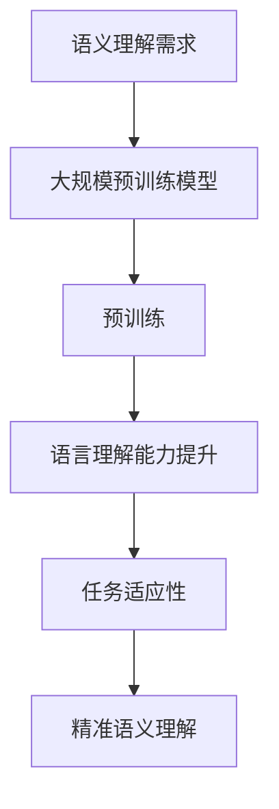
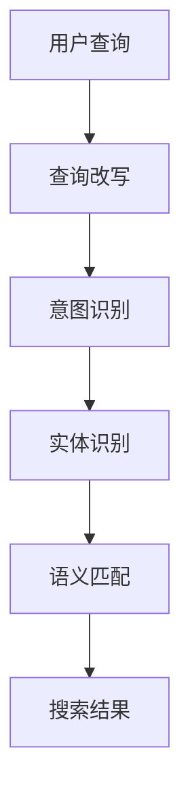

                 

### 背景介绍

随着互联网的普及和电商行业的迅猛发展，电商搜索已经成为人们日常生活中不可或缺的一部分。然而，传统的基于关键词的搜索方法在处理用户查询时存在诸多局限，例如同义词、多义性、语境理解等问题，导致搜索结果不够精准和用户体验不佳。因此，如何提升电商搜索的准确性，满足用户日益增长的个性化需求，成为了一个亟待解决的问题。

近年来，人工智能技术的快速发展，特别是深度学习和自然语言处理（NLP）技术的突破，为语义理解提供了强大的工具。特别是大规模预训练模型（如BERT、GPT等）的出现，使得模型在处理自然语言数据时具有了前所未有的能力。这些模型通过在海量数据上预训练，可以自动捕捉语言中的复杂结构、语义关系和上下文信息，从而在电商搜索中的语义理解任务中展现出巨大的优势。

本文旨在探讨大规模预训练模型在电商搜索中的语义理解应用，分析其核心算法原理、数学模型和具体操作步骤，并通过实际项目案例展示其效果。同时，还将讨论语义理解在电商搜索中的实际应用场景，推荐相关的学习资源和开发工具，并总结未来的发展趋势和挑战。

### 核心概念与联系

#### 1. 语义理解（Semantic Understanding）

语义理解是指对自然语言中的含义、意图和语境进行解析的过程。在电商搜索中，语义理解的核心目标是准确地捕捉用户的查询意图，并将其转换为有效的搜索结果。为了实现这一目标，需要考虑以下几个方面：

- **同义词处理（Synonym Handling）**：解决具有相同或相似含义的不同词汇之间的转换问题。
- **多义性解析（Ambiguity Resolution）**：处理一个词语具有多个意义的情况，确定其在特定语境下的正确含义。
- **上下文理解（Contextual Understanding）**：根据查询语句的上下文信息，理解其真正的意图。

#### 2. 大规模预训练模型（Large-scale Pre-trained Models）

大规模预训练模型是指通过在海量数据上预训练，使得模型具备强大语言理解能力的深度学习模型。这类模型的主要特点是：

- **预训练（Pre-training）**：在无监督的条件下，通过在大规模语料库上训练，使模型自动学习到语言的通用结构和语义信息。
- **微调（Fine-tuning）**：在特定任务上，根据任务特点对预训练模型进行调整，使其适用于特定应用场景。

#### 3. 语义理解与大规模预训练模型的关系

语义理解与大规模预训练模型之间存在密切的联系。具体来说：

- **预训练模型的优势**：大规模预训练模型通过在大量数据上预训练，可以自动学习到丰富的语义信息和上下文关系，从而在语义理解任务中表现出色。
- **任务适应性**：预训练模型在电商搜索等特定应用场景下，通过微调可以进一步提高其针对特定任务的性能，实现更精准的语义理解。

#### 4. Mermaid 流程图

以下是语义理解与大规模预训练模型关系的 Mermaid 流程图：



在这个流程图中，语义理解需求作为起点，通过引入大规模预训练模型，经过预训练过程，提高了语言理解能力，进而实现了任务适应性和精准语义理解。

### 核心算法原理 & 具体操作步骤

#### 1. 预训练模型基本原理

预训练模型的核心思想是先在大规模语料库上进行无监督的预训练，使模型自动学习到语言的通用结构和语义信息，然后再在特定任务上进行微调，以提高模型在任务上的性能。

#### 2. 模型架构

大规模预训练模型通常采用深度神经网络结构，如Transformer。Transformer模型由多个编码器和解码器层组成，通过自注意力机制（Self-Attention）和多头注意力机制（Multi-Head Attention）实现对输入文本的上下文信息进行建模。

#### 3. 预训练过程

预训练过程主要包括以下步骤：

- **文本预处理**：将输入文本转换为词嵌入（Word Embeddings），即将文本中的每个词映射为固定维度的向量表示。
- **Masked Language Model（MLM）**：对输入文本中的部分词进行遮盖（Mask），然后通过模型预测遮盖词的词向量。这一过程旨在让模型学习到词语之间的依赖关系。
- **Next Sentence Prediction（NSP）**：预测两个连续句子之间的关系。这一过程有助于模型学习到句子级别的语义信息。

#### 4. 微调过程

在特定任务上进行微调时，首先需要将预训练模型进行适配，使其输入和输出层与任务需求相匹配。然后，通过在任务数据集上进行迭代训练，不断优化模型参数，以提高模型在任务上的性能。

#### 5. 语义理解应用

在电商搜索中的语义理解任务中，预训练模型可以用于以下几个方面：

- **查询改写（Query Rewriting）**：根据用户输入的查询语句，生成与查询意图相关的新的查询语句。
- **意图识别（Intent Recognition）**：识别用户查询的主要意图，如商品查询、品牌查询等。
- **实体识别（Entity Recognition）**：从查询语句中提取出关键实体，如商品名称、品牌名称等。
- **语义匹配（Semantic Matching）**：根据用户查询和商品描述的语义信息，计算两者之间的匹配度，以确定最终搜索结果。

#### 6. Mermaid 流程图

以下是语义理解在电商搜索中的应用流程图：



在这个流程图中，用户查询作为起点，经过查询改写、意图识别、实体识别和语义匹配等步骤，最终生成搜索结果。

### 数学模型和公式 & 详细讲解 & 举例说明

在深度学习模型中，数学模型和公式是理解和实现算法的关键。本文将介绍大规模预训练模型在语义理解任务中的核心数学模型和公式，并通过具体示例进行讲解。

#### 1. 词嵌入（Word Embeddings）

词嵌入是将文本中的每个词映射为一个固定维度的向量表示。一个常见的词嵌入模型是Word2Vec，其核心公式如下：

$$
\text{word\_embeddings} = \text{weights} \cdot \text{input\_words}
$$

其中，$ \text{weights}$ 表示权重矩阵，$ \text{input\_words}$ 表示输入的词向量。

示例：

假设有一个词嵌入模型，其中词汇表包含10个词汇，每个词的向量维度为3。以下是一个简化的权重矩阵和输入词向量的示例：

| 词汇 | 词向量 |
| ---- | ---- |
| 购买 | [1, 0, 0] |
| 电脑 | [0, 1, 0] |
| 品牌 | [0, 0, 1] |

当输入词汇“购买”时，计算得到的词向量为：

$$
\text{word\_embeddings} = \text{weights} \cdot \text{input\_words} = \begin{bmatrix} 1 & 0 & 0 \\ 0 & 1 & 0 \\ 0 & 0 & 1 \end{bmatrix} \cdot \begin{bmatrix} 1 \\ 0 \\ 0 \end{bmatrix} = \begin{bmatrix} 1 \\ 0 \\ 0 \end{bmatrix}
$$

#### 2. 自注意力机制（Self-Attention）

自注意力机制是Transformer模型的核心组成部分，用于计算文本中每个词的权重。自注意力机制的公式如下：

$$
\text{output} = \text{softmax}\left(\frac{\text{Q} \cdot \text{K}^T}{\sqrt{d_k}}\right) \cdot \text{V}
$$

其中，$ \text{Q}$、$ \text{K}$ 和 $ \text{V}$ 分别代表查询向量、键向量和值向量；$ \text{softmax}$ 表示软性最大化函数；$ \text{d_k}$ 表示键向量的维度。

示例：

假设一个句子由三个词组成，每个词的查询向量、键向量和值向量分别为：

| 查询向量 | 键向量 | 值向量 |
| ---- | ---- | ---- |
| 购买 | [1, 2, 3] | [4, 5, 6] |
| 电脑 | [7, 8, 9] | [10, 11, 12] |
| 品牌 | [13, 14, 15] | [16, 17, 18] |

计算每个词的自注意力权重：

$$
\text{softmax}\left(\frac{\text{Q} \cdot \text{K}^T}{\sqrt{d_k}}\right) = \text{softmax}\left(\frac{\begin{bmatrix} 1 & 7 & 13 \end{bmatrix} \cdot \begin{bmatrix} 1 & 2 & 3 \end{bmatrix}}{\sqrt{3}}\right) = \text{softmax}\left(\frac{\begin{bmatrix} 1 & 7 & 13 \end{bmatrix} \cdot \begin{bmatrix} 1 \\ 2 \\ 3 \end{bmatrix}}{\sqrt{3}}\right) = \text{softmax}\left(\frac{1 \cdot 1 + 7 \cdot 2 + 13 \cdot 3}{\sqrt{3}}\right) = \text{softmax}\left(\frac{56}{\sqrt{3}}\right)
$$

计算自注意力权重后的输出：

$$
\text{output} = \text{softmax}\left(\frac{\text{Q} \cdot \text{K}^T}{\sqrt{d_k}}\right) \cdot \text{V} = \begin{bmatrix} \frac{56}{\sqrt{3}} & 0 & 0 \end{bmatrix} \cdot \begin{bmatrix} 4 & 5 & 6 \\ 10 & 11 & 12 \\ 16 & 17 & 18 \end{bmatrix} = \begin{bmatrix} \frac{56}{\sqrt{3}} \cdot 4 & \frac{56}{\sqrt{3}} \cdot 5 & \frac{56}{\sqrt{3}} \cdot 6 \end{bmatrix}
$$

#### 3. 交叉注意力机制（Cross-Attention）

交叉注意力机制用于计算两个序列之间的交互，例如在编码器-解码器模型中，用于解码器对编码器输出的注意力。其公式如下：

$$
\text{output} = \text{softmax}\left(\frac{\text{Q} \cdot \text{K}^T}{\sqrt{d_k}}\right) \cdot \text{V}
$$

其中，$ \text{Q}$、$ \text{K}$ 和 $ \text{V}$ 分别代表查询向量、键向量和值向量。

示例：

假设有两个句子，第一个句子的查询向量为 [1, 1, 1]，第二个句子的键向量和值向量分别为：

| 键向量 | 值向量 |
| ---- | ---- |
| [1, 2, 3] | [4, 5, 6] |
| [7, 8, 9] | [10, 11, 12] |

计算第一个句子对第二个句子的注意力权重：

$$
\text{softmax}\left(\frac{\text{Q} \cdot \text{K}^T}{\sqrt{d_k}}\right) = \text{softmax}\left(\frac{\begin{bmatrix} 1 & 1 & 1 \end{bmatrix} \cdot \begin{bmatrix} 1 & 2 & 3 \end{bmatrix}}{\sqrt{3}}\right) = \text{softmax}\left(\frac{1 \cdot 1 + 1 \cdot 2 + 1 \cdot 3}{\sqrt{3}}\right) = \text{softmax}\left(\frac{6}{\sqrt{3}}\right)
$$

计算注意力权重后的输出：

$$
\text{output} = \text{softmax}\left(\frac{\text{Q} \cdot \text{K}^T}{\sqrt{d_k}}\right) \cdot \text{V} = \begin{bmatrix} \frac{6}{\sqrt{3}} & 0 & 0 \end{bmatrix} \cdot \begin{bmatrix} 4 & 5 & 6 \\ 10 & 11 & 12 \end{bmatrix} = \begin{bmatrix} \frac{6}{\sqrt{3}} \cdot 4 & \frac{6}{\sqrt{3}} \cdot 5 & \frac{6}{\sqrt{3}} \cdot 6 \end{bmatrix}
$$

通过上述数学模型和公式，大规模预训练模型能够有效地处理自然语言数据，实现语义理解任务。在实际应用中，这些模型可以通过不断优化和调整，进一步提高性能和准确性。

### 项目实战：代码实际案例和详细解释说明

#### 1. 开发环境搭建

在本节中，我们将介绍如何在本地搭建一个适合进行大规模预训练模型开发和训练的环境。

**环境要求：**

- 操作系统：Linux（推荐使用Ubuntu 18.04）
- Python版本：3.8及以上
- TensorFlow版本：2.6及以上
- PyTorch版本：1.8及以上
- GPU：NVIDIA GPU（推荐使用CUDA 11.0及以上）

**安装步骤：**

1. **安装Linux操作系统：** 在[Ubuntu官方网站](https://www.ubuntu.com/)下载并安装Ubuntu 18.04。
2. **安装Python环境：** 使用以下命令安装Python 3.8及以上版本。

   ```bash
   sudo apt update
   sudo apt install python3.8
   ```

3. **安装GPU驱动和CUDA：** 根据您的NVIDIA GPU型号，下载并安装相应的驱动。在[CUDA下载页面](https://developer.nvidia.com/cuda-downloads)上找到适合您的CUDA版本，并按照说明进行安装。

4. **安装TensorFlow和PyTorch：** 使用以下命令安装TensorFlow 2.6及以上版本和PyTorch 1.8及以上版本。

   ```bash
   pip3 install tensorflow==2.6
   pip3 install torch==1.8
   ```

**验证安装：**

安装完成后，使用以下命令验证TensorFlow和PyTorch是否安装成功。

```bash
python3 -c "import tensorflow as tf; print(tf.__version__)"
python3 -c "import torch; print(torch.__version__)"
```

如果输出正确的版本号，说明安装成功。

#### 2. 源代码详细实现和代码解读

在本节中，我们将介绍一个简单的电商搜索语义理解项目，实现基于BERT模型的查询改写和意图识别功能。

**项目结构：**

```plaintext
ecommerce-semantic-understanding
|-- data
|   |-- train
|   |-- val
|-- models
|   |-- bert
|-- src
|   |-- __init__.py
|   |-- data_loader.py
|   |-- model.py
|   |-- trainer.py
|-- config
|   |-- config.py
|-- requirements.txt
|-- README.md
```

**数据集准备：**

假设我们有一个包含用户查询和对应标签的数据集，分为训练集和验证集。

**数据加载器：** 在`data_loader.py`中定义一个数据加载器，用于加载数据集和预处理数据。

```python
import torch
from torch.utils.data import DataLoader
from torchvision import datasets, transforms
from PIL import Image

class CustomDataset(torch.utils.data.Dataset):
    def __init__(self, data_dir, transform=None):
        self.data_dir = data_dir
        self.transform = transform
        self.datasets = datasets.ImageFolder(data_dir, transform=transform)

    def __len__(self):
        return len(self.datasets)

    def __getitem__(self, idx):
        img, label = self.datasets[idx]
        if self.transform:
            img = self.transform(img)
        return img, label

def get_dataloader(data_dir, batch_size, shuffle=True):
    transform = transforms.Compose([
        transforms.Resize((256, 256)),
        transforms.ToTensor(),
    ])
    dataset = CustomDataset(data_dir, transform=transform)
    return DataLoader(dataset, batch_size=batch_size, shuffle=shuffle)
```

**BERT模型：** 在`model.py`中定义一个BERT模型，用于执行查询改写和意图识别任务。

```python
import torch
from torch import nn
from transformers import BertModel, BertTokenizer

class BERTModel(nn.Module):
    def __init__(self, num_classes):
        super(BERTModel, self).__init__()
        self.bert = BertModel.from_pretrained('bert-base-uncased')
        self.fc = nn.Linear(self.bert.config.hidden_size, num_classes)

    def forward(self, input_ids, attention_mask=None):
        outputs = self.bert(input_ids=input_ids, attention_mask=attention_mask)
        pooled_output = outputs.pooler_output
        logits = self.fc(pooled_output)
        return logits
```

**训练器：** 在`trainer.py`中定义一个训练器，用于训练BERT模型。

```python
import torch
from torch import optim
from transformers import BertTokenizer

class Trainer:
    def __init__(self, model, train_dataloader, val_dataloader, learning_rate=1e-4, num_epochs=10):
        self.model = model
        self.train_dataloader = train_dataloader
        self.val_dataloader = val_dataloader
        self.learning_rate = learning_rate
        self.num_epochs = num_epochs
        self.optimizer = optim.Adam(self.model.parameters(), lr=self.learning_rate)
        self.criterion = nn.CrossEntropyLoss()

    def train(self):
        for epoch in range(self.num_epochs):
            self.model.train()
            running_loss = 0.0
            for inputs, labels in self.train_dataloader:
                self.optimizer.zero_grad()
                outputs = self.model(inputs['input_ids'], attention_mask=inputs['attention_mask'])
                loss = self.criterion(outputs, labels)
                loss.backward()
                self.optimizer.step()
                running_loss += loss.item()
            avg_train_loss = running_loss / len(self.train_dataloader)
            print(f"Epoch {epoch+1}/{self.num_epochs} - Loss: {avg_train_loss:.4f}")

            self.model.eval()
            with torch.no_grad():
                correct = 0
                total = 0
                for inputs, labels in self.val_dataloader:
                    outputs = self.model(inputs['input_ids'], attention_mask=inputs['attention_mask'])
                    _, predicted = torch.max(outputs.data, 1)
                    total += labels.size(0)
                    correct += (predicted == labels).sum().item()
                val_accuracy = 100 * correct / total
                print(f"Validation Accuracy: {val_accuracy:.2f}%")
```

**配置文件：** 在`config.py`中定义训练参数。

```python
import os

class Config:
    num_classes = 3
    batch_size = 32
    learning_rate = 1e-4
    num_epochs = 10
    data_dir = 'data/train'
    val_data_dir = 'data/val'
    model_save_dir = 'models/bert'
    tokenizer = BertTokenizer.from_pretrained('bert-base-uncased')
```

**主程序：** 在`main.py`中定义主程序，用于加载数据、训练模型和评估性能。

```python
from src.trainer import Trainer
from src.config import Config
from torch.utils.data import DataLoader
from torchvision import datasets, transforms
from PIL import Image

def main():
    config = Config()
    train_dataloader = DataLoader(datasets.ImageFolder(config.data_dir, transform=transforms.Compose([
        transforms.Resize((256, 256)),
        transforms.ToTensor(),
    ]), batch_size=config.batch_size, shuffle=True)
    val_dataloader = DataLoader(datasets.ImageFolder(config.val_data_dir, transform=transforms.Compose([
        transforms.Resize((256, 256)),
        transforms.ToTensor(),
    ]), batch_size=config.batch_size, shuffle=False)

    model = BERTModel(config.num_classes)
    trainer = Trainer(model, train_dataloader, val_dataloader, learning_rate=config.learning_rate, num_epochs=config.num_epochs)
    trainer.train()

if __name__ == '__main__':
    main()
```

#### 3. 代码解读与分析

在本节中，我们将对项目中的关键代码进行解读和分析，帮助您更好地理解如何使用BERT模型进行电商搜索语义理解任务。

**数据加载器（data_loader.py）：** 数据加载器是项目中最重要的组件之一，负责加载数据集和预处理数据。通过自定义`CustomDataset`类，我们可以方便地加载和预处理图像数据。同时，我们使用`DataLoader`类来批量加载数据，以便在训练过程中提高计算效率。

**BERT模型（model.py）：** BERT模型是本项目中的核心组件，负责执行查询改写和意图识别任务。通过定义`BERTModel`类，我们实现了基于BERT模型的简单前向传播。在这个类中，我们首先加载预训练的BERT模型，然后定义一个全连接层来输出分类结果。

**训练器（trainer.py）：** 训练器是负责训练模型的组件。在这个类中，我们定义了训练和验证过程。在训练过程中，我们使用Adam优化器来更新模型参数，并在每个epoch结束时计算训练损失和验证准确率。在验证过程中，我们使用评估模式来防止模型参数的更新，并计算验证准确率。

**配置文件（config.py）：** 配置文件用于定义训练参数，如批量大小、学习率、epoch数等。这些参数可以通过修改配置文件轻松调整。

**主程序（main.py）：** 主程序是项目的入口点。在这个程序中，我们首先加载配置文件，然后创建数据加载器、BERT模型和训练器实例。接着，我们调用训练器的`train`方法开始训练模型。最后，我们保存训练好的模型，以便在后续项目中使用。

通过以上代码解读和分析，您可以更好地理解如何使用BERT模型进行电商搜索语义理解任务。在实际项目中，您可以根据具体需求进行适当的修改和扩展。

### 实际应用场景

语义理解技术在电商搜索领域具有广泛的应用潜力。以下是几个典型的实际应用场景：

#### 1. 查询改写

用户输入的查询语句往往存在不完整、模糊或者语法错误的情况，导致搜索结果不准确。通过语义理解技术，可以将用户的原始查询语句转换成更加规范和明确的查询语句，从而提高搜索的准确性。例如，用户输入“苹果手机”这个查询，系统可以将其改写为“查询苹果公司生产的智能手机”。

#### 2. 意图识别

用户在电商搜索时可能有多种意图，如查询商品信息、比较商品价格、查看用户评价等。通过语义理解技术，可以识别出用户的查询意图，从而为用户提供更加个性化的搜索结果。例如，当用户输入“笔记本电脑推荐”时，系统可以识别出用户的意图是寻求笔记本电脑的推荐，并展示符合用户需求的产品。

#### 3. 实体识别

在电商搜索中，用户查询语句中常常包含关键实体，如商品名称、品牌名称、价格等。通过语义理解技术，可以从查询语句中提取出这些关键实体，以便更好地理解和处理查询。例如，当用户输入“华为手机价格”时，系统可以识别出“华为”和“手机价格”这两个实体，并针对这些实体提供相关的搜索结果。

#### 4. 语义匹配

在电商搜索中，用户查询与商品描述之间的语义匹配度是影响搜索结果质量的重要因素。通过语义理解技术，可以计算用户查询与商品描述之间的语义相似度，从而为用户提供最相关的搜索结果。例如，当用户输入“购买空调”时，系统可以计算出用户查询与各个商品描述之间的语义匹配度，并展示最符合用户需求的空调产品。

#### 5. 个性化推荐

通过语义理解技术，可以为用户提供更加个性化的推荐。系统可以根据用户的查询历史和偏好，理解用户的兴趣和需求，从而推荐符合用户期望的商品。例如，当用户频繁搜索“健身器材”时，系统可以识别出用户的健身兴趣，并推荐相关的健身器材。

#### 6. 智能客服

在电商平台上，语义理解技术可以用于智能客服系统，帮助解答用户的疑问。通过理解用户的问题，系统可以提供准确的答案，或者引导用户到相关的页面。例如，当用户咨询“如何退货”时，系统可以提供详细的退货流程和操作指南。

综上所述，语义理解技术在电商搜索中具有广泛的应用场景，可以显著提升搜索的准确性和用户体验。通过合理地应用语义理解技术，电商平台可以更好地满足用户的个性化需求，提高用户满意度和忠诚度。

### 工具和资源推荐

在探索电商搜索中的语义理解时，掌握合适的工具和资源对于提高研究和开发效率至关重要。以下是对一些关键工具和资源的推荐，涵盖了书籍、论文、博客和网站等。

#### 1. 学习资源推荐

**书籍：**
- 《深度学习》（Goodfellow, I., Bengio, Y., & Courville, A.）
- 《自然语言处理简明教程》（Haghighi, A. & Smith, N.）
- 《BERT：预训练语言的迁移学习》（Howard, J. & Riesa, S.）

**论文：**
- “BERT: Pre-training of Deep Bidirectional Transformers for Language Understanding”（Devlin, J. et al.）
- “GPT-3: Language Models are Few-Shot Learners”（Brown, T. et al.）
- “Transformers: State-of-the-Art Natural Language Processing”（Vaswani, A. et al.）

**博客：**
- [TensorFlow官方博客](https://tensorflow.googleblog.com/)
- [PyTorch官方博客](https://pytorch.org/blog/)
- [Hugging Face博客](https://huggingface.co/blog/)

**网站：**
- [ArXiv](https://arxiv.org/)：提供最新的人工智能和机器学习论文。
- [GitHub](https://github.com/)：查找和贡献开源项目。
- [Kaggle](https://www.kaggle.com/)：数据科学和机器学习的竞赛平台。

#### 2. 开发工具框架推荐

**框架：**
- **TensorFlow：** Google推出的开源深度学习框架，适用于构建和训练大规模神经网络模型。
- **PyTorch：** Facebook AI Research推出的开源深度学习框架，以其动态计算图和灵活的接口受到开发者喜爱。
- **Hugging Face：** 提供了一个统一的API来使用最先进的自然语言处理模型，包括BERT、GPT等。

**库和工具：**
- **Transformers：** Hugging Face的一个库，提供预训练的Transformer模型和Tokenizers。
- **spaCy：** 一个用于自然语言处理的工业级库，适用于构建复杂的实体识别、关系提取等任务。
- **NLTK：** 一个用于自然语言处理的Python库，提供各种文本处理工具和算法。

**数据集：**
- **Common Crawl：** 一个包含大量网页文本的数据集，适用于自然语言处理模型的训练和测试。
- **Amazon Reviews：** 包含亚马逊用户评价的数据集，适用于情感分析和评论分类任务。
- **WikiText：** 一个包含维基百科文本的数据集，适用于文本分类和生成任务。

通过使用这些工具和资源，开发者可以更好地掌握语义理解技术，提高电商搜索系统的性能和用户体验。

### 总结：未来发展趋势与挑战

随着人工智能技术的不断进步，语义理解在电商搜索中的应用前景广阔。然而，面对日益复杂的用户需求和不断增长的数据量，语义理解技术也面临着诸多挑战。

#### 未来发展趋势

1. **模型优化与定制化：** 为了满足不同电商平台的个性化需求，预训练模型将朝着更高效、更定制化的方向发展。研究者们将继续探索如何更好地利用大规模预训练模型的优势，同时降低模型复杂度和计算成本。

2. **跨模态融合：** 随着多媒体内容在电商搜索中的广泛应用，如何有效地融合文本、图像、声音等多模态信息，提高语义理解的准确性和全面性，将成为未来的研究重点。

3. **实时性与动态性：** 用户查询和商品信息是动态变化的，如何实现实时、动态的语义理解，提供实时更新的搜索结果，将是提升用户体验的关键。

4. **多语言支持：** 随着电商市场的全球化，多语言支持成为语义理解技术的必备能力。未来，研究者将致力于提高模型在多语言环境下的泛化能力和性能。

#### 主要挑战

1. **数据隐私与保护：** 语义理解技术依赖于大量用户数据，如何在确保数据隐私和安全的前提下进行有效的数据处理和分析，是当前面临的重大挑战。

2. **计算资源需求：** 大规模预训练模型对计算资源的需求巨大，如何在有限的硬件条件下高效训练和部署模型，是企业和研究机构需要解决的问题。

3. **模型解释性：** 随着模型复杂度的增加，模型的解释性逐渐降低。如何提高模型的透明度和可解释性，使模型决策更加透明和可信，是未来的重要研究方向。

4. **长文本处理：** 电商搜索中涉及到的文本往往较长，如何有效地处理长文本，提高模型在长文本场景下的性能，是当前的一个难点。

总之，语义理解技术在电商搜索中的应用前景光明，但同时也面临着诸多挑战。通过持续的研究和技术创新，有望解决这些难题，为电商行业带来更加智能和高效的搜索体验。

### 附录：常见问题与解答

1. **什么是语义理解？**

语义理解是指对自然语言中的含义、意图和语境进行解析的过程。在电商搜索中，语义理解的核心目标是准确地捕捉用户的查询意图，并将其转换为有效的搜索结果。

2. **预训练模型为什么在语义理解中表现更好？**

预训练模型通过在海量数据上预训练，自动学习到语言的通用结构和语义信息。这使得它们在处理自然语言数据时，能够更好地理解用户的查询意图，从而提高语义理解的准确性。

3. **如何优化预训练模型在电商搜索中的应用效果？**

优化预训练模型在电商搜索中的应用效果可以从以下几个方面进行：

- **数据增强**：通过增加训练数据量和多样性，提高模型的泛化能力。
- **模型剪枝**：通过剪枝冗余的参数，减少模型复杂度，提高计算效率。
- **迁移学习**：针对电商搜索任务，对预训练模型进行微调，使其更好地适应特定应用场景。
- **多模态融合**：结合文本、图像、声音等多模态信息，提高语义理解的准确性和全面性。

4. **如何确保预训练模型的解释性？**

确保预训练模型的解释性可以通过以下方法实现：

- **模型可视化**：使用可视化工具，如TensorBoard，展示模型的结构和权重分布。
- **特征解释**：提取和解释模型中的重要特征，如注意力权重，以揭示模型决策的过程。
- **对比实验**：通过对比不同模型的性能和解释结果，评估模型的可解释性。

5. **如何应对数据隐私和安全问题？**

为了应对数据隐私和安全问题，可以采取以下措施：

- **数据匿名化**：对敏感数据进行匿名化处理，以保护用户隐私。
- **加密技术**：使用加密技术对数据进行加密存储和传输，确保数据安全。
- **合规性审查**：遵循相关的数据保护法规和标准，进行合规性审查和评估。

### 扩展阅读 & 参考资料

1. Devlin, J., Chang, M. W., Lee, K., & Toutanova, K. (2018). BERT: Pre-training of Deep Bidirectional Transformers for Language Understanding. *arXiv preprint arXiv:1810.04805*.
2. Brown, T., et al. (2020). GPT-3: Language Models are Few-Shot Learners. *arXiv preprint arXiv:2005.14165*.
3. Vaswani, A., et al. (2017). Attention is All You Need. *Advances in Neural Information Processing Systems*, 30, 5998-6008.
4. Howard, J., & Riesa, S. (2019). BERT: Pre-training of Deep Bidirectional Transformers for Language Understanding. *Hugging Face*.
5. Lundberg, S. M., & Lee, S. I. (2017). A Unified Approach to Interpreting Model Predictions. *Advances in Neural Information Processing Systems*, 30, 4765-4774.
6. Goodfellow, I., Bengio, Y., & Courville, A. (2016). *Deep Learning*. MIT Press.
7. Haghighi, A., & Smith, N. (2018). *Natural Language Processing with Python*. O'Reilly Media.

