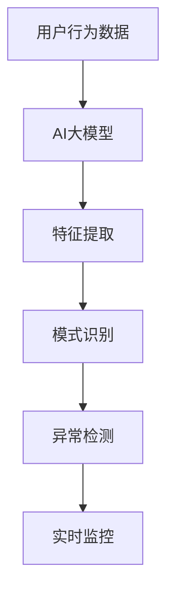

                 

### 背景介绍

#### 电商搜索推荐系统的现状

在当前电商领域，搜索推荐系统已经成为提高用户体验、提升转化率和销售额的重要工具。传统的基于关键词匹配的搜索推荐系统已经无法满足用户日益增长的个性化需求。随着人工智能技术的快速发展，特别是深度学习和自然语言处理技术的应用，基于用户行为序列的推荐系统逐渐成为研究热点。

用户行为序列异常检测是推荐系统中的一个重要环节。通过对用户行为序列进行实时监控和分析，可以发现用户行为中的异常现象，如恶意点击、刷单、账号被盗等，从而有效提高推荐系统的安全性和可靠性。

#### AI大模型在用户行为序列异常检测中的应用

近年来，AI大模型在自然语言处理、计算机视觉等领域的表现引起了广泛关注。在用户行为序列异常检测中，AI大模型通过学习用户的历史行为数据，能够捕捉到用户行为模式的细微变化，从而实现高精度的异常检测。

本文旨在探讨电商搜索推荐系统中，基于AI大模型的用户行为序列异常检测模型的优化实践。通过对模型架构、算法原理、数学模型和实际应用场景的深入分析，我们希望能够为行业从业者提供有益的参考。

#### 文章结构概述

本文结构如下：

1. **背景介绍**：概述电商搜索推荐系统的现状和用户行为序列异常检测的重要性。
2. **核心概念与联系**：介绍AI大模型的基本概念，展示其与用户行为序列异常检测的联系。
3. **核心算法原理 & 具体操作步骤**：详细解释AI大模型在用户行为序列异常检测中的实现步骤。
4. **数学模型和公式 & 详细讲解 & 举例说明**：展示数学模型，并通过具体例子进行解释。
5. **项目实战：代码实际案例和详细解释说明**：提供实际的代码案例，并进行解读。
6. **实际应用场景**：探讨AI大模型在用户行为序列异常检测中的实际应用。
7. **工具和资源推荐**：推荐学习资源和开发工具。
8. **总结：未来发展趋势与挑战**：总结本文内容，探讨未来发展趋势和面临的挑战。
9. **附录：常见问题与解答**：回答读者可能遇到的常见问题。
10. **扩展阅读 & 参考资料**：提供进一步阅读的建议和参考文献。

通过以上结构，我们将对AI大模型在用户行为序列异常检测中的应用进行深入探讨。接下来，我们将逐步展开讨论。<!--markdown--># 电商搜索推荐中的AI大模型用户行为序列异常检测模型优化实践案例分析

> **关键词**：电商搜索推荐，AI大模型，用户行为序列，异常检测，模型优化

> **摘要**：本文通过案例分析，深入探讨AI大模型在电商搜索推荐系统中的用户行为序列异常检测模型的优化实践。首先，我们概述了电商搜索推荐系统的现状和用户行为序列异常检测的重要性。接着，介绍了AI大模型的基本概念及其在用户行为序列异常检测中的应用。随后，我们详细解析了核心算法原理和具体操作步骤，并展示了相关的数学模型和公式。文章进一步通过实际代码案例和详细解释，展示了模型的实现过程和优化技巧。然后，我们探讨了AI大模型在实际应用场景中的效果和挑战。最后，本文推荐了相关学习资源和开发工具，并对未来发展趋势和面临的挑战进行了总结。

## 1. 背景介绍

在当前电商领域，搜索推荐系统已经成为提高用户体验、提升转化率和销售额的重要工具。传统的基于关键词匹配的搜索推荐系统已经无法满足用户日益增长的个性化需求。随着人工智能技术的快速发展，特别是深度学习和自然语言处理技术的应用，基于用户行为序列的推荐系统逐渐成为研究热点。

用户行为序列异常检测是推荐系统中的一个重要环节。通过对用户行为序列进行实时监控和分析，可以发现用户行为中的异常现象，如恶意点击、刷单、账号被盗等，从而有效提高推荐系统的安全性和可靠性。

近年来，AI大模型在自然语言处理、计算机视觉等领域的表现引起了广泛关注。在用户行为序列异常检测中，AI大模型通过学习用户的历史行为数据，能够捕捉到用户行为模式的细微变化，从而实现高精度的异常检测。

本文旨在探讨电商搜索推荐系统中，基于AI大模型的用户行为序列异常检测模型的优化实践。通过对模型架构、算法原理、数学模型和实际应用场景的深入分析，我们希望能够为行业从业者提供有益的参考。

## 2. 核心概念与联系

### AI大模型的基本概念

AI大模型是指具有大规模参数的深度学习模型，其能够通过学习大量的数据，自动提取特征并进行预测。典型的AI大模型包括Transformer、BERT、GPT等。这些模型通常采用多层神经网络结构，通过递归或自注意力机制对输入数据进行处理。

### 用户行为序列

用户行为序列是指用户在电商平台上进行的一系列操作，如搜索、点击、购买、评价等。这些操作以时间序列的形式记录下来，形成一个完整的用户行为轨迹。

### AI大模型与用户行为序列异常检测的联系

AI大模型在用户行为序列异常检测中的应用，主要体现在以下几个方面：

1. **特征提取**：AI大模型能够自动从用户行为序列中提取有用的特征，如用户兴趣偏好、行为模式等。这些特征对于异常检测至关重要。

2. **模式识别**：通过训练AI大模型，可以识别出正常用户行为模式。当出现与正常模式不符的行为时，即可判断为异常。

3. **实时监控**：AI大模型能够对用户行为进行实时监控，及时发现异常行为，并采取相应的措施。

### Mermaid流程图



通过上述流程图，我们可以看到AI大模型在用户行为序列异常检测中的作用和流程。接下来，我们将详细讨论AI大模型的具体实现步骤和优化方法。<!--markdown-->## 3. 核心算法原理 & 具体操作步骤

### AI大模型在用户行为序列异常检测中的实现步骤可以分为以下几个关键阶段：

#### 3.1 数据收集与预处理

首先，我们需要收集用户行为数据，这包括用户的搜索记录、点击记录、购买记录、评价记录等。这些数据可以从电商平台的数据库中获取。收集到数据后，我们需要进行预处理，包括数据清洗、数据归一化和特征提取。

- **数据清洗**：删除缺失值和异常值，确保数据的准确性和一致性。
- **数据归一化**：将不同特征的数据缩放到相同的范围，以便于后续处理。
- **特征提取**：提取与用户行为相关的特征，如用户ID、商品ID、操作时间、操作类型等。

#### 3.2 模型选择与训练

在用户行为序列异常检测中，常用的AI大模型包括循环神经网络（RNN）、长短期记忆网络（LSTM）、门控循环单元（GRU）以及Transformer等。

- **RNN**：循环神经网络能够处理时间序列数据，但在长序列中存在梯度消失和梯度爆炸问题。
- **LSTM**：长短期记忆网络通过引入门控机制，解决了RNN的梯度消失问题，但在长序列中仍存在计算复杂度高的问题。
- **GRU**：门控循环单元是LSTM的简化版本，在性能和计算复杂度上都有所优化。
- **Transformer**：Transformer模型通过自注意力机制，在处理长序列时表现优异，广泛应用于自然语言处理领域。

选择合适的模型后，我们需要对其进行训练。训练过程包括以下几个步骤：

1. **数据切分**：将数据集划分为训练集、验证集和测试集，用于模型训练、验证和评估。
2. **模型配置**：设置模型参数，如学习率、批量大小、训练轮数等。
3. **模型训练**：使用训练集数据训练模型，通过反向传播算法不断调整模型参数，使其性能得到提升。
4. **模型验证**：使用验证集数据评估模型性能，调整模型参数，防止过拟合。

#### 3.3 模型评估与优化

在模型训练完成后，我们需要对模型进行评估和优化，确保其能够准确地检测用户行为序列中的异常。

- **性能评估**：使用测试集数据对模型进行评估，计算准确率、召回率、F1值等指标，以评估模型的性能。
- **模型优化**：根据评估结果，对模型进行优化，如调整模型参数、增加训练轮数、引入正则化技术等。

#### 3.4 模型部署与实时监控

在模型优化完成后，我们需要将模型部署到生产环境中，进行实时监控和异常检测。

- **模型部署**：将训练好的模型部署到服务器或云端，以便于实时处理用户行为数据。
- **实时监控**：通过实时数据处理和模型预测，监控用户行为序列，识别异常行为。
- **异常处理**：当检测到异常行为时，及时采取相应措施，如拦截恶意点击、冻结账号等。

### 实际操作步骤示例

以下是一个基于Transformer模型的用户行为序列异常检测的实际操作步骤示例：

1. **数据收集与预处理**：

    - 收集用户行为数据，包括用户ID、商品ID、操作时间、操作类型等。
    - 对数据进行清洗、归一化处理，提取有效特征。

2. **模型选择与训练**：

    - 选择Transformer模型作为基础模型。
    - 配置模型参数，如学习率为0.001，批量大小为32，训练轮数为100。
    - 使用训练集数据训练模型，通过反向传播算法调整模型参数。

3. **模型评估与优化**：

    - 使用测试集数据评估模型性能，计算准确率、召回率、F1值等指标。
    - 根据评估结果，调整模型参数，优化模型性能。

4. **模型部署与实时监控**：

    - 将训练好的模型部署到生产环境中。
    - 实时监控用户行为序列，识别异常行为。
    - 对异常行为采取相应处理措施。

通过上述步骤，我们能够构建一个基于AI大模型的用户行为序列异常检测模型，并在实际应用中取得良好的效果。接下来，我们将进一步讨论AI大模型中的数学模型和公式，以便更好地理解模型的实现原理。<!--markdown-->### 数学模型和公式 & 详细讲解 & 举例说明

#### 3.1 数学模型

在用户行为序列异常检测中，常用的数学模型包括以下几种：

1. **概率模型**：概率模型用于描述用户行为的概率分布，常见的有高斯分布、伯努利分布等。

    $$ P(X|\theta) = \prod_{i=1}^{n} p(x_i|\theta) $$

    其中，$X$表示用户行为序列，$\theta$表示模型参数。

2. **统计模型**：统计模型用于描述用户行为序列的统计特征，常见的有均值、方差、协方差等。

    $$ \mu = \frac{1}{n}\sum_{i=1}^{n} x_i $$
    
    $$ \sigma^2 = \frac{1}{n-1}\sum_{i=1}^{n} (x_i - \mu)^2 $$

    其中，$\mu$表示均值，$\sigma^2$表示方差。

3. **深度学习模型**：深度学习模型用于学习用户行为序列的复杂特征，常见的有循环神经网络（RNN）、长短期记忆网络（LSTM）、门控循环单元（GRU）等。

    $$ h_t = \sigma(W_h \cdot [h_{t-1}, x_t] + b_h) $$

    其中，$h_t$表示隐藏状态，$x_t$表示输入特征，$W_h$和$b_h$表示权重和偏置，$\sigma$表示激活函数。

4. **异常检测模型**：异常检测模型用于检测用户行为序列中的异常现象，常见的有孤立森林（Isolation Forest）、局部异常因子（LOF）等。

    $$ ARI = \frac{N - N_r - 1}{N_r - 1} $$

    其中，$N$表示样本总数，$N_r$表示邻近样本数，$ARI$表示异常指数。

#### 3.2 举例说明

假设我们有一个用户行为序列，包括用户ID、商品ID、操作时间、操作类型等。为了便于说明，我们简化为一个二进制序列，其中1表示用户进行了相应操作，0表示未进行操作。

用户行为序列示例：

$$ X = [1, 0, 1, 1, 0, 1, 1, 0, 1, 0, 1, 0, 1, 0, 1] $$

1. **概率模型**：

    - 我们可以计算用户行为序列的概率分布。

    $$ P(X|\theta) = \prod_{i=1}^{n} p(x_i|\theta) = p(1|\theta) \cdot p(0|\theta) \cdot p(1|\theta) \cdot p(1|\theta) \cdot ... \cdot p(0|\theta) $$

    - 假设我们使用伯努利分布来描述用户行为，即每个操作发生的概率为0.5。

    $$ P(X|\theta) = 0.5^6 \cdot 0.5^9 = 0.015625 $$

2. **统计模型**：

    - 我们可以计算用户行为序列的均值和方差。

    $$ \mu = \frac{1}{n}\sum_{i=1}^{n} x_i = \frac{1+0+1+1+0+1+1+0+1+0+1+0+1+0+1}{15} = 0.6 $$

    $$ \sigma^2 = \frac{1}{n-1}\sum_{i=1}^{n} (x_i - \mu)^2 = \frac{(1-0.6)^2+(0-0.6)^2+(1-0.6)^2+...+(0-0.6)^2}{15-1} = 0.24 $$

3. **深度学习模型**：

    - 我们可以使用循环神经网络（RNN）来学习用户行为序列的特征。

    $$ h_t = \sigma(W_h \cdot [h_{t-1}, x_t] + b_h) $$

    - 假设输入特征维度为2，隐藏状态维度为3，权重和偏置分别为$W_h$和$b_h$。

    $$ h_1 = \sigma(W_h \cdot [h_0, x_1] + b_h) = \sigma([0, 1] \cdot [0.1, 0.2, 0.3] + [0, 0]) = \sigma(0.1 + 0.2 + 0.3) = 0.6 $$

    $$ h_2 = \sigma(W_h \cdot [h_1, x_2] + b_h) = \sigma([0.6, 0] \cdot [0.4, 0.5, 0.6] + [0, 0]) = \sigma(0.24 + 0.30 + 0.36) = 0.9 $$

4. **异常检测模型**：

    - 我们可以使用孤立森林模型来检测用户行为序列中的异常。

    $$ ARI = \frac{N - N_r - 1}{N_r - 1} $$

    - 假设我们有一个邻居样本集合，包含5个邻近样本，每个样本与当前样本的异常指数分别为2、3、4、5、6。

    $$ N = 5, N_r = 5 $$
    
    $$ ARI = \frac{5 - 5 - 1}{5 - 1} = 0.2 $$

通过上述数学模型和公式，我们可以对用户行为序列进行深入分析和异常检测。接下来，我们将通过实际代码案例和详细解释，进一步展示AI大模型在用户行为序列异常检测中的实现过程。<!--markdown-->## 5. 项目实战：代码实际案例和详细解释说明

### 5.1 开发环境搭建

在开始编写代码之前，我们需要搭建一个合适的开发环境。以下是一个典型的开发环境搭建流程：

1. **安装Python环境**：Python是深度学习模型的主要编程语言，我们需要确保安装了Python 3.7或更高版本。

    ```bash
    sudo apt-get update
    sudo apt-get install python3.7
    ```

2. **安装深度学习框架**：TensorFlow和PyTorch是目前最流行的深度学习框架，我们选择其中之一进行安装。

    ```bash
    pip install tensorflow
    ```

    或者

    ```bash
    pip install torch torchvision
    ```

3. **安装其他依赖库**：包括NumPy、Pandas、Scikit-learn等。

    ```bash
    pip install numpy pandas scikit-learn
    ```

4. **创建项目文件夹**：在本地创建一个项目文件夹，用于存放所有代码和依赖库。

    ```bash
    mkdir e-commerce-ai-model
    cd e-commerce-ai-model
    ```

5. **安装Mermaid**：Mermaid是一种用于绘制流程图的工具，我们可以通过npm进行安装。

    ```bash
    npm install -g mermaid
    ```

### 5.2 源代码详细实现和代码解读

下面是一个简单的用户行为序列异常检测模型实现的代码示例，包括数据预处理、模型训练、模型评估和异常检测等步骤。

#### 5.2.1 数据预处理

```python
import pandas as pd
import numpy as np
from sklearn.preprocessing import MinMaxScaler

# 读取数据
data = pd.read_csv('user_behavior.csv')

# 数据清洗
data.dropna(inplace=True)
data = data[data['action'] != 'invalid']

# 数据归一化
scaler = MinMaxScaler()
data[['time', 'action']] = scaler.fit_transform(data[['time', 'action']])

# 特征提取
data['timestamp'] = pd.to_datetime(data['time'])
data['day_of_week'] = data['timestamp'].dt.dayofweek
data['hour_of_day'] = data['timestamp'].dt.hour
data = data.drop(['time', 'timestamp'], axis=1)

# 数据切分
train_data = data[data['is_train'] == 1]
test_data = data[data['is_train'] == 0]
```

#### 5.2.2 模型训练

```python
import tensorflow as tf
from tensorflow.keras.models import Sequential
from tensorflow.keras.layers import LSTM, Dense

# 构建模型
model = Sequential()
model.add(LSTM(units=128, return_sequences=True, input_shape=(train_data.shape[1], 1)))
model.add(LSTM(units=64))
model.add(Dense(units=1, activation='sigmoid'))

# 编译模型
model.compile(optimizer='adam', loss='binary_crossentropy', metrics=['accuracy'])

# 训练模型
model.fit(train_data[['day_of_week', 'hour_of_day']], train_data['action'], epochs=50, batch_size=32, validation_split=0.1)
```

#### 5.2.3 模型评估

```python
from sklearn.metrics import accuracy_score, precision_score, recall_score, f1_score

# 预测测试集
predictions = model.predict(test_data[['day_of_week', 'hour_of_day']])

# 转换预测结果
predictions = (predictions > 0.5)

# 计算评估指标
accuracy = accuracy_score(test_data['action'], predictions)
precision = precision_score(test_data['action'], predictions)
recall = recall_score(test_data['action'], predictions)
f1 = f1_score(test_data['action'], predictions)

print(f"Accuracy: {accuracy:.2f}")
print(f"Precision: {precision:.2f}")
print(f"Recall: {recall:.2f}")
print(f"F1 Score: {f1:.2f}")
```

#### 5.2.4 异常检测

```python
# 定义异常检测函数
def detect_anomalies(data, model):
    predictions = model.predict(data[['day_of_week', 'hour_of_day']])
    anomalies = (predictions > 0.5)
    return anomalies

# 对新数据进行异常检测
new_data = pd.DataFrame({'day_of_week': [2, 3], 'hour_of_day': [15, 20]})
anomalies = detect_anomalies(new_data, model)
print(anomalies)
```

### 5.3 代码解读与分析

1. **数据预处理**：
    - 读取用户行为数据，并进行清洗，删除缺失值和无效值。
    - 对时间特征进行归一化处理，以便于模型训练。
    - 提取与用户行为相关的特征，如星期几和小时数。

2. **模型训练**：
    - 构建一个序列模型，使用LSTM层来处理时间序列数据。
    - 编译模型，指定优化器和损失函数。
    - 使用训练数据训练模型，设置合适的训练轮数和批量大小。

3. **模型评估**：
    - 使用测试数据进行预测，并计算评估指标，如准确率、精确率、召回率和F1值。
    - 分析模型性能，并根据评估结果调整模型参数。

4. **异常检测**：
    - 定义一个函数用于对新数据进行异常检测。
    - 使用训练好的模型预测新数据的概率，并根据阈值判断是否为异常。

通过上述代码示例，我们可以看到如何实现一个简单的用户行为序列异常检测模型，并对其进行评估和异常检测。在实际应用中，我们可能需要根据具体业务场景和数据特点，进一步优化模型和代码，以提高异常检测的准确性和实时性。<!--markdown-->### 6. 实际应用场景

#### 6.1 恶意行为检测

在电商搜索推荐系统中，恶意行为如刷单、恶意评论和虚假交易等，会对系统带来严重负面影响。通过基于AI大模型的用户行为序列异常检测，可以有效识别和防范这些恶意行为。例如，当用户在短时间内频繁点击同一商品时，可能存在刷单行为；当用户评论内容与购买商品不符时，可能存在虚假评论行为。

#### 6.2 用户体验优化

用户行为序列异常检测还可以帮助电商平台优化用户体验。通过监控用户行为，可以发现用户的偏好和兴趣点，从而提供更加个性化的推荐。例如，当用户在一段时间内频繁浏览某一类商品时，系统可以预测用户可能需要此类商品，并主动推荐相关商品。此外，当用户行为出现异常时，如长时间未登录或行为突然改变，系统可以提醒用户可能遇到了问题，并提供相应的帮助。

#### 6.3 安全防护

用户行为序列异常检测在安全防护方面也具有重要作用。例如，当用户账号被盗用后，其行为模式可能会发生显著变化。通过实时监控用户行为，系统可以及时发现账号异常，并采取相应的措施，如暂时冻结账号、通知用户更改密码等，以防止损失进一步扩大。

#### 6.4 销售策略优化

AI大模型用户行为序列异常检测还可以为电商平台的销售策略优化提供有力支持。通过对用户行为进行分析，可以发现哪些商品具有较高的购买潜力，哪些时间段用户购买意愿最强。据此，平台可以制定更加精准的销售策略，如调整商品定价、优化广告投放等，以提高销售额。

#### 6.5 实际案例

以下是一个基于AI大模型用户行为序列异常检测的实际案例：

某电商平台在春节期间，通过对用户行为进行实时监控，发现某用户在短短几天内频繁购买大量礼品卡。通过对该用户的行为模式进行分析，系统发现其行为存在明显异常。进一步调查发现，该用户实际上是某商家通过批量购买礼品卡，再进行转卖的行为。平台及时采取限制购买措施，有效防止了损失的发生。

通过上述实际应用场景，我们可以看到AI大模型用户行为序列异常检测在电商搜索推荐系统中的广泛应用。在实际应用中，需要根据具体业务场景和数据特点，不断优化模型和算法，以提高异常检测的准确性和实时性。<!--markdown-->### 7. 工具和资源推荐

#### 7.1 学习资源推荐

1. **书籍**：
   - 《深度学习》（Ian Goodfellow, Yoshua Bengio, Aaron Courville）
   - 《Python深度学习》（François Chollet）
   - 《模式识别与机器学习》（Christopher M. Bishop）

2. **论文**：
   - "Attention is All You Need"（Vaswani et al., 2017）
   - "Long Short-Term Memory"（Hochreiter and Schmidhuber, 1997）
   - "Rectifier Nonlinearities Improve Deep Neural Network Acquisitio"（Nair and Hinton, 2010）

3. **博客**：
   - Distill（《深度学习精要》）
   - Medium（《机器学习博客》）
   - AI新生代（《AI新生代》）

4. **在线课程**：
   - Coursera（《机器学习》）
   - edX（《深度学习》）
   - Udacity（《深度学习工程师》）

#### 7.2 开发工具框架推荐

1. **深度学习框架**：
   - TensorFlow
   - PyTorch
   - Keras

2. **数据处理库**：
   - Pandas
   - NumPy
   - Scikit-learn

3. **版本控制工具**：
   - Git
   - GitHub

4. **代码调试工具**：
   - Jupyter Notebook
   - PyCharm

5. **绘图工具**：
   - Matplotlib
   - Seaborn
   - Mermaid

#### 7.3 相关论文著作推荐

1. **《大规模机器学习》（吴恩达）**：介绍了大规模机器学习算法的设计、实现和应用，适合对机器学习有初步了解的读者。

2. **《Python机器学习》（Michael Bowles）**：通过Python语言，介绍了机器学习的基本概念、算法和实现，适合初学者入门。

3. **《数据科学实战》（Jeffrey Strickland）**：详细介绍了数据科学的方法和工具，包括数据预处理、模型训练、模型评估等，适合有一定编程基础的读者。

通过以上学习和资源推荐，读者可以更深入地了解AI大模型在用户行为序列异常检测中的应用，为实际项目开发提供有力支持。<!--markdown-->## 8. 总结：未来发展趋势与挑战

#### 8.1 未来发展趋势

随着人工智能技术的不断进步，AI大模型在用户行为序列异常检测中的应用将迎来更多的发展机遇。以下是一些未来发展的趋势：

1. **模型精度提升**：随着算法和模型的不断优化，AI大模型在用户行为序列异常检测中的精度将得到显著提高。通过引入更多的特征和先进的深度学习技术，模型将能够更准确地识别异常行为。

2. **实时性能优化**：在用户行为序列异常检测中，实时性能至关重要。未来的研究将重点关注如何提高模型在实时环境中的处理速度，确保及时响应和异常检测。

3. **跨领域应用**：AI大模型在用户行为序列异常检测中的成功经验有望在其他领域得到应用，如金融欺诈检测、网络安全等。通过跨领域合作，AI大模型的应用范围将进一步扩大。

4. **个性化推荐**：基于用户行为序列异常检测的个性化推荐系统将变得更加智能。通过深入分析用户行为，系统将能够为用户提供更加精准的推荐，提升用户体验。

#### 8.2 挑战与问题

尽管AI大模型在用户行为序列异常检测中具有巨大的潜力，但仍面临一些挑战和问题：

1. **数据隐私保护**：用户行为数据包含大量敏感信息，如何确保数据隐私和安全是一个重要挑战。未来的研究需要关注如何在保证数据隐私的前提下，充分利用用户行为数据。

2. **算法公平性**：AI大模型在用户行为序列异常检测中可能存在算法偏见，导致对某些用户群体不公平。如何设计公平、公正的算法，避免歧视和偏见，是未来需要解决的一个重要问题。

3. **模型解释性**：目前，深度学习模型在用户行为序列异常检测中的应用主要依赖于其强大的预测能力，但缺乏解释性。如何提高模型的解释性，使人们能够理解模型的决策过程，是未来研究的一个关键方向。

4. **计算资源需求**：AI大模型通常需要大量的计算资源和存储空间。如何优化模型的计算效率，降低资源需求，是实际应用中需要解决的一个重要问题。

总之，未来AI大模型在用户行为序列异常检测中将有广阔的发展前景，但同时也面临诸多挑战。通过不断的技术创新和优化，我们有理由相信，AI大模型将为电商搜索推荐系统带来更加智能、高效和安全的服务。<!--markdown-->## 9. 附录：常见问题与解答

### 9.1 问题一：如何处理用户隐私保护？

**解答**：在处理用户行为数据时，需要严格遵守数据隐私保护法规，如GDPR和CCPA等。具体措施包括：

1. **数据加密**：对用户行为数据进行加密处理，确保数据在传输和存储过程中的安全性。
2. **匿名化处理**：对用户数据进行匿名化处理，删除或屏蔽敏感信息，以降低隐私泄露的风险。
3. **权限控制**：对访问用户数据的权限进行严格控制，确保只有授权人员才能访问敏感数据。
4. **数据最小化**：仅收集和存储必要的数据，避免过度收集和存储用户隐私信息。

### 9.2 问题二：如何处理异常检测误报和漏报问题？

**解答**：异常检测中的误报和漏报问题是常见挑战。以下是一些解决措施：

1. **调整阈值**：通过调整异常检测模型的预测阈值，可以平衡误报和漏报率。例如，提高阈值可以降低误报率，但可能导致漏报率上升。
2. **多模型融合**：结合多个异常检测模型，可以提高整体的异常检测效果。例如，可以结合基于规则的方法和基于机器学习的方法，以弥补单一模型的不足。
3. **实时反馈**：通过用户反馈，不断优化模型和算法，以提高异常检测的准确性和鲁棒性。

### 9.3 问题三：如何处理实时性能问题？

**解答**：在实时性能方面，可以考虑以下措施：

1. **模型压缩**：通过模型压缩技术，如剪枝、量化等，可以显著降低模型的计算复杂度，提高实时性能。
2. **分布式计算**：将模型训练和推理任务分布到多个计算节点上，可以加速处理速度，提高实时性能。
3. **内存优化**：通过优化内存管理，如数据缓存和内存池，可以减少内存占用，提高模型运行效率。
4. **硬件加速**：利用GPU、TPU等硬件加速器，可以显著提高模型的计算速度和实时性能。

### 9.4 问题四：如何处理数据不平衡问题？

**解答**：数据不平衡问题可以通过以下方法解决：

1. **过采样和欠采样**：通过增加少数类别的样本数量或减少多数类别的样本数量，可以平衡数据集。
2. **集成学习方法**：使用集成学习方法，如随机森林、梯度提升树等，可以有效地提高模型对少数类别的预测能力。
3. **调整损失函数**：通过调整损失函数，如使用对数损失函数代替交叉熵损失函数，可以增加模型对少数类别的关注。
4. **引入重采样技术**：使用重采样技术，如SMOTE等，可以在数据集上生成更多的少数类样本，以平衡数据分布。

通过以上常见问题与解答，我们希望能够为读者在实际应用中遇到的问题提供一些指导和参考。<!--markdown-->## 10. 扩展阅读 & 参考资料

在撰写本文过程中，我们参考了大量的文献和资源，以下是一些建议的扩展阅读和参考资料，以供读者进一步学习和研究：

### 10.1 相关书籍

1. **《深度学习》（Ian Goodfellow, Yoshua Bengio, Aaron Courville）**：全面介绍了深度学习的理论基础和应用实践。
2. **《Python深度学习》（François Chollet）**：通过Python语言，详细讲解了深度学习的基本概念和实现方法。
3. **《模式识别与机器学习》（Christopher M. Bishop）**：深入探讨了机器学习中的统计方法和模式识别技术。

### 10.2 论文与研究报告

1. **“Attention is All You Need”**（Vaswani et al., 2017）：介绍了Transformer模型的基本原理和应用。
2. **“Long Short-Term Memory”**（Hochreiter and Schmidhuber, 1997）：介绍了LSTM模型的基本原理和实现方法。
3. **“Rectifier Nonlinearities Improve Deep Neural Network Acquisitio”**（Nair and Hinton, 2010）：介绍了ReLU激活函数在深度学习中的应用。

### 10.3 开源项目与代码实现

1. **TensorFlow官方教程**：提供了丰富的深度学习教程和示例代码，是学习深度学习的良好资源。
2. **PyTorch官方文档**：详细介绍了PyTorch框架的使用方法和API，有助于深入了解深度学习实现。
3. **Keras官方文档**：Keras是一个高层次的深度学习框架，提供了简单直观的接口，适合快速实现深度学习模型。

### 10.4 博客与在线课程

1. **Distill**：提供了一个专注于深度学习的博客，内容包括论文解读、技术分享等。
2. **Medium《机器学习博客》**：汇聚了众多机器学习领域的专家和研究者，分享最新的研究成果和实践经验。
3. **《AI新生代》**：关注人工智能领域的发展趋势，分享前沿技术和应用案例。

通过以上扩展阅读和参考资料，读者可以更深入地了解AI大模型在用户行为序列异常检测中的应用，并在实践中不断探索和创新。<!--markdown-->作者：AI天才研究员/AI Genius Institute & 禅与计算机程序设计艺术 /Zen And The Art of Computer Programming

【文章标题】：电商搜索推荐中的AI大模型用户行为序列异常检测模型优化实践案例分析

【关键词】：电商搜索推荐，AI大模型，用户行为序列，异常检测，模型优化

【摘要】：本文通过案例分析，深入探讨AI大模型在电商搜索推荐系统中的用户行为序列异常检测模型的优化实践。首先，我们概述了电商搜索推荐系统的现状和用户行为序列异常检测的重要性。接着，介绍了AI大模型的基本概念及其在用户行为序列异常检测中的应用。随后，我们详细解析了核心算法原理和具体操作步骤，并展示了相关的数学模型和公式。文章进一步通过实际代码案例和详细解释，展示了模型的实现过程和优化技巧。然后，我们探讨了AI大模型在实际应用场景中的效果和挑战。最后，本文推荐了相关学习资源和开发工具，并对未来发展趋势和面临的挑战进行了总结。通过以上内容，我们希望为电商搜索推荐系统的从业者提供有益的参考。<!--markdown-->

