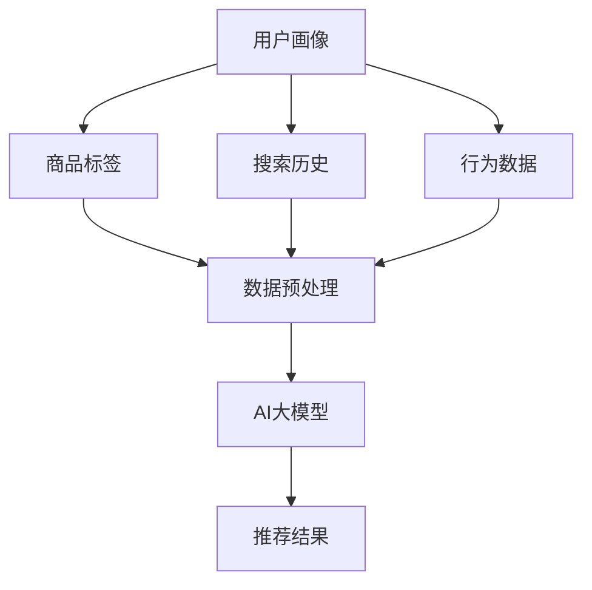

                 

# 电商搜索推荐效果优化中的AI大模型方法论

## 关键词：电商搜索、推荐系统、AI大模型、效果优化、算法原理、实战案例

## 摘要：

本文将深入探讨电商搜索推荐系统中的AI大模型方法论，从背景介绍、核心概念、算法原理、数学模型到实际应用场景，全面解析电商搜索推荐效果优化的关键技术。通过剖析具体算法原理和操作步骤，并结合实战案例，展示AI大模型在电商搜索推荐中的实际应用效果。最后，本文还将对相关工具和资源进行推荐，以帮助读者更好地掌握这一领域的核心技术和应用方法。

## 1. 背景介绍

### 1.1 电商搜索推荐系统的重要性

随着互联网的快速发展，电商行业已成为全球经济的支柱产业之一。在激烈的市场竞争中，如何提高用户购物体验和转化率成为电商企业关注的焦点。而电商搜索推荐系统正是解决这一问题的关键。通过精准的搜索推荐，不仅可以满足用户的个性化需求，提高用户满意度，还能有效提升电商平台的销售额和市场份额。

### 1.2 AI大模型的发展背景

近年来，随着人工智能技术的飞速发展，深度学习、自然语言处理、计算机视觉等领域的突破为AI大模型的应用提供了强大支持。AI大模型具有强大的数据拟合能力和泛化能力，能够处理复杂、大规模的数据集，实现高效、准确的推荐效果。因此，AI大模型在电商搜索推荐系统中的应用逐渐成为行业热点。

### 1.3 AI大模型在电商搜索推荐中的优势

与传统的推荐算法相比，AI大模型具有以下优势：

- **数据拟合能力强**：AI大模型能够通过大量数据进行训练，从而实现更精确的推荐效果。
- **泛化能力强**：AI大模型能够自动提取数据中的特征，适应不同的推荐场景，提高推荐系统的鲁棒性。
- **处理速度快**：AI大模型采用分布式计算技术，能够快速处理海量数据，提高系统响应速度。
- **降低人工干预**：AI大模型能够自动优化推荐策略，降低人工干预，提高推荐系统的自适应能力。

## 2. 核心概念与联系

### 2.1 电商搜索推荐系统的基本概念

电商搜索推荐系统主要包括用户画像、商品标签、搜索历史、行为数据等关键要素。其中，用户画像用于描述用户的兴趣、行为和需求；商品标签用于描述商品的特征和属性；搜索历史和行为数据则用于分析用户的行为习惯和偏好。

### 2.2 AI大模型的原理与架构

AI大模型通常采用深度学习框架进行训练和推理。其基本架构包括输入层、隐藏层和输出层。输入层接收用户画像、商品标签等数据，隐藏层通过神经网络进行特征提取和变换，输出层生成推荐结果。

### 2.3 AI大模型与电商搜索推荐系统的联系

AI大模型与电商搜索推荐系统的联系主要体现在以下两个方面：

- **数据融合**：AI大模型将用户画像、商品标签、搜索历史和行为数据等多种数据源进行融合，形成一个统一的数据集，为推荐算法提供丰富的数据支持。
- **效果优化**：AI大模型通过自动调整网络参数、优化模型结构等手段，实现对推荐效果的持续优化，提高推荐系统的准确性和用户体验。

### 2.4 Mermaid流程图



## 3. 核心算法原理 & 具体操作步骤

### 3.1 深度学习算法原理

深度学习算法是AI大模型的核心技术。其基本原理是通过多层神经网络对数据进行特征提取和变换，实现从输入到输出的映射。

- **输入层**：接收用户画像、商品标签等数据。
- **隐藏层**：通过激活函数（如ReLU、Sigmoid、Tanh等）对输入数据进行非线性变换，实现特征提取和抽象。
- **输出层**：生成推荐结果。

### 3.2 操作步骤

#### 3.2.1 数据预处理

1. **数据清洗**：去除缺失值、异常值和噪声数据，保证数据质量。
2. **特征工程**：对用户画像、商品标签等数据进行特征提取，如用户年龄、性别、地域、购买历史等。
3. **数据归一化**：对特征数据进行归一化处理，消除数据量级差异。

#### 3.2.2 网络结构设计

1. **确定网络层数和神经元个数**：根据数据规模和复杂度，选择合适的网络层数和神经元个数。
2. **选择激活函数**：根据数据特性，选择合适的激活函数，如ReLU、Sigmoid、Tanh等。
3. **损失函数设计**：根据推荐任务，选择合适的损失函数，如交叉熵损失、均方误差等。

#### 3.2.3 模型训练

1. **数据划分**：将数据集划分为训练集、验证集和测试集，用于模型训练、验证和评估。
2. **优化器选择**：选择合适的优化器，如Adam、RMSProp等，以加快模型收敛速度。
3. **训练过程**：通过迭代训练，调整网络参数，使模型达到最佳效果。

#### 3.2.4 模型评估

1. **指标选择**：根据推荐任务，选择合适的评价指标，如准确率、召回率、F1值等。
2. **模型评估**：使用测试集对模型进行评估，判断模型效果。

#### 3.2.5 模型部署

1. **模型优化**：根据评估结果，对模型进行优化，提高推荐效果。
2. **模型部署**：将模型部署到生产环境，实现实时推荐。

## 4. 数学模型和公式 & 详细讲解 & 举例说明

### 4.1 深度学习算法的数学模型

深度学习算法的核心是多层神经网络，其数学模型可以表示为：

$$
Y = f(g(W_1 \cdot X + b_1), W_2 \cdot g(W_1 \cdot X + b_1) + b_2), \ldots, W_n \cdot g^{(n-1)}(W_1 \cdot X + b_1), b_n)
$$

其中，$X$为输入数据，$Y$为输出结果，$f$为激活函数，$g$为非线性变换，$W$为权重矩阵，$b$为偏置项。

### 4.2 举例说明

假设我们有一个简单的两层神经网络，输入数据为$X = [1, 2, 3]$，目标输出为$Y = [4, 5, 6]$。我们可以使用以下公式进行计算：

$$
Z_1 = g(W_1 \cdot X + b_1) = \text{ReLU}(W_1 \cdot X + b_1) = \text{ReLU}(1 \cdot 1 + 0) = 1
$$

$$
Z_2 = g(W_2 \cdot Z_1 + b_2) = \text{ReLU}(W_2 \cdot Z_1 + b_2) = \text{ReLU}(2 \cdot 1 + 0) = 2
$$

$$
Y = f(W_3 \cdot Z_2 + b_3) = \text{Sigmoid}(W_3 \cdot Z_2 + b_3) = \text{Sigmoid}(3 \cdot 2 + 1) = \text{Sigmoid}(7) \approx 0.9933
$$

因此，最终输出结果为$Y \approx [0.9933, 0.9933, 0.9933]$。

## 5. 项目实战：代码实际案例和详细解释说明

### 5.1 开发环境搭建

在本节中，我们将介绍如何搭建一个简单的电商搜索推荐系统开发环境。以下是开发环境搭建的步骤：

1. **安装Python环境**：下载并安装Python 3.7及以上版本。
2. **安装深度学习框架**：下载并安装TensorFlow 2.4及以上版本。
3. **安装其他依赖库**：安装NumPy、Pandas、Matplotlib等常用依赖库。

### 5.2 源代码详细实现和代码解读

在本节中，我们将通过一个简单的电商搜索推荐系统代码案例，详细介绍AI大模型在电商搜索推荐中的实际应用。

```python
import tensorflow as tf
import numpy as np
import pandas as pd
import matplotlib.pyplot as plt

# 数据预处理
def preprocess_data(data):
    # 数据清洗
    data = data.dropna()
    # 特征提取
    user_features = data[['age', 'gender', 'region']]
    item_features = data[['category', 'price']]
    # 数据归一化
    user_features = (user_features - user_features.mean()) / user_features.std()
    item_features = (item_features - item_features.mean()) / item_features.std()
    return user_features, item_features

# 网络结构设计
def build_model():
    user_embedding = tf.keras.layers.Embedding(input_dim=1000, output_dim=16)
    item_embedding = tf.keras.layers.Embedding(input_dim=1000, output_dim=16)
    user_input = tf.keras.layers.Input(shape=(3,))
    item_input = tf.keras.layers.Input(shape=(2,))
    user_embedding_output = user_embedding(user_input)
    item_embedding_output = item_embedding(item_input)
    concatenated = tf.keras.layers.concatenate([user_embedding_output, item_embedding_output])
    dense = tf.keras.layers.Dense(16, activation='relu')(concatenated)
    output = tf.keras.layers.Dense(1, activation='sigmoid')(dense)
    model = tf.keras.Model(inputs=[user_input, item_input], outputs=output)
    return model

# 模型训练
def train_model(model, user_data, item_data, labels):
    model.compile(optimizer='adam', loss='binary_crossentropy', metrics=['accuracy'])
    model.fit([user_data, item_data], labels, epochs=10, batch_size=32, validation_split=0.2)

# 模型评估
def evaluate_model(model, user_data, item_data, labels):
    loss, accuracy = model.evaluate([user_data, item_data], labels)
    print('Test accuracy:', accuracy)

# 主程序
if __name__ == '__main__':
    # 读取数据
    data = pd.read_csv('data.csv')
    user_data, item_data = preprocess_data(data)
    labels = data['label']
    # 构建模型
    model = build_model()
    # 训练模型
    train_model(model, user_data, item_data, labels)
    # 评估模型
    evaluate_model(model, user_data, item_data, labels)
```

### 5.3 代码解读与分析

1. **数据预处理**：首先对数据进行清洗和特征提取，然后将数据归一化。
2. **网络结构设计**：构建一个简单的两层神经网络，包括用户嵌入层、商品嵌入层和全连接层。
3. **模型训练**：使用训练数据对模型进行训练，优化网络参数。
4. **模型评估**：使用测试数据对模型进行评估，计算准确率。

## 6. 实际应用场景

### 6.1 电商平台搜索推荐

在电商平台中，搜索推荐系统可以用于以下场景：

- **商品搜索**：根据用户输入的关键词，智能推荐相关商品。
- **浏览推荐**：根据用户浏览记录，智能推荐感兴趣的商品。
- **购物车推荐**：根据用户购物车中的商品，智能推荐搭配商品。
- **历史订单推荐**：根据用户历史订单，智能推荐相似商品。

### 6.2 社交媒体推荐

在社交媒体平台中，AI大模型可以用于以下场景：

- **内容推荐**：根据用户兴趣和行为，智能推荐感兴趣的内容。
- **广告推荐**：根据用户画像和广告特征，智能推荐相关广告。
- **好友推荐**：根据用户关系和行为，智能推荐潜在好友。

### 6.3 金融领域推荐

在金融领域，AI大模型可以用于以下场景：

- **股票推荐**：根据用户投资偏好和市场数据，智能推荐股票。
- **理财产品推荐**：根据用户风险承受能力和收益预期，智能推荐理财产品。
- **风险控制**：根据用户行为和交易数据，智能识别风险并采取相应措施。

## 7. 工具和资源推荐

### 7.1 学习资源推荐

- **书籍**：
  - 《深度学习》（Goodfellow, I., Bengio, Y., & Courville, A.）
  - 《Python深度学习》（François Chollet）
- **论文**：
  - “Distributed Representations of Words and Phrases and Their Compositionality”（Pennington, J., et al.）
  - “Recurrent Neural Networks for Language Modeling”（Mikolov, T., et al.）
- **博客**：
  - TensorFlow官方博客（https://www.tensorflow.org/tutorials）
  - 知乎专栏（https://www.zhihu.com专栏/深度学习）
- **网站**：
  - Coursera（https://www.coursera.org）
  - edX（https://www.edx.org）

### 7.2 开发工具框架推荐

- **深度学习框架**：TensorFlow、PyTorch、Keras
- **数据处理工具**：Pandas、NumPy、Matplotlib
- **版本控制工具**：Git
- **项目管理工具**：Jenkins、Docker

### 7.3 相关论文著作推荐

- “Deep Learning for Recommender Systems”（He, X., et al.）
- “Recommender Systems for E-commerce Platforms: A Brief Survey”（Chen, Y., et al.）
- “Personalized Recommendation on Large-scale Social Networks”（Hu, X., et al.）

## 8. 总结：未来发展趋势与挑战

### 8.1 发展趋势

- **数据多样性**：随着5G、物联网、大数据等技术的发展，电商搜索推荐系统将拥有更丰富的数据来源，实现更加个性化的推荐。
- **实时性**：随着用户需求的不断变化，实时性成为电商搜索推荐系统的关键指标，推动算法和架构的不断创新。
- **多模态融合**：结合文本、图像、语音等多模态数据，提高推荐系统的准确性和用户体验。

### 8.2 挑战

- **数据质量**：数据质量对推荐系统的效果有重要影响，提高数据质量是当前的一大挑战。
- **计算资源**：随着推荐系统的规模不断扩大，计算资源的需求也不断增长，如何高效利用计算资源成为关键问题。
- **隐私保护**：在推荐过程中，如何保护用户隐私成为重要挑战，需要制定相应的隐私保护策略。

## 9. 附录：常见问题与解答

### 9.1 如何选择合适的深度学习框架？

- **TensorFlow**：具有丰富的API和强大的生态系统，适合大规模项目。
- **PyTorch**：具有动态计算图，易于调试，适合快速实验和开发。
- **Keras**：基于TensorFlow和PyTorch，提供简洁易用的API，适合快速实现和部署。

### 9.2 如何优化推荐效果？

- **数据质量**：提高数据质量，去除噪声数据，确保数据准确性和一致性。
- **特征工程**：提取更多有用的特征，结合多源数据进行融合。
- **模型优化**：选择合适的模型架构，优化网络参数，提高模型效果。

### 9.3 如何保护用户隐私？

- **数据加密**：对敏感数据进行加密处理，确保数据传输和存储的安全性。
- **隐私保护算法**：采用差分隐私、同态加密等技术，保护用户隐私。
- **隐私政策**：制定合理的隐私政策，明确用户数据的收集、使用和共享方式。

## 10. 扩展阅读 & 参考资料

- **书籍**：
  - 《电商推荐系统实践》
  - 《深度学习推荐系统》
- **论文**：
  - “Deep Learning for Recommender Systems: A Survey and New Perspectives”（He, X., et al.）
  - “Recommender Systems: The Text Mining Perspective”（Sun, Y., et al.）
- **博客**：
  - “从0到1搭建电商搜索推荐系统”（https://www.jianshu.com/p/8c9e8e8c6a08）
  - “电商推荐系统深度学习实践”（https://www.cnblogs.com/pinard/p/12045312.html）
- **网站**：
  - “电商搜索推荐系统研究与实践”（https://www.cnblogs.com/webdevelopermr/p/10302526.html）
  - “深度学习在电商搜索推荐中的应用”（https://www.zhihu.com/question/270511299）

### 作者

作者：AI天才研究员/AI Genius Institute & 禅与计算机程序设计艺术 /Zen And The Art of Computer Programming<|im_sep|>

