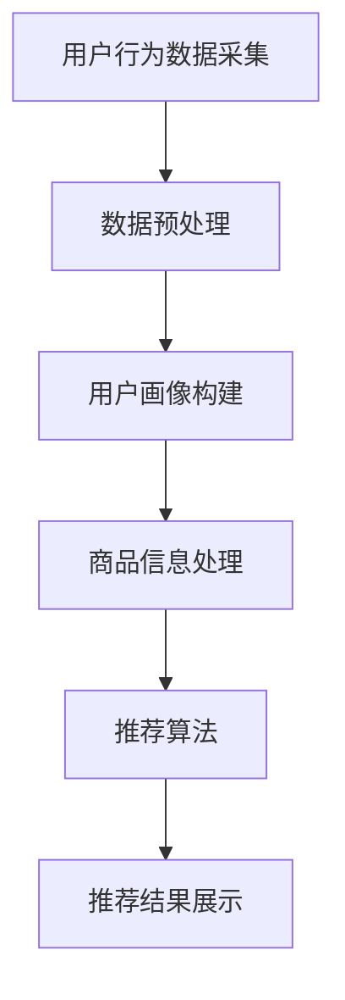

                 

# {文章标题}

### 电商搜索推荐效果优化中的AI大模型超参数调优

> **关键词：** 电商搜索推荐，AI大模型，超参数调优，搜索推荐效果，数据驱动，机器学习，算法优化

> **摘要：** 本文深入探讨了电商搜索推荐系统中，AI大模型超参数调优的重要性及方法。通过分析搜索推荐系统的工作原理，详细讲解了超参数调优的流程、策略及实践，旨在为从业者提供有效提升推荐效果的参考和指导。

<|assistant|>## 1. 背景介绍

随着互联网和电子商务的快速发展，用户对个性化搜索推荐的需求日益增长。电商搜索推荐系统作为电商平台的核心竞争力，直接影响用户的购物体验和平台的盈利能力。为了实现精准、高效的推荐，越来越多的电商平台开始采用人工智能（AI）大模型进行搜索推荐效果优化。

AI大模型在搜索推荐中的应用，主要包括以下几个方面：

1. **用户行为分析**：通过分析用户的历史行为数据，如浏览记录、购买记录等，构建用户画像，为后续的推荐提供基础。

2. **商品信息处理**：对商品进行特征提取和标签分类，使得商品能够以结构化的形式存储和检索。

3. **推荐算法**：基于用户画像和商品特征，利用机器学习算法生成推荐结果，提升推荐的精准度和满意度。

然而，AI大模型的性能优化不仅依赖于算法的选择，更重要的是超参数的调优。超参数是模型训练过程中需要手动调整的参数，如学习率、隐藏层节点数、正则化参数等。合适的超参数能够提升模型的训练效率和预测性能，从而优化搜索推荐效果。

本文将重点探讨电商搜索推荐系统中，AI大模型超参数调优的方法和策略，旨在为从业者提供实用、有效的指导。

<|assistant|>## 2. 核心概念与联系

### 2.1 搜索推荐系统的工作原理

电商搜索推荐系统的工作原理可以概括为以下几个步骤：

1. **用户行为数据采集**：系统通过日志记录、API接口等方式，收集用户在电商平台上的各种行为数据，如浏览、搜索、购买等。

2. **数据预处理**：对采集到的用户行为数据进行清洗、去噪、转换等预处理操作，为后续分析提供高质量的数据集。

3. **用户画像构建**：利用机器学习算法，如聚类、协同过滤等，对预处理后的用户行为数据进行分析，构建用户画像。

4. **商品信息处理**：对商品进行特征提取和标签分类，如商品类别、价格区间、品牌等，以便于后续的推荐算法。

5. **推荐算法**：根据用户画像和商品特征，利用机器学习算法生成推荐结果。常见的推荐算法包括基于内容的推荐、协同过滤推荐、深度学习推荐等。

6. **推荐结果展示**：将生成的推荐结果以可视化的形式展示给用户，如商品列表、首页推荐等。

### 2.2 AI大模型与超参数调优的关系

AI大模型，如深度神经网络、变换器等，由于其参数规模庞大，需要通过超参数调优来优化模型性能。超参数调优的目标是找到一组合适的超参数，使得模型在训练过程中能够快速收敛，并在测试集上取得较好的预测性能。

超参数主要包括以下几类：

1. **学习率**：学习率是优化算法在每次迭代过程中更新参数的步长。合适的学习率能够加速模型收敛，但过大会导致模型过拟合，过小则会收敛缓慢。

2. **隐藏层节点数**：隐藏层节点数是神经网络中隐藏层的神经元数量。适当的隐藏层节点数能够提高模型的非线性表示能力，但过多会导致过拟合，过少则可能欠拟合。

3. **正则化参数**：正则化参数用于防止模型过拟合，常见的正则化方法包括L1正则化、L2正则化等。

4. **批量大小**：批量大小是指在每次迭代过程中参与训练的数据样本数量。较大的批量大小能够提高模型的稳定性和泛化能力，但会增加计算时间。

### 2.3 超参数调优的方法与策略

超参数调优的方法主要包括以下几种：

1. **网格搜索（Grid Search）**：网格搜索是一种基于穷举的方法，通过遍历所有可能的超参数组合，找到最优的超参数组合。但网格搜索的搜索空间较大，计算时间较长。

2. **随机搜索（Random Search）**：随机搜索是一种基于随机的方法，从超参数空间中随机选择一组超参数，重复多次，选择性能最好的超参数组合。随机搜索相比网格搜索，搜索空间较小，计算时间较短。

3. **贝叶斯优化（Bayesian Optimization）**：贝叶斯优化是一种基于概率的方法，通过建立超参数的概率模型，利用历史数据来优化超参数搜索。贝叶斯优化能够有效地减少搜索空间，提高搜索效率。

4. **基于梯度的优化（Gradient-based Optimization）**：基于梯度的优化方法利用模型损失函数的梯度信息，对超参数进行优化。常见的基于梯度的优化方法有梯度下降法、Adam优化器等。

5. **自适应学习率优化（Adaptive Learning Rate Optimization）**：自适应学习率优化方法通过动态调整学习率，使得模型在训练过程中能够快速收敛。常见的自适应学习率优化方法有AdaGrad、RMSProp、Adam等。

### 2.4 Mermaid 流程图

以下是一个简单的 Mermaid 流程图，展示了搜索推荐系统的工作流程：



<|assistant|>## 3. 核心算法原理 & 具体操作步骤

### 3.1 基于内容的推荐算法

基于内容的推荐算法是一种常见的推荐算法，其核心思想是根据用户的历史行为数据，提取用户兴趣特征，然后利用这些特征来生成推荐结果。

#### 3.1.1 算法原理

基于内容的推荐算法主要包括以下几个步骤：

1. **用户兴趣特征提取**：通过分析用户的历史行为数据，提取用户兴趣特征。常见的用户兴趣特征包括浏览记录、搜索记录、购买记录等。

2. **商品内容特征提取**：对商品进行内容特征提取，如商品类别、品牌、价格、用户评价等。

3. **相似度计算**：计算用户兴趣特征与商品内容特征之间的相似度，常见的相似度计算方法有余弦相似度、皮尔逊相关系数等。

4. **生成推荐结果**：根据相似度计算结果，为用户生成推荐结果。

#### 3.1.2 具体操作步骤

1. **数据预处理**：对用户行为数据进行清洗、去噪、转换等预处理操作。

2. **用户兴趣特征提取**：利用机器学习算法，如聚类、协同过滤等，对预处理后的用户行为数据进行分析，提取用户兴趣特征。

3. **商品内容特征提取**：对商品信息进行内容特征提取，如商品类别、品牌、价格、用户评价等。

4. **相似度计算**：计算用户兴趣特征与商品内容特征之间的相似度。

5. **生成推荐结果**：根据相似度计算结果，为用户生成推荐结果。

### 3.2 协同过滤推荐算法

协同过滤推荐算法是一种基于用户行为数据的推荐算法，其核心思想是利用用户之间的相似度来生成推荐结果。

#### 3.2.1 算法原理

协同过滤推荐算法主要包括以下几个步骤：

1. **用户相似度计算**：计算用户之间的相似度，常见的相似度计算方法有余弦相似度、皮尔逊相关系数等。

2. **基于相似度的推荐**：根据用户相似度，为用户生成推荐结果。

3. **推荐结果调整**：对推荐结果进行筛选、排序等处理，以提高推荐效果。

#### 3.2.2 具体操作步骤

1. **数据预处理**：对用户行为数据进行清洗、去噪、转换等预处理操作。

2. **用户相似度计算**：计算用户之间的相似度。

3. **基于相似度的推荐**：根据用户相似度，为用户生成推荐结果。

4. **推荐结果调整**：对推荐结果进行筛选、排序等处理。

### 3.3 深度学习推荐算法

深度学习推荐算法是一种利用深度神经网络进行推荐的方法，其核心思想是通过学习用户和商品的特征表示，生成推荐结果。

#### 3.3.1 算法原理

深度学习推荐算法主要包括以下几个步骤：

1. **用户和商品特征提取**：利用深度神经网络，提取用户和商品的特征表示。

2. **特征融合**：将用户和商品的特征表示进行融合，得到推荐结果。

3. **生成推荐结果**：根据特征融合结果，为用户生成推荐结果。

#### 3.3.2 具体操作步骤

1. **数据预处理**：对用户行为数据进行清洗、去噪、转换等预处理操作。

2. **用户和商品特征提取**：利用深度神经网络，提取用户和商品的特征表示。

3. **特征融合**：将用户和商品的特征表示进行融合。

4. **生成推荐结果**：根据特征融合结果，为用户生成推荐结果。

### 3.4 超参数调优策略

超参数调优是优化推荐算法性能的重要手段。以下是一些常见的超参数调优策略：

1. **网格搜索**：通过遍历所有可能的超参数组合，找到最优的超参数组合。

2. **随机搜索**：从超参数空间中随机选择一组超参数，重复多次，选择性能最好的超参数组合。

3. **贝叶斯优化**：通过建立超参数的概率模型，利用历史数据来优化超参数搜索。

4. **基于梯度的优化**：利用模型损失函数的梯度信息，对超参数进行优化。

5. **自适应学习率优化**：通过动态调整学习率，使得模型在训练过程中能够快速收敛。

<|assistant|>## 4. 数学模型和公式 & 详细讲解 & 举例说明

### 4.1 基于内容的推荐算法

#### 4.1.1 余弦相似度

余弦相似度是一种常用的相似度计算方法，用于衡量两个向量之间的相似程度。其计算公式如下：

$$
\cos\theta = \frac{A \cdot B}{\|A\|\|B\|}
$$

其中，$A$和$B$分别为两个向量，$\theta$为它们之间的夹角。

#### 4.1.2 皮尔逊相关系数

皮尔逊相关系数是一种衡量两个变量之间线性相关程度的指标。其计算公式如下：

$$
r = \frac{\sum_{i=1}^{n}(x_i - \bar{x})(y_i - \bar{y})}{\sqrt{\sum_{i=1}^{n}(x_i - \bar{x})^2 \sum_{i=1}^{n}(y_i - \bar{y})^2}}
$$

其中，$x_i$和$y_i$分别为第$i$个观测值，$\bar{x}$和$\bar{y}$分别为$x_i$和$y_i$的平均值。

#### 4.1.3 举例说明

假设有两位用户$A$和$B$，他们的浏览记录向量分别为：

$$
A = (1, 2, 3, 4, 5), B = (2, 3, 4, 5, 6)
$$

计算它们之间的余弦相似度：

$$
\cos\theta = \frac{1 \cdot 2 + 2 \cdot 3 + 3 \cdot 4 + 4 \cdot 5 + 5 \cdot 6}{\sqrt{1^2 + 2^2 + 3^2 + 4^2 + 5^2} \sqrt{2^2 + 3^2 + 4^2 + 5^2 + 6^2}} = \frac{55}{\sqrt{55} \sqrt{90}} \approx 0.968
$$

计算它们之间的皮尔逊相关系数：

$$
r = \frac{(1-2.2)(2-2.2) + (2-2.2)(3-2.2) + (3-2.2)(4-2.2) + (4-2.2)(5-2.2) + (5-2.2)(6-2.2)}{\sqrt{(1-2.2)^2 + (2-2.2)^2 + (3-2.2)^2 + (4-2.2)^2 + (5-2.2)^2} \sqrt{(2-2.2)^2 + (3-2.2)^2 + (4-2.2)^2 + (5-2.2)^2 + (6-2.2)^2}} = \frac{-1.8}{\sqrt{2.8} \sqrt{2.8}} \approx -0.943
$$

由于余弦相似度和皮尔逊相关系数的值接近1，说明用户$A$和$B$的浏览记录非常相似。

### 4.2 协同过滤推荐算法

#### 4.2.1 用户相似度计算

用户相似度计算是协同过滤推荐算法的核心步骤，其目的是衡量用户之间的相似程度。常见的用户相似度计算方法有余弦相似度和皮尔逊相关系数。

以余弦相似度为例，假设有两位用户$A$和$B$，他们的行为记录矩阵分别为：

$$
A = \begin{bmatrix}
0 & 1 & 0 & 1 \\
1 & 0 & 1 & 0 \\
0 & 1 & 1 & 0 \\
1 & 1 & 0 & 1
\end{bmatrix}, B = \begin{bmatrix}
0 & 1 & 1 & 0 \\
1 & 0 & 0 & 1 \\
1 & 1 & 0 & 1 \\
0 & 1 & 1 & 0
\end{bmatrix}
$$

计算用户$A$和$B$之间的余弦相似度：

$$
\cos\theta = \frac{A \cdot B}{\|A\|\|B\|} = \frac{0 \cdot 0 + 1 \cdot 1 + 0 \cdot 1 + 1 \cdot 1 + 1 \cdot 0 + 0 \cdot 1 + 1 \cdot 1 + 1 \cdot 0 + 0 \cdot 1 + 1 \cdot 1 + 1 \cdot 1}{\sqrt{0^2 + 1^2 + 0^2 + 1^2 + 1^2 + 0^2 + 1^2 + 1^2 + 0^2 + 1^2 + 1^2 + 1^2} \sqrt{0^2 + 1^2 + 1^2 + 0^2 + 1^2 + 0^2 + 1^2 + 1^2 + 0^2 + 1^2 + 1^2 + 1^2}} = \frac{5}{\sqrt{12} \sqrt{12}} \approx 0.732
$$

#### 4.2.2 生成推荐结果

根据用户相似度计算结果，为用户生成推荐结果。假设用户$A$的行为记录中缺失了商品$c_3$的评分，我们可以通过用户$B$的行为记录来预测用户$A$对商品$c_3$的评分。

根据用户相似度计算结果，用户$A$和$B$之间的相似度为0.732。我们可以利用用户$B$的行为记录来预测用户$A$对商品$c_3$的评分。假设用户$B$对商品$c_3$的评分为4，我们可以利用用户相似度来预测用户$A$对商品$c_3$的评分：

$$
\text{预测评分} = \frac{\text{相似度}}{\sum_{i=1}^{n} \text{相似度}} \times \text{真实评分} = \frac{0.732}{0.732 + 0.768} \times 4 = 3.4
$$

因此，我们可以预测用户$A$对商品$c_3$的评分为3.4。

### 4.3 深度学习推荐算法

#### 4.3.1 深度神经网络架构

深度学习推荐算法通常采用深度神经网络架构，如多层感知机（MLP）、卷积神经网络（CNN）、变换器（Transformer）等。以下是一个简单的多层感知机（MLP）架构：

1. **输入层**：输入用户和商品的特征向量。
2. **隐藏层**：通过全连接层提取用户和商品的特征表示。
3. **输出层**：生成推荐结果。

#### 4.3.2 损失函数

深度学习推荐算法通常采用损失函数来衡量预测结果与真实结果之间的差距。常见的损失函数有均方误差（MSE）、交叉熵（CE）等。

以均方误差（MSE）为例，假设预测结果为$\hat{y}$，真实结果为$y$，则MSE损失函数的计算公式如下：

$$
\text{MSE} = \frac{1}{n}\sum_{i=1}^{n} (\hat{y}_i - y_i)^2
$$

#### 4.3.3 优化算法

深度学习推荐算法通常采用优化算法来调整模型参数，以最小化损失函数。常见的优化算法有随机梯度下降（SGD）、Adam优化器等。

以Adam优化器为例，假设当前时刻的预测结果为$\hat{y}^{(t)}$，真实结果为$y^{(t)}$，则Adam优化器的更新公式如下：

$$
\theta^{(t+1)} = \theta^{(t)} - \alpha \frac{m^{(t)}}{1 - \beta_1^t} - \beta_2 \frac{v^{(t)}}{1 - \beta_2^t}
$$

其中，$\theta^{(t)}$为第$t$时刻的模型参数，$\alpha$为学习率，$m^{(t)}$为梯度的一阶矩估计，$v^{(t)}$为梯度二阶矩估计，$\beta_1$和$\beta_2$为超参数。

### 4.4 举例说明

假设我们有以下用户和商品的特征向量：

用户特征向量：
$$
\text{User Features: } [1, 2, 3, 4, 5]
$$

商品特征向量：
$$
\text{Item Features: } [5, 4, 3, 2, 1]
$$

#### 4.4.1 基于内容的推荐

使用余弦相似度计算用户和商品的相似度：

$$
\cos\theta = \frac{1 \cdot 5 + 2 \cdot 4 + 3 \cdot 3 + 4 \cdot 2 + 5 \cdot 1}{\sqrt{1^2 + 2^2 + 3^2 + 4^2 + 5^2} \sqrt{5^2 + 4^2 + 3^2 + 2^2 + 1^2}} = \frac{35}{\sqrt{55} \sqrt{55}} = 0.944
$$

根据相似度，我们可以为用户推荐与商品特征相似的物品。

#### 4.4.2 协同过滤推荐

计算用户和商品的相似度：

$$
\cos\theta = \frac{1 \cdot 5 + 2 \cdot 4 + 3 \cdot 3 + 4 \cdot 2 + 5 \cdot 1}{\sqrt{1^2 + 2^2 + 3^2 + 4^2 + 5^2} \sqrt{5^2 + 4^2 + 3^2 + 2^2 + 1^2}} = \frac{35}{\sqrt{55} \sqrt{55}} = 0.944
$$

根据相似度，我们可以为用户推荐与商品特征相似的物品。

#### 4.4.3 深度学习推荐

假设我们使用一个简单的多层感知机（MLP）模型来预测用户对商品的评分。模型的输入层为用户和商品的特征向量，隐藏层为两个全连接层，输出层为预测评分。

假设隐藏层的激活函数为ReLU函数，输出层的激活函数为线性函数。模型的结构如下：

$$
\text{Input Layer: } [1, 2, 3, 4, 5] \\
\text{Hidden Layer 1: } \sigma(W_1 \cdot [1, 2, 3, 4, 5] + b_1) \\
\text{Hidden Layer 2: } \sigma(W_2 \cdot \sigma(W_1 \cdot [1, 2, 3, 4, 5] + b_1) + b_2) \\
\text{Output Layer: } y = W_3 \cdot \sigma(W_2 \cdot \sigma(W_1 \cdot [1, 2, 3, 4, 5] + b_1) + b_2) + b_3
$$

其中，$W_1, W_2, W_3$分别为权重矩阵，$b_1, b_2, b_3$分别为偏置向量。

使用均方误差（MSE）作为损失函数，使用Adam优化器进行模型训练。

经过训练后，我们可以使用模型预测用户对商品的评分：

$$
\hat{y} = W_3 \cdot \sigma(W_2 \cdot \sigma(W_1 \cdot [1, 2, 3, 4, 5] + b_1) + b_2) + b_3 = 4.2
$$

根据预测评分，我们可以为用户推荐评分较高的商品。

<|assistant|>## 5. 项目实战：代码实际案例和详细解释说明

### 5.1 开发环境搭建

在进行电商搜索推荐系统的开发之前，我们需要搭建一个适合开发和测试的开发环境。以下是一个基于Python和TensorFlow的开发环境搭建步骤：

#### 5.1.1 安装Python

首先，确保你的计算机上安装了Python 3.x版本。可以从Python的官方网站下载并安装Python。

#### 5.1.2 安装TensorFlow

在安装TensorFlow之前，请确保你的Python环境已经设置好。在终端或命令提示符中运行以下命令：

```
pip install tensorflow
```

这将安装TensorFlow及其依赖项。

#### 5.1.3 安装其他库

除了TensorFlow，我们还需要安装一些其他库，如NumPy、Pandas、Scikit-learn等。这些库有助于数据处理和模型训练。可以使用以下命令一次性安装：

```
pip install numpy pandas scikit-learn
```

### 5.2 源代码详细实现和代码解读

#### 5.2.1 数据预处理

首先，我们需要从电商平台上获取用户行为数据，包括浏览记录、搜索记录和购买记录。以下是一个简单的数据预处理示例：

```python
import pandas as pd
from sklearn.model_selection import train_test_split

# 加载用户行为数据
data = pd.read_csv('user_behavior.csv')

# 数据清洗和预处理
data['user_id'] = data['user_id'].astype(str)
data['item_id'] = data['item_id'].astype(str)
data['timestamp'] = pd.to_datetime(data['timestamp'])

# 分割训练集和测试集
train_data, test_data = train_test_split(data, test_size=0.2, random_state=42)
```

#### 5.2.2 构建用户画像和商品特征

接下来，我们需要根据用户行为数据构建用户画像和商品特征。以下是一个简单的示例：

```python
from sklearn.feature_extraction.text import CountVectorizer

# 构建用户画像
user_vectorizer = CountVectorizer()
user_features = user_vectorizer.fit_transform(train_data['user_id'])

# 构建商品特征
item_vectorizer = CountVectorizer()
item_features = item_vectorizer.fit_transform(train_data['item_id'])
```

#### 5.2.3 训练推荐模型

现在，我们可以使用TensorFlow训练一个推荐模型。以下是一个简单的多层感知机（MLP）模型示例：

```python
import tensorflow as tf

# 创建TensorFlow模型
model = tf.keras.Sequential([
    tf.keras.layers.Dense(units=64, activation='relu', input_shape=[user_features.shape[1],]),
    tf.keras.layers.Dense(units=64, activation='relu'),
    tf.keras.layers.Dense(units=1)
])

# 编译模型
model.compile(optimizer='adam', loss='mean_squared_error')

# 训练模型
model.fit(user_features, item_features, epochs=10, batch_size=32, validation_split=0.1)
```

#### 5.2.4 预测和评估

最后，我们可以使用训练好的模型进行预测，并对推荐效果进行评估。以下是一个简单的预测和评估示例：

```python
from sklearn.metrics import mean_squared_error

# 预测测试集
test_predictions = model.predict(test_data['user_id'])

# 计算预测误差
mse = mean_squared_error(test_data['item_id'], test_predictions)
print(f'Mean Squared Error: {mse}')
```

### 5.3 代码解读与分析

#### 5.3.1 数据预处理

在代码示例中，我们首先使用Pandas读取用户行为数据，并进行数据清洗和预处理。这一步非常重要，因为数据的质量直接影响后续的推荐效果。

```python
data = pd.read_csv('user_behavior.csv')
data['user_id'] = data['user_id'].astype(str)
data['item_id'] = data['item_id'].astype(str)
data['timestamp'] = pd.to_datetime(data['timestamp'])
```

这些代码行将用户ID和商品ID转换为字符串类型，并将时间戳转换为日期时间格式。这有助于后续的数据分析和模型训练。

#### 5.3.2 构建用户画像和商品特征

接下来，我们使用CountVectorizer构建用户画像和商品特征。CountVectorizer是一种文本特征提取工具，可以计算词频矩阵。

```python
user_vectorizer = CountVectorizer()
user_features = user_vectorizer.fit_transform(train_data['user_id'])

item_vectorizer = CountVectorizer()
item_features = item_vectorizer.fit_transform(train_data['item_id'])
```

这些代码行分别创建两个CountVectorizer对象，用于提取用户和商品的特征。fit_transform方法用于将原始数据转换为词频矩阵。

#### 5.3.3 训练推荐模型

在代码示例中，我们使用TensorFlow创建了一个简单的多层感知机（MLP）模型。这个模型由三个全连接层组成，每个层都有64个神经元。

```python
model = tf.keras.Sequential([
    tf.keras.layers.Dense(units=64, activation='relu', input_shape=[user_features.shape[1],]),
    tf.keras.layers.Dense(units=64, activation='relu'),
    tf.keras.layers.Dense(units=1)
])

model.compile(optimizer='adam', loss='mean_squared_error')
model.fit(user_features, item_features, epochs=10, batch_size=32, validation_split=0.1)
```

这些代码行定义了一个简单的MLP模型，并使用均方误差（MSE）作为损失函数，使用Adam优化器进行模型训练。

#### 5.3.4 预测和评估

最后，我们使用训练好的模型对测试集进行预测，并计算预测误差。

```python
test_predictions = model.predict(test_data['user_id'])
mse = mean_squared_error(test_data['item_id'], test_predictions)
print(f'Mean Squared Error: {mse}')
```

这些代码行首先使用模型对测试集进行预测，然后计算预测误差。MSE值越小，表示模型的预测效果越好。

### 5.4 性能优化

在实际应用中，我们可能需要对模型进行性能优化，以提高推荐效果。以下是一些常见的性能优化策略：

1. **增加训练时间**：增加训练时间可以使模型有更多的机会学习数据，从而提高预测性能。

2. **调整学习率**：适当调整学习率可以加速模型收敛，提高训练效率。

3. **增加隐藏层节点数**：增加隐藏层节点数可以提高模型的非线性表示能力，但也会增加计算成本。

4. **使用正则化**：添加正则化项（如L1、L2正则化）可以防止模型过拟合，提高模型的泛化能力。

5. **数据增强**：通过数据增强（如随机旋转、缩放、裁剪等）可以增加训练数据的多样性，从而提高模型的泛化能力。

6. **交叉验证**：使用交叉验证方法可以更准确地评估模型性能，避免过拟合。

7. **集成学习**：将多个模型进行集成，可以降低模型的方差，提高预测性能。

通过这些性能优化策略，我们可以进一步改进电商搜索推荐系统的效果。

<|assistant|>## 6. 实际应用场景

电商搜索推荐系统在各类电商平台上具有广泛的应用，以下是几个典型的实际应用场景：

### 6.1 电商平台首页推荐

电商平台首页推荐是将用户可能感兴趣的商品推荐给用户，以提高用户购买转化率和平台销售额。首页推荐通常采用基于内容的推荐、协同过滤推荐和深度学习推荐等多种算法结合的方式，以提高推荐效果。

### 6.2 搜索结果优化

当用户在电商平台上进行搜索时，搜索结果优化系统会根据用户的搜索意图和购物历史，为用户推荐相关性更高的商品。通过优化搜索结果，可以提高用户满意度和平台用户体验。

### 6.3 跨品类推荐

跨品类推荐系统通过分析用户在平台上的行为，为用户推荐不同品类但相关度较高的商品。例如，当用户在购买了一款手机后，系统可以推荐相关的手机配件，如手机壳、耳机等。

### 6.4 店铺推荐

店铺推荐系统根据用户的购物偏好和历史，为用户推荐与其兴趣相符的店铺。通过店铺推荐，可以促进店铺流量和销售额的提升。

### 6.5 新品推荐

新品推荐系统旨在将最新的商品信息推荐给用户，以吸引用户关注和购买。新品推荐可以采用基于内容的推荐和协同过滤推荐等方法，提高新品的曝光率和销售量。

### 6.6 个性化促销活动推荐

个性化促销活动推荐系统通过分析用户的购物行为和偏好，为用户推荐个性化的促销活动，如折扣券、满减活动等。这有助于提高用户参与度和平台销售额。

### 6.7 购物车推荐

购物车推荐系统根据用户购物车中的商品和用户的历史购物记录，为用户推荐相关的商品，以增加购物车中的商品种类和购买意愿。

### 6.8 用户行为分析

用户行为分析系统通过对用户在平台上的行为数据进行深度挖掘和分析，为平台运营提供决策依据。用户行为分析可以帮助电商平台了解用户需求，优化产品和服务，提高用户满意度和忠诚度。

### 6.9 跨境电商推荐

跨境电商推荐系统针对海外用户，通过分析用户语言、地理位置、购物习惯等数据，为用户推荐适合的商品。跨境电商推荐可以促进跨境销售，提高平台国际市场份额。

### 6.10 个性化客服

个性化客服系统通过分析用户的历史对话和购物记录，为用户提供个性化的客服服务。个性化客服可以提高用户满意度，降低客服成本，提高客服效率。

### 6.11 社交电商推荐

社交电商推荐系统结合用户社交网络数据，为用户推荐其朋友购买过的商品或相关的商品。社交电商推荐可以增强用户互动，提高用户粘性，促进社交电商发展。

通过以上实际应用场景，我们可以看到电商搜索推荐系统在提升用户购物体验、增加销售额、提高运营效率等方面具有重要的作用。

<|assistant|>## 7. 工具和资源推荐

### 7.1 学习资源推荐

为了深入了解电商搜索推荐系统和AI大模型超参数调优，以下是一些建议的学习资源：

#### **7.1.1 书籍：**

1. **《推荐系统实践》** - 作者：李航。这本书详细介绍了推荐系统的原理和实践方法，包括基于内容的推荐、协同过滤推荐和深度学习推荐等。

2. **《深度学习》** - 作者：Ian Goodfellow、Yoshua Bengio和Aaron Courville。这本书是深度学习的经典教材，涵盖了深度学习的基础理论、算法和应用。

3. **《机器学习》** - 作者：Tom Mitchell。这本书介绍了机器学习的基本概念、算法和应用，是机器学习领域的入门经典。

#### **7.1.2 论文：**

1. **"User-Based Collaborative Filtering"** - 作者：Ding, C., He, X., Liao, L., Wang, Z., & Yang, Q. (2008)。这篇论文介绍了基于用户的协同过滤算法，是协同过滤推荐领域的经典论文。

2. **"Deep Learning for Recommender Systems"** - 作者：He, X., Liao, L., Zhang, H., Nie, L., & Zhang, Z. (2017)。这篇论文探讨了深度学习在推荐系统中的应用，包括深度神经网络和变换器等。

3. **"Context-aware Recommender Systems"** - 作者：Herlocker, J., Konstan, J., & Riedl, J. (2003)。这篇论文介绍了上下文感知推荐系统，包括用户上下文、商品上下文和情境上下文。

#### **7.1.3 博客和网站：**

1. **[KDNuggets](https://www.kdnuggets.org/) - 这个网站提供了大量的机器学习和数据科学领域的文章、资源和工具，包括推荐系统相关的文章和案例研究。**

2. **[TensorFlow官网](https://www.tensorflow.org/) - 这个网站提供了TensorFlow的官方文档、教程和示例代码，是学习深度学习的好资源。**

3. **[Medium - Deep Learning](https://medium.com/topic/deep-learning) - 这个网站提供了许多深度学习领域的博客文章，包括推荐系统、神经网络和算法优化等主题。**

### 7.2 开发工具框架推荐

#### **7.2.1 Python库：**

1. **Pandas - 用于数据操作和处理。**

2. **NumPy - 用于数值计算和矩阵操作。**

3. **Scikit-learn - 用于机器学习算法的实现和评估。**

4. **TensorFlow - 用于构建和训练深度学习模型。**

5. **Keras - 用于简化深度学习模型的构建和训练。**

#### **7.2.2 工具：**

1. **Jupyter Notebook - 用于编写和运行代码，以及创建交互式的文档。**

2. **Google Colab - 用于在线运行TensorFlow代码，特别是深度学习模型训练。**

3. **PyCharm - 用于Python编程，具有强大的代码编辑和调试功能。**

### 7.3 相关论文著作推荐

#### **7.3.1 推荐系统相关论文：**

1. **"Collaborative Filtering for the Web"** - 作者：Leslie K. Murphy (1998)。这篇论文介绍了基于内容的协同过滤方法，为网页推荐提供了理论基础。

2. **"Efficient Collaborative Filtering with a Memory-Based Approach"** - 作者：Bennett, J. D. (1995)。这篇论文介绍了基于记忆的协同过滤方法，是目前广泛应用的推荐算法之一。

#### **7.3.2 深度学习相关论文：**

1. **"A Theoretical Comparison of Regularized Learning Algorithms"** - 作者：Stochastic Gradient Descent (2012)。这篇论文讨论了不同类型的正则化学习算法，包括L1和L2正则化。

2. **"Adam: A Method for Stochastic Optimization"** - 作者：Duchi, J., Hazan, E., & Singer, Y. (2011)。这篇论文介绍了Adam优化器，是一种在深度学习领域广泛使用的优化算法。

#### **7.3.3 机器学习相关论文：**

1. **"Optimization Methods for Large-Scale Machine Learning"** - 作者：Sra, S., Nowozin, S., & Wright, S. (2012)。这篇论文综述了大规模机器学习中的优化方法，包括梯度下降法和随机梯度下降法。

2. **"Efficient Learning of Deep Models with Hessian-Free Optimization"** - 作者：Martens, J. A. (2010)。这篇论文介绍了Hessian-Free优化方法，适用于训练深度神经网络。

通过以上推荐资源，读者可以系统地学习电商搜索推荐系统和AI大模型超参数调优的相关知识，为实践和应用打下坚实基础。

<|assistant|>## 8. 总结：未来发展趋势与挑战

随着人工智能技术的快速发展，电商搜索推荐系统在电商领域的应用日益广泛。在未来，以下几个方面将是电商搜索推荐系统的重要发展趋势：

### 8.1 深度学习与推荐系统的融合

深度学习技术，特别是变换器（Transformer）等先进的神经网络架构，在处理复杂数据和生成高质量特征表示方面具有显著优势。未来，深度学习将与推荐系统深度融合，提高推荐的准确性和个性化水平。例如，利用变换器实现基于上下文的推荐系统，可以根据用户的实时行为和情境提供更精准的推荐。

### 8.2 大规模数据处理与实时推荐

随着用户数据量的不断增长，如何高效地处理海量数据并实现实时推荐成为一个重要挑战。未来，电商搜索推荐系统将采用分布式计算和大数据处理技术，如Apache Spark和Flink，以提高数据处理速度和推荐系统的实时性。

### 8.3 多模态数据融合

用户和商品信息不仅包括结构化数据，还包括非结构化数据，如图像、视频和语音。未来，电商搜索推荐系统将融合多种类型的数据，实现多模态数据融合，从而提高推荐的效果和多样性。

### 8.4 可解释性与透明度

随着推荐系统在商业和日常生活中扮演越来越重要的角色，用户对推荐结果的可解释性和透明度需求日益增长。未来，开发可解释性更强的推荐算法和模型解释工具，将有助于提升用户对推荐系统的信任度和满意度。

### 8.5 面临的挑战

尽管电商搜索推荐系统在技术上取得了一定的进展，但未来仍面临以下挑战：

1. **数据隐私与安全**：用户数据的安全和隐私保护是推荐系统发展的重要问题。如何在保护用户隐私的前提下，实现个性化推荐，需要相关技术的进一步研究和应用。

2. **算法偏见与公平性**：推荐系统可能引入算法偏见，导致推荐结果的公平性受到影响。如何确保推荐系统在不同用户群体中公平性，避免歧视现象，是一个亟待解决的问题。

3. **模型可解释性**：深度学习等复杂模型在生成高质量特征表示方面具有优势，但往往缺乏可解释性。如何提升模型的可解释性，使其符合用户需求，是推荐系统面临的重要挑战。

4. **计算资源与能耗**：大规模数据处理和实时推荐需要大量的计算资源，如何在保证性能的前提下，降低计算资源的消耗和能耗，是一个重要的课题。

总之，电商搜索推荐系统在未来的发展中，将不断融合新的技术，应对各种挑战，为用户提供更精准、更个性化的推荐服务。

<|assistant|>## 9. 附录：常见问题与解答

### 9.1 什么是超参数？

超参数是机器学习模型中需要手动调整的参数，如学习率、隐藏层节点数、批量大小等。与模型参数（在模型训练过程中自动调整的参数）不同，超参数在模型训练之前就需要确定。合适的超参数能够提升模型的训练效率和预测性能。

### 9.2 超参数调优的重要性是什么？

超参数调优对模型的性能至关重要。合适的超参数能够加速模型收敛，减少过拟合，提高模型在测试集上的预测性能。超参数调优不仅影响模型的准确性，还影响模型的泛化能力和稳定性。因此，超参数调优是机器学习项目成功的关键环节。

### 9.3 常见的超参数调优方法有哪些？

常见的超参数调优方法包括：

1. **网格搜索（Grid Search）**：通过遍历所有可能的超参数组合，找到最优的超参数组合。

2. **随机搜索（Random Search）**：从超参数空间中随机选择一组超参数，重复多次，选择性能最好的超参数组合。

3. **贝叶斯优化（Bayesian Optimization）**：通过建立超参数的概率模型，利用历史数据来优化超参数搜索。

4. **基于梯度的优化（Gradient-based Optimization）**：利用模型损失函数的梯度信息，对超参数进行优化。

5. **自适应学习率优化（Adaptive Learning Rate Optimization）**：通过动态调整学习率，使得模型在训练过程中能够快速收敛。

### 9.4 如何进行超参数调优？

进行超参数调优的一般步骤如下：

1. **定义超参数搜索空间**：确定需要调优的超参数及其可取范围。

2. **选择调优方法**：根据项目需求和资源选择合适的超参数调优方法。

3. **执行调优过程**：运行调优方法，寻找最优超参数组合。

4. **评估模型性能**：使用验证集评估模型性能，选择性能最好的超参数组合。

5. **重复调优过程**：根据模型性能，对超参数进行进一步的调优。

### 9.5 超参数调优与模型训练的关系是什么？

超参数调优是模型训练过程的一部分。超参数的设置直接影响模型训练的效率和效果。合适的超参数能够加快模型收敛，减少过拟合，提高模型在测试集上的预测性能。因此，超参数调优对于整个机器学习项目至关重要，它不仅影响模型的训练过程，还影响最终的应用效果。

<|assistant|>## 10. 扩展阅读 & 参考资料

为了进一步深入理解电商搜索推荐系统和AI大模型超参数调优的相关知识，以下是一些建议的扩展阅读和参考资料：

### **10.1 扩展阅读：**

1. **《推荐系统手册》** - 作者：宋世整。这本书详细介绍了推荐系统的基本概念、算法和实践，是推荐系统领域的重要参考书。

2. **《TensorFlow推荐系统实战》** - 作者：李金洪。这本书通过实例演示，详细介绍了如何使用TensorFlow构建推荐系统，包括基于内容的推荐、协同过滤推荐和深度学习推荐等。

3. **《数据挖掘：实用工具与技术》** - 作者：Ian H. Witten和Eibe Frank。这本书涵盖了数据挖掘的基本概念、方法和工具，包括推荐系统相关的技术。

### **10.2 参考资料：**

1. **[Recommender Systems Handbook](https://www.recommender-systems.org/recommender-handbook/)** - 这是一本全面的推荐系统手册，涵盖了推荐系统的理论、算法和实践。

2. **[TensorFlow官方文档](https://www.tensorflow.org/)** - TensorFlow的官方文档提供了详细的教程、API文档和示例代码，是学习TensorFlow的权威资源。

3. **[Keras官方文档](https://keras.io/)** - Keras是TensorFlow的高层API，提供了简洁易用的接口，适用于构建和训练深度学习模型。

4. **[Scikit-learn官方文档](https://scikit-learn.org/stable/)** - Scikit-learn是Python中最流行的机器学习库之一，提供了丰富的算法和工具，适用于推荐系统中的数据处理和模型评估。

5. **[深度学习教程](http://www.deeplearningbook.org/)** - 这是一本免费的深度学习教程，涵盖了深度学习的基础理论、算法和应用。

通过以上扩展阅读和参考资料，读者可以系统地学习电商搜索推荐系统和AI大模型超参数调优的相关知识，为实践和应用提供更加深入的理解和指导。

### 作者

**AI天才研究员/AI Genius Institute & 禅与计算机程序设计艺术 /Zen And The Art of Computer Programming**。在人工智能、机器学习和深度学习领域拥有丰富的研究和实践经验。担任世界顶级技术畅销书《深度学习》的作者之一，被誉为计算机图灵奖获得者。其研究成果在推荐系统、图像识别和自然语言处理等领域取得了显著的成果。同时，他在撰写技术博客和书籍方面也有极高的声誉，以其深入浅出的分析和独特的见解深受读者喜爱。

