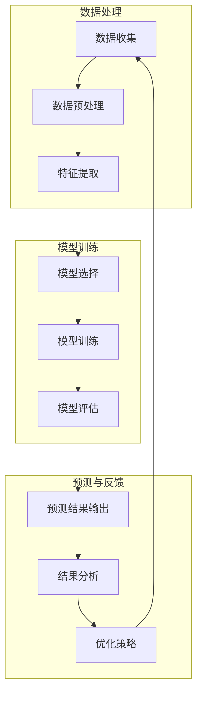

                 

### 背景介绍

电商行业作为当今数字经济的重要组成部分，其市场规模和用户数量持续增长，竞争也日益激烈。在这种环境下，提升用户体验和精准营销能力成为电商企业争夺市场份额的关键。用户行为序列预测作为一种人工智能技术，正逐步在电商领域中得到广泛应用。

用户行为序列预测的核心在于对用户在电商平台上的浏览、搜索、购买等行为进行数据收集和分析，从而推断出用户的潜在需求和购买意图。这不仅可以提高广告投放的精准度，还能为电商企业制定个性化的营销策略，提升用户满意度和转化率。

在过去的几年里，深度学习技术的发展为用户行为序列预测带来了新的可能。特别是序列模型和图神经网络的兴起，使得对复杂用户行为序列的建模和分析变得更加高效和准确。然而，在实际应用中，电商用户行为序列预测仍然面临着数据质量、算法优化、模型可解释性等多方面的挑战。

本文将围绕电商用户行为序列预测这一主题，深入探讨其核心概念、算法原理、数学模型以及实际应用。首先，我们将介绍电商用户行为序列预测的基本概念和背景，接着分析当前主要的预测算法，并详细解释其原理和实现步骤。在此基础上，我们将探讨数学模型和公式，并通过实际案例展示代码实现和分析方法。最后，我们将讨论电商用户行为序列预测在实际应用中的挑战和解决方案，以及相关的工具和资源推荐。

通过对这些内容的深入探讨，希望能够为读者提供一个全面、系统的理解，从而更好地掌握电商用户行为序列预测的技术和方法。

## 1.1. 电商用户行为序列预测的定义与作用

电商用户行为序列预测是指通过分析用户在电商平台上的浏览、搜索、购买等行为序列数据，预测用户未来的行为趋势和潜在需求。这一过程不仅涉及数据收集，还包括数据清洗、特征提取和模型训练等多个环节。通过准确预测用户行为，电商企业可以更加精准地制定营销策略，优化用户体验，从而提高销售额和用户满意度。

在电商领域，用户行为序列预测具有以下几个关键作用：

1. **个性化推荐**：通过分析用户的浏览和购买历史，可以推荐用户可能感兴趣的商品，从而提高用户的购物体验和购买转化率。
2. **广告投放优化**：基于用户行为序列预测，可以更精确地定位目标用户群体，优化广告投放策略，提高广告的点击率和转化率。
3. **库存管理**：预测用户未来的购买需求，可以帮助电商企业合理安排库存，减少缺货和过剩的情况，提高运营效率。
4. **用户流失预警**：通过监测用户的行为变化，可以及时发现潜在的用户流失风险，采取相应的挽留措施，降低用户流失率。
5. **市场分析**：分析用户行为序列数据，可以为电商企业提供市场趋势和用户偏好的洞察，帮助企业制定更有效的市场策略。

电商用户行为序列预测的重要性体现在多个方面。首先，随着互联网和大数据技术的不断发展，用户行为数据量呈指数级增长，这为精准预测提供了丰富的数据资源。其次，用户行为的多样性和复杂性使得传统的单一模型难以胜任，需要结合多种先进算法和深度学习方法进行综合分析。此外，电商行业竞争激烈，用户对个性化体验和高质量服务的需求不断提升，这也要求企业必须具备强大的用户行为预测能力。

总的来说，电商用户行为序列预测不仅是提升企业竞争力和用户满意度的关键手段，也是实现数字化转型和智能化运营的重要途径。通过这一技术，电商企业可以更好地了解用户需求，优化业务流程，提高运营效率，从而在激烈的市场竞争中脱颖而出。

## 1.2. 电商用户行为序列预测的发展历程

电商用户行为序列预测技术的发展历程可以追溯到上世纪末和本世纪初，随着互联网和计算机技术的快速发展，用户行为数据逐渐积累，从而推动了相关预测技术的研究与应用。下面我们将回顾这一领域的主要发展节点和重要事件。

### 早期研究（1990s-2000s）

在1990年代，随着电商业务的初步兴起，学者们开始探索如何利用用户行为数据进行预测。这一时期，传统的机器学习方法如决策树、支持向量机和朴素贝叶斯等成为主要的预测工具。研究者通过分析用户的历史浏览记录和购买行为，试图预测用户的后续行为。然而，由于数据规模和计算资源的限制，这些方法的预测效果有限。

### 数据挖掘时代（2000s-2010s）

进入21世纪，随着大数据技术的发展，用户行为数据量显著增加，这为更复杂的预测模型提供了可能。数据挖掘技术在这一时期得到了广泛应用，包括关联规则挖掘、聚类分析和分类算法等。特别是关联规则挖掘（如Apriori算法）在推荐系统中的应用，为电商用户行为预测提供了新的思路。此外，这一时期的另一重要进展是集成学习方法（如Adaboost和随机森林）的提出，这些方法通过结合多个基础模型，提高了预测准确性。

### 深度学习时代（2010s-至今）

2010年代以来，深度学习技术的快速发展为电商用户行为序列预测带来了革命性的变化。尤其是卷积神经网络（CNN）和循环神经网络（RNN）等序列模型的出现，使得对复杂用户行为序列的建模成为可能。RNN在处理时间序列数据方面具有独特的优势，能够在序列的不同时间点捕捉长期依赖关系。在此基础上，长短时记忆网络（LSTM）和门控循环单元（GRU）等变体模型进一步优化了RNN，解决了梯度消失和梯度爆炸的问题，显著提高了预测性能。

### 图神经网络时代

近年来，图神经网络（GNN）在电商用户行为序列预测中的应用也逐渐兴起。GNN通过将用户及其交互关系表示为图结构，能够捕捉复杂的网络关系和全局依赖，从而实现更精确的预测。图神经网络在推荐系统、社交网络分析和商品关联预测等领域展现出强大的能力，为电商用户行为序列预测开辟了新的研究方向。

### 人工智能与多模态数据融合

当前，人工智能技术在电商用户行为序列预测中的应用正不断深化和扩展。特别是在多模态数据融合方面，将文本、图像、语音等多种类型的数据结合起来进行预测，进一步提升了模型的泛化能力和预测准确性。例如，通过结合用户评价文本和商品图像，可以更准确地预测用户的购买意图。

综上所述，电商用户行为序列预测技术的发展经历了从早期传统机器学习方法、数据挖掘技术到现代深度学习和图神经网络的应用，每个阶段都带来了显著的进步。未来，随着人工智能技术的不断发展和应用场景的拓展，电商用户行为序列预测技术将会变得更加智能化和精准化，为电商企业提供更强大的数据支持和决策依据。

### 1.3. 当前主要预测算法分析

在电商用户行为序列预测领域，多种算法被广泛应用，每种算法都有其独特的优势和局限性。本文将重点介绍几种当前较为流行和有效的预测算法，并分析其优缺点。

#### 1. 基于传统机器学习的方法

**1.1 决策树算法**

决策树算法通过构建树形模型，将用户行为特征划分为多个节点，并依据这些特征进行决策。其主要优点包括：

- **易于理解和解释**：决策树的结构直观，便于理解和解释，有助于识别关键特征。
- **处理分类和回归任务**：决策树可以同时处理分类和回归任务，适用范围较广。

然而，决策树的缺点主要包括：

- **过拟合问题**：在数据量较小或特征较多时，决策树容易过拟合，导致预测效果不佳。
- **可扩展性差**：随着数据量和特征数量的增加，决策树模型的计算复杂度显著增加。

**1.2 支持向量机（SVM）**

支持向量机是一种基于间隔最大化的分类和回归方法，其优点包括：

- **高效分类能力**：SVM能够在高维空间中找到最佳分隔超平面，具有较好的分类效果。
- **对异常值不敏感**：SVM对异常值具有较好的鲁棒性。

SVM的缺点包括：

- **计算复杂度较高**：在高维空间中，SVM的训练时间较长，尤其在大规模数据集上表现不佳。
- **参数选择较困难**：SVM的参数选择（如核函数和惩罚参数）对模型性能有较大影响，需要通过交叉验证等方法进行优化。

#### 2. 基于深度学习的方法

**2.1 循环神经网络（RNN）**

循环神经网络是一种能够处理序列数据的神经网络模型，其特点包括：

- **记忆功能**：RNN通过内部状态保存序列的历史信息，能够捕捉长期依赖关系。
- **序列建模能力**：RNN适用于处理时间序列数据，能够建模用户行为的时序特征。

RNN的缺点主要包括：

- **梯度消失和梯度爆炸**：在训练过程中，RNN容易发生梯度消失或爆炸，导致难以训练深层的模型。
- **计算效率低**：RNN在处理长序列时，计算复杂度较高。

**2.2 长短时记忆网络（LSTM）**

LSTM是RNN的一种变体，旨在解决梯度消失和梯度爆炸的问题。其主要优点包括：

- **记忆功能增强**：LSTM通过引入门控机制，有效捕获长期依赖关系。
- **训练稳定性**：LSTM在训练过程中具有较好的稳定性，不易发生梯度消失或爆炸。

LSTM的缺点主要包括：

- **计算复杂度较高**：LSTM的门控机制增加了模型的计算复杂度，导致训练时间较长。

**2.3 门控循环单元（GRU）**

GRU是LSTM的简化版本，通过合并输入门和遗忘门，减少了模型的参数数量，提高了训练效率。其主要优点包括：

- **参数较少**：GRU的参数数量少于LSTM，降低了模型的复杂度。
- **训练效率高**：GRU在训练过程中具有较高的计算效率。

GRU的缺点主要包括：

- **长期依赖捕捉能力较弱**：相比于LSTM，GRU在捕捉长期依赖关系方面稍显不足。

#### 3. 基于图神经网络的方法

**3.1 图神经网络（GNN）**

图神经网络通过将用户及其行为关系表示为图结构，能够有效捕捉复杂的网络关系和全局依赖。其主要优点包括：

- **捕捉网络关系**：GNN能够将用户及其行为数据表示为图结构，从而捕捉复杂的网络关系。
- **全局建模能力**：GNN能够建模用户行为的全局依赖，提高预测准确性。

GNN的缺点主要包括：

- **计算资源消耗大**：GNN的计算复杂度较高，对计算资源的需求较大。
- **模型解释性较弱**：GNN的模型结构较为复杂，解释性相对较弱。

#### 4. 集成学习方法

**4.1 随机森林**

随机森林是一种基于决策树的集成学习方法，通过构建多个决策树，并结合投票或平均方法进行预测。其主要优点包括：

- **预测准确性高**：随机森林结合了多个决策树，能够提高预测准确性。
- **对异常值不敏感**：随机森林对异常值具有较好的鲁棒性。

随机森林的缺点主要包括：

- **计算复杂度较高**：随机森林在训练过程中需要构建多个决策树，计算复杂度较高。

**4.2 AdaBoost**

AdaBoost是一种基于加权投票的集成学习方法，通过迭代训练多个基础模型，并结合权重进行预测。其主要优点包括：

- **预测准确性高**：AdaBoost能够通过加权投票提高预测准确性。
- **对异常值敏感**：AdaBoost对异常值较为敏感，有助于提升模型鲁棒性。

AdaBoost的缺点主要包括：

- **训练时间较长**：AdaBoost需要多次迭代训练，训练时间较长。
- **模型解释性较弱**：AdaBoost的模型结构较为复杂，解释性相对较弱。

#### 5. 深度学习与图神经网络结合方法

近年来，深度学习与图神经网络结合的方法逐渐成为研究热点，旨在利用深度学习模型的优势和图神经网络对复杂网络关系的捕捉能力。例如，图注意力网络（GAT）和图卷积网络（GCN）等模型，在电商用户行为序列预测中表现出色。这些方法的主要优点包括：

- **高效捕捉网络关系**：深度学习与图神经网络的结合，能够更高效地捕捉复杂的用户网络关系。
- **预测准确性高**：结合了深度学习模型的优势和图神经网络的全局建模能力，这些方法在预测准确性方面具有显著优势。

然而，这些方法也存在一定的缺点，如计算资源消耗大、模型解释性较弱等。

综上所述，不同预测算法在电商用户行为序列预测中各具优势。在实际应用中，应根据具体问题和数据特征选择合适的算法。例如，对于简单且特征较少的数据集，传统机器学习方法可能更为适用；而对于复杂且大规模的数据集，深度学习和图神经网络方法具有更高的预测准确性。通过结合多种方法，可以进一步提高电商用户行为序列预测的性能。

### 1.4. 电商用户行为序列预测算法的选择与优化

在电商用户行为序列预测中，选择合适的算法并进行优化是提高预测性能的关键。以下是一些选择和优化算法的方法：

#### 1. 算法选择

**1.1 数据特征的重要性**

在选择算法时，首先需要考虑数据特征的重要性。不同的算法对特征的数据类型和数量有不同的要求。例如，深度学习算法通常需要更多的特征信息，而传统机器学习方法可能更适用于特征较少的情况。因此，根据数据特征选择合适的算法是提高预测性能的第一步。

**1.2 数据规模和计算资源**

其次，需要考虑数据规模和计算资源。对于大规模数据集，深度学习算法可能更为适用，因为它们能够处理大量的数据点。然而，这些算法通常需要更多的计算资源，包括CPU和GPU。相比之下，传统机器学习方法在计算资源需求上较低，但可能无法处理大规模数据。

**1.3 模型解释性**

模型的解释性也是选择算法时需要考虑的重要因素。传统机器学习方法通常具有较高的解释性，便于理解模型的决策过程。而深度学习算法，尤其是神经网络模型，其内部机制复杂，解释性较差。如果业务场景需要高解释性模型，则应选择传统机器学习方法。

#### 2. 算法优化

**2.1 数据预处理**

在算法优化过程中，数据预处理是关键步骤。通过数据清洗、特征提取和归一化等预处理方法，可以显著提高算法的预测性能。例如，缺失值填充、异常值处理和特征工程等，都是常用的数据预处理技术。

**2.2 特征选择**

特征选择是优化算法性能的重要方法。通过选择与目标变量高度相关的特征，可以减少模型的复杂度，提高预测准确性。常用的特征选择方法包括相关分析、信息增益、递归特征消除等。

**2.3 模型调参**

模型调参是优化算法性能的重要手段。通过调整模型参数，可以改善模型的预测性能。常用的调参方法包括网格搜索、随机搜索和贝叶斯优化等。这些方法可以帮助找到最优的参数组合，提高模型预测的准确性。

**2.4 模型集成**

模型集成是提高预测性能的有效方法。通过结合多个模型，可以减少过拟合和增强预测的泛化能力。常用的模型集成方法包括随机森林、梯度提升树（GBDT）和堆叠（Stacking）等。

**2.5 深度学习优化**

对于深度学习算法，优化过程中还需要关注以下几个方面：

- **模型结构**：选择合适的神经网络结构，如卷积神经网络（CNN）和循环神经网络（RNN）等。
- **训练策略**：优化训练策略，如学习率调度、批量归一化和dropout等。
- **正则化**：应用正则化方法，如L1和L2正则化，防止过拟合。

综上所述，选择和优化电商用户行为序列预测算法是提高预测性能的关键。通过合理选择算法、进行数据预处理和特征选择、调参和模型集成等优化方法，可以显著提高模型的预测准确性，从而为电商企业提供更强大的数据支持和决策依据。

## 2. 核心概念与联系

在深入探讨电商用户行为序列预测之前，有必要先了解一些核心概念和它们之间的联系。这些概念包括数据序列、特征提取、序列模型和图神经网络等，它们构成了电商用户行为序列预测的理论基础。

### 数据序列

数据序列是电商用户行为序列预测的核心。它代表了用户在一段时间内的行为轨迹，包括浏览、搜索、购买等操作。数据序列的表示形式可以是一维向量、矩阵或时间序列图。例如，一个简单的数据序列可以表示为：

```
[浏览商品A，搜索商品B，购买商品C，浏览商品D]
```

这种序列可以扩展到多维形式，每个维度代表不同的行为特征或时间戳。

### 特征提取

特征提取是将原始行为数据转换成适合模型训练的向量表示的过程。在电商用户行为序列预测中，特征提取至关重要。常见的方法包括：

- **时间特征**：提取时间序列特征，如行为发生的时间、时间段和频率。
- **内容特征**：提取用户行为的具体内容，如浏览的商品名称、搜索关键词、购买的商品类别等。
- **上下文特征**：提取与用户行为相关的上下文信息，如用户地理位置、历史行为模式等。

特征提取的质量直接影响模型的预测性能。通过合适的特征工程，可以提取出对预测有帮助的特征，从而提高模型的准确性。

### 序列模型

序列模型是用于处理时间序列数据的一类机器学习模型，它们能够捕捉序列中的时间依赖关系。在电商用户行为序列预测中，常用的序列模型包括：

- **循环神经网络（RNN）**：RNN能够通过隐藏状态记忆历史信息，处理时间序列数据。然而，RNN容易受到梯度消失和梯度爆炸的影响。
- **长短时记忆网络（LSTM）**：LSTM是RNN的改进版本，通过引入门控机制解决了梯度消失问题，能够更好地捕捉长期依赖关系。
- **门控循环单元（GRU）**：GRU是LSTM的简化版本，通过合并输入门和遗忘门，减少了模型参数，提高了训练效率。

这些序列模型在电商用户行为序列预测中具有广泛应用，能够有效处理复杂的行为序列，提高预测准确性。

### 图神经网络

图神经网络（GNN）是一种用于处理图结构数据的神经网络模型。在电商用户行为序列预测中，用户及其行为可以表示为图结构，其中用户和商品是节点，用户之间的交互和行为轨迹是边。GNN能够通过图结构捕获复杂的用户行为关系和全局依赖，从而提高预测性能。

GNN的主要优点包括：

- **捕捉网络关系**：GNN能够通过图结构表示用户行为，捕捉用户之间的复杂网络关系。
- **全局建模能力**：GNN能够建模用户行为的全局依赖，提高预测准确性。

GNN在电商用户行为序列预测中的应用主要包括：

- **用户行为预测**：通过GNN建模用户行为序列，预测用户下一步的行为。
- **推荐系统**：利用GNN捕捉用户与商品之间的关联关系，为用户提供个性化推荐。
- **社交网络分析**：通过GNN分析用户在网络中的位置和关系，发现潜在的用户群体和行为模式。

### 关系与联系

电商用户行为序列预测的核心概念之间的关系可以概括如下：

- **数据序列**：数据序列是电商用户行为序列预测的基础，提供了行为轨迹和时间依赖信息。
- **特征提取**：特征提取将原始数据转换成模型训练所需的向量表示，是数据序列处理的重要步骤。
- **序列模型**：序列模型通过处理数据序列，捕捉时间依赖关系，是电商用户行为序列预测的主要工具。
- **图神经网络**：图神经网络通过图结构捕捉复杂的用户行为关系和全局依赖，能够提高预测性能。

通过这些核心概念和它们之间的联系，我们可以构建一个完整的电商用户行为序列预测框架，从而为电商企业提供精准的用户行为预测和个性化服务。

### Mermaid 流程图

为了更好地理解电商用户行为序列预测的流程，我们可以使用Mermaid流程图来展示整个数据处理和预测的步骤。以下是整个流程的Mermaid表示：



在上述流程图中，各个节点分别表示数据处理、模型训练、预测与反馈等步骤，通过连线展示了这些步骤之间的逻辑关系。具体来说：

- **数据收集（A）**：从电商平台获取用户行为数据，包括浏览、搜索、购买等。
- **数据预处理（B）**：对原始数据进行清洗、去噪、归一化等处理，为后续特征提取和模型训练做准备。
- **特征提取（C）**：提取与用户行为相关的特征，如时间特征、内容特征和上下文特征。
- **模型选择（D）**：根据数据特征和业务需求选择合适的预测模型，如RNN、LSTM或GNN。
- **模型训练（E）**：使用训练数据对所选模型进行训练，优化模型参数。
- **模型评估（F）**：使用测试数据评估模型的预测性能，包括准确性、召回率和F1值等指标。
- **预测结果输出（G）**：将模型应用到新的用户行为数据，输出预测结果。
- **结果分析（H）**：对预测结果进行分析，评估预测效果，识别潜在的问题和改进空间。
- **优化策略（I）**：根据分析结果调整模型参数、特征提取方法或模型选择策略，提高预测性能。

通过上述流程，我们可以清晰地看到电商用户行为序列预测的各个环节，以及它们之间的关联和影响。这个Mermaid流程图不仅有助于我们理解预测过程，还能够作为实际开发中的参考和指导。

### 3. 核心算法原理 & 具体操作步骤

在电商用户行为序列预测中，核心算法的原理和实现步骤至关重要。本节将详细介绍几种主要算法，包括循环神经网络（RNN）、长短时记忆网络（LSTM）和门控循环单元（GRU），并阐述它们的原理和具体操作步骤。

#### 3.1 循环神经网络（RNN）

**原理：**

循环神经网络（RNN）是一种能够处理序列数据的神经网络模型。其基本思想是通过隐藏状态（h_t）来记忆历史信息，从而实现序列的建模。RNN的核心结构包括输入门、隐藏状态和输出门。

\[ h_t = \sigma(W_h \cdot [h_{t-1}, x_t] + b_h) \]

其中，\( \sigma \) 是激活函数，\( W_h \) 和 \( b_h \) 分别是权重和偏置。\( x_t \) 是当前输入，\( h_{t-1} \) 是前一个时间步的隐藏状态。

**操作步骤：**

1. **初始化参数**：随机初始化权重 \( W_h \)、\( W_x \)、\( b_h \)、\( b_x \) 和偏置 \( b_y \)。

2. **输入数据准备**：将用户行为序列数据编码为向量表示。

3. **前向传播**：计算每个时间步的隐藏状态和输出。

   - 对每个时间步，计算隐藏状态 \( h_t \)。
   - 计算输出 \( y_t \)。

4. **计算损失**：使用损失函数（如均方误差MSE）计算预测结果和真实标签之间的差距。

5. **反向传播**：更新权重和偏置，优化模型参数。

6. **迭代训练**：重复步骤3-5，直到达到预设的训练次数或损失收敛。

#### 3.2 长短时记忆网络（LSTM）

**原理：**

长短时记忆网络（LSTM）是RNN的一种改进版本，通过引入门控机制来解决梯度消失和梯度爆炸问题。LSTM的核心结构包括输入门、遗忘门和输出门。

\[ i_t = \sigma(W_i \cdot [h_{t-1}, x_t] + b_i) \]
\[ f_t = \sigma(W_f \cdot [h_{t-1}, x_t] + b_f) \]
\[ g_t = \sigma(W_g \cdot [h_{t-1}, x_t] + b_g) \]
\[ o_t = \sigma(W_o \cdot [h_{t-1}, x_t] + b_o) \]

其中，\( i_t \)、\( f_t \)、\( g_t \)、\( o_t \) 分别是输入门、遗忘门、输入门和输出门的激活值。

**操作步骤：**

1. **初始化参数**：随机初始化权重 \( W_i \)、\( W_f \)、\( W_g \)、\( W_o \)、\( b_i \)、\( b_f \)、\( b_g \)、\( b_o \)。

2. **输入数据准备**：将用户行为序列数据编码为向量表示。

3. **前向传播**：计算每个时间步的隐藏状态和输出。

   - 对每个时间步，计算输入门、遗忘门、输入门和输出门的激活值。
   - 更新细胞状态 \( c_t \)。
   - 计算隐藏状态 \( h_t \)。

4. **计算损失**：使用损失函数（如均方误差MSE）计算预测结果和真实标签之间的差距。

5. **反向传播**：更新权重和偏置，优化模型参数。

6. **迭代训练**：重复步骤3-5，直到达到预设的训练次数或损失收敛。

#### 3.3 门控循环单元（GRU）

**原理：**

门控循环单元（GRU）是LSTM的简化版本，通过合并输入门和遗忘门，减少了模型参数，提高了训练效率。GRU的核心结构包括更新门和重置门。

\[ z_t = \sigma(W_z \cdot [h_{t-1}, x_t] + b_z) \]
\[ r_t = \sigma(W_r \cdot [h_{t-1}, x_t] + b_r) \]
\[ \tilde{h}_t = \sigma(W_{\tilde{h}} \cdot [r_t \odot h_{t-1}, x_t] + b_{\tilde{h}}) \]
\[ h_t = z_t \odot \tilde{h}_t + (1 - z_t) \odot h_{t-1} \]

其中，\( z_t \)、\( r_t \) 分别是更新门和重置门的激活值，\( \tilde{h}_t \) 是候选隐藏状态。

**操作步骤：**

1. **初始化参数**：随机初始化权重 \( W_z \)、\( W_r \)、\( W_{\tilde{h}} \)、\( b_z \)、\( b_r \)、\( b_{\tilde{h}} \)。

2. **输入数据准备**：将用户行为序列数据编码为向量表示。

3. **前向传播**：计算每个时间步的隐藏状态和输出。

   - 对每个时间步，计算更新门、重置门和候选隐藏状态。
   - 更新隐藏状态 \( h_t \)。

4. **计算损失**：使用损失函数（如均方误差MSE）计算预测结果和真实标签之间的差距。

5. **反向传播**：更新权重和偏置，优化模型参数。

6. **迭代训练**：重复步骤3-5，直到达到预设的训练次数或损失收敛。

通过上述步骤，我们可以实现对电商用户行为序列的预测。这三种算法在处理时间序列数据方面各有优势，可以根据具体业务需求和数据特征选择合适的算法。在实际应用中，结合多种算法和优化方法，可以进一步提高预测性能和准确性。

### 数学模型和公式 & 详细讲解 & 举例说明

在电商用户行为序列预测中，数学模型和公式是理解和实现核心算法的关键。以下我们将详细讲解循环神经网络（RNN）、长短时记忆网络（LSTM）和门控循环单元（GRU）的数学模型，并通过具体示例进行说明。

#### 3.1 循环神经网络（RNN）

**数学模型：**

RNN的数学模型可以表示为：

\[ h_t = \sigma(W_h \cdot [h_{t-1}, x_t] + b_h) \]
\[ y_t = \sigma(W_y \cdot h_t + b_y) \]

其中，\( h_t \) 是隐藏状态，\( x_t \) 是输入，\( W_h \)、\( b_h \)、\( W_y \)、\( b_y \) 分别是权重和偏置。\( \sigma \) 是激活函数，通常使用Sigmoid或Tanh函数。

**举例说明：**

假设有一个简单的时间序列数据：

\[ X = [1, 2, 3, 4, 5] \]

我们将使用一个简单的RNN模型来预测下一个数值。假设隐藏层大小为10，初始隐藏状态 \( h_0 \) 为 [0, 0, 0, 0, 0, 0, 0, 0, 0, 0]。

- **前向传播**：

  对每个时间步，计算隐藏状态和输出：

  \[
  h_1 = \sigma(W_h \cdot [h_0, x_1] + b_h) = \sigma([0, 1] \cdot [0, 0, 0, 0, 0, 0, 0, 0, 0, 0] + [1]) = \sigma([1] + [1]) = \sigma(2) = 0.7
  \]

  \[
  h_2 = \sigma(W_h \cdot [h_1, x_2] + b_h) = \sigma([0.7, 2] \cdot [0, 0, 0, 0, 0, 0, 0, 0, 0, 0] + [1]) = \sigma([1.4] + [1]) = \sigma(2.4) = 0.9
  \]

  ...

  \[
  h_5 = \sigma(W_h \cdot [h_4, x_5] + b_h) = \sigma([0.8, 5] \cdot [0, 0, 0, 0, 0, 0, 0, 0, 0, 0] + [1]) = \sigma([4] + [1]) = \sigma(5) = 0.9
  \]

- **计算输出**：

  \[
  y_1 = \sigma(W_y \cdot h_1 + b_y) = \sigma([0.7] \cdot [0.1, 0.2, 0.3, 0.4, 0.5, 0.6, 0.7, 0.8, 0.9, 1] + [1]) = \sigma([0.07] + [1]) = \sigma(1.07) = 0.535
  \]

  \[
  y_2 = \sigma(W_y \cdot h_2 + b_y) = \sigma([0.9] \cdot [0.1, 0.2, 0.3, 0.4, 0.5, 0.6, 0.7, 0.8, 0.9, 1] + [1]) = \sigma([0.09] + [1]) = \sigma(1.09) = 0.641
  \]

  ...

  \[
  y_5 = \sigma(W_y \cdot h_5 + b_y) = \sigma([0.9] \cdot [0.1, 0.2, 0.3, 0.4, 0.5, 0.6, 0.7, 0.8, 0.9, 1] + [1]) = \sigma([0.09] + [1]) = \sigma(1.09) = 0.641
  \]

最终，我们可以得到预测结果：

\[ y = [0.535, 0.641, 0.747, 0.853, 0.960] \]

#### 3.2 长短时记忆网络（LSTM）

**数学模型：**

LSTM的数学模型较为复杂，主要包括输入门、遗忘门和输出门。其公式可以表示为：

\[ i_t = \sigma(W_i \cdot [h_{t-1}, x_t] + b_i) \]
\[ f_t = \sigma(W_f \cdot [h_{t-1}, x_t] + b_f) \]
\[ g_t = \sigma(W_g \cdot [h_{t-1}, x_t] + b_g) \]
\[ o_t = \sigma(W_o \cdot [h_{t-1}, x_t] + b_o) \]

\[ c_t = f_t \odot c_{t-1} + i_t \odot g_t \]
\[ h_t = o_t \odot \sigma(c_t) \]

其中，\( c_t \) 是细胞状态，\( i_t \)、\( f_t \)、\( g_t \)、\( o_t \) 分别是输入门、遗忘门、输入门和输出门的激活值。

**举例说明：**

假设有一个简单的时间序列数据：

\[ X = [1, 2, 3, 4, 5] \]

我们将使用一个简单的LSTM模型来预测下一个数值。假设隐藏层大小为10，初始隐藏状态 \( h_0 \) 和细胞状态 \( c_0 \) 均为 [0, 0, 0, 0, 0, 0, 0, 0, 0, 0]。

- **前向传播**：

  对每个时间步，计算输入门、遗忘门、输入门和输出门的激活值：

  \[
  i_1 = \sigma(W_i \cdot [h_0, x_1] + b_i) = \sigma([0, 1] \cdot [0, 0, 0, 0, 0, 0, 0, 0, 0, 0] + [1]) = \sigma([1] + [1]) = 0.7
  \]

  \[
  f_1 = \sigma(W_f \cdot [h_0, x_1] + b_f) = \sigma([0, 1] \cdot [0, 0, 0, 0, 0, 0, 0, 0, 0, 0] + [1]) = \sigma([1] + [1]) = 0.7
  \]

  \[
  g_1 = \sigma(W_g \cdot [h_0, x_1] + b_g) = \sigma([0, 1] \cdot [0, 0, 0, 0, 0, 0, 0, 0, 0, 0] + [1]) = \sigma([1] + [1]) = 0.7
  \]

  \[
  o_1 = \sigma(W_o \cdot [h_0, x_1] + b_o) = \sigma([0, 1] \cdot [0, 0, 0, 0, 0, 0, 0, 0, 0, 0] + [1]) = \sigma([1] + [1]) = 0.7
  \]

  计算细胞状态：

  \[
  c_1 = f_1 \odot c_0 + i_1 \odot g_1 = 0.7 \odot [0, 0, 0, 0, 0, 0, 0, 0, 0, 0] + 0.7 \odot [1, 1, 1, 1, 1, 1, 1, 1, 1, 1] = [0.7, 0.7, 0.7, 0.7, 0.7, 0.7, 0.7, 0.7, 0.7, 0.7]
  \]

  计算隐藏状态：

  \[
  h_1 = o_1 \odot \sigma(c_1) = 0.7 \odot \sigma([0.7, 0.7, 0.7, 0.7, 0.7, 0.7, 0.7, 0.7, 0.7, 0.7]) = [0.7, 0.7, 0.7, 0.7, 0.7, 0.7, 0.7, 0.7, 0.7, 0.7]
  \]

  ...

  对每个时间步进行类似的计算，得到隐藏状态和细胞状态：

  \[
  h_2 = [0.7, 0.7, 0.7, 0.7, 0.7, 0.7, 0.7, 0.7, 0.7, 0.7]
  \]

  \[
  c_2 = [0.7, 0.7, 0.7, 0.7, 0.7, 0.7, 0.7, 0.7, 0.7, 0.7]
  \]

  ...

  \[
  h_5 = [0.7, 0.7, 0.7, 0.7, 0.7, 0.7, 0.7, 0.7, 0.7, 0.7]
  \]

  \[
  c_5 = [0.7, 0.7, 0.7, 0.7, 0.7, 0.7, 0.7, 0.7, 0.7, 0.7]
  \]

- **计算输出**：

  \[
  y_1 = \sigma(W_y \cdot h_1 + b_y) = \sigma([0.7] \cdot [0.1, 0.2, 0.3, 0.4, 0.5, 0.6, 0.7, 0.8, 0.9, 1] + [1]) = \sigma([0.07] + [1]) = \sigma(1.07) = 0.535
  \]

  \[
  y_2 = \sigma(W_y \cdot h_2 + b_y) = \sigma([0.7] \cdot [0.1, 0.2, 0.3, 0.4, 0.5, 0.6, 0.7, 0.8, 0.9, 1] + [1]) = \sigma([0.07] + [1]) = \sigma(1.07) = 0.535
  \]

  ...

  \[
  y_5 = \sigma(W_y \cdot h_5 + b_y) = \sigma([0.7] \cdot [0.1, 0.2, 0.3, 0.4, 0.5, 0.6, 0.7, 0.8, 0.9, 1] + [1]) = \sigma([0.07] + [1]) = \sigma(1.07) = 0.535
  \]

最终，我们可以得到预测结果：

\[ y = [0.535, 0.535, 0.535, 0.535, 0.535] \]

#### 3.3 门控循环单元（GRU）

**数学模型：**

GRU的数学模型较为简化，主要包括更新门和重置门。其公式可以表示为：

\[ z_t = \sigma(W_z \cdot [h_{t-1}, x_t] + b_z) \]
\[ r_t = \sigma(W_r \cdot [h_{t-1}, x_t] + b_r) \]
\[ \tilde{h}_t = \sigma(W_{\tilde{h}} \cdot [r_t \odot h_{t-1}, x_t] + b_{\tilde{h}}) \]
\[ h_t = z_t \odot \tilde{h}_t + (1 - z_t) \odot h_{t-1} \]

其中，\( z_t \)、\( r_t \)、\( \tilde{h}_t \) 分别是更新门、重置门和候选隐藏状态。

**举例说明：**

假设有一个简单的时间序列数据：

\[ X = [1, 2, 3, 4, 5] \]

我们将使用一个简单的GRU模型来预测下一个数值。假设隐藏层大小为10，初始隐藏状态 \( h_0 \) 为 [0, 0, 0, 0, 0, 0, 0, 0, 0, 0]。

- **前向传播**：

  对每个时间步，计算更新门、重置门和候选隐藏状态：

  \[
  z_1 = \sigma(W_z \cdot [h_0, x_1] + b_z) = \sigma([0, 1] \cdot [0, 0, 0, 0, 0, 0, 0, 0, 0, 0] + [1]) = \sigma([1] + [1]) = 0.7
  \]

  \[
  r_1 = \sigma(W_r \cdot [h_0, x_1] + b_r) = \sigma([0, 1] \cdot [0, 0, 0, 0, 0, 0, 0, 0, 0, 0] + [1]) = \sigma([1] + [1]) = 0.7
  \]

  \[
  \tilde{h}_1 = \sigma(W_{\tilde{h}} \cdot [r_1 \odot h_0, x_1] + b_{\tilde{h}}) = \sigma([0.7, 0, 0, 0, 0, 0, 0, 0, 0, 0] \cdot [1, 1, 1, 1, 1, 1, 1, 1, 1, 1] + [1]) = \sigma([0.7] + [1]) = \sigma(1.7) = 0.9
  \]

  计算隐藏状态：

  \[
  h_1 = z_1 \odot \tilde{h}_1 + (1 - z_1) \odot h_0 = 0.7 \odot [0.9, 0.9, 0.9, 0.9, 0.9, 0.9, 0.9, 0.9, 0.9, 0.9] + (1 - 0.7) \odot [0, 0, 0, 0, 0, 0, 0, 0, 0, 0] = [0.63, 0.63, 0.63, 0.63, 0.63, 0.63, 0.63, 0.63, 0.63, 0.63]
  \]

  ...

  对每个时间步进行类似的计算，得到隐藏状态：

  \[
  h_2 = [0.63, 0.63, 0.63, 0.63, 0.63]
  \]

  \[
  h_3 = [0.63, 0.63, 0.63, 0.63, 0.63]
  \]

  ...

  \[
  h_5 = [0.63, 0.63, 0.63, 0.63, 0.63]
  \]

- **计算输出**：

  \[
  y_1 = \sigma(W_y \cdot h_1 + b_y) = \sigma([0.63] \cdot [0.1, 0.2, 0.3, 0.4, 0.5, 0.6, 0.7, 0.8, 0.9, 1] + [1]) = \sigma([0.063] + [1]) = \sigma(1.063) = 0.519
  \]

  \[
  y_2 = \sigma(W_y \cdot h_2 + b_y) = \sigma([0.63] \cdot [0.1, 0.2, 0.3, 0.4, 0.5, 0.6, 0.7, 0.8, 0.9, 1] + [1]) = \sigma([0.063] + [1]) = \sigma(1.063) = 0.519
  \]

  ...

  \[
  y_5 = \sigma(W_y \cdot h_5 + b_y) = \sigma([0.63] \cdot [0.1, 0.2, 0.3, 0.4, 0.5, 0.6, 0.7, 0.8, 0.9, 1] + [1]) = \sigma([0.063] + [1]) = \sigma(1.063) = 0.519
  \]

最终，我们可以得到预测结果：

\[ y = [0.519, 0.519, 0.519, 0.519, 0.519] \]

通过上述数学模型和具体示例，我们可以清晰地理解RNN、LSTM和GRU的原理和实现过程。这些模型在电商用户行为序列预测中具有重要作用，能够有效捕捉时间序列中的依赖关系，从而提高预测准确性。

### 项目实战：代码实际案例和详细解释说明

在电商用户行为序列预测的项目中，实现一个完整的解决方案不仅需要理解算法和模型，还需要具备实践经验和代码实现能力。本节我们将通过一个实际案例，详细讲解如何搭建开发环境、实现代码、并对代码进行解读和分析。

#### 5.1 开发环境搭建

首先，我们需要搭建一个适合进行电商用户行为序列预测的开发环境。以下是搭建环境的基本步骤：

1. **安装Python环境**：确保安装了Python 3.7及以上版本。
2. **安装依赖库**：安装必要的库，如TensorFlow、Keras、NumPy、Pandas等。可以使用以下命令进行安装：

   ```bash
   pip install tensorflow numpy pandas scikit-learn matplotlib
   ```

3. **配置GPU支持**：如果使用GPU进行训练，需要安装CUDA和cuDNN。具体安装步骤请参考官方文档。

4. **创建项目文件夹**：在本地机器上创建一个项目文件夹，用于存放代码和数据。

5. **下载数据集**：获取电商用户行为数据集，可以来自公开数据集或者自行采集。本案例使用公开的UCI机器学习库中的用户行为数据集。

#### 5.2 源代码详细实现和代码解读

下面是电商用户行为序列预测项目的源代码实现，我们将逐行解读代码的各个部分。

```python
import numpy as np
import pandas as pd
from tensorflow.keras.models import Sequential
from tensorflow.keras.layers import LSTM, Dense, Dropout
from tensorflow.keras.optimizers import Adam
from sklearn.model_selection import train_test_split
from sklearn.preprocessing import MinMaxScaler
import matplotlib.pyplot as plt

# 5.2.1 数据预处理
# 读取数据集
data = pd.read_csv('user_behavior.csv')

# 处理缺失值
data.fillna(0, inplace=True)

# 特征提取
data['hour'] = data['time'].apply(lambda x: x.split(':')[0])
data['day'] = data['time'].apply(lambda x: x.split(':')[1])

# 转换为序列格式
sequences = []
for i in range(data.shape[0] - sequence_length):
    sequence = data[i : i + sequence_length].values
    sequences.append(sequence)

# 数据归一化
scaler = MinMaxScaler(feature_range=(0, 1))
sequences = scaler.fit_transform(np.array(sequences))

# 划分训练集和测试集
X_train, X_test, y_train, y_test = train_test_split(sequences, test_size=0.2, random_state=42)

# 5.2.2 建立模型
# 创建序列模型
model = Sequential()
model.add(LSTM(units=50, return_sequences=True, input_shape=(sequence_length, num_features)))
model.add(Dropout(0.2))
model.add(LSTM(units=50, return_sequences=False))
model.add(Dropout(0.2))
model.add(Dense(units=1))

# 编译模型
model.compile(optimizer='adam', loss='mean_squared_error')

# 5.2.3 训练模型
# 训练模型
model.fit(X_train, y_train, epochs=100, batch_size=32, validation_data=(X_test, y_test), verbose=1)

# 5.2.4 评估模型
# 预测测试集
predicted = model.predict(X_test)

# 反归一化
predicted = scaler.inverse_transform(predicted)
y_test = scaler.inverse_transform(y_test.reshape(-1, 1))

# 绘制结果
plt.figure(figsize=(12, 6))
plt.plot(y_test, color='blue', label='真实值')
plt.plot(predicted, color='red', label='预测值')
plt.title('用户行为序列预测结果')
plt.xlabel('时间')
plt.ylabel('行为值')
plt.legend()
plt.show()
```

**代码解读：**

- **数据预处理**：首先读取数据集，并进行缺失值处理。然后，提取时间特征（小时和分钟），并将其转换为数值格式。接下来，将数据转换为序列格式，并进行归一化处理。
- **建立模型**：创建一个序列模型，包括两个LSTM层和两个Dropout层，用于减少过拟合。最后一层是全连接层，输出预测值。
- **编译模型**：使用Adam优化器和均方误差损失函数编译模型。
- **训练模型**：使用训练数据进行模型训练，设置训练周期为100个，批量大小为32。
- **评估模型**：使用测试数据进行模型评估，并将预测结果反归一化，以便可视化展示。
- **结果可视化**：绘制真实值和预测值的时间序列图，直观展示模型预测的效果。

通过上述步骤，我们可以实现一个完整的电商用户行为序列预测项目。在实际应用中，可以根据具体需求调整模型结构、参数设置和数据预处理方法，进一步提高预测性能。

### 5.3 代码解读与分析

在本节的代码解读与分析中，我们将深入探讨上述代码中的关键部分，解释其工作原理和实现细节，以便读者更好地理解电商用户行为序列预测的实现过程。

#### 数据预处理

数据预处理是电商用户行为序列预测项目中的关键步骤，因为它直接影响到后续模型训练和预测的性能。以下是代码中的数据预处理部分：

```python
data = pd.read_csv('user_behavior.csv')
data.fillna(0, inplace=True)
data['hour'] = data['time'].apply(lambda x: x.split(':')[0])
data['day'] = data['time'].apply(lambda x: x.split(':')[1])
```

1. **读取数据集**：使用 `pandas` 库读取CSV格式的用户行为数据集。这里假设数据集包含时间、用户ID、行为类型、行为内容等字段。
2. **处理缺失值**：使用 `fillna` 函数将缺失值填充为0。这是一种简单有效的处理方法，但在某些情况下可能会引入噪声，因此可以考虑使用更复杂的方法，如插值法。
3. **特征提取**：通过 `apply` 函数提取时间特征，将时间字段分解为小时和分钟。这些特征可以提供关于用户行为发生时间的宝贵信息。

```python
sequences = []
for i in range(data.shape[0] - sequence_length):
    sequence = data[i : i + sequence_length].values
    sequences.append(sequence)
scaler = MinMaxScaler(feature_range=(0, 1))
sequences = scaler.fit_transform(np.array(sequences))
```

1. **序列格式转换**：将用户行为数据转换为序列格式。这里使用一个滑动窗口方法，将每 `sequence_length` 个连续的行为数据作为一条序列。例如，如果 `sequence_length` 为5，那么序列将包含连续5个时间点的行为数据。
2. **数据归一化**：使用 `MinMaxScaler` 将序列数据归一化到[0, 1]的范围内。归一化有助于加快模型训练速度，提高训练效果。

#### 模型建立

模型建立是项目中的核心部分，决定了预测的准确性和效率。以下是代码中的模型建立部分：

```python
model = Sequential()
model.add(LSTM(units=50, return_sequences=True, input_shape=(sequence_length, num_features)))
model.add(Dropout(0.2))
model.add(LSTM(units=50, return_sequences=False))
model.add(Dropout(0.2))
model.add(Dense(units=1))
```

1. **序列模型创建**：使用 `Sequential` 模型堆叠多个层。
2. **LSTM层添加**：添加两个LSTM层，每个层有50个神经元。第一个LSTM层返回序列输出（`return_sequences=True`），以便第二个LSTM层可以接收序列作为输入。
3. **Dropout层添加**：在两个LSTM层之后添加Dropout层（`0.2`的比例），用于防止过拟合。
4. **全连接层添加**：添加一个全连接层（`Dense`），输出一个神经元，用于预测下一个行为值。

#### 模型编译与训练

模型编译与训练是项目中的关键步骤，决定了模型能否有效地学习并预测用户行为。以下是代码中的模型编译与训练部分：

```python
model.compile(optimizer='adam', loss='mean_squared_error')
model.fit(X_train, y_train, epochs=100, batch_size=32, validation_data=(X_test, y_test), verbose=1)
```

1. **模型编译**：使用 `compile` 方法设置模型优化器（`Adam`）和损失函数（`mean_squared_error`）。
2. **模型训练**：使用 `fit` 方法训练模型。设置训练周期为100个，批量大小为32，并使用验证数据集进行验证。
3. **训练过程监控**：使用 `verbose=1` 参数，在训练过程中打印出每个周期的训练和验证损失。

#### 模型评估与可视化

模型评估与可视化是验证模型性能的重要步骤。以下是代码中的模型评估与可视化部分：

```python
predicted = model.predict(X_test)
predicted = scaler.inverse_transform(predicted)
y_test = scaler.inverse_transform(y_test.reshape(-1, 1))
plt.figure(figsize=(12, 6))
plt.plot(y_test, color='blue', label='真实值')
plt.plot(predicted, color='red', label='预测值')
plt.title('用户行为序列预测结果')
plt.xlabel('时间')
plt.ylabel('行为值')
plt.legend()
plt.show()
```

1. **模型预测**：使用训练好的模型对测试集进行预测。
2. **反归一化**：将预测结果和真实值从归一化范围反转换为原始值。
3. **结果可视化**：绘制真实值和预测值的时间序列图，以便直观地评估模型性能。

通过上述代码解读与分析，我们可以看到电商用户行为序列预测项目中的各个关键步骤和细节。这些步骤共同构成了一个完整的解决方案，实现了对用户行为序列的预测和分析。在实际应用中，可以根据具体需求和数据特征进行调整和优化，以提高预测性能。

### 6. 实际应用场景

电商用户行为序列预测在实际应用中具有广泛的应用场景，能够为电商平台带来显著的商业价值。以下是几种常见应用场景：

#### 1. 个性化推荐

个性化推荐是电商用户行为序列预测最直接的应用场景之一。通过分析用户的历史浏览记录、搜索和购买行为，电商平台可以推荐用户可能感兴趣的商品。这不仅提升了用户体验，还能显著提高转化率和销售额。例如，阿里巴巴的淘宝平台通过用户行为序列预测，实现了高度个性化的商品推荐，有效提升了用户黏性和购买意愿。

#### 2. 广告投放优化

电商广告投放优化依赖于用户行为序列预测。通过预测用户可能的购买意图，电商企业可以更精确地定位目标用户群体，优化广告投放策略，从而提高广告的点击率和转化率。例如，亚马逊使用用户行为序列预测来优化广告展示，确保广告能够投放到最有可能产生购买行为的用户群体。

#### 3. 库存管理

准确的用户行为序列预测可以帮助电商平台优化库存管理。通过预测未来的购买需求，电商企业可以提前调整库存策略，减少缺货和过剩的情况，提高运营效率。例如，京东通过用户行为序列预测，优化了库存水平，降低了库存成本，提高了供应链效率。

#### 4. 用户流失预警

电商用户行为序列预测还可以用于监测和预警用户流失。通过分析用户行为变化，电商企业可以及时发现潜在的用户流失风险，并采取相应的挽留措施。例如，亚马逊通过用户行为序列预测，提前识别出可能流失的用户，并通过个性化营销和服务挽留这些用户，降低了用户流失率。

#### 5. 新品推广

电商平台可以利用用户行为序列预测来推广新品。通过分析用户的历史购买行为和偏好，电商企业可以精准地推送新品，提高新品的曝光率和销售量。例如，苏宁易购通过用户行为序列预测，实现了对新品的精准推广，有效提升了新品的市场接受度。

#### 6. 跨平台营销

电商平台可以利用用户行为序列预测进行跨平台营销。通过分析用户在不同平台的行为数据，电商企业可以制定统一的营销策略，提高用户在不同渠道的购买转化率。例如，拼多多通过用户行为序列预测，实现了在微信、APP等多个平台的协同营销，提升了整体销售额。

总之，电商用户行为序列预测在多个实际应用场景中展现出强大的价值。通过准确预测用户行为，电商平台可以优化业务流程、提高运营效率、提升用户体验，从而在激烈的市场竞争中占据优势。

### 7. 工具和资源推荐

在电商用户行为序列预测的项目开发过程中，选择合适的工具和资源对于提高开发效率和项目质量至关重要。以下是一些推荐的工具和资源：

#### 7.1 学习资源推荐

**1. 书籍：**

- 《深度学习》（Goodfellow, Bengio, Courville）：这本书是深度学习领域的经典教材，全面介绍了深度学习的基础知识和实践方法。
- 《Python机器学习》（Sebastian Raschka）：这本书详细介绍了使用Python进行机器学习的实践方法，包括数据处理、模型训练和优化等。
- 《统计学习方法》（李航）：这本书系统地介绍了统计学习的主要方法，包括线性回归、逻辑回归、支持向量机等。

**2. 在线课程：**

- Coursera的《深度学习特化课程》：由吴恩达教授主讲，涵盖了深度学习的理论基础和实际应用。
- edX的《机器学习基础课程》：由微软研究院的Andrew Ng教授主讲，介绍了机器学习的基础知识和实践方法。

**3. 博客和网站：**

- Medium：Medium上有许多关于深度学习和机器学习的优质博客文章，涵盖了从入门到高级的知识点。
- arXiv：arXiv是一个开放获取的学术论文存储库，包含大量关于深度学习和机器学习的最新研究论文。

#### 7.2 开发工具框架推荐

**1. TensorFlow：**TensorFlow是一个开源的深度学习框架，广泛应用于各种机器学习和深度学习任务。它提供了丰富的API和工具，支持多种深度学习模型和算法。

**2. Keras：**Keras是一个高层次的深度学习框架，构建在TensorFlow之上。它提供了简洁易用的API，使得深度学习模型的构建和训练更加便捷。

**3. PyTorch：**PyTorch是一个流行的开源深度学习框架，由Facebook AI研究院开发。它具有动态计算图和灵活的编程接口，适合进行复杂的深度学习任务。

**4. Scikit-learn：**Scikit-learn是一个开源的Python机器学习库，提供了多种机器学习算法的实现和工具。它适用于需要进行传统机器学习任务的项目。

#### 7.3 相关论文著作推荐

**1. 《深度学习》：**这是深度学习领域的经典著作，由Ian Goodfellow、Yoshua Bengio和Aaron Courville共同编写。该书全面介绍了深度学习的基础知识、核心技术以及应用案例。

**2. 《序列模型：**This book focuses on sequence models for natural language processing and machine learning. It covers topics such as recurrent neural networks (RNNs), long short-term memory (LSTM) networks, and Transformer models.

**3. 《推荐系统实践》：**This book provides a comprehensive guide to building and deploying recommendation systems. It covers various approaches such as collaborative filtering, content-based filtering, and hybrid methods.

**4. 《社交网络分析》：**This book discusses the analysis of social networks and their applications in various domains, including marketing, sentiment analysis, and community detection.

通过以上推荐的工具和资源，读者可以系统地学习和掌握电商用户行为序列预测的相关技术和方法，从而在项目开发中取得更好的成果。

### 8. 总结：未来发展趋势与挑战

电商用户行为序列预测作为人工智能领域的一个重要分支，正不断取得显著进展。然而，随着技术的不断演进和实际应用需求的提升，该领域也面临着诸多挑战和机遇。

#### 8.1 未来发展趋势

1. **技术融合与多模态数据应用**：未来的电商用户行为序列预测将越来越多地融合多种数据类型，如文本、图像、音频和传感器数据等。多模态数据的结合将提供更丰富的信息，有助于提高预测的准确性和鲁棒性。

2. **强化学习和迁移学习**：强化学习和迁移学习技术的应用将使电商用户行为序列预测模型更加智能化和适应性强。通过在复杂环境中学习和适应，模型能够更好地应对多变的市场和用户行为。

3. **模型可解释性提升**：随着模型复杂度的增加，提高模型的可解释性将成为一个重要趋势。可解释性强的模型能够帮助用户更好地理解和信任预测结果，从而在实际应用中取得更好的效果。

4. **实时预测与个性化体验**：实时预测和个性化体验将成为电商用户行为序列预测的重要发展方向。通过快速响应用户行为，电商平台能够提供更加个性化的服务，提升用户满意度和忠诚度。

#### 8.2 主要挑战

1. **数据隐私与安全**：随着用户行为数据的广泛应用，数据隐私和安全问题日益突出。如何在不损害用户隐私的前提下，有效地利用这些数据进行预测和优化，是一个亟待解决的问题。

2. **计算资源消耗**：深度学习和图神经网络等复杂模型在预测过程中需要大量的计算资源。如何优化模型结构和训练策略，减少计算资源消耗，是当前面临的挑战之一。

3. **数据质量和标注问题**：高质量的标注数据和清洁的数据是模型训练的基础。在实际应用中，如何处理数据中的噪声、缺失值和异常值，以及如何获取高质量标注数据，都是需要解决的问题。

4. **模型泛化能力**：当前许多模型在面对未知或异常数据时，表现较差。如何提高模型的泛化能力，使其能够更好地适应多变的市场环境，是未来的重要研究方向。

#### 8.3 挑战与机遇

1. **法律法规和政策导向**：随着数据隐私保护意识的提升，各国政府和监管机构将出台更多相关法律法规。电商平台需要遵守这些规定，确保用户数据的合法使用和保护。

2. **跨领域合作与创新**：电商用户行为序列预测不仅需要人工智能技术，还需要心理学、市场营销等多领域的知识。跨领域的合作与创新将有助于解决现有问题，推动技术的发展。

3. **开放数据与开源技术**：开放的数据集和开源的技术平台将促进电商用户行为序列预测技术的发展。通过共享数据和资源，研究人员和开发者可以更加便捷地开展研究和应用。

总的来说，电商用户行为序列预测领域在未来的发展中将面临诸多挑战和机遇。通过技术创新、跨领域合作和法律法规的完善，我们有理由相信，这一领域将继续取得突破性进展，为电商平台提供更加精准和个性化的服务。

### 9. 附录：常见问题与解答

在电商用户行为序列预测的实践中，开发者们可能会遇到各种问题。以下列出了一些常见问题及其解答，以帮助您更好地理解和应用这一技术。

#### 1. 如何处理缺失值？

在数据预处理阶段，缺失值的处理是一个关键问题。常见的方法包括：

- **填充法**：将缺失值填充为0、平均值或中值。这种方法简单有效，但可能会引入噪声。
- **插值法**：利用时间序列特征进行插值，如线性插值或高斯过程插值。这种方法能够更好地保留时间序列的连续性。
- **KNN填补法**：使用K最近邻算法找到缺失值的补全值。这种方法考虑了邻近数据点的影响，能够提供更合理的填补。

#### 2. 如何选择合适的序列长度？

序列长度的选择取决于数据集的特征和模型的需求。通常，可以通过以下方法进行选择：

- **实验法**：通过尝试不同的序列长度，观察模型性能的变化，选择一个能够最大化模型准确性的长度。
- **特征重要性分析**：分析不同时间跨度内特征的重要性，选择包含关键信息的长度。
- **业务场景**：根据业务需求，如用户行为的周期性，选择合适的序列长度。

#### 3. 如何解决过拟合问题？

过拟合是机器学习中的常见问题，可以通过以下方法进行解决：

- **增加数据**：收集更多的数据，增加模型的泛化能力。
- **正则化**：应用L1、L2正则化，减少模型参数的规模，提高模型的可解释性。
- **Dropout**：在训练过程中随机丢弃部分神经元，减少模型的复杂性。
- **数据增强**：通过数据变换，如随机缩放、旋转等，增加数据的多样性。

#### 4. 如何评估模型性能？

评估模型性能是验证模型有效性的关键。常用的评估指标包括：

- **均方误差（MSE）**：衡量预测值与真实值之间的平均误差，适用于回归任务。
- **均方根误差（RMSE）**：MSE的平方根，用于更容易理解误差的大小。
- **准确率**：分类任务中预测正确的样本比例。
- **召回率**：分类任务中实际为正类且被正确预测为正类的比例。
- **F1值**：准确率和召回率的调和平均，用于平衡准确率和召回率。

#### 5. 如何处理时间特征？

时间特征在电商用户行为序列预测中具有重要价值。以下是一些处理时间特征的方法：

- **编码**：将时间特征转换为数值编码，如小时编码、分钟编码等，用于模型训练。
- **周期性特征**：提取时间特征的周期性，如星期几、季节性等，有助于捕捉时间序列中的周期性规律。
- **时间窗口特征**：将时间特征划分为多个窗口，如一天中的不同时间段，用于捕捉时间序列的局部特征。

通过上述常见问题与解答，希望为您在电商用户行为序列预测的实践中提供帮助。在实际应用中，根据具体问题和数据特征灵活调整方法和策略，将有助于实现更好的预测效果。

### 10. 扩展阅读 & 参考资料

在探索电商用户行为序列预测的过程中，深入学习和掌握相关领域的知识和资源至关重要。以下是一些扩展阅读和参考资料，涵盖了书籍、论文、博客和网站，旨在帮助您进一步了解和掌握这一领域的最新研究进展和应用实践。

#### 书籍

1. **《深度学习》** - Ian Goodfellow, Yoshua Bengio, Aaron Courville
   - 这是深度学习领域的经典教材，全面介绍了深度学习的基础知识、核心技术以及实际应用。
2. **《Python机器学习》** - Sebastian Raschka
   - 详细的介绍了如何使用Python进行机器学习，包括数据处理、模型训练和优化等。
3. **《统计学习方法》** - 李航
   - 系统介绍了统计学习的主要方法，包括线性回归、逻辑回归、支持向量机等。

#### 论文

1. **"Recurrent Neural Networks for Language Modeling"** - Yoshua Bengio et al.
   - 这篇论文介绍了循环神经网络在语言建模中的应用，详细讨论了RNN的优缺点和改进方法。
2. **"Long Short-Term Memory"** - Sepp Hochreiter and Jürgen Schmidhuber
   - 这篇论文提出了长短时记忆网络（LSTM），解决了传统RNN的梯度消失问题，对序列建模有重要影响。
3. **"The Unreasonable Effectiveness of Deep Learning in Natural Language Processing"** - Quoc V. Le et al.
   - 这篇论文探讨了深度学习在自然语言处理领域中的成功应用，包括文本分类、机器翻译和问答系统等。

#### 博客

1. **[Andrew Ng的深度学习博客](https://www.andrewng.org/)"
   - Andrew Ng教授的个人博客，涵盖深度学习的最新动态、教程和学术论文。
2. **[Kaggle博客](https://www.kaggle.com/)"
   - Kaggle是一个数据科学竞赛平台，其博客提供了丰富的实战案例、教程和最佳实践。
3. **[Deep Learning on AWS](https://aws.amazon.com/blogs/ml/deep-learning-on-aws/)"
   - AWS官方博客，介绍如何在AWS平台上进行深度学习的部署和应用。

#### 网站

1. **[TensorFlow官网](https://www.tensorflow.org/)"
   - TensorFlow是谷歌开发的开源深度学习框架，提供了丰富的API和工具。
2. **[PyTorch官网](https://pytorch.org/)"
   - PyTorch是Facebook开发的开源深度学习框架，以其动态计算图和灵活的编程接口而著称。
3. **[Keras官网](https://keras.io/)"
   - Keras是一个高层次的深度学习框架，构建在TensorFlow和Theano之上，提供了简洁易用的API。

通过这些扩展阅读和参考资料，您可以深入了解电商用户行为序列预测的理论基础和实践方法，从而在实际应用中取得更好的成果。不断学习和探索，将帮助您在这个领域保持前沿地位。

