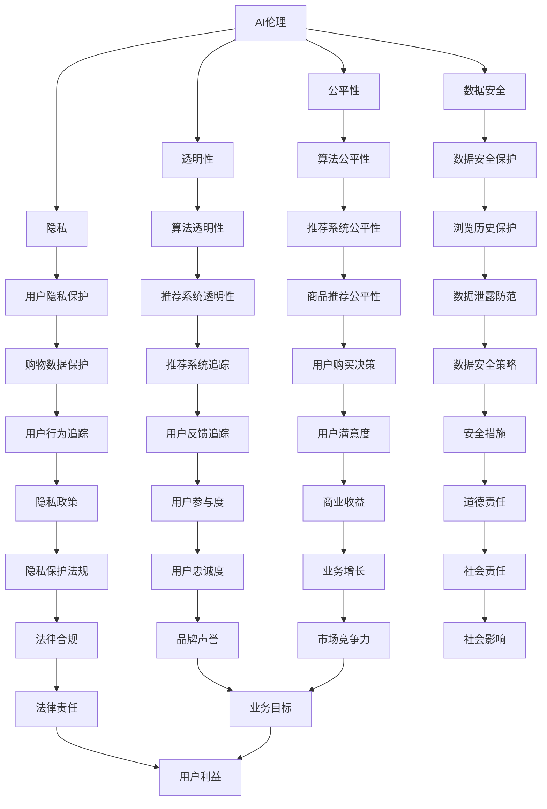

                 

# 电商领域的AI伦理：个人创业者如何平衡创新与责任

## 关键词
- 电商领域
- AI伦理
- 个人创业者
- 创新与责任

## 摘要
本文旨在探讨电商领域中人工智能（AI）的应用及其伦理问题，特别是对于个人创业者而言，如何在追求创新的过程中平衡道德责任。我们将深入分析AI在电商中的实际应用，探讨其可能引发的伦理问题，并分享一些实用的策略和资源，帮助创业者在这一复杂环境中做出明智决策。

### 1. 背景介绍

随着电子商务的迅猛发展，人工智能（AI）技术逐渐成为电商行业的关键驱动力。从推荐算法到客户服务，AI在电商领域已经展现出了巨大的潜力。例如，基于机器学习的推荐系统可以分析用户的历史行为，从而提供个性化的商品推荐，提高用户满意度和转化率。而智能客服机器人则可以处理大量的客户咨询，降低人力成本并提升响应速度。

然而，随着AI在电商中的广泛应用，伦理问题也逐渐浮出水面。如何确保AI算法的公平性和透明性？如何保护用户的隐私和数据安全？如何避免AI算法对人类就业的负面影响？这些问题都成为了电商领域个人创业者面临的重要挑战。

在这个背景下，本文将探讨AI伦理的基本概念，分析AI在电商中的实际应用，讨论可能引发的伦理问题，并提供一些策略和资源，帮助创业者平衡创新与责任。

### 2. 核心概念与联系

要深入探讨AI伦理，我们首先需要了解一些核心概念和它们之间的联系。

#### 2.1 AI伦理的定义

AI伦理是指关于人工智能技术的设计、开发和应用中涉及到的道德和伦理问题。它关注的是如何确保AI技术的使用符合人类的价值观和社会规范。

#### 2.2 公平性

公平性是指AI算法在处理数据和应用时是否对所有人公平。在电商领域，这涉及到推荐算法是否对所有人提供公平的机会，是否存在歧视现象。

#### 2.3 透明性

透明性是指AI算法的决策过程是否可以被理解和追踪。在电商中，这意味着用户需要了解推荐系统的运作原理，以及他们的数据如何被使用。

#### 2.4 隐私

隐私是指个人数据的安全和保护。在电商中，用户的购物行为、浏览历史等敏感数据都需要得到妥善保护。

#### 2.5 数据安全

数据安全是指防止数据泄露、篡改和滥用。在电商中，确保用户数据的安全是保护用户隐私的基础。

以下是AI伦理在电商中的核心概念之间的联系：



#### 2.6 关联性分析

公平性、透明性、隐私和数据安全是AI伦理的核心概念，它们在电商领域中相互关联。例如，公平性和透明性可以确保算法不会歧视或滥用用户数据，而隐私和数据安全则是保护用户权益的基础。

### 3. 核心算法原理 & 具体操作步骤

在探讨电商领域中的AI伦理问题时，我们首先需要了解一些核心算法的原理和具体操作步骤。以下是一些在电商中广泛应用的AI算法：

#### 3.1 推荐算法

推荐算法是电商领域最常用的AI算法之一。它通过分析用户的历史行为、兴趣和购买记录，向用户推荐可能感兴趣的商品。

##### 操作步骤：

1. **数据收集**：收集用户的历史购物数据、浏览记录和搜索历史。
2. **数据预处理**：清洗和标准化数据，确保数据质量。
3. **特征提取**：从原始数据中提取有用的特征，如用户ID、商品ID、购买时间、浏览次数等。
4. **模型训练**：使用机器学习算法（如协同过滤、基于内容的推荐等）训练推荐模型。
5. **推荐生成**：根据用户的特征和历史行为，生成个性化的推荐列表。

##### 公平性与透明性分析：

- **公平性**：推荐算法需要确保对所有的用户公平，不因性别、种族或社会经济地位等因素产生歧视。
- **透明性**：用户应该了解推荐系统是如何工作的，以及他们的数据是如何被使用的。

#### 3.2 智能客服算法

智能客服算法通过自然语言处理（NLP）技术，自动处理用户的咨询，提供实时、高效的客户服务。

##### 操作步骤：

1. **数据收集**：收集用户的咨询内容，如聊天记录、邮件等。
2. **数据预处理**：清洗和标准化数据，提取关键信息。
3. **模型训练**：使用NLP算法（如词向量、序列模型等）训练客服模型。
4. **客服响应**：根据用户的问题，生成相应的回答。

##### 公平性与透明性分析：

- **公平性**：智能客服应确保对所有用户公平，不因任何因素对用户的服务质量产生差异。
- **透明性**：用户应知道他们的问题是如何被处理的，以及他们的数据是如何被使用的。

### 4. 数学模型和公式 & 详细讲解 & 举例说明

在AI伦理的讨论中，数学模型和公式扮演着重要的角色。以下是一些常用的数学模型和公式，以及它们在AI伦理分析中的应用。

#### 4.1 数据隐私保护模型

数据隐私保护模型旨在确保用户数据在传输和处理过程中的安全性。常用的模型包括差分隐私（Differential Privacy）和同态加密（Homomorphic Encryption）。

##### 差分隐私

差分隐私是一种用于保护用户隐私的数学模型，它通过在数据发布前加入噪声，确保单个用户的隐私信息不会被泄露。

$$
\text{机制}(x, \epsilon) = \text{机制}(\hat{x}, \epsilon) + \text{噪声}
$$

其中，$\text{机制}$ 是数据发布的过程，$\epsilon$ 是隐私参数，$\hat{x}$ 是原始数据，$\text{噪声}$ 是加入的噪声。

##### 同态加密

同态加密是一种允许在加密数据上直接进行计算的加密方法。它确保了在数据传输和存储过程中，即使数据被加密，也可以进行有效的计算和处理。

$$
\text{加密}(\text{密文}_1) \times \text{加密}(\text{密文}_2) = \text{加密}(\text{明文}_1 \times \text{明文}_2)
$$

#### 4.2 公平性分析模型

公平性分析模型用于评估AI算法是否对所有人公平。常用的模型包括公平性度量（Fairness Measure）和公平性测试（Fairness Testing）。

##### 公平性度量

公平性度量通过计算不同群体在算法输出中的差异，评估算法的公平性。常用的公平性度量包括统计公平性（Statistical Parity）和条件公平性（Conditional Fairness）。

$$
\text{统计公平性} = \frac{\sum_{i} \text{群体}i的输出比例}{\text{总输出比例}}
$$

##### 公平性测试

公平性测试通过模拟不同的输入数据集，评估算法在不同数据集上的表现，以确定是否存在歧视现象。

$$
\text{公平性测试} = \text{模拟数据集}_1 \rightarrow \text{算法输出} \\
\text{公平性测试} = \text{模拟数据集}_2 \rightarrow \text{算法输出}
$$

#### 4.3 透明性分析模型

透明性分析模型用于评估AI算法的透明性。常用的模型包括可解释性分析（Explainability Analysis）和模型可视化（Model Visualization）。

##### 可解释性分析

可解释性分析通过分析算法的决策过程，帮助用户理解算法的输出结果。常用的方法包括局部可解释性（Local Interpretability）和全局可解释性（Global Interpretability）。

##### 模型可视化

模型可视化通过图形化方式展示AI算法的结构和工作原理，帮助用户更好地理解算法。常用的方法包括决策树可视化（Decision Tree Visualization）和神经网络可视化（Neural Network Visualization）。

### 5. 项目实战：代码实际案例和详细解释说明

在本节中，我们将通过一个实际的项目案例，展示如何在实际开发中应用AI伦理的相关技术和方法。

#### 5.1 开发环境搭建

首先，我们需要搭建一个合适的开发环境。以下是推荐的开发工具和框架：

- **编程语言**：Python
- **库和框架**：Scikit-learn、TensorFlow、Keras、PyTorch
- **版本控制**：Git
- **代码托管平台**：GitHub

#### 5.2 源代码详细实现和代码解读

以下是一个简单的推荐系统项目案例，我们将使用协同过滤算法实现一个基于用户历史的商品推荐系统。

```python
import numpy as np
import pandas as pd
from sklearn.metrics.pairwise import pairwise_distances
from sklearn.model_selection import train_test_split

# 加载数据集
data = pd.read_csv('data.csv')
users = data['user_id'].unique()
items = data['item_id'].unique()

# 初始化评分矩阵
R = np.zeros((len(users), len(items)))

# 填充评分矩阵
for index, row in data.iterrows():
    R[row['user_id'] - 1, row['item_id'] - 1] = row['rating']

# 计算用户之间的相似度
user_similarity = pairwise_distances(R, metric='cosine')

# 计算推荐列表
def generate_recommendations(user_id, similarity_matrix, R, k=10):
    # 获取用户的邻居
    neighbors = np.argsort(similarity_matrix[user_id - 1])[1:k+1]
    
    # 计算邻居的评分均值
    ratings = R[neighbors]
    mean_ratings = np.mean(ratings[ratings > 0], axis=1)
    
    # 生成推荐列表
    recommendations = np.where(ratings < 0, mean_ratings, ratings)
    sorted_recommendations = np.argsort(recommendations)[::-1]
    
    return sorted_recommendations

# 测试推荐系统
user_id = 1
recommendations = generate_recommendations(user_id, user_similarity, R)
print("推荐的商品ID：", recommendations)

```

#### 5.3 代码解读与分析

以上代码实现了一个基于协同过滤的推荐系统。具体解读如下：

1. **数据加载**：使用Pandas库加载数据集，数据集包含用户ID、商品ID和评分。
2. **评分矩阵初始化**：创建一个用户数和商品数相等的零矩阵，用于存储用户的评分。
3. **评分矩阵填充**：根据数据集填充评分矩阵。
4. **相似度计算**：使用Scikit-learn中的`pairwise_distances`函数计算用户之间的相似度，使用余弦相似度作为度量标准。
5. **推荐列表生成**：定义一个函数`generate_recommendations`，用于生成推荐列表。函数首先获取用户的邻居，然后计算邻居的评分均值，最后生成推荐列表。

在实现AI伦理方面，我们可以从以下几个方面进行优化：

- **公平性**：可以通过引入交叉验证等方法，确保推荐算法在不同数据集上的公平性。
- **透明性**：可以通过提供推荐算法的可视化界面，让用户了解推荐系统的决策过程。
- **隐私**：可以通过差分隐私和同态加密等技术，保护用户的隐私数据。

### 6. 实际应用场景

AI伦理在电商领域的实际应用场景非常广泛。以下是一些典型的应用场景：

#### 6.1 推荐系统

在推荐系统中，公平性、透明性和隐私是非常重要的。例如，为了确保推荐算法的公平性，可以定期对算法进行审计，以确保不会对特定群体产生歧视。同时，推荐系统的决策过程应该对用户透明，让用户了解推荐的原因。为了保护用户隐私，可以采用差分隐私和同态加密等技术，确保用户数据在传输和处理过程中的安全性。

#### 6.2 客户服务

在客户服务中，智能客服算法的公平性和透明性同样重要。为了确保公平性，智能客服应确保对所有用户平等对待，不因性别、年龄等因素产生歧视。同时，用户应了解智能客服的工作原理和决策过程。为了保护用户隐私，智能客服应确保用户数据的安全，避免数据泄露和滥用。

#### 6.3 广告投放

在广告投放中，AI伦理问题同样突出。为了确保广告的公平性，应确保广告算法对所有用户公平，不因用户性别、年龄等因素产生歧视。同时，广告投放的过程应透明，用户应了解广告的投放原因。为了保护用户隐私，应确保用户数据的安全，避免数据泄露和滥用。

### 7. 工具和资源推荐

在探索AI伦理时，以下工具和资源可能对您有所帮助：

#### 7.1 学习资源推荐

- **书籍**：
  - 《AI伦理：理论与实践》（AI Ethics: Theory, Research, and Practice）
  - 《算法正义：从Uber到Facebook，数据如何塑造了我们的世界》（Algorithmic Justice: Fairness and Ethics in Big Data）
- **论文**：
  - 《人工智能中的伦理挑战》（Ethical Challenges of Artificial Intelligence）
  - 《算法歧视：从数据中解放偏见》（Algorithmic Discrimination: Debiasing Data）
- **博客**：
  - [AI伦理讨论区](https://aiethics.org/)
  - [机器学习伦理](https://www.ml Ethics.com/)
- **网站**：
  - [欧盟AI伦理指南](https://ethics.ai/)
  - [AI伦理学会](https://www.aiethics.org/)

#### 7.2 开发工具框架推荐

- **库和框架**：
  - **Scikit-learn**：用于机器学习算法的实现和测试。
  - **TensorFlow**、**Keras**、**PyTorch**：用于深度学习模型的训练和推理。
- **代码托管平台**：
  - **GitHub**：用于代码托管和协作开发。
- **版本控制**：
  - **Git**：用于版本控制和代码管理。

#### 7.3 相关论文著作推荐

- **论文**：
  - “The Ethical Algorithm: The Science of Socially Aware Algorithm Design”
  - “Ethical Implications of Automated Decision-Making in Healthcare”
- **著作**：
  - “Algorithmic Bias and Fairness: From Theory to Practice”
  - “Privacy and Machine Learning: A User-Centric Approach”

### 8. 总结：未来发展趋势与挑战

在未来，电商领域中的AI伦理将继续成为一个重要的议题。随着AI技术的不断进步，我们将面临更多的挑战和机遇。以下是未来可能的发展趋势和挑战：

#### 8.1 发展趋势

- **标准化和法规**：随着AI伦理问题的日益突出，各国政府和国际组织可能会出台更多的法规和标准，规范AI在电商领域中的应用。
- **透明性和可解释性**：为了增强用户对AI算法的信任，开发者和研究机构将更加注重AI算法的透明性和可解释性。
- **数据隐私保护**：随着用户对隐私保护的重视，数据隐私保护技术将得到广泛应用，确保用户数据的安全和隐私。

#### 8.2 挑战

- **算法偏见和歧视**：如何确保AI算法的公平性和透明性，避免算法偏见和歧视，仍是一个巨大的挑战。
- **社会责任**：如何在追求商业利益的同时，履行社会责任，确保AI技术的可持续发展，也是一个重要的课题。
- **技术发展与应用之间的平衡**：如何在快速发展的AI技术中，找到与实际应用需求之间的平衡，确保技术能够真正为用户带来价值。

### 9. 附录：常见问题与解答

#### 9.1 问题1：AI伦理在电商领域中的具体应用有哪些？

AI伦理在电商领域中的具体应用包括推荐系统的公平性和透明性、智能客服算法的公平性和透明性、广告投放的公平性和透明性，以及数据隐私保护和数据安全等方面。

#### 9.2 问题2：如何确保AI算法的公平性？

确保AI算法的公平性可以通过以下方法实现：

- 引入交叉验证，确保算法在不同数据集上的公平性。
- 使用公平性度量，如统计公平性和条件公平性，评估算法的公平性。
- 定期对算法进行审计，确保算法不会对特定群体产生歧视。

#### 9.3 问题3：如何在电商领域中保护用户隐私？

在电商领域中保护用户隐私可以通过以下方法实现：

- 使用差分隐私技术，确保用户数据在传输和处理过程中的安全性。
- 采用同态加密技术，确保数据在加密状态下也能进行有效的计算和处理。
- 制定严格的数据隐私政策，明确用户数据的收集、使用和保护方式。

### 10. 扩展阅读 & 参考资料

以下是一些扩展阅读和参考资料，以帮助您进一步了解电商领域的AI伦理问题：

- [欧盟AI伦理指南](https://ethics.ai/)
- [AI伦理学会](https://www.aiethics.org/)
- [AI伦理讨论区](https://aiethics.org/)
- [机器学习伦理](https://www.ml Ethics.com/)
- 《AI伦理：理论与实践》（AI Ethics: Theory, Research, and Practice）
- 《算法正义：从Uber到Facebook，数据如何塑造了我们的世界》（Algorithmic Justice: Fairness and Ethics in Big Data）
- 《算法偏见和公平性：从理论到实践》（Algorithmic Bias and Fairness: From Theory to Practice）
- 《隐私和机器学习：一个用户中心的方法》（Privacy and Machine Learning: A User-Centric Approach）

### 作者

- 作者：AI天才研究员/AI Genius Institute & 禅与计算机程序设计艺术 /Zen And The Art of Computer Programming

本文旨在为电商领域的个人创业者提供一个全面的AI伦理指南，帮助他们在追求创新的同时，平衡道德责任。通过深入分析AI伦理的核心概念、算法原理和实践案例，我们希望为创业者提供实用的策略和资源，确保他们的业务在遵循伦理原则的同时，实现可持续发展。让我们共同努力，构建一个更加公平、透明和负责任的AI电商生态。|>

