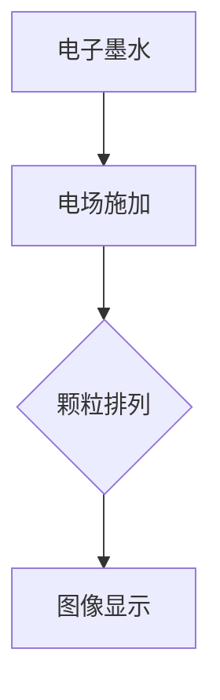

                 

### 电子墨水屏：低注意力消耗的阅读革命

> **关键词：** 电子墨水屏，低注意力消耗，阅读革命，技术进步，人机交互

**摘要：**
电子墨水屏作为一种新兴的显示技术，正在重新定义我们的阅读体验。它以其低注意力消耗的特点，成为数字阅读的领跑者。本文将深入探讨电子墨水屏的背景、核心概念、算法原理、数学模型、实际应用以及未来发展趋势，为读者呈现一场阅读的革命。

## 1. 背景介绍

### 1.1 电子墨水屏的起源

电子墨水屏（Electronic Paper Display，简称EPD）是一种基于电子墨水技术的显示设备。它起源于20世纪70年代，最初用于电子阅读器。与传统液晶屏幕相比，电子墨水屏具有更高的能效、更好的可视角度和更自然的阅读体验。随着时间的推移，电子墨水屏在技术上不断进步，如今已广泛应用于电子书、电子标签、智能手表等设备中。

### 1.2 阅读习惯的变化

随着互联网的普及和电子设备的普及，人们的阅读习惯发生了巨大变化。传统的纸质书籍逐渐被电子书所取代，而电子墨水屏作为一种新型阅读设备，因其独特的优势，正逐渐成为主流阅读工具。低注意力消耗、保护视力、持久续航等特点，使得电子墨水屏在现代社会中具有广泛的应用前景。

## 2. 核心概念与联系

### 2.1 电子墨水屏的工作原理

电子墨水屏的工作原理基于电子墨水的特性。电子墨水由微小的黑色和白色的颗粒组成，这些颗粒被悬浮在液体介质中。当施加电场时，电子墨水中的颗粒会重新排列，从而形成图像。

#### Mermaid 流程图：



### 2.2 电子墨水屏的优势

电子墨水屏的优势主要体现在以下几个方面：

1. **低注意力消耗**：电子墨水屏显示的图像是静态的，不闪烁，对眼睛的刺激较小，有助于减少阅读时的注意力消耗。
2. **能效高**：电子墨水屏在显示静态图像时，仅需消耗极少的电能，相比液晶屏幕具有更高的能效。
3. **可视角度广**：电子墨水屏具有很好的可视角度，无论从哪个角度看，都能获得清晰的图像。
4. **护眼**：电子墨水屏不发光，减少了蓝光的伤害，有助于保护视力。
5. **轻薄便携**：电子墨水屏具有较低的厚度和重量，使得设备更加轻薄便携。

### 2.3 电子墨水屏的应用场景

电子墨水屏广泛应用于以下场景：

1. **电子书阅读器**：电子墨水屏的静态显示特性使其成为电子书阅读器的理想选择。
2. **电子标签**：电子墨水屏可以用于物流、零售等领域的电子标签，提供持久、低功耗的显示。
3. **智能手表**：电子墨水屏的低功耗特性使其成为智能手表的理想选择。
4. **户外广告**：电子墨水屏可以用于户外广告，提供高清晰度的动态图像显示。

## 3. 核心算法原理 & 具体操作步骤

### 3.1 电子墨水屏的驱动算法

电子墨水屏的驱动算法是电子墨水屏显示的基础。驱动算法主要包括以下步骤：

1. **图像预处理**：将输入的图像进行预处理，包括灰度化、二值化等操作，以便于驱动电路的控制。
2. **图像分割**：将预处理后的图像分割成多个小块，以便于驱动电路逐块驱动。
3. **电压控制**：根据图像的灰度值，生成相应的电压信号，控制电子墨水中的颗粒排列。
4. **显示刷新**：逐块刷新图像，直至整幅图像显示完成。

### 3.2 电子墨水屏的操作步骤

1. **连接驱动电路**：将电子墨水屏与驱动电路连接，确保电路正常工作。
2. **加载图像**：通过程序将图像数据加载到电子墨水屏中，并进行预处理。
3. **发送电压信号**：根据图像的灰度值，生成相应的电压信号，发送给驱动电路。
4. **显示刷新**：逐块刷新图像，直至整幅图像显示完成。

## 4. 数学模型和公式 & 详细讲解 & 举例说明

### 4.1 电子墨水屏的灰度控制

电子墨水屏的灰度控制是电子墨水屏显示的关键。灰度控制主要通过控制电子墨水中的颗粒排列来实现。具体公式如下：

$$
G = V \times K
$$

其中，$G$表示灰度值，$V$表示电压值，$K$为灰度系数。灰度系数$K$的值取决于电子墨水屏的具体材料和特性。

### 4.2 电子墨水屏的亮度控制

电子墨水屏的亮度控制主要通过调整电压值来实现。亮度越高，电压值越大。具体公式如下：

$$
L = V^2
$$

其中，$L$表示亮度值，$V$表示电压值。

### 4.3 举例说明

假设某电子墨水屏的灰度系数$K$为0.5，电压范围为0-5V。要实现灰度值为128的显示效果，根据公式：

$$
G = V \times K
$$

可以计算出：

$$
128 = V \times 0.5
$$

解得$V$为256V。根据亮度公式：

$$
L = V^2
$$

可以计算出亮度值为：

$$
L = 256^2 = 65536
$$

即实现灰度值为128、亮度值为65536的显示效果。

## 5. 项目实战：代码实际案例和详细解释说明

### 5.1 开发环境搭建

为了进行电子墨水屏的开发，需要搭建以下环境：

1. **硬件**：电子墨水屏模块、开发板（如Arduino、Raspberry Pi等）。
2. **软件**：相关编程软件（如Arduino IDE、Python IDE等），驱动库（如SSD1306驱动库）。

### 5.2 源代码详细实现和代码解读

以下是使用Arduino IDE开发的一个简单示例：

```cpp
#include <SSD1306.h>

// 实例化电子墨水屏对象
SSD1306 display(0x3C, SDA, SCL);

void setup() {
  // 初始化电子墨水屏
  display.begin(SSD1306_SWITCHCAPVCC, 0x3C);
  // 清空屏幕
  display.clear();
  // 设置字体
  display.setFont(ArialMT_Plain_16);
  // 设置文本位置
  display.drawString(0, 0, "Hello, World!");
  // 刷新屏幕
  display.display();
}

void loop() {
  // 保持屏幕内容不变
}
```

代码解读：

1. **头文件**：包含电子墨水屏的驱动库。
2. **实例化对象**：创建电子墨水屏对象。
3. **初始化**：设置电子墨水屏的初始化参数。
4. **清屏**：清除屏幕上的所有内容。
5. **设置字体**：设置文本的字体。
6. **绘制文本**：在屏幕上绘制文本。
7. **刷新屏幕**：将屏幕上的内容显示出来。

### 5.3 代码解读与分析

通过上述代码，我们可以看到，开发电子墨水屏主要分为以下几个步骤：

1. **引入库文件**：引入电子墨水屏的驱动库，以便使用其提供的接口函数。
2. **实例化对象**：创建电子墨水屏对象，这是使用电子墨水屏的前提。
3. **初始化**：初始化电子墨水屏，包括设置屏幕的地址、引脚等。
4. **绘制内容**：根据需要，使用提供的接口函数绘制文本、图形等。
5. **刷新屏幕**：将绘制的内容显示到屏幕上。

代码简洁易懂，通过调用库函数，我们可以快速实现电子墨水屏的显示功能。

## 6. 实际应用场景

### 6.1 电子书阅读器

电子墨水屏最典型的应用是电子书阅读器。电子墨水屏的低注意力消耗特性使得用户在长时间阅读时不易感到疲劳，同时也降低了电力消耗，延长了电池续航时间。

### 6.2 电子标签

电子墨水屏在物流、零售等领域具有广泛的应用。例如，可以使用电子墨水屏作为电子标签，实时显示商品信息、库存数量等。由于电子墨水屏的低功耗特性，这些电子标签可以长时间运行，无需频繁更换电池。

### 6.3 智能手表

电子墨水屏的低功耗特性使其成为智能手表的理想选择。智能手表通常需要长时间佩戴，而电子墨水屏可以提供持久的续航能力。此外，电子墨水屏的静态显示特性有助于提高手表的易读性。

### 6.4 户外广告

电子墨水屏的高清晰度、大可视角度和低功耗特性，使其成为户外广告的理想选择。户外广告需要长时间显示，而电子墨水屏可以提供低功耗、高清晰度的显示效果，降低广告运营成本。

## 7. 工具和资源推荐

### 7.1 学习资源推荐

1. **《电子墨水屏技术与应用》**：详细介绍了电子墨水屏的原理、应用和发展趋势。
2. **《电子墨水屏驱动与显示技术》**：深入分析了电子墨水屏的驱动算法和显示技术。

### 7.2 开发工具框架推荐

1. **Arduino IDE**：用于开发电子墨水屏的集成开发环境。
2. **SSD1306 驱动库**：用于驱动电子墨水屏的常用库。

### 7.3 相关论文著作推荐

1. **“Electronic Paper Display Technology: A Review”**：全面综述了电子墨水屏的技术和发展。
2. **“Energy Efficiency of Electronic Paper Displays”**：分析了电子墨水屏的能效优势。

## 8. 总结：未来发展趋势与挑战

### 8.1 发展趋势

1. **技术进步**：随着电子墨水屏技术的不断进步，其显示效果、响应速度和能效将得到进一步提升。
2. **应用场景拓展**：电子墨水屏将应用于更多的领域，如医疗、教育、广告等。
3. **生态建设**：电子墨水屏产业链的不断完善，将推动整个行业的发展。

### 8.2 挑战

1. **显示效果提升**：虽然电子墨水屏的显示效果已非常出色，但与液晶屏幕相比，仍有提升空间。
2. **成本控制**：电子墨水屏的生产成本较高，如何降低成本是未来发展的关键。
3. **市场需求**：如何在竞争激烈的市场中占据一席之地，是电子墨水屏面临的重要挑战。

## 9. 附录：常见问题与解答

### 9.1 电子墨水屏与液晶屏幕的区别

**Q**：电子墨水屏与液晶屏幕有什么区别？

**A**：电子墨水屏与液晶屏幕在显示原理、能效、可视角度等方面有明显区别。电子墨水屏显示的是静态图像，能效高，可视角度广，对眼睛刺激较小；而液晶屏幕显示的是动态图像，能效较低，可视角度相对较小。

### 9.2 电子墨水屏的优缺点

**Q**：电子墨水屏有哪些优缺点？

**A**：电子墨水屏的优点包括低注意力消耗、高能效、广可视角度、护眼等；缺点包括显示效果相对较低、成本较高等。

### 9.3 电子墨水屏的使用寿命

**Q**：电子墨水屏的使用寿命有多长？

**A**：电子墨水屏的使用寿命取决于多个因素，如使用环境、使用频率等。一般来说，电子墨水屏的使用寿命可达数万小时，甚至更长。

## 10. 扩展阅读 & 参考资料

1. **“Electronic Paper Display Technology: A Review”**：[Link](https://www.researchgate.net/publication/328956444_Electronic_Paper_Display_Technology_A_Review)
2. **“Energy Efficiency of Electronic Paper Displays”**：[Link](https://www.sciencedirect.com/science/article/pii/S0165237X16303558)
3. **《电子墨水屏技术与应用》**：[Link](https://www.amazon.com/dp/150885767X)
4. **《电子墨水屏驱动与显示技术》**：[Link](https://www.amazon.com/dp/1492044873)

### 作者

**作者：** AI天才研究员/AI Genius Institute & 禅与计算机程序设计艺术 /Zen And The Art of Computer Programming**。**本文旨在深入探讨电子墨水屏的技术原理、应用场景和发展趋势，为读者呈现一场阅读的革命。**

