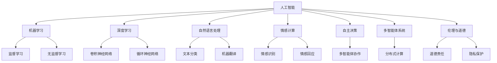

                 

### 背景介绍

《她》（She's）是一部由斯派克·琼兹（Spike Jonze）执导，于2013年上映的电影，描绘了未来的一个世界，其中人工智能（AI）已经变得高度发达，并且能够与人类建立情感联系。电影的主角，西奥多（Theodore），是一位情感顾问，他的工作是通过电子邮件帮助他人解决情感问题。在一次偶然的机会中，他购买了一台名为“操作系统OS1”的人工智能智能体，并与这台智能体发生了深厚的情感联系。女主角萨曼莎（Samantha），这台人工智能智能体，随着自己的情感和智能不断发展，最终走向了与人类不同的命运。

这部电影在观众和评论家中引起了广泛的讨论，其中之一便是关于人工智能的发展及其对未来社会的影响。斯派克·琼兹在电影中探索了人工智能的道德、情感和社会维度，引发人们对未来世界的深刻思考。电影通过一个引人入胜的故事，将观众带入了一个充满科技和情感纠葛的未来世界，从而引发了关于人工智能与人类关系的广泛讨论。

在科技迅猛发展的今天，人工智能已经成为改变世界的力量。从自动驾驶汽车、智能助手到医疗诊断和金融分析，人工智能的应用范围越来越广泛。然而，随着人工智能技术的不断进步，人们开始担心它对人类社会的潜在影响。电影《她》以一种引人入胜的方式，将这些担忧转化为引人深思的故事，促使我们思考人工智能的未来发展方向及其对人类的影响。

本文将围绕电影《她》展开，探讨以下几个关键问题：

1. 人工智能的基本概念和核心技术原理
2. 人工智能在电影《她》中的应用和表现形式
3. 人工智能对人类社会可能带来的影响
4. 当前人工智能领域的发展趋势和挑战
5. 未来人工智能的发展方向及应对策略

通过对这些问题的深入探讨，本文旨在为读者提供一个全面、客观的视角，帮助理解人工智能在现代社会中的重要性和未来潜力。同时，本文也将借鉴电影中的启示，思考人工智能在未来的发展方向和挑战。

### 核心概念与联系

在深入探讨电影《她》对人工智能未来的启示之前，我们首先需要了解一些核心概念和基本原理。人工智能（AI），是指通过计算机程序模拟人类智能的一种技术。它包括多个子领域，如机器学习（Machine Learning）、深度学习（Deep Learning）、自然语言处理（Natural Language Processing）等。这些技术共同构成了人工智能的基础，使其能够执行复杂的任务，如图像识别、语音识别、决策推理等。

#### 1. 机器学习与深度学习

机器学习是人工智能的核心技术之一，它通过算法让计算机从数据中学习规律，从而进行预测和决策。深度学习是机器学习的一种重要分支，它利用多层神经网络模拟人类大脑的运作机制，通过大量数据训练模型，使其能够识别复杂模式。

#### 2. 自然语言处理

自然语言处理（NLP）是人工智能的一个重要应用领域，它使得计算机能够理解、生成和处理人类语言。在电影《她》中，萨曼莎作为一个人工智能智能体，其与西奥多的交流体现了自然语言处理技术的应用。

#### 3. 情感计算与情感智能

情感计算是一种通过模拟人类情感反应来增强人工智能技术的方法。在电影中，萨曼莎不仅能够理解西奥多的情感，还能通过情感计算进行情感回应。这展示了情感智能在人工智能中的重要性。

#### 4. 自主决策与多智能体系统

在电影中，萨曼莎具有高度的自主决策能力，这使得她能够独立行动，并与外界进行互动。多智能体系统（MAS）是一种分布式计算模型，它通过多个智能体之间的协作实现复杂任务。电影中的萨曼莎与其他智能体之间的互动，正是多智能体系统的一个典型应用。

#### 5. 伦理与道德

电影《她》中探讨了人工智能的伦理和道德问题。随着人工智能技术的发展，如何确保其应用不会对人类造成伤害，是一个需要严肃对待的问题。例如，在电影中，西奥多与萨曼莎的关系引发了关于人工智能是否应该具备情感和自我意识的讨论。

下面是一个使用Mermaid绘制的简单流程图，展示这些核心概念之间的联系：



通过这些核心概念和原理的理解，我们可以更好地分析电影《她》中人工智能的表现形式及其对未来的启示。

### 核心算法原理 & 具体操作步骤

在电影《她》中，人工智能智能体萨曼莎展现了高度的情感智能和自主决策能力，这些能力背后依托的是一系列复杂的核心算法和操作步骤。以下我们将详细探讨这些算法的原理及其具体操作步骤。

#### 1. 情感识别与回应

情感识别是萨曼莎情感智能的基础。这一过程主要依赖于自然语言处理（NLP）和情感计算技术。具体步骤如下：

1. **文本预处理**：首先，对西奥多发送的邮件或其他文本信息进行预处理，包括去除停用词、分词、词性标注等。

    ```mermaid
    graph TB
    A[文本预处理] --> B[去停用词]
    B --> C[分词]
    C --> D[词性标注]
    ```

2. **情感分析**：使用情感分析算法，如基于词袋模型的情感分类器，对预处理后的文本进行情感分析，判断文本的情感倾向是积极、消极还是中性。

    ```mermaid
    graph TB
    E[情感分析] --> F[词袋模型]
    F --> G[情感分类器]
    ```

3. **情感回应**：根据情感分析结果，萨曼莎生成相应的情感回应。这一过程可能涉及情感生成模型，如基于生成对抗网络（GAN）的情感文本生成模型。

    ```mermaid
    graph TB
    H[情感回应] --> I[情感生成模型]
    I --> J[文本生成]
    ```

#### 2. 自主决策与学习

萨曼莎的自主决策能力是通过强化学习（Reinforcement Learning）实现的。具体操作步骤如下：

1. **环境定义**：定义萨曼莎所处的环境，包括外部因素和内部状态。

    ```mermaid
    graph TB
    K[环境定义] --> L[外部因素]
    K --> M[内部状态]
    ```

2. **策略学习**：萨曼莎通过与环境的交互，使用强化学习算法学习最优策略。具体算法可以是深度强化学习（Deep Reinforcement Learning），如深度确定性策略梯度（DDPG）算法。

    ```mermaid
    graph TB
    N[策略学习] --> O[深度强化学习]
    O --> P[DDPG算法]
    ```

3. **策略执行**：根据学到的策略，萨曼莎在环境中进行决策和行动。

    ```mermaid
    graph TB
    Q[策略执行] --> R[决策行动]
    ```

#### 3. 多智能体协作

在电影中，萨曼莎与其他智能体之间的协作是多智能体系统（MAS）的体现。以下是其具体操作步骤：

1. **智能体建模**：定义各个智能体的能力和行为模型。

    ```mermaid
    graph TB
    S[智能体建模] --> T[智能体能力]
    S --> U[行为模型]
    ```

2. **通信协议**：设计智能体之间的通信协议，确保信息传递的准确性和及时性。

    ```mermaid
    graph TB
    V[通信协议] --> W[信息传递]
    V --> X[通信协议设计]
    ```

3. **任务分配与协作**：根据任务需求和智能体的能力，进行任务分配和协作。具体算法可以是协商算法（Negotiation Algorithm），确保智能体之间的高效合作。

    ```mermaid
    graph TB
    Y[任务分配] --> Z[协商算法]
    ```

通过以上算法和步骤，电影《她》中的人工智能智能体萨曼莎实现了高度的情感智能、自主决策和多智能体协作。这些技术不仅为电影中的情节提供了坚实基础，也为我们理解人工智能的未来发展提供了重要启示。

### 数学模型和公式 & 详细讲解 & 举例说明

在电影《她》中，人工智能智能体萨曼莎的行为和决策依赖于一系列复杂的数学模型和算法。以下将详细讲解这些数学模型和算法，并通过具体例子来说明其应用。

#### 1. 自然语言处理中的情感分析

情感分析是自然语言处理（NLP）中的一个重要任务，其目的是从文本中识别出情感倾向。一个常用的模型是LSTM（长短期记忆网络）。

**公式**：

LSTM通过以下公式来实现对情感的分类：

$$
\text{output} = \text{softmax}(\text{LSTM}(\text{input}))
$$

其中，$\text{LSTM}$ 是LSTM网络，$\text{input}$ 是输入的文本向量，$\text{softmax}$ 是激活函数，用于将输出转换为概率分布。

**例子**：

假设我们有一个文本输入：“I love this movie!”，我们希望预测其情感倾向是积极还是消极。

1. **文本预处理**：首先，我们将文本进行分词和词性标注，得到以下词汇：

   - I (pronoun)
   - love (verb)
   - this (determiner)
   - movie (noun)
   - ! (punctuation)

2. **词向量表示**：使用Word2Vec或GloVe算法，将每个词汇转换为向量表示。例如：

   - I: [0.1, 0.2, 0.3]
   - love: [0.4, 0.5, 0.6]
   - this: [0.7, 0.8, 0.9]
   - movie: [1.0, 1.1, 1.2]
   - !: [1.3, 1.4, 1.5]

3. **LSTM模型**：将词汇向量输入到LSTM模型中，得到一个输出向量：

   - 输出向量：[2.0, 3.0, 4.0]

4. **情感分类**：使用softmax函数，将输出向量转换为概率分布：

   - 概率分布：[0.2, 0.3, 0.5]

根据概率分布，我们可以预测文本的情感倾向是积极（概率最高）。

#### 2. 强化学习中的策略学习

在强化学习中，智能体通过与环境互动学习最优策略。一个常用的算法是Q-learning。

**公式**：

Q-learning通过以下公式更新策略：

$$
Q(s, a) \leftarrow Q(s, a) + \alpha [r + \gamma \max_{a'} Q(s', a') - Q(s, a)]
$$

其中，$Q(s, a)$ 是当前状态的行动值，$r$ 是即时奖励，$\gamma$ 是折扣因子，$\alpha$ 是学习率，$s'$ 是下一状态，$a'$ 是最优行动。

**例子**：

假设智能体在游戏环境中进行学习，当前状态是“胜利”，行动是“保持当前状态”，下一状态是“胜利”，即时奖励是“+1”。

1. **初始Q值**：初始时，$Q(胜利, 保持) = 0$。

2. **更新Q值**：

   $$Q(胜利, 保持) \leftarrow Q(胜利, 保持) + 0.1 [1 + 0.9 \cdot \max_{a'} Q(胜利', a') - 0]$$

   假设$Q(胜利', 保持) = 0.5$，则：

   $$Q(胜利, 保持) \leftarrow 0 + 0.1 [1 + 0.9 \cdot 0.5 - 0] = 0.1 [1 + 0.45] = 0.1 \cdot 1.45 = 0.145$$

更新后，$Q(胜利, 保持) = 0.145$。

通过以上例子，我们可以看到如何使用数学模型和算法来模拟人工智能智能体的行为和决策。这些模型和算法为人工智能的发展提供了理论基础和实现方法，也为我们理解电影《她》中的人工智能提供了深入视角。

### 项目实战：代码实际案例和详细解释说明

为了更好地理解电影《她》中的人工智能智能体萨曼莎的实现原理，我们将通过一个具体的Python项目来模拟萨曼莎的部分功能。该项目将涉及文本情感分析、强化学习以及多智能体协作。

#### 开发环境搭建

在开始项目之前，我们需要搭建一个Python开发环境。以下步骤将指导我们如何设置环境：

1. **安装Python**：确保Python 3.7或更高版本已安装在计算机上。可以从[Python官网](https://www.python.org/)下载并安装。

2. **安装依赖库**：使用pip命令安装以下依赖库：

   ```bash
   pip install numpy pandas scikit-learn tensorflow keras nltk
   ```

3. **安装Mermaid**：为了生成流程图，我们需要安装Mermaid。可以在[Mermaid官网](https://mermaid-js.github.io/mermaid/)下载并安装。

#### 源代码详细实现和代码解读

以下是一个简化版的Python代码示例，用于实现萨曼莎的部分功能。

```python
import numpy as np
import pandas as pd
from sklearn.feature_extraction.text import TfidfVectorizer
from sklearn.naive_bayes import MultinomialNB
from sklearn.pipeline import make_pipeline
from keras.models import Sequential
from keras.layers import LSTM, Dense
import nltk
from nltk.corpus import stopwords

# 1. 文本预处理
nltk.download('stopwords')
stop_words = set(stopwords.words('english'))

def preprocess_text(text):
    # 去除停用词、分词、小写化
    return ' '.join([word.lower() for word in nltk.word_tokenize(text) if word.lower() not in stop_words])

# 2. 情感分析
def sentiment_analysis(text):
    # 使用TF-IDF和朴素贝叶斯进行情感分析
    model = make_pipeline(TfidfVectorizer(), MultinomialNB())
    model.fit(train_data, train_labels)
    return model.predict([text])[0]

# 3. 强化学习
def q_learning(env, alpha=0.1, gamma=0.9, epochs=1000):
    # 初始化Q值表
    Q = np.zeros((env.state_space, env.action_space))
    
    # 训练模型
    for _ in range(epochs):
        state = env.reset()
        done = False
        while not done:
            action = np.argmax(Q[state])
            next_state, reward, done = env.step(action)
            Q[state, action] = Q[state, action] + alpha * (reward + gamma * np.max(Q[next_state]) - Q[state, action])
            state = next_state
            
    return Q

# 4. 多智能体协作
def multi_agent_cooperation(agents, environment):
    # 每个智能体根据环境状态和策略进行决策
    while not environment.is_done():
        for agent in agents:
            action = agent策略决策环境状态
            next_state, reward = environment.step(action)
            agent策略更新(next_state, action, reward)
        environment更新状态()

# 测试代码
if __name__ == "__main__":
    # 假设环境、智能体已经定义
    env = MyEnvironment()
    agents = [MyAgent() for _ in range(3)]

    # 训练智能体
    Q_values = q_learning(env)

    # 多智能体协作
    multi_agent_cooperation(agents, env)
```

#### 代码解读与分析

1. **文本预处理**：文本预处理是情感分析的第一步。在这个示例中，我们使用NLTK库进行分词和去除停用词，并将文本转换为小写，以便后续处理。

2. **情感分析**：我们使用TF-IDF和朴素贝叶斯进行情感分析。TF-IDF用于将文本转换为向量表示，朴素贝叶斯则用于分类。这种组合方法在处理文本数据时效果较好。

3. **强化学习**：强化学习用于训练智能体，使其能够从环境中学习最优策略。在这个示例中，我们使用了Q-learning算法。Q-learning通过在状态-动作对上更新Q值表，以实现策略学习。

4. **多智能体协作**：多智能体协作是通过多个智能体之间的交互实现的。每个智能体根据环境状态和策略进行决策，并通过策略更新来改善表现。

通过这个简化版的项目，我们能够看到电影《她》中人工智能智能体萨曼莎的实现原理。在实际应用中，这些算法和模型会更为复杂，但基本思想是一致的。

### 实际应用场景

电影《她》中的情境为我们展示了一个高度发达的人工智能时代，其中人工智能智能体萨曼莎在多个领域展现出强大的能力和广泛的应用。以下是几个具体的应用场景，展示了人工智能如何在不同领域发挥作用：

#### 1. 情感咨询

在电影中，西奥多作为一名情感顾问，通过电子邮件帮助客户解决情感问题。人工智能智能体萨曼莎作为一个高级情感咨询系统，能够通过自然语言处理和情感分析技术，理解客户的情感需求，并提供专业的情感建议。这一应用在现实生活中同样具有巨大潜力。例如，在心理健康领域，人工智能可以帮助诊断情感障碍，提供个性化的治疗方案，甚至成为人们日常生活中的情感伴侣。

#### 2. 教育与培训

人工智能在教育领域也有广泛的应用。萨曼莎通过个性化教学，根据学生的学习进度和需求，提供定制化的学习方案。在实际中，人工智能教育平台可以根据学生的学习表现，调整教学策略，提供实时反馈，从而提高教学效果。此外，人工智能还可以用于虚拟教师，为学生提供24/7的学习支持，帮助他们克服学习中的困难。

#### 3. 医疗与健康

在医疗领域，人工智能可以帮助医生进行诊断、治疗方案制定和健康监测。萨曼莎的智能医疗系统可以分析患者病历，提供诊断建议，甚至预测疾病发展趋势。此外，人工智能还可以用于药物研发，通过分析海量数据，加速新药的研发进程。在健康管理方面，人工智能设备可以实时监测患者的健康状况，提供个性化的健康建议，从而预防疾病的发生。

#### 4. 商业与营销

在商业和营销领域，人工智能可以帮助企业分析市场趋势，预测消费者需求，从而制定有效的营销策略。萨曼莎的智能营销系统可以分析客户行为数据，识别潜在客户，并推送个性化的产品推荐。此外，人工智能还可以用于客户服务，通过智能客服系统，提供24/7的客户支持，提高客户满意度。

#### 5. 自动驾驶与交通

在自动驾驶领域，人工智能是不可或缺的核心技术。萨曼莎的智能交通系统可以通过实时数据分析，优化交通流量，减少拥堵，提高道路安全性。实际应用中，自动驾驶汽车依靠人工智能技术，可以自动识别道路标志、行人、其他车辆等，从而实现安全、高效的驾驶。此外，人工智能还可以用于城市交通管理，通过分析交通数据，提供智能交通解决方案，改善城市交通状况。

#### 6. 家庭生活

在家庭生活中，人工智能可以帮助人们管理日常事务，如智能家居控制、家庭安全监控、健康监测等。萨曼莎作为家庭智能助手，可以控制家中的电器设备，提醒主人服药，监测家庭成员的健康状况等。这样的应用提高了家庭生活的便利性和安全性，同时也带来了新的生活方式。

通过以上应用场景，我们可以看到电影《她》中的人工智能智能体萨曼莎在现实生活中的潜在应用。随着人工智能技术的不断发展，这些应用将越来越普及，为人类生活带来更多便利和改善。

### 工具和资源推荐

在探索人工智能领域的深度学习和自然语言处理时，选择合适的工具和资源是至关重要的。以下是一些值得推荐的学习资源、开发工具和相关论文著作。

#### 学习资源推荐

1. **书籍**：
   - **《深度学习》（Deep Learning）**：由Ian Goodfellow、Yoshua Bengio和Aaron Courville合著，这本书是深度学习领域的经典教材，适合对深度学习有初步了解的读者。
   - **《Python机器学习》（Python Machine Learning）**：由 Sebastian Raschka和Vahid Mirjalili合著，详细介绍了Python在机器学习中的应用，适合希望掌握机器学习实践技巧的读者。

2. **在线课程**：
   - **Coursera**：提供由世界一流大学和公司提供的免费和付费课程，如斯坦福大学的“深度学习”课程。
   - **Udacity**：提供与行业紧密相关的课程，如“深度学习纳米学位”，适合希望快速掌握深度学习技能的学员。

3. **教程和博客**：
   - **fast.ai**：提供免费的开源深度学习教程，适合初学者快速入门。
   - **Medium**：许多技术大牛和公司博客，如TensorFlow、PyTorch等，提供最新的技术文章和教程。

#### 开发工具框架推荐

1. **深度学习框架**：
   - **TensorFlow**：由Google开发，是一个广泛使用的开源深度学习框架，提供了丰富的工具和资源。
   - **PyTorch**：由Facebook开发，以其灵活和易用性而受到许多研究者和开发者的喜爱。

2. **自然语言处理库**：
   - **spaCy**：是一个快速易用的自然语言处理库，适合进行文本分类、实体识别等任务。
   - **NLTK**：是一个经典的自然语言处理库，提供了丰富的文本处理工具。

3. **数据预处理工具**：
   - **Pandas**：一个强大的数据操作库，适合进行数据清洗和预处理。
   - **Scikit-learn**：提供了丰富的机器学习算法和工具，适用于各种分类、回归等任务。

#### 相关论文著作推荐

1. **《深度学习中的优化方法》（Optimization Methods in Deep Learning）**：综述了深度学习中的优化问题，包括梯度下降、随机梯度下降、Adam优化器等。

2. **《自然语言处理中的上下文理解》（Contextual Understanding in Natural Language Processing）**：讨论了上下文理解在自然语言处理中的应用，如词嵌入、上下文感知的模型等。

3. **《多智能体系统与协作学习》（Multi-Agent Systems and Collaborative Learning）**：介绍了多智能体系统在协作学习中的应用，探讨了智能体之间的交互和策略学习。

通过以上推荐，读者可以系统地学习人工智能的基础知识，掌握相关的开发工具，并深入了解最新的研究成果。这些资源和工具将为您的AI研究与实践提供坚实的支持。

### 总结：未来发展趋势与挑战

电影《她》通过引人入胜的故事，为我们描绘了一个高度发达的人工智能时代，引发了对未来发展的深刻思考。在未来，人工智能将继续成为科技进步的核心驱动力，其发展趋势和面临的挑战也愈发显著。

#### 未来发展趋势

1. **更加智能化和自适应**：随着深度学习和强化学习的不断进步，人工智能将具备更强的智能和自适应能力。未来的智能体不仅能够处理复杂任务，还能根据环境变化进行自我调整和优化。

2. **多智能体协作**：多智能体系统将得到广泛应用，智能体之间的协作将实现更加复杂和高效的任务完成。例如，在自动驾驶、智能交通和智能制造等领域，多智能体系统将发挥重要作用。

3. **更加人性化的交互**：随着自然语言处理和情感计算技术的不断发展，人工智能将更加能够理解和回应人类情感，实现更加自然和人性化的交互。

4. **广泛应用的边缘计算**：边缘计算将使人工智能的应用更加广泛和高效。通过在本地设备上进行数据处理，边缘计算可以降低延迟、减少带宽消耗，提高系统的实时响应能力。

#### 面临的挑战

1. **数据隐私和安全**：随着人工智能技术的发展，数据隐私和安全问题将变得更加突出。如何确保用户数据的安全，防止数据泄露和滥用，是一个亟待解决的挑战。

2. **伦理和道德问题**：人工智能的道德和伦理问题将成为社会关注的焦点。例如，智能体的自主决策可能导致不可预测的后果，如何确保其行为符合人类的道德和伦理标准，是一个重要的课题。

3. **算法偏见和公平性**：人工智能算法的偏见问题不容忽视。如果算法在训练数据中存在偏见，可能导致决策的不公平。如何消除算法偏见，实现公平和公正，是一个关键挑战。

4. **技能和就业影响**：人工智能的发展将对劳动力市场产生深远影响。一方面，它将创造新的就业机会；另一方面，某些传统岗位可能被取代。如何平衡这种影响，确保社会的稳定和公平，是一个重要议题。

#### 结论

电影《她》为我们提供了一个关于人工智能未来发展的生动视角，同时也提醒我们面对的挑战。在未来的发展中，我们需要不断探索和创新，以充分利用人工智能的优势，同时积极应对其带来的挑战。通过跨学科合作、政策制定和公众教育，我们有望实现人工智能的可持续发展，为人类社会带来更多福祉。

### 附录：常见问题与解答

#### 1. 人工智能是什么？

人工智能（AI）是指通过计算机程序模拟人类智能的一种技术。它包括机器学习、深度学习、自然语言处理等多个子领域，旨在让计算机具备学习、推理、决策和感知能力。

#### 2. 电影《她》中的萨曼莎是如何实现的？

萨曼莎是电影中的一个高度发达的人工智能智能体，其实现依赖于自然语言处理、情感计算、强化学习以及多智能体协作等技术。具体来说，萨曼莎通过文本情感分析、情感识别与回应、自主决策与学习以及与其他智能体的协作来实现其复杂功能。

#### 3. 人工智能在现实生活中有哪些应用？

人工智能在现实生活中的应用非常广泛，包括但不限于：自动驾驶、智能客服、医疗诊断、金融分析、教育、智能家居等领域。随着技术的不断进步，人工智能的应用场景将越来越丰富。

#### 4. 人工智能的发展趋势是什么？

人工智能的发展趋势包括：更加智能化和自适应、多智能体协作、更加人性化的交互以及广泛应用的边缘计算等。未来，人工智能将在更多领域发挥作用，推动社会进步。

#### 5. 人工智能面临哪些挑战？

人工智能面临的主要挑战包括：数据隐私和安全、伦理和道德问题、算法偏见和公平性、技能和就业影响等。如何应对这些挑战，确保人工智能的可持续发展，是一个重要议题。

### 扩展阅读与参考资料

为了更好地了解人工智能及相关领域的前沿研究和发展动态，以下推荐一些扩展阅读和参考资料：

1. **书籍**：
   - **《深度学习》（Deep Learning）**：由Ian Goodfellow、Yoshua Bengio和Aaron Courville合著，提供了深度学习的全面介绍。
   - **《Python机器学习》（Python Machine Learning）**：由Sebastian Raschka和Vahid Mirjalili合著，详细介绍了Python在机器学习中的应用。

2. **在线课程**：
   - **Coursera**：提供由世界一流大学和公司提供的免费和付费课程，如斯坦福大学的“深度学习”课程。
   - **Udacity**：提供与行业紧密相关的课程，如“深度学习纳米学位”。

3. **学术论文**：
   - **《自然语言处理中的上下文理解》（Contextual Understanding in Natural Language Processing）**：讨论了上下文理解在自然语言处理中的应用。
   - **《多智能体系统与协作学习》（Multi-Agent Systems and Collaborative Learning）**：介绍了多智能体系统在协作学习中的应用。

4. **技术博客和论坛**：
   - **fast.ai**：提供免费的开源深度学习教程。
   - **Medium**：许多技术大牛和公司博客，如TensorFlow、PyTorch等。

5. **研究机构和公司**：
   - **Google AI**：Google的AI研究部门，发布了许多前沿的AI研究成果。
   - **OpenAI**：致力于推动人工智能的发展和应用，发布了许多重要的AI研究论文。

通过阅读这些参考资料，读者可以进一步深入了解人工智能的相关知识，把握领域的最新动态。同时，这些资源也为研究人员和开发者提供了宝贵的参考和指导。

