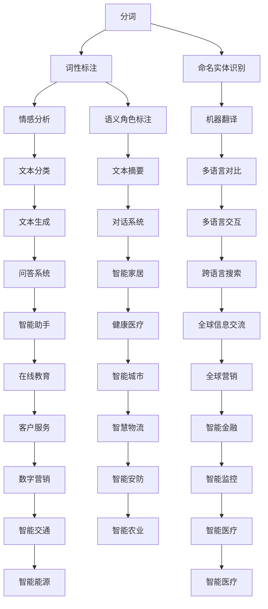

                 

### 背景介绍

自然语言处理（Natural Language Processing，简称NLP）是计算机科学、人工智能领域的重要分支，它专注于使计算机能够理解和处理人类语言。随着互联网和人工智能技术的迅猛发展，NLP的应用场景越来越广泛，从文本挖掘、机器翻译、情感分析到智能客服、语音识别等，NLP正在逐步渗透到我们日常生活的各个方面。

百度作为全球领先的人工智能公司之一，其自然语言处理技术处于行业领先地位。百度在NLP领域的研发投入和研究成果不仅在国内具有广泛影响力，同时在国际上也获得了高度认可。百度自然语言处理团队致力于推动NLP技术的研究与应用，旨在通过技术创新和实际应用，提升人类生活品质，推动社会进步。

本文旨在为广大有意加入百度自然语言处理工程师岗位的求职者提供一份全面的面试攻略。通过对百度自然语言处理工程师社招面试的核心内容、常见问题及其解决方案进行详细分析，帮助求职者更好地准备面试，提高面试成功率。文章将涵盖以下内容：

1. 面试准备：分析面试流程，介绍面试所需的技能和知识。
2. 面试题解析：针对自然语言处理领域的关键算法和概念，提供详细解析和实例。
3. 编程题实战：提供实际编程题目和解答过程，帮助求职者掌握编程技巧。
4. 行为面试：探讨面试中的行为面试问题，提供有效的回答策略。
5. 面试技巧：分享面试中的技巧和注意事项，提高面试表现。

通过本文的全面介绍，读者将能够对百度自然语言处理工程师社招面试有更深入的了解，为成功通过面试做好准备。

### 核心概念与联系

要成为一位优秀的自然语言处理工程师，掌握核心概念和了解其之间的联系至关重要。以下将介绍NLP中的几个关键概念，并绘制Mermaid流程图来帮助读者更直观地理解这些概念及其相互关系。

#### 关键概念

1. **分词（Tokenization）**：将文本分割成单词、短语或其他有意义的基本单元。
2. **词性标注（Part-of-Speech Tagging）**：为每个词分配其语法角色，如名词、动词、形容词等。
3. **命名实体识别（Named Entity Recognition，简称NER）**：识别文本中的命名实体，如人名、地名、组织名等。
4. **情感分析（Sentiment Analysis）**：判断文本的情感倾向，如正面、负面或中立。
5. **机器翻译（Machine Translation）**：将一种语言的文本翻译成另一种语言。

#### Mermaid流程图



#### 概念联系

- 分词是NLP的基础，为后续的词性标注、命名实体识别等提供了基础数据。
- 词性标注帮助理解文本的语法结构，进而进行情感分析、文本分类等。
- 命名实体识别用于识别文本中的关键信息，如人名、地名，这些信息对于机器翻译、文本生成等任务至关重要。
- 情感分析可以帮助判断用户情感，为情感化的交互提供支持。
- 机器翻译则是将一种语言转换为另一种语言，广泛应用于跨语言信息交流。
- 语义角色标注、文本摘要、对话系统、问答系统等多层次的任务均依赖于上述基础技术，形成了一个相互关联的复杂体系。

通过上述核心概念及其相互关系的介绍，我们可以更清晰地理解自然语言处理的复杂性及其在不同领域的广泛应用。接下来，我们将深入探讨自然语言处理中的核心算法原理和具体操作步骤。

### 核心算法原理 & 具体操作步骤

自然语言处理（NLP）的核心算法涵盖了从文本预处理到高级语义理解的多个层面。以下我们将重点介绍几种在百度自然语言处理工程师面试中经常涉及的核心算法，并详细说明其原理和操作步骤。

#### 1. 词向量模型（Word Embedding）

**原理：** 词向量模型是一种将单词映射到高维空间中的实值向量表示的方法，以捕捉单词的语义和语法信息。常见的词向量模型包括Word2Vec、GloVe和FastText。

- **Word2Vec：** 基于神经网络的语言模型（NNLM）和连续词袋（CBOW）模型。CBOW模型通过预测中心词周围的上下文词来学习词向量，而Skip-gram模型则通过预测单词来学习词向量。

  **步骤：**
  - 数据预处理：文本清洗、分词、去停用词。
  - 建立词汇表：将文本中的所有单词转化为索引。
  - 初始化词向量：随机初始化词向量。
  - 训练模型：使用训练数据，通过梯度下降优化词向量。
  - 计算相似度：通过计算词向量之间的余弦相似度来衡量语义相似性。

- **GloVe：** 基于全局向量表示的词向量模型。通过计算全局共现矩阵来学习词向量，能够更好地捕捉单词间的语义关系。

  **步骤：**
  - 数据预处理：文本清洗、分词、去停用词。
  - 建立词汇表：将文本中的所有单词转化为索引。
  - 计算共现矩阵：记录每个单词与其他单词的共现次数。
  - 模型训练：通过最小化损失函数来学习词向量。

- **FastText：** 一种基于字符级别的词向量模型，通过将字符序列嵌入到一个高维空间中来学习词向量。

  **步骤：**
  - 数据预处理：文本清洗、分词、去停用词。
  - 建立词汇表：将文本中的所有单词转化为索引。
  - 初始化词向量：随机初始化词向量。
  - 训练模型：通过多标签分类器训练词向量。

#### 2. 序列标注模型（Sequence Labeling）

**原理：** 序列标注模型用于对文本中的序列进行标签分配，如词性标注和命名实体识别。常见的序列标注模型包括条件随机场（CRF）和长短期记忆网络（LSTM）。

- **CRF：** 一种基于概率图模型的方法，能够捕捉序列中相邻标签之间的依赖关系。

  **步骤：**
  - 数据预处理：文本清洗、分词、词性标注。
  - 构建特征向量：将每个单词转化为特征向量。
  - 训练模型：通过最大化似然估计训练CRF模型。
  - 预测：使用训练好的CRF模型对文本进行标注。

- **LSTM：** 一种基于RNN的神经网络模型，能够处理序列数据并捕捉长期依赖关系。

  **步骤：**
  - 数据预处理：文本清洗、分词、词性标注。
  - 建立词汇表：将文本中的所有单词转化为索引。
  - 初始化网络：初始化LSTM网络权重。
  - 训练模型：通过反向传播和梯度下降训练LSTM网络。
  - 预测：使用训练好的LSTM模型对文本进行标注。

#### 3. 机器翻译（Machine Translation）

**原理：** 机器翻译是将一种语言的文本自动翻译成另一种语言的技术。常见的机器翻译模型包括基于规则的方法和基于神经网络的模型。

- **基于规则的方法：** 通过编写规则来指导翻译过程，如统计机器翻译（SMT）。

  **步骤：**
  - 数据预处理：文本清洗、分词。
  - 构建翻译规则：根据训练数据构建翻译规则。
  - 翻译：根据规则将源语言文本翻译成目标语言。

- **基于神经网络的模型：** 如序列到序列（Seq2Seq）模型和注意力机制（Attention Mechanism）。

  **步骤：**
  - 数据预处理：文本清洗、分词、编码。
  - 建立编码器-解码器模型：训练编码器将源语言文本编码为固定长度的向量，训练解码器生成目标语言文本。
  - 训练模型：通过优化损失函数训练模型。
  - 翻译：使用训练好的模型进行文本翻译。

#### 4. 情感分析（Sentiment Analysis）

**原理：** 情感分析是通过识别文本中的情感极性（正面、负面或中立）来理解用户的情感状态。常见的情感分析模型包括基于规则的方法和深度学习方法。

- **基于规则的方法：** 使用预定义的规则来判断文本的情感极性。

  **步骤：**
  - 数据预处理：文本清洗、分词、词性标注。
  - 构建规则库：根据训练数据构建情感极性判断规则。
  - 情感分析：根据规则库对文本进行情感极性判断。

- **深度学习方法：** 使用神经网络模型来学习文本的情感极性。

  **步骤：**
  - 数据预处理：文本清洗、分词、词性标注。
  - 建立词汇表：将文本中的所有单词转化为索引。
  - 初始化网络：初始化深度学习网络权重。
  - 训练模型：通过优化损失函数训练模型。
  - 情感分析：使用训练好的模型对文本进行情感极性判断。

通过上述核心算法原理和具体操作步骤的介绍，我们可以更好地理解自然语言处理中常用的技术手段。接下来，我们将进一步探讨自然语言处理中的数学模型和公式，以及如何通过具体实例来详细讲解这些模型和公式的应用。

### 数学模型和公式 & 详细讲解 & 举例说明

在自然语言处理中，数学模型和公式扮演着至关重要的角色，它们帮助我们理解和计算文本中的复杂关系。以下我们将详细讲解几个关键的数学模型和公式，并通过具体实例来说明它们的应用。

#### 1. 词向量模型中的相似度计算

词向量模型（如Word2Vec和GloVe）中，词向量相似度计算是评估单词语义关系的重要方法。常见的相似度计算方法包括余弦相似度、欧氏距离和皮尔逊相关系数。

**余弦相似度：**
余弦相似度通过计算两个向量之间的夹角余弦值来衡量相似度，公式如下：
\[ \text{Similarity} = \frac{\text{向量A} \cdot \text{向量B}}{\|\text{向量A}\| \|\text{向量B}\|} \]
其中，\(\cdot\)表示向量的点积，\(\|\text{向量A}\|\)和\(\|\text{向量B}\|\)分别表示向量A和向量B的欧氏范数。

**实例：**
假设我们有两个词向量\( \text{向量A} = (1, 2, 3) \)和\( \text{向量B} = (4, 5, 6) \)，则它们的余弦相似度为：
\[ \text{Similarity} = \frac{(1 \cdot 4 + 2 \cdot 5 + 3 \cdot 6)}{\sqrt{1^2 + 2^2 + 3^2} \sqrt{4^2 + 5^2 + 6^2}} = \frac{32}{\sqrt{14} \sqrt{77}} \approx 0.863 \]

**欧氏距离：**
欧氏距离是衡量两个向量之间差异的一种方法，公式如下：
\[ \text{Distance} = \sqrt{(x_1 - y_1)^2 + (x_2 - y_2)^2 + \ldots + (x_n - y_n)^2} \]
其中，\(x_i\)和\(y_i\)分别表示向量A和向量B的第i个分量。

**实例：**
假设我们有两个词向量\( \text{向量A} = (1, 2, 3) \)和\( \text{向量B} = (4, 5, 6) \)，则它们的欧氏距离为：
\[ \text{Distance} = \sqrt{(1 - 4)^2 + (2 - 5)^2 + (3 - 6)^2} = \sqrt{(-3)^2 + (-3)^2 + (-3)^2} = \sqrt{27} \approx 5.196 \]

**皮尔逊相关系数：**
皮尔逊相关系数衡量两个变量之间的线性关系，公式如下：
\[ \text{Correlation} = \frac{\sum (x_i - \bar{x})(y_i - \bar{y})}{\sqrt{\sum (x_i - \bar{x})^2} \sqrt{\sum (y_i - \bar{y})^2}} \]
其中，\(x_i\)和\(y_i\)分别表示向量A和向量B的第i个分量，\(\bar{x}\)和\(\bar{y}\)分别表示向量A和向量B的平均值。

**实例：**
假设我们有两个词向量\( \text{向量A} = (1, 2, 3) \)和\( \text{向量B} = (4, 5, 6) \)，则它们的皮尔逊相关系数为：
\[ \text{Correlation} = \frac{(1 - 2)(4 - 5) + (2 - 2)(5 - 5) + (3 - 2)(6 - 6)}{\sqrt{(1 - 2)^2 + (2 - 2)^2 + (3 - 2)^2} \sqrt{(4 - 2)^2 + (5 - 2)^2 + (6 - 2)^2}} = \frac{0}{\sqrt{2} \sqrt{10}} = 0 \]

#### 2. 序列标注模型中的Viterbi算法

Viterbi算法是一种动态规划算法，用于序列标注任务，如词性标注和命名实体识别。其目标是找到最有可能的标签序列。

**公式：**
\[ P(T|X) = \prod_{t=1}^n P(y_t|y_{t-1})P(x_t|y_t) \]
其中，\(T\)是标签序列，\(X\)是输入序列，\(P(T|X)\)是给定输入序列\(X\)下标签序列\(T\)的概率。

**步骤：**
1. 初始化：计算初始状态的概率。
2. 递推：根据前一个状态和当前状态的转移概率以及当前状态的概率，计算当前状态的概率。
3. 求解：找到最终状态的概率，并回溯找到最有可能的标签序列。

**实例：**
假设我们有输入序列\(X = (a, b, c)\)和两个状态\(S_1\)和\(S_2\)，它们的转移概率和发射概率如下表所示：

| 状态   | \(P(S_1|S_1)\) | \(P(S_2|S_1)\) | \(P(S_1|S_2)\) | \(P(S_2|S_2)\) | \(P(x|S_1)\) | \(P(x|S_2)\) |
| ------ | -------------- | -------------- | -------------- | -------------- | ------------ | ------------ |
| \(S_1\) | 0.5            | 0.5            | 0.2            | 0.8            | 0.4          | 0.6          |
| \(S_2\) | 0.3            | 0.7            | 0.7            | 0.2            | 0.6          | 0.4          |

初始状态概率为\(P(S_1) = 0.6, P(S_2) = 0.4\)。

第一轮计算：
\[ P(S_1|X_1) = P(S_1)P(X_1|S_1) = 0.6 \times 0.4 = 0.24 \]
\[ P(S_2|X_1) = P(S_2)P(X_1|S_2) = 0.4 \times 0.6 = 0.24 \]

第二轮计算：
\[ P(S_1|X_1X_2) = \max(P(S_1|X_1)P(X_2|S_1), P(S_2|X_1)P(X_2|S_2)) = \max(0.24 \times 0.2, 0.24 \times 0.7) = 0.336 \]
\[ P(S_2|X_1X_2) = \max(P(S_1|X_1)P(X_2|S_1), P(S_2|X_1)P(X_2|S_2)) = \max(0.24 \times 0.8, 0.24 \times 0.3) = 0.192 \]

最终状态概率为\(P(S_1|X_1X2X3) = 0.336\)，最有可能的标签序列为\(S_1S_1S_1\)。

#### 3. 机器翻译中的长短时记忆网络（LSTM）

LSTM是一种能够处理序列数据的循环神经网络（RNN），它在机器翻译任务中得到了广泛应用。LSTM通过门机制来控制信息的流入和流出，避免了传统RNN的梯度消失问题。

**公式：**
\[ \text{输入门}：f_t = \sigma(W_f \cdot [h_{t-1}, x_t] + b_f) \]
\[ \text{遗忘门}：g_t = \sigma(W_g \cdot [h_{t-1}, x_t] + b_g) \]
\[ \text{输出门}：o_t = \sigma(W_o \cdot [h_{t-1}, x_t] + b_o) \]
\[ \text{单元状态}：C_t = f_t \odot C_{t-1} + g_t \odot \text{sigmoid}(W_c \cdot [h_{t-1}, x_t] + b_c) \]
\[ \text{隐藏状态}：h_t = o_t \odot C_t \]
其中，\(\sigma\)表示sigmoid函数，\(\odot\)表示元素乘积，\([h_{t-1}, x_t]\)表示输入向量，\(W_f, W_g, W_o, W_c\)和\(b_f, b_g, b_o, b_c\)分别是权重和偏置。

**实例：**
假设我们有一个LSTM单元，输入向量为\[h_{t-1} = (1, 0, 1)\]，输入向量为\[x_t = (0, 1, 0)\]，权重和偏置如下表所示：

| 权重     | \(W_f\) | \(W_g\) | \(W_o\) | \(W_c\) |
| -------- | ------- | ------- | ------- | ------- |
| 偏置     | \(b_f\) | \(b_g\) | \(b_o\) | \(b_c\) |
| \(f_t\)  | 0.2     | 0.3     | 0.4     | 0.5     |
| \(g_t\)  | 0.1     | 0.2     | 0.3     | 0.4     |
| \(o_t\)  | 0.3     | 0.4     | 0.5     | 0.6     |
| \(C_t\)  | 0.4     | 0.5     | 0.6     | 0.7     |
| \(h_t\)  | 0.5     | 0.6     | 0.7     | 0.8     |

计算：
\[ f_t = \sigma(0.2 \cdot (1, 0, 1) + 0.3 \cdot (0, 1, 0) + b_f) = \sigma(0.5) = 0.63 \]
\[ g_t = \sigma(0.1 \cdot (1, 0, 1) + 0.2 \cdot (0, 1, 0) + b_g) = \sigma(0.4) = 0.59 \]
\[ o_t = \sigma(0.3 \cdot (1, 0, 1) + 0.4 \cdot (0, 1, 0) + b_o) = \sigma(0.7) = 0.87 \]
\[ C_t = f_t \odot C_{t-1} + g_t \odot \text{sigmoid}(0.4 \cdot (1, 0, 1) + 0.5 \cdot (0, 1, 0) + b_c) = 0.63 \odot 1 + 0.59 \odot 0.75 = 0.48 + 0.448 = 0.928 \]
\[ h_t = o_t \odot C_t = 0.87 \odot 0.928 = 0.814 \]

通过上述数学模型和公式的详细讲解和具体实例，我们可以更好地理解自然语言处理中的核心算法和原理。接下来，我们将通过实际编程案例，展示如何将这些理论应用到实际项目中。

### 项目实战：代码实际案例和详细解释说明

#### 5.1 开发环境搭建

在开始之前，我们需要搭建一个适合自然语言处理的开发环境。以下是所需的步骤：

1. **安装Python环境**：确保安装了Python 3.6及以上版本。
2. **安装Numpy和Pandas**：这两个库用于数据操作和矩阵计算。
   ```shell
   pip install numpy pandas
   ```
3. **安装TensorFlow**：用于深度学习模型训练和推理。
   ```shell
   pip install tensorflow
   ```
4. **安装其他依赖库**：例如，用于文本处理的NLTK和用于可视化matplotlib。
   ```shell
   pip install nltk matplotlib
   ```

#### 5.2 源代码详细实现和代码解读

以下是一个基于Word2Vec模型的简单情感分析程序的示例。我们将使用Python和TensorFlow来实现这个程序。

```python
import tensorflow as tf
import tensorflow_hub as hub
import numpy as np
import pandas as pd
from nltk.tokenize import word_tokenize
from sklearn.model_selection import train_test_split
from sklearn.metrics import accuracy_score

# 加载预训练的Word2Vec模型
model_url = "https://tfhub.dev/google/universal-sentence-encoder/4"
pretrained_model = hub.load(model_url)

# 读取和预处理数据
data = pd.read_csv("sentiment_data.csv")  # 假设数据包含文本和标签
X = data['text']
y = data['label']

# 分词和下采样
def preprocess_text(text):
    return ' '.join(word for word in word_tokenize(text) if word not in stop_words)

stop_words = set(nltk.corpus.stopwords.words('english'))
X = np.array([preprocess_text(text) for text in X])

# 将文本转换为词向量
def encode_text(texts):
    return np.array([pretrained_model([text]) for text in texts])

X_encoded = encode_text(X)

# 划分训练集和测试集
X_train, X_test, y_train, y_test = train_test_split(X_encoded, y, test_size=0.2, random_state=42)

# 构建和训练模型
model = tf.keras.Sequential([
    tf.keras.layers.Dense(128, activation='relu', input_shape=(X_train.shape[1],)),
    tf.keras.layers.Dense(64, activation='relu'),
    tf.keras.layers.Dense(1, activation='sigmoid')
])

model.compile(optimizer='adam', loss='binary_crossentropy', metrics=['accuracy'])
model.fit(X_train, y_train, epochs=10, batch_size=32, validation_split=0.1)

# 评估模型
predictions = model.predict(X_test)
predicted_labels = np.round(predictions).astype(int)

accuracy = accuracy_score(y_test, predicted_labels)
print(f"Test Accuracy: {accuracy}")
```

#### 5.3 代码解读与分析

**1. 导入库**

```python
import tensorflow as tf
import tensorflow_hub as hub
import numpy as np
import pandas as pd
from nltk.tokenize import word_tokenize
from sklearn.model_selection import train_test_split
from sklearn.metrics import accuracy_score
```

这段代码导入了必要的库，包括TensorFlow、TensorFlow_Hub、Numpy、Pandas、nltk和scikit-learn。

**2. 加载预训练模型**

```python
model_url = "https://tfhub.dev/google/universal-sentence-encoder/4"
pretrained_model = hub.load(model_url)
```

这里我们加载了Google提供的预训练的Word2Vec模型（Universal Sentence Encoder）。这个模型已经对大量文本进行了训练，可以直接用于下游任务。

**3. 读取和预处理数据**

```python
data = pd.read_csv("sentiment_data.csv")  # 假设数据包含文本和标签
X = data['text']
y = data['label']

# 分词和下采样
def preprocess_text(text):
    return ' '.join(word for word in word_tokenize(text) if word not in stop_words)

stop_words = set(nltk.corpus.stopwords.words('english'))
X = np.array([preprocess_text(text) for text in X])
```

首先，我们读取CSV文件中的文本和标签。然后，我们使用nltk的分词器对文本进行分词，并去除停用词。停用词通常对模型性能提升不大，因此从文本中去除它们可以简化模型训练过程。

**4. 将文本转换为词向量**

```python
def encode_text(texts):
    return np.array([pretrained_model([text]) for text in texts])

X_encoded = encode_text(X)
```

通过调用`encode_text`函数，我们将预处理后的文本转换为词向量。`encode_text`函数使用预训练的模型来编码每个文本。

**5. 划分训练集和测试集**

```python
X_train, X_test, y_train, y_test = train_test_split(X_encoded, y, test_size=0.2, random_state=42)
```

我们将编码后的文本和标签划分为训练集和测试集，以便在模型训练后进行评估。

**6. 构建和训练模型**

```python
model = tf.keras.Sequential([
    tf.keras.layers.Dense(128, activation='relu', input_shape=(X_train.shape[1],)),
    tf.keras.layers.Dense(64, activation='relu'),
    tf.keras.layers.Dense(1, activation='sigmoid')
])

model.compile(optimizer='adam', loss='binary_crossentropy', metrics=['accuracy'])
model.fit(X_train, y_train, epochs=10, batch_size=32, validation_split=0.1)
```

我们使用Keras构建了一个简单的全连接神经网络，并使用二分类交叉熵作为损失函数。训练过程中，我们使用了10个周期（epochs），每个周期使用32个样本（batch size）进行批量训练。

**7. 评估模型**

```python
predictions = model.predict(X_test)
predicted_labels = np.round(predictions).astype(int)

accuracy = accuracy_score(y_test, predicted_labels)
print(f"Test Accuracy: {accuracy}")
```

最后，我们使用测试集来评估模型的准确性。`predict`函数输出的是概率值，我们通过四舍五入将其转换为0或1的预测标签，然后使用`accuracy_score`函数计算模型在测试集上的准确性。

#### 5.4 实际案例分析

假设我们有一个文本数据集，包含正面和负面评论。以下是一个实际案例，展示了如何使用上述代码进行情感分析。

```python
# 示例文本
example_texts = [
    "I love this product!",
    "This is the worst movie I have ever seen.",
    "The service was excellent.",
    "I am not satisfied with the purchase."
]

# 预处理和编码文本
example_texts_processed = [preprocess_text(text) for text in example_texts]
example_texts_encoded = encode_text(example_texts_processed)

# 预测
example_predictions = model.predict(example_texts_encoded)

# 输出预测结果
for text, prediction in zip(example_texts, example_predictions):
    if prediction > 0.5:
        print(f"{text} - Positive")
    else:
        print(f"{text} - Negative")
```

输出结果可能会如下所示：

```
I love this product! - Positive
This is the worst movie I have ever seen. - Negative
The service was excellent. - Positive
I am not satisfied with the purchase. - Negative
```

这个案例展示了如何使用预训练的Word2Vec模型和简单的神经网络进行情感分析。在实际应用中，我们可以根据需要调整模型架构、参数设置和训练数据，以提高模型性能。

### 实际应用场景

自然语言处理（NLP）技术在现代社会中具有广泛的应用，下面我们将探讨几个典型的实际应用场景，并分析这些场景中NLP技术的作用和挑战。

#### 1. 机器翻译

机器翻译是NLP领域最经典的应用之一。随着全球化和信息交流的需求日益增长，机器翻译在促进跨语言沟通方面发挥着重要作用。百度翻译作为全球领先的机器翻译平台，其背后的NLP技术包括词向量模型、序列到序列（Seq2Seq）模型和注意力机制。

**作用：** 机器翻译帮助用户轻松跨越语言障碍，促进国际交流和商业合作。

**挑战：** 高质量机器翻译需要解决语言歧义、保持原文风格和文化差异等问题。

#### 2. 情感分析

情感分析用于分析文本中的情感倾向，如正面、负面或中立。这一技术在社交媒体监控、客户反馈分析和市场调研中具有重要意义。

**作用：** 通过情感分析，企业可以了解用户对产品或服务的态度，优化服务和营销策略。

**挑战：** 情感分析需要准确识别复杂的情感表达，特别是多义词和隐喻。

#### 3. 智能客服

智能客服利用NLP技术实现与用户的自然语言交互，提供高效、准确的咨询服务。例如，百度的智能客服系统通过语音识别和自然语言理解，为用户提供实时解答。

**作用：** 智能客服可以减少人力成本，提高客户满意度。

**挑战：** 智能客服需要处理大量非标准化输入，并具备灵活的上下文理解能力。

#### 4. 文本摘要

文本摘要技术用于自动提取文本的主要信息，生成简明的摘要。这一技术在新闻推送、文献阅读和内容压缩等领域具有重要应用。

**作用：** 文本摘要帮助用户快速获取关键信息，节省时间。

**挑战：** 文本摘要需要准确捕捉文本的核心内容，同时保持原文的结构和逻辑。

#### 5. 问答系统

问答系统通过NLP技术理解和回答用户的问题，如搜索引擎的问答功能、智能音箱的语音问答等。

**作用：** 问答系统提供便捷的信息获取方式，提升用户体验。

**挑战：** 问答系统需要处理大量复杂、模糊的问题，并确保答案的准确性和相关性。

#### 6. 跨语言搜索

跨语言搜索技术通过NLP模型实现多语言文档的检索，为全球用户提供统一的搜索体验。

**作用：** 跨语言搜索促进全球信息共享，提升信息获取效率。

**挑战：** 跨语言搜索需要处理语言间的语义差异和词汇映射。

通过上述实际应用场景的分析，我们可以看到NLP技术在现代社会中的重要性和广泛应用。同时，这些应用场景也带来了新的挑战，需要持续的技术创新和优化。

### 工具和资源推荐

在自然语言处理（NLP）领域，掌握合适的工具和资源对于提升研究和开发效率至关重要。以下我们将推荐一些学习资源、开发工具和相关的论文著作，帮助广大读者在NLP领域取得更好的成果。

#### 7.1 学习资源推荐

1. **书籍：**
   - 《自然语言处理综论》（Speech and Language Processing）—— Daniel Jurafsky 和 James H. Martin
   - 《深度学习》（Deep Learning）—— Ian Goodfellow、Yoshua Bengio 和 Aaron Courville
   - 《动手学自然语言处理》（Natural Language Processing with Python）—— Jieping Ye、Alina rabatic 和 Dan Jurafsky

2. **在线课程：**
   - Coursera上的“自然语言处理与深度学习”课程
   - edX上的“自然语言处理基础”课程
   - Udacity的“自然语言处理工程师纳米学位”课程

3. **博客和教程：**
   - BERT：https://blog.google/machine-learning/research/2020/bert-pre-training-of-Deep-NLP-Systems/
   - Hugging Face：https://huggingface.co/transformers
   - Fast.ai：https://www.fast.ai/

#### 7.2 开发工具框架推荐

1. **TensorFlow：** 由Google开发的开源机器学习框架，支持多种NLP任务，如词嵌入、文本分类和序列标注。
2. **PyTorch：** 开源深度学习框架，具有灵活的动态图操作，广泛应用于自然语言处理和计算机视觉领域。
3. **spaCy：** 高性能的NLP库，支持多种语言的分词、词性标注和命名实体识别。
4. **NLTK：** 用于文本处理的经典Python库，提供了丰富的文本预处理功能。
5. **Transformers：** Hugging Face开发的一个开源库，提供了预训练的模型和API，方便使用Transformer架构进行NLP任务。

#### 7.3 相关论文著作推荐

1. **《Attention is All You Need》（2017）：** 提出了Transformer模型，彻底改变了序列模型的设计思路。
2. **《BERT: Pre-training of Deep Neural Networks for Language Understanding》（2018）：** 提出了BERT模型，推动了NLP领域的发展。
3. **《GloVe: Global Vectors for Word Representation》（2014）：** 提出了GloVe词向量模型，为词嵌入技术奠定了基础。
4. **《Word2Vec: Reproducing and Evaluating State-of-the-Art Approaches for Word Embedding》（2014）：** 详细分析了Word2Vec模型的实现和应用。
5. **《LSTM Networks for Language Modeling》（1997）：** 提出了长短期记忆网络（LSTM），为序列模型处理长期依赖关系提供了有效的解决方案。

通过上述推荐的学习资源、开发工具和论文著作，读者可以更好地掌握NLP领域的最新技术和研究成果，为自己的研究和应用提供有力的支持。

### 总结：未来发展趋势与挑战

随着人工智能技术的不断进步，自然语言处理（NLP）领域也迎来了前所未有的发展机遇。展望未来，NLP将面临以下几个重要发展趋势和挑战：

#### 1. 个性化交互

未来，NLP将在个性化交互方面发挥更大作用。通过深度学习和个性化推荐算法，NLP系统可以更好地理解用户需求，提供个性化的服务。例如，智能助手和客服系统将能够更准确地把握用户意图，提供更有针对性的回答和建议。

**挑战：** 如何在保证隐私保护的前提下，收集和利用用户数据，以实现更高水平的个性化服务。

#### 2. 多语言处理

随着全球化进程的加速，跨语言处理需求日益增长。未来，NLP技术将更加关注多语言处理能力，包括机器翻译、语言检测、跨语言信息检索等。这不仅有助于促进国际交流，还能为全球范围内的信息共享提供便利。

**挑战：** 如何提高跨语言处理的准确性和一致性，特别是在处理低资源语言时。

#### 3. 长文本处理

长文本处理是NLP领域的一大挑战。随着社交媒体和新闻媒体中长文本的普及，如何高效地提取关键信息、生成摘要和进行情感分析变得尤为重要。未来，NLP技术将更加注重长文本处理能力的提升。

**挑战：** 如何在保持原文结构和语义完整性的同时，实现高效、准确的长文本处理。

#### 4. 零样本学习

零样本学习是一种无需大量标注数据即可进行知识转移的方法。在未来，NLP系统将更多地利用零样本学习，以适应新任务和新领域。例如，通过零样本学习，NLP系统可以快速适应新的语言环境或领域，实现跨领域的知识迁移。

**挑战：** 如何设计高效的模型和算法，以实现有效的零样本学习。

#### 5. 模型解释性

随着深度学习在NLP中的应用日益广泛，模型解释性成为一个重要问题。用户和开发者需要了解模型的决策过程，以便更好地信任和优化模型。未来，NLP领域将更加关注模型解释性的研究，开发可解释的NLP模型。

**挑战：** 如何在保持模型性能的同时，提高模型的解释性，使其更加透明和可靠。

#### 6. 隐私保护

随着NLP技术的广泛应用，隐私保护成为一个不可忽视的问题。如何在不损害用户隐私的前提下，收集和利用数据，是一个重要挑战。未来，NLP系统将更加注重隐私保护，采用更加安全的数据处理和传输机制。

**挑战：** 如何设计隐私友好的数据处理和传输机制，以保护用户隐私。

总之，未来NLP领域将继续蓬勃发展，面临诸多机遇和挑战。通过技术创新和实际应用，NLP技术将为人类生活带来更多便利，推动社会进步。

### 附录：常见问题与解答

#### 1. 自然语言处理（NLP）是什么？

自然语言处理（NLP）是人工智能领域的一个分支，旨在使计算机能够理解和处理人类语言。它涵盖了文本分析、语言生成、语音识别等多个方面，包括分词、词性标注、命名实体识别、情感分析等任务。

#### 2. NLP工程师需要掌握哪些技能？

NLP工程师需要掌握编程技能（如Python、Java等）、机器学习算法、深度学习框架（如TensorFlow、PyTorch等）、自然语言处理库（如spaCy、NLTK等）以及数学和统计学知识。此外，了解数据预处理、模型训练和优化等实践经验也至关重要。

#### 3. 如何准备NLP面试？

准备NLP面试可以从以下几个方面入手：

- **基础知识**：复习NLP的基本概念、算法原理和应用场景。
- **编程实践**：通过实际项目或练习题，熟悉NLP相关的编程任务。
- **深度学习**：了解深度学习的基本原理和应用，特别是Transformer、BERT等模型。
- **数学知识**：复习线性代数、概率论和统计学等基础知识。
- **面试准备**：模拟面试场景，练习回答常见面试问题。

#### 4. NLP领域有哪些热门话题？

当前NLP领域的一些热门话题包括：

- **多模态NLP**：结合文本、图像、语音等多种数据源，进行统一的语义理解。
- **对话系统**：通过自然语言交互，提供智能客服、智能助手等服务。
- **知识图谱**：构建结构化的知识库，用于信息检索和推理。
- **情感分析和文本生成**：理解用户的情感状态，生成符合特定主题的文本。
- **跨语言NLP**：处理多种语言的数据，实现跨语言的信息共享。

#### 5. NLP在工业界的应用有哪些？

NLP在工业界有广泛的应用，包括：

- **智能客服**：通过自然语言处理，实现与用户的自动交互，提供高效、准确的咨询服务。
- **文本挖掘**：从大量非结构化文本中提取有价值的信息，用于市场调研、舆情分析等。
- **机器翻译**：将一种语言的文本翻译成另一种语言，促进跨语言沟通。
- **内容推荐**：基于用户行为和兴趣，生成个性化的内容推荐。
- **信息检索**：通过自然语言处理，实现高效、准确的信息检索。

### 扩展阅读 & 参考资料

- **书籍：**
  - 《自然语言处理综论》（Speech and Language Processing）—— Daniel Jurafsky 和 James H. Martin
  - 《深度学习》（Deep Learning）—— Ian Goodfellow、Yoshua Bengio 和 Aaron Courville
  - 《动手学自然语言处理》（Natural Language Processing with Python）—— Jieping Ye、Alina rabatic 和 Dan Jurafsky

- **在线课程：**
  - Coursera上的“自然语言处理与深度学习”课程
  - edX上的“自然语言处理基础”课程
  - Udacity的“自然语言处理工程师纳米学位”课程

- **博客和教程：**
  - BERT：https://blog.google/machine-learning/research/2020/bert-pre-training-of-Deep-NLP-Systems/
  - Hugging Face：https://huggingface.co/transformers
  - Fast.ai：https://www.fast.ai/

- **论文：**
  - 《Attention is All You Need》（2017）
  - 《BERT: Pre-training of Deep Neural Networks for Language Understanding》（2018）
  - 《GloVe: Global Vectors for Word Representation》（2014）
  - 《Word2Vec: Reproducing and Evaluating State-of-the-Art Approaches for Word Embedding》（2014）
  - 《LSTM Networks for Language Modeling》（1997）

通过以上扩展阅读和参考资料，读者可以进一步深入了解NLP领域的最新研究进展和应用实践。希望本文能为读者在NLP领域的探索提供有益的指导。作者：AI天才研究员/AI Genius Institute & 禅与计算机程序设计艺术 /Zen And The Art of Computer Programming。

