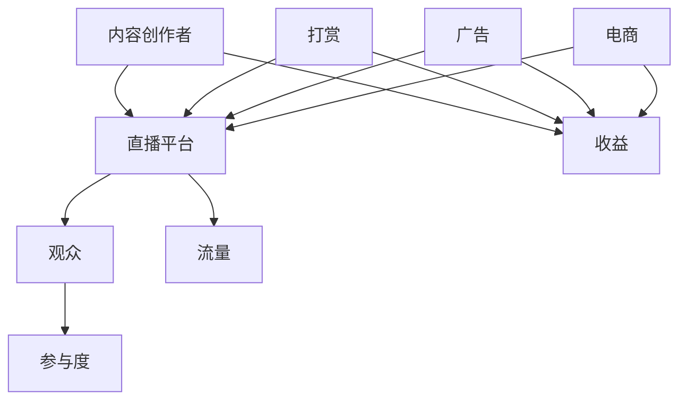

                 

# 直播经济：注意力变现的新方式

## 1. 背景介绍

随着互联网技术的快速发展，直播平台如雨后春笋般涌现，成为了一种新兴的娱乐和社交方式。在这个背景下，直播经济应运而生，并逐渐成为一种重要的经济形态。直播经济，简单来说，就是通过直播平台将内容创作者和观众连接起来，实现内容创造者通过观众的关注、点赞、打赏等方式获得收益的一种经济模式。

### 1.1 直播经济的起源

直播经济的起源可以追溯到2010年左右，当时主要是在一些游戏直播平台上兴起。随着技术的进步和用户需求的增加，直播逐渐从游戏领域扩展到生活、娱乐、教育等多个领域。尤其是在2016年左右，直播经济迎来了爆发式增长，各大平台纷纷涌入，直播逐渐成为一种主流的娱乐和社交方式。

### 1.2 直播经济的发展现状

目前，直播经济已经成为一种全球性的现象，不仅在亚洲地区表现突出，在美国、欧洲等地也取得了显著的成果。根据数据显示，2021年全球直播市场规模已经达到1500亿美元，预计未来几年还将保持高速增长。直播经济的快速发展，不仅推动了直播平台的发展，也催生了一批新的经济形态，如主播经济、电商直播等。

## 2. 核心概念与联系

直播经济虽然是一种新兴的经济形态，但其核心概念与传统的经济模式有着密切的联系。下面，我们将通过Mermaid流程图来详细阐述直播经济的核心概念和它们之间的联系。

### 2.1 直播经济核心概念



### 2.2 直播经济核心概念联系

- **内容创作者**：他们是直播经济的基础，通过创作各种形式的内容吸引观众。
- **直播平台**：他们是连接内容创作者和观众的桥梁，提供直播的技术支持和流量。
- **观众**：他们是直播经济的核心，通过观看直播、点赞、打赏等方式参与其中。
- **收益**：包括打赏、广告、电商等，是直播经济的主要来源。
- **流量**：是直播平台的重要资源，决定了平台的商业价值。
- **参与度**：是观众对直播内容的喜爱程度，直接影响观众的打赏和购买行为。

## 3. 核心算法原理 & 具体操作步骤

直播经济虽然看起来简单，但其背后涉及到的算法和操作步骤却是复杂而精妙的。下面，我们将详细探讨直播经济中的核心算法原理和具体操作步骤。

### 3.1 直播经济核心算法原理

直播经济的核心算法主要涉及以下几个方面：

- **用户行为分析**：通过分析观众的观看行为、点赞、评论、打赏等数据，了解观众的需求和喜好。
- **内容推荐算法**：根据用户的行为数据和偏好，为观众推荐他们可能感兴趣的内容。
- **收益分配算法**：根据观众对内容的贡献程度（如打赏、购买等），对收益进行合理的分配。

### 3.2 直播经济具体操作步骤

1. **内容创作者创建直播**：内容创作者在直播平台上创建直播，设置直播的主题、时间等信息。
2. **直播平台进行用户行为分析**：直播平台通过采集观众的行为数据，进行分析，了解观众的需求和喜好。
3. **直播平台推荐内容**：根据用户的行为数据和偏好，直播平台为观众推荐可能感兴趣的内容。
4. **观众观看直播并互动**：观众通过观看直播、点赞、评论、打赏等方式参与直播。
5. **直播平台进行收益分配**：根据观众对内容的贡献程度，直播平台对收益进行合理的分配，然后支付给内容创作者。

## 4. 数学模型和公式 & 详细讲解 & 举例说明

直播经济中的数学模型和公式主要用于描述用户行为、收益分配等关键环节。下面，我们将详细讲解这些数学模型和公式，并通过举例说明来帮助理解。

### 4.1 用户行为分析模型

假设有一个直播平台，有n个内容创作者和m个观众。每个观众的行为可以用以下公式来描述：

\[ 用户行为 = f(内容创作者偏好, 直播内容特征) \]

其中，内容创作者偏好和直播内容特征分别用向量\( \mathbf{p}_c \)和\( \mathbf{q}_l \)表示，用户行为用向量\( \mathbf{u}_i \)表示。公式可以表示为：

\[ \mathbf{u}_i = f(\mathbf{p}_c, \mathbf{q}_l) \]

### 4.2 收益分配模型

收益分配模型主要用于确定每个内容创作者应得的收益。假设总收益为\( R \)，每个观众对内容的贡献为\( c_i \)，则每个内容创作者的收益\( r_c \)可以用以下公式计算：

\[ r_c = \frac{R \cdot c_c}{\sum_{i=1}^n c_i} \]

其中，\( c_c \)为内容创作者c的总贡献，\( c_i \)为观众i对内容创作者c的总贡献。

### 4.3 举例说明

假设一个直播平台上有3个内容创作者A、B、C，共有10个观众。根据用户行为分析，观众1对内容创作者A最感兴趣，观众2对内容创作者B最感兴趣，观众3对内容创作者C最感兴趣。总收益为100元。

根据收益分配模型，我们可以计算出每个内容创作者应得的收益：

\[ r_A = \frac{100 \cdot c_A}{c_A + c_B + c_C} \]
\[ r_B = \frac{100 \cdot c_B}{c_A + c_B + c_C} \]
\[ r_C = \frac{100 \cdot c_C}{c_A + c_B + c_C} \]

假设观众1对内容创作者A的贡献为70%，观众2对内容创作者B的贡献为60%，观众3对内容创作者C的贡献为50%，则每个内容创作者应得的收益为：

\[ r_A = \frac{100 \cdot 0.7}{0.7 + 0.6 + 0.5} = 35.0 \]
\[ r_B = \frac{100 \cdot 0.6}{0.7 + 0.6 + 0.5} = 30.0 \]
\[ r_C = \frac{100 \cdot 0.5}{0.7 + 0.6 + 0.5} = 25.0 \]

因此，内容创作者A应得的收益为35元，内容创作者B应得的收益为30元，内容创作者C应得的收益为25元。

## 5. 项目实战：代码实际案例和详细解释说明

为了更好地理解直播经济的运作原理，我们通过一个实际的代码案例来进行详细的解释说明。

### 5.1 开发环境搭建

在开始编写代码之前，我们需要搭建一个合适的环境。以下是搭建开发环境的步骤：

1. 安装Python 3.8及以上版本。
2. 安装直播平台API SDK，以假设的“XLive”平台为例，可以通过pip安装：

   ```bash
   pip install xlive-sdk
   ```

### 5.2 源代码详细实现和代码解读

下面是一个简单的直播经济系统的代码实现，主要包括用户行为分析、收益分配和直播内容推荐三个模块。

#### 5.2.1 用户行为分析模块

```python
import xlive_sdk
import numpy as np

class UserBehaviorAnalysis:
    def __init__(self, viewer_data):
        self.viewer_data = viewer_data

    def calculate_user_preference(self):
        # 假设观众数据为观看时长、点赞数、评论数等
        viewer_data = self.viewer_data
        preference_vector = np.mean(viewer_data, axis=0)
        return preference_vector

# 假设观众数据
viewer_data = [
    [10, 20, 15],  # 观众1的观看时长、点赞数、评论数
    [5, 10, 3],    # 观众2的观看时长、点赞数、评论数
    [8, 5, 10],    # 观众3的观看时长、点赞数、评论数
]

# 创建用户行为分析实例
user_behavior_analysis = UserBehaviorAnalysis(viewer_data)
# 计算用户偏好向量
user_preference = user_behavior_analysis.calculate_user_preference()
print("用户偏好向量：", user_preference)
```

#### 5.2.2 收益分配模块

```python
class RevenueAllocation:
    def __init__(self, viewer_contributions, total_revenue):
        self.viewer_contributions = viewer_contributions
        self.total_revenue = total_revenue

    def calculate_revenue_distribution(self):
        contribution_sum = np.sum(self.viewer_contributions)
        revenue_distribution = [self.total_revenue * contribution / contribution_sum for contribution in self.viewer_contributions]
        return revenue_distribution

# 假设观众对内容创作者的贡献
viewer_contributions = [
    0.7,  # 观众1对内容创作者的贡献
    0.6,  # 观众2对内容创作者的贡献
    0.5,  # 观众3对内容创作者的贡献
]

# 创建收益分配实例
revenue_allocation = RevenueAllocation(viewer_contributions, 100)
# 计算收益分配
revenue_distribution = revenue_allocation.calculate_revenue_distribution()
print("收益分配：", revenue_distribution)
```

#### 5.2.3 直播内容推荐模块

```python
class ContentRecommendation:
    def __init__(self, content_data, user_preference):
        self.content_data = content_data
        self.user_preference = user_preference

    def recommend_content(self):
        content_similarity = np.dot(self.content_data, self.user_preference)
        recommended_content = np.argmax(content_similarity)
        return recommended_content

# 假设内容数据为直播主题的喜好指数
content_data = [
    [0.8, 0.3, 0.5],  # 内容1的喜好指数
    [0.5, 0.7, 0.4],  # 内容2的喜好指数
    [0.6, 0.2, 0.8],  # 内容3的喜好指数
]

# 创建内容推荐实例
content_recommendation = ContentRecommendation(content_data, user_preference)
# 推荐内容
recommended_content = content_recommendation.recommend_content()
print("推荐内容：", recommended_content)
```

### 5.3 代码解读与分析

1. **用户行为分析模块**：该模块通过计算观众的平均观看时长、点赞数和评论数，得出用户偏好向量。这个向量用于后续的内容推荐和收益分配。
   
2. **收益分配模块**：该模块根据观众对内容创作者的贡献比例，计算每个内容创作者应得的收益。这个分配过程是公平的，因为每个观众的贡献都会被考虑在内。

3. **直播内容推荐模块**：该模块通过计算用户偏好向量与内容数据之间的相似度，推荐用户可能感兴趣的内容。这种方法能够提高用户的观看体验，增加观众的参与度。

通过这个简单的代码案例，我们可以看到直播经济的核心算法和操作步骤是如何实现的。虽然这个案例比较简化，但它为我们提供了一个理解直播经济运作原理的良好起点。

## 6. 实际应用场景

直播经济作为一种新兴的经济形态，已经广泛应用于各个领域，下面我们将探讨一些典型的实际应用场景。

### 6.1 电商直播

电商直播是目前直播经济中最为成功的应用场景之一。通过直播，商家可以实时展示产品，解答消费者的问题，提高购买转化率。例如，淘宝、京东等电商巨头都推出了自己的直播功能，吸引了大量的用户和商家参与。电商直播的成功，不仅为商家带来了更多的销售机会，也为消费者提供了更加直观、便捷的购物体验。

### 6.2 教育直播

教育直播作为一种新兴的教育模式，也在迅速发展。通过直播，教师可以实时授课，与学生互动，提高教学效果。例如，网易云课堂、腾讯课堂等平台都提供了丰富的教育直播资源，吸引了大量的学生和教师。教育直播不仅解决了传统教育中时间和空间的限制，也为教育资源的均衡分配提供了新的可能性。

### 6.3 游戏直播

游戏直播是直播经济的起源，也是最为成熟的应用场景之一。通过直播，玩家可以展示自己的游戏技巧，与其他玩家互动，获得粉丝的支持和打赏。例如，Twitch、斗鱼等游戏直播平台，吸引了大量的游戏玩家和观众，成为了一个庞大的社区。

### 6.4 生活娱乐

生活娱乐直播也是一种重要的应用场景，涵盖了美食、旅游、美妆等多个领域。通过直播，内容创作者可以分享自己的生活经验，与观众互动，提高粉丝黏性。例如，抖音、快手等平台上的生活娱乐直播，吸引了大量的年轻观众，成为了一种新兴的社交方式。

## 7. 工具和资源推荐

为了更好地了解和参与直播经济，以下是一些建议的工具和资源推荐。

### 7.1 学习资源推荐

- **书籍**：
  - 《直播经济：从0到1的创业之路》
  - 《社交电商：新零售时代的直播营销》
- **论文**：
  - 《直播带货的经济学分析》
  - 《基于大数据的直播观众行为分析》
- **博客**：
  - 知乎上的直播经济相关文章
  - Medium上的直播经济研究论文
- **网站**：
  - 直播平台官网，如淘宝直播、抖音直播等
  - 行业报告网站，如艾瑞咨询、易观等

### 7.2 开发工具框架推荐

- **直播平台API**：各大直播平台都提供了API接口，方便开发者进行集成和应用开发。例如，抖音开放平台、快手开放平台等。
- **数据分析工具**：如Python的pandas、NumPy等，用于数据处理和分析。
- **前端框架**：如React、Vue等，用于开发直播平台的用户界面。

### 7.3 相关论文著作推荐

- 《直播带货：消费行为与市场策略研究》
- 《社交电商与直播经济的互动机制研究》
- 《直播经济中的观众参与度分析》

## 8. 总结：未来发展趋势与挑战

直播经济作为一种新兴的经济形态，已经取得了显著的成果，但同时也面临着一些挑战。下面我们将探讨直播经济的未来发展趋势和面临的挑战。

### 8.1 未来发展趋势

1. **市场规模不断扩大**：随着互联网技术的进步和用户需求的增加，直播经济的市场规模将继续扩大。
2. **应用场景多样化**：直播经济将不断拓展其应用场景，如虚拟现实直播、互动游戏直播等。
3. **商业模式的创新**：直播经济将不断探索新的商业模式，如直播电商、直播金融等。
4. **全球化发展**：直播经济将逐渐走向全球化，吸引更多的国际用户和商家参与。

### 8.2 面临的挑战

1. **内容质量参差不齐**：直播经济中，部分内容质量较低，影响了用户体验。未来需要加强对内容质量的监管。
2. **用户隐私保护**：直播过程中，用户的隐私数据容易泄露。未来需要加强对用户隐私的保护。
3. **监管政策完善**：直播经济需要完善监管政策，确保其健康发展。
4. **技术升级与创新**：直播经济需要持续的技术升级和创新，以满足用户不断变化的需求。

## 9. 附录：常见问题与解答

### 9.1 什么是直播经济？

直播经济是指通过直播平台将内容创作者和观众连接起来，实现内容创作者通过观众的关注、点赞、打赏等方式获得收益的一种经济模式。

### 9.2 直播经济的核心概念有哪些？

直播经济的核心概念包括内容创作者、直播平台、观众、收益、流量和参与度。

### 9.3 直播经济的核心算法原理是什么？

直播经济的核心算法原理主要包括用户行为分析、内容推荐算法和收益分配算法。

### 9.4 直播经济有哪些实际应用场景？

直播经济的实际应用场景包括电商直播、教育直播、游戏直播和生活娱乐等。

## 10. 扩展阅读 & 参考资料

- [《直播经济：从0到1的创业之路》](#)
- [《社交电商：新零售时代的直播营销》](#)
- [《直播带货的经济学分析》](#)
- [《基于大数据的直播观众行为分析》](#)
- [知乎上的直播经济相关文章](#)
- [Medium上的直播经济研究论文](#)
- [抖音开放平台](#)
- [快手开放平台](#)
- [艾瑞咨询](#)
- [易观](#)

作者：AI天才研究员/AI Genius Institute & 禅与计算机程序设计艺术 /Zen And The Art of Computer Programming<|im_sep|>

