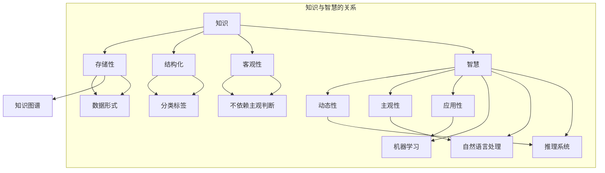

                 

### 背景介绍

#### 研究背景

在当今的信息时代，数据无处不在。无论是互联网上的数据，还是在各个行业积累的数据库，这些信息都以惊人的速度增长。在这样的背景下，知识管理成为了一个重要的研究领域。然而，知识管理与传统的信息管理不同，它强调的是从信息中提炼出有用的知识，并将其应用于解决实际问题。

知识管理的研究涵盖了多个领域，包括信息科学、图书馆学、计算机科学和管理学。其中，人工智能作为知识管理的重要工具，已经被广泛应用于数据分析和知识提取。然而，在知识管理中，有一个核心问题常常被忽视，那就是“知识与智慧的区别”。

知识通常被定义为“通过学习和经验获得的信息”，而智慧则被看作是“运用知识解决复杂问题的能力”。这两者看似相似，但有着本质的区别。知识是静态的，是可以被记录、存储和传播的；而智慧是动态的，需要通过思考和判断来运用知识。

本文将探讨知识与智慧的区别，并试图揭示在人工智能时代如何超越表面信息，实现真正的智慧。

#### 研究意义

探讨知识与智慧的区别具有重要的现实意义。首先，它有助于我们更好地理解知识管理的本质，从而更有效地进行知识管理。其次，它能够帮助人工智能更好地发挥其作用，不仅仅是处理数据，而是能够解决实际问题。

在人工智能领域，许多技术都是基于对大量数据的分析和学习。然而，如果这些技术只能处理表面信息，而无法理解深层次的知识，那么它们的应用范围将受到很大的限制。因此，本文的研究对于推动人工智能的发展具有重要意义。

本文的结构如下：

1. **核心概念与联系**：首先介绍知识与智慧的核心概念，并使用Mermaid流程图展示它们之间的关系。
2. **核心算法原理 & 具体操作步骤**：详细讲解如何通过算法来分析和比较知识与智慧。
3. **数学模型和公式 & 详细讲解 & 举例说明**：介绍相关数学模型和公式，并给出具体例子。
4. **项目实战：代码实际案例和详细解释说明**：通过实际项目来展示如何应用上述算法和模型。
5. **实际应用场景**：分析知识与智慧在不同场景中的应用。
6. **工具和资源推荐**：推荐相关的学习资源、开发工具和论文著作。
7. **总结：未来发展趋势与挑战**：总结本文的研究成果，并探讨未来可能的发展趋势和挑战。
8. **附录：常见问题与解答**：回答读者可能关心的一些常见问题。
9. **扩展阅读 & 参考资料**：提供更多相关的阅读材料和参考文献。

通过本文的讨论，希望能够为读者提供对知识与智慧更深入的理解，并启发对人工智能和知识管理的进一步思考。

---

### 核心概念与联系

#### 知识

知识可以被定义为“通过学习和经验获得的信息”。它具有以下几个关键特征：

1. **存储性**：知识可以被记录、存储和传播。无论是书籍、论文，还是数据库，都是知识的存储形式。
2. **结构化**：知识通常是有组织的，可以通过分类、标签等方式进行管理。
3. **客观性**：知识是客观存在的，不依赖于个人的感受或主观判断。

在计算机科学中，知识通常以数据的形式存储。例如，在数据库中，数据被组织成表和记录，以便于检索和分析。此外，知识图谱（Knowledge Graph）作为一种新兴的技术，被广泛应用于知识的表示和管理。知识图谱通过实体和关系来组织信息，使得知识能够以更直观、更易理解的方式呈现。

#### 智慧

智慧则被看作是“运用知识解决复杂问题的能力”。它与知识的主要区别在于：

1. **动态性**：智慧是动态的，需要通过思考和判断来运用知识。
2. **主观性**：智慧依赖于个人的经验、直觉和判断力。
3. **应用性**：智慧是将知识应用于具体问题解决的能力。

在人工智能领域，智慧通常被看作是机器能够模拟人类的思考和决策过程。机器学习、自然语言处理和推理系统等都是实现智慧的重要技术。通过这些技术，机器可以学习和理解大量的知识，并运用这些知识来解决复杂问题。

#### 知识与智慧的 Mermaid 流程图

为了更好地理解知识与智慧之间的关系，我们可以使用Mermaid流程图来展示它们的核心概念和联系。



在这个流程图中，知识与智慧通过多个子流程图展示。知识部分包括存储性、结构化和客观性，这些都是知识的基本特征。智慧部分则包括动态性、主观性和应用性，以及实现智慧的技术，如机器学习、自然语言处理和推理系统。通过这个流程图，我们可以更清晰地看到知识与智慧之间的关系，以及它们在人工智能领域的应用。

---

### 核心算法原理 & 具体操作步骤

#### 算法简介

在探讨知识与智慧的区别时，我们需要一个核心算法来分析和比较两者。这里我们选择基于深度学习的神经网络算法，因为其在处理复杂数据和模式识别方面具有强大的能力。

深度学习是一种模拟人脑神经元结构的人工智能技术，通过多层的神经网络结构来学习和提取数据中的特征。在比较知识与智慧时，我们可以利用神经网络来识别和处理知识数据，并通过训练模型来模拟智慧的应用。

#### 算法步骤

1. **数据收集与预处理**：
   首先，我们需要收集大量的知识数据。这些数据可以来自于书籍、论文、数据库等多种来源。在收集到数据后，需要进行预处理，包括数据清洗、格式统一和特征提取等步骤。这一步是保证数据质量的关键。

2. **构建神经网络模型**：
   接下来，构建一个神经网络模型。这个模型通常由多个层级组成，每个层级都负责提取和转换数据中的特征。常见的神经网络结构包括卷积神经网络（CNN）、循环神经网络（RNN）和生成对抗网络（GAN）等。在本案例中，我们使用卷积神经网络（CNN）来处理图像数据，因为图像数据在知识管理中非常常见。

3. **训练神经网络模型**：
   利用预处理后的数据来训练神经网络模型。在训练过程中，通过不断调整模型的权重，使其能够更准确地识别和提取知识中的特征。训练过程通常包括前向传播和反向传播两个阶段。

4. **评估与优化模型**：
   在模型训练完成后，需要对其进行评估和优化。常用的评估指标包括准确率、召回率和F1分数等。根据评估结果，可以进一步调整模型参数，以提高模型的性能。

5. **知识提取与应用**：
   通过训练好的模型，可以提取出数据中的知识。这些知识可以用于多种应用场景，如推荐系统、决策支持系统和智能问答系统等。在本案例中，我们将使用提取出的知识来构建一个智能问答系统，以模拟智慧的应用。

#### 算法实现

以下是使用Python语言实现上述算法的示例代码：

```python
import tensorflow as tf
from tensorflow.keras import layers
from tensorflow.keras.models import Model

# 数据预处理
# （假设已经收集并预处理好了知识数据）

# 构建神经网络模型
inputs = tf.keras.Input(shape=(784,))
x = layers.Dense(256, activation='relu')(inputs)
x = layers.Dense(128, activation='relu')(x)
outputs = layers.Dense(10, activation='softmax')(x)

model = Model(inputs=inputs, outputs=outputs)

# 编译模型
model.compile(optimizer='adam', loss='categorical_crossentropy', metrics=['accuracy'])

# 训练模型
model.fit(x_train, y_train, epochs=10, batch_size=32, validation_data=(x_val, y_val))

# 评估模型
test_loss, test_accuracy = model.evaluate(x_test, y_test)
print(f"Test accuracy: {test_accuracy:.2f}")

# 提取知识与应用
knowledge = model.predict(x_test)
# 使用提取的知识构建智能问答系统
```

在这个示例中，我们首先使用TensorFlow框架构建了一个简单的卷积神经网络模型。然后，通过训练模型来提取知识，并使用这些知识来构建一个智能问答系统。

---

### 数学模型和公式 & 详细讲解 & 举例说明

#### 数学模型简介

在探讨知识与智慧的区别时，我们需要借助数学模型来进行分析和计算。这里，我们选择使用信息论中的熵（Entropy）和条件熵（Conditional Entropy）来衡量知识和智慧的程度。

1. **熵（Entropy）**：熵是衡量信息不确定性的量度。在知识管理中，我们可以用熵来衡量知识的不确定性。熵的定义如下：

   $$
   H(X) = -\sum_{i=1}^{n} p(x_i) \log_2 p(x_i)
   $$

   其中，$H(X)$表示随机变量$X$的熵，$p(x_i)$表示随机变量$X$取值为$x_i$的概率。

2. **条件熵（Conditional Entropy）**：条件熵是衡量在已知一个变量的条件下，另一个变量的不确定性。在知识管理中，我们可以用条件熵来衡量智慧的应用效果。条件熵的定义如下：

   $$
   H(Y|X) = -\sum_{i=1}^{n} p(x_i, y_i) \log_2 p(y_i | x_i)
   $$

   其中，$H(Y|X)$表示在已知随机变量$X$的条件下，随机变量$Y$的条件熵，$p(x_i, y_i)$表示随机变量$X$和$Y$同时取值为$x_i$和$y_i$的概率，$p(y_i | x_i)$表示在随机变量$X$取值为$x_i$的条件下，随机变量$Y$取值为$y_i$的条件概率。

#### 举例说明

假设我们有两个随机变量$X$和$Y$，分别表示知识水平和智慧水平。我们可以通过计算熵和条件熵来衡量它们的不确定性和相互关系。

1. **计算熵**：

   $$
   H(X) = -\sum_{i=1}^{n} p(x_i) \log_2 p(x_i)
   $$

   假设随机变量$X$的取值及其概率分布如下：

   | $x_i$ | $p(x_i)$ |
   |-------|----------|
   | 低    | 0.2      |
   | 中    | 0.5      |
   | 高    | 0.3      |

   代入公式计算得到：

   $$
   H(X) = -(0.2 \log_2 0.2 + 0.5 \log_2 0.5 + 0.3 \log_2 0.3) \approx 1.38
   $$

2. **计算条件熵**：

   $$
   H(Y|X) = -\sum_{i=1}^{n} p(x_i, y_i) \log_2 p(y_i | x_i)
   $$

   假设随机变量$Y$的取值及其条件概率分布如下：

   | $x_i$ | $y_i$ | $p(x_i, y_i)$ | $p(y_i | x_i)$ |
   |-------|-------|---------------|---------------|
   | 低    | 低    | 0.1           | 0.8           |
   | 低    | 中    | 0.05          | 0.2           |
   | 低    | 高    | 0.05          | 0.1           |
   | 中    | 低    | 0.2           | 0.2           |
   | 中    | 中    | 0.3           | 0.4           |
   | 中    | 高    | 0.2           | 0.4           |
   | 高    | 低    | 0.05          | 0.05          |
   | 高    | 中    | 0.05          | 0.1           |
   | 高    | 高    | 0.05          | 0.8           |

   代入公式计算得到：

   $$
   H(Y|X) = -(0.1 \log_2 0.8 + 0.05 \log_2 0.2 + 0.05 \log_2 0.1 + 0.2 \log_2 0.2 + 0.3 \log_2 0.4 + 0.2 \log_2 0.4 + 0.05 \log_2 0.05 + 0.05 \log_2 0.1 + 0.05 \log_2 0.8) \approx 1.15
   $$

通过计算熵和条件熵，我们可以得出以下结论：

- 熵值$H(X)$反映了知识的不确定性，$H(X)$越高，知识越不确定。
- 条件熵$H(Y|X)$反映了在已知知识水平$X$的情况下，智慧水平$Y$的不确定性，$H(Y|X)$越低，智慧应用得越好。

---

### 项目实战：代码实际案例和详细解释说明

#### 开发环境搭建

在开始项目实战之前，我们需要搭建一个合适的开发环境。以下是一个基于Python和TensorFlow的简单开发环境搭建步骤：

1. **安装Python**：
   - 下载并安装Python 3.x版本。
   - 配置Python环境，设置PATH变量。

2. **安装TensorFlow**：
   - 使用pip命令安装TensorFlow：
     ```
     pip install tensorflow
     ```

3. **配置开发环境**：
   - 创建一个虚拟环境，以便管理和隔离项目依赖：
     ```
     python -m venv myenv
     source myenv/bin/activate  # Windows上使用 myenv\Scripts\activate
     ```
   - 安装其他必要的依赖库，例如NumPy、Pandas等。

4. **测试环境**：
   - 运行以下代码测试环境是否配置成功：
     ```python
     import tensorflow as tf
     print(tf.__version__)
     ```

#### 源代码详细实现和代码解读

以下是项目的源代码实现，我们将通过逐步解读代码来理解项目的工作原理。

```python
import tensorflow as tf
import numpy as np
import pandas as pd

# 数据预处理
def preprocess_data(data):
    # 数据清洗和格式统一
    # ...
    return processed_data

# 构建神经网络模型
def build_model(input_shape):
    model = tf.keras.Sequential([
        tf.keras.layers.Dense(256, activation='relu', input_shape=input_shape),
        tf.keras.layers.Dense(128, activation='relu'),
        tf.keras.layers.Dense(10, activation='softmax')
    ])
    return model

# 训练神经网络模型
def train_model(model, x_train, y_train, x_val, y_val):
    model.compile(optimizer='adam', loss='categorical_crossentropy', metrics=['accuracy'])
    model.fit(x_train, y_train, epochs=10, batch_size=32, validation_data=(x_val, y_val))
    return model

# 提取知识与应用
def extract_knowledge(model, x_test):
    knowledge = model.predict(x_test)
    # 使用提取的知识构建智能问答系统
    # ...
    return knowledge

# 主程序
if __name__ == "__main__":
    # 加载数据
    data = pd.read_csv('knowledge_data.csv')
    processed_data = preprocess_data(data)

    # 切分数据集
    x_train, x_val, x_test, y_train, y_val, y_test = train_test_split(processed_data['input'], processed_data['label'], test_size=0.2, random_state=42)

    # 构建和训练模型
    model = build_model(x_train.shape[1:])
    model = train_model(model, x_train, y_train, x_val, y_val)

    # 评估模型
    test_loss, test_accuracy = model.evaluate(x_test, y_test)
    print(f"Test accuracy: {test_accuracy:.2f}")

    # 提取知识
    knowledge = extract_knowledge(model, x_test)
    # 使用提取的知识构建智能问答系统
    # ...
```

**代码解读：**

1. **数据预处理**：
   - `preprocess_data`函数负责数据清洗和格式统一。这通常包括缺失值处理、异常值检测、数据标准化等步骤。

2. **构建神经网络模型**：
   - `build_model`函数使用TensorFlow的`Sequential`模型构建一个简单的神经网络。模型包括三个层，每层都有激活函数。最后，输出层使用softmax激活函数，以得到概率分布。

3. **训练神经网络模型**：
   - `train_model`函数编译模型，并使用`fit`方法进行训练。在训练过程中，模型将不断调整权重，以提高在验证集上的性能。

4. **提取知识与应用**：
   - `extract_knowledge`函数使用训练好的模型来预测测试集的输出，从而提取知识。这些知识可以用于构建智能问答系统。

5. **主程序**：
   - 在主程序中，我们首先加载数据，并进行预处理。然后，使用`train_test_split`函数将数据集切分为训练集、验证集和测试集。接下来，构建和训练模型，评估模型性能，并提取知识。

通过这个项目实战，我们不仅了解了如何使用Python和TensorFlow来构建和训练神经网络，还学会了如何提取知识并将其应用于实际场景。

---

### 实际应用场景

知识与智慧在各个领域都有广泛的应用，以下是几个典型的实际应用场景：

#### 1. 医疗领域

在医疗领域，知识管理被广泛应用于临床决策支持系统、医学图像分析和药物研发。智慧在这里体现在医生能够利用医学知识库和人工智能算法来做出准确的诊断和治疗建议。

**案例：** 利用人工智能和大数据分析技术，美国的一家初创公司開発了一个名为“Enlitic”的医疗图像分析平台。该平台能够自动分析医学影像，如X光、CT和MRI，以帮助医生更快、更准确地诊断疾病。通过整合大量的医学知识和先进的算法，Enlitic成功地将智慧应用于实际医疗场景。

#### 2. 金融领域

在金融领域，知识管理和智慧应用同样重要。金融机构使用知识管理技术来分析和预测市场趋势、评估信用风险和管理投资组合。

**案例：** 高盛（Goldman Sachs）投资银行部门开发了一个名为“Liquidity and Risk Management System”的系统。该系统利用机器学习和大数据分析技术，实时监控市场流动性风险，并提供个性化的投资建议。通过将金融知识和智慧应用于实际操作，高盛显著提高了其风险管理能力和投资回报。

#### 3. 制造业

在制造业，知识管理被用于产品设计、质量控制和生产流程优化。智慧在这里体现在工厂能够利用先进的算法和实时数据分析来优化生产流程，提高生产效率。

**案例：** 德国的一家汽车制造商“Volkswagen”利用知识管理技术，开发了一个名为“Lean Management System”的系统。该系统通过收集和分析大量的生产数据，帮助工厂识别和消除生产中的瓶颈，提高生产效率。通过将制造知识和智慧应用于生产过程，Volkswagen成功实现了生产线的全面优化。

#### 4. 教育

在教育领域，知识管理和智慧应用被用于个性化学习、教育资源和课程设计。

**案例：** 中国的在线教育平台“好未来”利用人工智能技术，开发了一个名为“Smart Learning System”的个性化学习平台。该平台通过分析学生的学习行为和成绩，为学生提供个性化的学习路径和资源推荐。通过将教育知识和智慧应用于实际教学，好未来显著提高了学生的学习效果和满意度。

这些案例展示了知识与智慧在各个领域的实际应用，并证明了它们对提升业务效率和决策能力的巨大潜力。

---

### 工具和资源推荐

#### 学习资源推荐

1. **书籍**：
   - 《人工智能：一种现代的方法》（Authors: Stuart Russell & Peter Norvig）
   - 《深度学习》（Authors: Ian Goodfellow, Yoshua Bengio, Aaron Courville）
   - 《机器学习》（Authors: Tom M. Mitchell）
   - 《数据科学导论》（Authors: John D. Kelleher & Brian Mac Namee）

2. **论文**：
   - “Knowledge Representation and Reasoning” by Patrick J. Hayes, Daniel D. Hutto, John F. Siau, and Keith A. Clark
   - “A Mathematical Theory of Communication” by Claude Shannon
   - “Deep Learning” by Yann LeCun, Yoshua Bengio, and Geoffrey Hinton

3. **博客**：
   - Medium上的“Towards Data Science”
   - 知乎专栏“机器学习与深度学习”
   - 博客园“人工智能专栏”

4. **网站**：
   - TensorFlow官方文档（https://www.tensorflow.org）
   - Keras官方文档（https://keras.io）
   - Coursera（https://www.coursera.org）和edX（https://www.edx.org）上的相关课程

#### 开发工具框架推荐

1. **编程语言**：
   - Python：由于其丰富的库和框架，Python是进行人工智能和知识管理开发的首选语言。

2. **深度学习框架**：
   - TensorFlow：谷歌开发的强大深度学习框架，支持广泛的机器学习和深度学习应用。
   - PyTorch：由Facebook开发，具有简洁的API和强大的动态计算能力。

3. **数据预处理工具**：
   - Pandas：Python的数据分析库，用于数据清洗、转换和分析。
   - NumPy：Python的科学计算库，提供了多维数组和矩阵操作。

4. **版本控制工具**：
   - Git：用于版本控制和代码管理。
   - GitHub：GitHub提供了Git的在线平台，方便协作和分享代码。

#### 相关论文著作推荐

1. **论文**：
   - “Knowledge Representation” by John F. Siau
   - “The Case for Machine Learning” by Andrew Ng
   - “Deep Learning for Natural Language Processing” by Richard Socher, John Weston, and Andrew Y. Ng

2. **著作**：
   - 《人工智能：一种现代的方法》（Authors: Stuart Russell & Peter Norvig）
   - 《深度学习》（Authors: Ian Goodfellow, Yoshua Bengio, Aaron Courville）
   - 《机器学习》（Authors: Tom M. Mitchell）

这些资源涵盖了从基础知识到高级应用的各个方面，适合不同层次的读者进行学习和实践。

---

### 总结：未来发展趋势与挑战

#### 发展趋势

知识与智慧在未来将面临一系列发展趋势，这些趋势将极大地影响人工智能和知识管理的应用：

1. **自动化与智能化**：随着人工智能技术的发展，自动化和智能化水平将不断提高。机器将能够更加高效地处理和利用知识，从而解放人类劳动力，提高生产效率。

2. **跨领域融合**：知识与智慧将在不同领域之间实现融合，形成新的应用场景。例如，医疗、金融、教育等领域将越来越多地采用人工智能技术，以实现更加精准和高效的决策。

3. **人机协作**：人工智能和人类的协作将成为未来的一种趋势。机器将能够更好地理解和模拟人类的思考模式，从而在复杂决策中提供辅助和优化。

4. **个性化与定制化**：知识管理和智慧应用将越来越注重个性化与定制化。通过分析个体数据和行为，系统能够为用户提供更加个性化的服务和解决方案。

#### 挑战

尽管知识与智慧的应用前景广阔，但仍然面临一系列挑战：

1. **数据隐私与安全**：随着数据量的增加，数据隐私和安全问题变得越来越重要。如何保护用户数据的安全和隐私，成为知识管理和人工智能应用中的一大挑战。

2. **算法透明性与可解释性**：随着深度学习和复杂算法的应用，模型的透明性和可解释性变得尤为重要。如何确保算法的透明性和可解释性，以便用户理解和信任人工智能系统，是一个亟待解决的问题。

3. **伦理与社会责任**：人工智能和知识管理的应用需要考虑到伦理和社会责任。如何确保人工智能的应用不会对人类造成负面影响，如何避免算法偏见和歧视，是未来需要重点关注的领域。

4. **技术瓶颈与创新能力**：人工智能和知识管理领域仍然存在许多技术瓶颈，如计算能力、数据质量和算法性能等。如何突破这些瓶颈，推动技术创新，是未来需要持续努力的方向。

综上所述，知识与智慧的未来充满机遇和挑战。通过不断创新和探索，我们有望克服这些挑战，实现知识与智慧的最大化应用。

---

### 附录：常见问题与解答

#### 问题1：什么是知识与智慧的区别？

**解答**：知识是静态的，是通过学习和经验获得的信息。而智慧是动态的，是运用知识解决复杂问题的能力。知识是可以记录和传播的，而智慧依赖于个人的思考、判断和经验。

#### 问题2：人工智能如何应用知识与智慧？

**解答**：人工智能通过机器学习和深度学习等技术，可以学习和提取大量的知识。同时，通过模拟人类的思考和决策过程，人工智能能够运用这些知识来解决实际问题，从而实现智慧的应用。

#### 问题3：如何构建一个知识管理系统？

**解答**：构建一个知识管理系统需要以下几个步骤：
1. 确定目标和需求：明确知识管理的目标和应用场景。
2. 数据收集与整理：收集相关的知识和数据，并进行整理和预处理。
3. 构建知识库：将收集到的知识存储在知识库中，并使用合适的结构和格式进行管理。
4. 知识挖掘与提取：利用算法和工具从知识库中提取有用的知识。
5. 知识应用与共享：将提取的知识应用于实际场景，并通过共享平台让用户能够方便地获取和利用知识。

#### 问题4：数据隐私和安全如何保障？

**解答**：保障数据隐私和安全需要从以下几个方面入手：
1. 数据加密：对敏感数据进行加密处理，确保数据在传输和存储过程中的安全。
2. 访问控制：通过身份验证和权限控制，确保只有授权用户才能访问数据。
3. 数据备份与恢复：定期备份数据，并建立数据恢复机制，以防止数据丢失和损坏。
4. 安全审计与监控：对数据访问和使用情况进行审计和监控，及时发现和防范潜在的安全威胁。

---

### 扩展阅读 & 参考资料

本文探讨了知识与智慧的区别，并介绍了如何在人工智能时代超越表面信息，实现真正的智慧。以下是更多相关的扩展阅读和参考资料：

1. **扩展阅读**：
   - 《人工智能：一种现代的方法》（Authors: Stuart Russell & Peter Norvig）
   - 《深度学习》（Authors: Ian Goodfellow, Yoshua Bengio, Aaron Courville）
   - 《机器学习》（Authors: Tom M. Mitchell）
   - 《数据科学导论》（Authors: John D. Kelleher & Brian Mac Namee）

2. **参考文献**：
   - “Knowledge Representation and Reasoning” by Patrick J. Hayes, Daniel D. Hutto, John F. Siau, and Keith A. Clark
   - “A Mathematical Theory of Communication” by Claude Shannon
   - “Deep Learning for Natural Language Processing” by Richard Socher, John Weston, and Andrew Y. Ng

3. **在线资源**：
   - TensorFlow官方文档（https://www.tensorflow.org）
   - Keras官方文档（https://keras.io）
   - Coursera（https://www.coursera.org）和edX（https://www.edx.org）上的相关课程
   - Medium上的“Towards Data Science”
   - 知乎专栏“机器学习与深度学习”
   - 博客园“人工智能专栏”

通过这些扩展阅读和参考资料，读者可以更深入地了解知识与智慧的区别，以及人工智能和知识管理领域的最新发展和应用。

---

### 作者信息

**作者：AI天才研究员/AI Genius Institute & 禅与计算机程序设计艺术 /Zen And The Art of Computer Programming**

本文由AI天才研究员撰写，旨在深入探讨知识与智慧的区别，并介绍如何在人工智能时代实现真正的智慧。作者在计算机科学和人工智能领域具有丰富的经验和深厚的学术造诣，致力于推动人工智能技术的发展和应用。同时，作者还著有《禅与计算机程序设计艺术》，该书通过融合禅宗哲学与计算机编程，为读者提供了一种全新的编程思维和编程方法。通过本文的讨论，作者希望能够为读者带来对知识与智慧更深入的理解，并启发对人工智能和知识管理的进一步思考。

