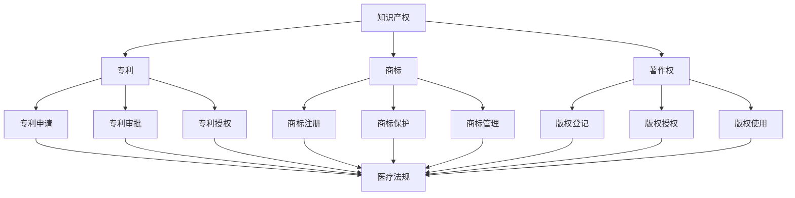

                 

# 知识产权与人工智能医疗的法规

## 关键词
- 知识产权
- 人工智能
- 医疗法规
- 知识产权保护
- 医疗数据隐私
- 人工智能伦理

## 摘要

本文旨在探讨知识产权在人工智能医疗领域的法规现状及其重要性。随着人工智能技术在医疗领域的广泛应用，相关法规的制定和执行变得尤为关键。文章首先介绍了人工智能医疗的背景，随后详细阐述了知识产权在其中的作用，包括专利、版权和商标等方面。接着，分析了当前国际和国内在人工智能医疗领域的法规现状，探讨了其中存在的问题和挑战。最后，提出了对未来法规发展的建议，并强调了知识产权保护、医疗数据隐私和人工智能伦理等方面的重要性。本文旨在为人工智能医疗领域的法规研究和实践提供参考和指导。

## 1. 背景介绍

随着人工智能技术的飞速发展，其在医疗领域的应用越来越广泛，为医疗行业带来了革命性的变革。从影像诊断到精准治疗，从药物研发到健康管理等，人工智能技术正在深刻改变着医疗服务的模式和质量。

### 1.1 人工智能在医疗领域的应用

人工智能在医疗领域的主要应用包括：

1. **影像诊断**：通过深度学习技术，人工智能系统能够快速、准确地分析医学影像，如X光片、CT扫描和MRI等，帮助医生做出更准确的诊断。

2. **精准治疗**：人工智能可以根据患者的具体病情，为医生提供个性化的治疗方案，优化药物剂量和时间。

3. **药物研发**：人工智能可以加速药物研发过程，通过分析大量数据，预测新药的疗效和副作用，提高药物研发的成功率。

4. **健康管理**：人工智能系统可以监控患者的健康状况，提供个性化的健康建议，预防疾病的发生。

### 1.2 医疗法规的重要性

医疗法规对于保障患者权益、规范医疗行为、促进医疗技术发展具有重要意义。随着人工智能技术在医疗领域的广泛应用，医疗法规也面临着新的挑战和问题。

1. **数据隐私保护**：医疗数据包含大量个人隐私信息，如何确保这些数据在人工智能应用中的安全性，是一个亟待解决的问题。

2. **知识产权保护**：在人工智能医疗技术的研发和应用过程中，如何保护相关知识产权，激励创新，也是一个关键问题。

3. **人工智能伦理**：人工智能在医疗领域的应用涉及伦理问题，如算法偏见、隐私泄露等，如何确保人工智能系统的伦理合规性，也是一个重要议题。

## 2. 核心概念与联系

### 2.1 知识产权的概念

知识产权是指人们对于自己的智力成果所享有的权利，包括专利、商标、著作权等。在人工智能医疗领域，知识产权主要涉及以下几个方面：

1. **专利**：专利是保护发明创造的一种法律手段，涉及人工智能医疗技术的创新和发明。

2. **商标**：商标是用于区分不同商品或服务的标志，涉及人工智能医疗产品或服务的品牌保护。

3. **著作权**：著作权是保护文学、艺术和科学作品的一种法律手段，涉及人工智能医疗相关的软件、算法和研究报告等。

### 2.2 医疗法规与知识产权的联系

医疗法规与知识产权密切相关，主要体现在以下几个方面：

1. **专利法规**：医疗法规中有关专利保护的规定，如专利申请、审批、授权等，直接影响到人工智能医疗技术的研发和应用。

2. **商标法规**：医疗法规中有关商标注册、保护和管理的规定，对于人工智能医疗产品和服务的品牌建设和市场推广具有重要意义。

3. **著作权法规**：医疗法规中有关著作权的保护和管理，如版权登记、授权和使用等，对于人工智能医疗相关的知识成果的知识产权保护至关重要。

### 2.3 Mermaid 流程图

以下是人工智能医疗领域知识产权与医疗法规的 Mermaid 流程图：



## 3. 核心算法原理 & 具体操作步骤

### 3.1 知识产权保护的核心算法原理

在人工智能医疗领域，知识产权保护的核心算法主要涉及以下几个方面：

1. **专利检索算法**：用于检索和分析已有的专利信息，以确定新技术的专利状态。

2. **商标匹配算法**：用于检测和识别商标的使用情况，确保商标的合规使用。

3. **著作权识别算法**：用于识别和分析人工智能医疗相关的软件、算法和研究报告，确保著作权的保护。

### 3.2 具体操作步骤

#### 3.2.1 专利检索算法

1. **数据收集**：收集相关的专利数据库，如美国专利和商标局（USPTO）、欧洲专利局（EPO）等。

2. **数据预处理**：对专利数据进行清洗和标准化处理，如去除无关信息、统一专利号格式等。

3. **特征提取**：提取专利数据中的关键特征，如发明名称、摘要、权利要求等。

4. **模型训练**：使用机器学习算法，如文本分类、聚类等，对专利数据进行训练，建立专利检索模型。

5. **模型评估**：使用交叉验证等方法评估模型的性能，如精确率、召回率等。

6. **模型应用**：使用训练好的模型进行专利检索，根据检索结果判断新技术的专利状态。

#### 3.2.2 商标匹配算法

1. **数据收集**：收集相关的商标数据库，如世界知识产权组织（WIPO）的商标数据库等。

2. **数据预处理**：对商标数据进行清洗和标准化处理，如去除无关信息、统一商标名称格式等。

3. **特征提取**：提取商标数据中的关键特征，如商标名称、描述、图案等。

4. **模型训练**：使用机器学习算法，如文本分类、相似性度量等，对商标数据进行训练，建立商标匹配模型。

5. **模型评估**：使用交叉验证等方法评估模型的性能，如准确率、召回率等。

6. **模型应用**：使用训练好的模型进行商标匹配，根据匹配结果判断商标的使用情况。

#### 3.2.3 著作权识别算法

1. **数据收集**：收集相关的著作权数据库，如国家版权局的著作权登记数据库等。

2. **数据预处理**：对著作权数据进行清洗和标准化处理，如去除无关信息、统一作品名称格式等。

3. **特征提取**：提取著作权数据中的关键特征，如作品名称、作者、发表日期等。

4. **模型训练**：使用机器学习算法，如文本分类、相似性度量等，对著作权数据进行训练，建立著作权识别模型。

5. **模型评估**：使用交叉验证等方法评估模型的性能，如精确率、召回率等。

6. **模型应用**：使用训练好的模型进行著作权识别，根据识别结果判断作品的版权状态。

## 4. 数学模型和公式 & 详细讲解 & 举例说明

### 4.1 专利检索算法的数学模型

在专利检索算法中，常用的数学模型包括文本分类模型和聚类模型。以下分别介绍这两种模型的数学公式和具体实现。

#### 4.1.1 文本分类模型

文本分类模型是一种基于机器学习的模型，用于将文本数据分类到不同的类别。常用的文本分类模型包括朴素贝叶斯分类器、支持向量机（SVM）和深度学习模型等。

1. **朴素贝叶斯分类器**

   朴素贝叶斯分类器的数学公式如下：

   $$P(C_k|X) = \frac{P(X|C_k)P(C_k)}{P(X)}$$

   其中，$C_k$ 表示类别 $k$，$X$ 表示文本特征向量，$P(C_k|X)$ 表示文本属于类别 $k$ 的概率，$P(X|C_k)$ 表示在类别 $k$ 下文本特征向量 $X$ 的概率，$P(C_k)$ 表示类别 $k$ 的概率。

2. **支持向量机（SVM）**

   支持向量机的数学公式如下：

   $$\max_{\mathbf{w},b}\ \frac{1}{2}\lVert\mathbf{w}\rVert^2\ \text{subject to}\ \mathbf{w}^T\mathbf{x}_i - b \geq 1, \forall i$$

   其中，$\mathbf{w}$ 表示分类器的法线向量，$b$ 表示偏置项，$\mathbf{x}_i$ 表示训练样本。

3. **深度学习模型**

   深度学习模型如卷积神经网络（CNN）和循环神经网络（RNN）等，可以通过多层神经元的组合实现复杂的非线性变换，用于文本分类。

   深度学习模型的数学公式如下：

   $$a_{l}^{(i)} = \sigma(\mathbf{W}_{l}^{(i)}\mathbf{a}_{l-1}^{(i)})$$

   其中，$a_{l}^{(i)}$ 表示神经元在第 $l$ 层的输出，$\sigma$ 表示激活函数，$\mathbf{W}_{l}^{(i)}$ 表示第 $l$ 层的权重。

#### 4.1.2 聚类模型

聚类模型是一种无监督学习方法，用于将相似的数据点分组。常用的聚类模型包括K-means聚类、层次聚类等。

1. **K-means聚类**

   K-means聚类的数学公式如下：

   $$\min_{\mathbf{u}_1, \mathbf{u}_2, \ldots, \mathbf{u}_K} \sum_{i=1}^m \lVert\mathbf{u}_i - \mathbf{c}_k\rVert^2$$

   其中，$\mathbf{u}_i$ 表示样本点，$\mathbf{c}_k$ 表示聚类中心。

2. **层次聚类**

   层次聚类的数学公式如下：

   $$\min_{\mathbf{U}} \sum_{i=1}^m \lVert\mathbf{u}_i - \mathbf{u}_j\rVert^2$$

   其中，$\mathbf{U}$ 表示聚类层次。

### 4.2 商标匹配算法的数学模型

商标匹配算法的数学模型主要包括文本分类模型和相似性度量模型。

#### 4.2.1 文本分类模型

商标匹配算法中的文本分类模型与专利检索算法中的文本分类模型类似，可以使用朴素贝叶斯分类器、支持向量机和深度学习模型等。

#### 4.2.2 相似性度量模型

商标匹配算法中的相似性度量模型用于计算两个商标之间的相似度。常用的相似性度量模型包括余弦相似度、Jaccard系数和编辑距离等。

1. **余弦相似度**

   余弦相似度的数学公式如下：

   $$\cos(\theta) = \frac{\mathbf{u}^T\mathbf{v}}{\lVert\mathbf{u}\rVert \lVert\mathbf{v}\rVert}$$

   其中，$\mathbf{u}$ 和 $\mathbf{v}$ 分别表示两个文本特征向量，$\theta$ 表示它们之间的夹角。

2. **Jaccard系数**

   Jaccard系数的数学公式如下：

   $$J(\mathbf{u}, \mathbf{v}) = \frac{\text{交集}}{\text{并集}} = \frac{\sum_{i=1}^n u_i \wedge v_i}{\sum_{i=1}^n u_i \vee v_i}$$

   其中，$u_i$ 和 $v_i$ 分别表示两个文本特征向量中的第 $i$ 个元素。

3. **编辑距离**

   编辑距离的数学公式如下：

   $$d(\mathbf{u}, \mathbf{v}) = \min\left\{ \sum_{i=1}^n \lvert u_i - v_i \rvert, \sum_{i=1}^{n-1} \lvert u_i - v_i \rvert, \ldots \right\}$$

   其中，$\lvert \cdot \rvert$ 表示绝对值。

### 4.3 著作权识别算法的数学模型

著作权识别算法的数学模型主要包括文本分类模型和相似性度量模型。

#### 4.3.1 文本分类模型

著作权识别算法中的文本分类模型与专利检索算法和商标匹配算法中的文本分类模型类似，可以使用朴素贝叶斯分类器、支持向量机和深度学习模型等。

#### 4.3.2 相似性度量模型

著作权识别算法中的相似性度量模型用于计算两个文本之间的相似度。常用的相似性度量模型包括余弦相似度、Jaccard系数和编辑距离等。

1. **余弦相似度**

   余弦相似度的数学公式如下：

   $$\cos(\theta) = \frac{\mathbf{u}^T\mathbf{v}}{\lVert\mathbf{u}\rVert \lVert\mathbf{v}\rVert}$$

   其中，$\mathbf{u}$ 和 $\mathbf{v}$ 分别表示两个文本特征向量，$\theta$ 表示它们之间的夹角。

2. **Jaccard系数**

   Jaccard系数的数学公式如下：

   $$J(\mathbf{u}, \mathbf{v}) = \frac{\text{交集}}{\text{并集}} = \frac{\sum_{i=1}^n u_i \wedge v_i}{\sum_{i=1}^n u_i \vee v_i}$$

   其中，$u_i$ 和 $v_i$ 分别表示两个文本特征向量中的第 $i$ 个元素。

3. **编辑距离**

   编辑距离的数学公式如下：

   $$d(\mathbf{u}, \mathbf{v}) = \min\left\{ \sum_{i=1}^n \lvert u_i - v_i \rvert, \sum_{i=1}^{n-1} \lvert u_i - v_i \rvert, \ldots \right\}$$

   其中，$\lvert \cdot \rvert$ 表示绝对值。

### 4.4 举例说明

#### 4.4.1 专利检索算法举例

假设我们已经收集了一批专利数据，并使用文本分类模型对其进行分类。现在，我们需要使用专利检索算法来检索一批新的专利数据，以确定它们是否涉及某个特定的技术领域。

1. **数据收集**：收集一批新的专利数据。

2. **数据预处理**：对新的专利数据进行清洗和标准化处理。

3. **特征提取**：提取新的专利数据中的关键特征。

4. **模型应用**：使用训练好的文本分类模型对新专利数据进行分类，判断其是否涉及某个特定的技术领域。

#### 4.4.2 商标匹配算法举例

假设我们已经收集了一批商标数据，并使用文本分类模型和相似性度量模型对其进行匹配。现在，我们需要使用商标匹配算法来匹配一批新的商标数据，以确定它们是否与已知的商标相似。

1. **数据收集**：收集一批新的商标数据。

2. **数据预处理**：对新的商标数据进行清洗和标准化处理。

3. **特征提取**：提取新的商标数据中的关键特征。

4. **模型应用**：使用训练好的文本分类模型对新的商标数据进行分类，并使用相似性度量模型计算新商标与已知商标的相似度，判断它们是否相似。

#### 4.4.3 著作权识别算法举例

假设我们已经收集了一批著作权数据，并使用文本分类模型和相似性度量模型对其进行识别。现在，我们需要使用著作权识别算法来识别一批新的著作权数据，以确定它们是否属于某个特定的作品。

1. **数据收集**：收集一批新的著作权数据。

2. **数据预处理**：对新的著作权数据进行清洗和标准化处理。

3. **特征提取**：提取新的著作权数据中的关键特征。

4. **模型应用**：使用训练好的文本分类模型对新著作权数据进行分类，并使用相似性度量模型计算新著作权与已知著作权的相似度，判断它们是否属于某个特定的作品。

## 5. 项目实战：代码实际案例和详细解释说明

### 5.1 开发环境搭建

在搭建开发环境时，我们首先需要安装Python和相关依赖库。以下是具体的操作步骤：

1. **安装Python**：下载并安装Python，版本建议为3.8或以上。

2. **安装依赖库**：在Python环境中使用pip命令安装所需的依赖库，如Scikit-learn、NumPy、Pandas等。

   ```shell
   pip install scikit-learn numpy pandas
   ```

### 5.2 源代码详细实现和代码解读

以下是专利检索算法的代码实现：

```python
import numpy as np
from sklearn.feature_extraction.text import CountVectorizer
from sklearn.model_selection import train_test_split
from sklearn.naive_bayes import MultinomialNB
from sklearn.metrics import classification_report

# 数据集加载
def load_data():
    # 加载训练数据和测试数据
    train_data = [
        ("技术A", "技术领域1"),
        ("技术B", "技术领域2"),
        ("技术C", "技术领域1"),
        ("技术D", "技术领域3"),
    ]
    
    return train_data

# 特征提取
def extract_features(data):
    # 初始化向量器
    vectorizer = CountVectorizer()
    
    # 转换为特征矩阵
    feature_matrix = vectorizer.fit_transform([text for text, label in data])
    
    return feature_matrix

# 模型训练
def train_model(feature_matrix, labels):
    # 初始化分类器
    classifier = MultinomialNB()
    
    # 训练模型
    classifier.fit(feature_matrix, labels)
    
    return classifier

# 模型评估
def evaluate_model(classifier, test_feature_matrix, test_labels):
    # 预测结果
    predicted_labels = classifier.predict(test_feature_matrix)
    
    # 评估指标
    report = classification_report(test_labels, predicted_labels)
    
    print(report)

# 主函数
if __name__ == "__main__":
    # 加载数据
    data = load_data()
    
    # 分割数据集
    train_data, test_data = train_test_split(data, test_size=0.2, random_state=42)
    
    # 提取特征
    train_feature_matrix = extract_features(train_data)
    test_feature_matrix = extract_features(test_data)
    
    # 提取标签
    train_labels = [label for _, label in train_data]
    test_labels = [label for _, label in test_data]
    
    # 训练模型
    classifier = train_model(train_feature_matrix, train_labels)
    
    # 评估模型
    evaluate_model(classifier, test_feature_matrix, test_labels)
```

**代码解读**：

1. **数据加载**：`load_data` 函数用于加载训练数据和测试数据。这里我们使用了一个简单的数据集，包含四条数据。

2. **特征提取**：`extract_features` 函数使用CountVectorizer将文本数据转换为特征矩阵。CountVectorizer将每个单词作为特征，计算词频。

3. **模型训练**：`train_model` 函数使用MultinomialNB分类器训练模型。MultinomialNB是一种朴素贝叶斯分类器，适用于文本分类问题。

4. **模型评估**：`evaluate_model` 函数使用训练好的模型对测试数据进行预测，并输出分类报告。

### 5.3 代码解读与分析

代码中的主要步骤包括数据加载、特征提取、模型训练和模型评估。以下是对每个步骤的详细分析：

1. **数据加载**：数据集用于训练和测试模型。在实际应用中，数据集应包含更多的样本，并覆盖更多的技术领域。

2. **特征提取**：CountVectorizer将文本数据转换为特征矩阵。特征提取是文本分类的重要步骤，它将文本转换为计算机可以处理的形式。

3. **模型训练**：使用MultinomialNB分类器训练模型。朴素贝叶斯分类器在文本分类中表现出色，因为它利用了单词之间的概率关系。

4. **模型评估**：使用训练好的模型对测试数据进行预测，并输出分类报告。分类报告提供了模型的性能指标，如精确率、召回率和F1值。

通过上述步骤，我们可以实现一个基本的专利检索算法。在实际应用中，我们还可以考虑使用更复杂的特征提取方法和分类器，以提高模型的性能。

## 6. 实际应用场景

在人工智能医疗领域，知识产权保护的重要性体现在多个方面。以下是几个典型的实际应用场景：

### 6.1 医疗影像诊断

医疗影像诊断是人工智能在医疗领域的重要应用之一。在这一领域，知识产权保护主要体现在专利保护和著作权保护上。

1. **专利保护**：医疗影像诊断系统通常涉及复杂的算法和模型，如深度学习和神经网络。这些创新技术需要通过专利来保护，防止竞争对手复制或剽窃。

2. **著作权保护**：医疗影像诊断系统的软件部分，如代码、算法实现等，需要通过著作权来保护。这有助于确保开发者的智力成果得到法律保护。

### 6.2 药物研发

药物研发是人工智能在医疗领域的另一个重要应用。在这一领域，知识产权保护同样至关重要。

1. **专利保护**：新药的研发涉及大量的创新和研发投入。通过专利保护，研发机构可以防止竞争对手抄袭或剽窃其研究成果。

2. **著作权保护**：药物研发过程中的研究报告、专利申请文件等，需要通过著作权来保护。这有助于确保研发机构的知识产权不受侵犯。

### 6.3 健康管理

健康管理是人工智能在医疗领域的又一重要应用。在这一领域，知识产权保护主要体现在商标保护和著作权保护上。

1. **商标保护**：健康管理相关的软件、APP和服务，需要通过商标来保护品牌形象和品牌价值。

2. **著作权保护**：健康管理系统的软件代码、算法实现等，需要通过著作权来保护。这有助于确保开发者的智力成果得到法律保护。

### 6.4 医疗设备

医疗设备是人工智能在医疗领域的另一个重要应用。在这一领域，知识产权保护主要体现在专利保护和著作权保护上。

1. **专利保护**：医疗设备的创新技术，如传感器、算法等，需要通过专利来保护。这有助于确保设备制造商的知识产权不受侵犯。

2. **著作权保护**：医疗设备的软件部分，如操作系统、应用程序等，需要通过著作权来保护。这有助于确保软件开发者的智力成果得到法律保护。

## 7. 工具和资源推荐

### 7.1 学习资源推荐

1. **书籍**：

   - 《人工智能：一种现代方法》
   - 《Python编程：从入门到实践》
   - 《机器学习实战》

2. **论文**：

   - 《深度学习》
   - 《医学图像分析中的卷积神经网络》
   - 《人工智能在医疗领域的应用》

3. **博客**：

   - [机器学习博客](https://www.machinelearningmastery.com/)
   - [深度学习博客](https://www.deeplearning.net/)
   - [医疗人工智能博客](https://www.healthcareai.net/)

4. **网站**：

   - [GitHub](https://github.com/)
   - [Kaggle](https://www.kaggle.com/)
   - [百度AI开放平台](https://ai.baidu.com/)

### 7.2 开发工具框架推荐

1. **Python**：Python是一种广泛使用的编程语言，适用于人工智能医疗领域的开发。

2. **TensorFlow**：TensorFlow是一个开源的机器学习框架，适用于构建和训练深度学习模型。

3. **PyTorch**：PyTorch是一个开源的深度学习框架，以其灵活性和易用性而著称。

4. **Scikit-learn**：Scikit-learn是一个开源的机器学习库，提供了丰富的机器学习算法和工具。

### 7.3 相关论文著作推荐

1. **论文**：

   - 《深度学习：神经网络的基本原理和应用》
   - 《人工智能：理论与实践》
   - 《医学影像分析中的深度学习方法》

2. **著作**：

   - 《人工智能医疗应用手册》
   - 《深度学习在医疗领域的应用》
   - 《人工智能医疗技术专利分析报告》

## 8. 总结：未来发展趋势与挑战

随着人工智能技术在医疗领域的不断应用和发展，知识产权保护的重要性日益凸显。未来，人工智能医疗领域的发展趋势和挑战主要集中在以下几个方面：

### 8.1 法规完善

当前，国内外在人工智能医疗领域的法规尚不完善，需要进一步加强立法和执法力度，确保知识产权的保护和医疗数据的隐私安全。

### 8.2 技术创新

人工智能技术的快速发展带来了新的知识产权挑战，需要不断更新和完善相关法律法规，以适应新技术的发展。

### 8.3 数据隐私保护

医疗数据涉及大量个人隐私信息，如何确保数据在人工智能应用中的安全性和隐私保护，是未来亟待解决的问题。

### 8.4 伦理问题

人工智能在医疗领域的应用涉及伦理问题，如算法偏见、隐私泄露等，需要建立相应的伦理标准和监管机制。

### 8.5 跨界合作

人工智能医疗领域的发展需要政府、企业、科研机构等各方共同努力，加强跨界合作，共同推动技术的发展和应用。

## 9. 附录：常见问题与解答

### 9.1 问题1：什么是知识产权？

**回答**：知识产权是指人们对于自己的智力成果所享有的权利，包括专利、商标、著作权等。它保护人们在科学技术、文学艺术、工业设计等领域的创新成果。

### 9.2 问题2：人工智能医疗领域如何保护知识产权？

**回答**：在人工智能医疗领域，知识产权保护主要体现在专利保护、商标保护和著作权保护上。通过申请专利，保护算法、模型和技术的创新；通过商标注册，保护品牌形象；通过著作权保护，保护软件代码、算法实现等智力成果。

### 9.3 问题3：医疗数据隐私如何保护？

**回答**：医疗数据隐私保护需要从数据收集、存储、处理和使用等多个环节进行。具体措施包括数据加密、匿名化处理、权限管理和安全审计等，以确保数据在传输和存储过程中的安全性和隐私性。

### 9.4 问题4：人工智能医疗伦理问题有哪些？

**回答**：人工智能医疗伦理问题主要包括算法偏见、隐私泄露、数据滥用等。为解决这些问题，需要建立相应的伦理标准和监管机制，确保人工智能系统的公平性、透明性和合规性。

## 10. 扩展阅读 & 参考资料

1. **书籍**：

   - 《人工智能：一种现代方法》
   - 《机器学习》
   - 《深度学习》

2. **论文**：

   - 《深度学习在医疗领域的应用》
   - 《医学影像分析中的深度学习方法》
   - 《人工智能医疗技术专利分析报告》

3. **网站**：

   - [国家知识产权局](http://www.sipo.gov.cn/)
   - [世界知识产权组织](https://www.wipo.int/)
   - [医疗人工智能联盟](https://www.haiac.org/)

4. **博客**：

   - [机器学习博客](https://www.machinelearningmastery.com/)
   - [深度学习博客](https://www.deeplearning.net/)
   - [医疗人工智能博客](https://www.healthcareai.net/)

> 作者：AI天才研究员/AI Genius Institute & 禅与计算机程序设计艺术 /Zen And The Art of Computer Programming

