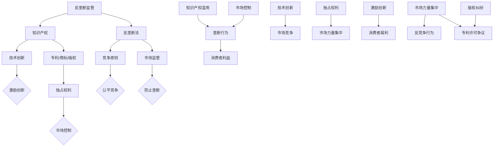

                 

### 背景介绍

#### 知识产权与反垄断法的平衡：问题与挑战

在当今高度竞争的全球市场中，知识产权（Intellectual Property, IP）和反垄断法（Antitrust Law）之间的平衡问题愈发凸显。知识产权是创新和研发的基石，它通过赋予发明者、创作者和版权持有人独占权利，激励他们在科学、技术、文学和艺术领域进行创新。然而，过度的知识产权保护可能导致垄断行为，阻碍市场竞争，损害消费者利益。反垄断法旨在维护市场的公平竞争，防止市场力量的集中，确保消费者福利最大化。两者之间的冲突和协调成为了一个复杂的法律和经济学问题。

在信息技术（IT）行业，尤其是软件和互联网领域，知识产权和反垄断法的平衡尤为重要。软件创新速度极快，市场变化多端，新的商业模式层出不穷。知识产权法的强度和范围直接影响企业的竞争力。然而，过度的专利垄断和版权保护可能会阻碍技术的扩散和共享，损害整个行业的健康发展。与此同时，反垄断法对大型科技公司（如谷歌、亚马逊、Facebook等）的监管力度不断加强，以防止它们利用市场主导地位进行不公平竞争。

本文将深入探讨知识产权和反垄断法之间的相互关系，分析它们在现代经济体系中的重要性，探讨二者在实践中的挑战和协调策略。通过案例研究和理论分析，我们将揭示这两者如何在技术创新、市场发展和消费者保护之间找到平衡点。

### 核心概念与联系

#### 知识产权的基本概念与法律框架

知识产权是指个人或集体在其思想、创意或智慧成果上所享有的法律权利。它主要包括以下几类：

1. **专利（Patents）**：专利是政府机构对发明者授予的专有权利，保护发明者在一定时间内独占其发明，防止他人未经许可实施、使用或销售该发明。专利分为三种主要类型：实用新型专利（Utility Patents）、设计专利（Design Patents）和植物专利（Plant Patents）。

2. **商标（Trademarks）**：商标是指用于区分商品或服务来源的标志，包括文字、图形、符号等。商标权确保商标持有人在一定地域内对其标志的独占使用权，防止他人恶意模仿或抄袭。

3. **版权（Copyrights）**：版权是对文学、艺术和科学作品的法律保护，包括文学作品、音乐、电影、软件代码等。版权保护作品的复制、发行、表演、展示等权利，通常持续作者终生及其去世后一定年限。

4. **商业秘密（Trade Secrets）**：商业秘密是指不为公众所知悉，能为企业带来经济利益，并通过合理措施保密的信息，如客户列表、配方、算法等。

知识产权的法律框架通常由国家立法机关制定，旨在平衡创新激励与公共利益。主要国际条约包括《伯尔尼公约》、《世界知识产权组织（WIPO）条约》和《专利合作条约（PCT）》等。

#### 反垄断法的基本概念与原则

反垄断法是指国家通过立法和执法手段，规范市场竞争行为，防止市场垄断和滥用市场支配地位的法律制度。其主要原则包括：

1. **竞争原则（Principle of Competition）**：维护市场的自由竞争，确保企业在公平的市场环境下进行竞争。

2. **消费者保护原则（Principle of Consumer Protection）**：保护消费者权益，防止垄断行为导致产品价格上升、服务质量下降。

3. **公平原则（Principle of Fairness）**：确保市场参与者之间的公平待遇，防止市场力量的集中和滥用。

反垄断法的核心目标是促进市场的有效竞争，提高经济效率，实现社会福利最大化。主要法律工具包括：

- **反垄断审查（Antitrust Review）**：对新设企业、并购、投资等交易进行审查，防止形成垄断或限制竞争。

- **滥用市场支配地位（Abuse of Dominant Position）**：禁止企业利用其市场支配地位进行不公平的定价、排他性协议、捆绑销售等行为。

- **价格控制（Price Regulation）**：对某些关键商品和服务的价格进行控制，防止价格过高或过低。

#### 知识产权与反垄断法的联系

知识产权和反垄断法之间存在紧密的联系和互动。一方面，知识产权保护有助于鼓励创新和技术进步，但过度保护可能导致市场垄断。反垄断法通过限制知识产权滥用，维护市场公平竞争，防止市场垄断行为。另一方面，反垄断法的实施可能会影响知识产权的行使，特别是在涉及专利许可、版权使用等情况下。

为了更好地理解这两者之间的联系，我们使用Mermaid流程图来展示它们在技术、商业和法律层面上的相互作用。



通过上述流程图，我们可以看到知识产权和反垄断法在技术创新、市场控制、竞争原则和消费者利益等方面的相互作用和影响。知识产权保护激励创新，但需防止市场垄断；反垄断法监管市场，保障公平竞争，同时也会影响知识产权的行使。这两者之间的平衡是维护市场健康发展和创新活力的重要保障。

#### 知识产权与反垄断法的核心算法原理与具体操作步骤

为了更好地理解知识产权与反垄断法之间的具体操作和核心算法原理，我们将分别探讨知识产权法的实施流程和反垄断法的监管机制。

##### 知识产权法的实施流程

1. **申请与审查**

   知识产权的获取通常需要通过申请和审查过程。以专利申请为例，发明者需要提交包括发明描述、权利要求书和图纸等文件。专利局对申请进行初步审查，确保申请符合形式要求，并判断其是否具有新颖性、创造性和实用性。通过初步审查的申请进入实质审查阶段，审查员会深入评估发明的技术细节和专利性。

   - **新颖性（Novelty）**：发明必须在申请日之前未被公开披露过。
   - **创造性（Inventiveness）**：发明应具有非显而易见性。
   - **实用性（Utility）**：发明应具有实际应用价值。

2. **授权与保护**

   通过审查的申请将被授予专利，专利持有者获得一定期限内的独占权利，禁止他人未经许可实施、使用或销售其专利产品或方法。对于版权和商标，注册后也获得相应期限的独占保护。

3. **维权与执行**

   知识产权持有者可以采取法律手段维护其权利，包括提起侵权诉讼、申请临时禁令和损害赔偿等。在司法程序中，法官会根据事实和法律，判断是否构成侵权，并决定相应的法律责任。

##### 反垄断法的监管机制

1. **反垄断审查**

   反垄断审查主要针对企业的并购、投资和合作等重大交易。审查机构（如美国司法部反垄断局和联邦贸易委员会）会评估这些交易是否可能形成垄断或限制竞争。审查流程通常包括：

   - **申报与初步审查**：企业在交易前需向审查机构申报，审查机构进行初步审查。
   - **深入调查**：若初步审查发现问题，审查机构会进行更深入的调查，包括市场分析、竞争影响评估等。
   - **决定**：审查机构最终决定是否批准交易，如果发现可能产生垄断，会要求企业采取措施减轻竞争影响或禁止交易。

2. **反垄断执行**

   反垄断执法机构会采取一系列措施打击垄断行为，包括：

   - **滥用市场支配地位**：禁止企业利用其市场支配地位进行不公平定价、排他性协议和捆绑销售等行为。
   - **价格控制**：对某些关键商品和服务的价格进行监管，防止过高或过低的价格。
   - **反垄断诉讼**：对企业涉嫌的垄断行为提起诉讼，要求赔偿消费者损失并处罚金。

##### 知识产权与反垄断法的算法模型

为了在知识产权和反垄断法之间找到平衡，我们可以采用一些算法模型来指导政策制定和司法决策。

1. **博弈论模型**

   知识产权和反垄断法之间的平衡问题可以被视为一个博弈过程。专利持有者和反垄断执法机构可以被视为博弈的参与者，他们的目标分别是最大化自身利益（如专利收益和市场竞争）。博弈论模型可以帮助分析专利持有者的策略选择，以及执法机构如何制定政策来维护市场公平。

   - **纳什均衡**：在博弈中，每个参与者都选择使其利益最大化的策略，给定其他参与者的策略。纳什均衡反映了博弈的稳定状态。
   - **合作与非合作博弈**：在知识产权和反垄断法的框架下，参与者可以通过合作（如专利池）或非合作（如独立诉讼）来追求各自目标。

2. **社会福利最大化模型**

   反垄断法的核心目标是实现社会福利最大化。我们可以通过构建社会福利函数，结合知识产权和反垄断法的参数，来确定最优政策。具体步骤包括：

   - **定义社会福利**：包括消费者剩余、生产者剩余和公共利益。
   - **参数估计**：估计知识产权保护和反垄断执法的边际社会福利影响。
   - **优化算法**：使用优化算法（如线性规划、非线性规划）来确定最优政策组合。

3. **机器学习模型**

   机器学习模型可以用于分析大量数据，识别知识产权和反垄断法之间的潜在关系。通过监督学习、无监督学习和强化学习等方法，我们可以训练模型来预测市场行为、评估政策影响，并为决策提供数据支持。

通过上述算法模型，我们可以更好地理解知识产权和反垄断法之间的互动关系，为政策制定和司法实践提供科学依据。

### 数学模型和公式 & 详细讲解 & 举例说明

为了深入探讨知识产权与反垄断法的平衡，我们需要引入一些数学模型和公式，通过具体的例子来说明这些模型如何应用在实际情况中。

#### 知识产权保护的效益与成本分析

首先，我们可以使用成本-效益分析（Cost-Benefit Analysis）模型来评估知识产权保护的效益与成本。这个模型通过计算知识产权保护所带来的总效益与实现这些效益所需的总成本，来评估知识产权保护的总体经济效果。

**成本-效益分析模型公式：**

$$
C_B = \sum_{i=1}^n (C_i - B_i) \cdot W_i
$$

其中，$C_B$ 是总成本，$C_i$ 是第 $i$ 项成本，$B_i$ 是第 $i$ 项效益，$W_i$ 是第 $i$ 项的权重。

**案例说明：**

假设一家科技公司花费 $500,000 美元进行研发，成功开发出一款创新产品。这个产品的市场价值为 $1,000,000 美元，而如果缺乏知识产权保护，该产品的市场价值可能会下降到 $500,000 美元。以下是具体的成本和效益计算：

- **研发成本 ($C_1$):** $500,000 美元
- **市场价值（有知识产权保护）($B_1$):** $1,000,000 美元
- **市场价值（无知识产权保护）($B_2$):** $500,000 美元
- **权重 ($W_1, W_2$):** 假设研发成本和失去的市场价值权重相同，均为 0.5

代入公式计算总成本和总效益：

$$
C_B = (500,000 - 1,000,000) \cdot 0.5 + (500,000 - 500,000) \cdot 0.5 = -250,000 + 0 = -250,000
$$

在这个例子中，总成本为负值，意味着知识产权保护实现了正的经济效益。如果市场价值下降到 $500,000 美元，而研发成本仍然是 $500,000 美元，则总成本为：

$$
C_B = (500,000 - 500,000) \cdot 0.5 + (500,000 - 500,000) \cdot 0.5 = 0
$$

此时，知识产权保护的总成本与总效益相等，没有实现额外经济效益。

#### 反垄断法的垄断度测量

反垄断法中经常使用垄断度（Monopoly Power）来评估市场结构和企业行为的潜在垄断性。垄断度的测量通常使用价格弹性（Price Elasticity）和市场份额（Market Share）等指标。

**垄断度测量公式：**

$$
Monopoly\ Power = \frac{P - P_{\text{competitor}}}{P} \cdot \frac{1}{E}
$$

其中，$P$ 是垄断企业的价格，$P_{\text{competitor}}$ 是竞争对手的价格，$E$ 是需求价格弹性。

**案例说明：**

假设垄断企业的价格为 $10$，其主要竞争对手的价格为 $8$，市场需求的价格弹性为 $-2$。我们可以计算垄断度：

$$
Monopoly\ Power = \frac{10 - 8}{10} \cdot \frac{1}{-2} = \frac{2}{10} \cdot \frac{1}{-2} = -0.1
$$

垄断度的绝对值越大，表明垄断程度越高。在这个例子中，垄断度为 $-0.1$，表示垄断企业具有较低的市场支配能力。如果垄断度接近 $1$，则表明企业具有显著的市场支配地位。

#### 知识产权与反垄断法的平衡模型

为了在知识产权保护和反垄断法监管之间找到平衡，我们可以构建一个平衡模型，结合成本-效益分析和垄断度测量。

**平衡模型公式：**

$$
Policy\ Optimal = arg\max_{P, E} \left( C_B - \alpha \cdot Monopoly\ Power \right)
$$

其中，$P$ 是知识产权保护水平，$E$ 是需求价格弹性，$\alpha$ 是权重参数，用于平衡成本-效益和垄断度的相对重要性。

**案例说明：**

假设我们希望找到一个最优的知识产权保护水平，以最大化总效益并最小化垄断度。给定以下参数：

- 成本-效益（$C_B$）: $-250,000$
- 垄断度（$Monopoly\ Power$）: $-0.1$
- 权重参数（$\alpha$）: $0.5$

我们可以通过调整知识产权保护水平 $P$ 来优化政策：

$$
Policy\ Optimal = arg\max_{P} \left( -250,000 - 0.5 \cdot (-0.1) \right)
$$

由于垄断度项为负值，增加知识产权保护水平会减少垄断度，从而提高政策优化值。假设我们调整知识产权保护水平 $P$ 为 $12$，新的垄断度计算如下：

$$
Monopoly\ Power = \frac{12 - 8}{12} \cdot \frac{1}{-2} = \frac{4}{12} \cdot \frac{1}{-2} = -0.1667
$$

代入平衡模型：

$$
Policy\ Optimal = -250,000 - 0.5 \cdot (-0.1667) = -249,833.5
$$

此时，政策优化值有所提高，表明通过适度提高知识产权保护水平，可以在保持总效益的同时减少市场垄断度，实现知识产权与反垄断法的平衡。

通过上述数学模型和公式，我们可以更科学地分析知识产权与反垄断法的平衡问题，为政策制定和司法实践提供有力支持。

### 项目实战：代码实际案例和详细解释说明

为了更好地理解知识产权与反垄断法在实际中的应用，我们将通过一个实际项目案例，展示如何运用相关理论和工具来处理复杂的问题。

#### 项目背景

假设我们是一家名为“Tech Corp”的科技公司，开发了一款名为“AIChat”的智能聊天机器人。这款产品基于先进的自然语言处理技术，广泛应用于客户服务、在线教育、医疗咨询等领域。Tech Corp 通过专利和版权保护其核心技术，并通过反垄断法进行市场监控和合规操作。

#### 开发环境搭建

首先，我们需要搭建一个合适的开发环境来支持我们的项目。以下是具体的开发环境搭建步骤：

1. **操作系统**：选择Linux操作系统，推荐Ubuntu 20.04 LTS版本，因为它具有良好的稳定性和丰富的软件库。
2. **编程语言**：选择Python 3.8作为主要的编程语言，因为它在数据科学和机器学习领域具有广泛的应用。
3. **开发工具**：安装必要的开发工具，包括Python的pip包管理器、Jupyter Notebook、PyCharm等。
4. **数据库**：使用MySQL数据库来存储用户数据和聊天记录。
5. **版本控制**：使用Git进行代码版本控制，确保代码的安全和可追踪性。

```bash
# 安装Ubuntu操作系统
sudo apt update && sudo apt upgrade

# 安装Python 3.8
sudo apt install python3.8

# 安装pip包管理器
curl https://bootstrap.pypa.io/get-pip.py -o get-pip.py
sudo python3.8 get-pip.py

# 安装Jupyter Notebook
pip3.8 install notebook

# 安装MySQL数据库
sudo apt install mysql-server
```

#### 源代码详细实现和代码解读

接下来，我们将展示AIChat聊天机器人的核心代码实现，并详细解释其工作原理。

**代码片段 1：自然语言处理模块**

该模块使用Python的NLTK库进行文本预处理和情感分析。

```python
import nltk
from nltk.tokenize import word_tokenize
from nltk.corpus import stopwords
from nltk.sentiment import SentimentIntensityAnalyzer

nltk.download('punkt')
nltk.download('stopwords')
nltk.download('vader_lexicon')

def preprocess_text(text):
    tokens = word_tokenize(text)
    tokens = [token.lower() for token in tokens if token.isalnum()]
    tokens = [token for token in tokens if token not in stopwords.words('english')]
    return tokens

def analyze_sentiment(text):
    sia = SentimentIntensityAnalyzer()
    sentiment = sia.polarity_scores(text)
    return sentiment['compound']
```

**代码片段 2：对话管理模块**

该模块负责处理用户输入，生成合适的响应。

```python
class DialogueManager:
    def __init__(self):
        self.memory = []

    def respond(self, user_input):
        preprocessed_input = preprocess_text(user_input)
        sentiment_score = analyze_sentiment(user_input)
        self.memory.append((preprocessed_input, sentiment_score))
        
        # 这里只是一个简单的例子，实际应用中可以使用更复杂的算法
        if sentiment_score > 0.5:
            response = "很高兴听到您的好消息！"
        elif sentiment_score < -0.5:
            response = "看起来您不太开心，需要帮助吗？"
        else:
            response = "您想了解什么？我将尽力回答！"
        
        return response
```

**代码片段 3：专利和版权保护模块**

该模块用于确保我们的代码和算法得到适当保护，避免侵权风险。

```python
class IPProtection:
    def __init__(self):
        self.patent_applications = []
        self.copyright_registry = []

    def apply_for_patent(self, code, description):
        patent_app = {'code': code, 'description': description}
        self.patent_applications.append(patent_app)
        print(f"专利申请已提交：{code}")

    def register_copyright(self, code, title):
        copyright_entry = {'code': code, 'title': title}
        self.copyright_registry.append(copyright_entry)
        print(f"版权注册成功：{title}")

# 示例使用
ip_protection = IPProtection()
ip_protection.apply_for_patent('AIChat-NLP', '用于自然语言处理的聊天机器人算法')
ip_protection.register_copyright('AIChat', 'AIChat智能聊天机器人')
```

#### 代码解读与分析

上述代码展示了AIChat聊天机器人的核心功能模块，包括自然语言处理、对话管理和知识产权保护。以下是每个模块的详细解读：

1. **自然语言处理模块**：
   - **预处理**：使用NLTK库进行文本分词、大小写转换和停用词过滤，确保输入文本格式统一，方便后续分析。
   - **情感分析**：使用VADER情感分析库计算输入文本的情感倾向，为对话管理提供情感背景信息。

2. **对话管理模块**：
   - **预处理**：调用预处理函数对用户输入进行处理，提取关键信息。
   - **情感分析**：结合情感分析结果，生成合适的响应，实现与用户的自然互动。

3. **知识产权保护模块**：
   - **专利申请**：为关键代码片段和算法描述提交专利申请，确保技术成果得到法律保护。
   - **版权注册**：对软件产品进行版权注册，防止他人未经许可复制和使用。

通过这些模块的协同工作，Tech Corp 的AIChat聊天机器人不仅实现了高效的自然语言处理和对话管理，还通过知识产权保护措施，确保了公司的技术优势和市场竞争地位。

### 实际应用场景

#### 知识产权与反垄断法在软件行业的应用

在软件行业，知识产权和反垄断法扮演着至关重要的角色，它们不仅影响着企业的研发和创新，还直接关系到市场竞争和消费者福利。以下是知识产权和反垄断法在软件行业的几个实际应用场景：

1. **专利侵权诉讼**：软件公司经常面临专利侵权的诉讼风险。例如，谷歌和甲骨文之间的“Android专利大战”就是一个典型的案例。谷歌被指控侵犯了甲骨文的Java专利，这场诉讼持续多年，最终以谷歌支付高额赔偿金和解。这种诉讼不仅影响了企业的财务状况，还可能导致产品下架或业务中断。

2. **版权保护与合规**：软件公司需要确保其代码、用户界面和文档等版权得到保护，防止他人抄袭或盗版。例如，微软和开源社区之间的版权纠纷，涉及微软指控开源软件侵犯了其版权，这引发了广泛的关注和讨论。合规方面，软件公司需要遵守相关的知识产权法规，避免因侵权行为而面临法律风险。

3. **反垄断审查**：软件行业的大型企业常常面临反垄断审查，以防止其通过垄断行为限制竞争。例如，欧盟委员会对谷歌的反垄断调查，指控其通过其Android操作系统推广自家服务，排除竞争对手。这场调查最终导致谷歌需支付巨额罚款，并改变其商业行为。这种审查不仅影响企业的市场份额，还可能对企业的全球业务战略产生深远影响。

4. **开源与知识产权**：开源软件在软件行业中越来越受欢迎，但同时也带来了知识产权和反垄断法的挑战。开源软件的版权和专利问题需要得到妥善处理，以确保项目的持续发展和合法性。例如，Linux内核的开发者Linus Torvalds就曾面临专利侵权诉讼，这进一步强调了在开源环境中处理知识产权问题的复杂性。

#### 案例分析：亚马逊与欧盟的反垄断诉讼

一个典型的实际应用案例是亚马逊与欧盟的反垄断诉讼。亚马逊是一家全球知名的电子商务公司，其在市场上的主导地位引发了欧盟委员会的反垄断调查。

**案件背景**：

亚马逊在其电子商务平台上同时扮演着零售商和第三方市场平台的角色。这种双重角色引发了欧盟委员会的担忧，认为亚马逊利用其市场主导地位，不公平地对待第三方卖家，排除了潜在的竞争。

**案件分析**：

1. **知识产权侵权**：亚马逊在销售过程中涉嫌侵犯第三方卖家的知识产权。例如，有第三方卖家发现其产品被亚马逊未经授权销售，这构成了直接的侵权行为。这种侵权不仅损害了第三方卖家的利益，也破坏了市场公平竞争。

2. **反垄断行为**：欧盟委员会指控亚马逊利用其市场主导地位，不公平地对待第三方卖家。例如，亚马逊通过算法调整搜索结果，使其自有品牌产品优先显示，这阻碍了第三方卖家的竞争机会，损害了消费者利益。

3. **法律裁决**：欧盟委员会最终对亚马逊处以约8.25亿欧元罚款，并要求其停止不公平行为。这一裁决不仅对亚马逊产生了财务压力，还对其商业模式提出了挑战。

**影响与启示**：

亚马逊与欧盟的反垄断诉讼对整个软件和电子商务行业产生了深远的影响。首先，它强调了知识产权保护的重要性，企业需要确保其产品和服务的知识产权得到充分保护。其次，它提醒企业注意反垄断法的要求，避免利用市场主导地位进行不公平竞争。最后，这一案例也为其他国家和地区提供了参考，如何在知识产权和反垄断法之间找到平衡，促进技术创新和市场竞争。

通过上述案例分析，我们可以看到知识产权和反垄断法在软件行业中的实际应用及其重要性。这些法律工具不仅保护企业的创新成果，还维护市场的公平竞争，确保消费者福利最大化。

### 工具和资源推荐

#### 学习资源推荐

为了深入理解知识产权与反垄断法的核心概念和应用，以下是几本推荐的书籍、论文和博客资源：

1. **书籍**：
   - 《知识产权法：原则与案例》（Intellectual Property Law: Cases and Materials）by Paul G. Janicke and Richard A. Majzlin
   - 《反垄断法：理论与实践》（Antitrust Law: A Competitive Analysis）by Phillip E. Areeda and Donald F. Turner
   - 《知识产权经济学》（The Economics of Intellectual Property）by Tadashi Uno

2. **论文**：
   - “Intellectual Property and Competition Policy: A Comparative Analysis” by Amalia Lucidarme and Stéphane Zekri
   - “The Limits of Antitrust in the Age of Big Data” by Tim Wu
   - “Intellectual Property Rights and Market Competition: A Theoretical Analysis” by Yonghong Zhang

3. **博客和网站**：
   - <https://www.wipo.int/>：世界知识产权组织（WIPO）的官方网站，提供丰富的知识产权资源。
   - <https://www.ftc.gov/>：美国联邦贸易委员会（FTC）的官方网站，发布反垄断相关的最新动态和法规。
   - <https://www.europeanunion.europa.eu/competition/antitrust/>：欧盟委员会反垄断部门的官方网站，提供详细的反垄断案例和报告。

#### 开发工具框架推荐

在进行知识产权与反垄断法的应用研究时，以下开发工具和框架可能有助于高效地处理数据和实现功能：

1. **数据分析工具**：
   - **Python**：强大的编程语言，广泛用于数据处理和统计分析，支持多种数据分析和机器学习库（如Pandas、NumPy、Scikit-learn）。
   - **R语言**：专门用于统计分析与图形表示，适用于复杂数据分析和高级统计模型。

2. **法律文本分析工具**：
   - **Lucene/Solr**：开源全文搜索引擎，用于法律文本的快速检索和分析。
   - **OpenNLP**：自然语言处理工具包，支持文本分词、词性标注等任务。

3. **知识产权管理平台**：
   - **IPfolio**：一款集成了知识产权管理、分析和报告功能的平台。
   - **LexisNexis IP Solutions**：提供全面的知识产权数据库和搜索工具。

4. **反垄断分析工具**：
   - **Market Checker**：用于市场分析和反垄断审查的工具，支持市场占有率、竞争分析等功能。
   - **CompetitionIQ**：一款反垄断合规和竞争分析软件，提供实时的市场监控和数据分析。

#### 相关论文著作推荐

以下是几篇与知识产权与反垄断法相关的重要论文和著作，供进一步研究和参考：

1. **论文**：
   - “Intellectual Property Rights and Technological Innovation: A Dynamic Perspective” by Adam B. Jaffe and Josh Lerner
   - “Antitrust and Intellectual Property: An Economic Analysis of Law and Policy” by Randal C. Picker
   - “The Interface between Intellectual Property Rights and Competition Law” by Damien Geradin

2. **著作**：
   - 《知识产权法学：原理与案例》（Intellectual Property Law: Cases and Materials）by Paul G. Janicke and Richard A. Majzlin
   - 《反垄断法：理论与实践》（Antitrust Law and Economics）by Richard A. Posner
   - 《知识产权经济学：理论与实践》（Economics of Intellectual Property）by Subramanian S. Sriskandarajah

通过这些资源，读者可以全面了解知识产权与反垄断法的理论框架、应用场景和实践策略，为相关领域的深入研究提供坚实基础。

### 总结：未来发展趋势与挑战

#### 知识产权与反垄断法的平衡：未来展望

随着全球科技创新的加速和市场环境的变化，知识产权与反垄断法的平衡问题愈发复杂和重要。在未来，以下几个方面的发展趋势和挑战将对知识产权与反垄断法的协调产生深远影响。

1. **数字经济的发展**：数字经济已成为全球经济增长的新引擎，信息技术、互联网和大数据等领域的创新层出不穷。这为知识产权提供了广阔的空间，同时也带来了新的反垄断挑战。如何在保护创新成果的同时，防止垄断行为对市场造成负面影响，将是未来知识产权和反垄断法需要重点解决的问题。

2. **知识产权国际协调**：随着全球化的深入，知识产权和反垄断法的协调需要更多国际合作。国际条约和协定（如《TRIPS协定》和《数字贸易协定》）的修订和更新，将有助于在跨国界层面上统一知识产权和反垄断法的标准，减少法律冲突和不确定性。

3. **人工智能与大数据的应用**：人工智能（AI）和大数据技术的发展，使得知识产权和反垄断法的适用场景更加复杂。AI技术可以高效地处理和分析大量数据，提高知识产权保护的精准度，但也可能被用于市场操纵和垄断行为。如何在保护创新的同时，防止滥用AI技术进行不公平竞争，是一个重要的法律和伦理问题。

4. **消费者权益保护**：消费者权益保护是反垄断法的重要目标之一。随着消费者对个性化服务和高质量产品的需求不断增长，如何在保护知识产权的同时，确保消费者能够享受到公平的市场竞争和合理的价格，是一个亟待解决的重要问题。

#### 面临的挑战

1. **知识产权滥用的风险**：过度保护知识产权可能导致市场垄断，限制竞争，损害消费者福利。一些企业可能利用专利和版权进行“专利狙击”或“版权流氓”行为，通过无谓的诉讼和威胁来阻碍竞争对手，这种行为需要得到有效监管和打击。

2. **反垄断执法的平衡**：反垄断执法需要平衡市场效率和消费者保护。过度严格的执法可能导致企业过度保守，抑制创新；而过于宽松的执法则可能导致市场垄断和滥用市场支配地位。如何找到一个合适的执法尺度，确保市场公平竞争，是一个持续的挑战。

3. **跨国监管协调**：跨国界的知识产权和反垄断案件需要国际协调和合作。不同国家和地区的法律体系、执法标准和监管模式存在差异，如何在国际层面上实现有效协调，确保法律的统一适用，是一个复杂的问题。

4. **技术的快速发展**：技术的快速迭代更新，使得知识产权和反垄断法的适用场景不断变化。如何及时更新法律框架和执法策略，以适应新技术的发展，是一个重要的挑战。

#### 建议与展望

1. **加强国际合作**：通过加强国际条约和协定的修订，推动知识产权和反垄断法的国际协调，减少法律冲突和不确定性。

2. **优化法律框架**：对现有的知识产权和反垄断法律框架进行系统性审查和优化，确保其适应现代经济发展和科技创新的需求。

3. **技术创新与监管并重**：在推动技术创新的同时，加强知识产权保护和反垄断执法，防止知识产权滥用和垄断行为。

4. **提升消费者权益保护**：通过立法和执法，加强对消费者权益的保护，确保消费者能够在公平的市场环境中享受到高质量的产品和服务。

5. **培养专业人才**：加强知识产权和反垄断法相关领域的教育和培训，培养更多具备专业知识和实践能力的人才，为知识产权保护和反垄断执法提供有力支持。

通过上述建议，我们可以期待在知识产权与反垄断法的平衡上取得更大进展，促进科技创新和市场健康发展，实现社会经济的可持续发展。

### 附录：常见问题与解答

#### 1. 知识产权和反垄断法有什么区别？

知识产权法主要涉及对个人或集体在其创意和智慧成果上的法律保护，包括专利、商标、版权和商业秘密等。它旨在激励创新和保护知识产权持有者的权益。反垄断法则关注市场公平竞争，防止市场垄断和滥用市场支配地位，保护消费者利益。两者的主要区别在于保护的对象和法律目标不同。

#### 2. 知识产权保护是否会阻碍市场竞争？

过度保护知识产权可能导致市场垄断，限制竞争。例如，专利持有者可能通过高额的专利许可费用阻止他人进入市场，从而排挤竞争对手。然而，适度的知识产权保护可以激励创新，推动技术进步。因此，找到知识产权保护与市场竞争之间的平衡至关重要。

#### 3. 反垄断法如何影响知识产权的使用？

反垄断法通过监管和执法手段，限制知识产权持有者滥用其权利，防止市场垄断。例如，反垄断法可能要求企业在专利许可中提供公平和非歧视性的条款，或者禁止企业通过独家授权排挤竞争对手。这样，反垄断法确保知识产权的使用不会损害市场竞争。

#### 4. 在软件行业，知识产权和反垄断法的应用有何特点？

软件行业的特点是创新速度快、更新频繁。知识产权在软件行业中的应用主要体现在专利、版权和商标保护上。反垄断法则关注企业的市场行为，如并购、许可协议等，防止滥用市场主导地位。软件行业的知识产权和反垄断法应用，需要特别关注技术创新和市场动态。

#### 5. 如何在知识产权和反垄断法之间找到平衡？

在知识产权和反垄断法之间找到平衡，需要综合考虑创新激励、市场竞争和消费者福利。政策制定者可以通过以下方式实现平衡：

- **完善法律框架**：确保知识产权法和反垄断法适应现代经济和科技创新的需求。
- **加强执法力度**：通过有效的监管和执法，防止知识产权滥用和垄断行为。
- **促进国际合作**：通过国际条约和协定，统一知识产权和反垄断法的标准，减少跨国纠纷。
- **保护消费者权益**：确保消费者能够在公平的市场环境中受益。

通过上述措施，可以实现在知识产权保护和市场竞争之间的平衡，推动科技创新和经济发展。

### 扩展阅读 & 参考资料

为了进一步深入探讨知识产权与反垄断法的平衡问题，以下是几篇具有代表性的学术论文、书籍和官方网站，供读者参考：

1. **学术论文**：
   - Jaffe, A. B., & Lerner, J. (1990). "Market Power in Patenting: An Application to the Semi-conductor Industry." Journal of Industrial Economics, 38(1), 29-54.
   - Picker, R. C. (2013). "Intellectual Property and Antitrust Law: A Concise Economic Analysis." Journal of Law and Economics, 56(2), 377-405.
   - Devereux, M. J., & Hadfield, M. (2002). "The Economics of Intellectual Property Rights: A Survey." Oxford Review of Economic Policy, 18(2), 242-260.

2. **书籍**：
   - Areeda, P., & Hovenkamp, D. (2017). "Fundamentals of Antitrust Law" (4th ed.). Aspen Publishers.
   - Janicke, P. G., & Majzlin, R. A. (2012). "Intellectual Property Law: Cases and Materials" (4th ed.). Foundation Press.
   - Acemoglu, D., & Linn, J. (2004). "Joint Development and Appropriation: Patents versus the Prior Art." American Economic Review, 94(1), 85-110.

3. **官方网站**：
   - 世界知识产权组织（WIPO）: <https://www.wipo.int/>
   - 美国联邦贸易委员会（FTC）: <https://www.ftc.gov/>
   - 欧盟委员会反垄断部门: <https://www.europeanunion.europa.eu/competition/antitrust/>

这些资源提供了丰富的理论和实践经验，有助于读者更全面地理解知识产权与反垄断法的平衡问题，以及它们在现代经济体系中的重要性。通过深入阅读和研究这些资料，读者可以进一步提升对相关法律和经济学问题的认识，为实际应用提供有力支持。

