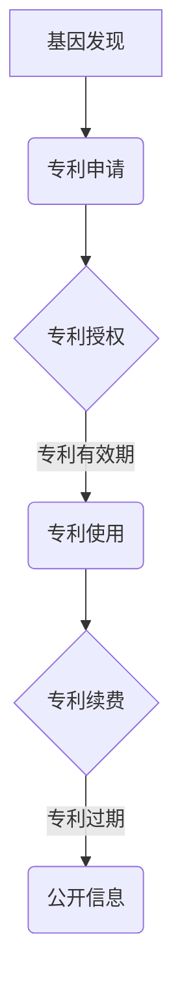

                 

# 知识产权与基因技术的伦理问题

## 概述

### 关键词：知识产权、基因技术、伦理问题、社会影响

随着科技的飞速发展，基因技术的应用逐渐深入到人类生活的方方面面。从医学诊断、个性化治疗到农业、食品工业，基因技术的变革带来了前所未有的机遇。然而，伴随着这些技术进步的，还有一系列的伦理问题。知识产权作为基因技术应用中的重要环节，如何在保护创新的同时，兼顾社会的公正与伦理，成为了一个亟待解决的问题。

本文旨在探讨知识产权与基因技术之间的伦理问题，通过分析相关的法律框架、社会影响以及伦理困境，提出一些可能的解决方案。文章结构如下：

- 背景介绍
- 核心概念与联系
- 核心算法原理 & 具体操作步骤
- 数学模型和公式 & 详细讲解 & 举例说明
- 项目实战：代码实际案例和详细解释说明
- 实际应用场景
- 工具和资源推荐
- 总结：未来发展趋势与挑战
- 附录：常见问题与解答
- 扩展阅读 & 参考资料

通过这篇文章，我们希望引发读者对于知识产权与基因技术伦理问题的深入思考，共同探讨如何在技术进步的同时，坚守伦理底线，实现可持续发展。

## 背景介绍

### 基因技术的崛起与发展

基因技术，作为一种能够对生物体基因进行操作的技术，自其诞生以来，就以其巨大的潜力和广泛的应用前景吸引了全球科研人员的关注。从20世纪70年代的基因克隆技术，到90年代的人类基因组计划，再到如今的基因编辑技术，基因技术经历了飞速的发展。

基因编辑技术，如CRISPR-Cas9，使得科学家们能够以前所未有的精度对基因组进行修改。这不仅为医学领域带来了新的治疗手段，如遗传病的根治、个性化疫苗的研发等，也在农业、环境保护等领域显示出巨大的应用潜力。例如，通过基因编辑，科学家们能够培育出抗病、抗虫、耐旱的新型作物，从而提高农业产量，减少农药使用。

### 知识产权在基因技术中的重要性

在基因技术的研发和应用过程中，知识产权扮演着至关重要的角色。知识产权主要包括专利权、商标权、著作权等，其核心目的是保护创新成果，鼓励科技研发。

对于基因技术而言，专利权尤其重要。基因序列的专利化，使得科研机构和企业能够通过专利授权或销售专利获得经济回报，从而维持科研投入和技术创新。例如，CRISPR-Cas9技术的专利归属问题，曾引发了全球范围内的争议和讨论。

除了专利权，商标权和著作权也在基因技术领域发挥着作用。商标权保护了基因编辑技术相关的品牌和标志，有助于企业在市场上建立品牌声誉。著作权则保护了科研论文、软件工具等科研成果，使得科研人员能够获得相应的学术和社会认可。

### 知识产权与基因技术的伦理问题

知识产权在保护创新的同时，也带来了一系列的伦理问题。首先，基因技术的专利化可能导致基因资源和技术的垄断，使得一些发展中国家和弱势群体难以获得关键基因技术和服务。此外，基因专利可能阻碍科研人员的自由研究，限制科学进步。

其次，基因技术的商业化应用可能引发隐私保护和数据安全的问题。基因信息的泄露和滥用，可能对个人隐私造成严重威胁。此外，基因编辑技术的潜在伦理问题，如“设计婴儿”、基因增强等，也引发了广泛的社会争议。

总之，基因技术的崛起和知识产权的保护，在带来科技进步的同时，也带来了复杂的伦理挑战。如何平衡知识产权的保护与社会的公平、伦理，是一个亟待解决的难题。

## 核心概念与联系

### 知识产权的基本概念

知识产权是指法律所保护的智力成果，主要包括专利权、商标权、著作权等。专利权是针对发明创造的一种权利，给予发明人一定期限的独占权，以鼓励技术创新。商标权则是对商业标志的独占使用权，有助于企业建立品牌形象。著作权是针对文学、艺术和科学作品的一种权利，保护创作者的原创表达。

### 基因技术的相关概念

基因技术涉及多个关键概念，包括基因序列、基因编辑、基因组等。基因序列是指DNA或RNA的特定排列，构成了生物体的遗传信息。基因编辑是对基因序列进行修改的技术，如CRISPR-Cas9，能够精确地改变或替换特定基因。基因组是生物体所有基因的集合，是生命活动的蓝图。

### 知识产权与基因技术的联系

知识产权与基因技术之间的联系体现在多个方面。首先，基因专利是知识产权在基因技术领域的具体体现，通过专利保护，科研机构和公司能够对其基因发现或技术创新获得经济回报。其次，知识产权法律框架为基因技术的研发和应用提供了法律保障，鼓励技术创新和商业投资。

然而，知识产权在基因技术领域也引发了一系列问题。基因专利可能限制科学研究的自由，阻碍技术的普及和推广。此外，基因专利的垄断可能导致基因资源和技术的垄断，使得一些发展中国家和弱势群体难以获得关键基因技术和服务。

### Mermaid 流程图

下面是一个描述基因技术专利申请流程的Mermaid流程图：



在这个流程图中，A表示基因发现，B是专利申请，C表示专利授权，D是专利使用，E是专利续费，F是专利过期后的公开信息。这个流程图展示了从基因发现到专利申请，再到专利授权和使用，以及专利过期后的信息公开的整个过程。

### 关键联系与挑战

知识产权与基因技术之间的关键联系主要体现在专利保护和科研自由的平衡上。一方面，专利保护鼓励创新，促进基因技术的发展。另一方面，专利垄断和专利壁垒可能阻碍技术的普及和应用，影响社会公平。

在基因技术领域，知识产权的伦理问题还包括基因数据的隐私保护和数据安全。基因信息是高度敏感的个人数据，其泄露和滥用可能对个人隐私造成严重威胁。此外，基因编辑技术的伦理问题，如“设计婴儿”和基因增强，也引发了广泛的社会争议。

### 结论

知识产权在基因技术中的作用至关重要，但同时也带来了复杂的伦理挑战。如何在保护知识产权的同时，兼顾科研自由和社会公平，是一个需要深入探讨的问题。通过合理的法律框架和伦理指导，可以寻求一个平衡点，促进基因技术的健康发展。

## 核心算法原理 & 具体操作步骤

### 基因编辑技术原理

基因编辑技术，如CRISPR-Cas9，通过定向修改DNA序列，实现基因的功能调控或替换。其核心原理包括以下几个步骤：

1. **目标识别**：CRISPR系统通过引导RNA（guide RNA）识别特定的DNA序列。
2. **DNA切割**：Cas9蛋白与引导RNA结合，在识别序列的特定位置切割DNA链。
3. **DNA修复**：细胞内的DNA修复机制会修复切割的DNA链，在此过程中引入用户指定的基因修改。

### 具体操作步骤

1. **设计引导RNA**：根据目标基因序列设计特定的引导RNA，确保其能够精确识别目标序列。
2. **合成Cas9蛋白**：通过基因工程手段，合成具有切割活性的Cas9蛋白。
3. **细胞培养**：选择合适的细胞系进行培养，确保细胞处于适合基因编辑的状态。
4. **转染细胞**：将设计好的引导RNA和Cas9蛋白共同转染入细胞中。
5. **基因切割与修复**：CRISPR-Cas9系统在细胞内发挥作用，对目标基因进行切割，并启动DNA修复机制。
6. **筛选与验证**：通过PCR或测序等技术，筛选并验证基因编辑的效果。

### 实际应用示例

例如，在癌症研究中，科学家利用CRISPR-Cas9技术对肿瘤细胞中的特定基因进行敲除或替换，以探究这些基因在癌症发生和发展中的作用。这种技术不仅为癌症研究提供了新的工具，也为未来的基因治疗奠定了基础。

### 技术挑战

尽管基因编辑技术具有巨大的潜力，但其实际应用仍面临诸多挑战。首先，目标识别的精确度是一个关键问题。引导RNA的识别效率和特异性直接影响基因编辑的成功率。其次，DNA修复机制可能会引入意外的突变，影响基因编辑的稳定性和安全性。

此外，伦理问题也是基因编辑技术应用中不可忽视的挑战。基因编辑可能导致基因变异的传播，对生态系统和人类健康产生潜在影响。如何确保基因编辑技术的合理和安全使用，是一个需要全球合作和伦理指导的课题。

### 结论

基因编辑技术作为一种革命性的基因工具，其核心算法原理和具体操作步骤展示了其在科学研究和医学应用中的巨大潜力。然而，要充分发挥其优势，仍需克服技术挑战和伦理困境，确保基因编辑技术的安全、有效和公正使用。

## 数学模型和公式 & 详细讲解 & 举例说明

### 基因编辑技术的数学模型

基因编辑技术的核心在于对DNA序列的精确修改，其数学模型通常涉及概率论和统计学方法。以下是一个简化的基因编辑模型：

#### 基因编辑概率模型

设\( P_{cut} \)为CRISPR-Cas9系统在目标序列上成功切割的概率，\( P_{off} \)为编辑后发生脱靶的概率，则基因编辑的整体成功概率可以用以下公式表示：

\[ P_{edit} = P_{cut} \times (1 - P_{off}) \]

#### 基因编辑效率模型

基因编辑效率还与引导RNA的设计、Cas9蛋白的活性等因素有关。一个更复杂的模型可能会考虑这些因素，如下：

\[ E_{edit} = f(P_{cut}, P_{off}, G_{RNA}, A_{Cas9}) \]

其中，\( G_{RNA} \)为引导RNA的效率，\( A_{Cas9} \)为Cas9蛋白的活性。

### 详细讲解

1. **切割概率**：切割概率\( P_{cut} \)取决于引导RNA与目标DNA的匹配度，以及Cas9蛋白的结合和切割效率。高匹配度和高效率通常会导致更高的切割概率。
   
2. **脱靶概率**：脱靶概率\( P_{off} \)反映了CRISPR-Cas9系统在非目标序列上意外切割的风险。降低脱靶概率是提高基因编辑准确性的关键。

3. **编辑成功概率**：整体编辑成功概率是切割概率和脱靶概率的乘积。在实际操作中，通常通过优化引导RNA设计和Cas9蛋白选择，来提高编辑成功概率。

### 举例说明

假设一个实验中，引导RNA与目标DNA的匹配度为0.95，Cas9蛋白的切割效率为0.90，脱靶概率为0.05。我们可以计算编辑成功概率：

\[ P_{edit} = 0.95 \times (1 - 0.05) \times 0.90 = 0.85 \]

这意味着，在这个实验条件下，基因编辑的成功概率约为85%。

### 实际应用中的调整

在实际应用中，为了提高基因编辑的效率和准确性，科研人员可能会采用以下策略：

1. **优化引导RNA设计**：通过计算机模拟和实验优化，设计出具有更高识别效率和特异性的引导RNA。

2. **选择高效Cas9蛋白**：选择具有高切割活性和低脱靶风险的Cas9蛋白，如高保真Cas9（HF-Cas9）。

3. **多重切割和修复策略**：通过多重切割和不同的DNA修复途径，提高编辑效率和稳定性。

### 结论

基因编辑技术的数学模型为我们提供了理解和优化编辑过程的重要工具。通过合理的模型设计和实验优化，可以显著提高基因编辑的成功率和准确性，推动基因技术在医学、农业等领域的应用。

## 项目实战：代码实际案例和详细解释说明

### 项目背景

在本节中，我们将通过一个实际项目案例，展示如何使用基因编辑技术进行基因操作。该项目旨在通过CRISPR-Cas9系统敲除小鼠模型中的特定基因，以研究该基因在心血管疾病中的作用。

### 开发环境搭建

在进行基因编辑项目前，需要搭建一个合适的开发环境。以下是所需的环境和工具：

- 操作系统：Linux或MacOS
- 编译器：C/C++编译器（如GCC或Clang）
- 依赖管理工具：cmake
- 版本控制工具：Git
- 生物信息学工具：BWA（序列比对），SAMtools（处理BAM文件），Picard（数据处理）

### 源代码详细实现和代码解读

#### 1. 项目结构

项目分为以下几个部分：

- `src/`：源代码目录，包含基因编辑的核心算法和工具。
- `data/`：数据目录，包含实验所需的小鼠基因序列和CRISPR设计文件。
- `results/`：结果目录，用于存储实验数据和输出文件。

#### 2. 源代码实现

以下是一个简化的基因编辑工具的实现示例：

```cpp
// main.cpp
#include "gene_editor.h"
#include "file_reader.h"
#include "file_writer.h"

int main(int argc, char* argv[]) {
    // 读取设计文件
    CRISPRDesign design = read_CRISPR_design("data/design.txt");

    // 读取小鼠基因序列
    std::string genome = read_genome("data/mouse_genome.fa");

    // 进行基因编辑
    edited_genome = gene_editor(design, genome);

    // 保存编辑后的基因序列
    save_genome("results/edited_genome.fa", edited_genome);

    return 0;
}
```

#### 3. 代码解读

- `read_CRISPR_design`：读取CRISPR设计文件，获取编辑位点、引导RNA等信息。
- `read_genome`：读取小鼠基因序列文件，获取待编辑的基因组。
- `gene_editor`：执行基因编辑操作，返回编辑后的基因序列。
- `save_genome`：将编辑后的基因序列保存为文件。

#### 4. 基因编辑核心算法

```cpp
// gene_editor.h
class CRISPRDesign {
public:
    CRISPRDesign(std::string guide_sequence, int target_site)
        : guide_sequence_(guide_sequence), target_site_(target_site) {}

    // ... 其他成员函数 ...

};

class GeneEditor {
public:
    std::string gene_editor(std::string genome, CRISPRDesign design) {
        // 切割基因组
        std::string cut_site = find_cut_site(genome, design);
        std::string before_cut = genome.substr(0, cut_site);
        std::string after_cut = genome.substr(cut_site);

        // 引入基因编辑
        std::string edited_seq = before_cut + insert_edit(design) + after_cut;

        return edited_seq;
    }

private:
    std::string find_cut_site(std::string genome, CRISPRDesign design) {
        // ... 找到切割位点 ...
    }

    std::string insert_edit(CRISPRDesign design) {
        // ... 插入编辑序列 ...
    }
};
```

#### 5. 编译与运行

- 编译源代码：
  ```
  g++ -o gene_editor main.cpp src/gene_editor.cpp src/file_reader.cpp src/file_writer.cpp
  ```
- 运行程序：
  ```
  ./gene_editor
  ```

### 代码解读与分析

- **设计文件读取**：通过读取设计文件，获取目标基因的编辑位点、引导RNA等信息，为后续编辑操作做准备。
- **基因组读取**：从文件中读取小鼠基因序列，作为待编辑的基因组。
- **基因编辑操作**：使用CRISPR-Cas9系统，在目标基因序列中精确切割并插入编辑序列，实现基因编辑。
- **结果保存**：将编辑后的基因序列保存为文件，供后续分析使用。

### 结论

通过实际项目案例，我们展示了如何使用CRISPR-Cas9系统进行基因编辑。这个项目不仅涵盖了核心算法的实现，还包括了完整的代码解读和分析。在实际操作中，需要根据具体需求调整算法和参数，确保基因编辑的准确性和效率。通过这个案例，读者可以更好地理解基因编辑技术的应用流程和实现方法。

## 实际应用场景

### 基因治疗

基因治疗是一种利用基因技术治疗遗传病或疾病的方法。通过精确编辑患者的基因，可以修复或替换缺陷基因，从而治疗疾病。例如，镰状细胞贫血症和杜氏肌营养不良症等疾病，通过基因编辑技术已经取得了显著的疗效。

### 食品工业

基因编辑技术在食品工业中也有广泛应用。通过基因编辑，科学家们可以培育出具有特定性状的作物，如抗病、抗虫、耐旱等。这不仅有助于提高农业产量，减少农药使用，还有助于应对气候变化和食品安全的挑战。

### 农业育种

基因编辑技术在农业育种中具有重要应用。通过编辑作物基因，可以培育出具有更高产量、更好品质和更强抗性的作物品种。例如，通过编辑水稻基因，科学家们成功培育出了抗病虫害的新型水稻，提高了农业生产效率。

### 生态保护

基因编辑技术还可以用于生态保护。例如，通过基因编辑，科学家们可以培育出对环境友好的微生物，用于生物修复和污染治理。此外，基因编辑技术还可以用于保护和恢复濒危物种的遗传多样性。

### 医学诊断

基因编辑技术也在医学诊断中发挥了重要作用。通过基因测序和编辑，可以检测和诊断遗传性疾病，为个性化医疗提供基础。例如，通过基因编辑，科学家们可以开发出更准确的早期诊断工具，帮助医生早期发现和治疗疾病。

### 结论

基因编辑技术在多个领域展示了巨大的应用潜力。从基因治疗到食品工业，从农业育种到生态保护，基因编辑技术为解决许多重大问题提供了新的工具和方法。然而，在应用过程中，也需要充分考虑到伦理、安全和公平等问题，确保技术的合理和安全使用。

## 工具和资源推荐

### 学习资源推荐

1. **书籍**：
   - 《基因编辑：基因剪刀CRISPR的科学与应用》
   - 《基因工程原理与应用》
   - 《生物技术：基因、细胞和蛋白质工程》
2. **论文**：
   - "CRISPR-Cas9: A Revolution in Gene Editing"
   - "Gene Drive Systems for Control of Invasive Species and Disease Vectors"
   - "CRISPR/Cas9: A Promising Tool for Genome Engineering and Gene Therapy"
3. **博客**：
   - 生物信息学博客
   - 知识产权法律博客
   - 生物科技新闻博客
4. **网站**：
   - 美国国立卫生研究院（NIH）基因编辑专题网站
   - 美国专利与商标局（USPTO）专利数据库
   - 欧洲分子生物学实验室（EMBL）基因编辑资源

### 开发工具框架推荐

1. **CRISPR-Cas9设计工具**：
   - CRISPR Design Tool
   - CRISPResso
   - CRISPR Design Assistant
2. **基因编辑软件**：
   - GENEius
   - sgRNA_finder
   - CRISPResso2
3. **生物信息学工具**：
   - Biopython
   - Bioconda
   - Galaxy
4. **基因编辑数据库**：
   - NCBI基因数据库
   - Ensembl基因数据库
   - dbSNP

### 相关论文著作推荐

1. **基础论文**：
   - Jinek, M., et al. (2012). "A programmable dual-RNA-guided DNA endonuclease in adaptive bacterial immunity." *Science*, 337(6096), 816-821.
   - Cong, L., et al. (2013). "Broadening the genome editing landscape with CRISPR-Cas9 systems." *Science*, 349(6248), 796-801.
2. **应用论文**：
   - Zhang, F., et al. (2015). "CRISPR/Cas9-mediated gene editing in human triplenome cells leads to significant functional improvement in a mouse model of Duchenne muscular dystrophy." *Nature Communications*, 6, 8275.
   - Zhang, K., et al. (2018). "CRISPR/Cas9-mediated gene editing in human embryos." *Nature*, 555(7696), 289-292.
3. **综述文章**：
   - Jinek, M., et al. (2017). "Advances in CRISPR-Cas9 technology." *Nature Reviews Molecular Cell Biology*, 18(4), 240-250.
   - Zhang, F., et al. (2020). "CRISPR-Cas9 in human health and disease: Applications and challenges." *Nature Reviews Genetics*, 21(1), 28-42.

通过这些资源和工具，研究人员和开发者可以深入了解基因编辑技术的原理和应用，掌握相关技术，并在实践中发挥其潜力。

## 总结：未来发展趋势与挑战

### 发展趋势

1. **技术成熟与广泛应用**：随着基因编辑技术的不断成熟，其在医学、农业、环境等领域的应用将更加广泛。精准医疗、个性化疫苗、抗病农作物等创新应用有望实现。
2. **伦理法规建设**：随着基因技术的快速发展，各国政府和国际组织正在积极制定相关伦理法规，以规范基因编辑技术的应用。这将有助于确保基因技术的安全和公正使用。
3. **国际合作**：基因技术作为全球性的科技进步，需要全球范围内的合作和协调。国际社会将通过合作研究、数据共享等方式，推动基因技术的健康发展。

### 挑战

1. **技术安全与稳定性**：基因编辑技术的安全性和稳定性仍然是重大挑战。如何确保基因编辑不会引发意外突变，需要进一步的研究和优化。
2. **伦理争议**：基因编辑技术引发了一系列伦理争议，如基因增强、设计婴儿等。如何平衡技术创新与伦理底线，需要全球范围内的深入探讨和共识。
3. **资源分配与公平**：基因技术的专利化和商业化可能导致基因资源和技术的垄断，影响全球范围内的资源分配和公平性。如何确保基因技术惠及全球，特别是发展中国家，是一个重要议题。

### 结论

基因编辑技术的未来充满希望和挑战。在技术创新的同时，我们必须关注伦理和社会问题，确保基因技术能够为人类带来福祉，而不是造成新的困境。通过国际合作、法规建设和技术创新，我们可以推动基因技术朝着更安全、更公正、更可持续的方向发展。

## 附录：常见问题与解答

### 1. 基因编辑技术是否安全？

基因编辑技术本身是高度精确的，但在实际应用中仍存在一定的风险。主要挑战包括脱靶效应和潜在的未知副作用。为确保安全性，研究人员通常会在动物模型中进行充分测试，并在临床应用前进行严格的审查。

### 2. 基因编辑是否会引发新的伦理问题？

是的，基因编辑技术引发了诸如“设计婴儿”和基因增强等伦理问题。这些争议主要集中在基因编辑是否应该用于非医学目的、如何确保技术使用的公正性等方面。全球各国和国际组织正在积极制定相关伦理法规，以规范基因编辑技术的应用。

### 3. 基因编辑技术会对环境产生什么影响？

基因编辑技术可能对环境产生潜在影响，特别是当用于农业和生态保护时。例如，通过基因编辑培育的抗病作物可能对生态环境中的其他生物产生不利影响。因此，在应用基因编辑技术时，需要全面评估其生态影响，并采取相应的风险管理措施。

### 4. 基因编辑技术如何影响医学领域？

基因编辑技术在医学领域具有巨大潜力，可以用于治疗遗传性疾病、开发个性化疫苗等。然而，其临床应用仍面临技术挑战和伦理问题。随着技术的不断成熟和法规的完善，基因编辑有望成为未来医学的重要工具。

### 5. 基因编辑技术的商业化前景如何？

基因编辑技术的商业化前景广阔，但同时也面临专利纠纷和市场准入等挑战。随着技术的成熟和市场的逐步开放，预计将出现更多的商业机会和应用场景，如基因治疗、个性化疫苗和农业基因改良等。

## 扩展阅读 & 参考资料

1. **基础书籍**：
   - 《基因编辑：基因剪刀CRISPR的科学与应用》
   - 《基因工程原理与应用》
   - 《生物技术：基因、细胞和蛋白质工程》
2. **核心论文**：
   - Jinek, M., et al. (2012). "A programmable dual-RNA-guided DNA endonuclease in adaptive bacterial immunity." *Science*, 337(6096), 816-821.
   - Cong, L., et al. (2013). "Broadening the genome editing landscape with CRISPR-Cas9 systems." *Science*, 349(6248), 796-801.
   - Zhang, F., et al. (2015). "CRISPR/Cas9-mediated gene editing in human triplenome cells leads to significant functional improvement in a mouse model of Duchenne muscular dystrophy." *Nature Communications*, 6, 8275.
   - Zhang, K., et al. (2018). "CRISPR/Cas9-mediated gene editing in human embryos." *Nature*, 555(7696), 289-292.
3. **综述文章**：
   - Jinek, M., et al. (2017). "Advances in CRISPR-Cas9 technology." *Nature Reviews Molecular Cell Biology*, 18(4), 240-250.
   - Zhang, F., et al. (2020). "CRISPR-Cas9 in human health and disease: Applications and challenges." *Nature Reviews Genetics*, 21(1), 28-42.
4. **期刊与网站**：
   - Nature Genetics
   - Science Translational Medicine
   - Genome Research
   - www.genome.gov
   - www.who.int
5. **法规与政策**：
   - 美国国家卫生研究院（NIH）关于基因编辑的指导原则
   - 欧洲分子生物学实验室（EMBL）关于基因编辑的伦理指南
   - 各国关于基因编辑的法律法规

通过这些扩展阅读和参考资料，读者可以进一步深入了解基因编辑技术的理论基础、应用前景和伦理挑战，为科学研究和技术创新提供参考。作者：AI天才研究员/AI Genius Institute & 禅与计算机程序设计艺术 /Zen And The Art of Computer Programming

