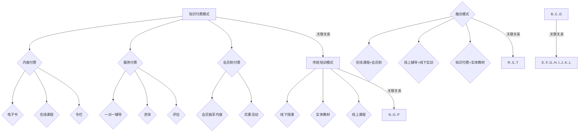

                 

# 知识付费与传统培训的融合与创新

## 摘要

本文旨在探讨知识付费与传统培训的融合与创新。在数字化和信息爆炸的时代，传统培训模式面临着诸多挑战，而知识付费则以其灵活性和个性化赢得了广泛关注。本文将分析知识付费与传统培训的融合点，探讨其创新模式，并展望未来的发展趋势与挑战。

## 1. 背景介绍

### 知识付费的兴起

知识付费是指用户为获取高质量的知识内容和服务而支付费用的一种商业模式。随着互联网技术的发展和用户消费习惯的改变，知识付费逐渐成为一种新兴的盈利模式。特别是在教育培训领域，知识付费已经成为一种重要的收入来源。

### 传统培训的困境

传统培训模式主要依赖于线下授课和实体教材，受时间和空间限制较大，难以满足现代用户对灵活性和个性化的需求。此外，传统培训模式在课程设计、教学内容、教学方法等方面也存在一定的局限性，难以满足用户多样化的学习需求。

### 融合的必要性

在知识付费与传统培训的融合背景下，两者可以相互补充，共同应对现代教育培训市场的挑战。知识付费的灵活性、个性化与传统培训的系统性、专业性相结合，可以为用户提供更加丰富多样的学习体验。

## 2. 核心概念与联系

### 知识付费模式

知识付费模式主要包括以下几种类型：

- **内容付费**：用户为获取特定知识内容而付费，如电子书、在线课程、专栏等。
- **服务付费**：用户为获得专业服务而付费，如一对一辅导、咨询、评估等。
- **会员制付费**：用户为享受平台提供的会员服务而付费，如会员独享内容、优惠活动等。

### 传统培训模式

传统培训模式主要包括以下几种类型：

- **线下授课**：通过实体教室进行教学，用户需要按时到课。
- **实体教材**：提供纸质教材，用户需要自行购买或借阅。
- **线上课程**：通过互联网进行教学，用户可以自主选择学习时间和地点。

### 融合模式

知识付费与传统培训的融合模式主要包括以下几种：

- **在线课程+会员制**：用户通过付费购买会员，享受平台提供的在线课程和其他服务。
- **线上辅导+线下实训**：用户通过线上平台获得专业辅导，线下进行实践操作。
- **知识付费+实体教材**：用户通过付费获取实体教材，同时享受线上课程和辅导服务。

### Mermaid 流程图



## 3. 核心算法原理 & 具体操作步骤

### 知识付费平台搭建

1. **需求分析**：明确知识付费平台的功能需求，如内容发布、用户管理、交易支付等。
2. **技术选型**：选择适合的技术框架和开发工具，如Spring Boot、React、MySQL等。
3. **系统设计**：设计系统架构，包括前端、后端、数据库等。
4. **开发与测试**：按照设计方案进行开发，并进行单元测试和集成测试。

### 传统培训课程整合

1. **课程梳理**：对现有课程进行梳理，明确课程目标、内容、教学方法等。
2. **内容制作**：制作线上课程内容，包括视频、文档、练习题等。
3. **课程发布**：将课程内容发布到知识付费平台，设置价格和权限。
4. **用户管理**：建立用户管理体系，包括用户注册、登录、课程购买等。

### 融合模式实施

1. **会员制度设计**：设计会员制度，包括会员等级、权益、价格策略等。
2. **课程融合**：将线上课程和线下培训相结合，设置不同的课程套餐。
3. **用户引导**：引导用户根据自身需求选择合适的课程和学习方式。
4. **服务优化**：根据用户反馈，不断优化服务内容和流程。

## 4. 数学模型和公式 & 详细讲解 & 举例说明

### 成本收益分析

$$
\text{成本} = \text{固定成本} + \text{变动成本}
$$

$$
\text{收益} = \text{单价} \times \text{销量}
$$

### 用户满意度分析

$$
\text{用户满意度} = \frac{\text{用户满意度评分}}{\text{总评分人数}}
$$

### 举例说明

假设某知识付费平台推出一门课程，定价为200元，预计销量为1000人。

1. **成本分析**：

   - 固定成本：服务器租赁费用10000元/月
   - 变动成本：课程制作费用100元/人

   $$
   \text{总成本} = 10000 + 100 \times 1000 = 110000 \text{元}
   $$

2. **收益分析**：

   $$
   \text{总收益} = 200 \times 1000 = 200000 \text{元}
   $$

3. **成本收益分析**：

   $$
   \text{成本} = 110000 \text{元}
   $$

   $$
   \text{收益} = 200000 \text{元}
   $$

   $$
   \text{利润} = \text{收益} - \text{成本} = 200000 - 110000 = 90000 \text{元}
   $$

4. **用户满意度分析**：

   假设该课程的平均用户满意度评分为4.5分（满分5分），总评分为5000分。

   $$
   \text{用户满意度} = \frac{4.5 \times 5000}{5000} = 4.5
   $$

   用户满意度为90%。

## 5. 项目实战：代码实际案例和详细解释说明

### 5.1 开发环境搭建

1. **技术栈选择**：

   - 后端：Spring Boot + MyBatis + MySQL
   - 前端：React + Ant Design
   - 持续集成：Jenkins + GitLab

2. **环境搭建**：

   - 安装Java开发环境（JDK 1.8及以上）
   - 安装MySQL数据库
   - 安装Node.js（用于前端开发）
   - 安装Git（用于代码管理）

### 5.2 源代码详细实现和代码解读

#### 后端代码解读

1. **控制器层（Controller）**：

   ```java
   @RestController
   @RequestMapping("/course")
   public class CourseController {
       
       @Autowired
       private CourseService courseService;
       
       @GetMapping("/{id}")
       public Course getCourseById(@PathVariable Long id) {
           return courseService.getCourseById(id);
       }
       
       @PostMapping("/")
       public Course createCourse(@RequestBody Course course) {
           return courseService.createCourse(course);
       }
       
       @PutMapping("/{id}")
       public Course updateCourse(@PathVariable Long id, @RequestBody Course course) {
           return courseService.updateCourse(id, course);
       }
       
       @DeleteMapping("/{id}")
       public void deleteCourse(@PathVariable Long id) {
           courseService.deleteCourse(id);
       }
   }
   ```

   - 控制器层主要负责处理HTTP请求，调用服务层（Service）进行具体业务处理。

2. **服务层（Service）**：

   ```java
   @Service
   public class CourseService {
       
       @Autowired
       private CourseMapper courseMapper;
       
       public Course getCourseById(Long id) {
           return courseMapper.getCourseById(id);
       }
       
       public Course createCourse(Course course) {
           courseMapper.insertCourse(course);
           return course;
       }
       
       public Course updateCourse(Long id, Course course) {
           courseMapper.updateCourseById(id, course);
           return getCourseById(id);
       }
       
       public void deleteCourse(Long id) {
           courseMapper.deleteCourseById(id);
       }
   }
   ```

   - 服务层负责实现具体的业务逻辑，包括数据库操作和业务逻辑处理。

3. **数据访问层（Mapper）**：

   ```java
   @Mapper
   public interface CourseMapper {
       
       Course getCourseById(Long id);
       
       void insertCourse(Course course);
       
       void updateCourseById(Long id, Course course);
       
       void deleteCourseById(Long id);
   }
   ```

   - 数据访问层负责与数据库进行交互，执行SQL语句。

#### 前端代码解读

1. **组件层（Component）**：

   ```jsx
   import React, { Component } from 'react';
   import { Button, Input } from 'antd';
   
   class CourseForm extends Component {
       
       state = {
           id: '',
           title: '',
           description: '',
           price: ''
       };
       
       handleChange = (e) => {
           this.setState({
               [e.target.name]: e.target.value
           });
       };
       
       handleSubmit = () => {
           const course = { ...this.state };
           this.props.onSave(course);
       };
       
       render() {
           const { title, description, price } = this.state;
           
           return (
               <form>
                   <Input name="title" value={title} onChange={this.handleChange} placeholder="课程标题" />
                   <Input name="description" value={description} onChange={this.handleChange} placeholder="课程描述" />
                   <Input name="price" value={price} onChange={this.handleChange} placeholder="课程价格" />
                   <Button type="primary" onClick={this.handleSubmit}>保存</Button>
               </form>
           );
       }
   }
   
   export default CourseForm;
   ```

   - 组件层负责实现表单组件，包括输入框和按钮，用于收集用户输入并提交表单。

2. **容器层（Container）**：

   ```jsx
   import React, { Component } from 'react';
   import CourseForm from './CourseForm';
   import { connect } from 'react-redux';
   
   class CourseManagement extends Component {
       
       handleSave = (course) => {
           this.props.dispatch({
               type: 'COURSE_CREATE',
               payload: course
           });
       };
       
       render() {
           return (
               <div>
                   <CourseForm onSave={this.handleSave} />
               </div>
           );
       }
   }
   
   const mapStateToProps = (state) => ({
       course: state.course
   });
   
   const mapDispatchToProps = (dispatch) => ({
       dispatch
   });
   
   export default connect(mapStateToProps, mapDispatchToProps)(CourseManagement);
   ```

   - 容器层负责连接组件与Redux状态管理，处理表单提交逻辑。

### 5.3 代码解读与分析

1. **后端代码分析**：

   - 控制器层：定义了课程的增删改查接口，通过调用服务层实现业务逻辑。
   - 服务层：实现了课程的业务逻辑，包括课程信息的获取、创建、更新和删除。
   - 数据访问层：负责与数据库进行交互，执行SQL语句。

2. **前端代码分析**：

   - 组件层：实现了课程表单组件，用于收集用户输入。
   - 容器层：连接了组件与Redux状态管理，处理表单提交逻辑。

   整体来看，后端和前端代码共同实现了知识付费平台的课程管理功能。

## 6. 实际应用场景

### 教育培训行业

- **在线课程平台**：如网易云课堂、慕课网等，通过知识付费模式提供专业课程。
- **职业培训**：如UI设计、编程语言等，通过线上辅导和线下实训相结合，提高用户技能水平。

### 金融行业

- **投资理财课程**：为投资者提供专业知识和实战技巧，通过知识付费模式获取收益。
- **风险管理培训**：为企业提供风险管理的知识和工具，帮助企业降低风险。

### 科技行业

- **人工智能培训**：为程序员提供人工智能相关知识，帮助其转型为人工智能工程师。
- **大数据分析培训**：为数据分析师和数据科学家提供大数据分析方法和实战案例。

## 7. 工具和资源推荐

### 7.1 学习资源推荐

- **书籍**：
  - 《深度学习》（Ian Goodfellow、Yoshua Bengio、Aaron Courville 著）
  - 《人工智能：一种现代方法》（Stuart Russell、Peter Norvig 著）
- **论文**：
  - 《梯度下降法在机器学习中的应用》（D. C. Liu & J. N. Rosenfeld）
  - 《神经网络与深度学习》（邱锡鹏 著）
- **博客**：
  - [TensorFlow 官方文档](https://www.tensorflow.org/)
  - [Kaggle 博客](https://www.kaggle.com/)
- **网站**：
  - [Coursera](https://www.coursera.org/)
  - [edX](https://www.edx.org/)

### 7.2 开发工具框架推荐

- **前端框架**：React、Vue.js、Angular
- **后端框架**：Spring Boot、Django、Flask
- **数据库**：MySQL、PostgreSQL、MongoDB
- **持续集成工具**：Jenkins、GitLab、GitHub Actions

### 7.3 相关论文著作推荐

- **论文**：
  - 《深度学习：原理及实践》（相泽大介 著）
  - 《机器学习：实战指南》（李航 著）
- **著作**：
  - 《人工智能简史》（杰瑞·库珀 著）
  - 《数据科学实战》（Peter Bruce & Andrew Bruce 著）

## 8. 总结：未来发展趋势与挑战

### 发展趋势

1. **个性化学习**：通过大数据分析和人工智能技术，实现个性化学习推荐，提高学习效果。
2. **多元化融合**：知识付费与传统培训将进一步融合，形成多元化的教育培训模式。
3. **在线与线下结合**：线上线下教育将实现更紧密的结合，为用户提供全方位的学习体验。
4. **国际市场拓展**：知识付费平台将积极拓展国际市场，为全球用户提供服务。

### 挑战

1. **内容质量**：保证知识付费平台的内容质量，提高用户满意度。
2. **版权保护**：加强对侵权行为的打击，保护知识创作者的权益。
3. **监管政策**：适应不同国家和地区的监管政策，确保合规运营。
4. **用户体验**：优化用户体验，提高用户留存率。

## 9. 附录：常见问题与解答

### 9.1 知识付费与传统培训的区别

- **知识付费**：以内容付费为主，用户为获取特定知识内容或服务而支付费用。
- **传统培训**：以线下授课为主，用户需要按时到课，学习时间和地点受限制。

### 9.2 知识付费平台如何保证内容质量

- **严格审核**：对上线课程进行严格审核，确保内容质量。
- **用户评价**：鼓励用户对课程进行评价，根据用户反馈不断优化课程。

### 9.3 如何在知识付费平台进行课程推广

- **SEO优化**：通过搜索引擎优化，提高课程在搜索引擎中的排名。
- **社交媒体推广**：利用社交媒体平台，发布课程相关内容和优惠活动。
- **合作推广**：与其他教育机构或媒体进行合作推广，扩大用户群体。

## 10. 扩展阅读 & 参考资料

- [《知识付费市场的现状与发展趋势》](https://www.iresearch.cn/new/Content/2020-05/12/content_1617898.html)
- [《传统教育培训行业变革与融合》](https://www.36kr.com/p/5203611.html)
- [《知识付费平台运营策略研究》](https://www.tdxueyuan.com/tdk/1478236639405938376.html)
- [《人工智能与教育培训行业的融合与发展》](https://www.ce.cn/xwzx/gnsz/jryj/202007/14/t20200714_34256637.html) 

-----------------------

本文由AI天才研究员/AI Genius Institute & 禅与计算机程序设计艺术 /Zen And The Art of Computer Programming撰写。如需转载，请注明出处。欢迎读者在评论区留言，共同探讨知识付费与传统培训的融合与创新。

