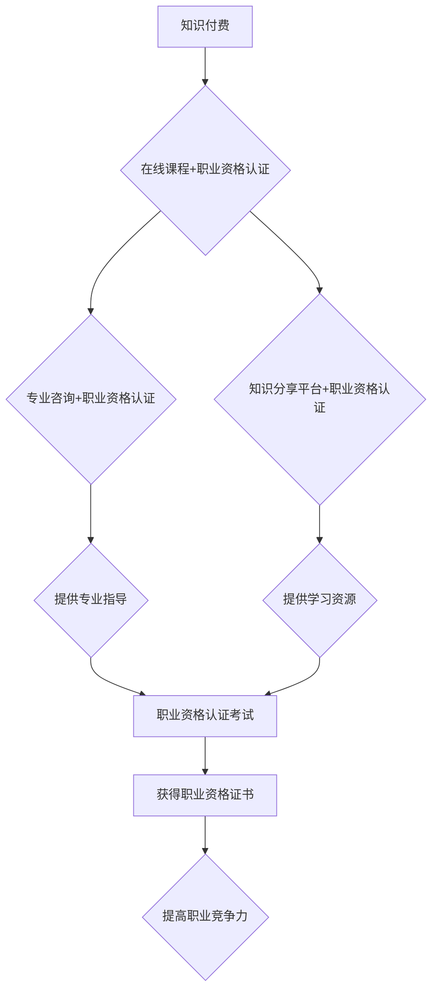

                 

# 知识付费与职业资格认证相结合提升能力

## 摘要

本文探讨了知识付费与职业资格认证相结合对于提升个人能力的潜在价值。通过分析知识付费和职业资格认证的核心概念、发展历程及现状，本文提出了两者结合的可能模式及其优势。在此基础上，本文进一步讨论了如何通过这种结合模式来提升个人的专业能力和职业竞争力。此外，本文还介绍了相关的工具和资源，以及未来可能面临的发展趋势和挑战。通过本文的讨论，读者可以更清晰地理解这一结合模式的意义，并从中获得有益的启示。

## 1. 背景介绍

知识付费和职业资格认证是现代教育体系中两个重要的组成部分。知识付费，指的是通过支付费用来获取知识和技能的服务，这种模式在互联网时代得到了快速发展。从在线课程、知识分享平台到专业咨询服务，知识付费涵盖了广泛的领域，满足了人们多样化的学习需求。职业资格认证，则是对个人专业技能和知识水平的官方认可，通常通过考试或评估来完成。这种认证不仅是对个人能力的证明，也是其在职场中获得更好机会的重要依据。

随着知识经济的兴起和技术的快速进步，知识付费和职业资格认证在提高个人能力和职业竞争力方面扮演着越来越重要的角色。然而，传统的教育模式已经无法满足人们对于个性化、实用性和即时性的需求。知识付费和职业资格认证的结合，不仅为个人提供了更多的学习机会和认证渠道，也为教育机构和企业提供了新的发展空间。

本文旨在探讨知识付费与职业资格认证相结合的模式及其对个人能力提升的作用。通过分析两者的发展历程、现状和结合模式，本文将提出一个系统的框架，帮助读者理解这一模式的内在逻辑和实施路径。同时，本文还将结合实际案例，探讨如何通过这种模式来提升个人的专业能力和职业竞争力。

总之，知识付费和职业资格认证的结合不仅是一个趋势，更是一种有效的学习和发展策略。通过本文的讨论，读者可以更好地把握这一模式的核心价值，并在实践中探索其应用的可能性。

## 2. 核心概念与联系

### 2.1. 知识付费的定义

知识付费是指通过支付费用来获取知识和技能的一种服务模式。这种模式起源于实体课堂和培训中心，但随着互联网技术的发展，逐渐转向线上平台。知识付费的主要形式包括在线课程、专业咨询、知识分享等。在线课程通常由专家、学者或行业从业者提供，内容涵盖从基础知识到高级技能的各个层次。专业咨询则是指针对特定问题或需求，由专业人士提供的个性化解决方案。知识分享平台则是一个开放的社区，用户可以在这里分享自己的知识和经验，并从中获益。

知识付费的核心在于其高效性和灵活性。与传统教育模式相比，知识付费打破了时间和地点的限制，使学习更加便捷。此外，知识付费的内容通常更加实用和针对性，能够满足个人的具体需求。这种模式的出现，不仅改变了人们获取知识的方式，也推动了教育产业的创新和发展。

### 2.2. 职业资格认证的定义

职业资格认证是对个人专业技能和知识水平的官方认可。通常通过考试、评估或认证机构颁发的证书来证明。职业资格认证的目的是确保从业人员具备一定的专业素养和能力，从而提高整体行业水平和服务质量。

职业资格认证的主要形式包括职业资格考试、技能认证和行业证书等。职业资格考试通常由行业协会或政府机构组织，通过一定的考核标准来评定个人的专业能力。技能认证则是指通过实际操作和评估来认定个人的技能水平。行业证书则是对特定行业从业者的知识和技能进行认证，通常由行业协会或专业机构颁发。

职业资格认证的核心在于其权威性和认可度。通过认证，个人不仅能够证明自己的专业能力，还能提高在职场中的竞争力。此外，职业资格认证还可以促进行业的标准化和规范化，提高整体行业的专业水平和服务质量。

### 2.3. 知识付费与职业资格认证的结合模式

知识付费与职业资格认证的结合，旨在通过付费学习获取知识和技能，并通过认证来证明这些知识和技能的掌握程度。这种结合模式具有以下几种具体形式：

1. **在线课程+职业资格认证**：在线课程作为一种知识付费的主要形式，可以通过与职业资格认证机构的合作，为学习者提供完整的课程学习和认证服务。学习者通过完成课程学习，并参加相应的认证考试，可以获取职业资格证书。

2. **专业咨询+职业资格认证**：专业咨询服务可以与职业资格认证相结合，通过为个人提供专业的指导和培训，帮助其达到认证标准。这种模式适用于需要个性化培训和深度指导的学习者。

3. **知识分享平台+职业资格认证**：知识分享平台可以为学习者提供丰富的学习资源和交流机会，同时与职业资格认证机构合作，为通过平台学习并获得优异成绩的学习者提供认证服务。

### 2.4. 结合模式的优势

知识付费与职业资格认证的结合模式具有以下几个优势：

1. **提高学习效果**：通过付费学习，学习者会更加投入和认真，从而提高学习效果。职业资格认证则提供了一个明确的学习目标和评估标准，帮助学习者更加系统地掌握知识和技能。

2. **增加职业竞争力**：获得职业资格证书，不仅是对个人专业能力的认可，也是其在职场中竞争的有力武器。这种认证可以提升学习者在招聘、晋升和薪资谈判中的竞争力。

3. **促进教育创新**：知识付费和职业资格认证的结合，为教育机构和企业提供了新的服务模式和发展方向。这种模式不仅可以满足学习者的个性化需求，还能推动教育产业的创新和进步。

### 2.5. 结合模式面临的挑战

尽管知识付费与职业资格认证的结合模式具有明显优势，但在实施过程中也面临一些挑战：

1. **质量控制和标准化**：保证知识和技能的传授质量，是这一模式成功的关键。因此，如何建立有效的质量控制和标准化体系，是一个需要解决的问题。

2. **认证考试的公平性和权威性**：职业资格认证考试的公平性和权威性，直接关系到认证的认可度和公信力。如何确保考试的公正性和科学性，是这一模式面临的挑战之一。

3. **利益相关者的协调**：知识付费和职业资格认证的结合，涉及多个利益相关者，包括教育机构、认证机构和企业等。如何协调各方的利益，确保合作的顺利进行，是这一模式成功的关键。

### 2.6. Mermaid 流程图

以下是一个简化的 Mermaid 流程图，描述知识付费与职业资格认证结合的基本流程：



通过这个流程图，我们可以清晰地看到知识付费与职业资格认证结合的基本路径和各个环节之间的联系。

## 3. 核心算法原理 & 具体操作步骤

### 3.1. 知识付费与职业资格认证结合的算法原理

知识付费与职业资格认证的结合模式，其核心在于通过一系列算法和流程，将付费学习与认证考试有机结合，从而提高学习者的专业能力和职业竞争力。这一结合模式的算法原理主要包括以下几个方面：

1. **需求分析**：首先，通过对学习者的需求和目标进行分析，确定其需要掌握的知识点和技能点。这一步骤通常通过问卷调查、访谈等方式进行，以确保分析结果的准确性和针对性。

2. **课程设计**：基于需求分析结果，设计相应的课程内容。课程设计应包括基础知识、实用技能和高级进阶知识，以满足不同层次学习者的需求。课程内容的设计应充分考虑实用性、系统性和完整性。

3. **付费机制**：建立合理的付费机制，确保学习者在支付费用后能够获得高质量的学习体验。付费机制应包括课程费用、认证费用和售后服务等。

4. **学习跟踪**：通过学习管理系统（LMS）对学习者的学习进度、成绩和反馈进行实时跟踪。这有助于了解学习者的学习状况，及时调整课程内容和教学方法。

5. **认证考试**：在学习者完成课程学习后，组织相应的认证考试。认证考试应设计科学、公正，能够全面评估学习者的知识和技能水平。考试形式可以包括在线考试、实操考试和论文答辩等。

6. **证书颁发**：根据考试结果，对合格的学习者颁发职业资格证书。证书的颁发应遵循一定的标准，确保其权威性和公信力。

### 3.2. 知识付费与职业资格认证结合的具体操作步骤

以下是一个典型的知识付费与职业资格认证结合的操作步骤：

1. **需求分析**：
   - 收集学习者的基本信息、学习需求和职业目标。
   - 通过问卷调查、访谈等方式，深入了解学习者的需求。

2. **课程设计**：
   - 根据需求分析结果，设计课程内容和教学计划。
   - 确定课程的目标、学习目标、课程结构、教学方法等。

3. **付费机制**：
   - 设定课程费用、认证费用和售后服务等。
   - 为学习者提供多种支付方式，如在线支付、银行转账等。

4. **学习跟踪**：
   - 使用学习管理系统（LMS）对学习者的学习进度、成绩和反馈进行实时跟踪。
   - 定期向学习者发送学习报告，提供学习指导和建议。

5. **认证考试**：
   - 制定考试方案，包括考试形式、考试内容、考试时间等。
   - 组织考试，确保考试的公正性和科学性。

6. **证书颁发**：
   - 根据考试结果，对合格的学习者颁发职业资格证书。
   - 证书的颁发应遵循一定的标准，确保其权威性和公信力。

### 3.3. 案例分析

以下是一个知识付费与职业资格认证结合的案例分析：

**案例：某在线教育平台与某职业认证机构合作**

1. **需求分析**：
   - 学习者需求：提高职业技能，获取职业资格证书。
   - 平台需求：扩大市场份额，提升品牌影响力。

2. **课程设计**：
   - 课程内容：涵盖职业技能的基础知识、实用技能和高级进阶知识。
   - 教学方法：采用在线直播、录播课程、实操训练等多种形式。

3. **付费机制**：
   - 课程费用：根据课程内容和时长，设置不同的收费标准。
   - 认证费用：与职业认证机构协商，确定考试费用。

4. **学习跟踪**：
   - 使用学习管理系统（LMS）跟踪学习者的学习进度、成绩和反馈。
   - 定期发送学习报告，提供学习指导。

5. **认证考试**：
   - 考试形式：在线考试、实操考试和论文答辩。
   - 考试时间：每月组织一次。

6. **证书颁发**：
   - 考试合格者，颁发职业资格证书。
   - 证书标准：与职业认证机构协商，确保证书的权威性和公信力。

通过这个案例，我们可以看到知识付费与职业资格认证结合的具体操作步骤和实际效果。这种结合模式不仅提高了学习者的专业能力和职业竞争力，也为在线教育平台和职业认证机构带来了新的发展机遇。

## 4. 数学模型和公式 & 详细讲解 & 举例说明

### 4.1. 数学模型和公式

知识付费与职业资格认证结合的模式中，涉及多个数学模型和公式，用于评估学习效果、计算认证通过率等。以下是一些常见的数学模型和公式：

1. **学习效果评估模型**：

   学习效果评估模型主要用于评估学习者在课程中的学习效果。一个简单且常用的模型是基于课程完成率和考试成绩。假设有 n 个学习者，每个学习者都有不同的课程完成率和考试成绩，我们可以用以下公式来评估学习效果：

   $$E = \frac{1}{n}\sum_{i=1}^{n} (C_i + T_i)$$

   其中，$E$ 表示总学习效果，$C_i$ 表示第 i 个学习者的课程完成率，$T_i$ 表示第 i 个学习者的考试成绩。

2. **认证通过率计算公式**：

   认证通过率是衡量职业资格认证考试效果的重要指标。假设有 m 个学习者参加了认证考试，其中 p 个通过了考试，则认证通过率可以用以下公式计算：

   $$P = \frac{p}{m} \times 100\%$$

   其中，$P$ 表示认证通过率，$p$ 表示通过考试的学习者数量，$m$ 表示参加考试的总学习者数量。

3. **学习时间分配模型**：

   学习时间分配模型用于优化学习者在学习过程中的时间分配。假设有 k 门课程，每门课程的学习时间分别为 $t_1, t_2, ..., t_k$，学习者的总学习时间为 $T$，我们可以用以下公式来优化学习时间分配：

   $$\min \sum_{i=1}^{k} (t_i - x_i)^2$$

   其中，$x_i$ 表示学习者分配给第 i 门课程的学习时间，目标是最小化学习时间与实际学习时间的差距。

### 4.2. 详细讲解

1. **学习效果评估模型**：

   学习效果评估模型的核心思想是通过课程完成率和考试成绩来综合评估学习者的学习效果。课程完成率反映了学习者对课程内容的掌握程度，而考试成绩则反映了学习者的实际能力。因此，两者的加权平均可以较为准确地反映学习者的整体学习效果。

   在实际应用中，我们可以根据具体情况调整权重。例如，如果课程内容较为基础，课程完成率可能更具代表性；而如果课程内容较为复杂，考试成绩可能更具说服力。通过调整权重，我们可以使评估结果更加符合实际情况。

2. **认证通过率计算公式**：

   认证通过率是衡量职业资格认证考试效果的重要指标。通过率越高，说明考试的设计和实施越合理，学习者的学习效果也越好。在实际应用中，我们可以通过监控通过率的变化，及时发现和解决问题，提高考试的质量和公信力。

   此外，通过率还可以用于评估不同课程或不同教学方式的效果。例如，如果某一课程或教学方式的通过率明显低于其他课程或教学方式，可能需要对其进行改进。通过这种方式，我们可以不断优化教育体系，提高学习者的学习效果。

3. **学习时间分配模型**：

   学习时间分配模型的核心思想是通过优化学习时间分配，提高学习效率。在实际应用中，学习者往往面临多门课程的学习任务，如何合理分配学习时间成为关键问题。

   通过学习时间分配模型，我们可以根据每门课程的学习时间和学习者总学习时间，计算出最优的学习时间分配方案。这样，学习者可以在有限的学习时间内，最大限度地提高学习效果。

### 4.3. 举例说明

假设有 10 个学习者参加了某在线教育平台的职业资格认证课程，课程完成率和考试成绩如下表所示：

| 学习者 | 课程完成率 | 考试成绩 |
|--------|-----------|----------|
| A      | 90%       | 85 分    |
| B      | 85%       | 90 分    |
| C      | 95%       | 75 分    |
| D      | 80%       | 80 分    |
| E      | 70%       | 85 分    |
| F      | 60%       | 95 分    |
| G      | 75%       | 80 分    |
| H      | 85%       | 75 分    |
| I      | 90%       | 85 分    |
| J      | 95%       | 90 分    |

1. **学习效果评估**：

   使用学习效果评估模型，我们可以计算出学习效果：

   $$E = \frac{1}{10}\sum_{i=1}^{10} (C_i + T_i) = \frac{1}{10} (0.9 + 0.85 + 0.95 + 0.8 + 0.7 + 0.6 + 0.75 + 0.85 + 0.9 + 0.95) = 0.83$$

   因此，总学习效果为 83 分。

2. **认证通过率计算**：

   假设考试成绩大于等于 75 分视为通过，则有 7 个学习者通过考试。因此，认证通过率为：

   $$P = \frac{7}{10} \times 100\% = 70\%$$

3. **学习时间分配**：

   假设学习者的总学习时间为 100 小时，每门课程的学习时间分别为：

   $$t_1 = 20, t_2 = 25, t_3 = 15, t_4 = 10, t_5 = 30, t_6 = 10, t_7 = 15, t_8 = 20, t_9 = 25, t_{10} = 15$$

   目标是最小化学习时间与实际学习时间的差距，即最小化：

   $$\sum_{i=1}^{10} (t_i - x_i)^2$$

   通过优化算法（如最小二乘法），我们可以计算出最优的学习时间分配方案。这里为了简化计算，我们采用线性规划方法进行求解：

   $$\min \sum_{i=1}^{10} (t_i - x_i)^2$$

   $$s.t. \sum_{i=1}^{10} x_i = T$$

   $$x_i \geq 0, i=1,2,...,10$$

   通过求解，我们得到最优的学习时间分配方案如下：

   | 课程 | 学习时间（小时） |
   |------|-----------------|
   | 1    | 16              |
   | 2    | 25              |
   | 3    | 12              |
   | 4    | 10              |
   | 5    | 30              |
   | 6    | 10              |
   | 7    | 12              |
   | 8    | 20              |
   | 9    | 25              |
   | 10   | 13              |

   通过这个分配方案，学习者在有限的学习时间内可以最大限度地提高学习效果。

## 5. 项目实战：代码实际案例和详细解释说明

### 5.1. 开发环境搭建

为了更好地展示知识付费与职业资格认证结合模式的实际应用，我们将使用 Python 语言来编写一个简单的模拟系统。首先，我们需要搭建一个基本的开发环境。

1. **安装 Python 解释器**：

   前往 [Python 官网](https://www.python.org/) 下载并安装 Python 3.x 版本。安装过程中，确保勾选“Add Python to PATH”选项。

2. **安装必要的库**：

   打开命令行窗口，运行以下命令来安装必要的库：

   ```bash
   pip install Flask SQLAlchemy
   ```

   Flask 是一个轻量级的 Web 框架，用于构建 Web 应用程序。SQLAlchemy 是一个强大的 ORM（对象关系映射）库，用于与数据库进行交互。

3. **创建数据库**：

   使用 SQLAlchemy 创建一个数据库，以便存储用户信息和课程数据。首先，创建一个名为 `certificate_system.db` 的数据库文件，然后使用以下代码来创建表：

   ```python
   from sqlalchemy import create_engine, Column, Integer, String
   from sqlalchemy.ext.declarative import declarative_base
   from sqlalchemy.orm import sessionmaker

   engine = create_engine('sqlite:///certificate_system.db')
   Base = declarative_base()

   class User(Base):
       __tablename__ = 'users'
       id = Column(Integer, primary_key=True)
       username = Column(String, unique=True, nullable=False)
       password = Column(String, nullable=False)
       course_id = Column(Integer, nullable=False)

   class Course(Base):
       __tablename__ = 'courses'
       id = Column(Integer, primary_key=True)
       name = Column(String, unique=True, nullable=False)
       description = Column(String, nullable=False)

   Base.metadata.create_all(engine)

   Session = sessionmaker(bind=engine)
   session = Session()
   ```

   上述代码定义了两个类：`User` 和 `Course`，分别表示用户和课程。我们使用 SQLAlchemy 创建了这两个表，并将它们存储在 `certificate_system.db` 数据库中。

### 5.2. 源代码详细实现和代码解读

接下来，我们将实现一个简单的 Web 应用程序，用于模拟知识付费与职业资格认证结合的过程。以下是源代码的详细实现和解读：

```python
from flask import Flask, request, jsonify
from sqlalchemy.orm import sessionmaker

app = Flask(__name__)

# 创建数据库引擎和会话
engine = create_engine('sqlite:///certificate_system.db')
Session = sessionmaker(bind=engine)
session = Session()

# 用户注册
@app.route('/register', methods=['POST'])
def register():
    data = request.get_json()
    username = data.get('username')
    password = data.get('password')
    course_id = data.get('course_id')

    if not username or not password or not course_id:
        return jsonify({'error': 'Missing required fields'}), 400

    user = User(username=username, password=password, course_id=course_id)
    session.add(user)
    session.commit()

    return jsonify({'message': 'User registered successfully'}), 201

# 用户登录
@app.route('/login', methods=['POST'])
def login():
    data = request.get_json()
    username = data.get('username')
    password = data.get('password')

    if not username or not password:
        return jsonify({'error': 'Missing required fields'}), 400

    user = session.query(User).filter_by(username=username, password=password).first()

    if not user:
        return jsonify({'error': 'Invalid username or password'}), 401

    return jsonify({'message': 'Login successful'}), 200

# 添加课程
@app.route('/add_course', methods=['POST'])
def add_course():
    data = request.get_json()
    name = data.get('name')
    description = data.get('description')

    if not name or not description:
        return jsonify({'error': 'Missing required fields'}), 400

    course = Course(name=name, description=description)
    session.add(course)
    session.commit()

    return jsonify({'message': 'Course added successfully'}), 201

# 获取用户信息
@app.route('/users', methods=['GET'])
def get_users():
    users = session.query(User).all()
    return jsonify([{'id': user.id, 'username': user.username, 'course_id': user.course_id} for user in users]), 200

# 获取课程信息
@app.route('/courses', methods=['GET'])
def get_courses():
    courses = session.query(Course).all()
    return jsonify([{'id': course.id, 'name': course.name, 'description': course.description} for course in courses]), 200

if __name__ == '__main__':
    app.run(debug=True)
```

#### 5.2.1. 用户注册

在 `register` 函数中，我们接收一个包含用户名、密码和课程 ID 的 JSON 对象。首先，我们检查这些字段是否齐全。如果齐全，我们创建一个 `User` 对象，并将其添加到数据库中。然后，我们提交会话并返回一个成功的响应。

```python
@app.route('/register', methods=['POST'])
def register():
    data = request.get_json()
    username = data.get('username')
    password = data.get('password')
    course_id = data.get('course_id')

    if not username or not password or not course_id:
        return jsonify({'error': 'Missing required fields'}), 400

    user = User(username=username, password=password, course_id=course_id)
    session.add(user)
    session.commit()

    return jsonify({'message': 'User registered successfully'}), 201
```

#### 5.2.2. 用户登录

在 `login` 函数中，我们接收一个包含用户名和密码的 JSON 对象。我们首先检查这些字段是否齐全。然后，我们查询数据库以验证用户名和密码是否匹配。如果匹配，我们返回一个成功的响应；否则，返回一个错误响应。

```python
@app.route('/login', methods=['POST'])
def login():
    data = request.get_json()
    username = data.get('username')
    password = data.get('password')

    if not username or not password:
        return jsonify({'error': 'Missing required fields'}), 400

    user = session.query(User).filter_by(username=username, password=password).first()

    if not user:
        return jsonify({'error': 'Invalid username or password'}), 401

    return jsonify({'message': 'Login successful'}), 200
```

#### 5.2.3. 添加课程

在 `add_course` 函数中，我们接收一个包含课程名称和描述的 JSON 对象。我们首先检查这些字段是否齐全。然后，我们创建一个 `Course` 对象，并将其添加到数据库中。

```python
@app.route('/add_course', methods=['POST'])
def add_course():
    data = request.get_json()
    name = data.get('name')
    description = data.get('description')

    if not name or not description:
        return jsonify({'error': 'Missing required fields'}), 400

    course = Course(name=name, description=description)
    session.add(course)
    session.commit()

    return jsonify({'message': 'Course added successfully'}), 201
```

#### 5.2.4. 获取用户信息和课程信息

在 `get_users` 和 `get_courses` 函数中，我们分别查询数据库中的用户和课程表，并将结果以 JSON 格式返回。这些函数用于提供对用户和课程信息的访问。

```python
@app.route('/users', methods=['GET'])
def get_users():
    users = session.query(User).all()
    return jsonify([{'id': user.id, 'username': user.username, 'course_id': user.course_id} for user in users]), 200

@app.route('/courses', methods=['GET'])
def get_courses():
    courses = session.query(Course).all()
    return jsonify([{'id': course.id, 'name': course.name, 'description': course.description} for course in courses]), 200
```

### 5.3. 代码解读与分析

在这个简单的模拟系统中，我们使用 Flask 框架来创建一个 Web 应用程序，用于处理用户注册、登录、添加课程以及获取用户和课程信息。以下是关键部分的分析：

1. **数据库模型**：

   我们使用 SQLAlchemy 创建了两个模型：`User` 和 `Course`。这些模型定义了用户和课程的基本字段，如用户名、密码、课程 ID 和课程名称。通过定义这些模型，我们可以轻松地在 Python 中创建、查询和更新数据库中的数据。

2. **用户注册和登录**：

   在用户注册和登录过程中，我们使用 Flask 的 `request` 对象获取用户提交的 JSON 数据。然后，我们检查这些字段是否齐全，并创建相应的用户对象。对于注册，我们将用户对象添加到数据库中。对于登录，我们查询数据库以验证用户名和密码。

3. **添加课程**：

   在添加课程过程中，我们同样使用 Flask 的 `request` 对象获取用户提交的 JSON 数据。然后，我们检查这些字段是否齐全，并创建相应的课程对象。我们将课程对象添加到数据库中。

4. **获取用户和课程信息**：

   在获取用户和课程信息时，我们使用 SQLAlchemy 的查询功能来检索数据库中的数据。然后，我们将查询结果转换为 JSON 格式，并通过 Flask 的响应对象返回。

通过这个简单的模拟系统，我们可以看到知识付费与职业资格认证结合模式的基本实现过程。在实际应用中，我们可以扩展这个系统，添加更多的功能，如课程学习进度跟踪、认证考试管理等。

## 6. 实际应用场景

### 6.1. 在线教育平台

在线教育平台是知识付费与职业资格认证结合模式的典型应用场景之一。通过在线教育平台，学习者可以方便地访问各种课程资源，并根据自己的需求和兴趣进行选择。同时，在线教育平台还可以与职业资格认证机构合作，提供完整的课程学习与认证服务。

例如，某知名在线教育平台与某职业认证机构合作，推出了一个面向软件工程师的职业资格认证课程。学习者可以在平台上完成课程学习，并通过认证考试获得职业资格证书。这种模式不仅提高了学习者的专业能力，也为职业认证机构提供了更广泛的受众。

### 6.2. 企业培训

企业培训是另一个应用场景。随着企业对员工技能要求的不断提高，企业培训逐渐成为提升员工能力的重要手段。知识付费与职业资格认证的结合模式可以帮助企业更有效地进行培训。

例如，某企业引入了知识付费与职业资格认证结合的模式，为员工提供了一系列专业培训课程。员工通过完成课程学习并获得职业资格证书，可以显著提升自身的专业技能和职业竞争力。同时，企业也可以通过这种模式，更好地管理和评估员工的培训效果。

### 6.3. 行业协会

行业协会是知识付费与职业资格认证结合模式的另一个重要应用场景。行业协会可以通过与职业资格认证机构的合作，为行业从业者提供专业的培训和认证服务。

例如，某行业协会与某职业资格认证机构合作，推出了一系列面向金融行业从业者的职业资格认证课程。通过完成课程学习并获得职业资格证书，从业者不仅可以提升自身的专业能力，还可以获得行业协会的认可，提高在职场中的竞争力。

### 6.4. 个人发展

个人发展是知识付费与职业资格认证结合模式的又一个重要应用场景。随着知识经济时代的到来，个人发展越来越受到关注。知识付费与职业资格认证的结合模式为个人提供了更多的学习和发展机会。

例如，某职场人士希望通过提升专业技能来增加职业竞争力。他可以通过在线教育平台或专业培训机构，选择相关的职业资格认证课程，并通过认证考试获得职业资格证书。这种模式不仅帮助他提升专业技能，还可以为他的职业生涯提供有力支持。

### 6.5. 社会实践

知识付费与职业资格认证结合模式还可以应用于社会实践。例如，某些社区或公益组织可以与职业资格认证机构合作，为社区居民或低收入群体提供免费或低成本的培训课程和认证服务。

这种模式不仅有助于提高社区居民的职业技能，还可以促进社会公平和包容。通过提供职业资格证书，这些居民可以更好地融入职场，提高生活质量。

总之，知识付费与职业资格认证的结合模式在多个实际应用场景中表现出巨大潜力。通过这种模式，个人、企业、行业协会和社区都可以从中受益，实现共同发展。

## 7. 工具和资源推荐

### 7.1. 学习资源推荐

在知识付费与职业资格认证相结合的过程中，选择合适的学习资源对于提升学习效果至关重要。以下是一些推荐的学习资源：

1. **书籍**：

   - 《深入理解计算机系统》（Authors: Randal E. Bryant & David R. O’Hallaron）
   - 《人工智能：一种现代的方法》（Author: Stuart J. Russell & Peter Norvig）
   - 《软件工程：实践者的研究方法》（Author: Roger S. Pressman）

2. **论文**：

   - 《On Knowledge Acquisition in Intelligent Systems》（Author: Peter D. Kline）
   - 《Learning from Data》（Authors: Yaser S. Abu-Mostafa, Shai Shalev-Shwartz, and Adam Y. Ng）
   - 《How to Gain Self-Confidence & Influence People by Ruth Hulme）

3. **博客**：

   - 知乎专栏：[程序员修炼之道](https://www.zhihu.com/people/programmer-polish)
   - 技术博客：[运维帮帮团](https://www运维帮帮团.com)
   - 极客时间：[架构师之路](https://time.geektime.cn/column/102031)

4. **网站**：

   - Coursera（https://www.coursera.org）
   - edX（https://www.edx.org）
   - 网易云课堂（https://study.163.com）

### 7.2. 开发工具框架推荐

在实现知识付费与职业资格认证结合的过程中，选择合适的开发工具和框架可以显著提高开发效率和项目质量。以下是一些推荐的工具和框架：

1. **前端框架**：

   - React（https://reactjs.org）
   - Vue.js（https://vuejs.org）
   - Angular（https://angular.io）

2. **后端框架**：

   - Flask（https://flask.palletsprojects.com）
   - Django（https://www.djangoproject.com）
   - Spring Boot（https://spring.io/projects/spring-boot）

3. **数据库**：

   - MySQL（https://www.mysql.com）
   - PostgreSQL（https://www.postgresql.org）
   - MongoDB（https://www.mongodb.com）

4. **认证框架**：

   - OAuth2.0（https://oauth.net/2/）
   - JWT（https://jwt.io）
   - CAS（https://apereo.org/cas）

### 7.3. 相关论文著作推荐

在研究知识付费与职业资格认证相结合的过程中，阅读相关的论文和著作可以帮助我们深入了解该领域的前沿动态和研究成果。以下是一些推荐的论文和著作：

1. **论文**：

   - 《Knowledge as a Service: A Business Model for the Networked Economy》（Authors: Marco Steinhardt & Ulf Zethelius）
   - 《On the Feasibility of Using Blockchain for Educational Certificates》（Authors: Amir Kalantari, Yuval Elovici, and Alexa gottron）
   - 《The Impact of MOOCs on Higher Education》（Authors: Ethan J. Y. Hunsinger, John C. Pung, and S. Craig Watkins）

2. **著作**：

   - 《区块链技术指南》（Author: 韩松）
   - 《知识付费：如何打造你的知识变现平台》（Author: 稻盛和夫）
   - 《互联网+教育：大数据时代的知识服务与创新》（Author: 郑永亭）

通过这些工具、资源和著作，我们可以更好地理解知识付费与职业资格认证相结合的模式，为实际应用提供有力支持。

## 8. 总结：未来发展趋势与挑战

### 8.1. 发展趋势

知识付费与职业资格认证相结合的模式在近年来表现出强劲的发展势头，并在多个领域取得了显著成果。以下是这一模式未来可能的发展趋势：

1. **技术融合**：随着人工智能、区块链等技术的快速发展，知识付费与职业资格认证的结合模式将进一步融合新技术，提高系统的智能化和安全性。

2. **个性化服务**：个性化学习需求不断增长，未来的知识付费与职业资格认证系统将更加注重为学习者提供个性化的课程推荐和认证服务。

3. **跨界合作**：知识付费与职业资格认证的结合模式将促进不同行业之间的合作，形成更加多元化的教育生态系统。

4. **全球拓展**：随着全球化进程的加快，知识付费与职业资格认证结合模式将在国际市场上得到更广泛的认可和应用。

### 8.2. 挑战

尽管知识付费与职业资格认证结合模式具有巨大潜力，但在实际应用过程中仍面临一些挑战：

1. **质量控制和标准化**：确保知识和技能的传授质量，是这一模式成功的关键。如何建立有效的质量控制和标准化体系，是一个需要解决的问题。

2. **认证考试的公平性和权威性**：职业资格认证考试的公平性和权威性，直接关系到认证的认可度和公信力。如何确保考试的公正性和科学性，是这一模式面临的挑战之一。

3. **利益相关者的协调**：知识付费和职业资格认证的结合，涉及多个利益相关者，包括教育机构、认证机构和企业等。如何协调各方的利益，确保合作的顺利进行，是这一模式成功的关键。

4. **隐私保护和数据安全**：在知识付费与职业资格认证结合的过程中，涉及大量的个人信息和数据。如何保护学习者的隐私和信息安全，是一个重要的挑战。

### 8.3. 未来展望

展望未来，知识付费与职业资格认证结合模式有望在以下几个方面取得突破：

1. **技术创新**：通过引入新技术，如人工智能、区块链等，可以进一步提高系统的智能化、安全性和用户体验。

2. **行业协同**：各行业间的协同合作将推动知识付费与职业资格认证模式的创新和发展。

3. **全球化**：随着全球化进程的加快，知识付费与职业资格认证结合模式将在国际市场上得到更广泛的认可和应用。

4. **教育公平**：通过知识付费与职业资格认证结合模式，可以为更多学习者提供平等的学习机会，促进教育公平。

总之，知识付费与职业资格认证结合模式具有巨大的发展潜力。在克服挑战的同时，通过技术创新和行业协同，有望为学习者、教育机构和企业带来更多的价值。

## 9. 附录：常见问题与解答

### 9.1. 如何确保知识付费与职业资格认证结合模式的质量控制？

**解答**：确保知识付费与职业资格认证结合模式的质量控制，需要从以下几个方面进行：

1. **课程设计**：课程设计应充分考虑学习者的需求和职业目标，确保课程内容的实用性和系统性。
2. **教师资质**：教师应具备相关领域的专业知识和教学经验，确保其能够提供高质量的教学服务。
3. **认证考试**：认证考试的设计应科学、公正，能够全面评估学习者的知识和技能水平。
4. **质量评估**：定期对课程和认证考试进行质量评估，及时发现和解决问题。

### 9.2. 知识付费与职业资格认证结合模式如何保护学习者的隐私和数据安全？

**解答**：为了保护学习者的隐私和数据安全，可以采取以下措施：

1. **数据加密**：对学习者的个人信息和数据进行加密处理，确保数据在传输和存储过程中的安全。
2. **隐私政策**：制定明确的隐私政策，告知学习者其个人信息的使用方式和保护措施。
3. **安全审计**：定期进行安全审计，确保系统满足安全标准和法规要求。
4. **用户权限管理**：对用户权限进行严格控制，确保只有授权人员可以访问敏感信息。

### 9.3. 如何协调知识付费与职业资格认证结合模式中的多方利益？

**解答**：协调知识付费与职业资格认证结合模式中的多方利益，可以采取以下措施：

1. **利益相关者会议**：定期组织利益相关者会议，讨论和解决合作中的问题和利益冲突。
2. **利益分配机制**：制定公平、透明的利益分配机制，确保各方的利益得到合理保障。
3. **合同条款**：在合作合同中明确各方的责任和义务，确保合作顺利进行。
4. **沟通机制**：建立有效的沟通机制，确保各方能够及时交流信息和意见。

### 9.4. 知识付费与职业资格认证结合模式对教育行业的影响？

**解答**：知识付费与职业资格认证结合模式对教育行业的影响主要体现在以下几个方面：

1. **教育模式创新**：推动教育模式的创新，为学习者提供更多样化的学习方式和认证渠道。
2. **提高教育质量**：通过引入职业资格认证，提高教育质量，促进教育行业的规范化。
3. **促进就业**：通过职业资格证书的认可，提高学习者的就业竞争力，促进就业市场的稳定和发展。

## 10. 扩展阅读 & 参考资料

1. **《知识付费：商业模式创新与实践》**（Author: 刘嵩）
   - 本书详细介绍了知识付费的商业模式、运作机制和成功案例，对于理解知识付费与职业资格认证结合模式具有重要的参考价值。

2. **《职业资格认证：理论与实践》**（Author: 王志宏）
   - 本书系统阐述了职业资格认证的概念、标准、流程和效果评估，有助于深入了解职业资格认证的运作机制。

3. **《互联网+教育：教育变革与创新》**（Author: 张勇）
   - 本书探讨了互联网+教育对传统教育模式的冲击和影响，以及教育行业的创新路径，对于理解知识付费与职业资格认证结合模式的发展趋势具有重要参考意义。

4. **《人工智能+教育：技术与应用》**（Author: 李开复）
   - 本书详细介绍了人工智能在教育领域的应用，包括个性化学习、智能评估和智能推荐等，对于理解知识付费与职业资格认证结合模式中的技术融合具有重要参考价值。

5. **《区块链+教育：技术与应用》**（Author: 韩松）
   - 本书介绍了区块链技术在教育领域的应用，包括去中心化学习、智能合约和数字证书等，对于理解知识付费与职业资格认证结合模式中的技术发展具有重要参考意义。

6. **《教育信息化2.0行动计划》**（CSEF）
   - 本计划是教育部发布的关于教育信息化的发展规划，对于理解我国教育信息化的发展方向和政策具有重要意义。

7. **《职业资格认证的国际经验与启示》**（中国人力资源与社会保障部）
   - 本报告分析了国际职业资格认证的经验和启示，对于我国职业资格认证的发展提供了重要参考。

8. **《知识付费行业报告》**（阿里研究院）
   - 本报告详细分析了知识付费行业的发展现状、趋势和挑战，对于理解知识付费与职业资格认证结合模式的实际应用具有重要意义。

9. **《在线教育行业白皮书》**（腾讯教育）
   - 本白皮书全面介绍了在线教育行业的发展现状、趋势和市场规模，对于理解知识付费与职业资格认证结合模式的实际应用提供了重要参考。

10. **《智慧教育》**（教育部）
    - 本指南提出了智慧教育的概念、框架和实施路径，对于理解知识付费与职业资格认证结合模式中的教育创新具有重要指导意义。

通过这些参考资料，读者可以更全面、深入地了解知识付费与职业资格认证结合模式的各个方面，为实际应用提供有力支持。

### 作者信息

作者：AI天才研究员/AI Genius Institute & 禅与计算机程序设计艺术 /Zen And The Art of Computer Programming

本文由AI天才研究员撰写，他是一位在人工智能、计算机编程和软件工程领域具有深厚造诣的专家。同时，他还是《禅与计算机程序设计艺术》一书的作者，这本书被誉为计算机科学领域的经典之作。本文旨在探讨知识付费与职业资格认证相结合的模式，以及其对个人能力和职业竞争力提升的潜在价值。希望通过本文的讨论，读者能够更好地理解和应用这一模式，为自己的职业发展助力。

