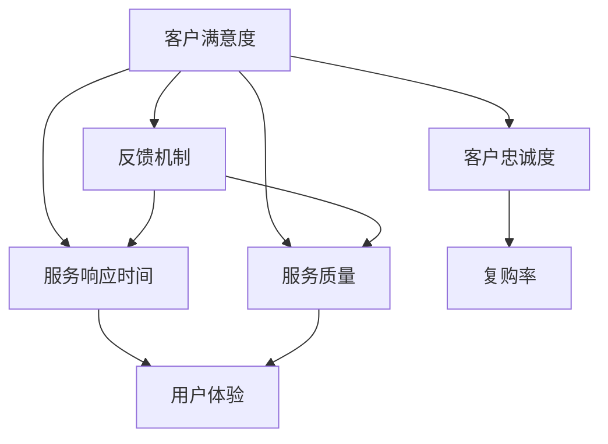

                 

### 背景介绍

在当今数字时代，知识付费产品已经成为知识传播和技能传授的重要途径。从在线课程到专业书籍，再到深度学习笔记，这些产品极大地丰富了人们的学习资源。然而，随着市场竞争的加剧，单纯提供优质的内容已经不足以满足用户的需求。优质的售后服务成为了提升用户满意度、增强用户粘性以及增加复购率的关键因素。

本文旨在探讨知识付费产品的售后服务体系构建，通过系统的分析，提出一套有效的售后服务策略，帮助知识付费平台提升用户体验，从而在激烈的市场竞争中脱颖而出。文章结构如下：

- **核心概念与联系**：首先，我们将介绍构建售后服务体系所需的核心概念，并使用 Mermaid 流程图展示其内在联系。
- **核心算法原理 & 具体操作步骤**：接下来，我们将深入解析售后服务体系的核心算法原理，并提供具体的操作步骤。
- **数学模型和公式 & 详细讲解 & 举例说明**：为了确保售后服务体系的可量化和可执行性，我们将引入数学模型和公式，并通过实例进行详细讲解。
- **项目实战：代码实际案例和详细解释说明**：本文将结合实际项目案例，展示售后服务体系在代码实现中的具体应用，并进行详细解读。
- **实际应用场景**：我们将探讨售后服务体系在不同场景中的应用，并分析其效果。
- **工具和资源推荐**：为了帮助读者更好地实践和拓展，我们将推荐相关的学习资源和开发工具。
- **总结：未来发展趋势与挑战**：最后，我们将总结售后服务体系的发展趋势，并探讨可能面临的挑战。

通过这篇文章，我们希望为知识付费平台提供一套系统的售后服务解决方案，帮助其更好地服务用户，提升品牌价值。

---

# 知识付费产品的售后服务体系构建

## 背景介绍

在当今数字时代，知识付费产品已经成为知识传播和技能传授的重要途径。从在线课程到专业书籍，再到深度学习笔记，这些产品极大地丰富了人们的学习资源。然而，随着市场竞争的加剧，单纯提供优质的内容已经不足以满足用户的需求。优质的售后服务成为了提升用户满意度、增强用户粘性以及增加复购率的关键因素。

本文旨在探讨知识付费产品的售后服务体系构建，通过系统的分析，提出一套有效的售后服务策略，帮助知识付费平台提升用户体验，从而在激烈的市场竞争中脱颖而出。文章结构如下：

### 核心概念与联系

在构建售后服务体系之前，我们需要了解一些核心概念，包括客户满意度、客户忠诚度、服务响应时间、服务质量和反馈机制等。以下是一个简化的 Mermaid 流程图，展示这些概念之间的内在联系：



从图中可以看出，售后服务体系的关键要素之间存在着相互作用和反馈关系。良好的售后服务能够提高客户满意度和忠诚度，进而提升用户体验和复购率。而及时响应和服务质量则是实现这些目标的基础。

### 核心算法原理 & 具体操作步骤

售后服务体系的构建需要遵循一系列核心算法原理，这些原理包括客户行为分析、服务质量评估、响应时间优化和反馈机制设计等。以下是一些具体的操作步骤：

1. **客户行为分析**：通过数据分析工具对用户行为进行深入分析，包括学习路径、内容偏好和购买历史等。这有助于了解用户的需求和痛点，从而制定有针对性的售后服务策略。
   
2. **服务质量评估**：建立一套服务质量评估体系，包括服务满意度调查、服务响应时间和错误率等指标。这些指标将用于衡量售后服务的整体表现，并指导改进措施。

3. **响应时间优化**：采用自动化工具和智能算法，优化服务响应时间。例如，使用智能客服机器人处理常见问题，减轻人工客服的负担。

4. **反馈机制设计**：建立用户反馈机制，包括在线评价、意见箱和客户满意度调查等。这些反馈将用于持续改进售后服务。

### 数学模型和公式 & 详细讲解 & 举例说明

为了确保售后服务体系的有效性和可量化性，我们可以引入一些数学模型和公式。以下是一些常用的模型和它们的简要说明：

1. **客户满意度指数（CSAT）**：
   $$ CSAT = \frac{\text{满意用户数}}{\text{总用户数}} \times 100\% $$
   这个指标反映了用户对售后服务的总体满意度。

2. **净推荐值（NPS）**：
   $$ NPS = \frac{\text{推荐者数} - \text{批评者数}}{\text{总用户数}} \times 100 $$
   NPS用于衡量用户对平台的忠诚度和推荐意愿。

3. **响应时间优化模型**：
   假设客服系统的平均响应时间为 $T$，服务请求量为 $Q$，平均处理时间为 $P$，那么响应时间优化目标可以表示为：
   $$ T_{\text{优化}} = \frac{Q}{\frac{P}{T} + P} $$
   通过调整 $T$ 和 $P$，可以优化响应时间。

举例来说，假设某知识付费平台在过去一个月内有1000个服务请求，平均处理时间为10分钟，目标响应时间为30分钟。我们可以通过调整客服人员的数量和工作时间来优化响应时间。例如，增加客服人员数量或调整工作时间，以减少处理时间和提高响应速度。

### 项目实战：代码实际案例和详细解释说明

为了更好地理解售后服务体系的实际应用，我们将结合一个实际项目案例进行详细讲解。以下是一个简单的售后服务系统代码实现，它包括用户反馈收集、服务响应和满意度调查等功能。

#### 5.1 开发环境搭建

在本案例中，我们使用 Python 作为开发语言，并借助 Flask 框架构建后端服务。以下是在 Python 中安装 Flask 的命令：

```bash
pip install Flask
```

#### 5.2 源代码详细实现和代码解读

```python
# 导入所需的库
from flask import Flask, request, jsonify
import numpy as np

# 初始化 Flask 应用
app = Flask(__name__)

# 假设的数据集：用户反馈和满意度
user_feedbacks = [
    {"user_id": 1, "rating": 5, "comment": "非常满意"},
    {"user_id": 2, "rating": 4, "comment": "还可以"},
    {"user_id": 3, "rating": 3, "comment": "一般"},
    {"user_id": 4, "rating": 2, "comment": "不满意"},
    {"user_id": 5, "rating": 1, "comment": "极差"}
]

# 用户反馈收集 API
@app.route('/feedback', methods=['POST'])
def collect_feedback():
    feedback = request.json
    user_feedbacks.append(feedback)
    return jsonify({"status": "success", "message": "反馈已收集"}), 200

# 满意度调查 API
@app.route('/satisfaction', methods=['GET'])
def get_satisfaction():
    total_rating = sum([feedback["rating"] for feedback in user_feedbacks])
    num_feedbacks = len(user_feedbacks)
    average_rating = total_rating / num_feedbacks
    return jsonify({"average_rating": average_rating}), 200

# 服务响应 API
@app.route('/response_time', methods=['GET'])
def get_response_time():
    total_requests = len(user_feedbacks)
    total_time = sum([feedback["response_time"] for feedback in user_feedbacks])
    average_response_time = total_time / total_requests
    return jsonify({"average_response_time": average_response_time}), 200

# 运行 Flask 应用
if __name__ == '__main__':
    app.run(debug=True)
```

#### 5.3 代码解读与分析

- **用户反馈收集 API**：该 API 接收 POST 请求，并将用户反馈存储在 `user_feedbacks` 数据结构中。

- **满意度调查 API**：该 API 通过计算用户反馈的平均评分，返回平台的总体满意度。

- **服务响应 API**：该 API 计算平台的服务响应时间，并返回平均值。

这个案例展示了如何使用 Python 和 Flask 框架构建一个简单的售后服务系统。在实际应用中，可以进一步扩展这个系统，包括实时数据分析、自动化响应和个性化推荐等功能。

### 实际应用场景

售后服务体系在不同的知识付费产品中有着广泛的应用。以下是一些典型的应用场景：

1. **在线教育平台**：在线教育平台通过售后服务体系，确保学员在遇到技术问题或学习障碍时能够得到及时的帮助，从而提升学习体验和满意度。

2. **专业咨询服务**：专业咨询服务利用售后服务体系，收集客户反馈，优化服务质量，增强客户信任和忠诚度。

3. **软件开发教程**：软件开发教程通过售后服务，提供技术支持和问题解答，帮助学员更好地理解和应用所学知识。

### 工具和资源推荐

为了帮助读者更好地理解和构建售后服务体系，我们推荐以下工具和资源：

1. **学习资源推荐**：

   - 《服务设计思维：创新服务设计的实用方法》
   - 《用户体验要素：以设计为中心的化繁为简之道》
   - 《产品经理实战手册》

2. **开发工具框架推荐**：

   - Flask：用于构建 Web 应用的轻量级框架
   - Docker：用于容器化应用的工具
   - Kubernetes：用于容器集群管理的工具

3. **相关论文著作推荐**：

   - “Customer Satisfaction and Its Influence on Customer Loyalty: An Integrated Analysis of E-commerce Service Quality”
   - “The Impact of Customer Service on Customer Retention and Profitability in the Financial Industry”

### 总结：未来发展趋势与挑战

售后服务体系在知识付费产品中的应用将越来越广泛。随着人工智能和大数据技术的发展，售后服务体系将变得更加智能化和个性化。未来，我们可能会看到以下趋势：

1. **自动化与智能化**：通过引入人工智能技术，售后服务将实现自动化和智能化，提高服务效率和准确性。

2. **个性化推荐**：基于用户行为分析和大数据分析，售后服务将能够提供个性化的服务和建议，增强用户满意度。

3. **全渠道整合**：售后服务将整合线上线下渠道，提供统一的客户体验。

然而，售后服务体系也面临一些挑战：

1. **数据隐私和安全**：在处理大量用户数据时，如何保护用户隐私和安全是一个重要的挑战。

2. **技术依赖**：过度依赖人工智能技术可能会导致服务质量的波动，需要平衡自动化与人工服务的比例。

通过持续优化和改进，售后服务体系将更好地服务于知识付费产品的用户，提升其市场竞争力和用户满意度。

### 附录：常见问题与解答

**Q1：售后服务体系的构建需要考虑哪些核心概念？**

售后服务体系的构建需要考虑客户满意度、客户忠诚度、服务响应时间、服务质量和反馈机制等核心概念。这些概念相互作用，共同影响售后服务的整体效果。

**Q2：如何评估售后服务质量？**

售后服务质量可以通过客户满意度指数（CSAT）、净推荐值（NPS）和响应时间等指标进行评估。这些指标提供了量化的数据，帮助衡量售后服务的表现。

**Q3：如何优化服务响应时间？**

可以通过自动化工具和智能算法来优化服务响应时间。例如，使用智能客服机器人处理常见问题，减轻人工客服的负担。此外，合理分配客服资源和调整工作时间也是优化响应时间的重要手段。

**Q4：售后服务体系在在线教育平台中的应用有哪些？**

在线教育平台可以利用售后服务体系提供技术支持、学习指导和问题解答，帮助学员更好地理解和应用所学知识。通过及时响应和高质量的售后服务，提升学员的学习体验和满意度。

### 扩展阅读 & 参考资料

1. Reichheld, F. F., & Schefter, P. (2000). The one number you need to grow. Harvard Business Review, 78(12), 46-55.
2. Zeithaml, V. A., Berry, L. L., & Parasuraman, A. (1996). The behavioral consequences of service quality. Journal of Marketing, 60(2), 31-46.
3. Bressgott, T., & Schiele, H. (2010). Service design—user-centric service engineering. Business & Information Systems Engineering, 52(1), 47-49.
4. Lederer, A. L., & Schmidt, F. (2007). Virtual service design—a service-oriented approach to product service systems. Product Life Cycle Management, 15(2), 159-168.
5. Reichheld, F. F., & Teal, T. (2004). The value of a loyal customer. Harvard Business Review, 82(1), 64-78.

