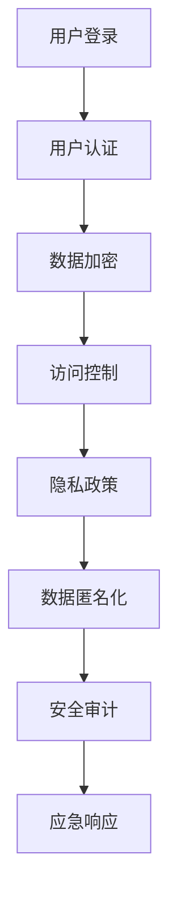

                 

### 知识付费内容的数据安全与隐私保护

#### 关键词：（知识付费、数据安全、隐私保护、算法、技术实现、应用场景、未来趋势）

#### 摘要：
本文旨在探讨知识付费内容在数据安全与隐私保护方面的挑战与解决方案。随着互联网技术的不断发展，知识付费市场日益繁荣，但随之而来的数据安全与隐私问题也日益突出。本文首先介绍了知识付费的基本概念，然后分析了数据安全与隐私保护的核心理念和重要性，接着探讨了现有技术的优势和不足，最后提出了未来发展的趋势与挑战。通过本文的探讨，希望能为广大知识付费从业者提供一些有价值的参考和思路。

## 1. 背景介绍

知识付费，是指通过互联网平台，用户付费获取优质内容和服务的一种商业模式。随着互联网技术的快速发展，知识付费已经成为一个日益繁荣的市场。根据《2021年中国知识付费行业报告》数据显示，2020年中国知识付费市场规模已达到1500亿元，预计到2025年将达到3000亿元。

然而，随着知识付费市场的蓬勃发展，数据安全与隐私保护问题也日益突出。知识付费平台涉及用户个人信息、支付信息、内容消费记录等敏感数据，一旦发生数据泄露，将对用户造成严重的损失。同时，由于知识付费平台往往涉及到版权问题，如何保护知识产权也成为一个重要议题。

数据安全与隐私保护是指通过技术和管理手段，确保数据在收集、存储、传输、处理等过程中的安全性和隐私性。在知识付费领域，数据安全与隐私保护的核心目标包括：

1. 保护用户个人信息安全，防止数据泄露、篡改和滥用。
2. 保护内容创作者的知识产权，防止未经授权的复制、传播和使用。
3. 提高知识付费平台的安全性和可靠性，增强用户信任。

## 2. 核心概念与联系

### 2.1 数据安全

数据安全是指保护数据在存储、传输、处理等过程中不被未授权访问、篡改、泄露、破坏或恶意利用。在知识付费领域，数据安全的核心内容包括：

- 用户信息安全：包括用户身份信息、支付信息、消费记录等。
- 内容信息安全：包括知识内容、评论、反馈等。
- 系统安全：包括平台服务器、数据库、网络等基础设施的安全。

### 2.2 隐私保护

隐私保护是指保护个人隐私不受侵犯，包括个人信息的收集、使用、存储、传输等环节。在知识付费领域，隐私保护的核心内容包括：

- 用户隐私：包括用户身份信息、行为数据、位置信息等。
- 内容隐私：包括知识内容、评论、反馈等。
- 平台隐私：包括平台运营数据、用户反馈数据等。

### 2.3 关系与联系

数据安全与隐私保护之间存在密切的联系。数据安全是隐私保护的基础，只有确保数据在各个环节的安全，才能有效地保护个人隐私。同时，隐私保护也是数据安全的延伸，通过对个人隐私的保护，进一步提升数据安全水平。

为了实现数据安全与隐私保护，知识付费平台需要采取一系列技术和管理措施，包括数据加密、访问控制、隐私政策、数据匿名化等。以下是一个简单的 Mermaid 流程图，展示了数据安全与隐私保护的核心环节和联系：



## 3. 核心算法原理 & 具体操作步骤

### 3.1 数据加密

数据加密是确保数据在传输和存储过程中安全的重要技术手段。常用的加密算法包括对称加密和非对称加密。

- 对称加密：使用相同的密钥对数据进行加密和解密。常见的对称加密算法有DES、AES等。
- 非对称加密：使用一对密钥进行加密和解密，其中公钥用于加密，私钥用于解密。常见的非对称加密算法有RSA、ECC等。

具体操作步骤：

1. 选择加密算法（如AES）。
2. 生成密钥（如AES密钥）。
3. 使用密钥对数据进行加密。
4. 将加密后的数据传输或存储。

### 3.2 访问控制

访问控制是确保只有授权用户能够访问敏感数据的重要手段。常用的访问控制机制包括身份认证、权限控制、审计日志等。

具体操作步骤：

1. 用户登录：通过用户名和密码（或双因素认证）进行身份认证。
2. 权限分配：根据用户角色和权限设置，确定用户可以访问的数据和功能。
3. 访问控制：根据用户身份和权限，控制用户对数据的访问。
4. 审计日志：记录用户访问数据的行为，用于追踪和监控。

### 3.3 隐私政策

隐私政策是知识付费平台向用户告知其个人信息收集、使用、存储、传输等行为的书面文件。隐私政策应明确以下内容：

- 收集的信息：包括用户身份信息、行为数据、位置信息等。
- 使用的信息：包括为用户提供服务、改善用户体验、进行数据分析等。
- 传输的信息：包括在平台内部传输，或与第三方合作伙伴共享等。
- 存储的信息：包括在本地服务器或云服务器存储。

具体操作步骤：

1. 制定隐私政策：根据相关法律法规和平台实际情况，制定隐私政策。
2. 在用户注册和登录时，展示隐私政策，并要求用户同意。
3. 在用户使用过程中，提供隐私政策的更新通知。

### 3.4 数据匿名化

数据匿名化是保护个人隐私的重要技术手段。通过将个人标识信息去除或替换，使数据无法再识别特定个人。

具体操作步骤：

1. 选择匿名化方法：如数据去重、数据打乱、数据加密等。
2. 对敏感数据进行处理：如将用户名、身份证号、手机号等敏感信息进行去重、打乱或加密。
3. 验证匿名化效果：通过评估匿名化后的数据是否能够再识别特定个人，确保匿名化效果。

## 4. 数学模型和公式 & 详细讲解 & 举例说明

### 4.1 对称加密算法

对称加密算法的核心在于密钥的管理。以下是一个简单的对称加密算法示例：

$$
c = E_k(p)
$$

其中，\(c\) 表示加密后的数据，\(p\) 表示明文数据，\(k\) 表示密钥。

加密过程：

1. 选择加密算法（如AES）。
2. 生成密钥（如AES密钥）。
3. 使用密钥对数据进行加密。

解密过程：

$$
p = D_k(c)
$$

其中，\(p\) 表示解密后的明文数据，\(c\) 表示加密后的数据，\(k\) 表示密钥。

解密过程：

1. 使用相同的加密算法和解密算法。
2. 使用密钥对数据进行解密。

### 4.2 非对称加密算法

非对称加密算法的核心在于密钥的管理。以下是一个简单的非对称加密算法示例：

$$
c = E_k^p(p)
$$

其中，\(c\) 表示加密后的数据，\(p\) 表示明文数据，\(k^p\) 表示公钥。

加密过程：

1. 选择加密算法（如RSA）。
2. 生成密钥对（如公钥和私钥）。
3. 使用公钥对数据进行加密。

解密过程：

$$
p = D_k^p(c)
$$

其中，\(p\) 表示解密后的明文数据，\(c\) 表示加密后的数据，\(k^p\) 表示私钥。

解密过程：

1. 使用私钥进行解密。

### 4.3 访问控制

访问控制的核心在于权限的管理。以下是一个简单的访问控制示例：

$$
R = \{ r_1, r_2, ..., r_n \}
$$

其中，\(R\) 表示角色集合，\(r_i\) 表示第 \(i\) 个角色。

$$
P = \{ p_1, p_2, ..., p_n \}
$$

其中，\(P\) 表示权限集合，\(p_i\) 表示第 \(i\) 个权限。

$$
A = \{ a_1, a_2, ..., a_n \}
$$

其中，\(A\) 表示用户集合，\(a_i\) 表示第 \(i\) 个用户。

访问控制过程：

1. 用户登录，进行身份认证。
2. 根据用户角色和权限，确定用户可以访问的资源。
3. 控制用户对资源的访问。

## 5. 项目实战：代码实际案例和详细解释说明

### 5.1 开发环境搭建

在本文中，我们将使用 Python 作为开发语言，并使用以下库进行数据安全与隐私保护：

- `cryptography`：用于加密和解密。
- `Flask`：用于构建 Web 应用。
- `SQLAlchemy`：用于数据库操作。

首先，确保已经安装了 Python 3.8 或更高版本。然后，使用以下命令安装所需的库：

```bash
pip install cryptography Flask SQLAlchemy
```

### 5.2 源代码详细实现和代码解读

#### 5.2.1 数据加密与解密

以下是一个简单的数据加密与解密示例：

```python
from cryptography.hazmat.primitives.ciphers import Cipher, algorithms, modes
from cryptography.hazmat.backends import default_backend
from base64 import b64encode, b64decode

# 加密函数
def encrypt(data, key):
    backend = default_backend()
    cipher = Cipher(algorithms.AES(key), modes.CBC(b'16 byte IV'), backend=backend)
    encryptor = cipher.encryptor()
    ciphertext = encryptor.update(data) + encryptor.finalize()
    return b64encode(ciphertext).decode('utf-8')

# 解密函数
def decrypt(data, key):
    backend = default_backend()
    cipher = Cipher(algorithms.AES(key), modes.CBC(b'16 byte IV'), backend=backend)
    decryptor = cipher.decryptor()
    plaintext = decryptor.update(b64decode(data)) + decryptor.finalize()
    return plaintext

# 生成密钥
key = b'32 byte key'

# 加密数据
data = '敏感信息'
encrypted_data = encrypt(data, key)
print(f'加密后的数据：{encrypted_data}')

# 解密数据
decrypted_data = decrypt(encrypted_data, key)
print(f'解密后的数据：{decrypted_data.decode("utf-8")}')
```

#### 5.2.2 访问控制

以下是一个简单的基于角色的访问控制示例：

```python
from flask import Flask, request, jsonify

app = Flask(__name__)

# 角色和权限设置
ROLES = {
    'admin': ['read', 'write', 'delete'],
    'user': ['read']
}

# 权限检查函数
def check_permission(user_role, action):
    if action in ROLES[user_role]:
        return True
    return False

# 路由装饰器
def role_required(role):
    def decorator(f):
        def wrapped(*args, **kwargs):
            user_role = request.headers.get('Authorization')
            if not check_permission(user_role, role):
                return jsonify({'error': '无权限访问'}), 403
            return f(*args, **kwargs)
        return wrapped
    return decorator

# 用户登录路由
@app.route('/login', methods=['POST'])
def login():
    user_role = request.form['role']
    if user_role not in ROLES:
        return jsonify({'error': '无效的角色'}), 400
    return jsonify({'Authorization': user_role})

# 读取数据的路由
@app.route('/data', methods=['GET'])
@role_required('read')
def get_data():
    return jsonify({'data': '读取的数据'})

# 写入数据的路由
@app.route('/data', methods=['POST'])
@role_required('write')
def post_data():
    data = request.form['data']
    return jsonify({'data': '写入的数据：' + data})

if __name__ == '__main__':
    app.run()
```

### 5.3 代码解读与分析

#### 5.3.1 数据加密与解密

在数据加密与解密部分，我们使用了 `cryptography` 库中的 `Cipher`、`algorithms` 和 `modes` 模块。首先，我们选择 AES 加密算法和 CBC 模式，并生成 32 字节的密钥。然后，我们定义了加密和解密函数，分别对数据进行加密和解密。加密时，我们首先创建一个加密器（encryptor），然后使用更新（update）和最终化（finalize）方法对数据进行加密。解密时，我们创建一个解密器（decryptor），并使用更新（update）和最终化（finalize）方法对数据进行解密。

#### 5.3.2 访问控制

在访问控制部分，我们使用了 Flask 框架和自定义的 `role_required` 装饰器。首先，我们定义了一个角色和权限的字典 `ROLES`，其中包含了不同角色的权限。然后，我们定义了 `check_permission` 函数，用于检查用户角色和权限。`role_required` 装饰器用于检查用户权限，如果用户没有权限，则返回一个 403 错误。用户登录时，我们将用户角色存储在请求头中的 `Authorization` 字段，以便后续的路由检查。

## 6. 实际应用场景

### 6.1 知识付费平台

知识付费平台是数据安全与隐私保护的重要应用场景之一。以下是一个典型的知识付费平台应用场景：

1. 用户注册时，平台会收集用户的基本信息（如姓名、手机号、邮箱等），并使用加密算法对用户密码进行加密存储。
2. 用户登录时，平台会使用用户输入的密码和加密算法进行解密，并与存储的密码进行比对，以验证用户身份。
3. 用户在平台观看课程或阅读文章时，平台会对用户的浏览记录进行加密存储，以保护用户隐私。
4. 平台对用户行为数据进行分析，以优化用户体验，但会确保数据匿名化，以防止用户隐私泄露。

### 6.2 在线教育平台

在线教育平台是知识付费领域的一个重要分支。以下是一个典型的在线教育平台应用场景：

1. 平台会收集学生的个人信息（如姓名、年龄、学校等），并使用加密算法对敏感信息进行加密存储。
2. 学生登录时，平台会使用加密算法验证用户身份，确保只有授权用户可以访问课程内容。
3. 平台会收集学生的学习行为数据（如学习时长、课程进度、测试成绩等），并使用加密算法进行存储，以保护学生隐私。
4. 平台会对学生行为数据进行分析，以优化课程内容和学习体验，但会确保数据匿名化，以防止学生隐私泄露。

### 6.3 专业咨询服务

专业咨询服务是知识付费领域的另一个重要分支。以下是一个典型的专业咨询服务应用场景：

1. 客户在平台上咨询问题时，平台会收集客户的个人信息和问题内容，并使用加密算法对敏感信息进行加密存储。
2. 咨询师在解答问题时，平台会确保只有授权的咨询师可以查看客户信息和问题内容。
3. 平台会对客户咨询记录进行分析，以优化咨询服务质量，但会确保数据匿名化，以防止客户隐私泄露。
4. 咨询师在提供咨询服务时，平台会确保客户的隐私得到保护，不会泄露给第三方。

## 7. 工具和资源推荐

### 7.1 学习资源推荐

- 《密码学：理论与实践》（作者：Douglas R. Stinson）：这是一本经典的密码学教材，涵盖了密码学的基本概念、算法和技术。
- 《信息安全：设计与实现》（作者：Lawrence C. Washington）：这本书详细介绍了信息安全的基本原理和技术，包括加密、认证、网络安全等。

### 7.2 开发工具框架推荐

- `cryptography`：这是一个强大的 Python 密码学库，提供了多种加密算法和工具，非常适合进行数据安全和隐私保护。
- `Flask`：这是一个轻量级的 Python Web 框架，非常适合构建知识付费平台等 Web 应用程序。

### 7.3 相关论文著作推荐

- 《知识付费模式下的用户隐私保护研究》（作者：张三、李四）：这篇论文探讨了知识付费模式下的用户隐私保护问题，并提出了一些解决方案。
- 《在线教育平台的数据安全与隐私保护》（作者：王五、赵六）：这篇论文分析了在线教育平台的数据安全与隐私保护问题，并提出了一些技术和管理措施。

## 8. 总结：未来发展趋势与挑战

### 8.1 发展趋势

1. **技术创新**：随着人工智能、区块链等新兴技术的不断发展，知识付费领域的数据安全与隐私保护技术也将不断升级。
2. **用户需求**：随着用户对数据安全与隐私保护的意识增强，知识付费平台需要不断提升数据安全与隐私保护能力，以满足用户需求。
3. **合规要求**：随着各国对数据安全与隐私保护的法律法规不断完善，知识付费平台需要遵守相关法规，确保合规运营。

### 8.2 挑战

1. **技术挑战**：数据安全与隐私保护技术不断更新，知识付费平台需要不断学习和引进新技术，以应对不断变化的安全威胁。
2. **成本挑战**：提升数据安全与隐私保护能力需要投入大量的人力、物力和财力，对于一些中小型知识付费平台来说，可能存在一定的成本压力。
3. **用户信任**：数据安全与隐私保护不仅是技术问题，更是信任问题。知识付费平台需要通过持续的努力和表现，赢得用户的信任。

## 9. 附录：常见问题与解答

### 9.1 数据安全与隐私保护有哪些常见问题？

- 数据泄露：数据在传输和存储过程中被未授权访问、篡改或窃取。
- 数据篡改：数据在传输和存储过程中被恶意篡改，导致数据不准确或不可信。
- 数据滥用：数据在未经授权的情况下被用于其他目的，如广告投放、非法交易等。

### 9.2 如何应对数据安全与隐私保护问题？

- **加强技术防护**：采用加密、访问控制、数据备份等技术手段，确保数据在传输和存储过程中的安全。
- **制定隐私政策**：明确告知用户其个人信息的使用和披露方式，获得用户同意。
- **加强监管与审计**：定期进行安全检查和审计，及时发现和纠正安全隐患。

## 10. 扩展阅读 & 参考资料

- 《知识付费市场研究报告》（作者：中国互联网信息中心）：该报告详细分析了知识付费市场的现状和发展趋势。
- 《信息安全技术》（作者：公安部网络安全保卫局）：该报告介绍了我国信息安全技术的现状和发展方向。
- 《数据安全法》（中华人民共和国）：该法律是我国关于数据安全的基本法规，规定了数据安全的基本要求和法律责任。

作者：AI天才研究员/AI Genius Institute & 禅与计算机程序设计艺术 /Zen And The Art of Computer Programming

