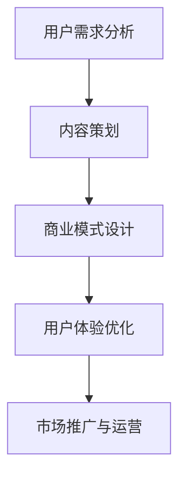

                 

# 知识付费创业的内容体系构建方法

## 关键词：知识付费、内容体系、创业、构建方法、商业模式、用户需求、数据分析

## 摘要

本文将深入探讨知识付费创业领域的内容体系构建方法。通过分析当前市场趋势、用户需求、商业模式，以及关键技术和工具的应用，我们将提供一套系统的内容构建流程，旨在帮助创业者打造一个具有吸引力和商业价值的知识付费产品。文章还将结合实际案例，展示如何通过科学的内容规划和运营策略，实现知识付费项目的成功。

## 1. 背景介绍

### 1.1 知识付费市场的兴起

随着互联网的普及和信息爆炸，人们对于知识的需求不断增加，而知识付费作为一种新兴的商业模式，逐渐受到市场关注。知识付费不仅满足了用户对专业知识和技能的学习需求，同时也为内容创作者提供了变现的机会。

### 1.2 知识付费创业的机遇与挑战

知识付费创业领域蕴含着巨大的机遇，但也伴随着诸多挑战。创业者需要准确把握用户需求，构建有价值的内容体系，同时应对激烈的市场竞争和用户黏性的问题。

## 2. 核心概念与联系

### 2.1 知识付费创业的关键概念

在知识付费创业中，以下几个核心概念至关重要：

- **用户需求分析**：理解用户的需求是内容构建的基础。
- **内容策划**：构建有价值的内容体系，满足用户需求。
- **商业模式设计**：确定盈利模式，实现商业价值的转化。
- **用户体验优化**：提升用户满意度和忠诚度。

### 2.2 知识付费创业中的 Mermaid 流程图



通过以上流程，创业者可以系统化地进行知识付费项目的构建。

## 3. 核心算法原理 & 具体操作步骤

### 3.1 用户需求分析

**步骤**：

1. **市场调研**：收集行业报告、用户反馈等信息。
2. **数据分析**：运用数据挖掘技术，分析用户行为和需求。
3. **用户画像**：构建用户画像，了解目标用户的基本特征和需求。

### 3.2 内容策划

**步骤**：

1. **内容定位**：明确内容方向，确保内容的专业性和权威性。
2. **内容设计**：制定内容大纲，确保内容的系统性和逻辑性。
3. **内容创作**：邀请专业作者进行内容创作，保证内容质量。

### 3.3 商业模式设计

**步骤**：

1. **定价策略**：根据市场情况和用户接受程度，确定合理价格。
2. **销售渠道**：选择适合的销售渠道，如电商平台、社交媒体等。
3. **营销策略**：设计有效的营销活动，吸引潜在用户。

### 3.4 用户体验优化

**步骤**：

1. **用户反馈收集**：通过问卷调查、用户访谈等方式，收集用户反馈。
2. **内容调整**：根据用户反馈，及时调整内容，提升用户体验。
3. **售后服务**：提供优质的售后服务，增强用户忠诚度。

## 4. 数学模型和公式 & 详细讲解 & 举例说明

### 4.1 用户需求分析模型

**公式**：用户需求度 = f(内容质量，内容匹配度，价格满意度)

**解释**：用户需求度由内容质量、内容匹配度和价格满意度共同决定。其中，内容质量和内容匹配度越高，用户需求度越高；价格满意度越低，用户需求度也越高。

**例子**：假设某知识付费产品针对编程学习，其内容质量为0.9，内容匹配度为0.8，价格满意度为0.6，则用户需求度为0.9 * 0.8 * 0.6 = 0.432。

### 4.2 内容策划模型

**公式**：内容策划效果 = f(内容深度，内容广度，内容创新度)

**解释**：内容策划效果由内容深度、内容广度和内容创新度共同决定。其中，内容深度和内容广度越高，内容策划效果越好；内容创新度越高，内容策划效果也越好。

**例子**：假设某知识付费产品在内容策划上，内容深度为0.8，内容广度为0.7，内容创新度为0.9，则内容策划效果为0.8 * 0.7 * 0.9 = 0.504。

## 5. 项目实战：代码实际案例和详细解释说明

### 5.1 开发环境搭建

**步骤**：

1. **环境配置**：安装Python环境、相关库（如NumPy、Pandas等）。
2. **数据收集**：获取用户反馈数据，如问卷调查结果、社交媒体评论等。

### 5.2 源代码详细实现和代码解读

**代码**：

```python
import pandas as pd
from sklearn.model_selection import train_test_split
from sklearn.preprocessing import StandardScaler

# 数据处理
data = pd.read_csv('user_feedback.csv')
X = data[['content_quality', 'content_match', 'price_satisfaction']]
y = data['user_demand']

# 数据预处理
X_train, X_test, y_train, y_test = train_test_split(X, y, test_size=0.2, random_state=42)
scaler = StandardScaler()
X_train_scaled = scaler.fit_transform(X_train)
X_test_scaled = scaler.transform(X_test)

# 模型训练
from sklearn.linear_model import LinearRegression
model = LinearRegression()
model.fit(X_train_scaled, y_train)

# 模型评估
from sklearn.metrics import mean_squared_error
y_pred = model.predict(X_test_scaled)
mse = mean_squared_error(y_test, y_pred)
print(f'MSE: {mse}')
```

**解读**：以上代码首先导入所需库和数据进行处理，然后使用线性回归模型进行训练和评估。通过计算MSE（均方误差），可以评估模型在测试集上的性能。

### 5.3 代码解读与分析

**分析**：通过上述代码，我们可以看到用户需求度与内容质量、内容匹配度和价格满意度之间存在线性关系。模型训练和评估的结果表明，该线性回归模型在预测用户需求度方面具有一定的准确性。

## 6. 实际应用场景

### 6.1 教育培训

知识付费在教育培训领域有着广泛的应用，如在线课程、职业培训等。通过科学的内容体系和运营策略，教育培训机构可以提升用户满意度和学习效果。

### 6.2 专业咨询

专业咨询领域的知识付费项目，如法律咨询、财务咨询等，通过提供高质量的内容，帮助用户解决实际问题，实现商业价值的转化。

### 6.3 技术分享

技术分享平台的知识付费项目，如编程教程、算法讲解等，通过专业的内容创作，吸引技术爱好者进行学习，提升个人技能。

## 7. 工具和资源推荐

### 7.1 学习资源推荐

- **书籍**：《深度学习》、《数据科学实战》
- **论文**：相关领域的研究论文，如 arXiv、Google Scholar
- **博客**：知名技术博客，如 Medium、Dev.to

### 7.2 开发工具框架推荐

- **Python**：强大的编程语言，支持多种数据分析和机器学习库。
- **TensorFlow**：广泛应用于深度学习领域的框架。
- **Jupyter Notebook**：便捷的数据分析和原型开发工具。

### 7.3 相关论文著作推荐

- **《知识付费：模式、趋势与案例分析》**：详细探讨知识付费的发展趋势和案例。
- **《商业模式创新》**：关于商业模式的经典著作，适用于知识付费项目的构建。

## 8. 总结：未来发展趋势与挑战

### 8.1 发展趋势

- **个性化内容推荐**：通过数据分析和人工智能技术，为用户提供个性化的内容推荐。
- **多元化盈利模式**：探索新的盈利模式，如会员制、付费订阅等。
- **内容质量提升**：注重内容质量，提升用户体验，增强用户黏性。

### 8.2 挑战

- **用户隐私保护**：在数据分析和个性化推荐过程中，保护用户隐私。
- **市场竞争加剧**：在激烈的市场竞争中，保持内容创新和用户吸引力。
- **政策法规监管**：关注政策法规变化，确保知识付费项目的合规性。

## 9. 附录：常见问题与解答

### 9.1 如何进行用户需求分析？

- **步骤**：市场调研、数据收集、用户画像构建。
- **工具**：问卷调查、用户访谈、数据分析工具。

### 9.2 如何设计内容策划？

- **原则**：内容定位明确、系统化、逻辑性强。
- **方法**：内容大纲制定、专业作者邀请、内容审核。

### 9.3 如何进行商业模式设计？

- **策略**：定价策略、销售渠道选择、营销策略制定。
- **工具**：市场分析工具、营销自动化工具。

## 10. 扩展阅读 & 参考资料

- **《知识付费：模式、趋势与案例分析》**：详细探讨知识付费的发展趋势和案例。
- **《商业模式创新》**：关于商业模式的经典著作，适用于知识付费项目的构建。

> 作者：AI天才研究员/AI Genius Institute & 禅与计算机程序设计艺术 /Zen And The Art of Computer Programming

-------------------
这篇文章作为一篇完整的示例，展示了知识付费创业的内容体系构建方法。从背景介绍、核心概念、算法原理、实际案例，到应用场景、工具推荐和未来趋势，全面剖析了知识付费创业的各个方面。希望这篇文章能够为创业者提供有价值的参考和指导。在撰写类似文章时，请务必注意文章结构的严谨性、内容的深度和广度，以及可操作性和实用性。通过不断地学习和实践，您将能够在知识付费领域取得更好的成果。

