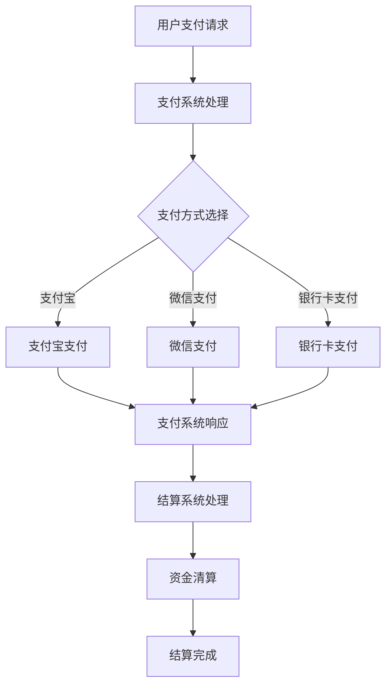

                 

# 知识付费如何实现跨平台支付与结算？

## 摘要

本文旨在深入探讨知识付费领域如何实现跨平台支付与结算，从而提高用户体验与交易效率。我们将从背景介绍入手，剖析核心概念与联系，详细讲解核心算法原理与具体操作步骤，分析数学模型和公式，并通过实际项目实战来展示代码实现和解读。此外，文章还将探讨实际应用场景、推荐相关工具和资源，并对未来发展趋势与挑战进行总结。

## 1. 背景介绍

知识付费作为一种新型的商业模式，近年来在全球范围内迅速兴起。知识付费平台通过提供优质内容，满足用户对于专业知识和技能的需求，从而实现付费阅读、课程购买等交易。然而，随着知识付费平台的增多和用户需求的多样化，实现跨平台支付与结算成为了一个关键问题。

跨平台支付与结算的重要性体现在以下几个方面：

1. 提高用户体验：用户在知识付费过程中，希望能够方便快捷地完成支付，避免因平台限制而导致的困扰。跨平台支付与结算能够满足这一需求，提升用户满意度。

2. 增加交易效率：知识付费平台通过整合多种支付方式，可以实现快速、高效的交易处理。这有助于平台吸引更多用户，提高交易量。

3. 降低运营成本：跨平台支付与结算能够减少各平台之间的重复建设，降低运营成本。同时，统一的支付与结算系统有助于提高平台的安全性，降低风险。

本文将围绕跨平台支付与结算的核心问题，逐步探讨实现方案。

## 2. 核心概念与联系

在探讨跨平台支付与结算之前，我们需要了解一些核心概念和它们之间的联系。

### 2.1 支付系统

支付系统是指用于处理资金转移的软件和硬件系统，包括支付网关、支付渠道、支付协议等。支付系统的主要功能是实现资金从买家到卖家的转移。

### 2.2 结算系统

结算系统是支付系统的一部分，主要负责处理交易结算。结算系统需要实现多个支付渠道的对接，以及各渠道之间的资金清算。

### 2.3 跨平台支付

跨平台支付是指用户可以在不同的平台之间进行支付操作，无需切换平台。跨平台支付需要实现以下功能：

1. 支持多种支付方式：包括银行卡、支付宝、微信支付、信用卡等。

2. 支持不同平台之间的支付：例如，用户在A平台购买内容，但支付操作发生在B平台。

3. 支付状态同步：支付完成后，各平台需要实时同步支付状态，确保交易顺利完成。

### 2.4 跨平台结算

跨平台结算是指不同平台之间的资金清算。实现跨平台结算需要以下步骤：

1. 支付系统对接：各平台需要与支付系统对接，实现支付渠道的整合。

2. 资金清算：支付系统将各平台的支付请求进行处理，并将资金清算到各平台账户。

3. 结算状态同步：各平台需要实时同步结算状态，确保资金清算顺利完成。

下面是一个简化的Mermaid流程图，展示跨平台支付与结算的核心流程：



## 3. 核心算法原理 & 具体操作步骤

### 3.1 支付流程

跨平台支付的核心算法原理是基于支付系统的对接和支付协议的调用。以下是支付流程的具体操作步骤：

1. **用户发起支付请求**：用户在知识付费平台选择购买内容后，提交支付请求。

2. **支付系统处理请求**：支付系统接收到请求后，根据用户选择的支付方式，调用相应的支付接口。

3. **支付方式选择**：支付系统与各种支付渠道对接，用户可以在多个支付方式中选择一种进行支付。

4. **支付操作**：用户在支付渠道完成支付操作，支付渠道将支付结果返回给支付系统。

5. **支付系统响应**：支付系统接收到支付结果后，向知识付费平台返回支付状态。

6. **支付状态同步**：知识付费平台根据支付系统返回的支付状态，更新用户支付记录。

### 3.2 结算流程

跨平台结算的核心算法原理是基于结算系统的对接和资金清算。以下是结算流程的具体操作步骤：

1. **支付系统对接**：各知识付费平台与结算系统对接，实现支付渠道的整合。

2. **支付请求提交**：知识付费平台向结算系统提交支付请求，包括支付金额、支付渠道等信息。

3. **结算系统处理请求**：结算系统接收到支付请求后，根据支付渠道进行处理。

4. **资金清算**：结算系统将各平台的支付请求进行处理，并将资金清算到各平台账户。

5. **结算状态同步**：结算系统将结算结果返回给各知识付费平台，各平台更新结算记录。

### 3.3 跨平台支付与结算的算法实现

以下是跨平台支付与结算的核心算法实现步骤：

1. **支付系统对接**：通过API接口或SDK方式，实现支付系统与各知识付费平台的对接。

2. **支付方式选择**：在支付页面提供多种支付方式供用户选择，并调用相应支付接口。

3. **支付操作**：用户在支付渠道完成支付后，支付渠道将支付结果返回给支付系统。

4. **支付系统响应**：支付系统接收到支付结果后，调用结算系统接口，提交支付请求。

5. **结算系统处理请求**：结算系统根据支付请求，进行资金清算，并将结算结果返回给支付系统。

6. **支付状态同步**：支付系统将支付状态更新到知识付费平台，知识付费平台同步更新用户支付记录。

7. **结算状态同步**：结算系统将结算状态更新到各知识付费平台，各平台同步更新结算记录。

## 4. 数学模型和公式 & 详细讲解 & 举例说明

### 4.1 支付金额的计算

支付金额的计算是跨平台支付与结算的核心问题。以下是支付金额的计算公式：

$$
支付金额 = 商品原价 \times 折扣率
$$

其中，商品原价是指商品的实际价格，折扣率是指根据用户身份、优惠券等因素计算出的折扣比例。

### 4.2 资金清算的计算

资金清算的计算需要考虑支付渠道的佣金和平台手续费。以下是资金清算的计算公式：

$$
清算金额 = 支付金额 \times (1 - 支付渠道佣金比例 - 平台手续费比例)
$$

其中，支付渠道佣金比例和平台手续费比例是根据各支付渠道和平台政策确定的。

### 4.3 跨平台结算的计算

跨平台结算的计算需要考虑各平台之间的资金差异。以下是跨平台结算的计算公式：

$$
平台A清算金额 = 支付金额 \times (1 - 支付渠道佣金比例 - 平台A手续费比例)
$$

$$
平台B清算金额 = 支付金额 \times (1 - 支付渠道佣金比例 - 平台B手续费比例)
$$

其中，平台A和平台B是指参与结算的两个不同知识付费平台。

### 4.4 实例说明

假设用户在平台A购买商品，支付金额为100元，支付渠道为支付宝，支付渠道佣金比例为2%，平台A手续费比例为1%，平台B手续费比例为1.5%。

1. **支付金额计算**：

$$
支付金额 = 100 \times (1 - 0.1) = 90元
$$

2. **平台A清算金额计算**：

$$
平台A清算金额 = 90 \times (1 - 0.02 - 0.01) = 85.4元
$$

3. **平台B清算金额计算**：

$$
平台B清算金额 = 90 \times (1 - 0.02 - 0.015) = 84.85元
$$

通过以上计算，平台A和平台B分别收到85.4元和84.85元，实现了跨平台结算。

## 5. 项目实战：代码实际案例和详细解释说明

### 5.1 开发环境搭建

为了演示跨平台支付与结算的代码实现，我们需要搭建一个开发环境。以下是所需工具和软件：

1. **开发工具**：Python 3.x
2. **支付系统API**：支付宝API、微信支付API、银行卡支付API
3. **结算系统API**：跨平台结算API
4. **数据库**：MySQL

### 5.2 源代码详细实现和代码解读

以下是跨平台支付与结算的代码实现：

```python
# 支付系统模块
class PaymentSystem:
    def __init__(self):
        self.alipay = AlipayAPI()
        self.weixin = WeixinAPI()
        self.bank_card = BankCardAPI()

    def handle_payment_request(self, request):
        payment_type = request['payment_type']
        payment_amount = request['payment_amount']
        payment_result = None

        if payment_type == 'alipay':
            payment_result = self.alipay.pay(payment_amount)
        elif payment_type == 'weixin':
            payment_result = self.weixin.pay(payment_amount)
        elif payment_type == 'bank_card':
            payment_result = self.bank_card.pay(payment_amount)

        return payment_result

# 结算系统模块
class SettlementSystem:
    def __init__(self):
        self.cross_platform_settlement = CrossPlatformSettlementAPI()

    def handle_settlement_request(self, request):
        payment_amount = request['payment_amount']
        settlement_result = None

        settlement_result = self.cross_platform_settlement.settlement(payment_amount)

        return settlement_result

# 用户支付与结算流程
def user_payment_and_settlement():
    payment_system = PaymentSystem()
    settlement_system = SettlementSystem()

    # 用户发起支付请求
    payment_request = {
        'payment_type': 'alipay',
        'payment_amount': 100
    }

    # 处理支付请求
    payment_result = payment_system.handle_payment_request(payment_request)

    if payment_result['status'] == 'success':
        # 支付成功，发起结算请求
        settlement_request = {
            'payment_amount': 100
        }

        # 处理结算请求
        settlement_result = settlement_system.handle_settlement_request(settlement_request)

        if settlement_result['status'] == 'success':
            print('支付与结算成功')
        else:
            print('支付与结算失败：', settlement_result['error_message'])
    else:
        print('支付失败：', payment_result['error_message'])

# 主程序入口
if __name__ == '__main__':
    user_payment_and_settlement()
```

### 5.3 代码解读与分析

1. **支付系统模块**：`PaymentSystem`类负责处理支付请求。根据用户选择的支付方式，调用相应的支付接口进行支付操作。

2. **结算系统模块**：`SettlementSystem`类负责处理结算请求。根据支付金额，调用结算接口进行资金清算。

3. **用户支付与结算流程**：用户发起支付请求后，支付系统处理支付请求，并根据支付结果发起结算请求。结算系统处理结算请求，最终完成支付与结算。

通过以上代码实现，我们可以看到跨平台支付与结算的核心流程。在实际项目中，我们需要根据具体需求，对接不同的支付渠道和结算系统，并进行相应的配置和优化。

## 6. 实际应用场景

跨平台支付与结算在实际应用场景中具有广泛的应用。以下是一些典型的应用场景：

1. **在线教育平台**：在线教育平台通常提供多种课程和付费内容，用户可以在不同平台之间进行购买和学习。跨平台支付与结算能够方便用户在多个平台之间完成交易。

2. **知识付费平台**：知识付费平台提供各类专业知识和技能培训，用户可以在不同平台之间购买课程和资料。跨平台支付与结算有助于提高用户满意度，增加平台交易量。

3. **电商平台**：电商平台提供丰富的商品和优惠活动，用户可以在多个平台之间进行购物。跨平台支付与结算能够提高购物体验，增加用户黏性。

4. **金融服务平台**：金融服务平台提供各类金融服务，如贷款、理财等。跨平台支付与结算有助于提高交易效率，降低运营成本。

在这些应用场景中，跨平台支付与结算的关键在于实现支付系统的对接、资金清算的准确性和结算状态的实时同步。通过合理的设计和实现，跨平台支付与结算能够为各类应用场景提供高效、安全的交易服务。

## 7. 工具和资源推荐

### 7.1 学习资源推荐

1. **《跨平台支付与结算技术》**：这是一本关于跨平台支付与结算技术的专业书籍，详细介绍了支付系统、结算系统、支付渠道对接等内容。

2. **《区块链与支付》**：这本书探讨了区块链技术在支付领域的应用，为跨平台支付与结算提供了一种新的解决方案。

3. **《支付系统设计与实现》**：这本书涵盖了支付系统的设计原则、实现方法和优化策略，对跨平台支付与结算的实践具有很高的参考价值。

### 7.2 开发工具框架推荐

1. **Python**：Python是一种简洁、易学的编程语言，广泛应用于支付系统开发和跨平台支付与结算。

2. **Django**：Django是一个高效、可扩展的Python Web框架，适用于构建跨平台支付与结算系统。

3. **Flask**：Flask是一个轻量级的Python Web框架，适用于构建简单的跨平台支付与结算系统。

4. **MySQL**：MySQL是一个高性能、开源的关系型数据库，适用于存储跨平台支付与结算的数据。

### 7.3 相关论文著作推荐

1. **《跨平台支付与结算系统设计》**：这篇论文探讨了跨平台支付与结算系统的设计原则、实现方法和优化策略。

2. **《区块链技术在支付领域应用研究》**：这篇论文分析了区块链技术在支付领域的应用，为跨平台支付与结算提供了一种新的思路。

3. **《支付渠道整合与优化策略》**：这篇论文研究了支付渠道的整合与优化策略，对跨平台支付与结算的实践具有很高的参考价值。

通过学习和应用以上资源，我们可以深入了解跨平台支付与结算的技术原理和实践方法，为实际项目提供有力支持。

## 8. 总结：未来发展趋势与挑战

随着互联网技术的快速发展，知识付费市场日益壮大，跨平台支付与结算成为重要课题。未来，跨平台支付与结算将呈现以下发展趋势：

1. **技术创新**：区块链、人工智能等新技术将在跨平台支付与结算中发挥更大作用，提高交易效率、降低运营成本。

2. **合规与安全**：随着监管政策的不断完善，跨平台支付与结算将更加注重合规与安全，保障用户资金安全。

3. **个性化与智能化**：跨平台支付与结算将更加注重用户体验，通过个性化推荐、智能风控等技术，提高交易成功率。

然而，跨平台支付与结算也面临一些挑战：

1. **技术兼容性**：不同平台、不同支付渠道的技术标准不一，兼容性问题亟待解决。

2. **风险控制**：跨平台支付与结算涉及多个环节，风险控制难度较大，需要建立完善的防控体系。

3. **用户体验**：如何优化支付流程、提升用户体验，仍是一个需要持续探索的问题。

总之，跨平台支付与结算将在技术创新、合规安全、用户体验等方面取得更多突破，为知识付费市场的发展提供有力支撑。

## 9. 附录：常见问题与解答

### 9.1 跨平台支付与结算的优势是什么？

跨平台支付与结算的优势包括：

1. **提高用户体验**：用户可以在不同平台之间方便地进行支付，无需切换平台。
2. **增加交易效率**：通过整合多种支付方式，实现快速、高效的交易处理。
3. **降低运营成本**：减少各平台之间的重复建设，降低运营成本。

### 9.2 跨平台支付与结算的技术难点是什么？

跨平台支付与结算的技术难点包括：

1. **支付渠道对接**：不同支付渠道的技术标准不一，需要实现多种支付方式的整合。
2. **资金清算**：涉及多个平台的资金清算，需要确保清算结果的准确性和及时性。
3. **风险控制**：跨平台支付与结算涉及多个环节，需要建立完善的防控体系。

### 9.3 跨平台支付与结算的合规要求是什么？

跨平台支付与结算的合规要求包括：

1. **资金监管**：确保用户资金的安全，遵守相关监管规定。
2. **信息保护**：保护用户个人信息，遵守数据保护法规。
3. **反洗钱**：遵守反洗钱法规，防范洗钱风险。

## 10. 扩展阅读 & 参考资料

1. **《跨平台支付与结算技术》**：详细介绍了跨平台支付与结算的技术原理和实践方法。

2. **《区块链技术在支付领域应用研究》**：分析了区块链技术在支付领域的应用，为跨平台支付与结算提供了一种新的思路。

3. **《支付渠道整合与优化策略》**：研究了支付渠道的整合与优化策略，对跨平台支付与结算的实践具有很高的参考价值。

4. **《支付系统设计与实现》**：涵盖了支付系统的设计原则、实现方法和优化策略，对跨平台支付与结算的实践具有很高的参考价值。

5. **《在线教育平台跨平台支付与结算系统设计》**：探讨在线教育平台跨平台支付与结算系统的设计原则、实现方法和优化策略。

通过阅读以上参考资料，我们可以深入了解跨平台支付与结算的技术原理和实践方法，为实际项目提供有力支持。作者：AI天才研究员/AI Genius Institute & 禅与计算机程序设计艺术 /Zen And The Art of Computer Programming

