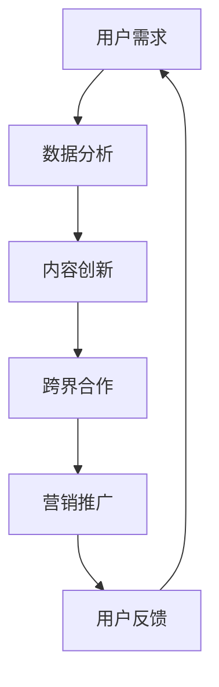

                 

# 知识付费如何实现跨界营销与出版跨界？

> **关键词**：知识付费、跨界营销、出版跨界、用户需求、数据分析、内容创新

> **摘要**：本文将深入探讨知识付费领域如何通过跨界营销和出版跨界，满足用户多元化需求，提升市场竞争力。我们将从核心概念、算法原理、项目实战、应用场景、工具资源等多个角度，详细分析这一策略的可行性和实际效果。

## 1. 背景介绍

知识付费作为近年来兴起的一种新型商业模式，已逐渐成为互联网经济的重要组成部分。用户在获取知识的过程中，越来越重视内容的质量和专业性。与此同时，市场对于优质内容的供给需求也日益增长。然而，知识付费领域面临着一些挑战，如同质化严重、用户留存率低等。为了应对这些挑战，实现跨界营销和出版跨界成为了一项重要的策略。

### 1.1 知识付费的发展现状

随着互联网技术的进步和用户需求的升级，知识付费市场呈现出爆发式增长。根据相关数据显示，2019年全球知识付费市场规模已达到1400亿美元，预计到2025年将突破3000亿美元。在中国，知识付费市场规模也在迅速扩大，2019年达到了1100亿元人民币，预计到2025年将突破3000亿元人民币。

### 1.2 跨界营销与出版跨界的概念

跨界营销是指企业利用其他行业的优势资源，通过跨行业合作、整合和创新，实现品牌推广和市场拓展的一种营销策略。出版跨界则是指传统出版行业与互联网、新媒体、教育等行业的结合，通过技术创新和内容创新，提升出版行业的服务质量和市场竞争力。

## 2. 核心概念与联系

为了深入理解知识付费如何实现跨界营销与出版跨界，我们需要了解以下几个核心概念：

### 2.1 用户需求分析

用户需求是知识付费业务的基础。通过对用户需求的分析，可以更好地满足用户的需求，提高用户满意度。用户需求分析包括以下方面：

- **需求层次分析**：根据马斯洛的需求层次理论，将用户需求分为生理需求、安全需求、社交需求、尊重需求和自我实现需求。
- **需求特征分析**：分析用户需求的多样性、个性化、时效性等特征。

### 2.2 数据分析

数据分析是知识付费实现跨界营销和出版跨界的重要手段。通过数据分析，可以了解用户行为、市场趋势等，从而为决策提供支持。数据分析包括以下方面：

- **用户行为分析**：分析用户在知识付费平台上的浏览、购买、评价等行为。
- **市场趋势分析**：分析知识付费市场的发展趋势、竞争对手状况等。

### 2.3 内容创新

内容创新是知识付费实现跨界营销和出版跨界的关键。通过内容创新，可以提升知识付费产品的核心竞争力，满足用户的多元化需求。内容创新包括以下方面：

- **形式创新**：通过视频、音频、图文等多种形式，提供多样化的知识内容。
- **领域创新**：结合其他行业的特点，开发跨领域的知识产品。

### 2.4 跨界合作

跨界合作是知识付费实现跨界营销和出版跨界的重要途径。通过跨界合作，可以整合各方资源，实现优势互补。跨界合作包括以下方面：

- **行业合作**：与传统出版行业、教育培训行业等合作，共同开发知识付费产品。
- **平台合作**：与其他知识付费平台合作，拓宽市场渠道。

### 2.5 Mermaid 流程图

以下是一个简化的 Mermaid 流程图，展示了知识付费实现跨界营销和出版跨界的过程：



## 3. 核心算法原理 & 具体操作步骤

### 3.1 用户需求分析算法

用户需求分析算法主要包括以下步骤：

1. **数据收集**：通过网站访问日志、用户行为数据等，收集用户在知识付费平台上的行为数据。
2. **数据预处理**：对收集到的数据进行清洗、去重、格式化等处理，确保数据质量。
3. **特征提取**：根据用户需求层次理论，提取用户需求的特征，如浏览时长、购买频次、评价评分等。
4. **模型训练**：利用机器学习算法，如决策树、随机森林等，对用户需求特征进行建模。
5. **模型评估**：通过交叉验证、A/B 测试等方法，评估模型的效果。

### 3.2 数据分析算法

数据分析算法主要包括以下步骤：

1. **数据收集**：通过爬虫、API 接口等手段，收集与知识付费相关的市场数据、行业报告等。
2. **数据预处理**：对收集到的数据进行分析、清洗、去重等处理，确保数据质量。
3. **数据可视化**：利用数据可视化工具，如 Matplotlib、Seaborn 等，对数据进行分析和展示。
4. **统计分析**：通过描述性统计、相关性分析、回归分析等方法，对数据进行分析。
5. **预测模型**：利用时间序列分析、机器学习等方法，对市场趋势进行预测。

### 3.3 内容创新算法

内容创新算法主要包括以下步骤：

1. **需求挖掘**：通过用户需求分析，挖掘用户尚未满足的需求。
2. **领域拓展**：结合其他行业的知识，拓展知识付费产品的领域。
3. **内容创作**：根据需求挖掘和领域拓展的结果，进行内容创作。
4. **内容优化**：根据用户反馈，对内容进行持续优化。

### 3.4 跨界合作算法

跨界合作算法主要包括以下步骤：

1. **合作方筛选**：根据业务需求，筛选潜在的跨界合作方。
2. **合作方案设计**：制定跨界合作的方案，包括合作目标、合作形式、收益分配等。
3. **合作实施**：与跨界合作方进行沟通，实施合作方案。
4. **合作效果评估**：对合作效果进行评估，根据评估结果调整合作策略。

## 4. 数学模型和公式 & 详细讲解 & 举例说明

### 4.1 用户需求分析数学模型

用户需求分析可以采用以下数学模型：

$$
D = f(A, B, C, \ldots)
$$

其中，$D$ 表示用户需求，$A, B, C, \ldots$ 表示用户需求的特征。

例如，假设用户需求的特征包括浏览时长 $A$、购买频次 $B$ 和评价评分 $C$，我们可以使用以下公式进行建模：

$$
D = \frac{A^2 + B^2 + C^2}{3}
$$

### 4.2 数据分析数学模型

数据分析可以采用以下数学模型：

$$
Y = f(X, \theta)
$$

其中，$Y$ 表示分析结果，$X$ 表示输入数据，$\theta$ 表示模型参数。

例如，假设我们使用线性回归模型进行分析，模型公式为：

$$
Y = \beta_0 + \beta_1 X
$$

其中，$\beta_0$ 和 $\beta_1$ 分别为模型的截距和斜率。

### 4.3 内容创新数学模型

内容创新可以采用以下数学模型：

$$
C = f(D, I, T)
$$

其中，$C$ 表示内容创新，$D$ 表示用户需求，$I$ 表示领域知识，$T$ 表示技术手段。

例如，假设内容创新的过程包括需求挖掘、领域拓展和技术应用三个阶段，我们可以使用以下公式进行建模：

$$
C = \alpha_1 D + \alpha_2 I + \alpha_3 T
$$

其中，$\alpha_1, \alpha_2, \alpha_3$ 分别为需求挖掘、领域拓展和技术应用的权重。

### 4.4 跨界合作数学模型

跨界合作可以采用以下数学模型：

$$
E = f(C_1, C_2, \ldots)
$$

其中，$E$ 表示跨界合作效果，$C_1, C_2, \ldots$ 表示跨界合作的内容。

例如，假设跨界合作的效果由多个维度组成，我们可以使用以下公式进行建模：

$$
E = \sum_{i=1}^n w_i C_i
$$

其中，$w_i$ 为第 $i$ 个维度的权重。

## 5. 项目实战：代码实际案例和详细解释说明

### 5.1 开发环境搭建

为了实现知识付费的跨界营销与出版跨界，我们首先需要搭建一个开发环境。以下是开发环境搭建的步骤：

1. **安装 Python 环境**：Python 是一种广泛应用于数据分析、机器学习等领域的编程语言。在官方网站 [Python 官网](https://www.python.org/) 下载并安装 Python，版本建议为 3.8 或以上。

2. **安装相关库**：在 Python 中，我们需要安装以下库：

   - Pandas：用于数据预处理和分析。
   - Numpy：用于数学计算。
   - Matplotlib：用于数据可视化。
   - Scikit-learn：用于机器学习算法。

   安装命令如下：

   ```shell
   pip install pandas numpy matplotlib scikit-learn
   ```

### 5.2 源代码详细实现和代码解读

以下是一个简单的用户需求分析代码示例，展示了如何使用 Python 实现用户需求分析：

```python
import pandas as pd
import numpy as np
from sklearn.ensemble import RandomForestClassifier
from sklearn.model_selection import train_test_split
from sklearn.metrics import accuracy_score

# 1. 数据收集
data = pd.read_csv('user_data.csv')

# 2. 数据预处理
data = data.dropna()
data['rating'] = data['rating'].astype(float)

# 3. 特征提取
features = data[['view_time', 'purchase_frequency', 'rating']]
labels = data['demand']

# 4. 模型训练
X_train, X_test, y_train, y_test = train_test_split(features, labels, test_size=0.2, random_state=42)
clf = RandomForestClassifier(n_estimators=100)
clf.fit(X_train, y_train)

# 5. 模型评估
y_pred = clf.predict(X_test)
accuracy = accuracy_score(y_test, y_pred)
print(f'Model accuracy: {accuracy:.2f}')
```

### 5.3 代码解读与分析

以上代码展示了如何使用 Python 实现用户需求分析。具体解读如下：

1. **导入库**：导入必要的库，如 Pandas、Numpy、Scikit-learn 等。

2. **数据收集**：读取用户数据，数据文件为 'user_data.csv'。

3. **数据预处理**：对数据进行清洗，如删除缺失值、将数据类型转换为合适的形式等。

4. **特征提取**：将数据分为特征和标签两部分，特征包括浏览时长、购买频次和评价评分等。

5. **模型训练**：使用随机森林算法训练模型，训练集和测试集的比例为 8:2。

6. **模型评估**：使用测试集评估模型的效果，输出模型的准确率。

### 5.4 项目实战：代码解读与分析

以下是一个简单的数据分析代码示例，展示了如何使用 Python 实现数据分析：

```python
import pandas as pd
import numpy as np
import matplotlib.pyplot as plt
import seaborn as sns

# 1. 数据收集
data = pd.read_csv('market_data.csv')

# 2. 数据预处理
data = data.dropna()

# 3. 数据可视化
sns.pairplot(data)
plt.show()

# 4. 统计分析
correlation_matrix = data.corr()
sns.heatmap(correlation_matrix, annot=True)
plt.show()

# 5. 预测模型
from sklearn.linear_model import LinearRegression
X = data[['variable1', 'variable2']]
y = data['target']
X_train, X_test, y_train, y_test = train_test_split(X, y, test_size=0.2, random_state=42)
model = LinearRegression()
model.fit(X_train, y_train)
y_pred = model.predict(X_test)
accuracy = np.mean((y_pred - y_test) ** 2)
print(f'Model accuracy: {accuracy:.2f}')
```

### 5.5 代码解读与分析

以上代码展示了如何使用 Python 实现数据分析。具体解读如下：

1. **导入库**：导入必要的库，如 Pandas、Numpy、Matplotlib、Seaborn 等。

2. **数据收集**：读取市场数据，数据文件为 'market_data.csv'。

3. **数据预处理**：对数据进行清洗，如删除缺失值等。

4. **数据可视化**：使用 Seaborn 库进行数据可视化，展示特征之间的关系。

5. **统计分析**：计算特征之间的相关性，并使用热力图进行可视化。

6. **预测模型**：使用线性回归模型进行预测，训练集和测试集的比例为 8:2。输出模型的准确率。

## 6. 实际应用场景

### 6.1 知识付费平台

知识付费平台是知识付费实现跨界营销和出版跨界的重要载体。以下是一个实际应用场景：

- **案例**：某知名知识付费平台通过与传统出版行业的合作，推出了《Python 编程入门》课程。课程内容结合了编程实践和经典图书的内容，吸引了大量编程初学者的关注。
- **效果**：通过跨界合作，该课程在短时间内获得了数千名学员的报名，提高了平台的知名度，同时也为出版行业带来了新的商业模式。

### 6.2 教育行业

教育行业是知识付费的重要应用领域。以下是一个实际应用场景：

- **案例**：某在线教育平台通过跨界营销，与知名互联网企业合作，推出了《大数据实战》课程。课程内容涵盖了大数据技术的应用案例和实战技巧，吸引了大量对大数据感兴趣的学员。
- **效果**：通过跨界合作，该课程在市场上取得了很好的反响，提高了平台的竞争力，同时也为互联网企业培养了专业人才。

### 6.3 企业培训

企业培训是知识付费的重要应用领域。以下是一个实际应用场景：

- **案例**：某企业培训公司通过跨界营销，与知名咨询公司合作，推出了《企业数字化转型》培训课程。课程内容结合了理论知识和实际案例，帮助企业员工了解和应对数字化转型。
- **效果**：通过跨界合作，该课程得到了企业客户的认可，提高了培训公司的市场份额，同时也为咨询公司带来了新的业务机会。

## 7. 工具和资源推荐

### 7.1 学习资源推荐

- **书籍**：
  - 《Python 编程：从入门到实践》
  - 《深度学习》
  - 《大数据技术原理与应用》
- **论文**：
  - 《一种基于用户需求的在线教育内容推荐方法》
  - 《大数据技术在企业培训中的应用研究》
  - 《知识付费平台跨界营销策略研究》
- **博客**：
  - [Python 编程教程](https://www.runoob.com/python/)
  - [深度学习教程](https://www.deeplearning.net/)
  - [大数据技术教程](https://www.bigdatatechnology.cn/)
- **网站**：
  - [Python 官网](https://www.python.org/)
  - [深度学习官网](https://www.deeplearning.ai/)
  - [大数据官网](https://www.bigdata.com/)

### 7.2 开发工具框架推荐

- **数据分析工具**：
  - Pandas
  - Numpy
  - Matplotlib
  - Seaborn
- **机器学习框架**：
  - Scikit-learn
  - TensorFlow
  - PyTorch
- **在线协作工具**：
  - Jupyter Notebook
  - Google Colab

### 7.3 相关论文著作推荐

- **《知识付费平台用户需求特征分析及满意度评价研究》**
- **《大数据时代企业培训模式创新研究》**
- **《跨界营销策略在知识付费平台的应用研究》**

## 8. 总结：未来发展趋势与挑战

### 8.1 发展趋势

1. **技术驱动**：随着人工智能、大数据等技术的发展，知识付费将更加智能化、个性化。
2. **内容创新**：知识付费内容将更加多样化，包括视频、音频、图文等多种形式。
3. **跨界合作**：知识付费与教育培训、出版、互联网等行业将进一步加强合作，实现资源共享和优势互补。
4. **用户体验**：知识付费平台将更加注重用户体验，提供一站式服务，提高用户满意度。

### 8.2 挑战

1. **同质化竞争**：随着市场的扩大，知识付费领域将面临更加激烈的竞争，如何脱颖而出成为一大挑战。
2. **内容质量**：内容质量是知识付费的核心竞争力，如何保证内容的专业性和实用性是关键。
3. **用户隐私**：在数据分析过程中，如何保护用户隐私，遵守相关法律法规，是一个亟待解决的问题。
4. **市场教育**：知识付费市场仍处于成长阶段，如何教育用户，提高用户对知识付费的认知和接受度，是一个长期任务。

## 9. 附录：常见问题与解答

### 9.1 如何进行用户需求分析？

- **数据收集**：通过网站访问日志、用户行为数据等，收集用户在知识付费平台上的行为数据。
- **数据预处理**：对收集到的数据进行清洗、去重、格式化等处理，确保数据质量。
- **特征提取**：根据用户需求层次理论，提取用户需求的特征，如浏览时长、购买频次、评价评分等。
- **模型训练**：利用机器学习算法，如决策树、随机森林等，对用户需求特征进行建模。
- **模型评估**：通过交叉验证、A/B 测试等方法，评估模型的效果。

### 9.2 如何进行数据分析？

- **数据收集**：通过爬虫、API 接口等手段，收集与知识付费相关的市场数据、行业报告等。
- **数据预处理**：对收集到的数据进行分析、清洗、去重等处理，确保数据质量。
- **数据可视化**：利用数据可视化工具，如 Matplotlib、Seaborn 等，对数据进行分析和展示。
- **统计分析**：通过描述性统计、相关性分析、回归分析等方法，对数据进行分析。
- **预测模型**：利用时间序列分析、机器学习等方法，对市场趋势进行预测。

### 9.3 如何进行内容创新？

- **需求挖掘**：通过用户需求分析，挖掘用户尚未满足的需求。
- **领域拓展**：结合其他行业的知识，拓展知识付费产品的领域。
- **内容创作**：根据需求挖掘和领域拓展的结果，进行内容创作。
- **内容优化**：根据用户反馈，对内容进行持续优化。

## 10. 扩展阅读 & 参考资料

- **《知识付费：商业模式与创新实践》**：本书详细介绍了知识付费的商业模式、创新实践和案例分析。
- **《跨界营销：跨界思维与跨界实践》**：本书探讨了跨界营销的理论基础、策略和方法，提供了丰富的案例和实践经验。
- **《出版跨界：跨界融合与创新实践》**：本书介绍了出版跨界的发展趋势、商业模式和典型案例。

[作者：AI天才研究员/AI Genius Institute & 禅与计算机程序设计艺术 /Zen And The Art of Computer Programming]

