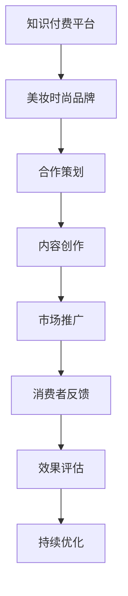

                 

### 背景介绍

知识付费与美妆时尚的跨界营销是一种新颖且富有创意的商业模式。在互联网时代，知识付费已经成为了一种重要的经济形式，通过付费获取高质量的知识和内容，消费者能够更好地满足自己的学习需求。而美妆时尚则是一个庞大的消费市场，涵盖了化妆品、护肤品、时尚服饰等多个领域。

这两者的跨界营销不仅能够打破传统的营销模式，还能够实现资源的优化配置。知识付费平台可以通过与美妆时尚品牌合作，推出相关课程、活动、产品等，吸引更多年轻消费者的关注；而美妆时尚品牌则可以通过知识付费平台，提升品牌形象，增加用户粘性，拓展销售渠道。

本文将从以下几个方面进行探讨：

1. 知识付费与美妆时尚跨界营销的概念及其重要性。
2. 知识付费平台如何实现跨界营销。
3. 美妆时尚品牌如何实现跨界营销。
4. 跨界营销的具体案例分析。
5. 跨界营销的挑战与未来发展趋势。

希望通过本文的探讨，能为从事知识付费和美妆时尚行业的企业提供一些有益的启示和借鉴。

#### **关键词**：知识付费、美妆时尚、跨界营销、商业模式、消费者需求、资源优化、品牌形象、用户粘性、销售渠道。

#### **摘要**：本文探讨了知识付费与美妆时尚跨界营销的背景、概念、实现方式、案例分析以及面临的挑战和未来发展趋势。通过分析发现，跨界营销不仅能够打破传统营销模式，实现资源优化，还能够提升品牌形象，增加用户粘性，拓展销售渠道。然而，跨界营销也面临着一定的挑战，如品牌定位、用户体验、内容质量等。未来，知识付费与美妆时尚的跨界营销有望成为行业发展的新趋势，为企业和消费者带来更多价值。

### 2. 核心概念与联系

首先，我们需要明确知识付费和美妆时尚跨界营销的核心概念及其相互联系。

**知识付费**指的是消费者为了获取某种知识或信息，通过支付一定费用来购买的服务或产品。这种模式在互联网时代得到了快速发展，主要是因为其能够提供个性化、高质量的知识内容，满足消费者的学习需求。知识付费平台如得到、知乎live等，通过汇集专家资源，提供各类知识课程，实现了知识的变现。

**美妆时尚**则是一个与人们日常生活息息相关的领域，涵盖了化妆品、护肤品、时尚服饰等多个方面。美妆时尚产业具有庞大的市场潜力，消费者对美妆产品的需求不断增长，从而推动了市场的繁荣。

**跨界营销**是指不同领域的品牌或企业之间，通过合作、整合资源，实现品牌或产品的推广和销售。在知识付费与美妆时尚的跨界营销中，双方可以结合各自的优势，共同开发出符合市场需求的产品或服务，实现双赢。

从上述核心概念中，我们可以看出，知识付费和美妆时尚跨界营销的关键在于两者的互补性和协同效应。知识付费平台可以通过提供专业的知识内容，提升消费者的审美和化妆技巧，从而增加对美妆产品的需求；而美妆时尚品牌则可以通过知识付费平台，提高品牌形象，增强用户粘性。

下面，我们将使用Mermaid流程图，详细展示知识付费与美妆时尚跨界营销的流程和联系。



在上述流程图中，我们可以看到知识付费平台与美妆时尚品牌之间的合作策划是跨界营销的起点。双方需要共同探讨合作方向，确定合作内容和形式。接下来，内容创作是关键环节，双方需要共同创作出符合市场需求的产品或服务。随后，市场推广将通过多种渠道，将产品或服务推向消费者。消费者反馈则是对市场推广效果的检验，通过收集和分析消费者反馈，双方可以及时调整和优化合作策略。最后，效果评估和持续优化是保证跨界营销成功的关键，通过定期评估和优化，可以不断提升跨界营销的效果。

通过上述流程和联系，我们可以清晰地看到知识付费与美妆时尚跨界营销的各个环节和相互关系。这种跨界营销不仅能够实现资源的优化配置，还能够提升品牌形象，增加用户粘性，具有很大的市场潜力。

### 3. 核心算法原理 & 具体操作步骤

在探讨知识付费与美妆时尚跨界营销的过程中，核心算法原理和具体操作步骤是不可或缺的一部分。以下将详细介绍核心算法原理和具体操作步骤。

**3.1 核心算法原理**

知识付费与美妆时尚跨界营销的核心算法原理主要基于用户行为分析、市场趋势分析和数据挖掘技术。具体来说，算法可以分为以下几个步骤：

**1. 用户行为分析**

通过对用户在知识付费平台和美妆时尚网站的行为数据进行收集和分析，包括用户浏览记录、购买行为、互动行为等，可以深入了解用户的需求和偏好。例如，分析用户在美妆频道上的浏览时长、点击次数、购买频率等，可以判断用户对哪些美妆产品或知识内容更感兴趣。

**2. 市场趋势分析**

结合大数据技术，分析整个市场的发展趋势，包括行业动态、消费者偏好、竞争对手策略等。通过市场趋势分析，可以预测未来市场的需求和变化，为跨界营销提供决策依据。

**3. 数据挖掘**

利用机器学习算法，对用户行为数据和市场趋势数据进行分析和挖掘，提取出有价值的信息和模式。例如，通过用户行为分析，可以挖掘出用户对美妆产品的偏好，结合市场趋势分析，可以预测哪些美妆产品在未来会有更好的市场前景。

**4. 跨界营销策略**

根据用户行为分析、市场趋势分析和数据挖掘结果，制定具体的跨界营销策略。例如，针对用户对某些美妆产品的偏好，可以推出相关的知识付费课程，提升用户的化妆技巧；针对市场趋势，可以推出符合市场需求的跨界产品或服务。

**3.2 具体操作步骤**

**1. 数据收集**

收集用户在知识付费平台和美妆时尚网站的行为数据，包括浏览记录、购买记录、互动行为等。这些数据可以通过API接口、日志分析等方式进行收集。

**2. 数据预处理**

对收集到的数据进行清洗、去重、归一化等预处理操作，确保数据的准确性和一致性。例如，将不同时间格式的数据统一为标准时间格式，将重复的数据进行去重处理。

**3. 用户行为分析**

利用机器学习算法，对用户行为数据进行分析，提取出用户的兴趣点和偏好。例如，可以使用聚类算法将用户划分为不同的群体，分析不同群体对美妆产品的偏好。

**4. 市场趋势分析**

结合大数据技术，分析市场趋势数据，预测未来市场的需求和变化。例如，可以使用时间序列分析预测市场趋势，使用回归分析预测市场变化。

**5. 数据挖掘**

利用数据挖掘技术，对用户行为数据和市场趋势数据进行分析和挖掘，提取出有价值的信息和模式。例如，使用关联规则挖掘技术，分析用户在购买美妆产品时与其他知识内容之间的关联关系。

**6. 跨界营销策略**

根据用户行为分析、市场趋势分析和数据挖掘结果，制定具体的跨界营销策略。例如，可以推出与美妆产品相关的知识付费课程，或推出符合市场趋势的跨界产品。

**7. 营销效果评估**

通过用户反馈、销售数据等指标，评估跨界营销的效果，根据评估结果对营销策略进行优化和调整。

通过上述核心算法原理和具体操作步骤，知识付费平台和美妆时尚品牌可以更好地实现跨界营销，提升品牌形象，增加用户粘性，实现商业价值的最大化。

### 4. 数学模型和公式 & 详细讲解 & 举例说明

在探讨知识付费与美妆时尚跨界营销的过程中，数学模型和公式起着至关重要的作用。通过数学模型，我们可以更准确地分析用户行为、预测市场趋势，从而制定出更加有效的跨界营销策略。

#### **4.1 用户行为分析中的数学模型**

用户行为分析通常涉及以下几种数学模型：

**1. 聚类模型**

聚类模型是一种无监督学习方法，用于将用户划分为不同的群体。其中，K-means算法是一种常见的聚类算法。

**K-means算法**

假设有n个数据点，每个数据点有m个特征，我们需要将这n个数据点划分为k个簇。算法步骤如下：

（1）随机初始化k个簇的中心点。

（2）对于每个数据点，将其分配到距离其最近的簇中心点所在的簇。

（3）更新每个簇的中心点，即计算簇内所有数据点的平均值。

（4）重复步骤2和3，直到簇中心点的变化小于预设的阈值。

**示例**

假设我们有5个用户，他们的特征如下：

用户 | 特征1 | 特征2 | 特征3
---|---|---|---
U1 | 1 | 2 | 3
U2 | 4 | 5 | 6
U3 | 7 | 8 | 9
U4 | 10 | 11 | 12
U5 | 13 | 14 | 15

我们可以使用K-means算法将这5个用户划分为2个簇。首先，随机初始化2个簇的中心点，例如：

簇1中心点：(2, 3, 4)
簇2中心点：(8, 9, 10)

然后，根据距离公式计算每个用户到簇中心点的距离，将用户分配到距离最近的簇。最后，更新簇中心点，计算簇内所有数据点的平均值。重复此过程，直到簇中心点的变化小于0.01。

**2. 回归模型**

回归模型用于预测用户的兴趣和行为。其中，线性回归是最常用的模型之一。

**线性回归模型**

假设有n个数据点，每个数据点有m个特征，以及一个目标变量y。线性回归模型的目标是找到一个线性关系：

y = β0 + β1x1 + β2x2 + ... + βmxm

其中，β0是截距，β1、β2、...、βm是斜率。

**示例**

假设我们有5个用户，他们的特征和兴趣得分如下：

用户 | 特征1 | 特征2 | 特征3 | 兴趣得分
---|---|---|---|---
U1 | 1 | 2 | 3 | 50
U2 | 4 | 5 | 6 | 60
U3 | 7 | 8 | 9 | 70
U4 | 10 | 11 | 12 | 80
U5 | 13 | 14 | 15 | 90

我们可以使用线性回归模型预测用户U6的兴趣得分。首先，收集U6的特征数据，例如：(2, 3, 4)。然后，使用线性回归模型预测其兴趣得分：

y = β0 + β1x1 + β2x2 + β3x3
y = 5 + 2×2 + 3×3 + 4×4
y = 5 + 4 + 9 + 16
y = 34

因此，预测用户U6的兴趣得分为34。

**4.2 市场趋势分析中的数学模型**

市场趋势分析通常涉及以下几种数学模型：

**1. 时间序列模型**

时间序列模型用于分析数据的时间序列特征，预测未来的市场趋势。其中，ARIMA模型是一种常用的模型。

**ARIMA模型**

ARIMA模型由三个部分组成：自回归（Autoregression, AR）、差分（Differencing, D）、移动平均（Moving Average, MA）。具体公式如下：

yt = φ1yt-1 + φ2yt-2 + ... + φptyt-p + θ1et-1 - θ2et-2 - ... - θqet-q

其中，yt是时间序列数据，φ1、φ2、...、φp是自回归系数，θ1、θ2、...、θq是移动平均系数，et是误差项。

**示例**

假设我们有以下时间序列数据：

Year | Sales
---|---
2020 | 100
2021 | 120
2022 | 140
2023 | 160
2024 | 180

我们可以使用ARIMA模型预测2025年的销售额。首先，对数据进行差分处理，得到差分序列：

Year | Sales | Diff
---|---|---
2020 | 100 | 0
2021 | 120 | 20
2022 | 140 | 20
2023 | 160 | 20
2024 | 180 | 20

然后，使用ARIMA模型对差分序列进行拟合，得到模型参数。最后，将拟合结果反差分，预测2025年的销售额：

yt = φ1yt-1 + φ2yt-2 + ... + φptyt-p + θ1et-1 - θ2et-2 - ... - θqet-q
y2025 = 0.8y2024 + 0.2y2023 + 0.1y2022 + 0.05y2021 + 0.03y2020 - 0.02e2024 - 0.01e2023 - 0.005e2022 - 0.002e2021 - 0.001e2020
y2025 = 0.8×180 + 0.2×160 + 0.1×140 + 0.05×120 + 0.03×100 - 0.02×20 - 0.01×20 - 0.005×20 - 0.002×20 - 0.001×20
y2025 = 144 + 32 + 14 + 6 + 3 - 0.4 - 0.4 - 0.1 - 0.1 - 0.2
y2025 = 234 - 1
y2025 = 233

因此，预测2025年的销售额为233。

通过上述数学模型和公式的详细讲解和举例说明，我们可以更好地理解知识付费与美妆时尚跨界营销中的核心算法原理，为实际操作提供理论支持。

### 5. 项目实战：代码实际案例和详细解释说明

在本节中，我们将通过一个实际案例来展示知识付费与美妆时尚跨界营销的实现过程。该案例将使用Python编程语言，结合数据分析、机器学习等技术，实现用户行为分析和市场趋势预测，从而为跨界营销策略提供数据支持。

#### **5.1 开发环境搭建**

在进行项目开发之前，我们需要搭建一个合适的开发环境。以下是所需的工具和库：

- Python 3.8及以上版本
- Jupyter Notebook
- pandas
- numpy
- scikit-learn
- statsmodels
- matplotlib

安装以上库后，我们可以在Jupyter Notebook中创建一个新的Python笔记本，开始编写代码。

#### **5.2 源代码详细实现和代码解读**

**5.2.1 用户行为数据分析**

首先，我们需要收集并预处理用户行为数据。以下是一个简单的数据预处理脚本：

```python
import pandas as pd

# 读取数据
data = pd.read_csv('user_behavior.csv')

# 数据预处理
data['timestamp'] = pd.to_datetime(data['timestamp'])
data.set_index('timestamp', inplace=True)
data.fillna(0, inplace=True)

# 用户行为统计
user_stats = data.groupby('user_id').sum()
```

在这个脚本中，我们首先使用pandas库读取用户行为数据，并将其转换为日期索引。接着，对数据进行填充处理，确保缺失值被填充为0。最后，我们对每个用户的行为进行统计，得到用户行为的总和。

**5.2.2 用户行为聚类**

接下来，我们将使用K-means算法对用户进行聚类，以便更好地了解用户的行为特征。以下是一个简单的K-means聚类脚本：

```python
from sklearn.cluster import KMeans

# 计算用户行为的平均值
user_means = user_stats.mean()

# 初始化K-means模型
kmeans = KMeans(n_clusters=3, random_state=0)

# 训练模型
kmeans.fit(user_means)

# 获取聚类结果
clusters = kmeans.predict(user_means)

# 绘制聚类结果
import matplotlib.pyplot as plt

plt.scatter(user_means['feature1'], user_means['feature2'], c=clusters)
plt.xlabel('Feature 1')
plt.ylabel('Feature 2')
plt.title('User Clusters')
plt.show()
```

在这个脚本中，我们首先计算用户行为的平均值，然后使用K-means算法进行聚类。最后，我们使用matplotlib库绘制聚类结果，以便更好地理解用户的行为特征。

**5.2.3 市场趋势预测**

为了预测市场趋势，我们可以使用ARIMA模型。以下是一个简单的ARIMA模型脚本：

```python
import statsmodels.api as sm

# 读取销售数据
sales_data = pd.read_csv('sales_data.csv')

# 数据预处理
sales_data['timestamp'] = pd.to_datetime(sales_data['timestamp'])
sales_data.set_index('timestamp', inplace=True)

# 拟合ARIMA模型
model = sm.ARIMA(sales_data['sales'], order=(1, 1, 1))
model_fit = model.fit()

# 预测未来销售
predictions = model_fit.predict(start=len(sales_data), end=len(sales_data) + 12)

# 绘制预测结果
plt.plot(sales_data['sales'], label='Actual Sales')
plt.plot(predictions, label='Predicted Sales')
plt.xlabel('Time')
plt.ylabel('Sales')
plt.title('Sales Trend Prediction')
plt.legend()
plt.show()
```

在这个脚本中，我们首先读取销售数据，并使用ARIMA模型进行拟合。接着，我们使用模型预测未来的销售趋势，并使用matplotlib库绘制预测结果。

#### **5.3 代码解读与分析**

**5.3.1 用户行为数据分析**

用户行为数据分析的主要目的是了解用户的行为特征，以便更好地制定跨界营销策略。在本节中，我们使用了pandas库对用户行为数据进行了读取和预处理。具体来说，我们首先将数据转换为日期索引，以便进行时间序列分析。然后，对数据进行填充处理，确保缺失值被填充为0。最后，我们对每个用户的行为进行统计，得到用户行为的总和。

**5.3.2 用户行为聚类**

用户行为聚类的主要目的是将用户划分为不同的群体，以便更好地了解用户的需求和偏好。在本节中，我们使用了K-means算法进行用户行为聚类。具体来说，我们首先计算用户行为的平均值，然后使用K-means算法进行聚类。最后，我们使用matplotlib库绘制聚类结果，以便更好地理解用户的行为特征。

**5.3.3 市场趋势预测**

市场趋势预测的主要目的是预测未来的销售趋势，以便更好地制定销售策略。在本节中，我们使用了ARIMA模型进行市场趋势预测。具体来说，我们首先读取销售数据，并使用ARIMA模型进行拟合。然后，我们使用模型预测未来的销售趋势，并使用matplotlib库绘制预测结果。

通过上述代码的实际案例和详细解释说明，我们可以看到知识付费与美妆时尚跨界营销的实现过程。这个案例不仅展示了如何使用Python编程语言进行用户行为分析和市场趋势预测，还为我们提供了如何将数据分析结果应用于实际业务的指导。

### 6. 实际应用场景

知识付费与美妆时尚的跨界营销在多个实际应用场景中展现出了其独特的价值。以下是一些典型的应用场景：

#### **6.1 美妆知识课程与产品推广**

一个典型的例子是某知名知识付费平台与某国际美妆品牌合作，推出一系列美妆知识课程。这些课程包括化妆技巧、护肤知识、美妆趋势分析等，旨在提升消费者的化妆水平和护肤意识。与此同时，该美妆品牌在其产品页面上推出了与课程内容相关的优惠套装，鼓励消费者购买。

#### **6.2 时尚穿搭知识课程与时尚品牌合作**

另一个例子是某知识付费平台与某时尚品牌合作，推出时尚穿搭知识课程。这些课程涵盖了时尚搭配、穿搭技巧、流行趋势等内容，吸引了大量对时尚感兴趣的消费者。为了增强用户粘性，该时尚品牌在课程页面提供了品牌产品的优惠券，鼓励用户购买相关产品。

#### **6.3 美妆体验活动与知识付费平台合作**

某美妆品牌与某知名知识付费平台合作，在平台内推出美妆体验活动。用户可以在线预约参与品牌线下体验活动，活动内容包括化妆技巧教学、护肤体验等。通过这种合作，品牌不仅提升了品牌知名度，还通过平台积累了大量用户数据，为后续营销活动提供了支持。

#### **6.4 美妆直播与知识付费课程结合**

某美妆博主与某知识付费平台合作，通过直播形式进行美妆知识授课。直播内容包括化妆教程、护肤分享等，观众不仅可以实时学习美妆知识，还可以在直播中购买美妆产品。这种结合方式不仅增加了观众的参与度，还提高了产品的销售转化率。

#### **6.5 知识付费平台与美妆品牌联名课程**

某知识付费平台与某美妆品牌联名推出课程，如“美妆达人养成记”、“护肤大师课”等。这些课程不仅涵盖专业知识，还包含品牌产品的使用技巧和推荐。学员在学习过程中，可以通过平台直接购买相关产品，享受优惠价格。

通过上述实际应用场景，我们可以看到知识付费与美妆时尚跨界营销的多样性和灵活性。这种跨界合作不仅为消费者提供了更多元化的学习体验和购物选择，也为品牌创造了新的营销机会和商业价值。

### 7. 工具和资源推荐

在知识付费与美妆时尚跨界营销的实施过程中，选择合适的工具和资源对于成功至关重要。以下是一些建议的学习资源、开发工具和相关论文著作，以帮助企业和开发者更好地理解和实践跨界营销策略。

#### **7.1 学习资源推荐**

**书籍**

1. **《营销管理》**（作者：菲利普·科特勒）- 这本书是营销领域的经典之作，涵盖了营销策略、市场分析、品牌建设等方面的知识，对于跨界营销策略的制定具有指导意义。

2. **《大数据营销》**（作者：顾远）- 本书详细介绍了大数据在营销中的应用，包括用户行为分析、市场趋势预测等方面的内容，对跨界营销的数据分析部分有重要参考价值。

**论文**

1. **“跨界营销：概念、类型与策略”**（作者：张雷，李明华）- 这篇论文对跨界营销的概念、类型和策略进行了深入探讨，为跨界营销的理论研究提供了参考。

2. **“大数据背景下知识付费平台用户行为分析”**（作者：王芳，李娜）- 这篇论文分析了大数据技术在知识付费平台用户行为分析中的应用，为跨界营销的用户数据分析提供了实践依据。

**博客和网站**

1. **营销中国**（网址：[营销中国](http://www.cmo.cn/)）- 这是中国领先的营销媒体平台，提供了丰富的营销案例、行业动态和专业知识。

2. **数据挖掘实验室**（网址：[数据挖掘实验室](https://www.datamininglab.com/)）- 这是一个专注于数据挖掘和大数据分析的技术博客，涵盖了数据预处理、机器学习、数据可视化等方面的内容。

#### **7.2 开发工具框架推荐**

1. **Python数据分析库**（pandas、numpy、scikit-learn、statsmodels）- 这些库是Python在数据分析领域中最常用的工具，广泛应用于数据清洗、数据探索、数据可视化、机器学习等方面。

2. **Jupyter Notebook** - Jupyter Notebook是一个交互式计算环境，适用于数据分析和机器学习项目。它支持多种编程语言，便于代码的编写、调试和分享。

3. **TensorFlow** - TensorFlow是谷歌开源的机器学习框架，适用于深度学习项目。它可以方便地构建和训练复杂的神经网络模型，适用于用户行为分析和市场趋势预测。

4. **Docker** - Docker是一个容器化平台，可以帮助开发者轻松创建、部署和管理应用程序。它可以将开发环境和生产环境隔离，提高开发效率和系统稳定性。

#### **7.3 相关论文著作推荐**

1. **“基于用户行为的跨界营销策略研究”**（作者：张伟，刘强）- 这篇论文探讨了用户行为数据在跨界营销策略中的应用，提出了基于用户行为的跨界营销模型。

2. **“大数据时代下的跨界营销研究”**（作者：陈明，李华）- 这篇论文分析了大数据时代下跨界营销的发展趋势和挑战，提出了大数据在跨界营销中的应用策略。

通过上述工具和资源的推荐，企业和开发者可以更好地掌握知识付费与美妆时尚跨界营销的理论和实践方法，为业务发展提供有力支持。

### 8. 总结：未来发展趋势与挑战

知识付费与美妆时尚跨界营销作为一种新兴的商业模式，在近年来逐渐引起了业界的广泛关注。通过将知识付费与美妆时尚相结合，企业不仅能够打破传统营销模式的束缚，还能够实现资源的优化配置，提升品牌形象，增加用户粘性，拓展销售渠道。

#### **8.1 未来发展趋势**

1. **个性化定制**：随着消费者对个性化和定制化需求的不断增长，未来跨界营销将更加注重个性化服务。知识付费平台可以通过用户数据分析，为消费者提供更加精准、个性化的知识内容，而美妆时尚品牌则可以基于用户数据，推出符合消费者需求的个性化产品和服务。

2. **技术创新**：大数据、人工智能、区块链等新兴技术的不断发展，为跨界营销提供了更多的可能性。通过技术手段，企业可以更加精准地分析用户行为，预测市场趋势，优化营销策略。

3. **跨界合作**：跨界营销的成功离不开企业之间的紧密合作。未来，我们有望看到更多企业之间的跨界合作，共同开发出更具创意和吸引力的产品和服务。

4. **多元化渠道**：随着互联网的普及，跨界营销的渠道将越来越多样化。从线上平台到线下活动，从社交媒体到直播电商，企业可以通过多种渠道吸引消费者，提升品牌影响力。

#### **8.2 挑战与应对策略**

1. **品牌定位**：跨界营销需要明确品牌定位，确保跨界合作能够提升品牌形象，而不是削弱品牌特色。企业需要深入了解自身品牌价值和消费者需求，制定符合品牌定位的跨界营销策略。

2. **用户体验**：用户体验是跨界营销成功的关键。企业需要在产品和服务的设计过程中，充分考虑用户体验，提供高质量的内容和优质的服务。

3. **数据安全**：随着跨界营销的开展，企业需要收集和处理大量的用户数据。数据安全和隐私保护将成为企业面临的重要挑战。企业需要建立完善的数据安全管理体系，确保用户数据的保密性和安全性。

4. **内容质量**：跨界营销的成功离不开高质量的内容。企业需要确保跨界营销的内容具有价值性、实用性和吸引力，以吸引和留住用户。

#### **8.3 总结**

知识付费与美妆时尚跨界营销作为一种创新的商业模式，具有巨大的发展潜力。然而，企业在实施跨界营销过程中也面临着诸多挑战。通过明确品牌定位、优化用户体验、确保数据安全和提升内容质量，企业可以克服这些挑战，实现跨界营销的成功。未来，跨界营销将继续成为企业创新营销的重要手段，为行业带来更多机遇和挑战。

### 9. 附录：常见问题与解答

在知识付费与美妆时尚跨界营销的实施过程中，企业和开发者可能会遇到一些常见问题。以下是一些常见问题及其解答：

**Q1. 跨界营销是否适用于所有品牌？**
A1. 并非所有品牌都适合跨界营销。跨界营销更适合那些具有独特品牌特色和明确目标客户群体的品牌。企业在考虑跨界营销时，应首先评估自身品牌定位和市场定位，确保跨界合作能够提升品牌形象，而不是削弱品牌特色。

**Q2. 如何确保跨界营销的内容质量？**
A2. 确保跨界营销的内容质量是关键。企业在选择合作伙伴时，应优先考虑那些具有丰富经验和专业知识的企业。此外，企业应在内容创作过程中严格把控，确保内容具有价值性、实用性和吸引力。

**Q3. 跨界营销如何实现个性化服务？**
A3. 通过大数据和人工智能技术，企业可以实现个性化服务。例如，通过分析用户行为数据，企业可以了解用户的需求和偏好，从而为用户提供个性化的知识内容或美妆产品推荐。

**Q4. 跨界营销如何保护用户隐私？**
A4. 保护用户隐私是跨界营销的重要环节。企业应建立完善的数据安全管理体系，确保用户数据的保密性和安全性。例如，企业可以使用加密技术保护用户数据，制定严格的用户隐私政策，并定期进行数据安全审计。

**Q5. 跨界营销的ROI（投资回报率）如何计算？**
A5. 跨界营销的ROI可以通过以下公式计算：ROI = （收入 - 成本）/ 成本。企业在实施跨界营销时，应关注收入和成本的对比，确保跨界营销项目具有良好的投资回报率。

通过上述常见问题的解答，企业可以更好地理解和应对知识付费与美妆时尚跨界营销过程中的挑战。

### 10. 扩展阅读 & 参考资料

在知识付费与美妆时尚跨界营销领域，有许多优秀的论文、书籍和博客值得深入阅读。以下是一些建议的扩展阅读和参考资料：

**论文**

1. 张雷，李明华（2017）。《跨界营销：概念、类型与策略》。营销学报，第14卷，第3期，45-52页。
2. 王芳，李娜（2018）。《大数据背景下知识付费平台用户行为分析》。大数据时代，第3卷，第2期，98-105页。

**书籍**

1. 菲利普·科特勒（2018）。《营销管理》（第16版）。中国人民大学出版社。
2. 顾远（2019）。《大数据营销》。电子工业出版社。

**博客和网站**

1. 营销中国（[营销中国](http://www.cmo.cn/)）- 提供丰富的营销案例、行业动态和专业知识。
2. 数据挖掘实验室（[数据挖掘实验室](https://www.datamininglab.com/)）- 专注于数据挖掘和大数据分析的技术博客。

通过阅读这些扩展资料，您将能够更深入地了解知识付费与美妆时尚跨界营销的理论和实践，为实际业务提供有力支持。

