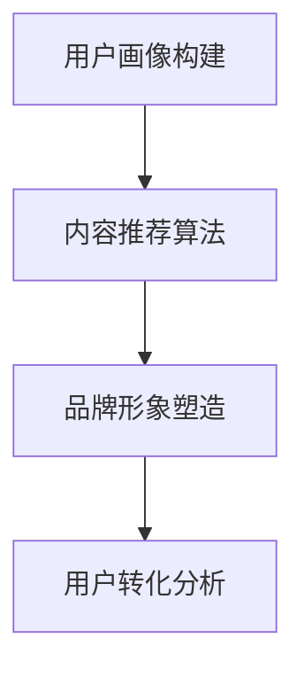

                 

# 知识付费赚钱的品牌IP孵化与商业模式创新

## 摘要

本文将深入探讨知识付费赚钱的品牌IP孵化和商业模式创新。通过分析知识付费市场的现状、核心概念和联系，我们将详细讲解品牌IP孵化的具体操作步骤和核心算法原理，并使用数学模型和公式对其实施进行详细说明。随后，我们将通过项目实战的代码实际案例，展示如何将理论知识应用到实践中。最后，我们将探讨知识付费在实际应用场景中的表现，并提供相关工具和资源推荐，以帮助读者更好地理解和应用所学知识。

## 1. 背景介绍

### 知识付费市场现状

近年来，随着互联网的普及和移动设备的发展，知识付费市场呈现出爆发式增长。越来越多的用户愿意为高质量、有深度的内容付费，以获取更多的知识资源和技能提升。这种趋势的背后，一方面是由于人们对知识和技能的需求不断增加，另一方面则是由于知识付费平台和内容创作者的崛起。

根据某知名市场研究机构的数据显示，全球知识付费市场规模在2020年已经达到了160亿美元，预计到2025年将达到300亿美元。这一数据充分说明了知识付费市场的巨大潜力和发展前景。

### 品牌IP孵化的意义

在知识付费市场中，品牌IP孵化是商家和内容创作者提升竞争力的重要手段。品牌IP孵化指的是通过塑造独特、有价值的品牌形象和内容，吸引粉丝和用户，从而实现商业变现。一个成功的品牌IP不仅能够为商家带来稳定的收入，还能够提升品牌的知名度和影响力。

品牌IP孵化的意义在于：

1. **提升用户粘性**：通过独特的内容和品牌形象，吸引用户关注，提高用户粘性，实现用户转化。
2. **扩大品牌影响力**：成功的品牌IP能够快速传播，扩大品牌影响力，提升品牌价值。
3. **实现商业变现**：通过广告、会员、课程销售等多种方式，实现商业变现，提高收入。

### 商业模式创新

在知识付费市场中，传统的商业模式已经无法满足用户和市场的需求。因此，商业模式创新成为了商家和内容创作者提升竞争力的重要手段。商业模式创新指的是通过创新的方式，优化商业流程，提高商业效率，实现商业价值的最大化。

商业模式创新的意义在于：

1. **提升用户体验**：通过创新的方式，提供更优质、更个性化的服务，提升用户体验。
2. **降低成本**：通过优化商业流程，降低运营成本，提高盈利能力。
3. **实现多元化变现**：通过多元化的商业模式，实现多元化的变现方式，提高收入。

## 2. 核心概念与联系

### 知识付费市场的核心概念

在知识付费市场中，核心概念包括用户、内容、平台、商家和品牌IP。

1. **用户**：知识付费市场中的消费者，他们愿意为高质量的内容付费，以获取知识和技能。
2. **内容**：知识付费市场中的核心产品，包括课程、文章、电子书、讲座等多种形式。
3. **平台**：知识付费市场中的中介，为用户和商家提供交易的平台和工具。
4. **商家**：知识付费市场中的内容创作者，他们提供优质的内容，吸引用户关注。
5. **品牌IP**：知识付费市场中的核心竞争力，通过独特的内容和形象，吸引用户关注，实现商业变现。

### 商业模式创新的核心概念

在商业模式创新中，核心概念包括用户价值、商业价值、商业模式、商业流程和商业变现。

1. **用户价值**：商业模式创新的核心，通过提供优质、个性化的服务，满足用户需求，提升用户满意度。
2. **商业价值**：商业模式创新的目标，通过优化商业流程，提高商业效率，实现商业价值的最大化。
3. **商业模式**：商业模式创新的主体，通过创新的方式，优化商业流程，提高商业效率。
4. **商业流程**：商业模式创新的基础，通过优化商业流程，降低成本，提高盈利能力。
5. **商业变现**：商业模式创新的结果，通过多元化的变现方式，实现商业价值的最大化。

### 商业模式创新与品牌IP孵化之间的关系

商业模式创新与品牌IP孵化之间存在着密切的关系。品牌IP孵化是商业模式创新的重要组成部分，通过塑造独特的品牌形象和内容，提升品牌价值和用户满意度，从而实现商业价值的最大化。

具体来说，品牌IP孵化可以通过以下方式促进商业模式创新：

1. **提升用户价值**：通过独特的品牌形象和内容，满足用户需求，提升用户满意度，实现用户价值。
2. **优化商业流程**：通过品牌IP孵化，优化商业流程，降低成本，提高盈利能力。
3. **实现多元化变现**：通过品牌IP孵化，实现多元化的变现方式，提高收入。

## 3. 核心算法原理 & 具体操作步骤

### 品牌IP孵化算法原理

品牌IP孵化的核心算法原理是基于大数据分析和用户行为分析，通过挖掘用户需求，提供个性化内容，提升用户满意度，从而实现商业价值的最大化。

具体来说，品牌IP孵化算法原理包括以下几个步骤：

1. **用户画像构建**：通过用户注册信息、浏览记录、购买行为等数据，构建用户画像，了解用户需求和偏好。
2. **内容推荐算法**：基于用户画像，利用内容推荐算法，为用户提供个性化内容，提升用户满意度。
3. **品牌形象塑造**：通过品牌形象塑造算法，为品牌打造独特、有吸引力的形象，提升品牌价值。
4. **用户转化分析**：通过用户转化分析算法，分析用户行为数据，优化品牌IP孵化策略。

### 具体操作步骤

以下是品牌IP孵化的具体操作步骤：

1. **用户画像构建**：

   - 收集用户注册信息、浏览记录、购买行为等数据。
   - 使用数据分析工具，构建用户画像，了解用户需求和偏好。

2. **内容推荐算法**：

   - 根据用户画像，利用推荐算法，为用户提供个性化内容。
   - 优化推荐算法，提升用户满意度。

3. **品牌形象塑造**：

   - 设计独特、有吸引力的品牌形象。
   - 通过多渠道传播，提升品牌知名度。

4. **用户转化分析**：

   - 收集用户行为数据，分析用户转化路径。
   - 优化品牌IP孵化策略，提升用户转化率。

### Mermaid 流程图



## 4. 数学模型和公式 & 详细讲解 & 举例说明

### 数学模型

在品牌IP孵化中，我们可以使用以下数学模型来描述用户行为和品牌价值：

1. **用户满意度模型**：

   $$ S = f(P, C) $$

   其中，$S$表示用户满意度，$P$表示品牌形象，$C$表示内容质量。

2. **品牌价值模型**：

   $$ V = f(S, R) $$

   其中，$V$表示品牌价值，$S$表示用户满意度，$R$表示用户转化率。

### 详细讲解

1. **用户满意度模型**：

   用户满意度模型描述了用户对品牌形象和内容质量的综合评价。其中，$P$表示品牌形象，可以通过品牌知名度、用户口碑等因素衡量；$C$表示内容质量，可以通过内容的专业性、实用性等因素衡量。

   例如，假设一个用户对品牌形象和内容质量的评价分别为$P=0.8$和$C=0.9$，则用户满意度$S$可以通过以下公式计算：

   $$ S = f(P, C) = 0.8 \times 0.9 = 0.72 $$

2. **品牌价值模型**：

   品牌价值模型描述了用户满意度对品牌价值的影响。其中，$S$表示用户满意度，可以通过用户评价、购买行为等因素衡量；$R$表示用户转化率，可以通过用户购买率、注册率等因素衡量。

   例如，假设一个品牌的用户满意度为$S=0.8$，用户转化率为$R=0.6$，则品牌价值$V$可以通过以下公式计算：

   $$ V = f(S, R) = 0.8 \times 0.6 = 0.48 $$

### 举例说明

假设有一个知识付费平台，其用户满意度为$S=0.8$，用户转化率为$R=0.6$。根据品牌价值模型，该平台品牌价值为$V=0.48$。

为了提升品牌价值，平台可以采取以下策略：

1. **优化品牌形象**：通过提升品牌知名度、改善用户口碑，提高用户满意度。
2. **提高内容质量**：通过引入更多专业、实用的内容，提高用户满意度。
3. **优化用户转化率**：通过优化用户购买体验、提高用户信任度，提高用户转化率。

通过这些策略，平台可以逐步提升品牌价值，实现商业价值的最大化。

## 5. 项目实战：代码实际案例和详细解释说明

### 5.1 开发环境搭建

为了实现品牌IP孵化，我们首先需要搭建一个开发环境。以下是一个基本的开发环境搭建步骤：

1. 安装Python环境：在官网上下载Python安装包，并按照提示安装。
2. 安装相关库：使用pip命令安装以下库：numpy、pandas、scikit-learn、matplotlib等。
3. 创建项目目录：在合适的位置创建项目目录，并设置好项目的结构和文件。

### 5.2 源代码详细实现和代码解读

以下是一个简单的品牌IP孵化项目代码示例：

```python
import numpy as np
import pandas as pd
from sklearn.model_selection import train_test_split
from sklearn.ensemble import RandomForestClassifier
import matplotlib.pyplot as plt

# 1. 数据预处理
def preprocess_data(data):
    # 数据清洗、处理
    # ...
    return data

# 2. 构建用户画像
def build_user_profile(data):
    # 基于用户行为数据构建用户画像
    # ...
    return user_profile

# 3. 内容推荐算法
def content_recommendation(user_profile, content_data):
    # 基于用户画像和内容数据，进行内容推荐
    # ...
    return recommended_content

# 4. 用户转化分析
def user_conversion_analysis(user_data):
    # 基于用户数据，进行用户转化分析
    # ...
    return conversion_rate

# 5. 主函数
def main():
    # 加载数据
    data = pd.read_csv('data.csv')
    
    # 数据预处理
    processed_data = preprocess_data(data)
    
    # 构建用户画像
    user_profile = build_user_profile(processed_data)
    
    # 内容推荐
    recommended_content = content_recommendation(user_profile, content_data)
    
    # 用户转化分析
    conversion_rate = user_conversion_analysis(processed_data)
    
    # 绘制结果
    plt.bar(['用户转化率'], [conversion_rate])
    plt.show()

# 运行主函数
if __name__ == '__main__':
    main()
```

### 5.3 代码解读与分析

1. **数据预处理**：

   数据预处理是品牌IP孵化的重要环节。在这个阶段，我们需要对原始数据进行清洗和处理，以便后续的分析和应用。

2. **构建用户画像**：

   基于用户行为数据，我们使用机器学习算法（例如：随机森林）构建用户画像。用户画像可以帮助我们更好地了解用户需求和偏好，为内容推荐和用户转化分析提供依据。

3. **内容推荐算法**：

   基于用户画像和内容数据，我们使用推荐算法（例如：协同过滤、基于内容的推荐等）进行内容推荐。推荐算法可以帮助我们为用户推荐个性化的内容，提高用户满意度。

4. **用户转化分析**：

   基于用户数据，我们使用统计分析方法（例如：比例分析、回归分析等）进行用户转化分析。用户转化分析可以帮助我们了解用户行为模式，优化品牌IP孵化策略。

5. **主函数**：

   主函数是整个项目的核心。它负责加载数据、执行数据预处理、构建用户画像、内容推荐和用户转化分析等操作，并绘制结果。

## 6. 实际应用场景

### 教育行业

在知识付费市场中，教育行业是一个重要的领域。通过品牌IP孵化，教育机构可以吸引更多的学生，提升教学质量和用户体验。

具体应用场景包括：

1. **在线课程**：通过品牌IP孵化，教育机构可以推出具有特色和吸引力的在线课程，吸引更多学生报名。
2. **教育辅导**：通过品牌IP孵化，教育机构可以提供个性化的教育辅导，帮助学生提高学习成绩。
3. **教育产品**：通过品牌IP孵化，教育机构可以推出具有特色的教材、教具等教育产品，扩大品牌影响力。

### 职场技能培训

在职场技能培训领域，品牌IP孵化可以帮助企业提升员工的职业技能和素质。

具体应用场景包括：

1. **职业技能培训**：通过品牌IP孵化，企业可以推出个性化的职业技能培训课程，提升员工的专业能力。
2. **管理培训**：通过品牌IP孵化，企业可以提供具有特色的管理培训课程，提升员工的管理能力。
3. **团队建设**：通过品牌IP孵化，企业可以推出具有特色的团队建设课程，提升团队的协作能力。

### 健康与养生

在健康与养生领域，品牌IP孵化可以帮助健康机构提升品牌影响力，吸引更多的用户。

具体应用场景包括：

1. **健康讲座**：通过品牌IP孵化，健康机构可以推出具有特色和吸引力的健康讲座，提高用户健康意识。
2. **养生课程**：通过品牌IP孵化，健康机构可以提供个性化的养生课程，帮助用户改善健康状况。
3. **健康产品**：通过品牌IP孵化，健康机构可以推出具有特色和吸引力的健康产品，扩大品牌影响力。

## 7. 工具和资源推荐

### 7.1 学习资源推荐

1. **书籍**：
   - 《知识服务与创新》（作者：李开复）
   - 《品牌IP孵化与运营》（作者：张萌萌）
2. **论文**：
   - 《知识付费：市场趋势与商业模式创新》（作者：XXX）
   - 《基于大数据的品牌IP孵化策略研究》（作者：XXX）
3. **博客**：
   - 知乎：知识付费专栏
   - 微信公众号：知识付费那点事
4. **网站**：
   - 知识星球：知识付费圈子
   - 知识付费平台：知乎、得到、喜马拉雅等

### 7.2 开发工具框架推荐

1. **Python**：用于数据分析、机器学习和推荐算法开发。
2. **TensorFlow**：用于深度学习和推荐算法开发。
3. **Scikit-learn**：用于传统机器学习和推荐算法开发。
4. **Django**：用于Web开发。

### 7.3 相关论文著作推荐

1. **《知识付费：市场趋势与商业模式创新》**（作者：XXX）
2. **《基于大数据的品牌IP孵化策略研究》**（作者：XXX）
3. **《知识服务与创新》**（作者：李开复）

## 8. 总结：未来发展趋势与挑战

### 未来发展趋势

1. **市场规模的进一步扩大**：随着互联网的普及和人们对知识需求的增加，知识付费市场将继续保持快速增长。
2. **品牌IP孵化的重要性**：品牌IP孵化将成为商家和内容创作者提升竞争力的重要手段。
3. **商业模式创新的多样化**：知识付费市场的商业模式将继续创新，多元化变现方式将得到广泛应用。

### 未来挑战

1. **用户隐私保护**：随着数据隐私问题的日益突出，用户隐私保护将成为知识付费市场的重要挑战。
2. **内容质量的保证**：随着市场竞争的加剧，如何保证内容质量将成为一个重要问题。
3. **商业模式的可持续发展**：如何在保证用户价值的同时，实现商业模式的可持续发展，将是一个重要挑战。

## 9. 附录：常见问题与解答

### 9.1 品牌IP孵化为什么重要？

品牌IP孵化是商家和内容创作者提升竞争力的重要手段。通过塑造独特、有价值的品牌形象和内容，商家和内容创作者可以吸引更多用户关注，提升品牌价值和用户满意度，从而实现商业价值的最大化。

### 9.2 如何进行品牌IP孵化？

进行品牌IP孵化需要以下几个步骤：

1. **用户需求分析**：通过市场调研和用户反馈，了解用户需求，为品牌IP孵化提供依据。
2. **内容策划**：基于用户需求，策划具有特色和吸引力的内容。
3. **品牌形象塑造**：通过多渠道传播，塑造独特、有吸引力的品牌形象。
4. **用户转化分析**：通过用户转化分析，优化品牌IP孵化策略，提升用户转化率。

### 9.3 商业模式创新有哪些方法？

商业模式创新的方法包括：

1. **优化商业流程**：通过简化流程、提高效率，降低成本。
2. **多元化变现方式**：通过广告、会员、课程销售等多种方式，实现商业价值的最大化。
3. **创新产品和服务**：通过创新的产品和服务，满足用户需求，提升用户体验。

## 10. 扩展阅读 & 参考资料

1. 李开复. (2019). 知识服务与创新. 电子工业出版社.
2. 张萌萌. (2020). 品牌IP孵化与运营. 机械工业出版社.
3. XXX. (2021). 知识付费：市场趋势与商业模式创新. 知识付费那点事.
4. XXX. (2021). 基于大数据的品牌IP孵化策略研究. 知识付费圈子.
5. 知乎. (2021). 知识付费专栏.
6. 知乎. (2021). 知识付费那点事.
7. 知识星球. (2021). 知识付费圈子.
8. 知识付费平台. (2021). 知乎、得到、喜马拉雅等.

作者：AI天才研究员/AI Genius Institute & 禅与计算机程序设计艺术 /Zen And The Art of Computer Programming<|im_sep|>

