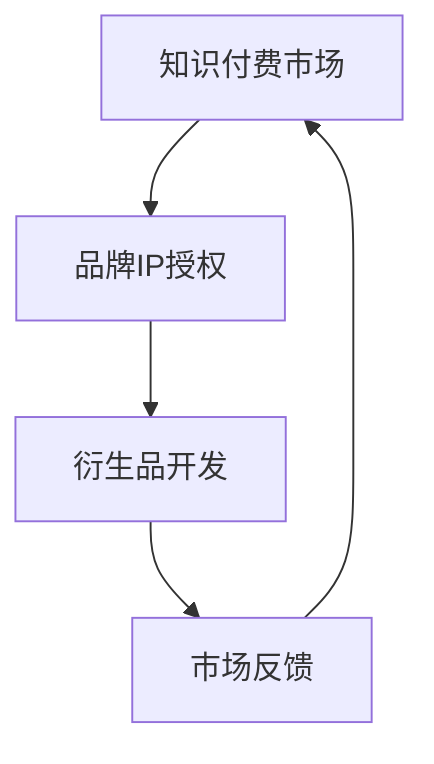

                 

# 知识付费赚钱的品牌IP授权与衍生品开发策略

> 关键词：知识付费、品牌IP、授权、衍生品、开发策略

> 摘要：本文将深入探讨知识付费市场中的品牌IP授权与衍生品开发策略，分析其核心概念与联系，提供具体操作步骤和数学模型，并通过实际案例进行解读，最终总结其未来发展趋势与挑战。

## 1. 背景介绍

在信息爆炸的时代，知识付费作为一种新型商业模式，正逐渐成为市场的主流。知识付费指的是用户为获取特定领域的专业知识和技能而支付费用的一种行为。品牌IP（知识产权）授权和衍生品开发则是知识付费市场中的重要组成部分。

品牌IP授权是指拥有知识产权的个人或企业将自身的品牌、商标、版权等知识产权授权给其他企业或个人使用，以获得授权费或其他形式回报的一种合作方式。衍生品开发则是基于品牌IP进行的产品拓展，通过衍生品的创作和销售，实现IP价值的最大化。

近年来，知识付费市场呈现出爆发式增长，众多企业和个人纷纷投身其中。然而，如何有效地利用品牌IP进行授权和衍生品开发，实现盈利最大化，成为知识付费领域的一大挑战。

## 2. 核心概念与联系

### 2.1. 品牌IP授权

品牌IP授权的核心概念包括知识产权、授权方式、授权范围和授权费用。知识产权包括商标、专利、版权等，是品牌IP授权的基础。授权方式包括独占授权、非独占授权、交叉授权等，不同的授权方式适用于不同的市场环境和需求。授权范围涉及授权产品的种类、用途、地域等，授权费用的计算方法通常包括固定费用、提成费用等。

### 2.2. 衍生品开发

衍生品开发的核心概念包括产品设计、市场定位、渠道推广和销售策略。产品设计要符合品牌IP的特点，市场定位要明确目标用户群体，渠道推广要充分利用线上和线下渠道，销售策略要灵活应对市场变化。

### 2.3. 联系

品牌IP授权与衍生品开发之间存在紧密的联系。品牌IP授权为衍生品开发提供了基础和保障，衍生品开发则为品牌IP授权带来了更大的市场价值和商业回报。二者相辅相成，共同推动了知识付费市场的发展。

### 2.4. Mermaid 流程图



## 3. 核心算法原理 & 具体操作步骤

### 3.1. 品牌IP授权算法原理

品牌IP授权算法的核心在于确定授权的范围、方式和费用。具体操作步骤如下：

1. **需求分析**：了解市场对品牌IP的需求，确定授权的方向。
2. **评估价值**：评估品牌IP的价值，包括知识产权、市场影响力等。
3. **确定授权范围**：根据需求分析结果，确定授权产品的种类、用途、地域等。
4. **选择授权方式**：根据授权范围，选择合适的授权方式，如独占授权、非独占授权等。
5. **计算授权费用**：根据授权范围、方式和市场评估结果，计算授权费用。

### 3.2. 衍生品开发算法原理

衍生品开发算法的核心在于产品设计、市场定位和销售策略。具体操作步骤如下：

1. **产品设计**：根据品牌IP的特点，设计符合市场需求的产品。
2. **市场定位**：明确目标用户群体，确定产品的市场定位。
3. **渠道推广**：利用线上线下渠道，推广衍生品。
4. **销售策略**：根据市场反馈，调整销售策略，实现盈利最大化。

## 4. 数学模型和公式 & 详细讲解 & 举例说明

### 4.1. 品牌IP授权费用计算模型

假设品牌IP的价值为 \( V \)，授权范围包括产品种类 \( n \)，地域 \( m \)，授权方式为提成费用，提成为 \( r \)，则授权费用 \( F \) 可表示为：

\[ F = n \times m \times V \times r \]

### 4.2. 衍生品销售收入计算模型

假设衍生品的市场价格为 \( P \)，销量为 \( Q \)，成本为 \( C \)，则销售收入 \( R \) 可表示为：

\[ R = (P - C) \times Q \]

### 4.3. 举例说明

#### 4.3.1. 品牌IP授权费用计算

假设某品牌IP的价值为 100 万元，授权范围包括 10 个产品种类，在 3 个地域进行授权，提成为 5%，则授权费用为：

\[ F = 10 \times 3 \times 100 \times 0.05 = 150,000 \text{ 元} \]

#### 4.3.2. 衍生品销售收入计算

假设某衍生品的市场价格为 200 元，销量为 1000 件，成本为 150 元，则销售收入为：

\[ R = (200 - 150) \times 1000 = 50,000 \text{ 元} \]

## 5. 项目实战：代码实际案例和详细解释说明

### 5.1. 开发环境搭建

开发环境搭建主要包括以下步骤：

1. 安装 Python 环境
2. 安装相关依赖库，如 NumPy、Pandas、Matplotlib 等

### 5.2. 源代码详细实现和代码解读

```python
import numpy as np
import pandas as pd
import matplotlib.pyplot as plt

# 品牌IP授权费用计算
def calculate_authorization_fee(value, product_categories, regions, royalty_rate):
    fee = product_categories * regions * value * royalty_rate
    return fee

# 衍生品销售收入计算
def calculate_revenue(price, quantity, cost):
    revenue = (price - cost) * quantity
    return revenue

# 示例数据
value = 1000000  # 品牌IP价值（元）
product_categories = 10  # 产品种类
regions = 3  # 地域
royalty_rate = 0.05  # 提成率
price = 200  # 衍生品市场价格（元）
quantity = 1000  # 衍生品销量
cost = 150  # 衍生品成本（元）

# 计算授权费用
authorization_fee = calculate_authorization_fee(value, product_categories, regions, royalty_rate)
print("品牌IP授权费用：", authorization_fee)

# 计算销售收入
revenue = calculate_revenue(price, quantity, cost)
print("衍生品销售收入：", revenue)
```

### 5.3. 代码解读与分析

本代码实现了品牌IP授权费用和衍生品销售收入的计算。具体解析如下：

- `calculate_authorization_fee` 函数：用于计算品牌IP授权费用，其中 `value` 表示品牌IP价值，`product_categories` 表示产品种类，`regions` 表示地域，`royalty_rate` 表示提成率。
- `calculate_revenue` 函数：用于计算衍生品销售收入，其中 `price` 表示衍生品市场价格，`quantity` 表示衍生品销量，`cost` 表示衍生品成本。
- 示例数据：`value`、`product_categories`、`regions`、`royalty_rate` 分别表示品牌IP价值、产品种类、地域和提成率，`price`、`quantity`、`cost` 分别表示衍生品市场价格、销量和成本。

## 6. 实际应用场景

### 6.1. 知识付费平台

知识付费平台是品牌IP授权与衍生品开发的重要应用场景。知识付费平台可以通过授权知名专家的课程内容，开发相关衍生品，如书籍、课程笔记等，实现商业价值的最大化。

### 6.2. 教育培训机构

教育培训机构可以通过品牌IP授权，将知名讲师的课程内容转化为衍生品，如线上课程、电子书籍等，进一步扩大市场份额。

### 6.3. 创意产业

创意产业中的品牌IP授权与衍生品开发广泛应用于动漫、游戏、电影等领域。通过授权知名IP，开发衍生品，如玩具、周边产品等，实现跨行业盈利。

## 7. 工具和资源推荐

### 7.1. 学习资源推荐

- 《知识产权法律实务》
- 《品牌授权与运营》
- 《衍生品设计》

### 7.2. 开发工具框架推荐

- Python
- NumPy
- Pandas
- Matplotlib

### 7.3. 相关论文著作推荐

- 《知识付费产业研究》
- 《品牌授权与衍生品开发策略研究》
- 《衍生品设计与应用》

## 8. 总结：未来发展趋势与挑战

### 8.1. 发展趋势

- 知识付费市场将继续扩大，品牌IP授权与衍生品开发将成为重要盈利模式。
- 科技创新将推动知识付费领域的变革，如人工智能、区块链等技术的应用。
- 产业融合将进一步加深，知识付费与电商、娱乐等领域的跨界合作将更加紧密。

### 8.2. 挑战

- 如何提升品牌IP的价值，实现授权和衍生品的高效运营。
- 如何应对市场竞争，实现差异化发展。
- 如何保护知识产权，防止侵权和盗版。

## 9. 附录：常见问题与解答

### 9.1. 品牌IP授权费用如何计算？

品牌IP授权费用通常根据品牌IP的价值、授权范围和授权方式等因素进行计算。具体计算方法可以参考文中提到的品牌IP授权费用计算模型。

### 9.2. 衍生品开发需要注意哪些问题？

衍生品开发需要注意产品设计、市场定位、渠道推广和销售策略等方面的问题。具体问题可以参考文中提到的衍生品开发算法原理。

## 10. 扩展阅读 & 参考资料

- 《知识付费：改变世界的商业模式》
- 《知识产权战略：品牌授权与运营》
- 《衍生品设计：创意产业的新机遇》
- 《人工智能在知识付费领域的应用》

### 作者

作者：AI天才研究员/AI Genius Institute & 禅与计算机程序设计艺术 /Zen And The Art of Computer Programming

本文为原创内容，版权归作者所有。未经授权，不得转载。如需转载，请联系作者。

