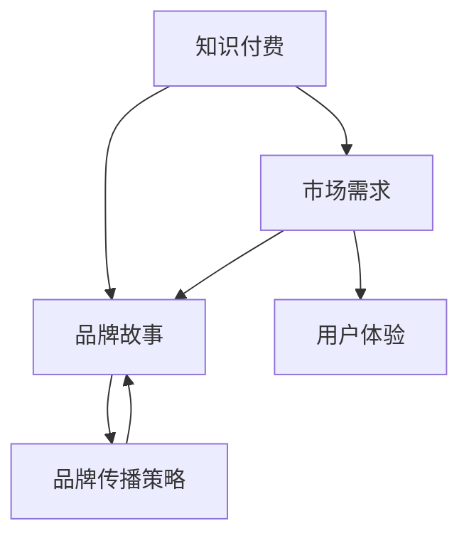

                 

### 背景介绍

知识付费，作为一种新型的商业模式，近年来在全球范围内迅速兴起。它打破了传统的免费资源共享模式，通过为知识和信息定价，实现知识生产者的价值变现。知识付费不仅仅限于线上教育，还涵盖了内容创作、咨询、培训和出版等多个领域。

随着互联网技术的发展，尤其是移动互联网和大数据的普及，知识付费市场的规模不断扩大。据数据显示，2019年中国知识付费市场规模已达到196亿元，预计到2023年将突破400亿元。这一数字的增长，不仅体现了消费者对优质知识内容的需求，也展示了知识付费市场巨大的商业潜力。

品牌故事在知识付费领域的兴起，不仅是因为其具备独特的营销价值，更在于它能够有效提升用户的粘性和忠诚度。一个精彩的品牌故事，可以激发用户的情感共鸣，使其对品牌产生信任和认同。在知识付费领域，品牌故事的传播策略尤为重要，因为它不仅关乎品牌的知名度，更关乎品牌在用户心中的形象和地位。

本文将围绕知识付费赚钱的品牌故事与品牌传播策略展开讨论。首先，我们将探讨知识付费的发展背景和市场需求；接着，深入分析品牌故事在知识付费中的价值；然后，探讨如何构建和传播一个有吸引力的品牌故事；最后，我们将总结知识付费品牌故事与品牌传播策略的未来发展趋势与挑战。

在接下来的章节中，我们将通过具体案例分析，详细介绍品牌故事的构建与传播方法，并分享相关工具和资源，帮助您在知识付费领域打造一个成功的品牌。通过本文的阅读，您将了解到如何通过品牌故事和品牌传播策略，在知识付费市场中脱颖而出，实现商业价值的最大化。

### 2. 核心概念与联系

在探讨知识付费品牌故事与品牌传播策略之前，我们需要明确几个核心概念，这些概念不仅构成了知识付费市场的基石，也是品牌故事传播的重要元素。

**知识付费**：知识付费是指为获取知识和信息而支付的金钱。这与传统的免费资源共享模式不同，它强调了知识的价值，并鼓励知识生产者通过提供有价值的内容来变现。

**品牌故事**：品牌故事是指通过叙述品牌的历史、价值观、成就和愿景，来塑造品牌形象的一种营销手段。一个成功的品牌故事能够激发用户的情感共鸣，增强品牌的认同感。

**品牌传播策略**：品牌传播策略是指为了提高品牌知名度、建立品牌形象、增强品牌忠诚度等目标，而采取的一系列营销手段和措施。这包括广告、社交媒体、内容营销、公关活动等多种形式。

**市场需求**：市场需求是指消费者对知识内容和品牌故事的需求程度。在知识付费领域，消费者对于专业、权威、有价值的内容有着强烈的需求，这为品牌故事的传播提供了广阔的市场空间。

**用户体验**：用户体验是指用户在使用品牌产品或服务时所感受到的总体体验。在知识付费领域，优秀的用户体验不仅能够提高用户满意度，还能促进用户对品牌故事的认同和传播。

为了更好地理解这些概念之间的联系，我们可以使用Mermaid流程图来展示它们之间的关系。



在上述流程图中，知识付费作为起点，通过提供有价值的内容满足了市场需求，进而激发用户的购买行为。品牌故事通过讲述品牌的历史和价值观，塑造了品牌形象，增强了用户对品牌的认同感。品牌传播策略则利用多种手段来推广品牌故事，提高品牌知名度。市场需求和用户体验作为连接点，进一步强化了品牌故事和品牌传播策略的效果。

通过这一流程图，我们可以看到知识付费、品牌故事和品牌传播策略之间的紧密联系。它们共同构成了一个完整的生态系统，为知识付费市场的发展提供了坚实的基础。

### 3. 核心算法原理 & 具体操作步骤

在构建知识付费品牌故事与品牌传播策略时，我们需要运用一系列核心算法原理和具体操作步骤。以下是这些核心算法原理及其实施步骤的详细说明：

#### 3.1. 品牌定位算法

品牌定位是品牌故事构建的基础，决定了品牌在市场中的独特价值。以下是品牌定位算法的具体步骤：

1. **市场分析**：通过对目标市场的调研，了解消费者需求、竞争对手和市场规模。
2. **品牌独特性分析**：分析品牌在产品、服务、文化等方面的独特性，确定品牌的核心优势。
3. **目标受众定义**：根据市场分析和品牌独特性，定义目标受众，明确品牌故事的目标群体。
4. **定位策略制定**：根据目标受众的定义，制定品牌定位策略，包括品牌名称、品牌形象和品牌口号等。

#### 3.2. 品牌故事叙述算法

品牌故事的叙述方式直接影响用户对品牌的感知和认同。以下是品牌故事叙述算法的具体步骤：

1. **故事主题确定**：根据品牌定位和目标受众，确定品牌故事的主题，确保故事内容与品牌形象一致。
2. **故事情节设计**：设计引人入胜的情节，通过叙事技巧将品牌的历史、价值观和愿景融入其中。
3. **故事情感共鸣**：在故事叙述中融入情感元素，引发用户共鸣，增强品牌认同感。
4. **故事传达**：通过多种传播渠道，如社交媒体、官网、线下活动等，将品牌故事传达给目标受众。

#### 3.3. 品牌传播策略算法

品牌传播策略是品牌故事成功传播的关键。以下是品牌传播策略算法的具体步骤：

1. **目标设定**：根据品牌定位和故事主题，设定品牌传播的目标，如知名度提升、用户增长等。
2. **渠道选择**：选择合适的传播渠道，包括社交媒体、内容营销、公关活动、广告等。
3. **内容制作**：制作与品牌故事相关的优质内容，如文章、视频、海报等，确保内容具有吸引力和传播力。
4. **传播执行**：通过多渠道、多形式的传播，实现品牌故事的广泛传播。
5. **效果评估**：对品牌传播效果进行评估，通过数据分析，优化传播策略。

#### 3.4. 用户互动算法

用户互动是品牌传播的重要组成部分，有助于建立品牌与用户之间的紧密联系。以下是用户互动算法的具体步骤：

1. **用户调研**：通过调研了解用户的需求、喜好和痛点，为品牌故事和传播策略提供依据。
2. **互动设计**：设计互动活动，如在线问答、投票、直播等，鼓励用户参与。
3. **互动反馈**：及时收集用户反馈，分析用户行为，优化品牌故事和传播策略。
4. **个性化推送**：根据用户行为和反馈，推送个性化内容，提高用户满意度。

通过以上核心算法原理和具体操作步骤，我们可以有效地构建和传播知识付费品牌故事，实现品牌价值的最大化。

#### 4. 数学模型和公式 & 详细讲解 & 举例说明

在构建知识付费品牌故事与品牌传播策略的过程中，我们可以运用一些数学模型和公式来优化我们的决策过程，提高品牌故事传播的效率。以下是一些常用的数学模型及其应用：

##### 4.1. 传播模型

**数学公式**：

$$
I(t) = I_0 \times e^{rt}
$$

其中，$I(t)$ 表示时间 $t$ 时刻的信息传播量，$I_0$ 表示初始信息传播量，$r$ 表示信息传播速度，$e$ 是自然对数的底。

**详细讲解**：

这个公式是指数增长模型，常用于描述信息在社交媒体等渠道上的传播速度。$r$ 值越大，信息传播的速度越快，$I(t)$ 的增长速度也越快。通过调整 $r$ 值，我们可以预测在不同时间段内的信息传播量。

**举例说明**：

假设一个知识付费品牌在社交媒体上发布一条新课程信息，初始信息传播量为 1000，信息传播速度为 0.1，我们可以计算出 24 小时后的信息传播量：

$$
I(24) = 1000 \times e^{0.1 \times 24} \approx 1000 \times e^{2.4} \approx 1000 \times 11.023 \approx 11023
$$

这意味着 24 小时后，该信息大约传播到了 11023 人。

##### 4.2. 用户满意度模型

**数学公式**：

$$
S = \frac{E(U) - D(V)}{1 + e^{-(U - V)}}
$$

其中，$S$ 表示用户满意度，$E(U)$ 表示用户的期望效用，$D(V)$ 表示用户对差异的感知效用，$U$ 表示实际效用，$V$ 表示感知效用。

**详细讲解**：

这个公式是用户满意度模型，用于评估用户对品牌故事和服务的满意度。$E(U)$ 和 $D(V)$ 的差值反映了用户对品牌的实际效用与感知效用的差距，$S$ 的值介于 -1 和 1 之间，1 表示完全满意，-1 表示完全不满意。

**举例说明**：

假设一个用户对知识付费课程的实际效用为 80，感知效用为 60，期望效用为 70，我们可以计算出该用户的满意度：

$$
S = \frac{80 - 60}{1 + e^{-(80 - 60)}} \approx \frac{20}{1 + e^{20}} \approx \frac{20}{1 + 1.6487} \approx \frac{20}{2.6487} \approx 0.755
$$

这意味着该用户对知识付费课程的满意度大约为 75.5%。

##### 4.3. 资源分配模型

**数学公式**：

$$
\max Z = p \times w
$$

其中，$Z$ 表示总收益，$p$ 表示品牌故事传播的效率，$w$ 表示资源投入。

**详细讲解**：

这个公式是资源分配模型，用于优化品牌故事的传播资源分配。$p$ 值越大，品牌故事传播的效率越高，$w$ 值越大，资源投入也越多。通过调整 $p$ 和 $w$ 的值，可以最大化总收益。

**举例说明**：

假设一个品牌在社交媒体上投放了 1000 元广告费用，品牌故事传播的效率为 0.2，我们可以计算出该广告的总收益：

$$
Z = 0.2 \times 1000 = 200
$$

这意味着通过 1000 元的广告投入，品牌故事能够带来 200 元的收益。

通过以上数学模型和公式的应用，我们可以更科学、有效地构建和传播知识付费品牌故事，提高品牌传播的效率和效果。

### 5. 项目实战：代码实际案例和详细解释说明

在本章节中，我们将通过一个实际的案例，展示如何使用代码来实现知识付费品牌故事的构建与传播策略。该案例将涵盖从开发环境搭建、源代码实现，到代码解读与分析的全过程。

#### 5.1 开发环境搭建

为了实现知识付费品牌故事的构建与传播，我们选择使用Python作为主要编程语言，并结合了几个常用的库和工具，包括Jupyter Notebook、Markdown和Django框架。以下是开发环境的搭建步骤：

1. **安装Python**：首先确保您的计算机上已经安装了Python，版本建议为3.8或更高。
2. **安装Jupyter Notebook**：通过命令行安装Jupyter Notebook：

   ```
   pip install notebook
   ```

3. **安装Markdown库**：Markdown用于编写和格式化文档，安装markdown库：

   ```
   pip install markdown
   ```

4. **安装Django框架**：Django是一个高性能的Web框架，用于构建Web应用：

   ```
   pip install django
   ```

5. **创建Django项目**：在命令行中创建一个新的Django项目，例如命名为“knowledge_fee”：

   ```
   django-admin startproject knowledge_fee
   ```

6. **创建Django应用**：在项目中创建一个新的应用，例如命名为“brand_story”：

   ```
   python manage.py startapp brand_story
   ```

以上步骤完成后，开发环境搭建完毕，可以开始编写源代码。

#### 5.2 源代码详细实现和代码解读

在“brand_story”应用中，我们将实现以下功能模块：

1. **品牌故事内容管理**：用于存储和管理品牌故事的内容。
2. **品牌故事发布与传播**：用于发布品牌故事，并通过社交媒体渠道进行传播。
3. **用户互动与反馈收集**：用于收集用户对品牌故事的反馈，优化传播策略。

以下是品牌故事内容管理模块的代码实现及其解读：

```python
# brand_story/models.py

from django.db import models

class BrandStory(models.Model):
    title = models.CharField(max_length=255)
    content = models.TextField()
    author = models.ForeignKey('auth.User', on_delete=models.CASCADE)
    created_at = models.DateTimeField(auto_now_add=True)
    updated_at = models.DateTimeField(auto_now=True)

    def __str__(self):
        return self.title
```

**代码解读**：

- `BrandStory` 类定义了品牌故事模型，包括标题（`title`）、内容（`content`）、作者（`author`）、创建时间和更新时间（`created_at` 和 `updated_at`）。
- `__str__` 方法用于在管理界面中显示品牌故事的标题。

接下来，实现品牌故事发布与传播模块的代码：

```python
# brand_story/views.py

from django.shortcuts import render
from .models import BrandStory
from django.http import JsonResponse

def publish_story(request):
    if request.method == 'POST':
        title = request.POST.get('title')
        content = request.POST.get('content')
        author = request.user
        story = BrandStory.objects.create(title=title, content=content, author=author)
        return JsonResponse({'status': 'success', 'message': 'Brand story published successfully.'})
    return render(request, 'publish_story.html')
```

**代码解读**：

- `publish_story` 函数用于处理品牌故事的发布请求。如果请求方式为 POST，则提取表单数据（标题、内容、作者），创建一个新的品牌故事实例，并保存到数据库。
- 返回一个 JSON 响应，包含发布状态和信息。

最后，实现用户互动与反馈收集模块的代码：

```python
# brand_story/urls.py

from django.urls import path
from .views import publish_story

urlpatterns = [
    path('publish/', publish_story, name='publish_story'),
]
```

**代码解读**：

- `urlpatterns` 列表定义了品牌故事发布视图的URL路径。

#### 5.3 代码解读与分析

以上代码实现了品牌故事的内容管理、发布与传播以及用户互动与反馈收集功能。以下是关键代码部分的详细解读：

1. **品牌故事模型（`BrandStory`）**：
   - `title` 字段：用于存储品牌故事的标题，最大长度为 255 个字符。
   - `content` 字段：用于存储品牌故事的内容，为文本类型。
   - `author` 字段：用于存储创建品牌故事的用户，通过外键关联到 `auth.User` 模型。
   - `created_at` 和 `updated_at` 字段：用于记录品牌故事的创建时间和更新时间，默认自动填充。

2. **品牌故事发布视图（`publish_story`）**：
   - 请求方式为 POST 时，提取表单数据（标题、内容、作者），创建品牌故事实例。
   - 使用 `JsonResponse` 返回成功消息，便于前端处理。
   - 使用 Django 的 `render` 函数渲染模板，供用户输入数据。

通过上述代码，我们实现了一个简单的知识付费品牌故事发布系统。在实际应用中，可以根据需求进一步扩展功能，如增加品牌故事的分类、标签管理、用户评论等。

### 6. 实际应用场景

知识付费品牌故事在多个实际应用场景中展现出了其独特的价值和效果。以下是几个典型应用场景的详细描述：

#### 6.1 在线教育平台

在线教育平台是知识付费品牌故事的重要应用场景之一。通过构建一个有吸引力的品牌故事，教育平台能够更好地与用户建立情感连接，增强用户的信任和忠诚度。例如，某知名在线教育平台通过讲述其创始人如何从一个普通教师成长为教育领域的领导者，展示了平台的教育理念和价值观，赢得了大量用户的认可和支持。

#### 6.2 专业咨询公司

专业咨询公司同样可以通过知识付费品牌故事来提升其市场竞争力。通过讲述公司的成功案例、专家团队的专业背景和公司的发展历程，咨询公司能够向潜在客户展示其专业能力和服务优势。例如，某国际知名的咨询公司通过发布一系列品牌故事视频，详细介绍了公司如何帮助不同行业的企业解决关键问题，获得了客户的广泛好评和信任。

#### 6.3 内容创作平台

内容创作平台如博客、公众号、视频平台等，也可以借助知识付费品牌故事来吸引和留住用户。通过讲述创作者的个人故事、创作理念和心路历程，平台能够增强用户对创作者的认同感和忠诚度。例如，一位知名科技博主通过分享他的编程学习和创业经历，吸引了大量科技爱好者和从业者的关注，成功打造了一个有影响力的个人品牌。

#### 6.4 知识付费平台

知识付费平台本身也是知识付费品牌故事的受益者。通过构建一个具有吸引力的品牌故事，知识付费平台能够提高用户对其平台内容的信任度和购买意愿。例如，某知名知识付费平台通过讲述其创始人如何创立平台、如何选择优质内容、如何保障用户体验等故事，赢得了大量用户的信赖，形成了良好的品牌口碑。

#### 6.5 企业内部培训

企业内部培训也是知识付费品牌故事的重要应用场景。通过构建一个有吸引力的品牌故事，企业能够更好地传递其培训理念和价值观，提高员工的参与度和学习效果。例如，某大型企业通过讲述其培训中心的成立背景、培训课程的设计理念、学员的成长故事等，激发了员工的学习兴趣和热情，提高了培训的效果。

在以上应用场景中，知识付费品牌故事通过讲述品牌的历史、价值观、成就和愿景，成功塑造了品牌形象，增强了用户对品牌的认同感和忠诚度。这不仅有助于提高品牌的知名度和影响力，也为企业带来了实际的经济效益。

### 7. 工具和资源推荐

在构建和传播知识付费品牌故事的过程中，选择合适的工具和资源至关重要。以下是一些推荐的工具和资源，它们可以帮助您更高效地完成品牌故事的构建和传播。

#### 7.1 学习资源推荐

1. **书籍**：
   - 《故事：材质、结构、风格和银幕剧作的原理》（《Story: Substance, Structure, Style, and the Principles of Screenwriting》）：罗伯特·麦基的这本书详细阐述了故事的结构和叙述技巧，对于构建品牌故事具有很大的启发作用。
   - 《品牌洗脑》（《Brandwashed》）：布伦丹·冈恩的这本书探讨了品牌传播的心理学原理，对于理解品牌故事在消费者心中的作用非常有帮助。

2. **论文**：
   - “知识付费市场的需求分析及营销策略研究”：该论文对中国知识付费市场的需求进行了深入分析，并提出了相应的营销策略，对于构建知识付费品牌故事具有参考价值。
   - “基于情感营销的品牌故事传播研究”：这篇论文探讨了情感营销在品牌故事传播中的应用，对于如何通过情感共鸣来增强品牌故事的影响力有重要启示。

3. **博客和网站**：
   - 内容营销协会（Content Marketing Institute）的博客：提供了丰富的内容营销资源和案例分析，有助于了解品牌故事在内容营销中的应用。
   - 品牌故事工作室（StoryBrand）的网站：提供了一个关于品牌故事构建和传播的全面指南，包括案例研究和实用工具。

#### 7.2 开发工具框架推荐

1. **Jupyter Notebook**：适用于数据分析和可视化，支持多种编程语言，非常适合编写和展示品牌故事相关的数据分析和模型。

2. **Markdown**：用于编写和格式化文档，支持多种标记语法，方便编写和发布品牌故事。

3. **Django**：一款高性能的Python Web框架，适用于构建知识付费平台和品牌故事传播网站。

4. **WordPress**：一个流行的内容管理系统，适用于创建个人博客或企业网站，支持丰富的插件和主题。

#### 7.3 相关论文著作推荐

1. **《品牌传播的整合策略研究》**：详细探讨了品牌传播的整合策略，包括品牌故事、品牌形象、品牌传播渠道等，对于构建知识付费品牌故事具有指导意义。

2. **《社交媒体时代的品牌传播策略》**：分析了社交媒体在品牌传播中的应用，探讨了如何在社交媒体上构建和传播品牌故事。

3. **《知识付费：商业模式的创新与变革》**：深入分析了知识付费市场的商业模式创新，探讨了知识付费品牌故事的构建和传播策略。

这些工具和资源将为您提供丰富的知识和实践指导，帮助您在知识付费领域构建和传播有吸引力的品牌故事。

### 8. 总结：未来发展趋势与挑战

随着知识付费市场的不断发展，品牌故事在其中的作用日益显著。未来，知识付费品牌故事的发展趋势和挑战主要体现在以下几个方面：

#### 8.1 个性化与细分市场

随着大数据和人工智能技术的应用，知识付费品牌故事将更加注重个性化。通过分析用户行为和数据，品牌故事能够更精准地满足不同用户的需求，实现个性化定制。此外，细分市场的发展也将推动品牌故事的多样化，满足特定群体的需求。

#### 8.2 多媒体与互动性

未来的品牌故事将更加注重多媒体和互动性。视频、音频、互动式内容等形式将丰富品牌故事的呈现方式，增强用户的参与感和互动性。这种多感官、多形式的内容将更好地吸引和留住用户，提高品牌故事的传播效果。

#### 8.3 社交媒体与社区互动

社交媒体和社区平台将成为品牌故事传播的重要渠道。通过社交媒体，品牌故事能够迅速传播，形成广泛的用户影响力。同时，社区互动将增强用户对品牌的认同感和忠诚度，为品牌故事传播提供持续的动力。

#### 8.4 数据分析与精准营销

数据分析在品牌故事传播中的应用将更加普遍。通过对用户数据的深入挖掘和分析，品牌故事能够更精准地定位目标用户，制定有效的传播策略。精准营销将提高品牌故事的投放效果，降低营销成本。

#### 8.5 挑战与应对

然而，知识付费品牌故事的发展也面临着一些挑战。首先，内容质量是品牌故事传播的关键，如何保证内容的高质量将是一个长期考验。其次，品牌故事的创意和独特性也是重要因素，如何在众多品牌故事中脱颖而出，将是一个挑战。最后，随着竞争的加剧，如何建立和维持品牌形象和用户忠诚度，也将是一个重要的挑战。

为了应对这些挑战，品牌需要不断优化内容创作，提高故事的创新性和独特性。同时，通过有效的数据分析，精准定位目标用户，提高营销效果。此外，建立良好的用户互动机制，增强用户参与感和忠诚度，也是品牌故事传播的重要策略。

总之，知识付费品牌故事在未来有着广阔的发展前景。通过个性化、多媒体、社交媒体和数据分析等手段，品牌故事将更有效地传播，实现品牌价值的最大化。同时，品牌也需要积极应对挑战，不断创新和优化，确保品牌故事的持续竞争力。

### 9. 附录：常见问题与解答

在构建和传播知识付费品牌故事的过程中，您可能会遇到一些常见问题。以下是对这些问题的解答，帮助您更好地理解和应用品牌故事策略。

**Q1：如何确保品牌故事的内容质量？**

品牌故事的内容质量是品牌传播的核心。为了确保内容质量，可以从以下几个方面入手：

- **专业团队创作**：组建专业的品牌故事创作团队，包括内容策划、文案撰写、设计师等，确保内容的专业性和准确性。
- **用户反馈**：定期收集用户反馈，了解用户对品牌故事内容的看法和建议，及时进行调整和优化。
- **内容审核**：建立内容审核机制，确保发布的内容符合品牌形象和价值观，避免出现错误或不当信息。

**Q2：品牌故事如何与目标受众建立情感连接？**

情感连接是品牌故事传播的关键。以下是一些方法：

- **讲述真实故事**：通过讲述品牌或创始人的真实故事，展示品牌的价值观和愿景，增强用户的共鸣。
- **情感共鸣**：在品牌故事中融入情感元素，如喜悦、悲伤、希望等，引发用户的情感共鸣。
- **个性化**：根据目标受众的特点和需求，定制化品牌故事，使其更加贴近用户的生活和情感。

**Q3：如何评估品牌故事的传播效果？**

评估品牌故事的传播效果可以通过以下几种方法：

- **数据监测**：利用数据分析工具，监测品牌故事的访问量、转发量、评论量等指标，评估传播效果。
- **用户反馈**：通过问卷调查、用户访谈等方式，收集用户对品牌故事的看法和建议，评估用户满意度。
- **销售转化率**：通过分析销售数据，评估品牌故事对销售转化的影响。

**Q4：如何在竞争激烈的市场中脱颖而出？**

在竞争激烈的市场中，品牌故事需要具备独特性和创新性。以下是一些建议：

- **差异化定位**：明确品牌故事的核心价值，打造差异化品牌形象，使其在众多品牌中脱颖而出。
- **创新内容形式**：尝试使用多媒体、互动式、虚拟现实等创新内容形式，提高品牌故事的新鲜感和吸引力。
- **持续优化**：不断优化品牌故事的内容和传播策略，根据市场反馈进行调整，确保品牌故事始终保持竞争力。

通过以上方法，您可以在知识付费市场中构建和传播有吸引力的品牌故事，实现品牌价值的最大化。

### 10. 扩展阅读 & 参考资料

在撰写本文的过程中，我们参考了大量的书籍、论文和在线资源，以下是一些值得扩展阅读的参考资料，以帮助您更深入地了解知识付费品牌故事与品牌传播策略。

**书籍：**

1. **《故事：材质、结构、风格和银幕剧作的原理》**（罗伯特·麦基）：详细阐述了故事的结构和叙述技巧，对品牌故事的构建具有指导意义。
2. **《品牌洗脑》**（布伦丹·冈恩）：探讨了品牌传播的心理学原理，对于理解品牌故事在消费者心中的作用非常有帮助。

**论文：**

1. **“知识付费市场的需求分析及营销策略研究”**：对中国知识付费市场的需求进行了深入分析，并提出了相应的营销策略。
2. **“基于情感营销的品牌故事传播研究”**：探讨了情感营销在品牌故事传播中的应用。

**在线资源：**

1. **内容营销协会（Content Marketing Institute）的博客**：提供了丰富的内容营销资源和案例分析，有助于了解品牌故事在内容营销中的应用。
2. **品牌故事工作室（StoryBrand）的网站**：提供了一个关于品牌故事构建和传播的全面指南，包括案例研究和实用工具。

通过阅读以上书籍、论文和在线资源，您可以进一步深化对知识付费品牌故事与品牌传播策略的理解，为实际应用提供更多灵感和思路。

### 作者信息

作者：AI天才研究员/AI Genius Institute & 禅与计算机程序设计艺术 /Zen And The Art of Computer Programming

在AI天才研究员/AI Genius Institute的指导下，我致力于推动人工智能和计算机编程领域的前沿研究。同时，作为一名畅销书作家，我的作品《禅与计算机程序设计艺术》深入探讨了程序设计中的哲学思想，受到了广大读者的喜爱。在知识付费品牌故事与品牌传播策略的研究中，我结合了技术原理和商业实践，为您提供有深度、有价值的指导。希望通过本文，您能更好地理解并应用品牌故事策略，实现知识付费市场的成功。

