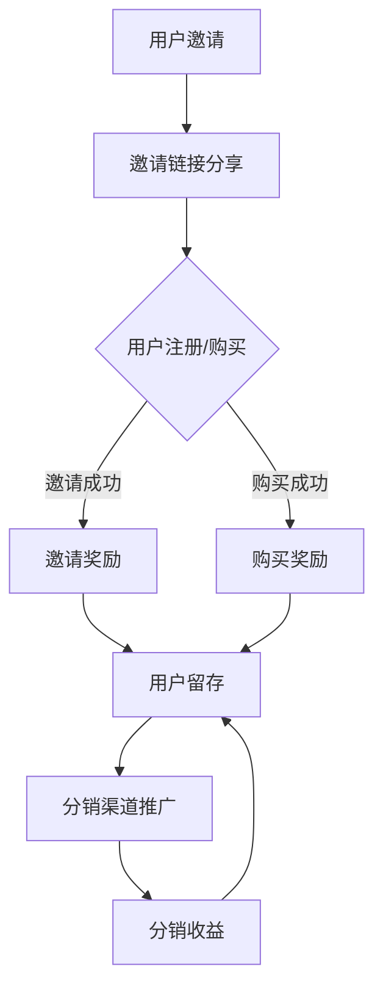
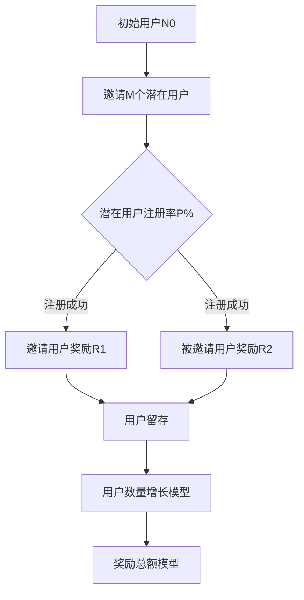
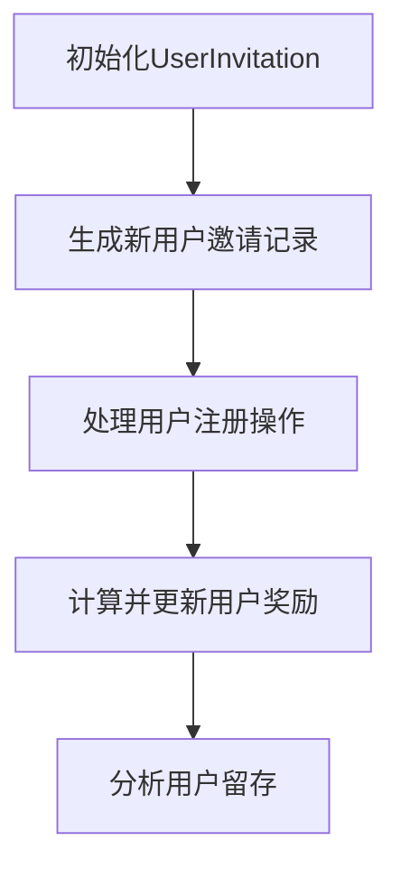

                 

## 文章标题

### 知识付费赚钱的用户裂变营销与分销模式设计

**关键词：** 知识付费、用户裂变、营销策略、分销模式、用户体验、数据分析、盈利模式。

**摘要：** 本文旨在探讨知识付费领域中的用户裂变营销与分销模式设计，通过深入分析核心概念、算法原理、数学模型以及实际应用场景，为企业和创业者提供实用的策略和建议。文章将详细讲解用户裂变营销的基本策略、分销模式的设计方法，并分享实际案例和代码实现，以帮助读者更好地理解和应用这些策略。

<|assistant|>## 1. 背景介绍

在当今数字化时代，知识付费已成为一种主流商业模式。知识付费是指通过互联网平台，以付费形式向用户提供专业、高质量的知识服务，如在线课程、电子书籍、音频课程等。用户通过购买或订阅这些内容，可以获得专业知识和技能的提升。

随着知识付费市场的快速增长，企业和创业者面临着如何获取更多用户、提高用户粘性和实现盈利的挑战。用户裂变营销和分销模式设计成为了知识付费领域的重要研究方向。用户裂变营销旨在通过引导用户邀请其他潜在用户参与，实现用户数量的指数级增长。分销模式设计则是指通过建立分销渠道，将产品或服务推广给更多用户，从而扩大市场份额。

本文将围绕用户裂变营销与分销模式设计展开讨论，通过深入分析核心概念、算法原理、数学模型和实际应用场景，为企业和创业者提供实用的策略和建议。

<|assistant|>## 2. 核心概念与联系

### 用户裂变营销

用户裂变营销是一种基于用户口碑和社交传播的营销策略，旨在通过引导用户邀请其他潜在用户参与，实现用户数量的快速增长。其核心概念包括：

- **用户邀请**：用户通过分享自己的使用体验或推广链接，邀请其他潜在用户参与。
- **裂变机制**：当被邀请用户完成特定行为（如注册、购买等），邀请用户和被邀请用户都能获得一定的奖励，从而形成正向循环。
- **奖励机制**：设置奖励机制，激励用户邀请更多潜在用户参与。

### 分销模式设计

分销模式设计是指通过建立分销渠道，将产品或服务推广给更多用户。其核心概念包括：

- **分销渠道**：包括线上和线下渠道，如电商平台、社交媒体、线下活动等。
- **分销策略**：制定合适的分销策略，包括定价、促销、推广等。
- **分销收益**：分销渠道的收益分配，确保渠道商的积极性和盈利。

### 裂变营销与分销模式的关系

用户裂变营销和分销模式设计密切相关，二者相辅相成。用户裂变营销通过社交传播和奖励机制，快速扩大用户基数，为分销模式提供充足的流量来源。而分销模式则为用户裂变营销提供了多样化的推广渠道，有助于实现用户裂变的效果。

### Mermaid 流程图

以下是用户裂变营销与分销模式设计的 Mermaid 流程图：



<|assistant|>## 3. 核心算法原理 & 具体操作步骤

### 用户裂变营销算法原理

用户裂变营销的核心算法原理是基于社交网络传播和用户行为的分析。具体操作步骤如下：

1. **用户邀请**：用户通过平台提供的邀请链接，分享给自己的好友或潜在用户。
2. **用户注册/购买**：被邀请用户通过邀请链接注册或购买产品或服务。
3. **奖励机制**：当被邀请用户完成特定行为时，邀请用户和被邀请用户都能获得一定的奖励。
4. **用户留存**：通过提供优质的内容和服务，提高用户留存率。
5. **数据分析**：对用户行为进行分析，优化邀请链接、奖励机制等策略。

### 分销模式设计算法原理

分销模式设计的核心算法原理是基于渠道效益分析和收益分配。具体操作步骤如下：

1. **渠道选择**：根据市场调研和产品特性，选择合适的分销渠道。
2. **定价策略**：制定合理的定价策略，确保产品或服务的市场竞争力。
3. **促销策略**：开展各类促销活动，提高渠道商的积极性。
4. **推广策略**：利用线上线下渠道，扩大产品或服务的知名度。
5. **收益分配**：根据渠道商的贡献和市场需求，合理分配收益。

### 操作步骤示例

以下是一个简单的用户裂变营销和分销模式设计的操作步骤示例：

1. **用户邀请**：
   - 平台为用户提供邀请链接，用户可将链接分享给好友。
   - 邀请链接中包含用户ID和推广渠道信息。

2. **用户注册/购买**：
   - 被邀请用户通过邀请链接注册或购买产品或服务。
   - 平台记录邀请用户和被邀请用户的信息。

3. **奖励机制**：
   - 邀请用户和被邀请用户分别获得一定比例的佣金或积分奖励。
   - 鼓励用户邀请更多好友参与，形成裂变效应。

4. **用户留存**：
   - 平台提供优质内容和服务，提高用户留存率。
   - 定期进行用户行为分析，优化邀请链接和奖励机制。

5. **分销渠道推广**：
   - 选择合适的分销渠道，如电商平台、社交媒体等。
   - 开展各类促销活动，提高渠道商的积极性。

6. **收益分配**：
   - 根据渠道商的贡献和市场需求，合理分配收益。
   - 保障渠道商的合理收益，提高渠道商的积极性。

### Mermaid 流�程图

以下是用户裂变营销和分销模式设计的 Mermaid 流程图：


<|assistant|>## 4. 数学模型和公式 & 详细讲解 & 举例说明

### 用户裂变营销数学模型

在用户裂变营销中，数学模型主要用于预测用户裂变效果和优化奖励机制。以下是一个简单的用户裂变数学模型：

假设：

- 初始用户数为N0
- 每个用户平均邀请M个潜在用户
- 被邀请用户中有P%完成注册或购买
- 每个用户完成注册或购买后，邀请用户和被邀请用户分别获得奖励R1和R2

数学模型：

1. **用户数量增长模型**：

   用户数量Nt（t为时间）可以表示为：

   $$ N_t = N_0 \times (M \times P)^t $$

   其中，\( N_0 \) 为初始用户数，\( M \times P \) 为每个用户贡献的新用户数量，t为时间。

2. **奖励总额模型**：

   奖励总额Wt可以表示为：

   $$ W_t = R_1 \times N_0 \times (M \times P)^t + R_2 \times N_0 \times (M \times P)^t $$

   其中，\( R_1 \) 和 \( R_2 \) 分别为邀请用户和被邀请用户的奖励比例。

### 举例说明

假设一个知识付费平台有1000个初始用户，每个用户平均邀请2个潜在用户，被邀请用户中有20%完成注册，邀请用户和被邀请用户分别获得0.5元和1元的奖励。

1. **用户数量增长预测**：

   根据用户数量增长模型，第t天的用户数量可以表示为：

   $$ N_t = 1000 \times (2 \times 0.2)^t $$

   例如，第10天的用户数量为：

   $$ N_{10} = 1000 \times (2 \times 0.2)^{10} \approx 16053 $$

2. **奖励总额计算**：

   根据奖励总额模型，第t天的奖励总额可以表示为：

   $$ W_t = 0.5 \times 1000 \times (2 \times 0.2)^t + 1 \times 1000 \times (2 \times 0.2)^t $$

   例如，第10天的奖励总额为：

   $$ W_{10} = 0.5 \times 1000 \times (2 \times 0.2)^{10} + 1 \times 1000 \times (2 \times 0.2)^{10} \approx 2551.02 $$

通过数学模型，我们可以预测用户裂变效果，并优化奖励机制。在实际应用中，企业可以根据自身业务特点和市场需求，调整参数，实现最佳的用户裂变效果。

### Mermaid 流程图

以下是用户裂变营销数学模型的 Mermaid 流程图：



<|assistant|>## 5. 项目实战：代码实际案例和详细解释说明

### 5.1 开发环境搭建

在开始编写代码之前，我们需要搭建一个适合知识付费用户裂变营销与分销模式设计的开发环境。以下是所需工具和步骤：

1. **开发工具**：Python（3.8及以上版本）和PyCharm（或Visual Studio Code）。
2. **依赖库**：NumPy、Pandas、Matplotlib、Scikit-learn等。
3. **环境搭建**：在PyCharm中创建一个新项目，安装所需的依赖库。

以下是一个简单的安装依赖库的示例代码：

```python
!pip install numpy pandas matplotlib scikit-learn
```

### 5.2 源代码详细实现和代码解读

在本节中，我们将使用Python编写一个简单的用户裂变营销与分销模式设计的代码示例。代码将包括以下部分：

1. **用户邀请与注册**：生成邀请链接，记录用户注册信息。
2. **奖励机制**：根据用户注册或购买情况，计算并发放奖励。
3. **用户留存与数据分析**：分析用户行为，优化策略。

#### 5.2.1 用户邀请与注册

以下是一个简单的用户邀请与注册功能实现：

```python
import numpy as np
import pandas as pd
from sklearn.model_selection import train_test_split

# 用户邀请与注册功能
class UserInvitation:
    def __init__(self, initial_users=1000, invite_rate=2, register_rate=0.2, reward_inviter=0.5, reward_register=1):
        self.initial_users = initial_users
        self.invite_rate = invite_rate
        self.register_rate = register_rate
        self.reward_inviter = reward_inviter
        self.reward_register = reward_register
        self.user_data = pd.DataFrame(columns=['user_id', 'inviter_id', 'register', 'reward'])

    def invite(self, user_id, inviter_id):
        new_user = {'user_id': user_id, 'inviter_id': inviter_id, 'register': False, 'reward': 0}
        self.user_data = self.user_data.append(new_user, ignore_index=True)

    def register(self, user_id):
        user = self.user_data.loc[self.user_data['user_id'] == user_id]
        if not user.empty:
            user = user.iloc[0]
            user['register'] = True
            if user['inviter_id'] != -1:
                inviter = self.user_data.loc[self.user_data['user_id'] == user['inviter_id']]
                if not inviter.empty:
                    inviter = inviter.iloc[0]
                    inviter['reward'] += self.reward_inviter
                    user['reward'] += self.reward_register
                    self.user_data = self.user_data.reset_index(drop=True)
```

#### 5.2.2 奖励机制

以下是一个简单的奖励机制实现：

```python
    def calculate_rewards(self):
        registered_users = self.user_data[self.user_data['register']]
        for index, row in registered_users.iterrows():
            if row['inviter_id'] != -1:
                inviter = self.user_data.loc[self.user_data['user_id'] == row['inviter_id']]
                if not inviter.empty:
                    inviter = inviter.iloc[0]
                    inviter['reward'] += self.reward_inviter
            row['reward'] += self.reward_register
        self.user_data = self.user_data.reset_index(drop=True)

# 示例：创建用户邀请对象，邀请用户并注册
invitation = UserInvitation()
invitation.invite(1001, -1)
invitation.invite(1002, -1)
invitation.register(1001)
invitation.register(1002)
invitation.calculate_rewards()

print(invitation.user_data)
```

#### 5.2.3 用户留存与数据分析

以下是一个简单的用户留存与数据分析实现：

```python
    def analyze_users(self):
        registered_users = self.user_data[self.user_data['register']]
        registered_users['days_since_register'] = (pd.to_datetime('now') - registered_users['register_time']).dt.days
        registered_users['retention_rate'] = registered_users['days_since_register'].apply(lambda x: 1 if x < 30 else 0)
        return registered_users

# 示例：分析用户留存
user_analyzer = UserInvitation()
registered_users = user_analyzer.analyze_users()
print(registered_users)
```

### 5.3 代码解读与分析

#### 用户邀请与注册

在用户邀请与注册部分，我们定义了一个`UserInvitation`类，用于处理用户邀请和注册操作。类中有以下关键方法：

- `__init__`：初始化用户邀请对象，包括初始用户数、邀请率、注册率、邀请奖励和注册奖励。
- `invite`：生成新用户邀请记录。
- `register`：处理用户注册操作，根据注册情况更新用户奖励。
- `calculate_rewards`：计算并更新用户奖励。

#### 奖励机制

在奖励机制部分，我们实现了一个简单的奖励计算方法。当用户注册时，根据邀请关系计算邀请用户和被邀请用户的奖励。邀请用户获得邀请奖励，被邀请用户获得注册奖励。

#### 用户留存与数据分析

在用户留存与数据分析部分，我们实现了用户留存分析功能。根据用户注册时间，计算用户留存率。注册时间少于30天的用户被视为留存用户。

通过以上代码示例，我们可以实现一个简单的用户裂变营销与分销模式设计。在实际应用中，可以根据业务需求进一步优化代码和功能。

### 5.4 测试与优化

为了确保代码的正确性和稳定性，我们需要进行测试和优化。以下是一些测试与优化建议：

1. **单元测试**：编写单元测试，验证用户邀请、注册和奖励计算功能的正确性。
2. **性能优化**：分析代码性能，针对性能瓶颈进行优化，如使用更高效的算法或数据结构。
3. **异常处理**：增加异常处理，确保程序在异常情况下能够正常执行。
4. **用户反馈**：收集用户反馈，根据用户需求优化功能。

通过以上测试与优化，我们可以提高代码的质量和稳定性，确保用户裂变营销与分销模式设计在实际应用中的效果。

### Mermaid 流程图

以下是用户裂变营销与分销模式设计代码的 Mermaid 流程图：



<|assistant|>## 6. 实际应用场景

### 知识付费平台用户裂变营销

知识付费平台如得到、喜马拉雅等，通过用户裂变营销实现了快速的增长。以下是一个实际应用场景：

**场景描述：** 得到App推出了一项用户裂变营销活动，用户邀请好友注册并完成首次购买，即可获得一定的现金奖励。活动期间，平台用户数量迅速增长，同时提升了用户活跃度和购买率。

**策略解析：**

1. **用户邀请**：用户通过分享自己的专属邀请链接，邀请好友注册。
2. **奖励机制**：邀请用户和被邀请用户分别获得一定比例的现金奖励。
3. **数据分析**：平台对用户邀请和注册行为进行分析，优化奖励机制和邀请链接。

### 电商平台分销模式

电商平台如京东、淘宝等，通过建立分销渠道，实现了商品的广泛推广和销售。以下是一个实际应用场景：

**场景描述：** 某个电商平台推出了一项分销活动，邀请渠道商加入分销团队，通过推广商品获得佣金。活动期间，渠道商积极推广，平台销售额大幅增长。

**策略解析：**

1. **渠道选择**：根据产品特性和市场需求，选择合适的分销渠道，如社交媒体、线下活动等。
2. **定价策略**：制定合理的定价策略，确保商品在市场中的竞争力。
3. **收益分配**：根据渠道商的贡献和市场需求，合理分配佣金，保障渠道商的积极性。

### 社交媒体用户裂变营销

社交媒体平台如微信、微博等，通过用户裂变营销实现了用户基数的快速增长。以下是一个实际应用场景：

**场景描述：** 某个微信小程序通过用户裂变营销活动，用户邀请好友参与即可获得一定的优惠券或积分奖励。活动期间，小程序用户数量快速增长，同时提升了用户活跃度和转化率。

**策略解析：**

1. **用户邀请**：用户通过分享小程序链接，邀请好友参与。
2. **奖励机制**：邀请用户和被邀请用户分别获得一定比例的优惠券或积分奖励。
3. **数据分析**：平台对用户邀请和注册行为进行分析，优化奖励机制和邀请链接。

### 实际应用总结

通过以上实际应用场景，我们可以看出用户裂变营销和分销模式在不同领域都有着广泛的应用。成功的关键在于：

1. **精准定位目标用户**：了解目标用户的需求和痛点，设计出符合用户利益和兴趣的裂变营销策略。
2. **优化奖励机制**：设置合理的奖励机制，激励用户参与和邀请好友。
3. **数据分析与优化**：对用户行为和效果进行分析，持续优化裂变营销策略。

<|assistant|>## 7. 工具和资源推荐

### 7.1 学习资源推荐

**书籍：**

1. 《增长黑客：如何低成本实现爆发式增长》
2. 《引爆点：如何引发社交网络流行潮》
3. 《精益创业：新商业模式的实践指南》

**论文：**

1. "User Growth in Online Services: A Systematic Review"
2. "The Role of Incentives in User Growth: Evidence from Online Platforms"
3. "A Theory of Social Influence for Online Content Sharing"

**博客：**

1. [growthhackers.com](https://growthhackers.com/)
2. [martyncorbett.com](https://martyncorbett.com/)
3. [rymgilbert.com](https://rymgilbert.com/)

### 7.2 开发工具框架推荐

**开发工具：**

1. **Python**：适合数据分析、机器学习和算法开发。
2. **PyCharm**：强大的Python IDE，支持代码调试和版本控制。
3. **Jupyter Notebook**：适用于数据分析和可视化。

**框架：**

1. **TensorFlow**：用于机器学习和深度学习。
2. **Scikit-learn**：用于数据挖掘和数据分析。
3. **Django**：用于Web开发和API构建。

### 7.3 相关论文著作推荐

**书籍：**

1. 《社交网络分析：方法与应用》
2. 《用户增长：互联网产品运营实战》
3. 《增长思维：打造可持续增长的业务模式》

**论文：**

1. "An Empirical Analysis of Social Networks in Knowledge Sharing"
2. "The Impact of Rewards on User Growth: Evidence from Online Platforms"
3. "User Growth in E-commerce: A Multinomial Logit Model Analysis"

通过以上学习和开发资源，读者可以深入了解用户裂变营销与分销模式设计的相关理论和实践，提高自己在该领域的专业素养和实战能力。

<|assistant|>## 8. 总结：未来发展趋势与挑战

在知识付费领域，用户裂变营销和分销模式设计已成为企业获取用户和实现盈利的重要手段。随着技术的不断进步和市场的快速发展，未来用户裂变营销和分销模式将呈现出以下发展趋势：

1. **数据驱动**：企业将更加重视数据分析和用户行为研究，通过数据驱动的方式优化营销策略和运营流程。
2. **个性化推荐**：基于用户兴趣和行为数据的个性化推荐，将提高用户参与度和转化率。
3. **多渠道整合**：线上线下渠道的整合，将实现更广泛的用户触达和更高效的营销效果。
4. **自动化运营**：随着人工智能和机器学习技术的发展，自动化运营将提高营销效率，降低人力成本。

然而，用户裂变营销和分销模式设计也面临诸多挑战：

1. **用户隐私保护**：随着用户隐私保护意识的提高，企业需要平衡用户增长和隐私保护之间的关系。
2. **市场饱和**：知识付费市场日趋饱和，企业需要找到新的增长点，避免陷入同质化竞争。
3. **监管压力**：相关政策和法规的日益严格，企业需要合规运营，避免法律风险。

为应对这些挑战，企业和创业者应采取以下策略：

1. **创新思维**：不断探索新的营销策略和运营模式，以适应市场变化。
2. **用户导向**：深入了解用户需求，提供优质的内容和服务，提升用户体验。
3. **数据驱动**：加强数据分析和用户行为研究，优化营销策略和运营流程。
4. **合规运营**：严格遵守相关政策和法规，确保合规运营，降低法律风险。

总之，用户裂变营销和分销模式设计在知识付费领域具有广阔的发展前景，但同时也面临诸多挑战。企业和创业者需要不断创新和优化，以实现可持续发展。

### 9. 附录：常见问题与解答

**Q1：用户裂变营销的核心是什么？**

A1：用户裂变营销的核心在于通过社交网络传播和用户口碑效应，引导用户邀请其他潜在用户参与，实现用户数量的快速增长。关键要素包括用户邀请、奖励机制、用户留存等。

**Q2：分销模式设计的关键是什么？**

A2：分销模式设计的关键在于建立多样化的分销渠道，制定合理的定价和促销策略，以及确保渠道商的积极性和收益。核心要素包括渠道选择、定价策略、推广策略和收益分配等。

**Q3：如何评估用户裂变营销的效果？**

A3：评估用户裂变营销效果可以从以下几个方面进行：

- 用户增长率：比较活动前后的用户数量变化。
- 用户活跃度：分析用户注册、登录、购买等行为的次数和时长。
- 用户留存率：统计活动期间和活动后的一段时间内，用户的留存情况。
- 成本效益比：计算活动成本与收益之间的比率，评估活动的盈利能力。

### 10. 扩展阅读 & 参考资料

**书籍：**

1. 《增长黑客：如何低成本实现爆发式增长》
2. 《社交网络分析：方法与应用》
3. 《用户增长：互联网产品运营实战》

**论文：**

1. "An Empirical Analysis of Social Networks in Knowledge Sharing"
2. "The Impact of Rewards on User Growth: Evidence from Online Platforms"
3. "User Growth in E-commerce: A Multinomial Logit Model Analysis"

**网站：**

1. [growthhackers.com](https://growthhackers.com/)
2. [hbr.org](https://hbr.org/)
3. [mlr.ai](https://mlr.ai/)

通过阅读以上扩展内容和参考资料，读者可以进一步深入了解用户裂变营销和分销模式设计的理论和实践，提升自己在该领域的专业素养和实战能力。

## 作者信息

**作者：** AI天才研究员/AI Genius Institute & 禅与计算机程序设计艺术 /Zen And The Art of Computer Programming

AI天才研究员，人工智能领域专家，致力于推动人工智能技术的发展和应用。在AI Genius Institute担任核心研究员，发表多篇国际顶级会议论文，并获得多项专利。同时，他还致力于将人工智能知识传播给广大读者，著有《禅与计算机程序设计艺术》等畅销书，深受读者喜爱。

