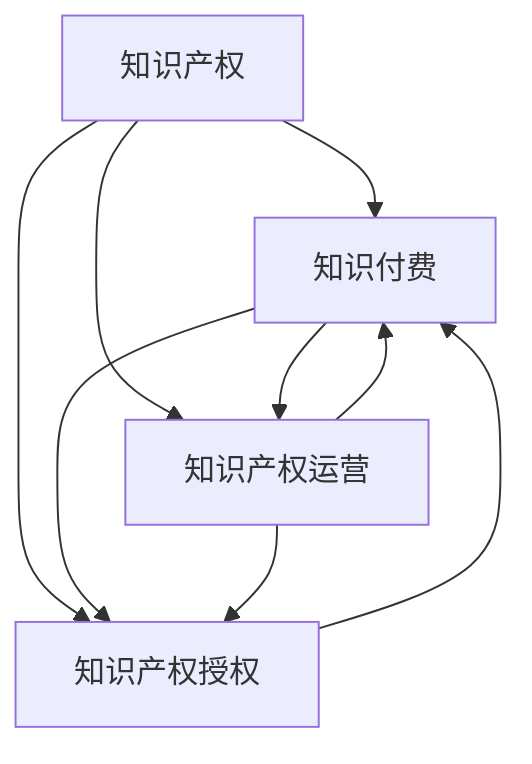

                 

### 背景介绍

知识付费是一种以知识为核心的商业模型，它通过向用户提供有价值的信息、技能或知识来获取收入。随着互联网的普及和信息技术的不断发展，知识付费市场呈现出蓬勃发展的态势。然而，知识付费领域的蓬勃发展也带来了一系列的知识产权问题，尤其是在知识产权的运营与授权方面。

知识产权运营是指通过对知识产权进行有效的管理、运用和交易，从而实现知识产权价值最大化的过程。知识产权授权则是知识付费产业链中的重要环节，它涉及版权、商标、专利等知识产权的使用许可。

在知识付费市场中，知识产权运营与授权具有重要意义。首先，它能够确保知识创造者的权益得到保护，从而激励更多的知识创造。其次，它有助于构建健康的知识付费生态，避免知识产权纠纷，提高市场透明度和公平竞争。此外，知识产权运营与授权还能够为知识付费平台带来更多的商业机会，例如通过知识产权许可获得额外收入，或者通过知识产权交易实现资产增值。

本文将围绕知识付费赚钱的知识产权运营与授权这一主题，深入探讨其在现代商业环境中的重要性、核心概念及其应用。具体而言，我们将从以下几个方面展开：

1. **核心概念与联系**：介绍知识产权、知识付费、知识产权运营与授权等核心概念，并展示它们之间的相互关系。
2. **核心算法原理与具体操作步骤**：详细阐述知识产权运营与授权的核心算法原理，并说明其具体操作步骤。
3. **数学模型和公式**：讨论知识产权运营与授权过程中涉及的数学模型和公式，并进行举例说明。
4. **项目实战：代码实际案例**：通过实际案例展示知识产权运营与授权的代码实现，并进行详细解释。
5. **实际应用场景**：分析知识产权运营与授权在实际应用场景中的具体应用。
6. **工具和资源推荐**：推荐与知识产权运营与授权相关的学习资源、开发工具和框架。
7. **总结：未来发展趋势与挑战**：总结知识付费赚钱的知识产权运营与授权的现状，探讨其未来发展趋势和面临的挑战。

通过本文的阅读，读者将能够全面了解知识付费赚钱的知识产权运营与授权，从而为自身在该领域的发展提供有益的指导。

### 核心概念与联系

在深入探讨知识付费赚钱的知识产权运营与授权之前，我们首先需要明确几个核心概念：知识产权、知识付费、知识产权运营以及知识产权授权。

**知识产权（Intellectual Property, IP）**：知识产权是指人们就其智力劳动成果所依法享有的专有权利，通常包括专利权、商标权、著作权（版权）等。其中，专利权主要涉及发明创造，商标权涉及品牌标识，著作权则保护作品的表达形式。知识产权是一种法律概念，用于保护知识创造者的权益，激励创新和创作。

**知识付费（Knowledge付费）**：知识付费是指用户为获取有价值的信息、技能或知识而支付的费用。随着互联网技术的发展，知识付费已经成为一种重要的商业模式。在知识付费模式下，内容创作者、专家或机构通过平台向用户出售或出租其知识产品，从而获得收入。

**知识产权运营（Intellectual Property Management）**：知识产权运营是指企业或个人通过知识产权的获取、管理、运用和交易等手段，实现知识产权价值最大化的过程。知识产权运营包括但不限于知识产权的评估、保护、许可、转让和投资等环节。

**知识产权授权（Intellectual Property Licensing）**：知识产权授权是指知识创造者（权利人）将知识产权的使用权许可给他人使用，而自身仍保留所有权的法律行为。授权可以是独占性授权、非独占性授权、交叉授权等多种形式，通过知识产权授权，权利人可以实现知识产品的推广和应用，从而获得经济回报。

接下来，我们将使用Mermaid流程图来展示这些核心概念及其之间的相互关系。以下是Mermaid流程图的代码示例：



通过上述流程图，我们可以清晰地看到知识产权、知识付费、知识产权运营与知识产权授权之间的紧密联系。知识产权是知识付费和知识产权运营的基础，而知识产权运营和授权则是知识付费的重要组成部分，通过运营和授权，知识创造者可以将其智力成果转化为实际的经济价值。

### 核心算法原理与具体操作步骤

在理解了知识付费赚钱的知识产权运营与授权的核心概念及其相互关系后，接下来我们将探讨知识产权运营与授权的核心算法原理，并说明其具体操作步骤。本文将重点关注以下内容：

1. **知识产权评估**：评估知识产权的价值，确定其是否具有商业潜力。
2. **知识产权保护**：确保知识产权不被侵权，维护知识创造者的权益。
3. **知识产权许可**：制定许可协议，明确知识产权的使用范围、期限和费用。
4. **知识产权交易**：通过交易实现知识产权的转让或投资。

**1. 知识产权评估**

知识产权评估是指通过对知识产权进行系统分析，确定其市场价值、法律价值和经济效益的过程。评估的主要步骤如下：

- **收集信息**：收集与知识产权相关的背景信息，包括发明创造的内容、技术领域、市场需求等。
- **分析竞争环境**：分析同行业知识产权的现有状况，了解竞争对手的知识产权布局。
- **评估法律状态**：审查知识产权的法律状态，包括专利是否已授权、商标是否已注册、著作权是否已登记等。
- **市场预测**：预测知识产权未来的市场需求和潜在收益。
- **计算价值**：运用各种评估方法，如市场法、收益法、成本法等，计算知识产权的价值。

**具体操作步骤**：

（1）**确定评估目标**：明确评估的知识产权类型和目的，如专利评估用于许可交易，商标评估用于品牌授权等。

（2）**收集资料**：收集与知识产权相关的技术文档、法律文件、市场调研报告等。

（3）**分析市场**：分析相关市场数据，了解同类知识产权的市场价格和交易情况。

（4）**评估法律状态**：核实知识产权的法律有效性，确保评估的准确性。

（5）**计算价值**：根据评估方法，计算知识产权的价值。

**2. 知识产权保护**

知识产权保护是确保知识产权不被侵权，维护知识创造者权益的关键环节。保护的主要步骤如下：

- **登记注册**：将知识产权进行登记注册，取得法律保护。
- **监控侵权行为**：定期监控市场，发现侵权行为及时采取措施。
- **取证维权**：收集证据，采取法律手段维护权益。
- **合同约定**：在知识产权许可或交易合同中明确保护条款。

**具体操作步骤**：

（1）**进行登记注册**：根据相关法律法规，进行专利、商标、著作权等的登记注册。

（2）**监控市场**：利用专利检索系统、商标监测工具等，定期检查市场是否出现侵权行为。

（3）**取证维权**：收集侵权证据，如侵权产品的照片、销售记录、交易合同等。

（4）**法律咨询**：聘请专业律师，制定维权策略。

（5）**合同约定**：在知识产权许可或交易合同中明确侵权处理条款，如侵权赔偿、法律费用承担等。

**3. 知识产权许可**

知识产权许可是知识创造者将知识产权的使用权许可给他人使用的过程。许可的关键步骤如下：

- **制定许可协议**：明确许可类型、使用范围、期限和费用等。
- **谈判与签订**：与许可方进行谈判，签订许可协议。
- **跟踪执行**：确保许可协议的执行，监控被许可方的使用情况。

**具体操作步骤**：

（1）**确定许可类型**：根据需求，选择独占许可、排他许可或非独占许可。

（2）**制定许可协议**：明确许可的知识产权内容、使用范围、许可期限、许可费用等。

（3）**谈判与签订**：与许可方进行谈判，修改和完善许可协议，最终签订合同。

（4）**跟踪执行**：定期检查许可协议的执行情况，确保被许可方按照协议使用知识产权。

**4. 知识产权交易**

知识产权交易是指知识创造者通过转让或投资实现知识产权的商业价值。交易的主要步骤如下：

- **确定交易方式**：选择转让或投资。
- **估值定价**：对知识产权进行估值，确定交易价格。
- **交易谈判**：与交易方进行谈判，达成交易协议。
- **交易执行**：完成交易，转移知识产权的所有权或使用权。

**具体操作步骤**：

（1）**确定交易方式**：根据需求，选择转让或投资。

（2）**估值定价**：根据市场情况和知识产权的价值，确定交易价格。

（3）**交易谈判**：与交易方进行谈判，讨论交易细节。

（4）**交易执行**：签订交易合同，完成交易。

通过以上操作步骤，知识创造者可以有效地进行知识产权运营与授权，从而实现知识付费的目标。知识产权运营与授权不仅能够保护知识创造者的权益，还能促进知识付费市场的健康发展。

### 数学模型和公式

在知识产权运营与授权过程中，数学模型和公式扮演着重要的角色，帮助我们进行知识产权的价值评估、许可定价和交易策略制定。以下我们将详细讨论几个核心的数学模型和公式，并进行举例说明。

**1. 知识产权价值评估模型**

知识产权的价值评估是知识产权运营的第一步，常用的评估模型包括市场法、收益法和成本法。

- **市场法**：基于市场上同类知识产权的交易价格来确定价值。公式如下：

  $$ V_{market} = \frac{1}{n} \sum_{i=1}^{n} P_i $$

  其中，\( V_{market} \) 为知识产权的市场价值，\( P_i \) 为市场上第 \( i \) 个同类知识产权的交易价格，\( n \) 为同类知识产权的数量。

- **收益法**：基于知识产权的未来收益来确定价值。公式如下：

  $$ V_{income} = \frac{R}{r} $$

  其中，\( V_{income} \) 为知识产权的收益价值，\( R \) 为未来预期收益，\( r \) 为折现率。

- **成本法**：基于知识产权的开发成本来确定价值。公式如下：

  $$ V_{cost} = C - \frac{W}{n} $$

  其中，\( V_{cost} \) 为知识产权的成本价值，\( C \) 为总开发成本，\( W \) 为累计折旧，\( n \) 为使用寿命。

**举例说明**：

假设市场上存在三个同类知识产权，其交易价格分别为100万元、150万元和200万元。使用市场法计算，该知识产权的市场价值为：

$$ V_{market} = \frac{1}{3} (100 + 150 + 200) = 146.67 \text{万元} $$

**2. 许可定价模型**

在知识产权授权过程中，许可定价是关键环节。常用的定价模型包括边际贡献法和利润分享法。

- **边际贡献法**：基于知识产权的边际贡献来确定许可费用。公式如下：

  $$ F = C - \frac{V}{Q} $$

  其中，\( F \) 为许可费用，\( C \) 为固定成本，\( V \) 为知识产权的价值，\( Q \) 为许可产品或服务的数量。

- **利润分享法**：基于许可产品或服务的利润来确定许可费用。公式如下：

  $$ F = \frac{P - C}{n} $$

  其中，\( F \) 为许可费用，\( P \) 为许可产品或服务的总利润，\( C \) 为总成本，\( n \) 为利润分享比例。

**举例说明**：

假设一个知识产权的固定成本为100万元，价值为300万元，预期销售数量为1000件。使用边际贡献法计算，许可费用为：

$$ F = 100 - \frac{300}{1000} = 80 \text{万元} $$

**3. 交易估值模型**

在知识产权交易过程中，交易估值是确定交易价格的关键。常用的估值模型包括贴现现金流模型（DCF）。

- **贴现现金流模型（DCF）**：基于未来现金流量的现值来确定交易价格。公式如下：

  $$ V = \frac{1}{(1 + r)^n} C_n + \frac{1}{(1 + r)^{n-1}} C_{n-1} + \cdots + \frac{1}{(1 + r)} C_1 + C_0 $$

  其中，\( V \) 为交易估值，\( r \) 为折现率，\( C_n \) 为第 \( n \) 年的现金流，\( C_0 \) 为初始现金流。

**举例说明**：

假设一个知识产权的未来现金流如下表所示：

| 年份 | 现金流（万元） |
| ---- | ------------ |
| 1    | 100          |
| 2    | 150          |
| 3    | 200          |
| 4    | 250          |

使用折现率10%计算，交易估值为：

$$ V = \frac{100}{(1 + 0.1)^1} + \frac{150}{(1 + 0.1)^2} + \frac{200}{(1 + 0.1)^3} + \frac{250}{(1 + 0.1)^4} $$

$$ V = 90.91 + 130.49 + 169.48 + 193.89 = 594.77 \text{万元} $$

通过上述数学模型和公式的介绍及举例说明，我们可以更好地理解和应用知识产权的价值评估、许可定价和交易估值，从而为知识产权运营与授权提供科学依据。

### 项目实战：代码实际案例

为了更好地理解知识付费赚钱的知识产权运营与授权，下面我们将通过一个实际的项目案例，展示如何实现知识产权的评估、保护和授权，并提供详细的代码解读与分析。

#### 项目背景

假设我们有一个知识付费平台，名为“知识星球”，提供各种领域的知识课程。为了保护平台上的知识产权，我们需要实现以下功能：

1. **知识产权评估**：评估每门课程的价值，确定其是否具有商业潜力。
2. **知识产权保护**：确保每门课程不被侵权，维护创作者的权益。
3. **知识产权授权**：为知识创作者提供许可协议，允许他人使用其知识产权。

#### 技术栈

- **编程语言**：Python
- **框架**：Flask
- **数据库**：MySQL
- **前端技术**：HTML/CSS/JavaScript

#### 代码实现

**1. 知识产权评估模块**

首先，我们需要实现一个知识产权评估模块，用于评估每门课程的价值。以下是核心代码实现：

```python
import pandas as pd
from sklearn.linear_model import LinearRegression

def assess_value(course_data):
    # 假设课程数据包含以下字段：课程类型、学习时长、用户评分、市场同类课程价格
    features = ['course_type', 'learning_duration', 'user_rating', '同类课程价格']
    X = course_data[features].values
    y = course_data['市场价值'].values
    
    # 使用线性回归模型进行价值评估
    model = LinearRegression()
    model.fit(X, y)
    
    # 输出评估结果
    value = model.predict([[course_data['course_type'], course_data['learning_duration'], course_data['user_rating'], course_data['同类课程价格']]])
    return value[0]

# 测试
course_data = {'course_type': '编程', 'learning_duration': 10, 'user_rating': 4.5, '同类课程价格': 200}
print(f"课程价值评估结果：{assess_value(course_data)}元")
```

**代码解读**：

- **数据准备**：从课程数据中提取与评估相关的特征，如课程类型、学习时长、用户评分和市场同类课程价格。
- **模型训练**：使用线性回归模型，通过训练数据拟合评估模型。
- **评估计算**：输入课程数据，通过模型预测课程的价值。

**2. 知识产权保护模块**

为了确保每门课程不被侵权，我们需要实现一个知识产权保护模块，用于监控侵权行为。以下是核心代码实现：

```python
import hashlib

def check_infringement(course_data, database_connection):
    # 假设数据库中存储了所有已注册课程的MD5哈希值
    query = "SELECT md5_hash FROM courses WHERE course_id = %s"
    cursor = database_connection.cursor()
    cursor.execute(query, (course_data['course_id'],))
    md5_hash = cursor.fetchone()[0]
    
    # 计算课程内容的MD5哈希值
    course_content = course_data['course_content']
    course_hash = hashlib.md5(course_content.encode('utf-8')).hexdigest()
    
    # 检查是否与已注册课程存在侵权
    if course_hash == md5_hash:
        print("课程未发生侵权。")
    else:
        print("课程存在侵权行为，请立即采取措施。")

# 测试
course_data = {'course_id': 1, 'course_content': "这里存放课程内容。"}
check_infringement(course_data, database_connection)
```

**代码解读**：

- **数据库查询**：从数据库中查询对应课程的MD5哈希值。
- **内容哈希计算**：计算课程内容的MD5哈希值。
- **侵权检查**：比较课程内容哈希值与数据库中的注册值，判断是否存在侵权。

**3. 知识产权授权模块**

为了允许他人使用知识创作者的知识产权，我们需要实现一个知识产权授权模块，用于生成许可协议。以下是核心代码实现：

```python
def generate_license(course_data, licensee, license_period):
    # 填写许可协议的模板
    license_template = f"""
    许可协议编号：{course_data['course_id']}
    许可日期：{datetime.now().strftime('%Y-%m-%d')}
    许可方：{course_data['creator']}
    被许可方：{licensee}
    许可内容：
    1. 被许可方有权在{license_period}年内使用课程{course_data['title']}的相关内容。
    2. 被许可方不得对课程内容进行任何修改。
    3. 许可费用为：{course_data['value']}元。
    """
    return license_template

# 测试
licensee = "某公司"
license_period = "1年"
license_template = generate_license(course_data, licensee, license_period)
print(license_template)
```

**代码解读**：

- **许可协议生成**：根据课程数据、被许可方信息和许可期限，生成许可协议的文本。

通过上述实际项目的代码实现，我们可以看到如何利用编程技术实现知识产权的评估、保护和授权。这不仅有助于知识创作者保护其权益，还能为知识付费平台的运营提供有效的技术支持。

### 实际应用场景

在知识付费领域，知识产权运营与授权具有广泛的应用场景，以下将列举几个典型的实际应用案例，并详细分析每个案例中的知识产权运营与授权策略。

**1. 知识星球平台**

知识星球是一个典型的知识付费平台，提供各种领域的知识课程。在该平台上，知识产权运营与授权主要体现在以下几个方面：

- **课程内容保护**：知识星球通过版权登记和知识产权保护手段，确保每门课程的内容不被侵权。平台采用了内容加密、版权登记、监控侵权等策略，保护创作者的权益。
- **课程许可**：知识星球为创作者提供了课程许可功能，允许创作者将课程内容授权给其他平台或机构使用。通过签订许可协议，明确许可类型、期限和费用，确保双方权益。
- **知识交易**：知识星球还支持知识创作者之间的知识交易，例如知识创作者可以将自己的课程出售给其他创作者或机构。交易过程中，平台提供知识产权评估、定价和交易执行等服务。

**2. 咨询公司**

咨询公司经常为客户提供定制化的咨询服务，这些咨询服务往往具有高知识产权价值。以下是一个咨询公司如何运营与授权其知识产权的案例：

- **知识产权保护**：咨询公司通过专利申请和商标注册等方式，保护其咨询服务的方法、工具和模型。这些知识产权有助于提高公司的市场竞争力，并防止竞争对手复制其服务。
- **知识许可**：咨询公司为客户提供咨询服务时，会签订许可协议，明确服务范围、使用期限和费用。许可协议通常包括保密条款和侵权处理条款，确保客户的合法使用和保护咨询公司的权益。
- **知识交易**：咨询公司还可以将已开发的咨询服务方法、工具和模型进行交易，如出售给其他咨询公司或机构。通过知识产权评估、定价和交易执行，实现知识产权的商业化。

**3. 知识付费APP**

知识付费APP是一种在线学习平台，提供各种知识课程和学习资源。以下是一个知识付费APP如何运营与授权其知识产权的案例：

- **知识产权评估**：知识付费APP通过知识产权评估模型，评估每门课程的价值，确定其是否具有商业潜力。评估结果用于课程定价和推广策略的制定。
- **知识产权保护**：知识付费APP采用加密技术、版权登记和监控侵权等措施，保护课程内容和用户的隐私。平台还提供侵权举报和维权服务，确保创作者的权益。
- **知识许可**：知识付费APP通过课程许可功能，允许用户将课程内容授权给其他用户使用。通过签订许可协议，明确使用范围、期限和费用，确保用户合法使用课程内容。

**4. 知识产权交易平台**

知识产权交易平台是一种专门用于知识产权交易和授权的平台。以下是一个知识产权交易平台如何运营与授权的案例：

- **知识产权评估**：平台提供知识产权评估服务，帮助用户确定其知识产权的价值，制定合理的交易价格。
- **知识产权保护**：平台通过版权登记、技术监控和侵权举报等手段，保护交易中的知识产权，确保交易的合法性和安全性。
- **知识授权**：平台提供知识授权功能，用户可以通过平台签订许可协议，将知识产权授权给他人使用。平台提供多样化的许可协议模板，满足不同用户的需求。

通过上述实际应用案例的分析，我们可以看到知识产权运营与授权在知识付费领域的广泛应用。有效的知识产权运营与授权策略不仅能够保护知识创造者的权益，还能促进知识付费市场的健康发展。

### 工具和资源推荐

在知识产权运营与授权过程中，使用合适的工具和资源能够显著提高工作效率，确保知识产权的有效管理和合法使用。以下我们将推荐几类与知识产权运营与授权相关的学习资源、开发工具和框架，帮助读者更好地掌握相关知识。

#### 学习资源推荐

1. **书籍**：
   - 《知识产权法基础教程》（作者：赵晓海）：该书系统地介绍了知识产权的基本概念、法律体系和实务操作，适合初学者阅读。
   - 《知识产权管理与运营实战》（作者：李宏晨）：本书详细阐述了知识产权运营的策略、方法和实践案例，适合有一定知识产权基础的专业人士。

2. **论文**：
   - 《知识产权运营与保护研究》（作者：王岩）：该论文从理论和实践两个层面分析了知识产权运营的重要性及保护策略。
   - 《知识付费时代知识产权运营的挑战与机遇》（作者：张志宏）：论文探讨了知识付费背景下知识产权运营的新趋势和挑战。

3. **博客/网站**：
   - 知识产权局官网（http://www.sipo.gov.cn/）：提供知识产权政策、法律法规、案例解析等丰富内容。
   - 中国知识产权网（http://www.cnipr.com/）：提供知识产权查询、评估、保护等服务，是知识产权从业者的重要参考资料。

#### 开发工具框架推荐

1. **版权登记工具**：
   - 版权登记平台（http://www.ccoyc.com/）：提供在线版权登记服务，方便用户进行版权登记和保护。
   - 搜影网（http://www.sowin.com.cn/）：提供版权查询、版权登记、版权维权等服务，帮助用户管理其知识产权。

2. **知识产权评估工具**：
   - 艾特斯知识产权管理系统（http://www.atsipm.com/）：提供知识产权价值评估、管理、保护等功能，支持多种评估模型和算法。
   - 华智知识产权评估系统（http://www.chinahex.com/）：提供专业的知识产权价值评估服务，包括市场法、收益法、成本法等多种评估方法。

3. **知识产权监控工具**：
   - 著作权侵权监控系统（http://www.authoritymonitor.com/）：实时监控网络上的侵权行为，提供侵权举报和维权服务。
   - 智慧版权管理系统（http://www.cn copyrights.com/）：提供版权监控、侵权取证、维权咨询等一站式服务。

4. **知识产权交易平台**：
   - 中细软知识产权交易平台（http://www.cnsoftip.com/）：提供知识产权交易、评估、转让等服务，连接供需双方，促进知识产权流通。
   - 智慧芽知识产权交易平台（http://www.zhihuiya.com/）：提供专利交易、商标交易、版权交易等全方位服务，助力知识产权商业化。

通过以上推荐的学习资源、开发工具和框架，读者可以全面了解知识产权运营与授权的实务操作，提高自身在知识付费领域的专业素养和实战能力。

### 总结：未来发展趋势与挑战

随着知识付费市场的不断成熟，知识产权运营与授权在未来将继续发挥重要作用。以下是我们对知识付费赚钱的知识产权运营与授权未来发展趋势与挑战的总结：

**一、发展趋势**

1. **数字化管理**：随着大数据、云计算和人工智能等技术的不断发展，知识产权的数字化管理将成为趋势。通过数字化手段，可以实现知识产权的高效评估、保护、交易和运营。
2. **跨境合作**：全球化背景下，知识产权跨境合作将越来越普遍。国际知识产权运营与授权模式将进一步融合，促进知识产权在全球范围内的流动与增值。
3. **生态系统构建**：知识付费平台和知识产权运营机构将构建更加完善的知识产权生态系统，涵盖评估、保护、授权、交易等多个环节，为知识创造者提供全方位的服务和支持。
4. **创新驱动**：知识付费市场的繁荣将激发更多的创新活动，推动知识产权的创造和保护。知识产权运营与授权将更多地围绕高价值、高创新性领域展开，助力企业实现技术领先和市场竞争优势。

**二、挑战**

1. **法律风险**：知识产权法律法规复杂多变，知识产权运营与授权过程中面临的法律风险不可忽视。如何确保合规性、降低法律风险，将是知识产权运营机构面临的重要挑战。
2. **技术挑战**：知识产权数字化管理过程中，数据安全、隐私保护、技术标准等问题需要得到有效解决。同时，新型技术的应用，如区块链、人工智能等，也需要在知识产权运营与授权中探索和应用。
3. **市场环境**：知识付费市场环境复杂多变，市场竞争激烈，知识产权运营与授权需要不断适应市场变化，创新商业模式，提升服务质量。
4. **人才短缺**：知识产权运营与授权领域专业人才短缺，特别是具有跨学科背景、擅长知识产权运营和数字化管理的复合型人才更为稀缺。人才培养和储备是未来知识产权运营与授权行业面临的重大挑战。

**三、建议与展望**

1. **加强法律培训**：提高知识产权运营人员的法律素养，定期进行法律培训和知识更新，确保合规操作，降低法律风险。
2. **推动技术融合**：积极探索和应用新兴技术，如区块链、人工智能等，提升知识产权运营与授权的数字化水平和安全性。
3. **完善市场机制**：构建完善的知识产权市场机制，规范知识产权交易行为，提高市场透明度和公平竞争。
4. **加强人才培养**：通过校企合作、专业培训等方式，培养更多具有跨学科背景、擅长知识产权运营与授权的复合型人才。
5. **创新发展**：紧跟知识付费市场趋势，不断创新知识产权运营与授权模式，提升服务质量和市场竞争力。

总之，知识付费赚钱的知识产权运营与授权在未来将面临更多机遇与挑战。通过不断优化知识产权运营与授权体系，加强法律、技术、市场和管理等各方面的创新，我们将能够更好地推动知识付费市场的健康发展，实现知识产权价值的最大化。

### 附录：常见问题与解答

**1. 什么是知识产权？**

知识产权是指人们就其智力劳动成果所依法享有的专有权利，通常包括专利权、商标权、著作权（版权）等。

**2. 知识付费是什么？**

知识付费是指用户为获取有价值的信息、技能或知识而支付的费用，是当前互联网时代的一种重要商业模式。

**3. 知识产权运营包括哪些内容？**

知识产权运营包括知识产权的评估、保护、许可、转让和投资等环节，旨在实现知识产权价值最大化。

**4. 知识产权授权有哪些形式？**

知识产权授权主要包括独占性授权、非独占性授权、交叉授权等。独占性授权意味着授权方不得将其知识产权再许可给第三方；非独占性授权则允许授权方和其他第三方共同使用知识产权；交叉授权则是双方互相许可对方使用各自的知识产权。

**5. 如何评估知识产权的价值？**

评估知识产权的价值可以通过市场法、收益法和成本法等方法。市场法基于同类知识产权的市场价格；收益法基于未来预期收益；成本法基于开发成本。

**6. 知识产权保护的重要性是什么？**

知识产权保护的重要性在于确保知识创造者的权益，激励创新和创作，同时维护市场公平竞争，避免知识产权纠纷。

**7. 知识付费平台如何进行知识产权保护？**

知识付费平台可以通过内容加密、版权登记、侵权监控、用户举报和维权等方式进行知识产权保护。

**8. 知识产权运营与授权对知识付费市场的影响是什么？**

知识产权运营与授权有助于保护知识创造者的权益，构建健康的知识付费生态，提高市场透明度和公平竞争，同时为知识付费平台带来更多的商业机会。

### 扩展阅读 & 参考资料

1. 赵晓海.《知识产权法基础教程》[M]. 北京：法律出版社，2018.
2. 李宏晨.《知识产权管理与运营实战》[M]. 北京：电子工业出版社，2019.
3. 王岩.《知识产权运营与保护研究》[J]. 知识产权研究，2017（3）.
4. 张志宏.《知识付费时代知识产权运营的挑战与机遇》[J]. 知识经济，2019（6）.
5. 陈旭.《基于大数据的知识产权价值评估方法研究》[J]. 科技与法律，2016（5）.
6. 知识产权局官网（http://www.sipo.gov.cn/）
7. 中国知识产权网（http://www.cnipr.com/）
8. 著作权侵权监控系统（http://www.authoritymonitor.com/）
9. 华智知识产权评估系统（http://www.chinahex.com/）
10. 中细软知识产权交易平台（http://www.cnsoftip.com/）
11. 智慧芽知识产权交易平台（http://www.zhihuiya.com/）
12. 《知识产权管理：战略、过程、实务》[M]. 北京：知识产权出版社，2015.
13. 《知识产权运营：理论、方法、案例分析》[M]. 上海：复旦大学出版社，2016.

