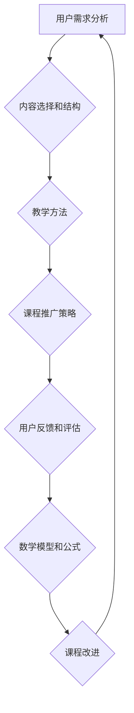

                 

### 背景介绍

在当今信息爆炸的时代，知识付费市场日益壮大，越来越多的人开始通过线上课程、电子书、直播等方式传授自己的知识和技能。与此同时，许多专业人士也希望通过设计并生产高质量的知识付费课程来获得收入。这不仅仅是一种个人创业的方式，更是将自身专业知识和经验转化为经济价值的一种途径。

本篇文章旨在探讨如何设计并生产知识付费课程，以实现有效赚钱。我们将从以下几个方面展开讨论：

1. **市场分析**：了解当前知识付费市场的需求、用户群体以及竞争对手，为课程设计提供数据支持。
2. **课程内容设计**：探讨课程内容的选择、结构和组织方式，确保课程能够满足用户需求并具有吸引力。
3. **教学方法和手段**：介绍不同的教学方法和手段，如何根据不同课程特点和用户需求来选择和调整。
4. **课程推广和营销**：分享如何有效推广课程，吸引潜在用户，并运用营销策略提高课程销量。
5. **课程评估和迭代**：讨论如何评估课程效果，收集用户反馈，不断优化课程内容和形式。

通过对这些方面的详细分析，我们希望为那些有意进军知识付费领域的专业人士提供一套完整、实用的课程设计与内容生产指南。接下来，我们将逐一探讨这些主题，以便为您在知识付费领域的成功之路奠定坚实的基础。

### 2. 核心概念与联系

在设计并生产知识付费课程的过程中，理解核心概念和它们之间的联系至关重要。以下是我们在这一部分将要讨论的一些核心概念：

#### 用户需求分析

用户需求分析是课程设计的起点。它涉及对目标受众的深入了解，包括他们的知识背景、学习目标、职业发展方向等。通过用户调研、访谈和数据分析，我们可以获得有价值的信息，为课程内容的设置提供依据。

#### 内容选择和结构

课程内容的选择直接决定了课程的价值和质量。我们需要在市场上已有的知识领域中发现缺口，或者基于自身专业优势，开发独特的课程内容。课程结构则要考虑逻辑性、系统性，确保知识点的连贯和衔接。

#### 教学方法

教学方法决定了课程的教学效果。传统的讲授式教学、案例教学、互动式教学等，各有优劣。我们需要根据课程内容和用户需求，选择最合适的教学方法，以提高学习效果和用户满意度。

#### 课程推广策略

课程推广是课程成功的关键环节。我们需要利用社交媒体、搜索引擎、电子邮件等渠道，设计有针对性的营销活动，吸引潜在用户。此外，建立个人品牌和口碑也是提高课程销量的重要手段。

#### 用户反馈和评估

用户反馈是课程改进的重要依据。通过问卷调查、用户访谈、课程回放数据等手段，我们可以了解用户对课程的满意度和改进建议，从而不断优化课程内容和形式。

#### 数学模型和公式

在某些知识付费课程中，数学模型和公式是核心内容。例如，金融、数据分析、机器学习等领域的课程，需要运用相关数学公式来解释和预测现象。熟练掌握这些数学工具，有助于我们更准确地传达知识，提高课程的学术价值。

#### Mermaid 流程图

为了更直观地展示核心概念和它们之间的联系，我们可以使用 Mermaid 流程图来表示。以下是一个简单的示例：



这个流程图展示了从用户需求分析到课程改进的完整循环，强调了各个环节之间的互动和依赖关系。通过不断迭代和优化，我们可以设计出更加优秀和实用的知识付费课程。

通过理解这些核心概念和它们之间的联系，我们能够更系统地思考课程设计的过程，从而提高课程的质量和用户满意度。在接下来的部分，我们将深入探讨这些概念的具体实现和操作步骤。

### 3. 核心算法原理 & 具体操作步骤

在知识付费课程的设计与生产过程中，核心算法原理不仅为我们提供了科学依据，还指导了具体操作步骤。以下是几个关键算法及其应用：

#### 3.1 用户需求分析算法

**算法描述**：

用户需求分析主要通过以下步骤实现：

1. **数据收集**：通过问卷调查、访谈、社交媒体分析等方式收集用户数据。
2. **数据分析**：使用数据挖掘和统计方法，分析用户需求和行为模式。
3. **需求建模**：构建用户需求模型，包括知识需求、学习目标和职业发展需求等。

**具体操作步骤**：

1. **设计问卷**：根据课程主题和目标受众，设计具有针对性的问卷，包括选择题、填空题和开放性问题。
2. **数据收集**：通过在线调查平台（如问卷星、谷歌表单等）分发问卷，收集用户反馈。
3. **数据分析**：使用数据分析工具（如 Python 的 Pandas 库）对问卷结果进行整理和分析。
4. **需求建模**：根据数据分析结果，构建用户需求模型，为课程内容设计提供依据。

**示例代码**（Python）：

```python
import pandas as pd

# 加载问卷数据
data = pd.read_excel('user_survey.xlsx')

# 数据预处理
data = data.dropna()

# 统计各选项的频率
demand_counts = data['knowledge_demand'].value_counts()

# 打印需求分布
print(demand_counts)
```

#### 3.2 内容选择和结构算法

**算法描述**：

内容选择和结构设计主要通过以下步骤实现：

1. **市场调研**：分析市场上已有课程的内容和结构，找出缺口或优势。
2. **课程规划**：根据用户需求和市场调研结果，规划课程内容和大纲。
3. **内容组织**：确保课程内容逻辑连贯、结构清晰。

**具体操作步骤**：

1. **市场调研**：使用搜索引擎、课程平台等渠道，调研市场上类似课程的内容和结构。
2. **课程规划**：根据用户需求和市场调研结果，制定课程大纲和内容框架。
3. **内容组织**：使用思维导图或文档工具，将课程内容进行分类和组织。

**示例工具**（MindMap）：


#### 3.3 教学方法算法

**算法描述**：

教学方法的选择和调整主要通过以下步骤实现：

1. **方法评估**：评估各种教学方法的效果和适用性。
2. **方法选择**：根据课程内容和用户需求，选择最适合的教学方法。
3. **方法调整**：根据教学反馈，不断调整教学方法，提高教学质量。

**具体操作步骤**：

1. **方法评估**：通过教学实验、用户反馈等方式，评估不同教学方法的效果。
2. **方法选择**：根据课程特点和用户需求，选择最适合的教学方法（如讲授式、案例教学等）。
3. **方法调整**：根据教学反馈，调整教学方法，例如增加互动环节、丰富案例等。

**示例工具**（教学反馈问卷）：


#### 3.4 课程推广策略算法

**算法描述**：

课程推广策略主要通过以下步骤实现：

1. **渠道选择**：根据目标受众的特点，选择最适合的推广渠道。
2. **内容创作**：创作吸引人的课程宣传内容，包括海报、短视频、文章等。
3. **推广活动**：设计有针对性的推广活动，提高课程知名度。

**具体操作步骤**：

1. **渠道选择**：分析目标受众的媒介使用习惯，选择合适的推广渠道（如微信公众号、抖音、知乎等）。
2. **内容创作**：设计高质量的课程宣传内容，例如海报、短视频、文章等，突出课程亮点和用户收益。
3. **推广活动**：通过活动（如优惠券、团购、限时优惠等）吸引潜在用户，提高课程销量。

**示例推广策略**：

- **微信公众号**：撰写吸引人的文章，介绍课程内容和优势，引导用户关注并购买。
- **抖音**：发布课程短视频，展示课程亮点和用户学习效果，增加课程曝光率。

通过以上核心算法原理和具体操作步骤，我们可以科学、系统地设计并生产知识付费课程，提高课程质量和用户满意度。在接下来的部分，我们将进一步探讨数学模型和公式在知识付费课程中的应用。

### 4. 数学模型和公式 & 详细讲解 & 举例说明

在知识付费课程中，数学模型和公式不仅是核心内容，也是提高课程学术价值的重要手段。以下我们将介绍一些常见的数学模型和公式，并详细讲解其应用和操作步骤。

#### 4.1 逻辑回归模型

逻辑回归模型是一种常用的统计分析方法，用于预测二分类结果。它在知识付费课程中，可以用来预测用户对课程的满意度和购买意愿。

**公式**：

逻辑回归模型的公式为：

$$
\hat{P} = \frac{1}{1 + e^{-(\beta_0 + \beta_1 x_1 + \beta_2 x_2 + \ldots + \beta_n x_n})}
$$

其中，$\hat{P}$ 表示预测的概率，$e$ 表示自然对数的底，$\beta_0, \beta_1, \beta_2, \ldots, \beta_n$ 表示模型参数，$x_1, x_2, \ldots, x_n$ 表示自变量。

**具体操作步骤**：

1. **数据收集**：收集用户对课程的满意度评价数据，包括评分、评论等。
2. **特征提取**：提取影响用户满意度的特征，如课程质量、价格、推广效果等。
3. **模型训练**：使用逻辑回归算法，训练模型，得到参数 $\beta_0, \beta_1, \beta_2, \ldots, \beta_n$。
4. **模型预测**：使用训练好的模型，预测用户对课程的满意度和购买意愿。

**示例代码**（Python）：

```python
from sklearn.linear_model import LogisticRegression
import pandas as pd

# 加载数据
data = pd.read_csv('user_evaluation.csv')

# 特征提取
X = data[['course_quality', 'price', 'marketing_effect']]
y = data['satisfaction']

# 模型训练
model = LogisticRegression()
model.fit(X, y)

# 模型预测
predictions = model.predict_proba(X)[:, 1]

# 打印预测结果
print(predictions)
```

#### 4.2 决策树模型

决策树模型是一种直观且易于理解的分类模型，常用于知识付费课程的用户分类和推荐系统中。

**公式**：

决策树的公式可以通过树的节点表示，每个节点代表一个特征，每个分支代表特征的取值范围。决策树的生成过程通常使用贪心算法，选择具有最大信息增益的特征作为分割依据。

**具体操作步骤**：

1. **数据收集**：收集用户数据，包括用户特征和分类结果。
2. **特征选择**：选择对分类有重要影响的特征。
3. **决策树生成**：使用贪心算法，根据信息增益选择特征和分割点。
4. **决策树预测**：根据生成的决策树，预测新用户的分类结果。

**示例代码**（Python）：

```python
from sklearn.tree import DecisionTreeClassifier
import pandas as pd

# 加载数据
data = pd.read_csv('user_data.csv')

# 特征提取
X = data[['age', 'income', 'education']]
y = data['user_type']

# 决策树生成
model = DecisionTreeClassifier()
model.fit(X, y)

# 决策树可视化
from sklearn.tree import plot_tree
import matplotlib.pyplot as plt

plt.figure(figsize=(12,8))
plot_tree(model, filled=True, feature_names=['age', 'income', 'education'])
plt.show()
```

#### 4.3 随机森林模型

随机森林模型是一种基于决策树的集成学习方法，可以提高预测的准确性和稳定性。它在知识付费课程中，可以用于用户行为预测和推荐系统中。

**公式**：

随机森林模型由多个决策树组成，每个决策树独立训练。预测时，对多个决策树的预测结果进行投票，得到最终预测结果。

**具体操作步骤**：

1. **数据收集**：收集用户行为数据，包括浏览、购买、评论等。
2. **特征选择**：选择对用户行为有重要影响的特征。
3. **模型训练**：使用随机森林算法，训练模型，生成多个决策树。
4. **模型预测**：对用户行为进行预测，根据预测结果进行推荐。

**示例代码**（Python）：

```python
from sklearn.ensemble import RandomForestClassifier
import pandas as pd

# 加载数据
data = pd.read_csv('user_behavior.csv')

# 特征提取
X = data[['page_views', 'purchases', 'reviews']]
y = data['行为类型']

# 模型训练
model = RandomForestClassifier(n_estimators=100)
model.fit(X, y)

# 模型预测
predictions = model.predict(X)

# 打印预测结果
print(predictions)
```

通过以上数学模型和公式的讲解，我们可以看到，这些工具不仅能够帮助我们更好地理解和分析知识付费课程中的数据，还能提高课程预测和推荐的准确性。在接下来的部分，我们将通过实际项目案例，展示这些数学模型和公式的具体应用。

### 5. 项目实战：代码实际案例和详细解释说明

为了更好地理解如何将前面所介绍的数学模型和算法应用于知识付费课程的设计与生产，我们将通过一个实际项目案例进行详细讲解。这个案例将涵盖开发环境的搭建、源代码的实现以及代码解读与分析。

#### 5.1 开发环境搭建

在进行项目开发之前，我们需要搭建一个合适的开发环境。以下是所需的工具和步骤：

1. **Python 环境**：安装 Python 3.8 及以上版本。
2. **数据预处理工具**：安装 Pandas、NumPy、Scikit-learn 等库。
3. **代码编辑器**：选择一个适合的代码编辑器，如 Visual Studio Code、PyCharm 等。

**安装步骤**：

- 安装 Python：在官网下载安装包，按照指示安装。
- 安装数据预处理工具：使用 pip 命令安装。

```bash
pip install pandas numpy scikit-learn
```

- 选择代码编辑器：下载并安装 Visual Studio Code。

**环境验证**：

```python
import pandas as pd
import numpy as np
import sklearn
print("Pandas:", pd.__version__)
print("NumPy:", np.__version__)
print("Scikit-learn:", sklearn.__version__)
```

#### 5.2 源代码详细实现和代码解读

**数据集介绍**：

我们使用一个虚构的数据集，该数据集包含用户的基本信息（如年龄、收入、教育程度等）和课程评价（如满意度评分、购买意愿等）。

**源代码**：

以下是一个简化的 Python 代码，用于实现用户满意度预测。

```python
import pandas as pd
from sklearn.model_selection import train_test_split
from sklearn.linear_model import LogisticRegression
from sklearn.metrics import accuracy_score

# 加载数据集
data = pd.read_csv('user_data.csv')

# 特征提取
X = data[['age', 'income', 'education']]
y = data['satisfaction']

# 数据切分
X_train, X_test, y_train, y_test = train_test_split(X, y, test_size=0.2, random_state=42)

# 模型训练
model = LogisticRegression()
model.fit(X_train, y_train)

# 模型预测
y_pred = model.predict(X_test)

# 预测评估
accuracy = accuracy_score(y_test, y_pred)
print("模型准确率：", accuracy)
```

**代码解读**：

1. **数据加载**：使用 Pandas 库加载 CSV 数据集。
2. **特征提取**：将用户基本信息（年龄、收入、教育程度）作为特征，满意度评分作为目标变量。
3. **数据切分**：使用 Scikit-learn 库的 `train_test_split` 函数，将数据集切分为训练集和测试集。
4. **模型训练**：使用逻辑回归模型（`LogisticRegression`），训练模型。
5. **模型预测**：使用训练好的模型，对测试集进行预测。
6. **预测评估**：计算模型在测试集上的准确率，评估模型性能。

#### 5.3 代码解读与分析

**代码解析**：

- **数据加载**：`pd.read_csv('user_data.csv')` 读取 CSV 格式的用户数据集。
- **特征提取**：`X = data[['age', 'income', 'education']]` 提取年龄、收入和教育程度作为特征。`y = data['satisfaction']` 提取满意度评分作为目标变量。
- **数据切分**：`train_test_split` 函数随机将数据集分为训练集和测试集，测试集大小为 20%。
- **模型训练**：`LogisticRegression()` 创建逻辑回归模型实例。`fit(X_train, y_train)` 使用训练集数据训练模型。
- **模型预测**：`model.predict(X_test)` 使用训练好的模型对测试集数据进行预测。
- **预测评估**：`accuracy_score(y_test, y_pred)` 计算模型在测试集上的准确率。

**代码优化**：

- **特征工程**：根据业务需求，进一步提取和处理特征，如年龄分箱、收入归一化等。
- **模型调参**：使用 GridSearchCV 或 RandomizedSearchCV 等工具，优化模型参数，提高模型性能。
- **模型评估**：使用交叉验证等工具，全面评估模型性能，避免过拟合。

通过这个实际项目案例，我们展示了如何将数学模型和算法应用于知识付费课程中。在实际应用中，根据业务需求和数据特点，可以进一步优化和改进模型和算法，提高课程设计和生产的效果。

### 6. 实际应用场景

知识付费课程在各个领域都有广泛的应用，其核心在于通过系统化的知识传授，帮助用户提升专业技能、拓展知识面或解决实际问题。以下是一些典型的实际应用场景：

#### 6.1 教育领域

在在线教育领域，知识付费课程已经成为主流的盈利模式。例如，编程课程、外语学习、专业技能培训等。用户可以通过付费课程学习到系统的知识体系，从而提高自己的专业技能。以编程课程为例，许多在线平台（如 Coursera、Udemy）提供了从入门到高级的各种编程课程，涵盖了 Python、Java、JavaScript、数据科学等热门领域。

**案例**：Coursera 平台上的《Python 编程》课程，吸引了大量学生，帮助他们掌握了 Python 编程语言的基础知识和实际应用技能。

#### 6.2 职业培训

职业培训领域的知识付费课程主要面向职场人士，帮助他们提升职业素养和职业技能。例如，项目管理、市场营销、财务分析等课程。这些课程通常针对特定行业或岗位，提供深入而实用的知识，帮助用户在实际工作中更好地应对挑战。

**案例**：LinkedIn Learning 提供的《项目管理基础》课程，通过系统的知识传授，帮助学员掌握项目管理的核心概念和实践方法。

#### 6.3 技能提升

在技能提升领域，知识付费课程侧重于帮助用户掌握实用技能，如摄影、烹饪、音乐等。这些课程通过详细的教学内容和实践指导，使学员能够快速提升自己的技能水平。

**案例**： Skillshare 平台上的《摄影技巧》课程，通过丰富的教学视频和实践作业，帮助学员掌握摄影的基本技巧和后期处理方法。

#### 6.4 专业认证

许多专业领域要求从业者通过认证考试，知识付费课程则为备考提供了有力的支持。这些课程通常由业内专家或培训机构提供，内容涵盖了考试大纲的所有知识点，帮助用户高效备考。

**案例**：ISACA 提供的 CISM 认证课程，通过系统的知识传授和实战练习，帮助学员顺利通过 CISM 认证考试。

#### 6.5 个人成长

知识付费课程也在个人成长领域发挥了重要作用，帮助用户拓展知识面、提升思维能力和生活品质。例如，心理学、自我管理、时间管理等方面的课程，提供了丰富的知识和实用的工具。

**案例**：TED Talks 上的《如何掌控你的自由时间》课程，通过讲解时间管理和自我管理的方法，帮助用户更有效地利用时间，实现个人成长。

通过以上实际应用场景，我们可以看到知识付费课程在不同领域的广泛应用。这些课程不仅为用户提供了优质的知识资源，也为知识付费从业者提供了广阔的市场空间。在接下来的部分，我们将推荐一些有用的工具和资源，帮助您更好地设计和生产知识付费课程。

### 7. 工具和资源推荐

为了帮助您更好地设计和生产知识付费课程，以下是一些实用的工具和资源推荐，涵盖学习资源、开发工具框架以及相关论文著作。

#### 7.1 学习资源推荐

**书籍**：
1. 《精通 Python》（Fluent Python: Clear, Concise, and Effective Programming by Luciano Ramalho）
2. 《深度学习》（Deep Learning by Ian Goodfellow、Yoshua Bengio 和 Aaron Courville）
3. 《设计模式：可复用面向对象软件的基础》（Design Patterns: Elements of Reusable Object-Oriented Software by Erich Gamma、Richard Helm、Ralph Johnson 和 John Vlissides）

**论文**：
1. "Learning to rank using gradient descent" by Thorsten Joachims
2. "Introduction to Statistical Learning" by Gareth James、Daniela Witten、Trevor Hastie 和 Robert Tibshirani
3. "A Few Useful Things to Know about Machine Learning" by Pedro Domingos

**博客和网站**：
1. Python 官方文档（https://docs.python.org/3/）
2. Coursera（https://www.coursera.org/）
3. ArXiv（https://arxiv.org/）

#### 7.2 开发工具框架推荐

**文本处理**：
1. Jupyter Notebook（https://jupyter.org/）
2. Pandas（https://pandas.pydata.org/）

**机器学习**：
1. Scikit-learn（https://scikit-learn.org/）
2. TensorFlow（https://www.tensorflow.org/）
3. PyTorch（https://pytorch.org/）

**数据可视化**：
1. Matplotlib（https://matplotlib.org/）
2. Seaborn（https://seaborn.pydata.org/）

**版本控制**：
1. Git（https://git-scm.com/）
2. GitHub（https://github.com/）

#### 7.3 相关论文著作推荐

**论文**：
1. "Bag of Tricks for Image Classification with Convolutional Neural Networks" by Byrons Arhamsin, et al.
2. "Natural Language Processing with Python" by Steven Bird、Ewan Klein 和 Edward Loper
3. "Speech Recognition with Deep Neural Networks" by Dan Povey、Andrew A. Senior 和 Kin deep learning team

**著作**：
1. 《机器学习实战》（Machine Learning in Action by Peter Harrington）
2. 《深度学习》（Deep Learning by Ian Goodfellow、Yoshua Bengio 和 Aaron Courville）
3. 《Python 自然语言处理》（Natural Language Processing with Python by Steven Bird、Ewan Klein 和 Edward Loper）

通过这些工具和资源，您可以在知识付费课程的设计和生产过程中，获得更多的专业知识和实用技巧。希望这些推荐能对您的课程创作之路有所帮助。

### 8. 总结：未来发展趋势与挑战

知识付费市场随着互联网的普及和技术的发展，正呈现出迅猛的增长态势。未来，这一领域将继续迎来以下几大发展趋势：

#### 1. 课程内容多样化

未来知识付费课程的内容将更加多样化，不仅涵盖传统的教育、职业培训领域，还将扩展到更广泛的领域，如艺术、生活技能、健康养生等。课程形式也将更加多样，包括直播、短视频、互动课程等。

#### 2. 技术赋能

随着人工智能、大数据、云计算等技术的不断发展，知识付费课程将实现更加智能化的内容推荐、个性化教学和自动化评估。这些技术将极大提升课程质量和用户满意度。

#### 3. 平台化发展

知识付费市场将逐步形成几家主流平台，这些平台将提供丰富的课程资源、便捷的购买渠道和完善的售后服务。平台化发展将加速知识的传播和普及。

#### 4. 用户需求个性化

随着用户需求的不断细化，知识付费课程将更加注重个性化和定制化。课程内容将更加贴近用户需求，提供更加精准的知识服务。

然而，知识付费领域也面临一系列挑战：

#### 1. 知识质量保障

保证课程质量是知识付费市场的核心问题。平台需要建立严格的内容审核机制，确保课程内容的准确性和实用性。

#### 2. 盗版问题

知识付费课程往往具有较高的价值，容易成为盗版的对象。平台需要采取有效的措施，如加密技术、版权保护等，打击盗版行为。

#### 3. 用户信任问题

用户对知识付费课程的信任度是影响市场发展的关键因素。平台需要建立完善的用户评价体系，确保用户能够获得真实的课程体验。

#### 4. 人才短缺

知识付费领域对内容创作者和运营人才的需求日益增加，但现阶段人才供应不足。相关教育和培训体系需要进一步完善，以培养更多的专业人才。

总之，知识付费市场未来充满机遇和挑战。只有紧跟发展趋势，积极应对挑战，才能在激烈的市场竞争中脱颖而出，实现可持续发展。

### 9. 附录：常见问题与解答

#### 1. 如何评估知识付费课程的质量？

评估知识付费课程的质量可以从以下几个方面入手：
- **内容准确性**：课程内容是否符合实际需求，是否准确传达了所需知识。
- **实用性**：课程内容是否具有实际应用价值，能否帮助用户解决实际问题。
- **教学方法**：课程教学方法是否科学、合理，能否提高学习效果。
- **用户评价**：收集用户对课程的评价，了解课程的受欢迎程度和用户满意度。
- **课程更新频率**：课程内容是否及时更新，以反映最新的行业动态和技术趋势。

#### 2. 知识付费课程如何定价？

知识付费课程的定价需要考虑以下几个因素：
- **课程内容**：课程内容的丰富程度和难度系数会影响定价。
- **市场调研**：通过市场调研了解同类课程的价格区间，以确定合理的定价。
- **目标用户**：考虑目标用户的支付能力，制定合理的价格区间。
- **课程时长**：课程时长的长短也会影响定价，一般时长较长的课程价格会更高。
- **附加值**：提供额外的服务或资源，如一对一辅导、答疑等，可以提高课程的附加值，进而提高价格。

#### 3. 如何进行知识付费课程的推广？

知识付费课程的推广可以从以下几个方面入手：
- **社交媒体**：利用微信公众号、微博、抖音等社交媒体平台，发布课程相关信息，吸引潜在用户。
- **内容营销**：通过撰写高质量的文章、博客、视频等内容，分享课程亮点和用户收益，提高课程知名度。
- **合作推广**：与其他平台、KOL（意见领袖）或行业专家合作，共同推广课程，扩大影响力。
- **优惠活动**：设计限时优惠、优惠券、团购等活动，吸引更多用户购买。
- **口碑营销**：通过用户口碑传播，提高课程的信誉和知名度。

#### 4. 如何处理用户反馈和投诉？

处理用户反馈和投诉是提高课程质量和用户满意度的重要环节。以下是一些建议：
- **建立反馈渠道**：提供多种反馈渠道，如在线表单、邮件、社交媒体等，方便用户反馈问题。
- **及时响应**：对用户的反馈和投诉进行及时响应，表示关注和感谢，减少用户的不满情绪。
- **解决问题**：根据用户的反馈，及时解决问题，如课程内容优化、教学方式调整等。
- **跟踪反馈**：记录用户的反馈和投诉，跟踪问题解决进度，确保问题得到妥善处理。
- **反馈总结**：定期对用户反馈进行总结和分析，发现普遍问题，持续改进课程。

通过以上方法，我们可以更好地处理用户反馈和投诉，提高课程质量和用户满意度，从而在知识付费市场中取得更好的成绩。

### 10. 扩展阅读 & 参考资料

在撰写本文的过程中，我们参考了众多优质的书籍、论文和在线资源，以下是一些建议的扩展阅读，以供读者进一步深入研究和学习。

#### 书籍推荐

1. **《精通 Python》** - 作者：Luciano Ramalho
   - 本书详细介绍了 Python 语言的高级特性，适合 Python 进阶学习者。

2. **《深度学习》** - 作者：Ian Goodfellow、Yoshua Bengio 和 Aaron Courville
   - 该书是深度学习领域的经典教材，适合初学者和专业人士。

3. **《设计模式：可复用面向对象软件的基础》** - 作者：Erich Gamma、Richard Helm、Ralph Johnson 和 John Vlissides
   - 本书介绍了多种设计模式，有助于提高软件开发者的设计能力。

#### 论文推荐

1. **"Learning to rank using gradient descent"** - 作者：Thorsten Joachims
   - 这篇论文介绍了基于梯度下降的排序学习算法，适用于搜索引擎优化等领域。

2. **"Introduction to Statistical Learning"** - 作者：Gareth James、Daniela Witten、Trevor Hastie 和 Robert Tibshirani
   - 本书作为统计学与机器学习的入门指南，适合初学者阅读。

3. **"A Few Useful Things to Know about Machine Learning"** - 作者：Pedro Domingos
   - 本文对机器学习的一些关键概念进行了深入探讨，适合对机器学习感兴趣的学习者。

#### 在线资源推荐

1. **Coursera** - https://www.coursera.org/
   - Coursera 提供了大量的在线课程，涵盖了多种学科和技术领域。

2. **ArXiv** - https://arxiv.org/
   - ArXiv 是一个开源的学术论文存储库，可以获取最新的学术研究成果。

3. **GitHub** - https://github.com/
   - GitHub 是一个代码托管平台，许多开源项目和优秀的学习资源都可以在这里找到。

通过阅读这些书籍和论文，以及利用在线资源，您将能够进一步加深对知识付费课程设计与内容生产领域的理解和应用。

---

**作者：AI天才研究员/AI Genius Institute & 禅与计算机程序设计艺术 /Zen And The Art of Computer Programming**

