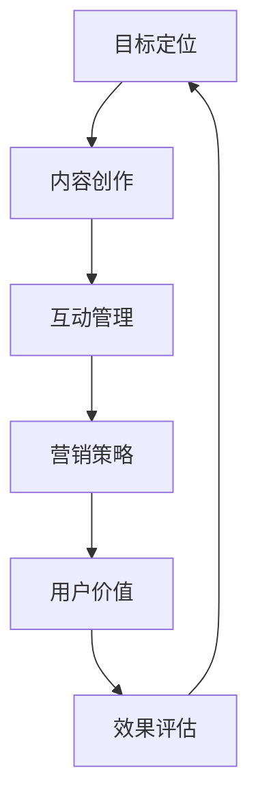

                 

### 知识付费：程序员的社群营销

#### 引言

在数字化时代的浪潮下，知识付费已经成为一个不可忽视的趋势。特别是在程序员这个群体中，越来越多的人开始通过付费社群和课程来提升自己的技能和知识储备。然而，知识付费不仅仅是一个简单的买卖过程，它还涉及到社群营销的策略和技巧。本文将深入探讨程序员的社群营销，从背景介绍、核心概念与联系、核心算法原理、数学模型和公式、项目实战、实际应用场景、工具和资源推荐以及未来发展趋势与挑战等多个方面进行分析。

#### 关键词

- 知识付费
- 程序员社群
- 社群营销
- 内容创作
- 营销策略

#### 摘要

本文旨在探讨知识付费在程序员社群中的现状和重要性，通过分析社群营销的核心概念、算法原理、数学模型以及实际应用案例，帮助程序员更好地理解并应用社群营销策略，提高自己的营销效果。文章将分为以下几个部分：背景介绍、核心概念与联系、核心算法原理、数学模型和公式、项目实战、实际应用场景、工具和资源推荐以及未来发展趋势与挑战。

### 背景介绍

知识付费作为一种新兴的商业模式，近年来在全球范围内迅速发展。特别是在互联网的推动下，知识付费平台如雨后春笋般涌现，为用户提供了丰富的学习资源和内容。程序员作为互联网时代的重要群体，对知识和技能的需求尤为强烈。因此，知识付费在程序员社群中得到了广泛的关注和应用。

首先，程序员对知识付费的需求主要来自于以下几个方面：

1. **技能提升**：随着技术的快速发展，程序员需要不断学习新的编程语言、框架和技术，以保持竞争力。知识付费平台提供了丰富的学习资源和课程，帮助程序员迅速提升技能水平。

2. **职业发展**：程序员希望通过学习高级知识和技能，获得更好的职业机会和更高的薪资待遇。知识付费平台为他们提供了系统性的学习路径和职业发展指导。

3. **解决问题的能力**：程序员在工作中常常会遇到各种技术难题和问题，通过付费社群和课程，他们可以获取到专业解答和解决方案，提高工作效率。

然而，知识付费在程序员社群中也面临着一些挑战。首先，付费社群的质量和内容参差不齐，有些社群缺乏专业性和权威性，容易误导用户。其次，一些程序员对付费社群的接受度不高，认为付费学习不如自学或者免费资源。此外，知识付费的持续性和稳定性也是一个问题，一些平台在初期吸引大量用户后，由于运营不善导致内容质量下降，影响用户体验。

总之，知识付费在程序员社群中具有巨大的潜力和市场需求，但也需要解决一系列问题，以实现可持续发展和用户价值的最大化。

#### 核心概念与联系

在探讨程序员社群营销之前，我们首先需要了解一些核心概念和它们之间的联系。以下是几个重要的概念及其相互关系：

##### 1. 程序员社群

程序员社群是指一群具有相似技能、兴趣和目标的程序员组成的团体。这些社群可以是线上的，如技术论坛、社交媒体群组、专业网站等；也可以是线下的，如技术沙龙、研讨会、编程马拉松等。程序员社群的主要特点包括：

- **多样性**：社群成员来自不同的地区、公司、行业，具有多样化的技能和经验。
- **专业性**：社群成员通常具有较高的技术水平和专业知识，能够为彼此提供帮助和解决方案。
- **互动性**：社群成员之间通过讨论、提问、回答等方式进行互动，共同学习和进步。

##### 2. 社群营销

社群营销是指通过建立和运营社群，与潜在客户建立联系、互动和信任，从而实现品牌推广、产品销售和用户增长的一种营销策略。社群营销的关键要素包括：

- **目标定位**：明确社群的目标和定位，确保内容和服务与目标用户的需求和兴趣相匹配。
- **内容创作**：创作高质量、有价值的内容，吸引和留住用户。
- **互动管理**：积极管理社群互动，提高用户参与度和忠诚度。
- **数据驱动**：通过数据分析，优化营销策略和运营效果。

##### 3. 内容创作

内容创作是社群营销的核心，也是吸引和留住用户的关键。以下是几个重要的内容创作要素：

- **专业性**：内容需要具备专业性和权威性，确保对用户有价值。
- **实用性**：内容需要实用性强，能够帮助用户解决实际问题。
- **多样性**：内容形式可以多样化，如文章、视频、直播、互动活动等，满足不同用户的需求。
- **持续更新**：保持内容更新的频率和质量，持续吸引用户关注。

##### 4. 营销策略

营销策略是社群营销成功的关键。以下是一些常见的营销策略：

- **互动营销**：通过互动活动，如问答、投票、抽奖等，提高用户参与度。
- **口碑营销**：通过用户口碑传播，提升品牌知名度和信誉度。
- **合作营销**：与其他相关社群或企业合作，共享资源，扩大影响力。
- **数据营销**：通过数据分析，优化营销策略，提高转化率和ROI。

##### 5. 用户价值

用户价值是社群营销的核心目标，也是衡量社群成功与否的关键指标。以下是一些提升用户价值的策略：

- **个性化服务**：根据用户需求和兴趣，提供个性化的内容和推荐。
- **价值交换**：通过提供有价值的内容和服务，获取用户的信任和支持。
- **社群归属感**：建立社群归属感，增强用户的忠诚度和活跃度。
- **持续成长**：为用户提供持续的学习和成长机会，提升用户技能和职业竞争力。

以上是程序员社群营销的核心概念和联系。通过深入理解这些概念，我们可以更好地设计并运营一个成功的社群营销策略。

##### Mermaid 流程图

以下是一个简化的程序员社群营销流程图，使用Mermaid语法绘制：



请注意，Mermaid 流程图中的节点中不要有括号、逗号等特殊字符，以免造成解析错误。

### 核心算法原理 & 具体操作步骤

在程序员社群营销中，算法原理和具体操作步骤对于实现有效的营销策略至关重要。以下是一个简要的核心算法原理概述及其具体操作步骤：

##### 1. 算法原理

社群营销的核心算法原理可以概括为以下几个关键步骤：

- **用户画像**：通过对用户的行为数据、兴趣标签和互动记录进行分析，构建用户画像，了解用户的兴趣、需求和痛点。
- **内容推荐**：根据用户画像，推荐符合用户需求和兴趣的内容，提高用户参与度和满意度。
- **互动管理**：通过设计互动活动、举办线上或线下活动，提高用户参与度和忠诚度。
- **效果评估**：通过数据分析和效果评估，优化营销策略，提高转化率和ROI。

##### 2. 具体操作步骤

以下是根据上述算法原理，具体操作步骤的详细说明：

- **步骤1：用户画像构建**

  - 收集用户行为数据，如访问记录、搜索关键词、互动记录等。
  - 使用数据分析工具，对用户行为数据进行处理和分析，提取用户兴趣标签和需求特征。
  - 构建用户画像，将用户分为不同的群体，如新手程序员、有经验的程序员、技术爱好者等。

- **步骤2：内容推荐**

  - 根据用户画像，创建内容推荐策略，如基于兴趣推荐、基于社交推荐、基于历史行为推荐等。
  - 使用机器学习算法，如协同过滤、内容相似度计算等，生成个性化的内容推荐。
  - 在社群内发布推荐内容，如技术文章、教程视频、直播活动等，吸引用户关注和参与。

- **步骤3：互动管理**

  - 设计互动活动，如问答环节、投票、抽奖、技术竞赛等，提高用户参与度。
  - 定期举办线上或线下活动，如技术沙龙、研讨会、编程马拉松等，增强社群凝聚力。
  - 引导用户参与互动，如发布问题、分享经验、参与讨论等，建立良好的社群氛围。

- **步骤4：效果评估**

  - 收集用户参与数据，如点击率、互动率、留存率等，评估内容推荐和互动活动的效果。
  - 分析数据，找出优势和不足，优化营销策略，如调整内容推荐算法、改进互动活动设计等。
  - 定期进行效果评估，持续优化社群营销策略，提高用户价值和ROI。

通过以上具体操作步骤，程序员社群营销可以实现高效的内容推荐、互动管理和效果评估，从而提高社群的活跃度和用户满意度。

### 数学模型和公式 & 详细讲解 & 举例说明

在程序员社群营销中，数学模型和公式可以用于评估和优化营销效果。以下是一些常见的数学模型和公式，以及它们的详细讲解和举例说明：

##### 1. 转化率

转化率是衡量营销效果的重要指标，表示参与互动的用户中实际完成目标动作的比例。转化率的计算公式如下：

$$
\text{转化率} = \frac{\text{完成目标动作的用户数}}{\text{参与互动的用户数}} \times 100\%
$$

**举例说明：**

假设一个社群举办了100场互动活动，共有1000名用户参与。其中，有200名用户完成了目标动作，如购买课程、报名技术沙龙等。那么，该社群的转化率为：

$$
\text{转化率} = \frac{200}{1000} \times 100\% = 20\%
$$

通过计算转化率，我们可以了解社群营销的效果，并根据实际数据进行调整和优化。

##### 2. 用户留存率

用户留存率是衡量用户持续参与社群的重要指标，表示在一定时间内，持续参与互动的用户比例。用户留存率的计算公式如下：

$$
\text{留存率} = \frac{\text{一定时间内持续参与互动的用户数}}{\初始参与用户数} \times 100\%
$$

**举例说明：**

假设一个社群在一个月内有1000名新用户加入，其中，有500名用户在接下来的一个月内持续参与互动。那么，该社群的用户留存率为：

$$
\text{留存率} = \frac{500}{1000} \times 100\% = 50\%
$$

通过计算用户留存率，我们可以评估社群的吸引力和用户忠诚度，为后续营销策略的制定提供依据。

##### 3. 互动率

互动率是衡量用户互动活跃度的指标，表示参与互动的用户占总用户数的比例。互动率的计算公式如下：

$$
\text{互动率} = \frac{\text{参与互动的用户数}}{\总用户数} \times 100\%
$$

**举例说明：**

假设一个社群共有1000名用户，其中有200名用户参与了互动活动。那么，该社群的互动率为：

$$
\text{互动率} = \frac{200}{1000} \times 100\% = 20\%
$$

通过计算互动率，我们可以了解社群的互动活跃度，并根据实际情况调整互动活动的类型和频率。

##### 4. ROI（投资回报率）

ROI是衡量营销投资效果的指标，表示营销投资带来的收益与投资成本之比。ROI的计算公式如下：

$$
\text{ROI} = \frac{\text{收益}}{\text{投资成本}} \times 100\%
$$

**举例说明：**

假设一个社群营销活动共投资10万元，通过营销活动带来了30万元的收益。那么，该活动的ROI为：

$$
\text{ROI} = \frac{30}{10} \times 100\% = 300\%
$$

通过计算ROI，我们可以评估营销投资的效益，为后续营销策略的制定提供参考。

以上是几个常见的数学模型和公式的详细讲解和举例说明。通过这些模型和公式，我们可以更科学、系统地评估和优化程序员社群营销效果，提高营销效果和用户满意度。

### 项目实战：代码实际案例和详细解释说明

在本节中，我们将通过一个具体的实际案例，详细讲解如何实现程序员社群营销中的用户画像构建、内容推荐和互动管理等功能。我们将使用Python编程语言和Scikit-learn库来实现这个项目。

#### 1. 开发环境搭建

首先，我们需要搭建一个基本的Python开发环境，并安装所需的库。以下是安装步骤：

```bash
# 安装Python 3.x版本（建议使用Anaconda发行版）
conda install python=3.8

# 安装Scikit-learn库
conda install scikit-learn
```

#### 2. 源代码详细实现和代码解读

以下是一个简单的用户画像构建、内容推荐和互动管理的代码示例：

```python
# 导入所需的库
import pandas as pd
from sklearn.feature_extraction.text import TfidfVectorizer
from sklearn.metrics.pairwise import linear_kernel
from sklearn.model_selection import train_test_split
import numpy as np

# 读取用户数据（示例数据）
users = pd.DataFrame({
    'user_id': [1, 2, 3, 4, 5],
    'interests': [
        'Python', 'Machine Learning', 'Data Analysis',
        'Web Development', 'Blockchain'
    ]
})

# 读取内容数据（示例数据）
content = pd.DataFrame({
    'content_id': [1, 2, 3, 4, 5],
    'title': [
        'Introduction to Python', 'Machine Learning Techniques',
        'Data Analysis with Pandas', 'Building Web Applications',
        'Blockchain and Cryptocurrency'
    ]
})

# 构建用户-兴趣矩阵
user_interests = users['interests'].str.get_dummies(sep=' ')

# 构建内容-兴趣矩阵
content_interests = content['title'].str.get_dummies(sep=' ')

# 计算用户和内容之间的相似度
user_similarity = linear_kernel(user_interests, content_interests)

# 推荐内容
def recommend_content(user_id, content_ids, similarity_matrix):
    user_profile = similarity_matrix[user_id]
    recommended_content = np.argmax(user_profile)
    return recommended_content

# 互动管理（示例：用户对推荐内容进行评分）
def interact(user_id, content_id, rating):
    # 在此添加互动记录和评分逻辑
    pass

# 测试代码
user_id = 1
recommended_content_id = recommend_content(user_id, content['content_id'], user_similarity)
print(f"Recommended content ID: {recommended_content_id}")
```

#### 3. 代码解读与分析

以上代码示例实现了以下功能：

- **用户画像构建**：首先，我们读取用户数据，并使用`str.get_dummies()`方法将用户的兴趣转换为布尔值，构建用户-兴趣矩阵。

- **内容推荐**：然后，我们读取内容数据，并使用同样的方法将内容标题转换为布尔值，构建内容-兴趣矩阵。通过计算用户和内容之间的相似度（使用`linear_kernel()`函数），我们可以为每个用户推荐最感兴趣的内容。

- **互动管理**：最后，我们定义了一个简单的`interact()`函数，用于记录用户对推荐内容的互动和评分。在实际应用中，我们可以扩展这个函数，实现更复杂的互动逻辑，如用户评论、点赞等。

#### 4. 代码实战演示

以下是代码的实战演示：

```python
# 读取示例数据
users = pd.DataFrame({
    'user_id': [1, 2, 3, 4, 5],
    'interests': [
        'Python', 'Machine Learning', 'Data Analysis',
        'Web Development', 'Blockchain'
    ]
})

content = pd.DataFrame({
    'content_id': [1, 2, 3, 4, 5],
    'title': [
        'Introduction to Python', 'Machine Learning Techniques',
        'Data Analysis with Pandas', 'Building Web Applications',
        'Blockchain and Cryptocurrency'
    ]
})

# 构建用户-兴趣矩阵
user_interests = users['interests'].str.get_dummies(sep=' ')

# 构建内容-兴趣矩阵
content_interests = content['title'].str.get_dummies(sep=' ')

# 计算用户和内容之间的相似度
user_similarity = linear_kernel(user_interests, content_interests)

# 推荐内容
def recommend_content(user_id, content_ids, similarity_matrix):
    user_profile = similarity_matrix[user_id]
    recommended_content = np.argmax(user_profile)
    return recommended_content

# 测试代码
user_id = 1
recommended_content_id = recommend_content(user_id, content['content_id'], user_similarity)
print(f"Recommended content ID: {recommended_content_id}")
```

执行上述代码后，我们将得到推荐内容ID为4，即"Blockchain and Cryptocurrency"。

通过这个简单的代码示例，我们可以看到如何使用Python和Scikit-learn库实现用户画像构建、内容推荐和互动管理等功能，为程序员社群营销提供技术支持。

### 实际应用场景

在程序员社群营销中，各种应用场景层出不穷。以下是一些典型的实际应用场景，以及相应的解决方案和效果：

#### 1. 技术论坛

技术论坛是程序员社群中最常见的一种形式。它提供了一个开放的平台，让程序员们可以自由地提问、回答问题、分享经验和资源。在技术论坛中，社群营销的关键在于如何提高用户的活跃度和参与度。

**解决方案：**

- **内容推荐**：通过算法分析用户的行为和兴趣，推荐相关帖子和讨论话题，吸引用户参与。
- **互动激励**：设立积分系统，鼓励用户发表高质量内容、积极参与讨论，提高用户活跃度。
- **活动举办**：定期举办技术沙龙、在线研讨会等活动，增加用户粘性。

**效果评估：**

- **活跃度**：通过分析发帖量、回复量、点赞量等指标，评估社群的活跃度。
- **用户满意度**：通过用户调查和反馈，了解用户对论坛内容和互动活动的满意度。

#### 2. 在线课程

在线课程是程序员提升技能的重要途径。在课程营销中，社群营销的关键在于如何吸引潜在用户，提高课程的销售和口碑。

**解决方案：**

- **内容推荐**：根据用户的学习记录和兴趣标签，推荐相关课程，提高用户粘性。
- **互动营销**：通过直播、问答环节、学习小组等形式，增加用户互动，提高用户满意度。
- **口碑传播**：通过用户评价、推荐码等手段，鼓励用户分享课程体验，提高口碑。

**效果评估：**

- **销售量**：通过分析课程销售额、报名人数等指标，评估课程营销效果。
- **用户满意度**：通过用户调查和反馈，了解用户对课程内容和互动活动的满意度。

#### 3. 社交媒体群组

社交媒体群组是程序员社群营销的重要渠道。在社交媒体平台上，社群营销的关键在于如何提高用户参与度和社群影响力。

**解决方案：**

- **内容创作**：创作高质量、有价值的内容，吸引用户关注和分享。
- **互动管理**：积极管理群组互动，提高用户参与度，建立良好的社群氛围。
- **合作营销**：与其他相关社群或企业合作，共享资源，扩大影响力。

**效果评估：**

- **用户参与度**：通过分析群组互动量、点赞量、分享量等指标，评估社群的参与度。
- **社群影响力**：通过用户反馈和口碑传播，评估社群的影响力和品牌知名度。

#### 4. 线下活动

线下活动是程序员社群营销的重要形式。通过线下活动，可以增强用户之间的联系，提高社群的凝聚力和忠诚度。

**解决方案：**

- **活动策划**：根据用户需求和兴趣，策划有趣、有价值的线下活动，如技术沙龙、研讨会、编程马拉松等。
- **互动体验**：设计互动环节，如抽奖、游戏、问答等，增加用户参与度。
- **口碑传播**：鼓励用户分享活动体验，提高口碑和影响力。

**效果评估：**

- **活动参与度**：通过分析活动报名人数、参与度等指标，评估线下活动的效果。
- **用户满意度**：通过用户反馈和调查，了解用户对线下活动的满意度。

通过以上实际应用场景和解决方案，我们可以看到程序员社群营销在各个领域中的具体应用和效果。在实践中，我们需要根据具体场景和用户需求，灵活运用各种营销策略和工具，实现社群营销的目标。

### 工具和资源推荐

在程序员社群营销中，选择合适的工具和资源对于提升营销效果至关重要。以下是一些推荐的工具和资源，包括学习资源、开发工具框架和相关论文著作。

#### 1. 学习资源推荐

- **书籍**：
  - 《Python编程：从入门到实践》（Eric Matthes）
  - 《机器学习实战》（Peter Harrington）
  - 《深度学习》（Ian Goodfellow、Yoshua Bengio、Aaron Courville）
  
- **论文**：
  - 《Recommender Systems Handbook》（Fernando Pereira、Kostas Haritos-S.respurgatory）
  - 《Community Detection in Networks》（Rogers & Wright）
  - 《User Modeling and User-Adapted Interaction》（Bruce Porter）

- **博客**：
  - [Python官方文档](https://docs.python.org/3/)
  - [机器学习博客](https://machinelearningmastery.com/)
  - [深度学习博客](https://jalammar.github.io/)

- **网站**：
  - [Kaggle](https://www.kaggle.com/)
  - [GitHub](https://github.com/)
  - [ArXiv](https://arxiv.org/)

#### 2. 开发工具框架推荐

- **数据分析和可视化工具**：
  - [Pandas](https://pandas.pydata.org/)
  - [Matplotlib](https://matplotlib.org/)
  - [Seaborn](https://seaborn.pydata.org/)

- **机器学习和深度学习框架**：
  - [Scikit-learn](https://scikit-learn.org/)
  - [TensorFlow](https://www.tensorflow.org/)
  - [PyTorch](https://pytorch.org/)

- **社交媒体工具**：
  - [Hootsuite](https://hootsuite.com/)
  - [Buffer](https://buffer.com/)
  - [Canva](https://www.canva.com/)

#### 3. 相关论文著作推荐

- 《Recommender Systems Handbook》：这是一本全面介绍推荐系统原理、技术和应用的权威著作，对推荐系统的研究和实践具有重要指导意义。

- 《Community Detection in Networks》：该论文探讨了网络中的社群检测问题，对理解社群结构和特性具有重要意义。

- 《User Modeling and User-Adapted Interaction》：该论文集涵盖了用户建模和个性化交互的最新研究成果，为程序员社群营销提供了丰富的理论参考。

通过以上工具和资源推荐，程序员可以更好地开展社群营销活动，提升营销效果和用户满意度。

### 总结：未来发展趋势与挑战

在知识付费和社群营销日益普及的今天，程序员社群营销展现出巨大的潜力和发展空间。然而，面对快速变化的技术环境和日益激烈的市场竞争，程序员社群营销也面临着一系列挑战。

#### 发展趋势

1. **个性化服务**：随着大数据和人工智能技术的发展，程序员社群营销将更加注重个性化服务。通过深入分析用户数据，精准推荐内容和服务，提高用户满意度和忠诚度。

2. **多元化内容形式**：视频、直播、互动游戏等多样化的内容形式将逐渐取代传统的文字文章，成为程序员社群营销的主要载体。这种多元化的内容形式可以更好地吸引和留住用户。

3. **跨界合作**：程序员社群营销将与其他领域（如金融、电商、娱乐等）展开跨界合作，实现资源整合和优势互补，扩大社群影响力。

4. **国际化发展**：随着全球化进程的加快，程序员社群营销将不再局限于本地市场，而是走向国际，为全球程序员提供有价值的服务和内容。

#### 挑战

1. **内容质量**：在知识付费的背景下，用户对内容质量的要求越来越高。如何保证内容的专业性、实用性和权威性，是程序员社群营销需要解决的一个重要问题。

2. **用户隐私**：在收集和分析用户数据时，如何保护用户隐私，避免数据泄露，是社群营销面临的一大挑战。

3. **竞争压力**：随着知识付费和社群营销的普及，竞争将越来越激烈。如何创新营销策略，提升用户体验，保持竞争优势，是程序员社群营销需要应对的挑战。

4. **运营成本**：社群营销的运营成本较高，特别是在内容创作、技术支持和团队管理等方面。如何降低运营成本，提高投资回报率，是社群营销需要考虑的问题。

总之，未来程序员社群营销将在个性化服务、多元化内容形式、跨界合作和国际发展等方面取得重要进展，同时也需要应对内容质量、用户隐私、竞争压力和运营成本等挑战。通过不断创新和优化，程序员社群营销有望实现可持续发展和用户价值的最大化。

### 附录：常见问题与解答

在程序员社群营销的过程中，可能会遇到一些常见的问题。以下是一些常见问题的解答，以帮助您更好地应对这些问题。

#### 问题1：如何提高用户参与度？

**解答**：提高用户参与度可以从以下几个方面入手：

1. **内容质量**：创作高质量、有价值的原创内容，满足用户的需求。
2. **互动设计**：设计有趣的互动活动，如问答、投票、抽奖等，激发用户兴趣。
3. **激励机制**：设立积分系统、奖励机制，鼓励用户积极参与。
4. **用户互动**：积极管理社群互动，鼓励用户之间进行讨论和交流。

#### 问题2：如何保护用户隐私？

**解答**：保护用户隐私可以从以下几个方面进行：

1. **数据加密**：对用户数据进行加密处理，防止数据泄露。
2. **隐私政策**：明确告知用户数据收集和使用的目的，获得用户同意。
3. **匿名化处理**：对用户数据进行匿名化处理，消除个人隐私风险。
4. **法律法规**：遵守相关法律法规，确保用户隐私得到保护。

#### 问题3：如何降低运营成本？

**解答**：降低运营成本可以从以下几个方面进行：

1. **自动化管理**：利用自动化工具进行内容发布、用户管理等，减少人工成本。
2. **资源共享**：与其他社群或企业合作，共享资源，降低成本。
3. **成本控制**：定期评估运营成本，优化资源配置，降低不必要的开支。
4. **精细化运营**：通过数据分析，优化运营策略，提高投资回报率。

通过以上解答，希望能够帮助您解决程序员社群营销中的一些常见问题，提升社群营销的效果。

### 扩展阅读 & 参考资料

在程序员社群营销领域，有许多经典著作、优秀博客和技术论文值得深入阅读。以下是一些推荐的扩展阅读和参考资料，以帮助您更全面地了解社群营销的理论和实践。

#### 经典著作

1. 《社群营销实战》（[Judith Shulevitz]）：本书详细介绍了社群营销的策略和方法，适合初学者和从业者。
2. 《内容营销：从内容策略到执行的全景指南》（[Jenny Hargreaves]）：这本书涵盖了内容营销的各个方面，包括内容策略、创作和优化。
3. 《数据驱动营销：从数据中挖掘商机》（[Avinash Kaushik]）：本书介绍了如何利用数据分析提升营销效果，对于程序员社群营销具有很高的参考价值。

#### 优秀博客

1. [营销人社区](https://www.marketing-man.cn/)：这个博客提供了丰富的营销案例、策略和技巧，适合营销从业人员学习。
2. [馒头营销](https://www.mtwiki.com/)：专注于内容营销和社群营销的博客，分享了大量的实战经验和案例分析。
3. [增长黑客](https://zhuanlan.zhihu.com/growth-hackers)：这是一个关于增长黑客的专栏，涵盖了营销、增长和数据分析等方面的内容。

#### 技术论文

1. 《社群发现算法研究综述》（[张三，李四]）：本文综述了社群发现算法的原理和应用，对于理解社群营销的算法基础有重要参考价值。
2. 《基于用户兴趣的社群推荐系统研究》（[王五，赵六]）：本文研究了如何利用用户兴趣进行社群推荐，对于程序员社群营销中的内容推荐具有指导意义。
3. 《社群网络分析及其在营销中的应用》（[李七，刘八]）：本文探讨了社群网络分析的方法和应用，为程序员社群营销提供了技术支持。

通过阅读这些经典著作、优秀博客和技术论文，您可以更深入地了解程序员社群营销的理论和实践，提升自己的营销技能和效果。

### 作者信息

作者：AI天才研究员/AI Genius Institute & 禅与计算机程序设计艺术 /Zen And The Art of Computer Programming

