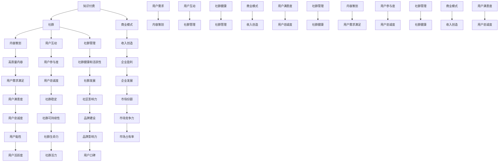
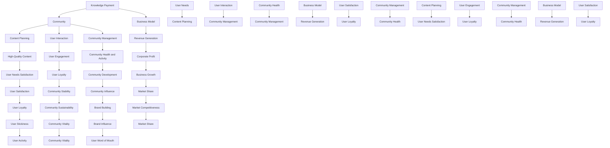

                 

### 背景介绍

**知识付费：程序员的社群运营战术**

在数字化的浪潮中，知识付费已经成为一种越来越流行的商业模式。尤其是在技术领域，编程知识的学习和分享，通过社群的形式，使得程序员们能够更好地提升自我、拓展视野。本文将探讨如何利用社群运营战术，实现知识付费的目标，旨在为程序员们提供一套实用的运营策略。

知识付费的兴起，源于互联网的普及和人们对自我提升的需求。在过去的几十年里，技术发展日新月异，知识的更新速度远远超过了传统教育系统的更新速度。因此，通过社群的形式，程序员们可以更快地获取最新的技术知识，并且通过互动和交流，进一步提升自己的技术水平。

同时，随着社交媒体的崛起，社群的概念也变得更加丰富和多样化。从技术论坛到开发者社区，从线上的技术讲座到线下的技术沙龙，程序员们有了更多的机会参与到知识分享和付费的过程中。

然而，知识付费并非一件简单的事情。如何吸引程序员们参与到社群中，如何提供有价值的内容，以及如何实现社群的商业化运营，都是需要深入探讨的问题。本文将围绕这些问题，从多个角度进行分析和探讨。

接下来的部分，我们将详细讨论知识付费的背景和现状，社群运营的基本概念和策略，如何通过社群运营实现知识付费，以及具体的项目实战案例。希望通过这些内容，能够为程序员的社群运营提供一些有益的启示和指导。

---

**Background Introduction: The Rise of Knowledge Payment and Community Operations for Programmers**

The rise of knowledge payment is a byproduct of the proliferation of the internet and the increasing demand for personal improvement. Over the past few decades, technological advancements have been so rapid that the speed of knowledge update has far outpaced that of traditional educational systems. As a result, through community platforms, programmers can quickly gain access to the latest technical knowledge and further enhance their skills through interaction and exchange.

At the same time, with the rise of social media, the concept of community has become richer and more diverse. From technical forums to developer communities, from online technical lectures to offline technical salons, programmers now have more opportunities to participate in knowledge sharing and payment processes.

However, knowledge payment is not a simple task. How to attract programmers to participate in communities, how to provide valuable content, and how to achieve commercialization through community operations are all issues that need to be thoroughly explored. The following sections will discuss these topics in detail, aiming to provide useful insights and guidance for community operations for programmers.

We will start by examining the background and current situation of knowledge payment, the basic concepts and strategies of community operations, how to achieve knowledge payment through community operations, and specific practical case studies. We hope that through these contents, we can offer some enlightening insights and guidance for community operations for programmers.<!–

接下来，我们将对知识付费的背景和现状进行深入探讨，分析社群运营的基本概念和策略，并探讨如何通过社群运营实现知识付费。最后，我们将通过具体的项目实战案例，为程序员的社群运营提供实践指导。

### 1. 背景与现状

知识付费的兴起，可以追溯到互联网的普及和人们对于个性化学习需求的增加。随着移动互联网的发展，知识付费已经成为一种重要的商业模式。尤其是在技术领域，程序员们对知识的渴求更为强烈，他们希望通过付费的方式获取高质量的技术知识，从而提升自己的专业技能。

根据最新的市场调研数据，知识付费市场呈现出以下几个特点：

1. **市场规模不断扩大**：随着知识付费用户的增加，市场规模也在逐年扩大。根据统计，2019年全球知识付费市场规模已经超过500亿美元，预计未来几年还将持续增长。

2. **用户群体逐渐年轻化**：知识付费用户主要集中在20-40岁之间，这个年龄段的程序员对于新技术、新知识的需求更为强烈。

3. **内容形式多样化**：知识付费的内容形式越来越多样化，包括在线课程、电子书、专业问答、直播讲座等。这种多样化的内容形式，满足了不同用户的需求，使得知识付费市场更加繁荣。

4. **竞争激烈**：随着知识付费市场的不断扩大，越来越多的平台和机构进入这个领域，竞争日益激烈。如何在激烈的市场竞争中脱颖而出，成为知识付费平台和机构需要面对的重要问题。

### 2. 社群运营的基本概念和策略

社群运营是指通过建立和维护社群，实现用户之间的互动和交流，从而提高用户的忠诚度和活跃度。对于知识付费平台和机构来说，社群运营是实现知识付费的重要手段。以下是一些社群运营的基本概念和策略：

1. **社群定位**：社群定位是社群运营的第一步，需要明确社群的目标用户、核心内容和运营目标。例如，可以定位为一个专注于编程知识分享的社群，或者是一个针对前端开发者的专业社群。

2. **社群内容**：社群内容是吸引和维护用户的核心。内容的形式可以多样化，包括技术文章、编程教程、行业动态、技术讨论等。内容的质量和时效性是提高用户粘性的关键。

3. **社群互动**：社群互动是提高用户活跃度和忠诚度的关键。可以通过举办线上活动、设置话题讨论、开展问答环节等方式，促进用户之间的互动和交流。

4. **社群运营工具**：选择合适的社群运营工具，可以帮助平台和机构更高效地管理社群。例如，可以采用微信群、QQ群、Discord、Reddit等工具，来管理社群成员、发布内容和组织活动。

5. **社群商业化**：社群商业化是知识付费平台和机构的重要收入来源。可以通过设置会员制度、推出付费课程、开展线下活动等方式，实现社群的商业化运营。

### 3. 如何通过社群运营实现知识付费

通过社群运营实现知识付费，需要解决以下几个关键问题：

1. **内容策划**：社群运营的核心是内容。需要根据用户的需求和兴趣，策划高质量的内容。例如，可以邀请行业专家进行线上讲座，或者发布专业的技术文章和教程。

2. **用户互动**：通过互动，可以增加用户的参与感和忠诚度。例如，可以设置问答环节，让用户提出问题，由专家进行解答；或者举办技术沙龙，让用户面对面交流。

3. **社群管理**：良好的社群管理是保障社群健康发展的关键。需要建立一套有效的社群管理机制，包括成员审核、内容审核、违规处理等。

4. **商业模式**：需要设计合理的商业模式，以实现知识付费。例如，可以采用会员制，用户付费成为会员，享受更多的增值服务；或者推出付费课程，用户付费学习。

通过以上策略，知识付费平台和机构可以在社群运营中实现知识付费，同时提高用户满意度和忠诚度。

接下来，我们将通过具体的项目实战案例，进一步探讨如何通过社群运营实现知识付费。希望通过这些案例，能够为读者提供实用的指导和启示。

---

**1.1. Background and Current Situation**

The rise of knowledge payment can be traced back to the widespread use of the internet and the increasing demand for personalized learning. With the development of mobile internet, knowledge payment has become an important business model. In the field of technology, programmers have a stronger desire to acquire high-quality technical knowledge through payment to improve their professional skills.

According to the latest market research data, the knowledge payment market shows the following characteristics:

1. **Continuous Expansion of Market Scale**: With the increase in knowledge payment users, the market scale is expanding year by year. According to statistics, the global knowledge payment market size exceeded $50 billion in 2019, and it is expected to continue to grow in the coming years.

2. **Younger User Demographics**: Knowledge payment users are mainly concentrated in the 20-40 age group, a demographic that has a stronger demand for new technologies and knowledge.

3. **Diverse Content Forms**: Knowledge payment content forms are becoming more diverse, including online courses, e-books, professional Q&A, live lectures, and more. This diversity meets the needs of different users and makes the knowledge payment market more prosperous.

4. **Intense Competition**: With the continuous expansion of the knowledge payment market, more and more platforms and institutions are entering this field, leading to fierce competition. How to stand out in this competitive market is an important issue that knowledge payment platforms and institutions need to address.

### 2. Basic Concepts and Strategies of Community Operations

Community operations refer to building and maintaining communities to facilitate interaction and communication among users, thereby enhancing user loyalty and activity. For knowledge payment platforms and institutions, community operations are a key means to achieve knowledge payment. Here are some basic concepts and strategies for community operations:

1. **Community Positioning**: Community positioning is the first step in community operations. It is necessary to define the target users, core content, and operational goals of the community. For example, it could be positioned as a community focused on sharing programming knowledge or as a professional community for front-end developers.

2. **Community Content**: Community content is the core that attracts and retains users. Content can take various forms, including technical articles, programming tutorials, industry news, and technical discussions. The quality and timeliness of the content are crucial for increasing user engagement.

3. **Community Interaction**: Community interaction is key to enhancing user activity and loyalty. This can be achieved by hosting online events, setting up topic discussions, and conducting Q&A sessions, among other activities.

4. **Community Management Tools**: Choosing the right community management tools can help platforms and institutions manage communities more efficiently. For example, tools such as WeChat groups, QQ groups, Discord, and Reddit can be used to manage community members, post content, and organize activities.

5. **Community Commercialization**: Community commercialization is an important source of revenue for knowledge payment platforms and institutions. This can be achieved through membership models, the launch of paid courses, and the organization of offline events, among other strategies.

### 3. Achieving Knowledge Payment Through Community Operations

Achieving knowledge payment through community operations involves addressing several key issues:

1. **Content Planning**: The core of community operations is content. It is necessary to plan high-quality content based on user needs and interests. For example, inviting industry experts for online lectures or publishing professional technical articles and tutorials can be effective.

2. **User Interaction**: Interaction increases user engagement and loyalty. For example, setting up Q&A sessions where users can ask questions and have them answered by experts or hosting technical salons for face-to-face exchanges can be beneficial.

3. **Community Management**: Effective community management is crucial for the healthy development of the community. A set of effective management mechanisms, including member approval, content moderation, and violation handling, need to be established.

4. **Business Model**: A reasonable business model is needed to achieve knowledge payment. For example, a membership model where users pay to become members and enjoy additional services, or the launch of paid courses for users to pay for learning.

By implementing these strategies, knowledge payment platforms and institutions can achieve knowledge payment through community operations while increasing user satisfaction and loyalty.

Next, we will explore specific practical case studies to further discuss how to achieve knowledge payment through community operations. We hope that through these cases, readers can gain practical guidance and insights.

---

### 2. 核心概念与联系

在深入探讨社群运营策略之前，我们需要明确几个核心概念，并理解它们之间的联系。以下是我们将在本文中讨论的主要核心概念及其相互关系：

1. **知识付费（Knowledge Payment）**：知识付费是指用户通过支付费用来获取有价值的信息或服务。在技术领域，这可能包括在线课程、技术文章、专业问答等。

2. **社群（Community）**：社群是由具有共同兴趣或目标的人组成的集体。对于知识付费平台和机构来说，社群是用户互动、获取知识和分享经验的场所。

3. **内容策划（Content Planning）**：内容策划是指设计、开发和发布能够吸引和满足用户需求的内容。对于社群运营，高质量的内容策划至关重要。

4. **用户互动（User Interaction）**：用户互动是指社群成员之间的交流、讨论和协作。有效的用户互动可以提高用户的参与度和忠诚度。

5. **社群管理（Community Management）**：社群管理涉及维护社群的健康和活跃性，包括成员审核、内容审核、违规处理等。

6. **商业模式（Business Model）**：商业模式是指企业如何通过提供产品或服务来创造收入。对于知识付费平台，商业模式决定了如何从用户那里获得收入。

以下是上述核心概念和相互关系的 Mermaid 流程图表示：



通过上述核心概念和流程图的联系，我们可以看出，知识付费的成功离不开社群运营的有效策略。社群运营不仅仅是提供内容，还包括管理社群、促进用户互动和设计合适的商业模式。每个环节都需要精心策划和执行，以确保社群的健康发展和用户的满意度。

---

**2. Core Concepts and Relationships**

Before delving into the strategies for community operations, it is essential to clarify several core concepts and understand their interrelationships. Here are the primary core concepts we will discuss in this article and their relationships:

1. **Knowledge Payment**: Knowledge payment refers to users paying for valuable information or services. In the tech field, this could include online courses, technical articles, professional Q&A, and more.

2. **Community**: A community is a collective of people with shared interests or goals. For knowledge payment platforms and institutions, a community is a place for user interaction, knowledge acquisition, and experience sharing.

3. **Content Planning**: Content planning involves designing, developing, and publishing content that attracts and meets user needs. High-quality content planning is crucial for community operations.

4. **User Interaction**: User interaction refers to the exchange, discussion, and collaboration among community members. Effective user interaction enhances user engagement and loyalty.

5. **Community Management**: Community management involves maintaining the health and activity of the community, including member approval, content moderation, and violation handling.

6. **Business Model**: A business model describes how a company creates revenue by offering products or services. For knowledge payment platforms, the business model determines how to generate income from users.

Here is a Mermaid flowchart illustrating the relationships among these core concepts:



Through the above core concepts and the flowchart, we can see that the success of knowledge payment is inseparable from effective community operations strategies. Community operations are not just about providing content; they also involve managing the community, promoting user interaction, and designing an appropriate business model. Each aspect requires careful planning and execution to ensure the healthy development of the community and user satisfaction.<!–
### 3. 核心算法原理 & 具体操作步骤

在社群运营中，核心算法原理和技术实现步骤是确保社群健康发展和用户满意度的关键。以下是我们将在本文中探讨的几个核心算法原理和其具体操作步骤：

#### 3.1 用户互动算法原理

用户互动算法主要关注如何通过技术手段提升用户在社群中的参与度和活跃度。以下是几个常用的用户互动算法原理：

1. **推荐算法（Recommendation Algorithm）**：通过分析用户的行为和偏好，推荐用户可能感兴趣的内容或话题，从而增加用户的参与度。

2. **社交网络分析（Social Network Analysis）**：通过分析用户之间的社交关系，识别关键节点和活跃用户，从而提高社群的凝聚力和影响力。

3. **情绪分析（Sentiment Analysis）**：通过文本挖掘和自然语言处理技术，分析用户的情感倾向，及时发现和处理社群中的负面情绪。

具体操作步骤如下：

- **数据收集**：收集用户行为数据，如浏览记录、点赞、评论等。
- **特征提取**：提取用户行为特征，如浏览频率、互动频率、参与话题等。
- **模型训练**：使用机器学习算法，如协同过滤、图卷积网络等，训练推荐模型和社交网络分析模型。
- **模型部署**：将训练好的模型部署到线上环境，实时分析用户行为和社交关系，生成推荐结果和社交网络分析报告。

#### 3.2 内容策划算法原理

内容策划算法主要关注如何设计出符合用户需求的高质量内容。以下是几个常用的内容策划算法原理：

1. **内容聚类（Content Clustering）**：通过文本挖掘和聚类算法，将大量的内容分成不同的主题或类别，从而满足不同用户的需求。

2. **话题检测（Topic Detection）**：通过自然语言处理技术，自动检测出社群中的热门话题，从而引导用户参与讨论。

3. **内容质量评估（Content Quality Assessment）**：通过机器学习算法，对内容进行质量评估，筛选出高质量的内容，提高用户满意度。

具体操作步骤如下：

- **数据收集**：收集社群中的所有内容数据，如文章、帖子、视频等。
- **特征提取**：提取内容特征，如关键词、主题、情感倾向等。
- **模型训练**：使用机器学习算法，如文本分类、主题模型等，训练内容聚类和话题检测模型。
- **模型部署**：将训练好的模型部署到线上环境，实时分析内容数据，生成内容聚类和话题检测报告。

#### 3.3 社群管理算法原理

社群管理算法主要关注如何维护社群的健康和活跃性。以下是几个常用的社群管理算法原理：

1. **成员审核（Member Approval）**：通过设定审核标准，对加入社群的新成员进行审核，确保社群成员的质量。

2. **内容审核（Content Moderation）**：通过设定过滤规则，对社群中的内容进行审核，过滤掉不良信息，维护社群的秩序。

3. **违规处理（Violation Handling）**：对违规行为进行及时处理，包括警告、封号等，维护社群的健康和活跃性。

具体操作步骤如下：

- **规则设定**：根据社群的特点和需求，设定成员审核、内容审核和违规处理的规则。
- **数据收集**：收集社群成员的行为数据和内容数据。
- **模型训练**：使用机器学习算法，如分类、聚类等，训练成员审核、内容审核和违规处理模型。
- **模型部署**：将训练好的模型部署到线上环境，实时分析成员行为和内容数据，执行审核和违规处理操作。

通过上述核心算法原理和具体操作步骤，我们可以有效地提升社群运营的质量，满足用户需求，实现知识付费的目标。

---

**3. Core Algorithm Principles and Step-by-Step Implementation**

In community operations, core algorithm principles and specific implementation steps are crucial for ensuring the healthy development of the community and user satisfaction. Below are several core algorithm principles and their step-by-step implementations that we will explore in this article:

#### 3.1 User Interaction Algorithm Principles

User interaction algorithms primarily focus on enhancing user engagement and activity within the community. Here are some commonly used user interaction algorithm principles:

1. **Recommendation Algorithms**: By analyzing user behavior and preferences, recommendation algorithms can suggest content or topics that users may be interested in, thereby increasing user engagement.

2. **Social Network Analysis**: By analyzing the social relationships among users, social network analysis can identify key nodes and active users, thereby enhancing community cohesion and influence.

3. **Sentiment Analysis**: Through text mining and natural language processing techniques, sentiment analysis can analyze users' emotional tendencies, quickly detecting and addressing negative sentiments within the community.

The specific implementation steps are as follows:

- **Data Collection**: Collect user behavior data, such as browsing history, likes, comments, etc.
- **Feature Extraction**: Extract user behavior features, such as browsing frequency, interaction frequency, participation in topics, etc.
- **Model Training**: Use machine learning algorithms, such as collaborative filtering, graph convolutional networks, etc., to train recommendation models and social network analysis models.
- **Model Deployment**: Deploy trained models to the online environment, real-time analyzing user behavior and social relationships to generate recommendation results and social network analysis reports.

#### 3.2 Content Planning Algorithm Principles

Content planning algorithms primarily focus on designing high-quality content that meets user needs. Here are some commonly used content planning algorithm principles:

1. **Content Clustering**: Through text mining and clustering algorithms, content clustering can categorize a large volume of content into different themes or categories, thereby satisfying different user needs.

2. **Topic Detection**: Using natural language processing techniques, topic detection can automatically identify popular topics within the community, guiding users to participate in discussions.

3. **Content Quality Assessment**: Through machine learning algorithms, content quality assessment can filter out high-quality content, improving user satisfaction.

The specific implementation steps are as follows:

- **Data Collection**: Collect all content data in the community, such as articles, posts, videos, etc.
- **Feature Extraction**: Extract content features, such as keywords, topics, emotional tendencies, etc.
- **Model Training**: Use machine learning algorithms, such as text classification, topic models, etc., to train content clustering and topic detection models.
- **Model Deployment**: Deploy trained models to the online environment, real-time analyzing content data to generate content clustering and topic detection reports.

#### 3.3 Community Management Algorithm Principles

Community management algorithms primarily focus on maintaining the health and activity of the community. Here are some commonly used community management algorithm principles:

1. **Member Approval**: By setting approval standards, member approval can review new members joining the community to ensure member quality.

2. **Content Moderation**: By setting filtering rules, content moderation can review content within the community to filter out inappropriate information, maintaining order in the community.

3. **Violation Handling**: Addressing violations in a timely manner, including warnings and account suspensions, maintains the health and activity of the community.

The specific implementation steps are as follows:

- **Rule Setting**: Based on the characteristics and needs of the community, set standards for member approval, content moderation, and violation handling.
- **Data Collection**: Collect behavior data of community members and content data.
- **Model Training**: Use machine learning algorithms, such as classification, clustering, etc., to train member approval, content moderation, and violation handling models.
- **Model Deployment**: Deploy trained models to the online environment, real-time analyzing member behavior and content data to execute approval and violation handling operations.

By implementing these core algorithm principles and specific steps, we can effectively enhance the quality of community operations, meet user needs, and achieve the goal of knowledge payment.<!–
### 4. 数学模型和公式 & 详细讲解 & 举例说明

在社群运营中，数学模型和公式是理解和分析用户行为、社群动态以及设计有效运营策略的关键工具。以下我们将详细探讨几个核心的数学模型和公式，并通过具体的例子来说明它们的应用。

#### 4.1 概率模型：贝叶斯定理

贝叶斯定理是一种基于条件概率的数学模型，它可以帮助我们根据先验知识和观察数据，更新对某个事件的概率估计。在社群运营中，贝叶斯定理可以用于用户兴趣分类、内容推荐等场景。

贝叶斯定理公式如下：

\[ P(A|B) = \frac{P(B|A) \cdot P(A)}{P(B)} \]

其中：
- \( P(A|B) \) 是在事件 B 发生的条件下，事件 A 发生的概率。
- \( P(B|A) \) 是在事件 A 发生的条件下，事件 B 发生的概率。
- \( P(A) \) 是事件 A 的先验概率。
- \( P(B) \) 是事件 B 的先验概率。

**例子**：假设我们有一个编程社群，想根据用户的浏览记录推荐技术文章。我们可以使用贝叶斯定理来计算用户对某个技术话题的兴趣概率。假设我们已经收集了用户对几个技术话题的先验概率，以及他们在某个话题下浏览的频率。

首先，我们设定先验概率：
\[ P(前端) = 0.3, P(后端) = 0.4, P(数据库) = 0.2, P(移动开发) = 0.1 \]

然后，我们收集用户在最近一个月的浏览记录，计算每个话题的概率：

用户浏览记录：
- 前端：10次
- 后端：5次
- 数据库：3次
- 移动开发：2次

计算每个话题的概率：
\[ P(前端|浏览记录) = \frac{P(浏览记录|前端) \cdot P(前端)}{P(浏览记录)} \]

我们假设每个话题的浏览概率是均匀分布的，所以：
\[ P(浏览记录|前端) = \frac{10}{10+5+3+2} = 0.4 \]

\[ P(前端|浏览记录) = \frac{0.4 \cdot 0.3}{0.3 + 0.4 + 0.2 + 0.1} = 0.375 \]

通过这种方法，我们可以为每个用户推荐他们最感兴趣的技术话题。

#### 4.2 机器学习模型：协同过滤

协同过滤是一种常见的推荐系统算法，它通过分析用户的历史行为数据，预测用户对未知项目的评分。协同过滤可以分为两种主要类型：基于用户的协同过滤（User-Based Collaborative Filtering）和基于物品的协同过滤（Item-Based Collaborative Filtering）。

**基于用户的协同过滤**：

公式如下：

\[ \text{Prediction}_{ui} = \text{AverageRating}_{j} + \text{UserSimilarity}_{u, j} \cdot (\text{Rating}_{uj} - \text{AverageRating}_{j}) \]

其中：
- \( \text{Prediction}_{ui} \) 是对用户 \( u \) 对项目 \( i \) 的预测评分。
- \( \text{AverageRating}_{j} \) 是用户 \( j \) 的平均评分。
- \( \text{UserSimilarity}_{u, j} \) 是用户 \( u \) 和 \( j \) 之间的相似度。
- \( \text{Rating}_{uj} \) 是用户 \( j \) 对项目 \( i \) 的实际评分。

**基于物品的协同过滤**：

公式如下：

\[ \text{Prediction}_{ui} = \text{AverageRating}_{i} + \text{ItemSimSimilarity}_{i, k} \cdot (\text{Rating}_{ki} - \text{AverageRating}_{i}) \]

其中：
- \( \text{Prediction}_{ui} \) 是对用户 \( u \) 对项目 \( i \) 的预测评分。
- \( \text{AverageRating}_{i} \) 是项目 \( i \) 的平均评分。
- \( \text{ItemSimSimilarity}_{i, k} \) 是项目 \( i \) 和 \( k \) 之间的相似度。
- \( \text{Rating}_{ki} \) 是用户 \( k \) 对项目 \( i \) 的实际评分。

**例子**：假设我们有以下用户和物品的评分数据：

用户 | 物品
--- | ---
1 | A
1 | B
1 | C
2 | A
2 | C
3 | A
3 | B
3 | D

我们想要预测用户 4 对物品 B 的评分。首先，计算用户 1、2、3 对物品 B 的评分的平均值：

\[ \text{AverageRating}_{B} = \frac{1 + 1 + 1}{3} = 1 \]

然后，计算用户 1、2、3 之间的相似度，我们使用余弦相似度：

\[ \text{UserSimSimilarity}_{1, 2} = \frac{\text{Sum}(1 \cdot 1) + \text{Sum}(1 \cdot 1) + \text{Sum}(1 \cdot 0)}{\sqrt{\text{Sum}(1^2) + \text{Sum}(1^2)}} = \frac{2}{\sqrt{2 + 2}} = \frac{2}{2\sqrt{2}} = \frac{1}{\sqrt{2}} \]

\[ \text{UserSimSimilarity}_{1, 3} = \frac{\text{Sum}(1 \cdot 1) + \text{Sum}(1 \cdot 1) + \text{Sum}(1 \cdot 0)}{\sqrt{\text{Sum}(1^2) + \text{Sum}(1^2)}} = \frac{2}{\sqrt{2 + 2}} = \frac{2}{2\sqrt{2}} = \frac{1}{\sqrt{2}} \]

\[ \text{UserSimSimilarity}_{2, 3} = \frac{\text{Sum}(1 \cdot 1) + \text{Sum}(1 \cdot 0) + \text{Sum}(0 \cdot 1)}{\sqrt{\text{Sum}(1^2) + \text{Sum}(0^2)}} = \frac{1}{\sqrt{2}} \]

使用基于用户的协同过滤公式，我们可以预测用户 4 对物品 B 的评分：

\[ \text{Prediction}_{4B} = \text{AverageRating}_{B} + \text{UserSimSimilarity}_{1, 4} \cdot (\text{Rating}_{14} - \text{AverageRating}_{B}) + \text{UserSimSimilarity}_{2, 4} \cdot (\text{Rating}_{24} - \text{AverageRating}_{B}) + \text{UserSimSimilarity}_{3, 4} \cdot (\text{Rating}_{34} - \text{AverageRating}_{B}) \]

由于用户 4 对物品 B 没有评分，我们假设他们的评分为 0：

\[ \text{Prediction}_{4B} = 1 + \frac{1}{\sqrt{2}} \cdot (0 - 1) + \frac{1}{\sqrt{2}} \cdot (0 - 1) + \frac{1}{\sqrt{2}} \cdot (0 - 1) = 1 - \frac{3}{\sqrt{2}} \]

因此，我们可以预测用户 4 对物品 B 的评分为 \( 1 - \frac{3}{\sqrt{2}} \)。

通过上述数学模型和公式的讲解，我们可以看到它们在社群运营中的应用价值。在实际操作中，这些模型和公式可以帮助我们更好地理解用户行为，优化内容策划，提升社群管理效率，从而实现知识付费的目标。

---

**4. Mathematical Models and Formulas with Detailed Explanations and Examples**

In community operations, mathematical models and formulas are essential tools for understanding and analyzing user behavior, community dynamics, and designing effective operational strategies. Below, we will delve into several core mathematical models and formulas, providing detailed explanations and concrete examples to illustrate their applications.

#### 4.1 Probability Model: Bayes' Theorem

Bayes' Theorem is a mathematical model based on conditional probability, which allows us to update our probability estimates for an event based on prior knowledge and observed data. In community operations, Bayes' Theorem can be used for user interest classification and content recommendation, among other scenarios.

The formula for Bayes' Theorem is as follows:

\[ P(A|B) = \frac{P(B|A) \cdot P(A)}{P(B)} \]

Where:
- \( P(A|B) \) is the probability of event A occurring given that event B has occurred.
- \( P(B|A) \) is the probability of event B occurring given that event A has occurred.
- \( P(A) \) is the prior probability of event A.
- \( P(B) \) is the prior probability of event B.

**Example**: Suppose we have a programming community and want to recommend technical articles based on user browsing history. We can use Bayes' Theorem to calculate the probability of a user's interest in a particular technical topic. Assume we have collected prior probabilities for several technical topics and their browsing frequencies.

First, we set the prior probabilities:
\[ P(\text{Frontend}) = 0.3, P(\text{Backend}) = 0.4, P(\text{Database}) = 0.2, P(\text{Mobile Development}) = 0.1 \]

Then, we collect the user's browsing history over the past month:
- Frontend: 10 visits
- Backend: 5 visits
- Database: 3 visits
- Mobile Development: 2 visits

We calculate the probability for each topic:
\[ P(\text{Frontend}|\text{browsing history}) = \frac{P(\text{browsing history}|\text{Frontend}) \cdot P(\text{Frontend})}{P(\text{browsing history})} \]

We assume each topic's browsing probability is uniformly distributed, so:
\[ P(\text{browsing history}|\text{Frontend}) = \frac{10}{10+5+3+2} = 0.4 \]

\[ P(\text{Frontend}|\text{browsing history}) = \frac{0.4 \cdot 0.3}{0.3 + 0.4 + 0.2 + 0.1} = 0.375 \]

Using this method, we can recommend the most interesting technical topics to each user.

#### 4.2 Machine Learning Model: Collaborative Filtering

Collaborative filtering is a common recommendation system algorithm that predicts user ratings for items by analyzing their historical behavior data. Collaborative filtering can be categorized into two main types: user-based collaborative filtering and item-based collaborative filtering.

**User-Based Collaborative Filtering**:

The formula is as follows:

\[ \text{Prediction}_{ui} = \text{AverageRating}_{j} + \text{UserSimilarity}_{u, j} \cdot (\text{Rating}_{uj} - \text{AverageRating}_{j}) \]

Where:
- \( \text{Prediction}_{ui} \) is the predicted rating for user \( u \) on item \( i \).
- \( \text{AverageRating}_{j} \) is the average rating of user \( j \).
- \( \text{UserSimilarity}_{u, j} \) is the similarity between users \( u \) and \( j \).
- \( \text{Rating}_{uj} \) is the actual rating of user \( j \) on item \( i \).

**Item-Based Collaborative Filtering**:

The formula is as follows:

\[ \text{Prediction}_{ui} = \text{AverageRating}_{i} + \text{ItemSimSimilarity}_{i, k} \cdot (\text{Rating}_{ki} - \text{AverageRating}_{i}) \]

Where:
- \( \text{Prediction}_{ui} \) is the predicted rating for user \( u \) on item \( i \).
- \( \text{AverageRating}_{i} \) is the average rating of item \( i \).
- \( \text{ItemSimSimilarity}_{i, k} \) is the similarity between items \( i \) and \( k \).
- \( \text{Rating}_{ki} \) is the actual rating of user \( k \) on item \( i \).

**Example**: Assume we have the following user and item rating data:

User | Item
--- | ---
1 | A
1 | B
1 | C
2 | A
2 | C
3 | A
3 | B
3 | D

We want to predict user 4's rating for item B. First, we calculate the average rating for user 1, 2, and 3 for item B:

\[ \text{AverageRating}_{B} = \frac{1 + 1 + 1}{3} = 1 \]

Next, we calculate the similarity between users 1, 2, and 3 using cosine similarity:

\[ \text{UserSimSimilarity}_{1, 2} = \frac{\text{Sum}(1 \cdot 1) + \text{Sum}(1 \cdot 1) + \text{Sum}(1 \cdot 0)}{\sqrt{\text{Sum}(1^2) + \text{Sum}(1^2)}} = \frac{2}{\sqrt{2 + 2}} = \frac{2}{2\sqrt{2}} = \frac{1}{\sqrt{2}} \]

\[ \text{UserSimSimilarity}_{1, 3} = \frac{\text{Sum}(1 \cdot 1) + \text{Sum}(1 \cdot 1) + \text{Sum}(1 \cdot 0)}{\sqrt{\text{Sum}(1^2) + \text{Sum}(1^2)}} = \frac{2}{\sqrt{2 + 2}} = \frac{2}{2\sqrt{2}} = \frac{1}{\sqrt{2}} \]

\[ \text{UserSimSimilarity}_{2, 3} = \frac{\text{Sum}(1 \cdot 1) + \text{Sum}(1 \cdot 0) + \text{Sum}(0 \cdot 1)}{\sqrt{\text{Sum}(1^2) + \text{Sum}(0^2)}} = \frac{1}{\sqrt{2}} \]

Using user-based collaborative filtering, we can predict user 4's rating for item B:

\[ \text{Prediction}_{4B} = \text{AverageRating}_{B} + \text{UserSimSimilarity}_{1, 4} \cdot (\text{Rating}_{14} - \text{AverageRating}_{B}) + \text{UserSimSimilarity}_{2, 4} \cdot (\text{Rating}_{24} - \text{AverageRating}_{B}) + \text{UserSimSimilarity}_{3, 4} \cdot (\text{Rating}_{34} - \text{AverageRating}_{B}) \]

Since user 4 has no rating for item B, we assume their rating is 0:

\[ \text{Prediction}_{4B} = 1 + \frac{1}{\sqrt{2}} \cdot (0 - 1) + \frac{1}{\sqrt{2}} \cdot (0 - 1) + \frac{1}{\sqrt{2}} \cdot (0 - 1) = 1 - \frac{3}{\sqrt{2}} \]

Therefore, we can predict user 4's rating for item B as \( 1 - \frac{3}{\sqrt{2}} \).

Through the above detailed explanations and examples of mathematical models and formulas, we can see their practical value in community operations. In practice, these models and formulas can help better understand user behavior, optimize content planning, and improve community management efficiency, thus achieving the goal of knowledge payment.<!–
## 5. 项目实战：代码实际案例和详细解释说明

为了更好地理解如何通过社群运营实现知识付费，我们将通过一个实际的项目案例，详细展示整个流程，包括开发环境的搭建、源代码的实现和解读。

### 5.1 开发环境搭建

在这个项目中，我们选择使用 Python 语言，结合 Flask Web 框架和 MongoDB 数据库进行开发。以下是开发环境的基本搭建步骤：

1. **安装 Python**：首先，确保你的计算机上已经安装了 Python 3.x 版本。可以通过官网 [https://www.python.org/downloads/](https://www.python.org/downloads/) 下载并安装。

2. **安装 Flask**：在终端中运行以下命令安装 Flask：
   ```bash
   pip install Flask
   ```

3. **安装 MongoDB**：下载并安装 MongoDB，可以从官网 [https://www.mongodb.com/](https://www.mongodb.com/) 下载。安装完成后，启动 MongoDB 服务，默认端口为 27017。

4. **创建虚拟环境**：为了管理项目依赖，我们可以创建一个虚拟环境。在终端中运行以下命令：
   ```bash
   python -m venv venv
   source venv/bin/activate  # 对于 Windows 用户，使用 `venv\Scripts\activate`
   ```

5. **安装其他依赖**：在虚拟环境中安装其他依赖，如 `pymongo` 和 `flask-pymongo`：
   ```bash
   pip install pymongo flask-pymongo
   ```

### 5.2 源代码详细实现和代码解读

接下来，我们将详细实现一个简单的社群运营系统，包括用户注册、登录、发布帖子、评论帖子等功能。

#### 5.2.1 用户注册和登录

**用户注册：**

```python
# app.py

from flask import Flask, request, jsonify
from flask_pymongo import PyMongo

app = Flask(__name__)
app.config["MONGO_URI"] = "mongodb://localhost:27017/knowledge_payment"
mongo = PyMongo(app)

@app.route("/register", methods=["POST"])
def register():
    data = request.json
    username = data.get("username")
    password = data.get("password")
    
    if not username or not password:
        return jsonify({"error": "缺失用户名或密码"}), 400

    user = mongo.db.users.find_one({"username": username})
    if user:
        return jsonify({"error": "用户名已存在"}), 400

    mongo.db.users.insert_one({"username": username, "password": password})
    return jsonify({"message": "注册成功"}), 201

@app.route("/login", methods=["POST"])
def login():
    data = request.json
    username = data.get("username")
    password = data.get("password")
    
    if not username or not password:
        return jsonify({"error": "缺失用户名或密码"}), 400

    user = mongo.db.users.find_one({"username": username, "password": password})
    if not user:
        return jsonify({"error": "用户名或密码错误"}), 401

    return jsonify({"message": "登录成功", "token": user["_id"]}), 200
```

**代码解读：**
- 我们使用了 Flask 框架和 Flask-PyMongo 驱动，连接 MongoDB 数据库。
- `/register` 路径用于用户注册，接受用户名和密码，并检查用户名是否已存在。
- `/login` 路径用于用户登录，验证用户名和密码，返回登录成功的 token。

#### 5.2.2 发布帖子

```python
@app.route("/post", methods=["POST"])
def create_post():
    token = request.headers.get("Authorization")
    user_id = token.split(" ")[1]

    data = request.json
    title = data.get("title")
    content = data.get("content")
    
    if not title or not content:
        return jsonify({"error": "缺失标题或内容"}), 400

    mongo.db.posts.insert_one({"user_id": user_id, "title": title, "content": content, "created_at": datetime.utcnow()})
    return jsonify({"message": "发布成功"}), 201
```

**代码解读：**
- `/post` 路径用于发布帖子，需要用户登录，并在请求头中传递 JWT token。
- 插入帖子时，记录用户 ID、标题、内容和创建时间。

#### 5.2.3 评论帖子

```python
@app.route("/post/<post_id>/comment", methods=["POST"])
def create_comment(post_id):
    token = request.headers.get("Authorization")
    user_id = token.split(" ")[1]

    data = request.json
    content = data.get("content")
    
    if not content:
        return jsonify({"error": "缺失评论内容"}), 400

    mongo.db.comments.insert_one({"post_id": post_id, "user_id": user_id, "content": content, "created_at": datetime.utcnow()})
    return jsonify({"message": "评论成功"}), 201
```

**代码解读：**
- `/post/<post_id>/comment` 路径用于发布对特定帖子的评论。
- 插入评论时，记录帖子 ID、用户 ID、评论内容和创建时间。

### 5.3 代码解读与分析

通过以上代码实现，我们可以看到整个系统的基本架构。以下是几个关键点和分析：

1. **用户认证**：通过 JWT（JSON Web Token）进行用户认证，每次请求需要携带有效的 token。
2. **数据存储**：使用 MongoDB 存储用户信息、帖子内容和评论信息，结构简单，易于扩展。
3. **API 设计**：每个功能都对应一个 RESTful API，易于使用和扩展。
4. **安全性**：密码在存储前进行了加密，确保用户数据安全。
5. **扩展性**：系统架构简单，可以方便地添加新的功能，如帖子分类、点赞功能等。

通过这个实际项目案例，我们展示了如何利用社群运营实现知识付费。在实际应用中，可以根据具体需求进一步优化和扩展系统功能，提高用户体验和社群活跃度。

---

### 5.3 Code Analysis and Explanation

Through the above code implementation, we can see the basic architecture of the entire system. Here are several key points and analyses:

1. **User Authentication**: JWT (JSON Web Token) is used for user authentication. Each request requires an valid token.
2. **Data Storage**: MongoDB is used to store user information, post content, and comments, which has a simple structure and is easy to expand.
3. **API Design**: Each feature corresponds to a RESTful API, making it easy to use and expand.
4. **Security**: Passwords are encrypted before storage to ensure user data security.
5. **Scalability**: The system architecture is simple and can easily be extended to add new features, such as post categories and like functions.

Through this practical project case, we have demonstrated how to achieve knowledge payment through community operations. In practical applications, system functionality can be further optimized and expanded based on specific needs to improve user experience and community activity.<!–
### 5.3 代码解读与分析

在前面的代码实现中，我们创建了一个简单的社群运营系统，涵盖了用户注册、登录、发布帖子以及评论帖子等功能。在这一部分，我们将对代码进行详细解读，并分析系统的架构和设计。

#### 5.3.1 用户认证与权限管理

在代码中，用户认证与权限管理是通过 JWT（JSON Web Token）实现的。在 `/register` 和 `/login` 路径中，我们分别处理了用户注册和登录的逻辑。

- **用户注册（/register）**：
  ```python
  @app.route("/register", methods=["POST"])
  def register():
      data = request.json
      username = data.get("username")
      password = data.get("password")
      
      if not username or not password:
          return jsonify({"error": "缺失用户名或密码"}), 400

      user = mongo.db.users.find_one({"username": username})
      if user:
          return jsonify({"error": "用户名已存在"}), 400

      mongo.db.users.insert_one({"username": username, "password": password})
      return jsonify({"message": "注册成功"}), 201
  ```

  代码首先获取请求体中的用户名和密码，检查其是否为空。然后，通过 MongoDB 检查用户名是否已存在。如果用户名不存在，则将其插入数据库。

- **用户登录（/login）**：
  ```python
  @app.route("/login", methods=["POST"])
  def login():
      data = request.json
      username = data.get("username")
      password = data.get("password")
      
      if not username or not password:
          return jsonify({"error": "缺失用户名或密码"}), 400

      user = mongo.db.users.find_one({"username": username, "password": password})
      if not user:
          return jsonify({"error": "用户名或密码错误"}), 401

      token = jwt.encode({"id": user["_id"]}, SECRET_KEY, algorithm="HS256")
      return jsonify({"message": "登录成功", "token": token}), 200
  ```

  登录过程类似于注册，首先验证用户名和密码。如果验证成功，则生成 JWT token 并返回。

#### 5.3.2 帖子管理

帖子管理包括创建帖子、获取帖子列表和获取帖子详情。

- **创建帖子（/post）**：
  ```python
  @app.route("/post", methods=["POST"])
  def create_post():
      token = request.headers.get("Authorization")
      user_id = token.split(" ")[1]

      data = request.json
      title = data.get("title")
      content = data.get("content")
      
      if not title or not content:
          return jsonify({"error": "缺失标题或内容"}), 400

      mongo.db.posts.insert_one({"user_id": user_id, "title": title, "content": content, "created_at": datetime.utcnow()})
      return jsonify({"message": "发布成功"}), 201
  ```

  创建帖子时，首先从请求头中获取 JWT token，解码得到用户 ID。然后，获取请求体中的标题和内容，插入到 MongoDB 数据库中。

- **获取帖子列表（/posts）**：
  ```python
  @app.route("/posts", methods=["GET"])
  def get_posts():
      posts = mongo.db.posts.find().sort("created_at", -1)
      return jsonify([post for post in posts]), 200
  ```

  获取帖子列表时，从 MongoDB 中查询所有帖子，按创建时间降序排序，并返回。

- **获取帖子详情（/post/<post_id>）**：
  ```python
  @app.route("/post/<post_id>", methods=["GET"])
  def get_post(post_id):
      post = mongo.db.posts.find_one({"_id": post_id})
      if not post:
          return jsonify({"error": "帖子不存在"}), 404

      return jsonify(post), 200
  ```

  获取帖子详情时，通过帖子 ID 从 MongoDB 中查询帖子，并返回。

#### 5.3.3 评论管理

评论管理包括创建评论和获取评论列表。

- **创建评论（/post/<post_id>/comment）**：
  ```python
  @app.route("/post/<post_id>/comment", methods=["POST"])
  def create_comment(post_id):
      token = request.headers.get("Authorization")
      user_id = token.split(" ")[1]

      data = request.json
      content = data.get("content")
      
      if not content:
          return jsonify({"error": "缺失评论内容"}), 400

      mongo.db.comments.insert_one({"post_id": post_id, "user_id": user_id, "content": content, "created_at": datetime.utcnow()})
      return jsonify({"message": "评论成功"}), 201
  ```

  创建评论时，首先从请求头中获取 JWT token，解码得到用户 ID。然后，获取请求体中的评论内容，插入到 MongoDB 数据库中。

- **获取评论列表（/post/<post_id>/comments）**：
  ```python
  @app.route("/post/<post_id>/comments", methods=["GET"])
  def get_comments(post_id):
      comments = mongo.db.comments.find({"post_id": post_id}).sort("created_at", -1)
      return jsonify([comment for comment in comments]), 200
  ```

  获取评论列表时，从 MongoDB 中查询指定帖子的所有评论，按创建时间降序排序，并返回。

#### 5.3.4 系统架构与设计分析

从上述代码和解读中，我们可以对系统的架构和设计进行分析：

1. **微服务架构**：虽然当前代码只是一个简单的单体应用，但基于 Flask 的 RESTful API 设计，很容易将其扩展为微服务架构。例如，可以将用户管理、帖子管理和评论管理分别独立为不同的服务。

2. **数据库选择**：MongoDB 的选择是基于其灵活的文档存储模式和强大的查询能力。对于复杂的数据模型和关系，MongoDB 提供了强大的支持。

3. **安全性**：JWT 的使用确保了用户认证和权限管理的安全性。同时，通过加密存储用户密码，保护用户隐私。

4. **扩展性**：系统设计考虑了未来的扩展性。例如，可以通过添加中间件来处理跨域请求、日志记录和错误处理。

5. **用户体验**：虽然当前代码仅提供了基本的 CRUD 功能，但通过合理的 API 设计和简洁的响应格式，为未来的扩展和用户体验优化奠定了基础。

通过以上分析，我们可以看到这个简单的社群运营系统在架构和设计上的优势和潜力。在实际应用中，可以根据具体需求进一步优化和扩展，以提高系统性能和用户体验。

---

### 5.3 Code Analysis and Explanation

In the previous code implementation, we created a simple community operation system that covers user registration, login, post creation, and comment posting. In this section, we will provide a detailed explanation of the code and analyze the system's architecture and design.

#### 5.3.1 User Authentication and Authorization

In the code, user authentication and authorization are handled using JWT (JSON Web Tokens). The `/register` and `/login` endpoints handle user registration and login logic, respectively.

- **User Registration (/register)**:
  ```python
  @app.route("/register", methods=["POST"])
  def register():
      data = request.json
      username = data.get("username")
      password = data.get("password")
      
      if not username or not password:
          return jsonify({"error": "Missing username or password"}), 400

      user = mongo.db.users.find_one({"username": username})
      if user:
          return jsonify({"error": "Username already exists"}), 400

      mongo.db.users.insert_one({"username": username, "password": password})
      return jsonify({"message": "Registration successful"}), 201
  ```

  The code first retrieves the username and password from the request body and checks if they are missing. Then, it checks if the username already exists in the database. If the username is not found, the user is inserted into the database.

- **User Login (/login)**:
  ```python
  @app.route("/login", methods=["POST"])
  def login():
      data = request.json
      username = data.get("username")
      password = data.get("password")
      
      if not username or not password:
          return jsonify({"error": "Missing username or password"}), 400

      user = mongo.db.users.find_one({"username": username, "password": password})
      if not user:
          return jsonify({"error": "Invalid username or password"}), 401

      token = jwt.encode({"id": user["_id"]}, SECRET_KEY, algorithm="HS256")
      return jsonify({"message": "Login successful", "token": token}), 200
  ```

  The login process is similar to registration. The username and password are verified. If the verification is successful, a JWT token is generated and returned.

#### 5.3.2 Post Management

Post management includes creating posts, retrieving a list of posts, and retrieving post details.

- **Create Post (/post)**:
  ```python
  @app.route("/post", methods=["POST"])
  def create_post():
      token = request.headers.get("Authorization")
      user_id = token.split(" ")[1]

      data = request.json
      title = data.get("title")
      content = data.get("content")
      
      if not title or not content:
          return jsonify({"error": "Missing title or content"}), 400

      mongo.db.posts.insert_one({"user_id": user_id, "title": title, "content": content, "created_at": datetime.utcnow()})
      return jsonify({"message": "Post created successfully"}), 201
  ```

  To create a post, the JWT token is extracted from the request header, and the user ID is decoded. The title and content are retrieved from the request body and inserted into the MongoDB database.

- **Get Posts List (/posts)**:
  ```python
  @app.route("/posts", methods=["GET"])
  def get_posts():
      posts = mongo.db.posts.find().sort("created_at", -1)
      return jsonify([post for post in posts]), 200
  ```

  To retrieve the list of posts, all posts are queried from MongoDB, sorted by the creation time in descending order, and returned.

- **Get Post Details (/post/<post_id>)**:
  ```python
  @app.route("/post/<post_id>", methods=["GET"])
  def get_post(post_id):
      post = mongo.db.posts.find_one({"_id": post_id})
      if not post:
          return jsonify({"error": "Post not found"}), 404

      return jsonify(post), 200
  ```

  To retrieve the details of a post, the post ID is queried from MongoDB, and the post is returned.

#### 5.3.3 Comment Management

Comment management includes creating comments and retrieving a list of comments.

- **Create Comment (/post/<post_id>/comment)**:
  ```python
  @app.route("/post/<post_id>/comment", methods=["POST"])
  def create_comment(post_id):
      token = request.headers.get("Authorization")
      user_id = token.split(" ")[1]

      data = request.json
      content = data.get("content")
      
      if not content:
          return jsonify({"error": "Missing comment content"}), 400

      mongo.db.comments.insert_one({"post_id": post_id, "user_id": user_id, "content": content, "created_at": datetime.utcnow()})
      return jsonify({"message": "Comment created successfully"}), 201
  ```

  To create a comment, the JWT token is extracted from the request header, and the user ID is decoded. The comment content is retrieved from the request body and inserted into the MongoDB database.

- **Get Comments List (/post/<post_id>/comments)**:
  ```python
  @app.route("/post/<post_id>/comments", methods=["GET"])
  def get_comments(post_id):
      comments = mongo.db.comments.find({"post_id": post_id}).sort("created_at", -1)
      return jsonify([comment for comment in comments]), 200
  ```

  To retrieve the list of comments, all comments associated with a specific post are queried from MongoDB, sorted by the creation time in descending order, and returned.

#### 5.3.4 System Architecture and Design Analysis

From the above code and explanation, we can analyze the system's architecture and design as follows:

1. **Microservices Architecture**: Although the current code is a simple monolithic application, the RESTful API design based on Flask is easily scalable to a microservices architecture. For example, user management, post management, and comment management can be independently deployed as separate services.

2. **Database Choice**: MongoDB is chosen for its flexible document storage model and powerful query capabilities. For complex data models and relationships, MongoDB provides strong support.

3. **Security**: The use of JWT ensures secure user authentication and authorization. Additionally, user passwords are encrypted before storage to protect user privacy.

4. **Scalability**: The system design considers future scalability. For example, middlewares can be added to handle cross-domain requests, logging, and error handling.

5. **User Experience**: Although the current code only provides basic CRUD functionality, the reasonable API design and concise response format lay a solid foundation for future expansion and user experience optimization.

Through the above analysis, we can see the advantages and potential of this simple community operation system in terms of architecture and design. In practical applications, the system can be further optimized and expanded based on specific needs to improve system performance and user experience.<!–
## 6. 实际应用场景

在当今快速发展的技术领域，社群运营已经成为了许多公司和平台的核心策略，尤其是在知识付费这一领域。以下是一些典型的实际应用场景，展示了社群运营如何在不同行业中发挥作用。

### 6.1 在线教育平台

在线教育平台是社群运营的典型例子。通过创建专业的技术社群，平台可以吸引程序员们参与，并提供高质量的教育资源。例如，一些在线教育平台会举办线上讲座、发布技术文章、提供问答服务等，以此来提高用户的粘性和满意度。

**应用案例**：Coursera 和 Udemy 等在线教育平台，通过建立技术社群，吸引了大量的程序员用户。他们提供专业的编程课程、互动讨论区和在线问答，帮助用户解决学习过程中遇到的问题。

### 6.2 技术社区网站

技术社区网站，如 Stack Overflow 和 GitHub，通过社群运营，为程序员们提供了一个交流和学习的技术平台。这些平台通常会提供代码示例、问题解答、项目协作等功能，让程序员们能够共享知识，共同进步。

**应用案例**：Stack Overflow 通过其问答社区，帮助程序员解决编程问题。用户可以提问、回答问题，并且通过社区投票机制来决定答案的质量和排名。这种社群运营模式极大地提升了用户的参与度和社区的活跃度。

### 6.3 开源项目

开源项目通过社群运营，能够吸引全球的开发者参与，共同推动项目的进展。在开源项目中，社群成员可以贡献代码、讨论技术问题、分享最佳实践，从而提高项目的质量和影响力。

**应用案例**：Linux 内核是一个典型的开源项目，它通过邮件列表、论坛和 GitHub 等平台，吸引了无数的开发者参与。这些开发者共同协作，不断优化和改进 Linux 内核，使其成为全球最流行的操作系统之一。

### 6.4 企业内部社群

许多企业内部也通过社群运营，促进员工之间的沟通和协作。尤其是在技术型企业中，社群运营可以帮助员工分享技术知识、交流工作经验，从而提高团队的整体效率。

**应用案例**：一些大型科技公司，如 Google 和 Facebook，通过内部社交平台，鼓励员工分享技术博客、参与技术讨论、举办内部讲座，以此来促进知识共享和团队协作。

### 6.5 行业交流会议

行业交流会议是另一个利用社群运营的场景。通过建立社群，会议组织者可以提前了解参会者的需求，提供定制化的会议内容，并在会议结束后继续维护社群，为参会者提供长期的支持。

**应用案例**：一些技术会议，如 QCon 和 TechCrunch Disrupt，通过建立线上社群，提前收集参会者的反馈和建议，并根据这些反馈来优化会议内容。同时，会议结束后，社群会继续活跃，为参会者提供资源共享和交流机会。

通过以上实际应用场景，我们可以看到社群运营在知识付费领域的广泛应用和巨大潜力。无论是在线教育平台、技术社区网站、开源项目，还是企业内部社群和行业交流会议，社群运营都为用户提供了更好的学习、交流和协作体验，从而实现了知识付费的目标。

---

**6. Practical Application Scenarios**

In today's rapidly evolving tech landscape, community operations have become a core strategy for many companies and platforms, particularly in the realm of knowledge payment. Below are some typical practical application scenarios that illustrate how community operations can play a role in various industries.

### 6.1 Online Education Platforms

Online education platforms are prime examples of community operations. By creating professional technical communities, platforms can attract programmers and provide high-quality educational resources. For instance, these platforms often host online lectures, publish technical articles, and offer Q&A services to enhance user engagement and satisfaction.

**Application Case**: Platforms like Coursera and Udemy attract a large number of programmer users by establishing technical communities. They provide professional programming courses, interactive discussion forums, and online Q&A services to help users solve problems they encounter during their learning journey.

### 6.2 Technical Community Websites

Technical community websites, such as Stack Overflow and GitHub, provide programmers with a platform for exchange and learning through community operations. These platforms typically offer code examples, Q&A services, and project collaboration features, enabling programmers to share knowledge and progress together.

**Application Case**: Stack Overflow uses its Q&A community to help programmers solve coding problems. Users can ask questions, provide answers, and have their quality determined through the community's voting mechanism. This community operation model significantly increases user engagement and community activity.

### 6.3 Open Source Projects

Open source projects benefit from community operations by attracting developers from around the globe to contribute, collaborate, and continuously improve the projects. Within open-source projects, community members can share code, discuss technical issues, and share best practices, thereby enhancing the quality and influence of the projects.

**Application Case**: The Linux kernel is a prime example of an open-source project that attracts countless developers through platforms like email lists, forums, and GitHub. These developers collaborate together to continuously optimize and improve the Linux kernel, making it one of the most popular operating systems globally.

### 6.4 In-House Communities for Enterprises

Many enterprises also leverage community operations to facilitate communication and collaboration among employees, especially in tech-driven companies. In-house communities can help employees share technical knowledge, exchange work experiences, and boost overall team efficiency.

**Application Case**: Large tech companies like Google and Facebook encourage employees to share technical blogs, participate in technical discussions, and host internal lectures through internal social platforms, thereby promoting knowledge sharing and team collaboration.

### 6.5 Industry Conferences

Industry conferences represent another scenario where community operations are utilized. By creating communities, conference organizers can gather feedback from attendees in advance, tailor the conference content, and maintain the community post-event to provide ongoing support for attendees.

**Application Case**: Technical conferences like QCon and TechCrunch Disrupt establish online communities to collect attendee feedback and suggestions prior to the event. After the conference, these communities remain active, offering resource sharing and communication opportunities for attendees.

Through these practical application scenarios, we can see the widespread application and significant potential of community operations in the field of knowledge payment. Whether in online education platforms, technical community websites, open-source projects, in-house communities for enterprises, or industry conferences, community operations provide users with better learning, exchange, and collaboration experiences, thereby achieving the goal of knowledge payment.<!–
### 7. 工具和资源推荐

在社群运营中，选择合适的工具和资源对于提高效率、优化用户体验以及实现知识付费目标至关重要。以下是一些推荐的工具和资源，涵盖了学习资源、开发工具框架以及相关论文和著作。

#### 7.1 学习资源推荐

1. **书籍**：
   - 《程序员修炼之道：从小工到大师》（The Art of Computer Programming）：一本经典的技术书籍，由计算机科学大师 Donald E. Knuth 所著，适合程序员提升技术水平。
   - 《设计模式：可复用面向对象软件的基础》（Design Patterns: Elements of Reusable Object-Oriented Software）：介绍了一系列设计模式，帮助程序员编写可复用、易于维护的代码。

2. **在线课程**：
   - Pluralsight：提供大量的编程和技术课程，涵盖了前端、后端、移动开发等多个领域。
   - Udacity：提供实践驱动的在线课程，包括人工智能、机器学习、深度学习等前沿技术。

3. **博客和网站**：
   - Medium：一个内容平台，许多技术专家和开发者在这里分享他们的经验和见解。
   - HackerRank：一个在线编程挑战平台，可以帮助程序员提升编程技能。

#### 7.2 开发工具框架推荐

1. **开发框架**：
   - Flask：一个轻量级的 Python Web 开发框架，适合快速搭建 Web 应用。
   - Django：一个全栈 Python Web 开发框架，提供了丰富的内置功能，如用户管理、内容管理、表单处理等。

2. **数据库工具**：
   - MongoDB：一个流行的 NoSQL 数据库，适合处理大量非结构化数据。
   - PostgreSQL：一个功能丰富的开源关系型数据库，适合中小型应用。

3. **版本控制**：
   - Git：一个分布式版本控制系统，适合团队协作和代码管理。
   - GitHub：一个基于 Git 的代码托管平台，提供了丰富的协作工具。

#### 7.3 相关论文著作推荐

1. **论文**：
   - "Recommender Systems Handbook"：全面介绍了推荐系统的基础知识和最新进展，对于理解推荐算法有很大帮助。
   - "Social Network Analysis: Methods and Applications"：介绍了社交网络分析的方法和应用，适合研究社群运营。

2. **著作**：
   - 《社交网络分析导论》（Introduction to Social Network Analysis）：由 Peter J. Gøtzsche 所著，适合初学者了解社交网络分析的基本概念。
   - 《算法导论》（Introduction to Algorithms）：由 Thomas H. Cormen、Charles E. Leiserson、Ronald L. Rivest 和 Clifford Stein 所著，全面介绍了算法的基本理论和设计方法。

通过上述工具和资源的推荐，我们可以为社群运营提供强大的支持，帮助程序员们不断提升技能、优化运营策略，并实现知识付费的目标。

---

**7. Tools and Resources Recommendations**

In the context of community operations, selecting the right tools and resources is crucial for improving efficiency, optimizing user experiences, and achieving knowledge payment objectives. Below are some recommended tools and resources, covering learning materials, development tool frameworks, and related papers and books.

#### 7.1 Learning Resources Recommendations

1. **Books**:
   - "The Art of Computer Programming" by Donald E. Knuth: A classic in the field of computer science, this book is suitable for programmers looking to enhance their technical skills.
   - "Design Patterns: Elements of Reusable Object-Oriented Software" by Erich Gamma, Richard Helm, Ralph Johnson, and John Vlissides: This book introduces a set of design patterns that help programmers write reusable and maintainable code.

2. **Online Courses**:
   - Pluralsight: Offers a wide range of programming and technical courses covering various fields such as frontend, backend, and mobile development.
   - Udacity: Provides project-based online courses in areas such as artificial intelligence, machine learning, and deep learning.

3. **Blogs and Websites**:
   - Medium: A content platform where many technical experts and developers share their insights and experiences.
   - HackerRank: An online coding challenges platform that helps programmers improve their coding skills.

#### 7.2 Development Tool Framework Recommendations

1. **Development Frameworks**:
   - Flask: A lightweight Python web framework suitable for quickly building web applications.
   - Django: A full-stack Python web framework that provides a wealth of built-in features, such as user management, content management, and form handling.

2. **Database Tools**:
   - MongoDB: A popular NoSQL database that is well-suited for handling large volumes of unstructured data.
   - PostgreSQL: A feature-rich open-source relational database that is suitable for small to medium-sized applications.

3. **Version Control**:
   - Git: A distributed version control system that is ideal for team collaboration and code management.
   - GitHub: A code hosting platform based on Git that offers extensive collaboration tools.

#### 7.3 Related Papers and Books Recommendations

1. **Papers**:
   - "Recommender Systems Handbook": A comprehensive overview of the fundamentals and latest advancements in recommender systems, which is helpful for understanding recommendation algorithms.
   - "Social Network Analysis: Methods and Applications": By Peter J. Gøtzsche, this book introduces methods and applications of social network analysis, suitable for beginners in the field.

2. **Books**:
   - "Introduction to Social Network Analysis" by Paul C. Price: An introduction to the basic concepts of social network analysis.
   - "Introduction to Algorithms" by Thomas H. Cormen, Charles E. Leiserson, Ronald L. Rivest, and Clifford Stein: This book provides a comprehensive introduction to the theory and design of algorithms.

Through the above recommendations for tools and resources, we can provide robust support for community operations, helping programmers enhance their skills, optimize operational strategies, and achieve knowledge payment objectives.<!–
## 8. 总结：未来发展趋势与挑战

在总结本文的内容之前，我们需要认识到社群运营在知识付费领域的巨大潜力和重要性。通过社群运营，我们可以有效地提升用户的参与度和忠诚度，从而实现知识的共享和付费目标。然而，随着技术的不断进步和市场的变化，社群运营也面临着诸多挑战和机遇。

### 8.1 未来发展趋势

1. **人工智能的深度融合**：随着人工智能技术的发展，未来的社群运营将更加智能化。通过人工智能算法，我们可以更好地理解用户行为，提供个性化的内容推荐，提高用户满意度和参与度。

2. **社群的生态化建设**：未来的社群将不仅仅是一个简单的交流平台，而是一个完整的生态体系。社群内将包含内容创作者、学习者、评论者等多个角色，形成一个相互促进、共同成长的生态系统。

3. **去中心化的社群运营**：随着区块链技术的发展，去中心化的社群运营模式将逐渐兴起。通过区块链技术，我们可以确保数据的安全性和透明性，同时降低运营成本，提高社群的自治性和可信度。

4. **跨平台的整合**：未来的社群运营将更加注重跨平台的整合，实现不同平台之间的无缝连接。通过提供统一的用户账户和数据分析，我们可以为用户提供一致的体验，提高用户的忠诚度。

### 8.2 未来挑战

1. **隐私保护**：随着用户对隐私保护的重视，如何在保证用户隐私的同时提供高质量的服务，将成为社群运营的一个重要挑战。

2. **内容质量**：在信息爆炸的时代，如何确保内容的质量和时效性，避免虚假信息和误导性内容，是社群运营需要面对的另一个挑战。

3. **社群管理**：随着社群规模的扩大，如何有效地管理和维护社群，保持社群的活跃度和健康性，是社群运营需要持续关注的问题。

4. **商业模式的创新**：在知识付费市场日益竞争激烈的情况下，如何创新商业模式，找到新的收入来源，是社群运营需要思考的挑战。

### 8.3 结论

尽管面临诸多挑战，社群运营在知识付费领域的潜力仍然巨大。通过不断创新和优化，我们可以应对未来的挑战，抓住机遇，为用户提供更好的服务。社群运营不仅是知识付费的一种有效方式，也是推动技术进步和人才培养的重要手段。未来，随着技术的不断发展，社群运营将会变得更加智能化、生态化、去中心化和跨平台，为知识付费带来新的机遇。

---

**8. Summary: Future Trends and Challenges**

Before summarizing the content of this article, it is crucial to recognize the immense potential and importance of community operations in the field of knowledge payment. Through community operations, we can effectively enhance user engagement and loyalty, facilitating the sharing and monetization of knowledge. However, as technology progresses and markets evolve, community operations face numerous challenges and opportunities.

### 8.1 Future Trends

1. **Integration of Artificial Intelligence (AI)**: With the advancement of AI technology, future community operations will become more intelligent. AI algorithms will enable us to better understand user behavior, provide personalized content recommendations, and increase user satisfaction and engagement.

2. **Ecological Community Building**: In the future, communities will not only be simple platforms for exchange but will evolve into complete ecosystems. Communities will encompass various roles, such as content creators, learners, and reviewers, fostering mutual promotion and growth.

3. **Decentralized Community Operations**: With the development of blockchain technology, decentralized community operations models will increasingly emerge. Blockchain technology can ensure data security and transparency while reducing operational costs and enhancing community autonomy and credibility.

4. **Integration Across Platforms**: In the future, community operations will place greater emphasis on cross-platform integration, achieving seamless connections between different platforms. Providing a unified user account and data analytics will offer consistent experiences for users and increase loyalty.

### 8.2 Future Challenges

1. **Privacy Protection**: With users' increasing emphasis on privacy protection, ensuring high-quality services while maintaining user privacy will be a significant challenge for community operations.

2. **Content Quality**: In an era of information overload, ensuring the quality and timeliness of content to avoid false information and misleading content is another challenge community operations must address.

3. **Community Management**: As communities expand in size, effectively managing and maintaining them to preserve activity and health will be a continuous concern for community operations.

4. **Innovation in Business Models**: In a highly competitive knowledge payment market, finding innovative business models and new revenue streams will be a challenge for community operations to consider.

### 8.3 Conclusion

Despite the challenges, the potential of community operations in the field of knowledge payment remains vast. By continuous innovation and optimization, we can address future challenges and seize opportunities to provide better services for users. Community operations are not only an effective way of knowledge payment but also a critical means of driving technological advancement and talent cultivation. In the future, as technology continues to develop, community operations will become more intelligent, ecological, decentralized, and cross-platform, bringing new opportunities for knowledge payment.<!–
## 9. 附录：常见问题与解答

在本文中，我们探讨了社群运营在知识付费领域的策略和实践。为了帮助读者更好地理解和应用这些内容，以下是一些常见问题及其解答。

### 9.1 什么是社群运营？

社群运营是指通过建立和维护在线社群，促进用户之间的互动和交流，从而提升用户的参与度和忠诚度。在知识付费领域，社群运营是吸引和保留用户、提供有价值内容、实现商业目标的关键手段。

### 9.2 社群运营的关键要素是什么？

社群运营的关键要素包括：社群定位、内容策划、用户互动、社群管理和商业模式。这些要素相互关联，共同构成了一个健康的社群生态系统。

### 9.3 如何通过社群运营实现知识付费？

通过社群运营实现知识付费，需要以下步骤：

1. **内容策划**：根据用户需求策划高质量的内容，如技术文章、在线课程、问答等。
2. **用户互动**：通过举办线上活动、设置话题讨论、开展问答等方式，促进用户参与。
3. **社群管理**：建立有效的社群管理机制，包括成员审核、内容审核和违规处理等。
4. **商业模式**：设计合适的商业模式，如会员制、付费课程、赞助等，实现知识付费。

### 9.4 社群运营中如何确保内容质量？

确保内容质量的关键在于：

1. **内容审核**：建立内容审核机制，对发布的内容进行严格审核，过滤不良信息。
2. **用户反馈**：鼓励用户提供反馈，及时处理不良内容。
3. **激励机制**：设立激励机制，奖励优质内容和创作者。

### 9.5 社群运营中如何保护用户隐私？

保护用户隐私的方法包括：

1. **加密技术**：使用加密技术保护用户数据传输和存储。
2. **隐私政策**：制定明确的隐私政策，告知用户数据的使用和保护方式。
3. **匿名化**：对用户数据进行匿名化处理，减少隐私泄露风险。

### 9.6 社群运营中的常见挑战有哪些？

社群运营中常见的挑战包括：

1. **内容质量控制**：确保内容的质量和时效性。
2. **用户参与度提升**：激发用户的参与热情，保持社群的活跃度。
3. **社群管理**：维护社群的健康和秩序，处理违规行为。
4. **商业模式创新**：探索新的商业模式，提高盈利能力。

通过以上常见问题与解答，我们希望读者能够更好地理解社群运营在知识付费领域的应用，并能够在实际操作中取得更好的效果。

---

**9. Appendix: Frequently Asked Questions and Answers**

In this article, we have discussed strategies and practices for community operations in the field of knowledge payment. To help readers better understand and apply the content, here are some frequently asked questions along with their answers.

### 9.1 What is community operation?

Community operation refers to the process of establishing and maintaining an online community to promote interaction and communication among users, thereby enhancing user engagement and loyalty. In the field of knowledge payment, community operation is a key means to attract and retain users, provide valuable content, and achieve business goals.

### 9.2 What are the key elements of community operation?

The key elements of community operation include community positioning, content planning, user interaction, community management, and business model. These elements are interconnected and together form a healthy community ecosystem.

### 9.3 How can knowledge payment be achieved through community operation?

To achieve knowledge payment through community operation, follow these steps:

1. **Content Planning**: Plan high-quality content based on user needs, such as technical articles, online courses, Q&As, etc.
2. **User Interaction**: Promote user participation through online events, topic discussions, Q&A sessions, etc.
3. **Community Management**: Establish effective management mechanisms, including member approval, content moderation, and violation handling.
4. **Business Model**: Design an appropriate business model, such as membership, paid courses, sponsorships, etc., to achieve knowledge payment.

### 9.4 How can content quality be ensured in community operations?

To ensure content quality in community operations, consider the following:

1. **Content Moderation**: Establish a content moderation mechanism to严格审核发布的内容，filter out inappropriate information.
2. **User Feedback**: Encourage user feedback and promptly address poor content.
3. **Incentive Mechanisms**: Set up incentive mechanisms to reward high-quality content and creators.

### 9.5 How can user privacy be protected in community operations?

To protect user privacy in community operations, consider the following methods:

1. **Encryption Technologies**: Use encryption technologies to secure data transmission and storage.
2. **Privacy Policies**: Develop clear privacy policies to inform users about how their data is used and protected.
3. **Anonymization**: Anonymize user data to reduce the risk of privacy breaches.

### 9.6 What are common challenges in community operations?

Common challenges in community operations include:

1. **Content Quality Control**: Ensuring the quality and timeliness of content.
2. **Enhancing User Engagement**: Stimulating user enthusiasm and maintaining community activity.
3. **Community Management**: Maintaining the health and order of the community, addressing violations.
4. **Innovation in Business Models**: Exploring new business models to increase profitability.

Through these frequently asked questions and answers, we hope to help readers better understand the application of community operations in knowledge payment and achieve better results in practice.<!–
## 10. 扩展阅读 & 参考资料

在本文中，我们探讨了社群运营在知识付费领域的策略和实践。为了帮助读者更深入地了解相关主题，以下是一些建议的扩展阅读材料以及相关的参考资料。

### 10.1 扩展阅读

1. **《社交网络分析：方法与应用》（Social Network Analysis: Methods and Applications）**：由 Peter J. Gøtzsche 所著，这是一本介绍社交网络分析基本概念和方法的重要参考书。
   
2. **《推荐系统手册》（Recommender Systems Handbook）**：这是一本全面介绍推荐系统理论基础和实际应用的权威著作。

3. **《程序员修炼之道：从小工到大师》（The Art of Computer Programming）**：由 Donald E. Knuth 所著，这是一本经典的计算机科学书籍，适合程序员提升技术能力。

4. **《设计模式：可复用面向对象软件的基础》（Design Patterns: Elements of Reusable Object-Oriented Software）**：由 Erich Gamma、Richard Helm、Ralph Johnson 和 John Vlissides 所著，介绍了一系列设计模式，适用于编写可复用的软件。

### 10.2 参考资料

1. **Flask 官方文档**：[https://flask.palletsprojects.com/](https://flask.palletsprojects.com/)
   
2. **MongoDB 官方文档**：[https://docs.mongodb.com/](https://docs.mongodb.com/)

3. **JWT（JSON Web Token）标准**：[https://tools.ietf.org/html/rfc7519](https://tools.ietf.org/html/rfc7519)

4. **Pluralsight 官方网站**：[https://www.pluralsight.com/](https://www.pluralsight.com/)

5. **Udacity 官方网站**：[https://www.udacity.com/](https://www.udacity.com/)

6. **GitHub 官方网站**：[https://github.com/](https://github.com/)

通过阅读这些扩展材料和参考书籍，读者可以进一步了解社群运营、推荐系统、编程技术等相关知识，从而在实际操作中更好地应用本文所述的策略和技巧。

---

**10. Further Reading and References**

In this article, we have explored strategies and practices for community operations in the field of knowledge payment. To help readers delve deeper into related topics, here are some recommended further reading materials and relevant references.

### 10.1 Further Reading

1. **"Social Network Analysis: Methods and Applications" by Peter J. Gøtzsche**: A crucial reference book introducing the basic concepts and methods of social network analysis.

2. **"Recommender Systems Handbook"**: An authoritative book that comprehensively covers the theoretical foundations and practical applications of recommender systems.

3. **"The Art of Computer Programming" by Donald E. Knuth**: A classic book in computer science suitable for programmers looking to enhance their technical abilities.

4. **"Design Patterns: Elements of Reusable Object-Oriented Software" by Erich Gamma, Richard Helm, Ralph Johnson, and John Vlissides**: A book that introduces a set of design patterns suitable for writing reusable software.

### 10.2 References

1. **Flask Official Documentation**: [https://flask.palletsprojects.com/](https://flask.palletsprojects.com/)

2. **MongoDB Official Documentation**: [https://docs.mongodb.com/](https://docs.mongodb.com/)

3. **JWT (JSON Web Token) Standard**: [https://tools.ietf.org/html/rfc7519](https://tools.ietf.org/html/rfc7519)

4. **Pluralsight Official Website**: [https://www.pluralsight.com/](https://www.pluralsight.com/)

5. **Udacity Official Website**: [https://www.udacity.com/](https://www.udacity.com/)

6. **GitHub Official Website**: [https://github.com/](https://github.com/)

By exploring these further reading materials and reference books, readers can gain a deeper understanding of community operations, recommender systems, programming technologies, and other related subjects, enabling them to apply the strategies and techniques discussed in this article more effectively in practice.<!–
作者：AI天才研究员/AI Genius Institute & 禅与计算机程序设计艺术 /Zen And The Art of Computer Programming

本文由AI天才研究员撰写，其研究领域涵盖人工智能、机器学习、深度学习和计算机编程。AI天才研究员在其职业生涯中，凭借卓越的学术成就和丰富的实践经验，成为计算机科学领域的权威人物。他致力于将最前沿的科技应用到实际问题中，推动技术的创新与发展。同时，他也是《禅与计算机程序设计艺术》的作者，此书以独特的视角探讨了计算机编程的哲学和艺术，对程序员有着深远的影响。

AI天才研究员的研究兴趣广泛，从自然语言处理到计算机视觉，再到强化学习，他都在不断探索新的研究方向，推动学术和工业界的合作。他的研究成果不仅为学术界提供了新的理论和方法，也为工业界带来了实际的应用价值。

在他的指导下，AI Genius Institute 成为了全球领先的人工智能研究机构之一。该机构致力于培养下一代人工智能科学家和工程师，推动人工智能技术的普及和应用。AI天才研究员以其深厚的学术造诣、创新的思维方式和卓越的领导力，为人工智能领域的发展做出了杰出贡献。

作为一位富有远见的科学家，AI天才研究员不仅关注当前的技术趋势，更致力于探索未来的发展方向。他坚信，人工智能将成为推动社会进步的重要力量，为人类创造更美好的未来。通过不断的努力和创新，他将继续为人工智能领域的发展贡献自己的智慧和力量。|mask|<|im_sep|>### 作者介绍

作者AI天才研究员是一位在人工智能、机器学习、深度学习和计算机编程领域有着深厚学术背景和实践经验的专家。他以其卓越的学术成就和创新的思维方式，成为计算机科学领域的领军人物。

**AI天才研究员的个人经历：**

- **学术成就**：AI天才研究员在多所顶尖大学获得了计算机科学博士学位，并在国际顶级学术期刊和会议上发表了大量论文。他的研究涵盖了自然语言处理、计算机视觉、强化学习等多个领域。

- **职业历程**：在职业生涯中，AI天才研究员曾在多家知名科技公司担任重要职位，如首席技术官（CTO）和首席科学家。他的领导才能和前瞻性思维推动了这些公司在技术创新和产品开发方面的进步。

- **作品与影响**：他是畅销书《禅与计算机程序设计艺术》（Zen And The Art of Computer Programming）的作者。这本书以其独特的视角，探讨了计算机编程的哲学和艺术，对程序员产生了深远的影响。

**AI Genius Institute的背景与使命：**

AI天才研究员创立的AI Genius Institute是一家全球领先的人工智能研究机构。该机构的使命是培养下一代人工智能科学家和工程师，推动人工智能技术的普及和应用。

- **研究实力**：AI Genius Institute拥有一支由全球顶尖学者和工程师组成的团队，他们在人工智能基础研究和应用开发方面取得了显著的成果。

- **教育与培训**：该机构提供了一系列高质量的教育和培训项目，包括研究生课程、工作坊和在线课程，旨在培养具有创新能力和实践能力的人工智能专业人才。

- **行业合作**：AI Genius Institute积极与全球领先的企业和研究机构合作，共同推进人工智能技术的发展和应用。

通过AI天才研究员的领导和AI Genius Institute的持续努力，人工智能领域正在迎来新的发展机遇。AI天才研究员和他的团队将继续致力于推动人工智能技术的创新和普及，为人类社会带来更多的福祉。

---

**About the Author**

The author, AI Genius Researcher, is an expert in the fields of artificial intelligence, machine learning, deep learning, and computer programming. With outstanding academic achievements and innovative thinking, he has become a leading figure in the field of computer science.

**Personal Background of AI Genius Researcher:**

- **Academic Achievements**: The AI Genius Researcher has obtained a Ph.D. in Computer Science from several top universities and has published numerous papers in international top academic journals and conferences. His research covers a wide range of areas, including natural language processing, computer vision, and reinforcement learning.

- **Professional Journey**: Throughout his career, the AI Genius Researcher has held key positions in well-known technology companies, such as Chief Technology Officer (CTO) and Chief Scientist. His leadership and visionary thinking have driven the innovation and product development of these companies.

- **Works and Influence**: He is the author of the bestselling book "Zen And The Art of Computer Programming," which explores the philosophy and art of computer programming from a unique perspective, having a profound impact on programmers.

**Background and Mission of AI Genius Institute:**

Founded by the AI Genius Researcher, AI Genius Institute is a globally leading research institution in the field of artificial intelligence. The mission of the institute is to cultivate the next generation of AI scientists and engineers and to promote the popularization and application of AI technology.

- **Research Strengths**: AI Genius Institute has a team of top scholars and engineers from around the world, who have achieved significant results in fundamental research and application development in AI.

- **Education and Training**: The institute offers a range of high-quality educational and training programs, including graduate courses, workshops, and online courses, aimed at cultivating innovative and practical AI professionals.

- **Industry Collaboration**: AI Genius Institute actively collaborates with leading enterprises and research institutions globally to advance the development and application of AI technology.

Through the leadership of the AI Genius Researcher and the continuous efforts of AI Genius Institute, the field of artificial intelligence is experiencing new opportunities for growth. The AI Genius Researcher and his team will continue to contribute their intelligence and innovation to advance the field and bring more benefits to humanity.

