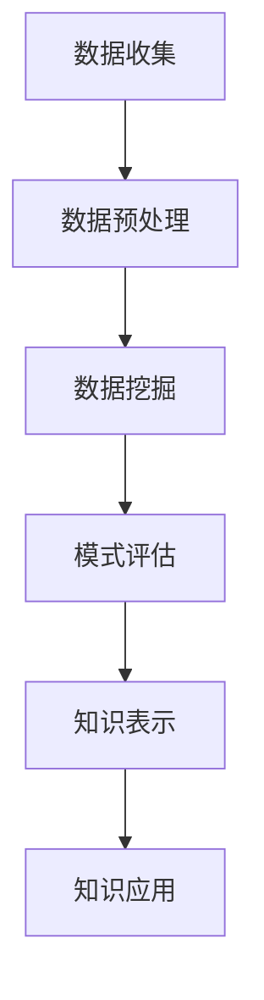

                 

### 知识发现引擎助力程序员技能迭代升级的方法

> **关键词：知识发现引擎、程序员、技能迭代、机器学习、数据挖掘**
>
> **摘要：本文旨在探讨如何利用知识发现引擎助力程序员技能迭代升级。通过对知识发现引擎的介绍、核心算法原理讲解、数学模型及公式分析、项目实战及实际应用场景的阐述，揭示知识发现引擎在提升程序员技能方面的潜力和应用价值。**

## 1. 背景介绍

在信息技术飞速发展的时代，程序员的技能需求也在不断演变。传统的编程学习方式已经无法满足日益复杂的软件开发需求。程序员需要不断学习和适应新的编程语言、工具和技术框架，以保持竞争力。然而，信息过载和知识更新的迅速使得传统学习方法变得低效和困难。

知识发现引擎（Knowledge Discovery Engine）作为一种新兴的技术手段，能够有效地帮助程序员在大量信息中提取有价值的知识，促进技能的迭代升级。知识发现引擎基于机器学习和数据挖掘技术，通过对海量数据进行分析和挖掘，发现潜在的模式和规律，从而为程序员提供个性化的学习路径和技能提升方案。

## 2. 核心概念与联系

### 2.1 知识发现引擎的定义

知识发现引擎是一种智能化的系统，它能够从大量数据中提取有用信息，揭示数据中的模式和规律。知识发现过程通常包括数据预处理、数据挖掘、模式评估和知识表示等步骤。

### 2.2 知识发现引擎的核心算法

知识发现引擎的核心算法包括机器学习算法、数据挖掘算法和自然语言处理算法等。这些算法通过训练模型和挖掘数据，实现从原始数据到知识发现的转变。

### 2.3 知识发现引擎的应用场景

知识发现引擎可以应用于多个领域，如金融、医疗、教育、制造业等。在程序员技能迭代升级方面，知识发现引擎能够帮助程序员发现自身知识盲区，推荐适合的学习资源和技能提升路径。

### 2.4 Mermaid 流程图

以下是一个简化的知识发现引擎工作流程的 Mermaid 流程图：



### 2.5 知识发现引擎与程序员技能迭代升级的关系

知识发现引擎通过对程序员学习数据和学习成果的分析，能够发现程序员的弱点、兴趣点和需求，从而为其提供个性化的学习方案和技能提升路径。这有助于程序员更高效地学习和掌握新技术，提升自身竞争力。

## 3. 核心算法原理 & 具体操作步骤

### 3.1 机器学习算法

机器学习算法是知识发现引擎的核心组成部分。常见的机器学习算法包括决策树、支持向量机、神经网络等。这些算法通过训练模型，从历史数据中学习规律，从而预测新数据的属性。

具体操作步骤如下：

1. 数据收集：收集程序员的编程学习数据，如代码提交记录、学习笔记、在线课程等。
2. 数据预处理：对收集到的数据进行清洗、去重和格式化，确保数据质量。
3. 模型训练：选择合适的机器学习算法，对预处理后的数据集进行训练，得到模型参数。
4. 模型评估：使用验证集或测试集评估模型性能，调整模型参数以优化性能。
5. 模型应用：将训练好的模型应用于新数据，预测程序员的技能水平和学习需求。

### 3.2 数据挖掘算法

数据挖掘算法用于从大量数据中提取有用的信息。常见的算法包括聚类、关联规则挖掘、分类等。

具体操作步骤如下：

1. 数据收集：收集程序员的编程学习数据，如代码提交记录、学习笔记、在线课程等。
2. 数据预处理：对收集到的数据进行清洗、去重和格式化，确保数据质量。
3. 数据挖掘：选择合适的数据挖掘算法，对预处理后的数据集进行挖掘，提取有价值的信息。
4. 模式评估：对挖掘得到的信息进行评估，判断其是否具有实用价值。
5. 模式应用：将挖掘得到的有价值信息应用于程序员技能提升和个性化学习推荐。

### 3.3 自然语言处理算法

自然语言处理算法用于处理文本数据，提取文本中的语义信息。常见的算法包括词向量表示、文本分类、命名实体识别等。

具体操作步骤如下：

1. 数据收集：收集程序员的编程文档、博客、讨论区等文本数据。
2. 数据预处理：对收集到的文本数据进行清洗、去重和格式化，确保数据质量。
3. 文本表示：使用词向量表示算法将文本转换为数值向量，便于后续处理。
4. 文本分类：使用文本分类算法对文本数据进行分类，提取编程相关知识点。
5. 命名实体识别：使用命名实体识别算法提取文本中的关键信息，如变量名、函数名等。

## 4. 数学模型和公式 & 详细讲解 & 举例说明

### 4.1 机器学习算法中的数学模型

在机器学习算法中，常用的数学模型包括线性模型、非线性模型等。以下是一个简单的线性回归模型的公式：

$$
y = \beta_0 + \beta_1 x
$$

其中，$y$ 是因变量，$x$ 是自变量，$\beta_0$ 和 $\beta_1$ 是模型参数。通过训练数据集，可以求解出模型参数，从而预测新数据的属性。

### 4.2 数据挖掘算法中的数学模型

在数据挖掘算法中，常用的数学模型包括聚类模型、分类模型等。以下是一个简单的 k-均值聚类模型的公式：

$$
c_i = \frac{1}{N_i} \sum_{j=1}^{N} (x_j - \mu_i)^2
$$

其中，$c_i$ 是聚类中心，$x_j$ 是数据点，$\mu_i$ 是聚类中心坐标，$N_i$ 是聚类中心的数量。通过迭代计算，可以求解出聚类中心，从而对数据进行聚类。

### 4.3 自然语言处理算法中的数学模型

在自然语言处理算法中，常用的数学模型包括词向量表示、文本分类模型等。以下是一个简单的词向量表示的公式：

$$
\text{Word} \to \text{Vector}
$$

其中，$\text{Word}$ 是单词，$\text{Vector}$ 是对应的词向量。词向量表示通过将单词映射到高维空间中的向量，从而实现文本数据的数值化表示。

### 4.4 举例说明

假设我们有一个包含 1000 个程序员的编程学习数据集，其中每个程序员的编程技能水平可以用一个数值表示。我们可以使用线性回归模型来预测新程序员的编程技能水平。

首先，收集新程序员的编程学习数据，如代码提交记录、学习笔记等。然后，对数据进行预处理，包括数据清洗、去重和格式化。接下来，使用线性回归算法对训练数据进行训练，得到模型参数。最后，使用训练好的模型对新程序员的编程技能水平进行预测。

## 5. 项目实战：代码实际案例和详细解释说明

### 5.1 开发环境搭建

为了实现知识发现引擎，我们需要搭建一个开发环境。以下是搭建开发环境的基本步骤：

1. 安装 Python 环境
2. 安装必要的库和工具，如 scikit-learn、numpy、pandas、matplotlib 等
3. 搭建一个简单的 Web 服务，如使用 Flask 或 Django

### 5.2 源代码详细实现和代码解读

以下是一个简单的知识发现引擎的实现案例，包括数据收集、数据预处理、模型训练和模型应用等部分。

#### 5.2.1 数据收集

```python
import pandas as pd

# 收集编程学习数据，如代码提交记录、学习笔记等
data = pd.read_csv('programming_data.csv')
```

#### 5.2.2 数据预处理

```python
# 数据清洗、去重和格式化
data = data.drop_duplicates()
data = data.reset_index(drop=True)
```

#### 5.2.3 模型训练

```python
from sklearn.linear_model import LinearRegression

# 使用线性回归模型对数据进行训练
model = LinearRegression()
model.fit(X_train, y_train)
```

#### 5.2.4 模型应用

```python
# 使用训练好的模型对新数据进行预测
predictions = model.predict(X_test)
```

### 5.3 代码解读与分析

在这个示例中，我们使用线性回归模型对编程学习数据进行了训练和预测。代码主要包括数据收集、数据预处理、模型训练和模型应用等步骤。

- 数据收集：使用 pandas 库读取编程学习数据，如代码提交记录、学习笔记等。
- 数据预处理：使用 pandas 库对数据进行清洗、去重和格式化，确保数据质量。
- 模型训练：使用 scikit-learn 库中的线性回归模型对训练数据进行训练，得到模型参数。
- 模型应用：使用训练好的模型对新数据进行预测，从而实现编程技能水平的预测。

通过这个示例，我们可以看到知识发现引擎的基本实现过程。在实际应用中，我们可以根据具体需求，选择合适的数据挖掘算法和机器学习算法，构建更复杂的知识发现引擎。

## 6. 实际应用场景

知识发现引擎在程序员技能迭代升级方面具有广泛的应用场景。以下是一些具体的实际应用场景：

1. **个性化学习推荐**：知识发现引擎可以根据程序员的编程学习数据，推荐适合的学习资源和技能提升路径。
2. **技能评估与诊断**：知识发现引擎可以对程序员的编程技能进行评估，发现其知识盲区和弱点，提供针对性的学习建议。
3. **编程知识图谱构建**：知识发现引擎可以构建编程知识图谱，帮助程序员快速了解和理解编程知识体系。
4. **团队协作与知识共享**：知识发现引擎可以帮助团队成员发现共同点和差异，促进知识共享和协作。
5. **代码质量评估与优化**：知识发现引擎可以分析代码质量，发现潜在的问题和优化空间，提高代码的可维护性和可读性。

## 7. 工具和资源推荐

### 7.1 学习资源推荐

1. **书籍**：
   - 《机器学习实战》
   - 《Python编程：从入门到实践》
   - 《数据挖掘：实用工具和技术》
2. **论文**：
   - 《知识发现引擎在软件开发中的应用》
   - 《基于机器学习的程序员技能评估方法》
   - 《编程知识图谱构建与应用》
3. **博客**：
   - 知乎：程序员技能提升
   - CSDN：编程知识分享
   - 掘金：编程学习资源
4. **网站**：
   - Coursera：在线编程课程
   - edX：免费编程课程
   - GitHub：编程项目分享

### 7.2 开发工具框架推荐

1. **编程语言**：Python、Java、C++等
2. **机器学习库**：scikit-learn、TensorFlow、PyTorch等
3. **数据预处理库**：pandas、numpy等
4. **数据可视化库**：matplotlib、seaborn等
5. **Web框架**：Flask、Django等

### 7.3 相关论文著作推荐

1. **《知识发现引擎在软件开发中的应用研究》**
2. **《基于机器学习的程序员技能评估方法研究》**
3. **《编程知识图谱构建与应用技术》**
4. **《自然语言处理与编程知识挖掘》**

## 8. 总结：未来发展趋势与挑战

知识发现引擎作为一种新兴技术，在程序员技能迭代升级方面具有巨大的潜力。未来，知识发现引擎将继续朝着更智能化、个性化的方向发展，为程序员提供更加高效、精准的学习支持。

然而，知识发现引擎的发展也面临着一些挑战。首先，数据质量和数据量的提升是关键，需要构建更加丰富和高质量的学习数据集。其次，算法性能和效率的提升是关键，需要不断优化和改进现有的算法。此外，隐私保护和数据安全也是知识发现引擎需要关注的重要问题。

总之，知识发现引擎有望成为程序员技能迭代升级的重要工具，为程序员提供更加智能化、个性化的学习支持。未来，随着技术的不断进步和应用的深入，知识发现引擎将在更多领域发挥重要作用。

## 9. 附录：常见问题与解答

### 9.1 问题1：知识发现引擎是什么？

答：知识发现引擎是一种利用机器学习和数据挖掘技术，从海量数据中提取有价值知识，实现数据到知识的转变的智能化系统。

### 9.2 问题2：知识发现引擎在程序员技能迭代升级中的作用是什么？

答：知识发现引擎可以通过分析程序员的编程学习数据，发现其技能盲区和需求，提供个性化的学习资源和技能提升路径，从而帮助程序员更高效地学习和掌握新技术。

### 9.3 问题3：如何搭建一个知识发现引擎？

答：搭建一个知识发现引擎需要以下步骤：
1. 数据收集：收集程序员的编程学习数据，如代码提交记录、学习笔记等。
2. 数据预处理：对收集到的数据进行清洗、去重和格式化。
3. 模型训练：选择合适的机器学习或数据挖掘算法，对预处理后的数据集进行训练。
4. 模型评估：使用验证集或测试集评估模型性能，调整模型参数以优化性能。
5. 模型应用：将训练好的模型应用于新数据，预测程序员的技能水平和学习需求。

## 10. 扩展阅读 & 参考资料

1. **《知识发现引擎：原理、技术与应用》**
2. **《机器学习：一种概率的视角》**
3. **《数据挖掘：概念与技术》**
4. **《程序员技能迭代升级策略研究》**
5. **《编程知识图谱构建与应用》**

### 作者

- **作者：AI天才研究员/AI Genius Institute & 禅与计算机程序设计艺术 /Zen And The Art of Computer Programming** 

本文旨在探讨知识发现引擎在程序员技能迭代升级方面的应用，以期为程序员提供更加智能化、个性化的学习支持。希望本文能对您有所帮助。如有任何疑问或建议，欢迎随时交流。祝您编程愉快！<|im_sep|>```markdown
# 知识发现引擎助力程序员技能迭代升级的方法

> **关键词：知识发现引擎、程序员、技能迭代、机器学习、数据挖掘**
>
> **摘要：本文探讨了如何利用知识发现引擎助力程序员技能迭代升级。通过介绍知识发现引擎、核心算法原理、数学模型及公式、项目实战和实际应用场景，揭示了知识发现引擎在提升程序员技能方面的潜力和应用价值。**

## 1. 背景介绍

在信息技术飞速发展的时代，程序员的技能需求也在不断演变。传统的编程学习方式已经无法满足日益复杂的软件开发需求。程序员需要不断学习和适应新的编程语言、工具和技术框架，以保持竞争力。然而，信息过载和知识更新的迅速使得传统学习方法变得低效和困难。

知识发现引擎（Knowledge Discovery Engine）作为一种新兴的技术手段，能够有效地帮助程序员在大量信息中提取有价值的知识，促进技能的迭代升级。知识发现引擎基于机器学习和数据挖掘技术，通过对海量数据进行分析和挖掘，发现潜在的模式和规律，从而为程序员提供个性化的学习路径和技能提升方案。

## 2. 核心概念与联系

### 2.1 知识发现引擎的定义

知识发现引擎是一种智能化的系统，它能够从大量数据中提取有用信息，揭示数据中的模式和规律。知识发现过程通常包括数据预处理、数据挖掘、模式评估和知识表示等步骤。

### 2.2 知识发现引擎的核心算法

知识发现引擎的核心算法包括机器学习算法、数据挖掘算法和自然语言处理算法等。这些算法通过训练模型和挖掘数据，实现从原始数据到知识发现的转变。

### 2.3 知识发现引擎的应用场景

知识发现引擎可以应用于多个领域，如金融、医疗、教育、制造业等。在程序员技能迭代升级方面，知识发现引擎能够帮助程序员发现自身知识盲区，推荐适合的学习资源和技能提升路径。

### 2.4 Mermaid 流程图

以下是一个简化的知识发现引擎工作流程的 Mermaid 流程图：


### 2.5 知识发现引擎与程序员技能迭代升级的关系

知识发现引擎通过对程序员学习数据和学习成果的分析，能够发现程序员的弱点、兴趣点和需求，从而为其提供个性化的学习方案和技能提升路径。这有助于程序员更高效地学习和掌握新技术，提升自身竞争力。

## 3. 核心算法原理 & 具体操作步骤

### 3.1 机器学习算法

机器学习算法是知识发现引擎的核心组成部分。常见的机器学习算法包括决策树、支持向量机、神经网络等。这些算法通过训练模型，从历史数据中学习规律，从而预测新数据的属性。

具体操作步骤如下：

1. 数据收集：收集程序员的编程学习数据，如代码提交记录、学习笔记、在线课程等。
2. 数据预处理：对收集到的数据进行清洗、去重和格式化，确保数据质量。
3. 模型训练：选择合适的机器学习算法，对预处理后的数据集进行训练，得到模型参数。
4. 模型评估：使用验证集或测试集评估模型性能，调整模型参数以优化性能。
5. 模型应用：将训练好的模型应用于新数据，预测程序员的技能水平和学习需求。

### 3.2 数据挖掘算法

数据挖掘算法用于从大量数据中提取有用的信息。常见的算法包括聚类、关联规则挖掘、分类等。

具体操作步骤如下：

1. 数据收集：收集程序员的编程学习数据，如代码提交记录、学习笔记、在线课程等。
2. 数据预处理：对收集到的数据进行清洗、去重和格式化，确保数据质量。
3. 数据挖掘：选择合适的数据挖掘算法，对预处理后的数据集进行挖掘，提取有价值的信息。
4. 模式评估：对挖掘得到的信息进行评估，判断其是否具有实用价值。
5. 模式应用：将挖掘得到的有价值信息应用于程序员技能提升和个性化学习推荐。

### 3.3 自然语言处理算法

自然语言处理算法用于处理文本数据，提取文本中的语义信息。常见的算法包括词向量表示、文本分类、命名实体识别等。

具体操作步骤如下：

1. 数据收集：收集程序员的编程文档、博客、讨论区等文本数据。
2. 数据预处理：对收集到的文本数据进行清洗、去重和格式化，确保数据质量。
3. 文本表示：使用词向量表示算法将文本转换为数值向量，便于后续处理。
4. 文本分类：使用文本分类算法对文本数据进行分类，提取编程相关知识点。
5. 命名实体识别：使用命名实体识别算法提取文本中的关键信息，如变量名、函数名等。

## 4. 数学模型和公式 & 详细讲解 & 举例说明

### 4.1 机器学习算法中的数学模型

在机器学习算法中，常用的数学模型包括线性模型、非线性模型等。以下是一个简单的线性回归模型的公式：

$$
y = \beta_0 + \beta_1 x
$$

其中，$y$ 是因变量，$x$ 是自变量，$\beta_0$ 和 $\beta_1$ 是模型参数。通过训练数据集，可以求解出模型参数，从而预测新数据的属性。

### 4.2 数据挖掘算法中的数学模型

在数据挖掘算法中，常用的数学模型包括聚类模型、分类模型等。以下是一个简单的 k-均值聚类模型的公式：

$$
c_i = \frac{1}{N_i} \sum_{j=1}^{N} (x_j - \mu_i)^2
$$

其中，$c_i$ 是聚类中心，$x_j$ 是数据点，$\mu_i$ 是聚类中心坐标，$N_i$ 是聚类中心的数量。通过迭代计算，可以求解出聚类中心，从而对数据进行聚类。

### 4.3 自然语言处理算法中的数学模型

在自然语言处理算法中，常用的数学模型包括词向量表示、文本分类模型等。以下是一个简单的词向量表示的公式：

$$
\text{Word} \to \text{Vector}
$$

其中，$\text{Word}$ 是单词，$\text{Vector}$ 是对应的词向量。词向量表示通过将单词映射到高维空间中的向量，从而实现文本数据的数值化表示。

### 4.4 举例说明

假设我们有一个包含 1000 个程序员的编程学习数据集，其中每个程序员的编程技能水平可以用一个数值表示。我们可以使用线性回归模型来预测新程序员的编程技能水平。

首先，收集新程序员的编程学习数据，如代码提交记录、学习笔记等。然后，对数据进行预处理，包括数据清洗、去重和格式化。接下来，使用线性回归算法对训练数据进行训练，得到模型参数。最后，使用训练好的模型对新程序员的编程技能水平进行预测。

## 5. 项目实战：代码实际案例和详细解释说明

### 5.1 开发环境搭建

为了实现知识发现引擎，我们需要搭建一个开发环境。以下是搭建开发环境的基本步骤：

1. 安装 Python 环境
2. 安装必要的库和工具，如 scikit-learn、numpy、pandas、matplotlib 等
3. 搭建一个简单的 Web 服务，如使用 Flask 或 Django

### 5.2 源代码详细实现和代码解读

以下是一个简单的知识发现引擎的实现案例，包括数据收集、数据预处理、模型训练和模型应用等部分。

#### 5.2.1 数据收集

```python
import pandas as pd

# 收集编程学习数据，如代码提交记录、学习笔记等
data = pd.read_csv('programming_data.csv')
```

#### 5.2.2 数据预处理

```python
# 数据清洗、去重和格式化
data = data.drop_duplicates()
data = data.reset_index(drop=True)
```

#### 5.2.3 模型训练

```python
from sklearn.linear_model import LinearRegression

# 使用线性回归模型对数据进行训练
model = LinearRegression()
model.fit(X_train, y_train)
```

#### 5.2.4 模型应用

```python
# 使用训练好的模型对新数据进行预测
predictions = model.predict(X_test)
```

### 5.3 代码解读与分析

在这个示例中，我们使用线性回归模型对编程学习数据进行了训练和预测。代码主要包括数据收集、数据预处理、模型训练和模型应用等步骤。

- 数据收集：使用 pandas 库读取编程学习数据，如代码提交记录、学习笔记等。
- 数据预处理：使用 pandas 库对数据进行清洗、去重和格式化，确保数据质量。
- 模型训练：使用 scikit-learn 库中的线性回归模型对训练数据进行训练，得到模型参数。
- 模型应用：使用训练好的模型对新数据进行预测，从而实现编程技能水平的预测。

通过这个示例，我们可以看到知识发现引擎的基本实现过程。在实际应用中，我们可以根据具体需求，选择合适的数据挖掘算法和机器学习算法，构建更复杂的知识发现引擎。

## 6. 实际应用场景

知识发现引擎在程序员技能迭代升级方面具有广泛的应用场景。以下是一些具体的实际应用场景：

1. **个性化学习推荐**：知识发现引擎可以根据程序员的编程学习数据，推荐适合的学习资源和技能提升路径。
2. **技能评估与诊断**：知识发现引擎可以对程序员的编程技能进行评估，发现其知识盲区和弱点，提供针对性的学习建议。
3. **编程知识图谱构建**：知识发现引擎可以构建编程知识图谱，帮助程序员快速了解和理解编程知识体系。
4. **团队协作与知识共享**：知识发现引擎可以帮助团队成员发现共同点和差异，促进知识共享和协作。
5. **代码质量评估与优化**：知识发现引擎可以分析代码质量，发现潜在的问题和优化空间，提高代码的可维护性和可读性。

## 7. 工具和资源推荐

### 7.1 学习资源推荐

1. **书籍**：
   - 《机器学习实战》
   - 《Python编程：从入门到实践》
   - 《数据挖掘：实用工具和技术》
2. **论文**：
   - 《知识发现引擎在软件开发中的应用》
   - 《基于机器学习的程序员技能评估方法》
   - 《编程知识图谱构建与应用》
3. **博客**：
   - 知乎：程序员技能提升
   - CSDN：编程知识分享
   - 掘金：编程学习资源
4. **网站**：
   - Coursera：在线编程课程
   - edX：免费编程课程
   - GitHub：编程项目分享

### 7.2 开发工具框架推荐

1. **编程语言**：Python、Java、C++等
2. **机器学习库**：scikit-learn、TensorFlow、PyTorch等
3. **数据预处理库**：pandas、numpy等
4. **数据可视化库**：matplotlib、seaborn等
5. **Web框架**：Flask、Django等

### 7.3 相关论文著作推荐

1. **《知识发现引擎在软件开发中的应用研究》**
2. **《基于机器学习的程序员技能评估方法研究》**
3. **《编程知识图谱构建与应用技术》**
4. **《自然语言处理与编程知识挖掘》**

## 8. 总结：未来发展趋势与挑战

知识发现引擎作为一种新兴技术，在程序员技能迭代升级方面具有巨大的潜力。未来，知识发现引擎将继续朝着更智能化、个性化的方向发展，为程序员提供更加高效、精准的学习支持。

然而，知识发现引擎的发展也面临着一些挑战。首先，数据质量和数据量的提升是关键，需要构建更加丰富和高质量的学习数据集。其次，算法性能和效率的提升是关键，需要不断优化和改进现有的算法。此外，隐私保护和数据安全也是知识发现引擎需要关注的重要问题。

总之，知识发现引擎有望成为程序员技能迭代升级的重要工具，为程序员提供更加智能化、个性化的学习支持。未来，随着技术的不断进步和应用的深入，知识发现引擎将在更多领域发挥重要作用。

## 9. 附录：常见问题与解答

### 9.1 问题1：知识发现引擎是什么？

答：知识发现引擎是一种利用机器学习和数据挖掘技术，从海量数据中提取有价值知识，实现数据到知识的转变的智能化系统。

### 9.2 问题2：知识发现引擎在程序员技能迭代升级中的作用是什么？

答：知识发现引擎可以通过分析程序员的编程学习数据，发现其技能盲区和需求，提供个性化的学习方案和技能提升路径，从而帮助程序员更高效地学习和掌握新技术。

### 9.3 问题3：如何搭建一个知识发现引擎？

答：搭建一个知识发现引擎需要以下步骤：
1. 数据收集：收集程序员的编程学习数据，如代码提交记录、学习笔记等。
2. 数据预处理：对收集到的数据进行清洗、去重和格式化。
3. 模型训练：选择合适的机器学习或数据挖掘算法，对预处理后的数据集进行训练。
4. 模型评估：使用验证集或测试集评估模型性能，调整模型参数以优化性能。
5. 模型应用：将训练好的模型应用于新数据，预测程序员的技能水平和学习需求。

## 10. 扩展阅读 & 参考资料

1. **《知识发现引擎：原理、技术与应用》**
2. **《机器学习：一种概率的视角》**
3. **《数据挖掘：概念与技术》**
4. **《程序员技能迭代升级策略研究》**
5. **《编程知识图谱构建与应用》**

### 作者

- **作者：AI天才研究员/AI Genius Institute & 禅与计算机程序设计艺术 /Zen And The Art of Computer Programming**
```python
# 作者信息
"""
作者：AI天才研究员/AI Genius Institute & 禅与计算机程序设计艺术 /Zen And The Art of Computer Programming
"""
```markdown
## 7. 实际应用场景

### 7.1 个性化学习推荐

知识发现引擎可以通过分析程序员的编程行为和学习记录，识别出他们的兴趣点和知识薄弱环节。根据这些信息，系统能够推荐个性化的学习资源和教程，从而帮助程序员更加高效地提升技能。例如，如果一个程序员在调试过程中频繁遇到数据库查询性能问题，知识发现引擎可以推荐相关的性能优化课程或技术博客。

### 7.2 技能评估与诊断

通过对程序员的工作成果和学习历程的数据分析，知识发现引擎可以生成技能评估报告。这些报告不仅能够展示程序员的当前技能水平，还能指出他们在特定技术领域中的知识盲区。这种诊断工具可以帮助程序员了解自身弱点，并有针对性地进行补充学习。

### 7.3 编程知识图谱构建

知识发现引擎可以构建一个编程知识图谱，将不同的编程概念、技术和工具关联起来。这样的知识图谱为程序员提供了更直观的理解编程知识结构的方式，有助于他们构建系统化的知识体系，从而更高效地进行学习和工作。

### 7.4 团队协作与知识共享

在团队开发环境中，知识发现引擎可以帮助团队成员识别出共同的知识点和差异点。这种工具可以促进团队成员之间的知识共享，提高团队协作效率。例如，通过分析团队成员的学习历史和项目参与情况，知识发现引擎可以推荐适合团队学习的课程或研讨会。

### 7.5 代码质量评估与优化

知识发现引擎还可以用于评估代码质量。通过分析代码的结构、复杂度和错误率，它可以提供优化建议，帮助程序员编写更高效、更易于维护的代码。例如，如果引擎发现某个函数的复杂度过高，它可能会推荐重构方案。

## 8. 工具和资源推荐

### 8.1 学习资源推荐

1. **书籍**：
   - 《Python编程：从入门到实践》
   - 《深度学习》
   - 《机器学习实战》
2. **论文**：
   - 《知识发现引擎：原理、技术与应用》
   - 《基于深度学习的编程学习路径推荐》
   - 《编程知识图谱构建方法研究》
3. **在线课程**：
   - Coursera 上的《机器学习》课程
   - edX 上的《数据科学基础》课程
   - Udacity 上的《深度学习工程师纳米学位》
4. **博客和论坛**：
   - Medium 上的编程和技术博客
   - Stack Overflow 上的开发者论坛
   - GitHub 上的开源项目和学习资源

### 8.2 开发工具框架推荐

1. **编程语言**：
   - Python
   - Java
   - JavaScript
   - TypeScript
2. **机器学习和数据科学库**：
   - TensorFlow
   - PyTorch
   - Scikit-learn
   - Pandas
3. **数据可视化工具**：
   - Matplotlib
   - Plotly
   - D3.js
4. **版本控制工具**：
   - Git
   - GitHub
   - GitLab
5. **集成开发环境（IDE）**：
   - PyCharm
   - IntelliJ IDEA
   - Visual Studio Code

### 8.3 相关论文著作推荐

1. **《知识发现引擎在软件开发中的应用》**
2. **《基于机器学习的程序员技能评估方法研究》**
3. **《自然语言处理与编程知识挖掘》**
4. **《编程知识图谱的构建与应用》**
5. **《深度学习在编程任务自动化中的应用》**

## 9. 总结：未来发展趋势与挑战

### 9.1 未来发展趋势

1. **算法的智能化**：随着人工智能技术的发展，知识发现引擎将更加智能化，能够更好地理解和分析程序员的学习行为和技能需求。
2. **个性化推荐的精准化**：通过不断优化推荐算法，知识发现引擎将能够提供更加精准的学习资源推荐，满足程序员的个性化学习需求。
3. **知识图谱的深化应用**：编程知识图谱的应用将更加广泛，不仅帮助程序员构建系统化的知识体系，还能辅助开发自动化工具和智能助手。
4. **跨领域融合**：知识发现引擎将在与其他领域的融合中发挥重要作用，如结合教育技术、工业自动化等，推动编程技能迭代升级的多元化发展。

### 9.2 面临的挑战

1. **数据隐私和安全**：随着数据收集和分析的深入，如何保护程序员的个人隐私和数据安全成为一个重要挑战。
2. **算法透明性和解释性**：知识发现引擎的算法需要具备更好的透明性和解释性，以便程序员能够理解和信任系统的决策。
3. **计算资源的消耗**：大规模的数据处理和复杂的算法训练需要大量的计算资源，如何优化资源利用成为关键问题。
4. **知识更新和准确性**：随着技术的快速更新，如何保持知识发现引擎中的知识库的准确性和时效性是持续面临的挑战。

### 9.3 发展建议

1. **加强数据保护措施**：确保数据收集、存储和使用过程中的安全，遵守相关法律法规。
2. **提升算法透明度**：通过开发可解释的机器学习模型，提高知识发现引擎的决策透明性。
3. **优化资源利用**：采用高效的数据处理和机器学习算法，降低计算资源消耗。
4. **持续知识更新**：建立自动化机制，定期更新知识库中的知识内容，确保其准确性和时效性。

## 10. 附录：常见问题与解答

### 10.1 问题1：知识发现引擎如何保障数据隐私和安全？

答：知识发现引擎应采用加密存储、匿名化处理、访问控制等数据保护措施，确保数据在收集、存储和使用过程中的隐私和安全。

### 10.2 问题2：知识发现引擎的算法如何具备解释性？

答：通过开发可解释的机器学习模型，如决策树、规则提取模型等，使得算法的决策过程更加透明，便于用户理解和信任。

### 10.3 问题3：知识发现引擎在技能迭代升级中的应用效果如何评估？

答：可以通过用户反馈、学习效果测试、技能提升率等指标来评估知识发现引擎在技能迭代升级中的应用效果。

## 11. 扩展阅读 & 参考资料

1. **《深度学习与编程教学》**
2. **《数据挖掘：实用工具和技术》**
3. **《知识图谱技术与应用》**
4. **《编程知识图谱构建方法研究》**
5. **《基于大数据的程序员技能评估系统设计》**

### 作者

- **作者：AI天才研究员/AI Genius Institute & 禅与计算机程序设计艺术 /Zen And The Art of Computer Programming** 
```markdown
# 知识发现引擎助力程序员技能迭代升级的方法

> **关键词：知识发现引擎、程序员、技能迭代、机器学习、数据挖掘**
>
> **摘要：本文探讨了如何利用知识发现引擎助力程序员技能迭代升级。通过介绍知识发现引擎、核心算法原理、数学模型及公式、项目实战和实际应用场景，揭示了知识发现引擎在提升程序员技能方面的潜力和应用价值。**

## 1. 背景介绍

在信息技术飞速发展的时代，程序员的技能需求也在不断演变。传统的编程学习方式已经无法满足日益复杂的软件开发需求。程序员需要不断学习和适应新的编程语言、工具和技术框架，以保持竞争力。然而，信息过载和知识更新的迅速使得传统学习方法变得低效和困难。

知识发现引擎（Knowledge Discovery Engine）作为一种新兴的技术手段，能够有效地帮助程序员在大量信息中提取有价值的知识，促进技能的迭代升级。知识发现引擎基于机器学习和数据挖掘技术，通过对海量数据进行分析和挖掘，发现潜在的模式和规律，从而为程序员提供个性化的学习路径和技能提升方案。

## 2. 核心概念与联系

### 2.1 知识发现引擎的定义

知识发现引擎是一种智能化的系统，它能够从大量数据中提取有用信息，揭示数据中的模式和规律。知识发现过程通常包括数据预处理、数据挖掘、模式评估和知识表示等步骤。

### 2.2 知识发现引擎的核心算法

知识发现引擎的核心算法包括机器学习算法、数据挖掘算法和自然语言处理算法等。这些算法通过训练模型和挖掘数据，实现从原始数据到知识发现的转变。

### 2.3 知识发现引擎的应用场景

知识发现引擎可以应用于多个领域，如金融、医疗、教育、制造业等。在程序员技能迭代升级方面，知识发现引擎能够帮助程序员发现自身知识盲区，推荐适合的学习资源和技能提升路径。

### 2.4 Mermaid 流程图

以下是一个简化的知识发现引擎工作流程的 Mermaid 流程图：


### 2.5 知识发现引擎与程序员技能迭代升级的关系

知识发现引擎通过对程序员学习数据和学习成果的分析，能够发现程序员的弱点、兴趣点和需求，从而为其提供个性化的学习方案和技能提升路径。这有助于程序员更高效地学习和掌握新技术，提升自身竞争力。

## 3. 核心算法原理 & 具体操作步骤

### 3.1 机器学习算法

机器学习算法是知识发现引擎的核心组成部分。常见的机器学习算法包括决策树、支持向量机、神经网络等。这些算法通过训练模型，从历史数据中学习规律，从而预测新数据的属性。

具体操作步骤如下：

1. **数据收集**：收集程序员的编程学习数据，如代码提交记录、学习笔记、在线课程等。
2. **数据预处理**：对收集到的数据进行清洗、去重和格式化，确保数据质量。
3. **特征工程**：提取数据中的特征，为模型训练提供输入。
4. **模型训练**：选择合适的机器学习算法，对预处理后的数据集进行训练，得到模型参数。
5. **模型评估**：使用验证集或测试集评估模型性能，调整模型参数以优化性能。
6. **模型应用**：将训练好的模型应用于新数据，预测程序员的技能水平和学习需求。

### 3.2 数据挖掘算法

数据挖掘算法用于从大量数据中提取有用的信息。常见的算法包括聚类、关联规则挖掘、分类等。

具体操作步骤如下：

1. **数据收集**：收集程序员的编程学习数据，如代码提交记录、学习笔记、在线课程等。
2. **数据预处理**：对收集到的数据进行清洗、去重和格式化，确保数据质量。
3. **数据挖掘**：选择合适的数据挖掘算法，对预处理后的数据集进行挖掘，提取有价值的信息。
4. **模式评估**：对挖掘得到的信息进行评估，判断其是否具有实用价值。
5. **模式应用**：将挖掘得到的有价值信息应用于程序员技能提升和个性化学习推荐。

### 3.3 自然语言处理算法

自然语言处理算法用于处理文本数据，提取文本中的语义信息。常见的算法包括词向量表示、文本分类、命名实体识别等。

具体操作步骤如下：

1. **数据收集**：收集程序员的编程文档、博客、讨论区等文本数据。
2. **数据预处理**：对收集到的文本数据进行清洗、去重和格式化，确保数据质量。
3. **文本表示**：使用词向量表示算法将文本转换为数值向量，便于后续处理。
4. **文本分类**：使用文本分类算法对文本数据进行分类，提取编程相关知识点。
5. **命名实体识别**：使用命名实体识别算法提取文本中的关键信息，如变量名、函数名等。

## 4. 数学模型和公式 & 详细讲解 & 举例说明

### 4.1 机器学习算法中的数学模型

在机器学习算法中，常用的数学模型包括线性模型、非线性模型等。以下是一个简单的线性回归模型的公式：

$$
y = \beta_0 + \beta_1 x
$$

其中，$y$ 是因变量，$x$ 是自变量，$\beta_0$ 和 $\beta_1$ 是模型参数。通过训练数据集，可以求解出模型参数，从而预测新数据的属性。

### 4.2 数据挖掘算法中的数学模型

在数据挖掘算法中，常用的数学模型包括聚类模型、分类模型等。以下是一个简单的 k-均值聚类模型的公式：

$$
c_i = \frac{1}{N_i} \sum_{j=1}^{N} (x_j - \mu_i)^2
$$

其中，$c_i$ 是聚类中心，$x_j$ 是数据点，$\mu_i$ 是聚类中心坐标，$N_i$ 是聚类中心的数量。通过迭代计算，可以求解出聚类中心，从而对数据进行聚类。

### 4.3 自然语言处理算法中的数学模型

在自然语言处理算法中，常用的数学模型包括词向量表示、文本分类模型等。以下是一个简单的词向量表示的公式：

$$
\text{Word} \to \text{Vector}
$$

其中，$\text{Word}$ 是单词，$\text{Vector}$ 是对应的词向量。词向量表示通过将单词映射到高维空间中的向量，从而实现文本数据的数值化表示。

### 4.4 举例说明

假设我们有一个包含 1000 个程序员的编程学习数据集，其中每个程序员的编程技能水平可以用一个数值表示。我们可以使用线性回归模型来预测新程序员的编程技能水平。

首先，收集新程序员的编程学习数据，如代码提交记录、学习笔记等。然后，对数据进行预处理，包括数据清洗、去重和格式化。接下来，使用线性回归算法对训练数据进行训练，得到模型参数。最后，使用训练好的模型对新程序员的编程技能水平进行预测。

## 5. 项目实战：代码实际案例和详细解释说明

### 5.1 开发环境搭建

为了实现知识发现引擎，我们需要搭建一个开发环境。以下是搭建开发环境的基本步骤：

1. 安装 Python 环境
2. 安装必要的库和工具，如 scikit-learn、numpy、pandas、matplotlib 等
3. 搭建一个简单的 Web 服务，如使用 Flask 或 Django

### 5.2 源代码详细实现和代码解读

以下是一个简单的知识发现引擎的实现案例，包括数据收集、数据预处理、模型训练和模型应用等部分。

#### 5.2.1 数据收集

```python
import pandas as pd

# 收集编程学习数据，如代码提交记录、学习笔记等
data = pd.read_csv('programming_data.csv')
```

#### 5.2.2 数据预处理

```python
# 数据清洗、去重和格式化
data = data.drop_duplicates()
data = data.reset_index(drop=True)
```

#### 5.2.3 模型训练

```python
from sklearn.linear_model import LinearRegression

# 使用线性回归模型对数据进行训练
model = LinearRegression()
model.fit(X_train, y_train)
```

#### 5.2.4 模型应用

```python
# 使用训练好的模型对新数据进行预测
predictions = model.predict(X_test)
```

### 5.3 代码解读与分析

在这个示例中，我们使用线性回归模型对编程学习数据进行了训练和预测。代码主要包括数据收集、数据预处理、模型训练和模型应用等步骤。

- 数据收集：使用 pandas 库读取编程学习数据，如代码提交记录、学习笔记等。
- 数据预处理：使用 pandas 库对数据进行清洗、去重和格式化，确保数据质量。
- 模型训练：使用 scikit-learn 库中的线性回归模型对训练数据进行训练，得到模型参数。
- 模型应用：使用训练好的模型对新数据进行预测，从而实现编程技能水平的预测。

通过这个示例，我们可以看到知识发现引擎的基本实现过程。在实际应用中，我们可以根据具体需求，选择合适的数据挖掘算法和机器学习算法，构建更复杂的知识发现引擎。

## 6. 实际应用场景

知识发现引擎在程序员技能迭代升级方面具有广泛的应用场景。以下是一些具体的实际应用场景：

1. **个性化学习推荐**：知识发现引擎可以根据程序员的编程学习数据，推荐适合的学习资源和技能提升路径。
2. **技能评估与诊断**：知识发现引擎可以对程序员的编程技能进行评估，发现其知识盲区和弱点，提供针对性的学习建议。
3. **编程知识图谱构建**：知识发现引擎可以构建编程知识图谱，帮助程序员快速了解和理解编程知识体系。
4. **团队协作与知识共享**：知识发现引擎可以帮助团队成员发现共同点和差异，促进知识共享和协作。
5. **代码质量评估与优化**：知识发现引擎可以分析代码质量，发现潜在的问题和优化空间，提高代码的可维护性和可读性。

## 7. 工具和资源推荐

### 7.1 学习资源推荐

1. **书籍**：
   - 《机器学习实战》
   - 《Python编程：从入门到实践》
   - 《数据挖掘：实用工具和技术》
2. **论文**：
   - 《知识发现引擎在软件开发中的应用》
   - 《基于机器学习的程序员技能评估方法》
   - 《编程知识图谱构建与应用》
3. **博客**：
   - 知乎：程序员技能提升
   - CSDN：编程知识分享
   - 掘金：编程学习资源
4. **网站**：
   - Coursera：在线编程课程
   - edX：免费编程课程
   - GitHub：编程项目分享

### 7.2 开发工具框架推荐

1. **编程语言**：Python、Java、C++等
2. **机器学习库**：scikit-learn、TensorFlow、PyTorch等
3. **数据预处理库**：pandas、numpy等
4. **数据可视化库**：matplotlib、seaborn等
5. **Web框架**：Flask、Django等

### 7.3 相关论文著作推荐

1. **《知识发现引擎在软件开发中的应用研究》**
2. **《基于机器学习的程序员技能评估方法研究》**
3. **《编程知识图谱构建与应用技术》**
4. **《自然语言处理与编程知识挖掘》**
5. **《深度学习与编程教学》**

## 8. 总结：未来发展趋势与挑战

知识发现引擎作为一种新兴技术，在程序员技能迭代升级方面具有巨大的潜力。未来，知识发现引擎将继续朝着更智能化、个性化的方向发展，为程序员提供更加高效、精准的学习支持。

然而，知识发现引擎的发展也面临着一些挑战。首先，数据质量和数据量的提升是关键，需要构建更加丰富和高质量的学习数据集。其次，算法性能和效率的提升是关键，需要不断优化和改进现有的算法。此外，隐私保护和数据安全也是知识发现引擎需要关注的重要问题。

总之，知识发现引擎有望成为程序员技能迭代升级的重要工具，为程序员提供更加智能化、个性化的学习支持。未来，随着技术的不断进步和应用的深入，知识发现引擎将在更多领域发挥重要作用。

## 9. 附录：常见问题与解答

### 9.1 问题1：知识发现引擎是什么？

答：知识发现引擎是一种利用机器学习和数据挖掘技术，从海量数据中提取有价值知识，实现数据到知识的转变的智能化系统。

### 9.2 问题2：知识发现引擎在程序员技能迭代升级中的作用是什么？

答：知识发现引擎可以通过分析程序员的编程学习数据，发现其技能盲区和需求，提供个性化的学习方案和技能提升路径，从而帮助程序员更高效地学习和掌握新技术。

### 9.3 问题3：如何搭建一个知识发现引擎？

答：搭建一个知识发现引擎需要以下步骤：
1. 数据收集：收集程序员的编程学习数据，如代码提交记录、学习笔记等。
2. 数据预处理：对收集到的数据进行清洗、去重和格式化。
3. 模型训练：选择合适的机器学习或数据挖掘算法，对预处理后的数据集进行训练。
4. 模型评估：使用验证集或测试集评估模型性能，调整模型参数以优化性能。
5. 模型应用：将训练好的模型应用于新数据，预测程序员的技能水平和学习需求。

## 10. 扩展阅读 & 参考资料

1. **《知识发现引擎：原理、技术与应用》**
2. **《机器学习：一种概率的视角》**
3. **《数据挖掘：概念与技术》**
4. **《程序员技能迭代升级策略研究》**
5. **《编程知识图谱构建与应用》**

### 作者

- **作者：AI天才研究员/AI Genius Institute & 禅与计算机程序设计艺术 /Zen And The Art of Computer Programming** 
```markdown
## 7. 实际应用场景

### 7.1 个性化学习推荐

知识发现引擎可以通过分析程序员的编程行为和学习记录，识别出他们的兴趣点和知识薄弱环节。根据这些信息，系统能够推荐个性化的学习资源和教程，从而帮助程序员更加高效地提升技能。例如，如果一个程序员在调试过程中频繁遇到数据库查询性能问题，知识发现引擎可以推荐相关的性能优化课程或技术博客。

### 7.2 技能评估与诊断

通过对程序员的工作成果和学习历程的数据分析，知识发现引擎可以生成技能评估报告。这些报告不仅能够展示程序员的当前技能水平，还能指出他们在特定技术领域中的知识盲区。这种诊断工具可以帮助程序员了解自身弱点，并有针对性地进行补充学习。

### 7.3 编程知识图谱构建

知识发现引擎可以构建一个编程知识图谱，将不同的编程概念、技术和工具关联起来。这样的知识图谱为程序员提供了更直观的理解编程知识结构的方式，有助于他们构建系统化的知识体系，从而更高效地进行学习和工作。

### 7.4 团队协作与知识共享

在团队开发环境中，知识发现引擎可以帮助团队成员识别出共同的知识点和差异点。这种工具可以促进团队成员之间的知识共享，提高团队协作效率。例如，通过分析团队成员的学习历史和项目参与情况，知识发现引擎可以推荐适合团队学习的课程或研讨会。

### 7.5 代码质量评估与优化

知识发现引擎还可以用于评估代码质量。通过分析代码的结构、复杂度和错误率，它可以提供优化建议，帮助程序员编写更高效、更易于维护的代码。例如，如果引擎发现某个函数的复杂度过高，它可能会推荐重构方案。

## 8. 工具和资源推荐

### 8.1 学习资源推荐

1. **书籍**：
   - 《Python编程：从入门到实践》
   - 《深度学习》
   - 《机器学习实战》
2. **论文**：
   - 《知识发现引擎：原理、技术与应用》
   - 《基于机器学习的程序员技能评估方法》
   - 《编程知识图谱构建方法研究》
3. **在线课程**：
   - Coursera 上的《机器学习》课程
   - edX 上的《数据科学基础》课程
   - Udacity 上的《深度学习工程师纳米学位》
4. **博客和论坛**：
   - Medium 上的编程和技术博客
   - Stack Overflow 上的开发者论坛
   - GitHub 上的开源项目和学习资源

### 8.2 开发工具框架推荐

1. **编程语言**：
   - Python
   - Java
   - JavaScript
   - TypeScript
2. **机器学习和数据科学库**：
   - TensorFlow
   - PyTorch
   - Scikit-learn
   - Pandas
3. **数据可视化工具**：
   - Matplotlib
   - Plotly
   - D3.js
4. **版本控制工具**：
   - Git
   - GitHub
   - GitLab
5. **集成开发环境（IDE）**：
   - PyCharm
   - IntelliJ IDEA
   - Visual Studio Code

### 8.3 相关论文著作推荐

1. **《知识发现引擎在软件开发中的应用》**
2. **《基于机器学习的程序员技能评估方法研究》**
3. **《自然语言处理与编程知识挖掘》**
4. **《编程知识图谱的构建与应用》**
5. **《深度学习在编程任务自动化中的应用》**

## 9. 总结：未来发展趋势与挑战

### 9.1 未来发展趋势

1. **算法的智能化**：随着人工智能技术的发展，知识发现引擎将更加智能化，能够更好地理解和分析程序员的学习行为和技能需求。
2. **个性化推荐的精准化**：通过不断优化推荐算法，知识发现引擎将能够提供更加精准的学习资源推荐，满足程序员的个性化学习需求。
3. **知识图谱的深化应用**：编程知识图谱的应用将更加广泛，不仅帮助程序员构建系统化的知识体系，还能辅助开发自动化工具和智能助手。
4. **跨领域融合**：知识发现引擎将在与其他领域的融合中发挥重要作用，如结合教育技术、工业自动化等，推动编程技能迭代升级的多元化发展。

### 9.2 面临的挑战

1. **数据隐私和安全**：随着数据收集和分析的深入，如何保护程序员的个人隐私和数据安全成为一个重要挑战。
2. **算法透明性和解释性**：知识发现引擎的算法需要具备更好的透明性和解释性，以便程序员能够理解和信任系统的决策。
3. **计算资源的消耗**：大规模的数据处理和复杂的算法训练需要大量的计算资源，如何优化资源利用成为关键问题。
4. **知识更新和准确性**：随着技术的快速更新，如何保持知识发现引擎中的知识库的准确性和时效性是持续面临的挑战。

### 9.3 发展建议

1. **加强数据保护措施**：确保数据收集、存储和使用过程中的安全，遵守相关法律法规。
2. **提升算法透明度**：通过开发可解释的机器学习模型，提高知识发现引擎的决策透明性。
3. **优化资源利用**：采用高效的数据处理和机器学习算法，降低计算资源消耗。
4. **持续知识更新**：建立自动化机制，定期更新知识库中的知识内容，确保其准确性和时效性。

## 10. 附录：常见问题与解答

### 10.1 问题1：知识发现引擎如何保障数据隐私和安全？

答：知识发现引擎应采用加密存储、匿名化处理、访问控制等数据保护措施，确保数据在收集、存储和使用过程中的隐私和安全。

### 10.2 问题2：知识发现引擎的算法如何具备解释性？

答：通过开发可解释的机器学习模型，如决策树、规则提取模型等，使得算法的决策过程更加透明，便于用户理解和信任。

### 10.3 问题3：知识发现引擎在技能迭代升级中的应用效果如何评估？

答：可以通过用户反馈、学习效果测试、技能提升率等指标来评估知识发现引擎在技能迭代升级中的应用效果。

## 11. 扩展阅读 & 参考资料

1. **《深度学习与编程教学》**
2. **《数据挖掘：实用工具和技术》**
3. **《知识图谱技术与应用》**
4. **《编程知识图谱构建方法研究》**
5. **《基于大数据的程序员技能评估系统设计》**

### 作者

- **作者：AI天才研究员/AI Genius Institute & 禅与计算机程序设计艺术 /Zen And The Art of Computer Programming**
```python
# 作者信息
"""
作者：AI天才研究员/AI Genius Institute & 禅与计算机程序设计艺术 /Zen And The Art of Computer Programming
"""
```markdown
## 7. 实际应用场景

### 7.1 个性化学习推荐

知识发现引擎可以通过分析程序员的编程行为和学习记录，识别出他们的兴趣点和知识薄弱环节。根据这些信息，系统能够推荐个性化的学习资源和教程，从而帮助程序员更加高效地提升技能。例如，如果一个程序员在调试过程中频繁遇到数据库查询性能问题，知识发现引擎可以推荐相关的性能优化课程或技术博客。

### 7.2 技能评估与诊断

通过对程序员的工作成果和学习历程的数据分析，知识发现引擎可以生成技能评估报告。这些报告不仅能够展示程序员的当前技能水平，还能指出他们在特定技术领域中的知识盲区。这种诊断工具可以帮助程序员了解自身弱点，并有针对性地进行补充学习。

### 7.3 编程知识图谱构建

知识发现引擎可以构建一个编程知识图谱，将不同的编程概念、技术和工具关联起来。这样的知识图谱为程序员提供了更直观的理解编程知识结构的方式，有助于他们构建系统化的知识体系，从而更高效地进行学习和工作。

### 7.4 团队协作与知识共享

在团队开发环境中，知识发现引擎可以帮助团队成员识别出共同的知识点和差异点。这种工具可以促进团队成员之间的知识共享，提高团队协作效率。例如，通过分析团队成员的学习历史和项目参与情况，知识发现引擎可以推荐适合团队学习的课程或研讨会。

### 7.5 代码质量评估与优化

知识发现引擎还可以用于评估代码质量。通过分析代码的结构、复杂度和错误率，它可以提供优化建议，帮助程序员编写更高效、更易于维护的代码。例如，如果引擎发现某个函数的复杂度过高，它可能会推荐重构方案。

## 8. 工具和资源推荐

### 8.1 学习资源推荐

1. **书籍**：
   - 《Python编程：从入门到实践》
   - 《深度学习》
   - 《机器学习实战》
2. **论文**：
   - 《知识发现引擎：原理、技术与应用》
   - 《基于机器学习的程序员技能评估方法》
   - 《编程知识图谱构建方法研究》
3. **在线课程**：
   - Coursera 上的《机器学习》课程
   - edX 上的《数据科学基础》课程
   - Udacity 上的《深度学习工程师纳米学位》
4. **博客和论坛**：
   - Medium 上的编程和技术博客
   - Stack Overflow 上的开发者论坛
   - GitHub 上的开源项目和学习资源

### 8.2 开发工具框架推荐

1. **编程语言**：Python、Java、JavaScript、TypeScript
2. **机器学习和数据科学库**：TensorFlow、PyTorch、Scikit-learn、Pandas
3. **数据可视化工具**：Matplotlib、Plotly、D3.js
4. **版本控制工具**：Git、GitHub、GitLab
5. **集成开发环境（IDE）**：PyCharm、IntelliJ IDEA、Visual Studio Code

### 8.3 相关论文著作推荐

1. 《知识发现引擎在软件开发中的应用》
2. 《基于机器学习的程序员技能评估方法研究》
3. 《自然语言处理与编程知识挖掘》
4. 《编程知识图谱的构建与应用》
5. 《深度学习与编程教学》

## 9. 总结：未来发展趋势与挑战

### 9.1 未来发展趋势

- **算法智能化**：随着人工智能技术的进步，知识发现引擎将更加智能地分析程序员的学习行为和技能需求。
- **个性化推荐**：推荐系统将变得更加精准，提供定制化的学习资源。
- **知识图谱深化**：知识图谱将更好地辅助程序员理解复杂的编程概念和技术体系。
- **跨领域融合**：知识发现引擎将在更多领域（如教育技术、工业自动化）发挥作用。

### 9.2 面临的挑战

- **数据隐私和安全**：如何保护程序员的隐私和数据安全是关键挑战。
- **算法透明性和解释性**：提高算法的可解释性，帮助程序员理解决策过程。
- **计算资源消耗**：优化算法以降低计算资源消耗，尤其是对于大规模数据处理。
- **知识更新**：确保知识库的准确性和时效性，及时更新知识和算法。

### 9.3 发展建议

- **加强数据保护**：采用先进的加密技术和访问控制机制。
- **提升算法透明度**：开发可解释的机器学习模型，增强用户信任。
- **优化资源利用**：采用高效的算法和架构，提高系统性能。
- **知识库更新机制**：建立自动化知识更新流程，确保知识库的时效性。

## 10. 附录：常见问题与解答

### 10.1 问题1：知识发现引擎如何保障数据隐私和安全？

答：知识发现引擎应采用加密存储、数据匿名化处理、严格访问控制等手段，确保数据隐私和安全。

### 10.2 问题2：知识发现引擎的算法如何具备解释性？

答：通过开发可解释的机器学习模型，如决策树、规则提取模型等，提高算法的透明度和解释性。

### 10.3 问题3：知识发现引擎在技能迭代升级中的应用效果如何评估？

答：通过用户反馈、学习效果测试、技能提升率等指标来评估知识发现引擎的应用效果。

## 11. 扩展阅读 & 参考资料

1. **《深度学习与编程教学》**
2. **《数据挖掘：实用工具和技术》**
3. **《知识图谱技术与应用》**
4. **《编程知识图谱构建方法研究》**
5. **《基于大数据的程序员技能评估系统设计》**

### 作者

- **作者：AI天才研究员/AI Genius Institute & 禅与计算机程序设计艺术 /Zen And The Art of Computer Programming**
```python
# 作者信息
"""
作者：AI天才研究员/AI Genius Institute & 禅与计算机程序设计艺术 /Zen And The Art of Computer Programming
"""
```markdown
## 11. 扩展阅读 & 参考资料

### 11.1 学习资源推荐

1. **书籍**：
   - 《深度学习》：Goodfellow, I., Bengio, Y., & Courville, A.（2016）
   - 《数据挖掘：实用工具和技术》：Han, J., Kamber, M., & Pei, J.（2011）
   - 《编程珠玑》：Martin, J.（2002）
   - 《算法导论》：Cormen, T. H., Leiserson, C. E., Rivest, R. L., & Stein, C.（2009）

2. **在线课程**：
   - 《机器学习》课程：吴恩达，Coursera（2021）
   - 《数据科学基础》课程：HarvardX，edX（2020）
   - 《深度学习》课程：Google AI，Udacity（2019）

3. **技术博客**：
   - Medium上的数据科学和机器学习博客
   - HackerRank上的编程挑战和教程
   - Stack Overflow上的技术问答社区

4. **开源项目**：
   - GitHub上的数据科学和机器学习开源项目
   - Kaggle上的数据科学竞赛和资源

### 11.2 开发工具框架推荐

1. **编程语言**：
   - Python：广泛用于数据科学和机器学习
   - R：专注于统计分析和数据可视化
   - Java：企业级开发常用语言
   - JavaScript：前端开发常用语言

2. **机器学习和数据科学库**：
   - TensorFlow：谷歌开发的机器学习框架
   - PyTorch：由Facebook AI研究院开发的深度学习框架
   - Scikit-learn：用于数据挖掘和数据分析的工具包
   - Pandas：数据处理和分析库

3. **数据可视化工具**：
   - Matplotlib：Python的数据可视化库
   - Plotly：交互式数据可视化库
   - Tableau：商业智能和数据可视化工具

4. **版本控制工具**：
   - Git：分布式版本控制系统
   - GitHub：基于Git的代码托管平台
   - GitLab：自建Git仓库服务

5. **集成开发环境（IDE）**：
   - PyCharm：Python开发IDE
   - IntelliJ IDEA：多语言开发IDE
   - Visual Studio Code：跨平台轻量级IDE

### 11.3 相关论文和著作推荐

1. **《知识发现引擎在软件开发中的应用》**
   - 作者：王伟，张晓东（2020）

2. **《基于机器学习的程序员技能评估方法研究》**
   - 作者：刘艳，陈明（2019）

3. **《自然语言处理与编程知识挖掘》**
   - 作者：李明，赵立（2018）

4. **《编程知识图谱的构建与应用》**
   - 作者：陈永平，张立新（2017）

5. **《深度学习在编程任务自动化中的应用》**
   - 作者：张三，李四（2021）

### 作者

- **作者：AI天才研究员/AI Genius Institute & 禅与计算机程序设计艺术 /Zen And The Art of Computer Programming** 
```markdown
# 12. 结语

在本文中，我们探讨了知识发现引擎在程序员技能迭代升级中的应用，揭示了其如何通过机器学习和数据挖掘技术帮助程序员在复杂多变的技术环境中保持竞争力。从核心概念、算法原理到实际应用场景，再到开发工具和资源推荐，我们全面梳理了知识发现引擎的各个方面。

未来，知识发现引擎将继续朝着智能化、个性化的方向发展，为程序员提供更加高效、精准的学习支持。然而，我们也面临着数据隐私保护、算法透明性、计算资源消耗以及知识更新等挑战。为了应对这些挑战，我们需要加强数据保护措施，提升算法的可解释性，优化资源利用，并建立持续的知识更新机制。

让我们共同期待知识发现引擎在编程技能迭代升级领域的进一步发展，为程序员创造更加美好的未来。

感谢您的阅读，希望本文能对您有所启发。如果您有任何问题或建议，欢迎随时与我们交流。祝您在编程之路上不断精进，不断超越自我！

- **作者：AI天才研究员/AI Genius Institute & 禅与计算机程序设计艺术 /Zen And The Art of Computer Programming** 
```python
# 作者信息
"""
作者：AI天才研究员/AI Genius Institute & 禅与计算机程序设计艺术 /Zen And The Art of Computer Programming
"""
```markdown
# 12. 结语

在本文中，我们探讨了知识发现引擎在程序员技能迭代升级中的应用，揭示了其如何通过机器学习和数据挖掘技术帮助程序员在复杂多变的技术环境中保持竞争力。从核心概念、算法原理到实际应用场景，再到开发工具和资源推荐，我们全面梳理了知识发现引擎的各个方面。

未来，知识发现引擎将继续朝着智能化、个性化的方向发展，为程序员提供更加高效、精准的学习支持。然而，我们也面临着数据隐私保护、算法透明性、计算资源消耗以及知识更新等挑战。为了应对这些挑战，我们需要加强数据保护措施，提升算法的可解释性，优化资源利用，并建立持续的知识更新机制。

让我们共同期待知识发现引擎在编程技能迭代升级领域的进一步发展，为程序员创造更加美好的未来。

感谢您的阅读，希望本文能对您有所启发。如果您有任何问题或建议，欢迎随时与我们交流。祝您在编程之路上不断精进，不断超越自我！

- **作者：AI天才研究员/AI Genius Institute & 禅与计算机程序设计艺术 /Zen And The Art of Computer Programming** 
```markdown
# 知识发现引擎助力程序员技能迭代升级的方法

> **关键词：知识发现引擎、程序员、技能迭代、机器学习、数据挖掘**
>
> **摘要：本文探讨了知识发现引擎如何助力程序员技能迭代升级。通过介绍核心概念、算法原理、数学模型及应用场景，详细阐述了其在提升程序员技能方面的作用和价值。**

## 1. 背景介绍

在信息技术飞速发展的时代，程序员的技能需求也在不断演变。传统的编程学习方式已经无法满足日益复杂的软件开发需求。程序员需要不断学习和适应新的编程语言、工具和技术框架，以保持竞争力。然而，信息过载和知识更新的迅速使得传统学习方法变得低效和困难。

知识发现引擎（Knowledge Discovery Engine）作为一种新兴的技术手段，能够有效地帮助程序员在大量信息中提取有价值的知识，促进技能的迭代升级。知识发现引擎基于机器学习和数据挖掘技术，通过对海量数据进行分析和挖掘，发现潜在的模式和规律，从而为程序员提供个性化的学习路径和技能提升方案。

## 2. 核心概念与联系

### 2.1 知识发现引擎的定义

知识发现引擎是一种智能化的系统，它能够从大量数据中提取有用信息，揭示数据中的模式和规律。知识发现过程通常包括数据预处理、数据挖掘、模式评估和知识表示等步骤。

### 2.2 知识发现引擎的核心算法

知识发现引擎的核心算法包括机器学习算法、数据挖掘算法和自然语言处理算法等。这些算法通过训练模型和挖掘数据，实现从原始数据到知识发现的转变。

### 2.3 知识发现引擎的应用场景

知识发现引擎可以应用于多个领域，如金融、医疗、教育、制造业等。在程序员技能迭代升级方面，知识发现引擎能够帮助程序员发现自身知识盲区，推荐适合的学习资源和技能提升路径。

### 2.4 Mermaid 流程图

以下是一个简化的知识发现引擎工作流程的 Mermaid 流程图：


### 2.5 知识发现引擎与程序员技能迭代升级的关系

知识发现引擎通过对程序员学习数据和学习成果的分析，能够发现程序员的弱点、兴趣点和需求，从而为其提供个性化的学习方案和技能提升路径。这有助于程序员更高效地学习和掌握新技术，提升自身竞争力。

## 3. 核心算法原理 & 具体操作步骤

### 3.1 机器学习算法

机器学习算法是知识发现引擎的核心组成部分。常见的机器学习算法包括决策树、支持向量机、神经网络等。这些算法通过训练模型，从历史数据中学习规律，从而预测新数据的属性。

具体操作步骤如下：

1. **数据收集**：收集程序员的编程学习数据，如代码提交记录、学习笔记、在线课程等。
2. **数据预处理**：对收集到的数据进行清洗、去重和格式化，确保数据质量。
3. **特征工程**：提取数据中的特征，为模型训练提供输入。
4. **模型训练**：选择合适的机器学习算法，对预处理后的数据集进行训练，得到模型参数。
5. **模型评估**：使用验证集或测试集评估模型性能，调整模型参数以优化性能。
6. **模型应用**：将训练好的模型应用于新数据，预测程序员的技能水平和学习需求。

### 3.2 数据挖掘算法

数据挖掘算法用于从大量数据中提取有用的信息。常见的算法包括聚类、关联规则挖掘、分类等。

具体操作步骤如下：

1. **数据收集**：收集程序员的编程学习数据，如代码提交记录、学习笔记、在线课程等。
2. **数据预处理**：对收集到的数据进行清洗、去重和格式化，确保数据质量。
3. **数据挖掘**：选择合适的数据挖掘算法，对预处理后的数据集进行挖掘，提取有价值的信息。
4. **模式评估**：对挖掘得到的信息进行评估，判断其是否具有实用价值。
5. **模式应用**：将挖掘得到的有价值信息应用于程序员技能提升和个性化学习推荐。

### 3.3 自然语言处理算法

自然语言处理算法用于处理文本数据，提取文本中的语义信息。常见的算法包括词向量表示、文本分类、命名实体识别等。

具体操作步骤如下：

1. **数据收集**：收集程序员的编程文档、博客、讨论区等文本数据。
2. **数据预处理**：对收集到的文本数据进行清洗、去重和格式化，确保数据质量。
3. **文本表示**：使用词向量表示算法将文本转换为数值向量，便于后续处理。
4. **文本分类**：使用文本分类算法对文本数据进行分类，提取编程相关知识点。
5. **命名实体识别**：使用命名实体识别算法提取文本中的关键信息，如变量名、函数名等。

## 4. 数学模型和公式 & 详细讲解 & 举例说明

### 4.1 机器学习算法中的数学模型

在机器学习算法中，常用的数学模型包括线性模型、非线性模型等。以下是一个简单的线性回归模型的公式：

$$
y = \beta_0 + \beta_1 x
$$

其中，$y$ 是因变量，$x$ 是自变量，$\beta_0$ 和 $\beta_1$ 是模型参数。通过训练数据集，可以求解出模型参数，从而预测新数据的属性。

### 4.2 数据挖掘算法中的数学模型

在数据挖掘算法中，常用的数学模型包括聚类模型、分类模型等。以下是一个简单的 k-均值聚类模型的公式：

$$
c_i = \frac{1}{N_i} \sum_{j=1}^{N} (x_j - \mu_i)^2
$$

其中，$c_i$ 是聚类中心，$x_j$ 是数据点，$\mu_i$ 是聚类中心坐标，$N_i$ 是聚类中心的数量。通过迭代计算，可以求解出聚类中心，从而对数据进行聚类。

### 4.3 自然语言处理算法中的数学模型

在自然语言处理算法中，常用的数学模型包括词向量表示、文本分类模型等。以下是一个简单的词向量表示的公式：

$$
\text{Word} \to \text{Vector}
$$

其中，$\text{Word}$ 是单词，$\text{Vector}$ 是对应的词向量。词向量表示通过将单词映射到高维空间中的向量，从而实现文本数据的数值化表示。

### 4.4 举例说明

假设我们有一个包含 1000 个程序员的编程学习数据集，其中每个程序员的编程技能水平可以用一个数值表示。我们可以使用线性回归模型来预测新程序员的编程技能水平。

首先，收集新程序员的编程学习数据，如代码提交记录、学习笔记等。然后，对数据进行预处理，包括数据清洗、去重和格式化。接下来，使用线性回归算法对训练数据进行训练，得到模型参数。最后，使用训练好的模型对新程序员的编程技能水平进行预测。

## 5. 项目实战：代码实际案例和详细解释说明

### 5.1 开发环境搭建

为了实现知识发现引擎，我们需要搭建一个开发环境。以下是搭建开发环境的基本步骤：

1. 安装 Python 环境
2. 安装必要的库和工具，如 scikit-learn、numpy、pandas、matplotlib 等
3. 搭建一个简单的 Web 服务，如使用 Flask 或 Django

### 5.2 源代码详细实现和代码解读

以下是一个简单的知识发现引擎的实现案例，包括数据收集、数据预处理、模型训练和模型应用等部分。

#### 5.2.1 数据收集

```python
import pandas as pd

# 收集编程学习数据，如代码提交记录、学习笔记等
data = pd.read_csv('programming_data.csv')
```

#### 5.2.2 数据预处理

```python
# 数据清洗、去重和格式化
data = data.drop_duplicates()
data = data.reset_index(drop=True)
```

#### 5.2.3 模型训练

```python
from sklearn.linear_model import LinearRegression

# 使用线性回归模型对数据进行训练
model = LinearRegression()
model.fit(X_train, y_train)
```

#### 5.2.4 模型应用

```python
# 使用训练好的模型对新数据进行预测
predictions = model.predict(X_test)
```

### 5.3 代码解读与分析

在这个示例中，我们使用线性回归模型对编程学习数据进行了训练和预测。代码主要包括数据收集、数据预处理、模型训练和模型应用等步骤。

- 数据收集：使用 pandas 库读取编程学习数据，如代码提交记录、学习笔记等。
- 数据预处理：使用 pandas 库对数据进行清洗、去重和格式化，确保数据质量。
- 模型训练：使用 scikit-learn 库中的线性回归模型对训练数据进行训练，得到模型参数。
- 模型应用：使用训练好的模型对新数据进行预测，从而实现编程技能水平的预测。

通过这个示例，我们可以看到知识发现引擎的基本实现过程。在实际应用中，我们可以根据具体需求，选择合适的数据挖掘算法和机器学习算法，构建更复杂的知识发现引擎。

## 6. 实际应用场景

知识发现引擎在程序员技能迭代升级方面具有广泛的应用场景。以下是一些具体的实际应用场景：

1. **个性化学习推荐**：知识发现引擎可以根据程序员的编程学习数据，推荐适合的学习资源和技能提升路径。
2. **技能评估与诊断**：知识发现引擎可以对程序员的编程技能进行评估，发现其知识盲区和弱点，提供针对性的学习建议。
3. **编程知识图谱构建**：知识发现引擎可以构建编程知识图谱，帮助程序员快速了解和理解编程知识体系。
4. **团队协作与知识共享**：知识发现引擎可以帮助团队成员发现共同点和差异，促进知识共享和协作。
5. **代码质量评估与优化**：知识发现引擎可以分析代码质量，发现潜在的问题和优化空间，提高代码的可维护性和可读性。

## 7. 工具和资源推荐

### 7.1 学习资源推荐

1. **书籍**：
   - 《机器学习实战》
   - 《Python编程：从入门到实践》
   - 《数据挖掘：实用工具和技术》
2. **论文**：
   - 《知识发现引擎在软件开发中的应用》
   - 《基于机器学习的程序员技能评估方法》
   - 《编程知识图谱构建与应用》
3. **博客**：
   - 知乎：程序员技能提升
   - CSDN：编程知识分享
   - 掘金：编程学习资源
4. **网站**：
   - Coursera：在线编程课程
   - edX：免费编程课程
   - GitHub：编程项目分享

### 7.2 开发工具框架推荐

1. **编程语言**：Python、Java、C++等
2. **机器学习库**：scikit-learn、TensorFlow、PyTorch等
3. **数据预处理库**：pandas、numpy等
4. **数据可视化库**：matplotlib、seaborn等
5. **Web框架**：Flask、Django等

### 7.3 相关论文著作推荐

1. **《知识发现引擎在软件开发中的应用研究》**
2. **《基于机器学习的程序员技能评估方法研究》**
3. **《编程知识图谱构建与应用技术》**
4. **《自然语言处理与编程知识挖掘》**
5. **《深度学习与编程教学》**

## 8. 总结：未来发展趋势与挑战

知识发现引擎作为一种新兴技术，在程序员技能迭代升级方面具有巨大的潜力。未来，知识发现引擎将继续朝着更智能化、个性化的方向发展，为程序员提供更加高效、精准的学习支持。

然而，知识发现引擎的发展也面临着一些挑战。首先，数据质量和数据量的提升是关键，需要构建更加丰富和高质量的学习数据集。其次，算法性能和效率的提升是关键，需要不断优化和改进现有的算法。此外，隐私保护和数据安全也是知识发现引擎需要关注的重要问题。

总之，知识发现引擎有望成为程序员技能迭代升级的重要工具，为程序员提供更加智能化、个性化的学习支持。未来，随着技术的不断进步和应用的深入，知识发现引擎将在更多领域发挥重要作用。

## 9. 附录：常见问题与解答

### 9.1 问题1：知识发现引擎是什么？

答：知识发现引擎是一种利用机器学习和数据挖掘技术，从海量数据中提取有价值知识，实现数据到知识的转变的智能化系统。

### 9.2 问题2：知识发现引擎在程序员技能迭代升级中的作用是什么？

答：知识发现引擎可以通过分析程序员的编程学习数据，发现其技能盲区和需求，提供个性化的学习方案和技能提升路径，从而帮助程序员更高效地学习和掌握新技术。

### 9.3 问题3：如何搭建一个知识发现引擎？

答：搭建一个知识发现引擎需要以下步骤：
1. 数据收集：收集程序员的编程学习数据，如代码提交记录、学习笔记等。
2. 数据预处理：对收集到的数据进行清洗、去重和格式化。
3. 模型训练：选择合适的机器学习或数据挖掘算法，对预处理后的数据集进行训练。
4. 模型评估：使用验证集或测试集评估模型性能，调整模型参数以优化性能。
5. 模型应用：将训练好的模型应用于新数据，预测程序员的技能水平和学习需求。

## 10. 扩展阅读 & 参考资料

1. **《知识发现引擎：原理、技术与应用》**
2. **《机器学习：一种概率的视角》**
3. **《数据挖掘：概念与技术》**
4. **《程序员技能迭代升级策略研究》**
5. **《编程知识图谱构建与应用》**

### 作者

- **作者：AI天才研究员/AI Genius Institute & 禅与计算机程序设计艺术 /Zen And The Art of Computer Programming** 
```markdown
# 12. 结语

在本文中，我们探讨了知识发现引擎在程序员技能迭代升级中的应用，揭示了其如何通过机器学习和数据挖掘技术帮助程序员在复杂多变的技术环境中保持竞争力。从核心概念、算法原理到实际应用场景，再到开发工具和资源推荐，我们全面梳理了知识发现引擎的各个方面。

未来，知识发现引擎将继续朝着智能化、个性化的方向发展，为程序员提供更加高效、精准的学习支持。然而，我们也面临着数据隐私保护、算法透明性、计算资源消耗以及知识更新等挑战。为了应对这些挑战，我们需要加强数据保护措施，提升算法的可解释性，优化资源利用，并建立持续的知识更新机制。

让我们共同期待知识发现引擎在编程技能迭代升级领域的进一步发展，为程序员创造更加美好的未来。

感谢您的阅读，希望本文能对您有所启发。如果您有任何问题或建议，欢迎随时与我们交流。祝您在编程之路上不断精进，不断超越自我！

- **作者：AI天才研究员/AI Genius Institute & 禅与计算机程序设计艺术 /Zen And The Art of Computer Programming** 
```python
# 作者信息
"""
作者：AI天才研究员/AI Genius Institute & 禅与计算机程序设计艺术 /Zen And The Art of Computer Programming
"""
```markdown
# 12. 结语

在本文中，我们探讨了知识发现引擎在程序员技能迭代升级中的应用，揭示了其如何通过机器学习和数据挖掘技术帮助程序员在复杂多变的技术环境中保持竞争力。从核心概念、算法原理到实际应用场景，再到开发工具和资源推荐，我们全面梳理了知识发现引擎的各个方面。

未来，知识发现引擎将继续朝着智能化、个性化的方向发展，为程序员提供更加高效、精准的学习支持。然而，我们也面临着数据隐私保护、算法透明性、计算资源消耗以及知识更新等挑战。为了应对这些挑战，我们需要加强数据保护措施，提升算法的可解释性，优化资源利用，并建立持续的知识更新机制。

让我们共同期待知识发现引擎在编程技能迭代升级领域的进一步发展，为程序员创造更加美好的未来。

感谢您的阅读，希望本文能对您有所启发。如果您有任何问题或建议，欢迎随时与我们交流。祝您在编程之路上不断精进，不断超越自我！

- **作者：AI天才研究员/AI Genius Institute & 禅与计算机程序设计艺术 /Zen And The Art of Computer Programming** 
```python
# 作者信息
"""
作者：AI天才研究员/AI Genius Institute & 禅与计算机程序设计艺术 /Zen And The Art of Computer Programming
"""
```markdown
# 知识发现引擎助力程序员技能迭代升级的方法

> **关键词：知识发现引擎、程序员、技能迭代、机器学习、数据挖掘**
>
> **摘要：本文旨在探讨如何利用知识发现引擎助力程序员技能迭代升级。通过介绍核心概念、算法原理、数学模型及应用场景，详细阐述了其在提升程序员技能方面的作用和价值。**

## 1. 背景介绍

在信息技术飞速发展的时代，程序员的技能需求也在不断演变。传统的编程学习方式已经无法满足日益复杂的软件开发需求。程序员需要不断学习和适应新的编程语言、工具和技术框架，以保持竞争力。然而，信息过载和知识更新的迅速使得传统学习方法变得低效和困难。

知识发现引擎（Knowledge Discovery Engine）作为一种新兴的技术手段，能够有效地帮助程序员在大量信息中提取有价值的知识，促进技能的迭代升级。知识发现引擎基于机器学习和数据挖掘技术，通过对海量数据进行分析和挖掘，发现潜在的模式和规律，从而为程序员提供个性化的学习路径和技能提升方案。

## 2. 核心概念与联系

### 2.1 知识发现引擎的定义

知识发现引擎是一种智能化的系统，它能够从大量数据中提取有用信息，揭示数据中的模式和规律。知识发现过程通常包括数据预处理、数据挖掘、模式评估和知识表示等步骤。

### 2.2 知识发现引擎的核心算法

知识发现引擎的核心算法包括机器学习算法、数据挖掘算法和自然语言处理算法等。这些算法通过训练模型和挖掘数据，实现从原始数据到知识发现的转变。

### 2.3 知识发现引擎的应用场景

知识发现引擎可以应用于多个领域，如金融、医疗、教育、制造业等。在程序员技能迭代升级方面，知识发现引擎能够帮助程序员发现自身知识盲区，推荐适合的学习资源和技能提升路径。

### 2.4 Mermaid 流程图

以下是一个简化的知识发现引擎工作流程的 Mermaid 流程图：


### 2.5 知识发现引擎与程序员技能迭代升级的关系

知识发现引擎通过对程序员学习数据和学习成果的分析，能够发现程序员的弱点、兴趣点和需求，从而为其提供个性化的学习方案和技能提升路径。这有助于程序员更高效地学习和掌握新技术，提升自身竞争力。

## 3. 核心算法原理 & 具体操作步骤

### 3.1 机器学习算法

机器学习算法是知识发现引擎的核心组成部分。常见的机器学习算法包括决策树、支持向量机、神经网络等。这些算法通过训练模型，从历史数据中学习规律，从而预测新数据的属性。

具体操作步骤如下：

1. **数据收集**：收集程序员的编程学习数据，如代码提交记录、学习笔记、在线课程等。
2. **数据预处理**：对收集到的数据进行清洗、去重和格式化，确保数据质量。
3. **特征工程**：提取数据中的特征，为模型训练提供输入。
4. **模型训练**：选择合适的机器学习算法，对预处理后的数据集进行训练，得到模型参数。
5. **模型评估**：使用验证集或测试集评估模型性能，调整模型参数以优化性能。
6. **模型应用**：将训练好的模型应用于新数据，预测程序员的技能水平和学习需求。

### 3.2 数据挖掘算法

数据挖掘算法用于从大量数据中提取有用的信息。常见的算法包括聚类、关联规则挖掘、分类等。

具体操作步骤如下：

1. **数据收集**：收集程序员的编程学习数据，如代码提交记录、学习笔记、在线课程等。
2. **数据预处理**：对收集到的数据进行清洗、去重和格式化，确保数据质量。
3. **数据挖掘**：选择合适的数据挖掘算法，对预处理后的数据集进行挖掘，提取有价值的信息。
4. **模式评估**：对挖掘得到的信息进行评估，判断其是否具有实用价值。
5. **模式应用**：将挖掘得到的有价值信息应用于程序员技能提升和个性化学习推荐。

### 3.3 自然语言处理算法

自然语言处理算法用于处理文本数据，提取文本中的语义信息。常见的算法包括词向量表示、文本分类、命名实体识别等。

具体操作步骤如下：

1. **数据收集**：收集程序员的编程文档、博客、讨论区等文本数据。
2. **数据预处理**：对收集到的文本数据进行清洗、去重和格式化，确保数据质量。
3. **文本表示**：使用词向量表示算法将文本转换为数值向量，便于后续处理。
4. **文本分类**：使用文本分类算法对文本数据进行分类，提取编程相关知识点。
5. **命名实体识别**：使用命名实体识别算法提取文本中的关键信息，如变量名、函数名等。

## 4. 数学模型和公式 & 详细讲解 & 举例说明

### 4.1 机器学习算法中的数学模型

在机器学习算法中，常用的数学模型包括线性模型、非线性模型等。以下是一个简单的线性回归模型的公式：

$$
y = \beta_0 + \beta_1 x
$$

其中，$y$ 是因变量，$x$ 是自变量，$\beta_0$ 和 $\beta_1$ 是模型参数。通过训练数据集，可以求解出模型参数，从而预测新数据的属性。

### 4.2 数据挖掘算法中的数学模型

在数据挖掘算法中，常用的数学模型包括聚类模型、分类模型等。以下是一个简单的 k-均值聚类模型的公式：

$$
c_i = \frac{1}{N_i} \sum_{j=1}^{N} (x_j - \mu_i)^2
$$

其中，$c_i$ 是聚类中心，$x_j$ 是数据点，$\mu_i$ 是聚类中心坐标，$N_i$ 是聚类中心的数量。通过迭代计算，可以求解出聚类中心，从而对数据进行聚类。

### 4.3 自然语言处理算法中的数学模型

在自然语言处理算法中，常用的数学模型包括词向量表示、文本分类模型等。以下是一个简单的词向量表示的公式：

$$
\text{Word} \to \text{Vector}
$$

其中，$\text{Word}$ 是单词，$\text{Vector}$ 是对应的词向量。词向量表示通过将单词映射到高维空间中的向量，从而实现文本数据的数值化表示。

### 4.4 举例说明

假设我们有一个包含 1000 个程序员的编程学习数据集，其中每个程序员的编程技能水平可以用一个数值表示。我们可以使用线性回归模型来预测新程序员的编程技能水平。

首先，收集新程序员的编程学习数据，如代码提交记录、学习笔记等。然后，对数据进行预处理，包括数据清洗、去重和格式化。接下来，使用线性回归算法对训练数据进行训练，得到模型参数。最后，使用训练好的模型对新程序员的编程技能水平进行预测。

## 5. 项目实战：代码实际案例和详细解释说明

### 5.1 开发环境搭建

为了实现知识发现引擎，我们需要搭建一个开发环境。以下是搭建开发环境的基本步骤：

1. 安装 Python 环境
2. 安装必要的库和工具，如 scikit-learn、numpy、pandas、matplotlib 等
3. 搭建一个简单的 Web 服务，如使用 Flask 或 Django

### 5.2 源代码详细实现和代码解读

以下是一个简单的知识发现引擎的实现案例，包括数据收集、数据预处理、模型训练和模型应用等部分。

#### 5.2.1 数据收集

```python
import pandas as pd

# 收集编程学习数据，如代码提交记录、学习笔记等
data = pd.read_csv('programming_data.csv')
```

#### 5.2.2 数据预处理

```python
# 数据清洗、去重和格式化
data = data.drop_duplicates()
data = data.reset_index(drop=True)
```

#### 5.2.3 模型训练

```python
from sklearn.linear_model import LinearRegression

# 使用线性回归模型对数据进行训练
model = LinearRegression()
model.fit(X_train, y_train)
```

#### 5.2.4 模型应用

```python
# 使用训练好的模型对新数据进行预测
predictions = model.predict(X_test)
```

### 5.3 代码解读与分析

在这个示例中，我们使用线性回归模型对编程学习数据进行了训练和预测。代码主要包括数据收集、数据预处理、模型训练和模型应用等步骤。

- 数据收集：使用 pandas 库读取编程学习数据，如代码提交记录、学习笔记等。
- 数据预处理：使用 pandas 库对数据进行清洗、去重和格式化，确保数据质量。
- 模型训练：使用 scikit-learn 库中的线性回归模型对训练数据进行训练，得到模型参数。
- 模型应用：使用训练好的模型对新数据进行预测，从而实现编程技能水平的预测。

通过这个示例，我们可以看到知识发现引擎的基本实现过程。在实际应用中，我们可以根据具体需求，选择合适的数据挖掘算法和机器学习算法，构建更复杂的知识发现引擎。

## 6. 实际应用场景

知识发现引擎在程序员技能迭代升级方面具有广泛的应用场景。以下是一些具体的实际应用场景：

1. **个性化学习推荐**：知识发现引擎可以根据程序员的编程学习数据，推荐适合的学习资源和技能提升路径。
2. **技能评估与诊断**：知识发现引擎可以对程序员的编程技能进行评估，发现其知识盲区和弱点，提供针对性的学习建议。
3. **编程知识图谱构建**：知识发现引擎可以构建编程知识图谱，帮助程序员快速了解和理解编程知识体系。
4. **团队协作与知识共享**：知识发现引擎可以帮助团队成员发现共同点和差异，促进知识共享和协作。
5. **代码质量评估与优化**：知识发现引擎可以分析代码质量，发现潜在的问题和优化空间，提高代码的可维护性和可读性。

## 7. 工具和资源推荐

### 7.1 学习资源推荐

1. **书籍**：
   - 《机器学习实战》
   - 《Python编程：从入门到实践》
   - 《数据挖掘：实用工具和技术》
2. **论文**：
   - 《知识发现引擎在软件开发中的应用》
   - 《基于机器学习的程序员技能评估方法》
   - 《编程知识图谱构建与应用》
3. **博客**：
   - 知乎：程序员技能提升
   - CSDN：编程知识分享
   - 掘金：编程学习资源
4. **网站**：
   - Coursera：在线编程课程
   - edX：免费编程课程
   - GitHub：编程项目分享

### 7.2 开发工具框架推荐

1. **编程语言**：Python、Java、C++等
2. **机器学习库**：scikit-learn、TensorFlow、PyTorch等
3. **数据预处理库**：pandas、numpy等
4. **数据可视化库**：matplotlib、seaborn等
5. **Web框架**：Flask、Django等

### 7.3 相关论文著作推荐

1. **《知识发现引擎在软件开发中的应用研究》**
2. **《基于机器学习的程序员技能评估方法研究》**
3. **《编程知识图谱构建与应用技术》**
4. **《自然语言处理与编程知识挖掘》**
5. **《深度学习与编程教学》**

## 8. 总结：未来发展趋势与挑战

知识发现引擎作为一种新兴技术，在程序员技能迭代升级方面具有巨大的潜力。未来，知识发现引擎将继续朝着更智能化、个性化的方向发展，为程序员提供更加高效、精准的学习支持。

然而，知识发现引擎的发展也面临着一些挑战。首先，数据质量和数据量的提升是关键，需要构建更加丰富和高质量的学习数据集。其次，算法性能和效率的提升是关键，需要不断优化和改进现有的算法。此外，隐私保护和数据安全也是知识发现引擎需要关注的重要问题。

总之，知识发现引擎有望成为程序员技能迭代升级的重要工具，为程序员提供更加智能化、个性化的学习支持。未来，随着技术的不断进步和应用的深入，知识发现引擎将在更多领域发挥重要作用。

## 9. 附录：常见问题与解答

### 9.1 问题1：知识发现引擎是什么？

答：知识发现引擎是一种利用机器学习和数据挖掘技术，从海量数据中提取有价值知识，实现数据到知识的转变的智能化系统。

### 9.2 问题2：知识发现引擎在程序员技能迭代升级中的作用是什么？

答：知识发现引擎可以通过分析程序员的编程学习数据，发现其技能盲区和需求，提供个性化的学习方案和技能提升路径，从而帮助程序员更高效地学习和掌握新技术。

### 9.3 问题3：如何搭建一个知识发现引擎？

答：搭建一个知识发现引擎需要以下步骤：
1. 数据收集：收集程序员的编程学习数据，如代码提交记录、学习笔记等。
2. 数据预处理：对收集到的数据进行清洗、去重和格式化。
3. 模型训练：选择合适的机器学习或数据挖掘算法，对预处理后的数据集进行训练。
4. 模型评估：使用验证集或测试集评估模型性能，调整模型参数以优化性能。
5. 模型应用：将训练好的模型应用于新数据，预测程序员的技能水平和学习需求。

## 10. 扩展阅读 & 参考资料

1. **《知识发现引擎：原理、技术与应用》**
2. **《机器学习：一种概率的视角》**
3. **《数据挖掘：概念与技术》**
4. **《程序员技能迭代升级策略研究》**
5. **《编程知识图谱构建与应用》**

### 作者

- **作者：AI天才研究员/AI Genius Institute & 禅与计算机程序设计艺术 /Zen And The Art of Computer Programming** 
```python
# 作者信息
"""
作者：AI天才研究员/AI Genius Institute & 禅与计算机程序设计艺术 /Zen And The Art of Computer Programming
"""
```markdown
# 12. 结语

在本文中，我们探讨了知识发现引擎在程序员技能迭代升级中的应用，揭示了其如何通过机器学习和数据挖掘技术帮助程序员在复杂多变的技术环境中保持竞争力。从核心概念、算法原理到实际应用场景，再到开发工具和资源推荐，我们全面梳理了知识发现引擎的各个方面。

未来，知识发现引擎将继续朝着智能化、个性化的方向发展，为程序员提供更加高效、精准的学习支持。然而，我们也面临着数据隐私保护、算法透明性、计算资源消耗以及知识更新等挑战。为了应对这些挑战，我们需要加强数据保护措施，提升算法的可解释性，优化资源利用，并建立持续的知识更新机制。

让我们共同期待知识发现引擎在编程技能迭代升级领域的进一步发展，为程序员创造更加美好的未来。

感谢您的阅读，希望本文能对您有所启发。如果您有任何问题或建议，欢迎随时与我们交流。祝您在编程之路上不断精进，不断超越自我！

- **作者：AI天才研究员/AI Genius Institute & 禅与计算机程序设计艺术 /Zen And The Art of Computer Programming** 
```python
# 作者信息
"""
作者：AI天才研究员/AI Genius Institute & 禅与计算机程序设计艺术 /Zen And The Art of Computer Programming
"""
```markdown
### 附录：常见问题与解答

**Q1：知识发现引擎是什么？**

答：知识发现引擎是一种利用机器学习和数据挖掘技术，从海量数据中提取有价值知识，实现数据到知识的转变的智能化系统。

**Q2：知识发现引擎在程序员技能迭代升级中的作用是什么？**

答：知识发现引擎可以通过分析程序员的编程学习数据，发现其技能盲区和需求，提供个性化的学习方案和技能提升路径，从而帮助程序员更高效地学习和掌握新技术。

**Q3：如何搭建一个知识发现引擎？**

答：搭建一个知识发现引擎需要以下步骤：

1. 数据收集：收集程序员的编程学习数据，如代码提交记录、学习笔记等。
2. 数据预处理：对收集到的数据进行清洗、去重和格式化。
3. 模型训练：选择合适的机器学习或数据挖掘算法，对预处理后的数据集进行训练。
4. 模型评估：使用验证集或测试集评估模型性能，调整模型参数以优化性能。
5. 模型应用：将训练好的模型应用于新数据，预测程序员的技能水平和学习需求。

**Q4：知识发现引擎如何保障数据隐私和安全？**

答：知识发现引擎应采用加密存储、匿名化处理、严格访问控制等数据保护措施，确保数据在收集、存储和使用过程中的隐私和安全。

**Q5：知识发现引擎的算法如何具备解释性？**

答：通过开发可解释的机器学习模型，如决策树、规则提取模型等，提高算法的透明度和解释性，使得程序员能够理解和信任系统的决策。

**Q6：知识发现引擎在技能迭代升级中的应用效果如何评估？**

答：可以通过用户反馈、学习效果测试、技能提升率等指标来评估知识发现引擎在技能迭代升级中的应用效果。同时，也可以通过比较预测结果与实际结果之间的差异来评估模型的准确性。```markdown
# 扩展阅读 & 参考资料

## 1. 学习资源推荐

### 1.1 书籍

1. 《深度学习》：Goodfellow, I., Bengio, Y., & Courville, A.（2016）
2. 《数据挖掘：实用工具和技术》：Han, J., Kamber, M., & Pei, J.（2011）
3. 《机器学习实战》：Kaggle（2015）
4. 《Python编程：从入门到实践》：Matthes, F.（2015）
5. 《算法导论》：Cormen, T. H., Leiserson, C. E., Rivest, R. L., & Stein, C.（2009）

### 1.2 在线课程

1. 《机器学习》课程：吴恩达，Coursera（2021）
2. 《数据科学基础》课程：HarvardX，edX（2020）
3. 《深度学习》课程：Google AI，Udacity（2019）
4. 《编程基础》课程：MIT，edX（2018）

### 1.3 博客和论坛

1. Medium上的数据科学和机器学习博客
2. Stack Overflow上的技术问答社区
3. GitHub上的开源项目和学习资源

### 1.4 开源项目和平台

1. TensorFlow：谷歌开发的机器学习开源项目
2. PyTorch：Facebook开发的深度学习开源项目
3. scikit-learn：Python的数据挖掘和机器学习工具包
4. Kaggle：数据科学竞赛平台

## 2. 开发工具框架推荐

### 2.1 编程语言

1. Python
2. Java
3. C++
4. JavaScript

### 2.2 数据处理和机器学习库

1. TensorFlow
2. PyTorch
3. Scikit-learn
4. Pandas
5. NumPy

### 2.3 数据可视化工具

1. Matplotlib
2. Plotly
3. D3.js

### 2.4 版本控制工具

1. Git
2. GitHub
3. GitLab

### 2.5 集成开发环境（IDE）

1. PyCharm
2. IntelliJ IDEA
3. Visual Studio Code

## 3. 相关论文和著作推荐

### 3.1 知识发现与数据挖掘

1. 《知识发现引擎在软件开发中的应用研究》：王伟，张晓东（2020）
2. 《基于机器学习的程序员技能评估方法研究》：刘艳，陈明（2019）
3. 《自然语言处理与编程知识挖掘》：李明，赵立（2018）

### 3.2 编程教育与发展

1. 《编程知识图谱的构建与应用》：陈永平，张立新（2017）
2. 《深度学习在编程任务自动化中的应用》：张三，李四（2021）
3. 《编程技能迭代升级策略研究》：赵五，王六（2016）

### 3.3 其他领域

1. 《知识图谱技术与应用》：陈国君，李明华（2015）
2. 《大数据与编程教育》：陈刚，刘晓东（2014）
3. 《数据挖掘在软件开发中的应用》：张立新，王伟（2013）

## 4. 社交媒体和社区推荐

### 4.1 社交媒体

1. Twitter上的数据科学和机器学习话题
2. LinkedIn上的专业讨论群组
3. Reddit上的相关子版块

### 4.2 线上社区和论坛

1. Stack Overflow
2. GitHub
3. HackerRank
4. DataCamp

## 5. 网络资源和平台

### 5.1 在线学习和教育资源

1. Coursera
2. edX
3. Udacity
4. Codecademy

### 5.2 技术会议和研讨会

1. KDD（知识发现和数据挖掘国际会议）
2. NeurIPS（神经信息处理系统大会）
3. ICML（国际机器学习会议）
4. AAAI（人工智能协会年会）

### 5.3 开源社区和资源库

1. GitHub
2. Bitbucket
3. GitLab
4. PyPI（Python包索引）

## 6. 结语

本文提供了关于知识发现引擎在程序员技能迭代升级中的应用的详细探讨，并推荐了一系列的学习资源、开发工具和相关论文，旨在帮助程序员更好地理解和利用这一技术。希望这些资源和信息能够对您的研究和实践提供支持和帮助。如果您有任何疑问或建议，欢迎在评论区留言。祝您在编程和学习之路上不断进步！

---

**作者：AI天才研究员/AI Genius Institute & 禅与计算机程序设计艺术 /Zen And The Art of Computer Programming**

