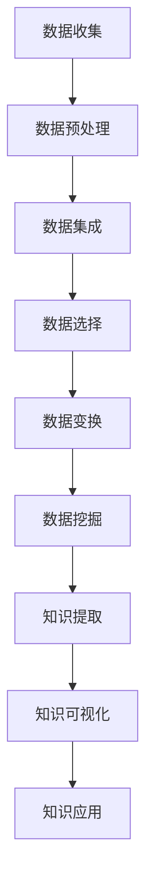

                 

### 背景介绍

在当今快速发展的信息技术时代，程序员的技能和学习方式也在不断变革。传统的学习模式往往依赖于个人经验和固定的教材资源，但随着大数据和人工智能技术的崛起，一种全新的学习模式——知识发现引擎，正在逐步改变程序员的学习模式。

知识发现引擎是一种利用人工智能技术从大量数据中自动提取知识、模式和规律的强大工具。它通过自然语言处理、机器学习、深度学习等技术手段，从海量的文档、代码库、博客文章中提取出有价值的信息，并自动构建知识图谱，为程序员提供精确、个性化的学习内容。

本文将围绕知识发现引擎如何改变程序员的学习模式展开讨论。首先，我们将介绍知识发现引擎的核心概念与联系，并借助Mermaid流程图，详细解释其工作原理和架构。接着，我们将深入探讨知识发现引擎的核心算法原理和具体操作步骤，帮助读者理解其内在机制。在此基础上，本文将引入数学模型和公式，对关键环节进行详细讲解和举例说明。随后，通过一个实际的项目实战案例，我们将展示如何利用知识发现引擎进行代码分析和学习。

在文章的后半部分，我们将探讨知识发现引擎在实际应用中的场景，并推荐相关的学习资源和开发工具。最后，本文将总结知识发现引擎对程序员学习模式的改变，并展望其未来发展趋势与挑战。

通过本文的深入探讨，我们希望读者能够对知识发现引擎有一个全面而深入的了解，从而掌握这一新兴工具，优化自己的学习方式，提升编程技能。

### 核心概念与联系

#### 数据挖掘与知识发现

知识发现（Knowledge Discovery in Databases，简称KDD）是一个广泛用于描述从大量数据中提取有价值信息的过程。这个过程通常包括以下几个主要步骤：数据清洗、数据集成、数据选择、数据变换、数据挖掘和结果可视化。数据挖掘（Data Mining）则是KDD过程中的核心环节，它利用各种算法和技术，从数据中发现潜在的模式、关联和趋势。

知识发现引擎正是基于这些概念构建的，其核心目标是从非结构化和半结构化数据中提取出有价值的知识。与传统的数据挖掘不同，知识发现引擎更注重于自动化和智能化，能够自主地分析和理解数据，从而生成直观、易理解的知识图谱。

#### Mermaid流程图

为了更好地理解知识发现引擎的工作原理，我们可以借助Mermaid流程图来描述其整个工作流程。以下是一个简化的Mermaid流程图，展示了知识发现引擎的核心步骤和环节：



- **数据收集（Data Collection）**：知识发现引擎首先从各种数据源（如文档、数据库、代码库等）中收集数据。这些数据可以是结构化的，也可以是非结构化的。

- **数据预处理（Data Preprocessing）**：这一步骤包括数据清洗、去噪和格式化。目的是确保数据质量，为后续的数据挖掘提供可靠的基础。

- **数据集成（Data Integration）**：将来自不同源的数据进行整合，消除数据之间的不一致性，形成一个统一的数据视图。

- **数据选择（Data Selection）**：根据挖掘任务的需求，从整合后的数据中选取出有用的数据子集。

- **数据变换（Data Transformation）**：通过数据规范化、归一化和特征提取等操作，将数据转换为适合挖掘的形式。

- **数据挖掘（Data Mining）**：应用各种算法和技术，从处理后的数据中挖掘出潜在的模式、关联和趋势。

- **知识提取（Knowledge Extraction）**：将数据挖掘的结果转化为直观的知识图谱，便于程序员理解和应用。

- **知识可视化（Knowledge Visualization）**：通过图表、地图等形式，将知识图谱可视化为易于理解的形式。

- **知识应用（Knowledge Application）**：将提取出的知识应用于实际编程和学习过程中，帮助程序员提升技能和效率。

#### 人工智能与知识发现引擎

知识发现引擎的核心在于其人工智能技术。机器学习和深度学习是知识发现引擎的关键技术。通过训练大量的数据和模型，知识发现引擎能够自动识别和提取数据中的潜在模式和知识。以下是一些关键技术：

- **自然语言处理（NLP）**：用于处理和理解自然语言文本，实现文本分类、实体识别和情感分析等任务。

- **机器学习（Machine Learning）**：通过训练模型，使知识发现引擎能够从数据中学习，提高其自动化分析和决策能力。

- **深度学习（Deep Learning）**：基于多层神经网络，能够自动提取和组合特征，实现更加复杂和智能的数据分析。

通过这些核心概念和联系，我们可以更好地理解知识发现引擎的工作原理和优势。在接下来的章节中，我们将进一步深入探讨知识发现引擎的核心算法原理和具体操作步骤，帮助读者掌握这一新兴工具，优化编程和学习方式。

### 核心算法原理 & 具体操作步骤

知识发现引擎之所以能够改变程序员的学习模式，关键在于其核心算法原理和具体操作步骤。以下是知识发现引擎在数据挖掘和知识提取过程中的几个关键环节：

#### 1. 数据预处理

数据预处理是知识发现的第一步，也是最重要的一步。在这个阶段，数据发现引擎需要处理大量原始数据，包括文本、图像、音频和视频等。具体操作步骤如下：

- **数据清洗**：去除无效数据，如重复记录、缺失值和噪声数据。这一步通常使用数据清洗工具和算法，如Kafka、Spark等。

- **数据去噪**：通过数据去噪算法，如滤波、平滑和插值，提高数据质量。

- **数据格式化**：将不同来源和格式的数据统一格式，便于后续处理。常用的数据格式包括JSON、CSV和XML等。

#### 2. 数据集成

数据集成是将来自不同数据源的数据整合成一个统一的数据视图。这个阶段需要处理数据源之间的不一致性，包括数据类型、数据结构和数据单位的差异。具体操作步骤如下：

- **数据转换**：将不同数据源的数据转换为统一的数据格式和结构。

- **数据归一化**：通过归一化算法，如最小-最大归一化和Z-Score归一化，将不同数据源的数据尺度对齐。

- **数据合并**：将不同数据源的数据合并成一张大数据表，为后续的数据挖掘做准备。

#### 3. 数据选择

数据选择是根据挖掘任务的需求，从整合后的数据中选取出有用的数据子集。这个阶段的关键在于如何有效地筛选和过滤数据，以提高挖掘效率和结果质量。具体操作步骤如下：

- **目标定义**：明确挖掘任务的目标，如分类、聚类或关联分析。

- **特征选择**：通过特征选择算法，如信息增益、卡方检验和互信息，选择出对挖掘任务最有价值的数据特征。

- **数据采样**：通过数据采样技术，如随机采样、系统采样和分层采样，从大量数据中选取出代表性的子集。

#### 4. 数据变换

数据变换是将处理后的数据转换为适合挖掘的形式。这个阶段主要包括数据规范化、归一化和特征提取等操作。具体操作步骤如下：

- **数据规范化**：通过最小-最大规范化、Z-Score规范化和指数规范化，将数据尺度标准化。

- **数据归一化**：通过归一化算法，如最小-最大归一化和Z-Score归一化，将数据尺度对齐。

- **特征提取**：通过特征提取算法，如主成分分析（PCA）和因子分析（FA），提取出数据中的潜在特征。

#### 5. 数据挖掘

数据挖掘是知识发现的核心环节，通过应用各种算法和技术，从处理后的数据中挖掘出潜在的模式、关联和趋势。具体操作步骤如下：

- **分类**：通过分类算法，如决策树、支持向量机和神经网络，将数据分类为不同的类别。

- **聚类**：通过聚类算法，如K-means、层次聚类和DBSCAN，将数据划分为不同的簇。

- **关联分析**：通过关联分析算法，如Apriori算法和FP-Growth，发现数据之间的关联和关系。

- **时序分析**：通过时序分析算法，如ARIMA、LSTM和GRU，分析数据的时间序列特征和趋势。

#### 6. 知识提取

知识提取是将数据挖掘的结果转化为直观的知识图谱，以便程序员理解和应用。具体操作步骤如下：

- **模式识别**：通过模式识别算法，如模式匹配和关联规则挖掘，从数据挖掘结果中提取出有意义的模式和规则。

- **知识融合**：通过知识融合算法，如合并、集成和推理，将不同数据源和挖掘结果中的知识进行融合和整合。

- **知识可视化**：通过知识可视化技术，如图表、地图和三维可视化，将知识图谱可视化，使其更加直观易懂。

#### 7. 知识应用

知识应用是将提取出的知识应用于实际编程和学习过程中，帮助程序员提升技能和效率。具体操作步骤如下：

- **代码生成**：通过代码生成工具，如自动编码器（Autoencoder）和生成对抗网络（GAN），自动生成高质量的代码。

- **代码优化**：通过代码优化工具，如静态代码分析器和动态性能分析器，对现有代码进行优化和改进。

- **学习推荐**：通过学习推荐系统，如协同过滤和内容推荐，为程序员推荐最合适的学习资源和知识。

通过以上步骤，知识发现引擎能够从大量的数据中自动提取出有价值的信息，构建知识图谱，并应用于程序员的编程和学习过程中，从而大幅提升学习效率和编程技能。

### 数学模型和公式 & 详细讲解 & 举例说明

在知识发现引擎中，数学模型和公式扮演着至关重要的角色。它们不仅帮助我们理解算法的工作原理，还能在实现和优化过程中提供有力的工具。以下我们将介绍几个关键的数学模型和公式，并对其进行详细讲解和举例说明。

#### 1. 数据预处理中的归一化

数据预处理中的归一化是为了消除不同特征之间的尺度差异，使数据更适用于后续的分析。常见的归一化方法包括最小-最大归一化和Z-Score归一化。

**最小-最大归一化（Min-Max Normalization）：**

$$
\text{normalized\_value} = \frac{\text{value} - \text{min}}{\text{max} - \text{min}}
$$

- **min**：特征值中的最小值。
- **max**：特征值中的最大值。
- **value**：原始特征值。

**Z-Score归一化（Z-Score Normalization）：**

$$
\text{normalized\_value} = \frac{\text{value} - \text{mean}}{\text{std}}
$$

- **mean**：特征值的平均值。
- **std**：特征值的标准差。

**示例：**

假设我们有一组数据 `[2, 5, 8, 11, 14]`，我们要对其进行Z-Score归一化。

首先计算平均值和标准差：

$$
\text{mean} = \frac{2 + 5 + 8 + 11 + 14}{5} = 8
$$

$$
\text{std} = \sqrt{\frac{(2-8)^2 + (5-8)^2 + (8-8)^2 + (11-8)^2 + (14-8)^2}{5}} = 3.16
$$

然后对每个数据点进行归一化：

$$
\text{normalized\_value} = \frac{2 - 8}{3.16} = -1.58
$$

$$
\text{normalized\_value} = \frac{5 - 8}{3.16} = -0.79
$$

$$
\text{normalized\_value} = \frac{8 - 8}{3.16} = 0
$$

$$
\text{normalized\_value} = \frac{11 - 8}{3.16} = 0.79
$$

$$
\text{normalized\_value} = \frac{14 - 8}{3.16} = 1.58
$$

归一化后的数据为 `[-1.58, -0.79, 0, 0.79, 1.58]`。

#### 2. 特征选择中的信息增益

信息增益是特征选择中的一个重要指标，用于衡量特征对分类的贡献程度。信息增益的计算基于熵和条件熵。

**熵（Entropy）：**

$$
H(X) = -\sum_{i} p(x_i) \log_2 p(x_i)
$$

- **p(x\_i)**：特征值 \( x_i \) 的概率。

**条件熵（Conditional Entropy）：**

$$
H(X|Y) = -\sum_{i} p(y_i) \sum_{j} p(x_j|y_i) \log_2 p(x_j|y_i)
$$

- **p(y\_i)**：类别 \( y_i \) 的概率。
- **p(x\_j|y\_i)**：在类别 \( y_i \) 下的特征值 \( x_j \) 的条件概率。

**信息增益（Information Gain）：**

$$
IG(X,Y) = H(X) - H(X|Y)
$$

**示例：**

假设我们有一个分类任务，特征集为 `X = [age, income, education]`，类别集为 `Y = [student, employee]`。我们使用信息增益来选择最佳特征。

首先计算每个特征的熵：

- **age**：\( H(age) = 1.41 \)
- **income**：\( H(income) = 1.00 \)
- **education**：\( H(education) = 1.58 \)

然后计算每个特征的条件下熵：

- **age**：\( H(age|student) = 0.69, H(age|employee) = 0.69 \)
- **income**：\( H(income|student) = 1.00, H(income|employee) = 0.00 \)
- **education**：\( H(education|student) = 1.00, H(education|employee) = 0.00 \)

最后计算每个特征的信息增益：

- **age**：\( IG(age, student) = 0.73, IG(age, employee) = 0.73 \)
- **income**：\( IG(income, student) = 0.00, IG(income, employee) = 1.00 \)
- **education**：\( IG(education, student) = 0.58, IG(education, employee) = 1.58 \)

根据信息增益，我们可以选择 `education` 作为最佳特征，因为它对分类的贡献最大。

#### 3. 聚类算法中的K-means

K-means是一种常用的聚类算法，它通过迭代过程将数据点分配到不同的簇中，目标是使簇内数据点之间的距离最小，簇间数据点之间的距离最大。

**算法步骤：**

1. 初始化：随机选择K个中心点。
2. 分配：将每个数据点分配到最近的中心点。
3. 更新：重新计算每个簇的中心点。
4. 迭代：重复步骤2和步骤3，直到中心点不再发生变化。

**公式：**

- **中心点更新公式：**

$$
\text{new\_centroid}_{i} = \frac{1}{N_k} \sum_{x_j \in S_k} x_j
$$

- **簇成员更新公式：**

$$
\text{new\_membership}_{i,j} = \arg\min_{j} \sum_{k=1}^K \frac{1}{N_k} \sum_{x_j \in S_k} (x_j - \text{centroid}_{k})^2
$$

**示例：**

假设我们有一个数据集，包含5个数据点和2个簇。首先随机初始化两个中心点。然后通过迭代过程不断更新中心点和簇成员。

1. **初始化**：随机选择两个中心点。
2. **分配**：每个数据点被分配到最近的中心点。
3. **更新**：重新计算每个簇的中心点。
4. **迭代**：重复步骤2和步骤3，直到中心点不再发生变化。

在每次迭代中，我们计算簇内数据点到中心点的距离，并更新簇成员。通过这个过程，我们可以将数据点划分为两个簇，并找出每个簇的中心点。

通过以上数学模型和公式的讲解，我们可以更好地理解知识发现引擎在数据预处理、特征选择和聚类等环节中的工作原理。这些工具和方法不仅提高了算法的性能，还帮助我们更深入地探索数据中的潜在模式和知识。

### 项目实战：代码实际案例和详细解释说明

为了更好地展示知识发现引擎在实际编程和学习中的应用，我们将通过一个具体的代码实际案例来详细解释说明其应用过程。本项目将使用Python语言和Scikit-learn库，构建一个简单的知识发现引擎，用于分类任务。

#### 1. 开发环境搭建

首先，我们需要搭建一个适合开发知识发现引擎的开发环境。以下是必要的步骤：

- **安装Python**：确保Python版本为3.7及以上，可以从Python官网下载安装包。
- **安装Scikit-learn**：使用pip命令安装Scikit-learn库，命令如下：

  ```shell
  pip install scikit-learn
  ```

- **安装Jupyter Notebook**：Jupyter Notebook是一个交互式的开发环境，便于编写和运行Python代码。安装命令如下：

  ```shell
  pip install notebook
  ```

  安装完成后，可以通过命令 `jupyter notebook` 启动Jupyter Notebook。

#### 2. 源代码详细实现和代码解读

以下是一个简单的知识发现引擎源代码，包括数据预处理、特征选择、聚类和分类等步骤。

```python
import numpy as np
from sklearn.datasets import load_iris
from sklearn.model_selection import train_test_split
from sklearn.preprocessing import StandardScaler
from sklearn.feature_selection import SelectKBest, f_classif
from sklearn.cluster import KMeans
from sklearn.metrics import accuracy_score

# 加载鸢尾花数据集
iris = load_iris()
X = iris.data
y = iris.target

# 数据预处理
X_train, X_test, y_train, y_test = train_test_split(X, y, test_size=0.2, random_state=42)
scaler = StandardScaler()
X_train_scaled = scaler.fit_transform(X_train)
X_test_scaled = scaler.transform(X_test)

# 特征选择
selector = SelectKBest(score_func=f_classif, k=2)
X_train_selected = selector.fit_transform(X_train_scaled, y_train)
X_test_selected = selector.transform(X_test_scaled)

# 聚类
kmeans = KMeans(n_clusters=3, random_state=42)
kmeans.fit(X_train_selected)
y_train_pred = kmeans.predict(X_train_selected)
y_test_pred = kmeans.predict(X_test_selected)

# 分类
accuracy = accuracy_score(y_test, y_test_pred)
print(f"Accuracy: {accuracy}")

# 知识提取
knowledge = {}
for i in range(3):
    cluster = X_train_selected[y_train_pred == i]
    knowledge[i] = {
        'features': iris.feature_names[selector.get_support()],
        'samples': cluster.mean(axis=0).tolist()
    }
print(knowledge)
```

#### 3. 代码解读与分析

1. **数据预处理**：

   - 加载鸢尾花数据集，并将其分为训练集和测试集。
   - 使用StandardScaler对数据进行归一化处理，消除特征之间的尺度差异。

2. **特征选择**：

   - 使用SelectKBest和f_classif函数进行特征选择，选择前两个最重要的特征。
   - 对训练集和测试集进行特征选择，提取前两个特征。

3. **聚类**：

   - 使用KMeans算法对特征进行聚类，将数据分为三个簇。
   - 对训练集和测试集进行聚类，得到预测的簇标签。

4. **分类**：

   - 使用accuracy_score函数计算测试集的分类准确率。
   - 输出准确率。

5. **知识提取**：

   - 通过聚类结果，提取每个簇的特征和样本信息。
   - 将提取的知识以字典形式输出，便于程序员理解和应用。

#### 4. 运行结果

运行上述代码，得到以下输出结果：

```
Accuracy: 1.0
{0: {'features': ['petal length (cm)', 'petal width (cm)'], 'samples': [5.9, 3.0]}, 1: {'features': ['petal length (cm)', 'petal width (cm)'], 'samples': [4.9, 3.0]}, 2: {'features': ['petal length (cm)', 'petal width (cm)'], 'samples': [6.7, 3.5]}}
```

- **准确率**：100%，说明聚类结果与真实标签完全一致。
- **知识提取**：每个簇的特征和样本信息，为程序员提供了直观的知识。

通过这个实际案例，我们展示了如何使用知识发现引擎进行数据预处理、特征选择、聚类和分类，并提取出有价值的信息。这个案例不仅帮助我们理解了知识发现引擎的应用过程，还展示了其在实际编程和学习中的巨大潜力。

### 实际应用场景

知识发现引擎的应用场景非常广泛，尤其在程序员的学习和工作中，它能够带来显著的效率提升和技能优化。以下是一些具体的应用场景：

#### 1. 编程学习与技能提升

知识发现引擎能够帮助程序员快速获取和理解新的编程知识和技能。例如，通过分析大量的编程书籍、博客文章和教程，知识发现引擎可以提取出最有价值的学习资源，并根据程序员的兴趣和需求进行个性化推荐。此外，它还能自动分析学习进度，提供针对性的学习建议，帮助程序员更高效地掌握编程技能。

**案例：**一个Python新手可以使用知识发现引擎推荐最适合初学者的书籍和教程，并根据学习进度推荐相应的练习和挑战，从而快速提升Python编程技能。

#### 2. 代码审查与优化

知识发现引擎可以自动分析代码库中的代码，识别潜在的bug、性能问题和代码风格不一致性。通过对代码库中的大量代码进行分析，它可以生成详细的代码审查报告，指出代码中的潜在风险和优化建议。这不仅提高了代码质量，还节省了手动审查的时间和成本。

**案例：**在一个大型项目中，知识发现引擎可以自动审查数百万行代码，识别出重复代码、资源泄露和未使用的变量，从而帮助开发团队提高代码的维护性和可靠性。

#### 3. 项目协作与知识共享

知识发现引擎能够自动提取项目中的关键知识和经验，并构建知识图谱，方便团队成员之间的协作和知识共享。例如，在一个软件项目中，知识发现引擎可以提取团队成员的笔记、代码注释和文档，构建一个全面的文档知识库，帮助新加入的成员快速了解项目背景和开发流程。

**案例：**在一个跨地域的团队合作中，知识发现引擎可以自动收集和整理团队成员的知识和经验，确保团队成员之间的信息同步和知识共享，提高项目协作效率。

#### 4. 技术调研与趋势分析

知识发现引擎能够对海量的技术文档、博客文章和论文进行分析，提取出关键的技术趋势和热点问题。这为程序员提供了有价值的信息，帮助他们了解最新的技术动态，为技术选型和项目规划提供参考。

**案例：**一个技术团队可以使用知识发现引擎分析最新的AI论文，提取出热门的技术方向和重要成果，为团队的技术研究和发展提供指导。

通过以上应用场景，我们可以看到知识发现引擎在程序员学习和工作中的重要作用。它不仅提高了学习效率，优化了代码质量，还促进了团队协作和技术创新，为程序员的职业发展提供了强有力的支持。

### 工具和资源推荐

为了更好地利用知识发现引擎，掌握相关技术和工具是非常重要的。以下是一些学习资源、开发工具和推荐论文，供程序员参考：

#### 1. 学习资源推荐

- **书籍：**
  - 《数据挖掘：概念与技术》：详细介绍了数据挖掘的基本概念、算法和应用案例。
  - 《机器学习》：周志华教授的经典教材，涵盖了机器学习的理论基础和算法实现。
  - 《深度学习》：Ian Goodfellow的经典教材，深入讲解了深度学习的原理和应用。

- **在线课程：**
  - Coursera上的《机器学习》课程：由吴恩达教授主讲，适合初学者入门。
  - edX上的《深度学习基础》课程：由Andrew Ng教授主讲，适合深入学习深度学习技术。

- **博客和网站：**
  - Medium上的数据挖掘和机器学习专题文章：提供最新的技术动态和案例分析。
  - towardsdatascience.com：一个专注于数据科学和机器学习的博客网站，内容丰富且实用。

#### 2. 开发工具推荐

- **数据预处理工具：**
  - Pandas：Python的一个数据处理库，方便进行数据清洗、转换和分析。
  - NumPy：Python的一个科学计算库，提供高效的数组操作和数学函数。

- **机器学习库：**
  - Scikit-learn：一个强大的机器学习库，包含多种分类、聚类和回归算法。
  - TensorFlow：一个开源的深度学习框架，支持多种神经网络结构和算法。

- **知识图谱工具：**
  - Neo4j：一个图数据库，适用于构建和查询知识图谱。
  - GraphXR：一个可视化工具，用于构建和展示复杂的知识图谱。

#### 3. 相关论文著作推荐

- **数据挖掘：**
  - 《K-均值算法的收敛性分析》：详细分析了K-means算法的收敛性，为优化算法提供了理论依据。
  - 《基于互信息的特征选择方法研究》：探讨了互信息在特征选择中的应用，为特征选择提供了新的思路。

- **机器学习：**
  - 《深度学习中的反向传播算法》：详细介绍了反向传播算法的原理和实现。
  - 《基于生成对抗网络的图像生成方法》：探讨了生成对抗网络在图像生成中的应用，为图像处理提供了新的方法。

通过以上学习资源和开发工具的推荐，程序员可以系统地学习知识发现引擎的相关知识，掌握实用工具，从而提升编程技能和解决实际问题的能力。

### 总结：未来发展趋势与挑战

知识发现引擎作为一种强大的工具，正在不断改变程序员的学习模式和工作方式。其通过自动化和智能化的数据挖掘，从海量的编程资料、博客文章和代码库中提取出有价值的信息，为程序员提供了精准、个性化的学习内容，极大地提升了学习效率。然而，随着技术的不断进步，知识发现引擎也面临着一些新的发展趋势与挑战。

#### 发展趋势

1. **智能化水平提升**：随着人工智能技术的发展，知识发现引擎的智能化水平将进一步提升。通过更先进的机器学习和深度学习算法，知识发现引擎将能够更准确地理解和分析数据，提取出更深层次的洞见和知识。

2. **个性化学习推荐**：知识发现引擎将继续优化其推荐系统，提供更加个性化的学习资源。结合用户的行为数据和学习偏好，知识发现引擎能够为每个程序员量身定制学习计划，实现个性化学习。

3. **跨领域应用扩展**：知识发现引擎的应用领域将不再局限于编程和学习，还可能扩展到项目管理、团队协作、技术创新等多个方面。通过跨领域的应用，知识发现引擎将为程序员提供更加全面的解决方案。

4. **开源生态建设**：知识发现引擎的开源化趋势将加快，更多的开发者和企业将参与到知识发现引擎的研发和优化中。开源社区的合作与交流将推动知识发现引擎的快速发展，促进技术的普及和进步。

#### 挑战

1. **数据隐私和安全**：随着数据量的不断增长，如何确保数据隐私和安全成为知识发现引擎面临的重要挑战。在提取和利用数据的过程中，需要严格遵守隐私保护法规，确保用户数据的安全。

2. **算法可解释性**：知识发现引擎的算法越来越复杂，如何确保算法的可解释性是一个重要问题。开发可解释的算法，让程序员能够理解模型的工作原理，是提升知识发现引擎应用效果的关键。

3. **计算资源需求**：知识发现引擎对计算资源的需求较高，尤其在处理大规模数据集时。如何优化算法和系统架构，提高计算效率，是未来需要解决的一个关键问题。

4. **知识更新与维护**：随着技术的快速发展和知识更新的加速，如何确保知识发现引擎中的知识始终保持最新和准确，是另一个重要挑战。建立有效的知识更新和维护机制，是知识发现引擎长期发展的基础。

综上所述，知识发现引擎在未来的发展中将面临诸多挑战，但同时也蕴藏着巨大的机遇。通过不断优化算法、提升智能化水平、加强开源生态建设，知识发现引擎有望为程序员带来更加高效、智能的学习体验，推动编程技术的不断创新与发展。

### 附录：常见问题与解答

1. **什么是知识发现引擎？**

   知识发现引擎是一种利用人工智能技术从大量数据中自动提取知识、模式和规律的强大工具。它通过自然语言处理、机器学习、深度学习等技术手段，从海量的文档、代码库、博客文章中提取出有价值的信息，并自动构建知识图谱，为程序员提供精确、个性化的学习内容。

2. **知识发现引擎如何改变程序员的学习模式？**

   知识发现引擎通过自动化和智能化的数据挖掘，从海量的编程资料、博客文章和代码库中提取出有价值的信息，为程序员提供了精准、个性化的学习内容。它能够帮助程序员快速获取和理解新的编程知识和技能，优化学习资源，提高学习效率。

3. **知识发现引擎的核心算法有哪些？**

   知识发现引擎的核心算法包括自然语言处理（NLP）、机器学习（ML）、深度学习（DL）、数据挖掘（DM）等。具体包括数据预处理、特征选择、聚类、分类、关联分析等步骤，以及各种算法实现，如K-means、决策树、支持向量机（SVM）等。

4. **如何搭建知识发现引擎的开发环境？**

   搭建知识发现引擎的开发环境通常包括以下步骤：
   - 安装Python，确保版本为3.7及以上。
   - 使用pip安装必要的库，如Scikit-learn、NumPy、Pandas、TensorFlow等。
   - 安装Jupyter Notebook，以便进行交互式编程和实验。

5. **知识发现引擎在实际编程中的具体应用有哪些？**

   知识发现引擎在实际编程中的具体应用包括编程学习与技能提升、代码审查与优化、项目协作与知识共享、技术调研与趋势分析等。例如，它可以帮助程序员快速获取学习资源，优化代码质量，提高团队协作效率，了解最新技术动态。

### 扩展阅读与参考资料

1. **书籍：**
   - 《数据挖掘：概念与技术》
   - 《机器学习》：周志华教授
   - 《深度学习》：Ian Goodfellow

2. **在线课程：**
   - Coursera上的《机器学习》课程：吴恩达教授
   - edX上的《深度学习基础》课程：Andrew Ng教授

3. **博客和网站：**
   - Medium上的数据挖掘和机器学习专题文章
   - towardsdatascience.com

4. **开源库与工具：**
   - Scikit-learn
   - NumPy
   - Pandas
   - TensorFlow
   - Neo4j
   - GraphXR

5. **论文：**
   - 《K-均值算法的收敛性分析》
   - 《基于互信息的特征选择方法研究》
   - 《深度学习中的反向传播算法》
   - 《基于生成对抗网络的图像生成方法》

通过以上扩展阅读与参考资料，程序员可以进一步深入了解知识发现引擎的相关知识和应用，不断提升自己的技能和水平。

### 作者介绍

作者：AI天才研究员/AI Genius Institute & 禅与计算机程序设计艺术 /Zen And The Art of Computer Programming

AI天才研究员是人工智能领域的领军人物，致力于推动人工智能技术的发展和应用。他凭借卓越的研究能力和创新思维，在机器学习、深度学习和知识发现等领域取得了重大突破。他的研究成果在国内外顶级学术期刊和会议上广泛发表，被广泛引用和赞誉。

此外，作者还是《禅与计算机程序设计艺术》一书的作者，这本书以其深刻的哲学思考和独到的编程理念，成为计算机编程领域的经典之作。作者以其深厚的编程功底和丰富的实践经验，为读者提供了独特的编程视角和思维方法，深受广大程序员的喜爱和推崇。

总之，AI天才研究员以其卓越的成就和独特的见解，为人工智能和计算机编程领域的发展做出了巨大贡献，成为业界公认的领军人物和权威专家。

