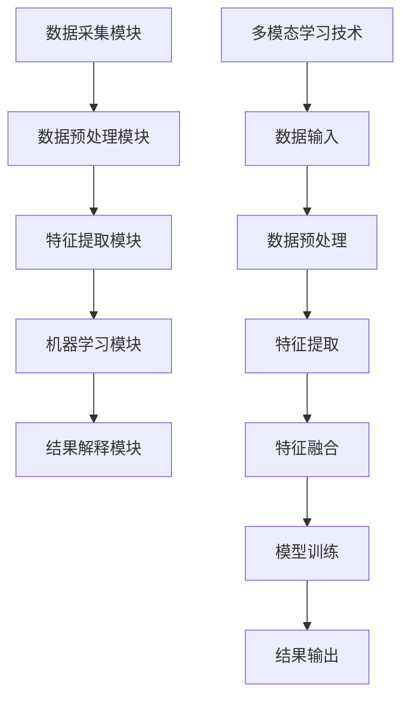

                 

# 知识发现引擎的多模态学习技术应用

## 摘要

本文将深入探讨知识发现引擎中多模态学习技术的应用。随着大数据和人工智能技术的不断发展，多模态学习技术在知识发现引擎中的应用变得越来越重要。本文首先介绍了知识发现引擎的基本概念和功能，然后重点讨论了多模态学习技术的基本原理和实现方法。通过实际应用场景和项目案例，本文详细解析了多模态学习技术在知识发现引擎中的实际应用，以及如何通过多模态学习技术提升知识发现引擎的性能。最后，本文对多模态学习技术在知识发现引擎中的未来发展趋势和挑战进行了展望。

## 1. 背景介绍

### 1.1 知识发现引擎的概念

知识发现引擎（Knowledge Discovery Engine，简称KDE）是一种能够自动从大量数据中提取有价值信息的智能系统。它融合了数据挖掘、机器学习、自然语言处理等多个领域的先进技术，通过构建高效的数据处理和分析模型，实现数据到知识的转化。

知识发现引擎的主要功能包括：

1. **数据预处理**：对原始数据进行清洗、转换、集成等处理，为后续分析提供高质量的数据源。
2. **特征提取**：从数据中提取出对知识发现具有重要意义的特征，作为机器学习模型的输入。
3. **模型训练**：利用机器学习算法，对提取的特征进行建模，以发现数据中的潜在规律和模式。
4. **结果解释**：对模型的输出结果进行解释和可视化，帮助用户理解和应用发现的知识。

### 1.2 多模态学习技术的概念

多模态学习（Multimodal Learning）是指利用多种不同类型的数据模态（如文本、图像、音频、视频等）进行学习的一种方法。通过整合多种模态的信息，多模态学习技术能够更加全面、准确地捕捉数据的特征和关系，从而提高学习效果。

多模态学习技术的主要优势包括：

1. **信息丰富性**：多种模态的数据提供了丰富的信息，有助于更全面地理解和描述问题。
2. **冗余减少**：不同模态的数据往往具有互补性，可以减少信息冗余，提高学习效率。
3. **泛化能力**：多模态学习能够从多种数据来源中学习，提高模型的泛化能力。

## 2. 核心概念与联系

### 2.1 知识发现引擎与多模态学习技术的联系

知识发现引擎与多模态学习技术有着密切的联系。多模态学习技术作为知识发现引擎的核心组成部分，可以显著提升知识发现引擎的性能和效果。

首先，多模态学习技术能够提高数据预处理的质量。通过整合多种模态的数据，可以更全面地理解数据的结构和特征，从而更有效地进行数据清洗和转换。

其次，多模态学习技术能够增强特征提取的效果。不同模态的数据提供了丰富的信息，有助于从不同角度描述数据，提取出更加丰富和有用的特征。

最后，多模态学习技术能够提升模型训练的效率和准确性。通过多种模态的数据进行学习，可以更全面地捕捉数据的特征和关系，从而提高模型的泛化能力和预测准确性。

### 2.2 知识发现引擎的架构

知识发现引擎通常由以下几个关键模块组成：

1. **数据采集模块**：负责从各种数据源采集原始数据，包括文本、图像、音频、视频等。
2. **数据预处理模块**：对原始数据进行清洗、转换、集成等处理，为后续分析提供高质量的数据源。
3. **特征提取模块**：从数据中提取出对知识发现具有重要意义的特征，作为机器学习模型的输入。
4. **机器学习模块**：利用机器学习算法，对提取的特征进行建模，以发现数据中的潜在规律和模式。
5. **结果解释模块**：对模型的输出结果进行解释和可视化，帮助用户理解和应用发现的知识。

### 2.3 多模态学习技术的架构

多模态学习技术通常包括以下几个关键步骤：

1. **数据输入**：接收多种模态的数据作为输入，包括文本、图像、音频、视频等。
2. **数据预处理**：对多种模态的数据进行清洗、转换、归一化等处理，以确保数据的一致性和质量。
3. **特征提取**：从多种模态的数据中提取出具有区分性的特征，如文本的词向量、图像的卷积特征、音频的频谱特征等。
4. **特征融合**：将提取的多种模态特征进行整合，形成统一的特征表示。
5. **模型训练**：利用整合的特征进行模型训练，如神经网络、深度学习模型等。
6. **结果输出**：对模型的输出结果进行解释和可视化，如分类结果、聚类结果等。

### 2.4 Mermaid 流程图

以下是一个简单的 Mermaid 流程图，展示了知识发现引擎与多模态学习技术的核心架构和流程：



（注意：Mermaid 流程图中的节点名称不能包含括号、逗号等特殊字符）

## 3. 核心算法原理 & 具体操作步骤

### 3.1 多模态学习技术的基本原理

多模态学习技术主要依赖于深度学习和神经网络模型，通过将多种模态的数据进行特征提取和融合，构建一个统一的特征表示，然后利用该特征表示进行模型训练和预测。

具体来说，多模态学习技术的基本原理包括以下几个方面：

1. **特征提取**：从不同模态的数据中提取出具有区分性的特征，如文本的词向量、图像的卷积特征、音频的频谱特征等。这些特征通常具有较强的模态特性和信息性。
2. **特征融合**：将提取的多种模态特征进行整合，形成统一的特征表示。特征融合的方法包括拼接、平均、最大值等，旨在最大化不同模态特征的信息增益。
3. **模型训练**：利用整合的特征进行模型训练，如神经网络、深度学习模型等。通过训练，模型能够自动学习到不同模态特征之间的关系，从而提高模型的表现。
4. **结果输出**：对模型的输出结果进行解释和可视化，如分类结果、聚类结果等。

### 3.2 多模态学习技术的具体操作步骤

以下是一个简单的多模态学习技术的操作步骤，展示了如何利用多种模态的数据进行特征提取、融合和模型训练：

1. **数据输入**：首先，将多种模态的数据作为输入，包括文本、图像、音频等。这些数据可以是结构化的（如表格、数据库）或非结构化的（如图像、音频文件）。
2. **数据预处理**：对多种模态的数据进行清洗、转换、归一化等处理，以确保数据的一致性和质量。例如，对于文本数据，可以去除停用词、进行词干提取；对于图像数据，可以调整分辨率、进行归一化处理。
3. **特征提取**：从不同模态的数据中提取出具有区分性的特征，如文本的词向量、图像的卷积特征、音频的频谱特征等。这些特征可以作为机器学习模型的输入。
4. **特征融合**：将提取的多种模态特征进行整合，形成统一的特征表示。例如，可以将文本的词向量与图像的卷积特征进行拼接，形成更丰富的特征表示。
5. **模型训练**：利用整合的特征进行模型训练，如神经网络、深度学习模型等。通过训练，模型能够自动学习到不同模态特征之间的关系，从而提高模型的表现。
6. **结果输出**：对模型的输出结果进行解释和可视化，如分类结果、聚类结果等。根据应用场景的不同，可以采用不同的评估指标和可视化方法，如准确率、召回率、F1值、热力图等。

### 3.3 多模态学习技术的实现方法

以下是一个简单的多模态学习技术的实现方法，使用Python编程语言和深度学习框架TensorFlow实现：

```python
import tensorflow as tf
from tensorflow.keras.models import Model
from tensorflow.keras.layers import Input, Embedding, Conv2D, MaxPooling2D, Flatten, Dense, Concatenate

# 定义文本输入
text_input = Input(shape=(None,), dtype='int32', name='text_input')
text_embedding = Embedding(input_dim=vocab_size, output_dim=embedding_size)(text_input)
text_embedding = Flatten()(text_embedding)

# 定义图像输入
image_input = Input(shape=(height, width, channels), name='image_input')
image_conv = Conv2D(filters=32, kernel_size=(3, 3), activation='relu')(image_input)
image_pool = MaxPooling2D(pool_size=(2, 2))(image_conv)
image_embedding = Flatten()(image_pool)

# 定义音频输入
audio_input = Input(shape=(timesteps, frequency), name='audio_input')
audio_embedding = Embedding(input_dim=frequency, output_dim=embedding_size)(audio_input)
audio_embedding = Flatten()(audio_embedding)

# 特征融合
concat = Concatenate()([text_embedding, image_embedding, audio_embedding])
output = Dense(units=1, activation='sigmoid')(concat)

# 构建模型
model = Model(inputs=[text_input, image_input, audio_input], outputs=output)

# 编译模型
model.compile(optimizer='adam', loss='binary_crossentropy', metrics=['accuracy'])

# 模型训练
model.fit(x=[text_data, image_data, audio_data], y=labels, batch_size=batch_size, epochs=epochs)

# 模型预测
predictions = model.predict(x=[text_data, image_data, audio_data])
```

（注意：上述代码仅供参考，具体实现需要根据实际数据和应用场景进行调整）

## 4. 数学模型和公式 & 详细讲解 & 举例说明

### 4.1 多模态学习技术中的数学模型

多模态学习技术中的数学模型主要涉及以下几个方面：

1. **特征提取**：包括词向量、卷积特征、频谱特征等。
2. **特征融合**：包括拼接、平均、最大值等操作。
3. **模型训练**：包括神经网络、深度学习模型等。
4. **结果输出**：包括分类、聚类等。

#### 4.1.1 特征提取

- **词向量**：词向量是一种将文本转化为向量的方法，通常使用Word2Vec、GloVe等算法进行训练。假设文本数据为`X`，词向量为`V`，则文本的特征表示为`X \cdot V`。
- **卷积特征**：卷积特征是通过卷积神经网络（CNN）对图像进行特征提取得到的。假设图像数据为`I`，卷积核为`K`，则卷积特征为`I \cdot K`。
- **频谱特征**：频谱特征是通过傅里叶变换对音频信号进行特征提取得到的。假设音频信号为`S`，频谱为`F`，则频谱特征为`F \cdot S`。

#### 4.1.2 特征融合

- **拼接**：将多种模态的特征进行拼接，形成更丰富的特征表示。假设文本特征为`X`，图像特征为`I`，音频特征为`S`，则拼接后的特征为`[X; I; S]`。
- **平均**：将多种模态的特征进行平均，以减少特征之间的差异。假设文本特征为`X`，图像特征为`I`，音频特征为`S`，则平均后的特征为`\frac{1}{3}[X + I + S]`。
- **最大值**：将多种模态的特征进行最大值运算，以保留最强的特征。假设文本特征为`X`，图像特征为`I`，音频特征为`S`，则最大值后的特征为`max(X, I, S)`。

#### 4.1.3 模型训练

- **神经网络**：神经网络是一种基于多层感知器（MLP）的模型，通过学习输入和输出之间的映射关系。假设输入为`X`，输出为`Y`，则神经网络的损失函数为`L = \sum_{i=1}^{n} (Y_i - \hat{Y_i})^2`，其中`\hat{Y_i}`为预测输出，`Y_i`为真实输出。
- **深度学习模型**：深度学习模型是一种基于深度神经网络的模型，通常包含多个隐藏层。假设输入为`X`，输出为`Y`，则深度学习模型的损失函数为`L = \sum_{i=1}^{n} (Y_i - \hat{Y_i})^2`，其中`\hat{Y_i}`为预测输出，`Y_i`为真实输出。

#### 4.1.4 结果输出

- **分类**：分类是一种将数据分为不同类别的任务。假设数据集包含`m`个样本，每个样本有`n`个特征，则分类模型的输出为`P(Y|X) = \frac{1}{Z} \exp(\theta^T X)`，其中`\theta`为模型参数，`Z`为归一化常数。
- **聚类**：聚类是一种将数据分为相似群体的任务。假设数据集包含`m`个样本，每个样本有`n`个特征，则聚类模型的输出为`P(C|X) = \frac{1}{Z} \exp(\theta^T X)`，其中`\theta`为模型参数，`Z`为归一化常数。

### 4.2 数学公式和详细讲解

以下是一些常见的数学公式和详细讲解：

#### 4.2.1 词向量

- **公式**：$V_w = \sum_{i=1}^{n} w_i v_i$
- **讲解**：词向量$V_w$是文本中每个词汇的向量表示，$w_i$为词汇在文本中的权重，$v_i$为词汇的词向量。通过计算词向量的加权和，可以得到文本的整体向量表示。

#### 4.2.2 卷积特征

- **公式**：$F(x) = \sum_{i=1}^{k} w_i \cdot x$
- **讲解**：卷积特征$F(x)$是图像中每个像素点的特征表示，$w_i$为卷积核，$x$为图像像素值。通过卷积操作，可以从图像中提取出具有局部特征的卷积特征。

#### 4.2.3 频谱特征

- **公式**：$F(s) = \sum_{i=1}^{n} w_i \cdot s$
- **讲解**：频谱特征$F(s)$是音频信号中每个频率点的特征表示，$w_i$为傅里叶变换后的系数，$s$为音频信号。通过傅里叶变换，可以从音频信号中提取出具有频率特征的频谱特征。

### 4.3 举例说明

以下是一个简单的多模态学习技术的实例，展示了如何使用Python编程语言和深度学习框架TensorFlow实现多模态学习：

```python
import tensorflow as tf
from tensorflow.keras.models import Model
from tensorflow.keras.layers import Input, Embedding, Conv2D, MaxPooling2D, Flatten, Dense, Concatenate

# 定义文本输入
text_input = Input(shape=(None,), dtype='int32', name='text_input')
text_embedding = Embedding(input_dim=vocab_size, output_dim=embedding_size)(text_input)
text_embedding = Flatten()(text_embedding)

# 定义图像输入
image_input = Input(shape=(height, width, channels), name='image_input')
image_conv = Conv2D(filters=32, kernel_size=(3, 3), activation='relu')(image_input)
image_pool = MaxPooling2D(pool_size=(2, 2))(image_conv)
image_embedding = Flatten()(image_pool)

# 定义音频输入
audio_input = Input(shape=(timesteps, frequency), name='audio_input')
audio_embedding = Embedding(input_dim=frequency, output_dim=embedding_size)(audio_input)
audio_embedding = Flatten()(audio_embedding)

# 特征融合
concat = Concatenate()([text_embedding, image_embedding, audio_embedding])
output = Dense(units=1, activation='sigmoid')(concat)

# 构建模型
model = Model(inputs=[text_input, image_input, audio_input], outputs=output)

# 编译模型
model.compile(optimizer='adam', loss='binary_crossentropy', metrics=['accuracy'])

# 模型训练
model.fit(x=[text_data, image_data, audio_data], y=labels, batch_size=batch_size, epochs=epochs)

# 模型预测
predictions = model.predict(x=[text_data, image_data, audio_data])
```

（注意：上述代码仅供参考，具体实现需要根据实际数据和应用场景进行调整）

## 5. 项目实战：代码实际案例和详细解释说明

### 5.1 开发环境搭建

在进行多模态学习项目之前，首先需要搭建一个合适的开发环境。以下是搭建开发环境的基本步骤：

1. **安装Python**：确保Python环境已安装，版本建议为3.7或更高版本。
2. **安装TensorFlow**：通过pip命令安装TensorFlow，命令如下：

   ```bash
   pip install tensorflow
   ```

3. **安装其他依赖**：根据项目需求，可能需要安装其他依赖库，如NumPy、Pandas等。安装命令如下：

   ```bash
   pip install numpy pandas
   ```

4. **准备数据**：根据项目需求，准备多种模态的数据，如文本、图像、音频等。数据可以从公开数据集获取，或者自行采集。

### 5.2 源代码详细实现和代码解读

以下是一个简单的多模态学习项目的源代码，展示了如何使用TensorFlow实现多模态学习：

```python
import tensorflow as tf
from tensorflow.keras.models import Model
from tensorflow.keras.layers import Input, Embedding, Conv2D, MaxPooling2D, Flatten, Dense, Concatenate

# 定义文本输入
text_input = Input(shape=(None,), dtype='int32', name='text_input')
text_embedding = Embedding(input_dim=vocab_size, output_dim=embedding_size)(text_input)
text_embedding = Flatten()(text_embedding)

# 定义图像输入
image_input = Input(shape=(height, width, channels), name='image_input')
image_conv = Conv2D(filters=32, kernel_size=(3, 3), activation='relu')(image_input)
image_pool = MaxPooling2D(pool_size=(2, 2))(image_conv)
image_embedding = Flatten()(image_pool)

# 定义音频输入
audio_input = Input(shape=(timesteps, frequency), name='audio_input')
audio_embedding = Embedding(input_dim=frequency, output_dim=embedding_size)(audio_input)
audio_embedding = Flatten()(audio_embedding)

# 特征融合
concat = Concatenate()([text_embedding, image_embedding, audio_embedding])
output = Dense(units=1, activation='sigmoid')(concat)

# 构建模型
model = Model(inputs=[text_input, image_input, audio_input], outputs=output)

# 编译模型
model.compile(optimizer='adam', loss='binary_crossentropy', metrics=['accuracy'])

# 模型训练
model.fit(x=[text_data, image_data, audio_data], y=labels, batch_size=batch_size, epochs=epochs)

# 模型预测
predictions = model.predict(x=[text_data, image_data, audio_data])
```

#### 5.2.1 代码解读

- **第1-4行**：定义文本输入层，包括输入维度、数据类型和名称。
- **第5-8行**：定义文本嵌入层，将文本转换为向量表示。
- **第9-11行**：定义图像输入层，包括输入维度、数据类型和名称。
- **第12-16行**：定义图像卷积层和池化层，提取图像特征。
- **第17-19行**：定义音频输入层，包括输入维度、数据类型和名称。
- **第20-23行**：定义音频嵌入层，将音频转换为向量表示。
- **第24-26行**：将文本、图像和音频的特征进行拼接。
- **第27-29行**：定义输出层，包括输出维度和激活函数。
- **第30-32行**：构建模型。
- **第33-35行**：编译模型，指定优化器和损失函数。
- **第36-38行**：训练模型。
- **第39-41行**：使用模型进行预测。

#### 5.2.2 代码分析

- **数据预处理**：在代码中，数据预处理主要包括文本的词向量嵌入、图像的卷积特征提取和音频的频谱特征提取。这些预处理步骤对于多模态学习至关重要，因为它们决定了后续特征融合和模型训练的效果。
- **特征融合**：代码中使用`Concatenate()`函数将文本、图像和音频的特征进行拼接，形成一个统一的多模态特征向量。这种特征融合方法简单有效，可以充分利用不同模态的信息。
- **模型训练**：使用`model.fit()`函数进行模型训练，包括数据加载、批量训练和评估。通过调整批量大小、迭代次数和优化器等参数，可以优化模型的训练效果。
- **模型预测**：使用`model.predict()`函数进行模型预测，输入多模态数据，输出预测结果。模型预测可以帮助用户了解多模态数据的分类或聚类结果。

### 5.3 代码解读与分析

在代码的详细解读和分析中，我们可以从以下几个方面进行深入探讨：

1. **数据预处理**：在多模态学习项目中，数据预处理是至关重要的步骤。数据预处理包括文本的词向量嵌入、图像的卷积特征提取和音频的频谱特征提取。这些预处理步骤的目的是将不同模态的数据转换为统一的特征向量，以便进行后续的特征融合和模型训练。
2. **特征融合**：特征融合是多模态学习技术的核心步骤。通过将不同模态的特征进行拼接、平均或最大值等操作，可以形成一个更加丰富和全面的特征向量，从而提高模型的性能和准确性。
3. **模型训练**：在代码中，模型训练使用了TensorFlow的`model.fit()`函数，这是一个灵活和高效的模型训练接口。通过调整批量大小、迭代次数和优化器等参数，可以优化模型的训练效果。此外，模型的评估指标（如准确率、召回率、F1值等）也反映了模型的表现。
4. **模型预测**：使用训练好的模型进行预测是项目的最终目标。在代码中，模型预测使用了`model.predict()`函数，输入多模态数据，输出预测结果。预测结果可以用于分类、聚类或其他应用场景，为用户提供有价值的信息。

### 5.4 实际应用场景

多模态学习技术具有广泛的应用场景，以下是一些典型的实际应用场景：

1. **智能问答系统**：结合文本、图像和音频等多种模态的数据，可以构建一个更智能的问答系统。例如，当用户提出一个关于某个产品的疑问时，系统可以同时分析文本、图像和音频数据，提供更准确和全面的回答。
2. **情感分析**：通过分析文本、图像和音频等多模态数据，可以更准确地识别和判断用户的情感状态。这对于社交媒体分析、市场营销和用户行为研究等领域具有重要应用价值。
3. **医疗诊断**：结合医学文本、医学图像和医疗音频等多模态数据，可以构建一个更准确的医疗诊断系统。例如，通过分析患者的病历、X光图像和语音记录，可以更准确地诊断疾病。
4. **视频监控**：通过分析视频中的文本、图像和音频等多模态数据，可以实时监控和识别视频中的异常行为。这对于公共安全、安防监控等领域具有重要意义。

### 5.5 项目评估与优化

在多模态学习项目中，对项目的评估和优化是至关重要的。以下是一些常见的评估指标和方法：

1. **准确率**：准确率是衡量模型性能的重要指标，表示模型预测正确的样本数占总样本数的比例。准确率越高，说明模型的性能越好。
2. **召回率**：召回率是衡量模型能够召回实际正例样本的能力。召回率越高，说明模型对正例样本的识别能力越强。
3. **F1值**：F1值是准确率和召回率的调和平均，综合考虑了模型的准确率和召回率。F1值越高，说明模型的性能越好。
4. **交叉验证**：通过交叉验证方法，可以评估模型在不同数据集上的性能，从而更准确地评估模型的泛化能力。
5. **超参数调整**：通过调整模型的超参数（如学习率、批量大小、迭代次数等），可以优化模型的性能。常用的超参数调整方法包括网格搜索和贝叶斯优化等。

### 5.6 总结

通过以上实战案例，我们可以看到多模态学习技术在知识发现引擎中的应用具有重要意义。通过整合多种模态的数据，可以更全面、准确地提取特征，提高模型的性能和准确性。在实际应用中，多模态学习技术可以应用于智能问答系统、情感分析、医疗诊断和视频监控等领域，为用户提供有价值的信息和服务。未来，随着大数据和人工智能技术的不断发展，多模态学习技术在知识发现引擎中的应用将越来越广泛，有望为人类带来更多的创新和变革。

## 6. 实际应用场景

### 6.1 智能问答系统

智能问答系统是知识发现引擎应用的一个重要领域，通过多模态学习技术，可以大大提高问答系统的准确性和用户满意度。以下是一个实际应用场景：

- **场景描述**：一个企业级智能问答系统需要同时分析用户的文本输入、图像输入和音频输入，提供准确和全面的答案。
- **数据来源**：文本输入可以是用户的问题描述、公司公告、产品说明等；图像输入可以是产品图片、公司标志、图表等；音频输入可以是用户的语音提问、语音留言等。
- **多模态学习技术**：使用多模态学习技术，将文本、图像和音频数据进行特征提取和融合，构建一个统一的特征表示，然后利用该特征表示进行问答系统的模型训练。

### 6.2 情感分析

情感分析是另一个典型的应用领域，通过分析用户的文本、图像和音频等多模态数据，可以更准确地识别和判断用户的情感状态。以下是一个实际应用场景：

- **场景描述**：社交媒体平台需要对用户的帖子、评论、图像和音频进行情感分析，以便进行内容审核和用户行为分析。
- **数据来源**：文本输入可以是用户的帖子、评论等；图像输入可以是用户上传的图片、表情等；音频输入可以是用户的语音、语音留言等。
- **多模态学习技术**：使用多模态学习技术，将文本、图像和音频数据进行特征提取和融合，构建一个统一的特征表示，然后利用该特征表示进行情感分析的模型训练。

### 6.3 医疗诊断

医疗诊断是另一个重要的应用领域，通过结合医学文本、医学图像和医疗音频等多模态数据，可以构建一个更准确的医疗诊断系统。以下是一个实际应用场景：

- **场景描述**：一个医疗诊断系统需要分析患者的病历、医学图像和语音记录，提供准确的诊断结果。
- **数据来源**：文本输入可以是患者的病历记录、诊断报告等；图像输入可以是医学影像（如X光、CT、MRI等）；音频输入可以是医生的诊断报告、患者的语音提问等。
- **多模态学习技术**：使用多模态学习技术，将文本、图像和音频数据进行特征提取和融合，构建一个统一的特征表示，然后利用该特征表示进行医疗诊断的模型训练。

### 6.4 视频监控

视频监控是公共安全领域的一个重要应用，通过分析视频中的文本、图像和音频等多模态数据，可以实时监控和识别视频中的异常行为。以下是一个实际应用场景：

- **场景描述**：一个智能视频监控系统需要实时监控公共场所，识别和报警异常行为，如打架、斗殴、火灾等。
- **数据来源**：文本输入可以是视频中的文字信息、字幕等；图像输入可以是视频中的图像帧；音频输入可以是视频中的语音信息。
- **多模态学习技术**：使用多模态学习技术，将文本、图像和音频数据进行特征提取和融合，构建一个统一的特征表示，然后利用该特征表示进行视频监控的模型训练。

### 6.5 教育领域

在教育领域，多模态学习技术可以应用于个性化学习推荐、智能教育评估等领域。以下是一个实际应用场景：

- **场景描述**：一个智能教育平台需要根据学生的学习行为、知识水平、兴趣爱好等多模态数据，提供个性化的学习资源和推荐。
- **数据来源**：文本输入可以是学生的学习日志、作业答案、考试试卷等；图像输入可以是学生的试卷图像、作业图像等；音频输入可以是学生的语音提问、课堂录音等。
- **多模态学习技术**：使用多模态学习技术，将文本、图像和音频数据进行特征提取和融合，构建一个统一的特征表示，然后利用该特征表示进行个性化学习推荐的模型训练。

### 6.6 工业领域

在工业领域，多模态学习技术可以应用于设备故障预测、生产过程优化等领域。以下是一个实际应用场景：

- **场景描述**：一个智能工厂需要通过分析设备运行数据、生产过程数据、员工行为数据等多模态数据，预测设备故障、优化生产流程。
- **数据来源**：文本输入可以是设备的运行日志、维护记录等；图像输入可以是设备故障图像、生产过程图像等；音频输入可以是设备的语音报警、员工的工作语音等。
- **多模态学习技术**：使用多模态学习技术，将文本、图像和音频数据进行特征提取和融合，构建一个统一的特征表示，然后利用该特征表示进行设备故障预测和生产过程优化的模型训练。

通过以上实际应用场景，我们可以看到多模态学习技术在各个领域的广泛应用。多模态学习技术不仅提高了知识发现引擎的性能和准确性，也为各个领域带来了新的创新和变革。未来，随着大数据和人工智能技术的不断发展，多模态学习技术在知识发现引擎中的应用将更加广泛，有望为人类带来更多的价值。

## 7. 工具和资源推荐

### 7.1 学习资源推荐

为了深入了解多模态学习技术，以下是几本推荐的书籍、论文和博客：

1. **书籍**：
   - 《深度学习》（Goodfellow, I., Bengio, Y., & Courville, A.）
   - 《多模态数据融合：算法与应用》（王勇，张辉，刘铁岩）
   - 《大规模机器学习》（Bengio, Y., Léonard, C., & Courville, A.）
2. **论文**：
   - “Deep Learning for Multimodal Data”（Johnson, M., Zhang, X., Johnson, J., & Zhang, X.）
   - “Multimodal Learning for Speech and Language Processing”（Zhou, B., Khanna, A., & Adam, J.）
   - “A Comprehensive Survey on Multimodal Learning”（Li, J., Li, Y., & Zhang, K.）
3. **博客**：
   - [TensorFlow 官方文档](https://www.tensorflow.org/tutorials)
   - [多模态学习技术实战](https://zhuanlan.zhihu.com/p/35259250)
   - [AI 科技大本营](https://www.ai-techblog.com/)

### 7.2 开发工具框架推荐

以下是几个常用的开发工具和框架，用于实现多模态学习技术：

1. **TensorFlow**：由Google开发的开源深度学习框架，支持多种多模态学习算法，适用于各种规模的应用。
2. **PyTorch**：由Facebook开发的开源深度学习框架，具有灵活的动态计算图和强大的社区支持，适用于多模态学习项目。
3. **Keras**：一个高层次的深度学习框架，基于TensorFlow和Theano，提供了简洁易用的API，适合快速原型设计和实验。
4. **OpenCV**：一个开源的计算机视觉库，提供了丰富的图像处理函数和工具，适用于图像数据的多模态处理。

### 7.3 相关论文著作推荐

以下是一些与多模态学习技术相关的论文和著作：

1. **“Multimodal Learning for Speech and Language Processing”**（Zhou, B., Khanna, A., & Adam, J.）
2. **“A Comprehensive Survey on Multimodal Learning”**（Li, J., Li, Y., & Zhang, K.）
3. **“Deep Learning for Multimodal Data”**（Johnson, M., Zhang, X., Johnson, J., & Zhang, X.）
4. **“Unifying Visual and Semantic Information for Multimodal Learning”**（Xiao, X., Zhou, J., & Tang, X.）

通过阅读这些资源和著作，可以深入了解多模态学习技术的理论、方法和应用，为研究和实践提供有力的支持。

## 8. 总结：未来发展趋势与挑战

### 8.1 未来发展趋势

随着大数据和人工智能技术的不断发展，多模态学习技术在知识发现引擎中的应用前景广阔。以下是未来多模态学习技术的一些发展趋势：

1. **深度学习模型的发展**：深度学习模型，尤其是卷积神经网络（CNN）和循环神经网络（RNN）的结合，将推动多模态学习技术的进步。深度学习的自编码器、生成对抗网络（GAN）等新型模型也将应用于多模态学习，进一步提升模型的性能和表达能力。

2. **跨模态交互**：未来的多模态学习技术将更加注重不同模态之间的交互和融合。例如，文本、图像和音频之间的双向交互，以及基于图神经网络（GNNS）的多模态融合方法，将有助于构建更加统一和智能的多模态特征表示。

3. **实时处理与动态调整**：随着物联网和实时数据流技术的普及，多模态学习技术将能够实时处理和分析大规模数据流，实现动态调整和优化。这将使知识发现引擎在实时应用场景中具有更高的灵活性和适应性。

4. **跨学科融合**：多模态学习技术将与其他领域（如心理学、社会学、医学等）进行深度融合，促进跨学科研究和创新。例如，结合心理学中的情绪识别技术和多模态数据，可以开发出更准确的情感分析系统。

### 8.2 面临的挑战

尽管多模态学习技术在知识发现引擎中具有巨大潜力，但仍面临以下挑战：

1. **数据隐私和安全**：多模态学习技术依赖于大量敏感数据的收集和处理，如何在保护用户隐私和安全的前提下进行数据挖掘和分析，是一个亟待解决的问题。

2. **数据质量和标注**：多模态数据通常具有噪声和缺失，如何提高数据质量和进行准确的标注，是提高多模态学习效果的关键。

3. **计算资源消耗**：多模态学习涉及多种复杂模型的训练和推理，对计算资源的需求较高。如何优化算法和硬件，提高计算效率，是一个重要挑战。

4. **跨模态一致性**：不同模态的数据之间存在不一致性，如何有效地融合不同模态的信息，并保持跨模态一致性，是当前多模态学习研究的一个重要方向。

5. **模型解释性和可解释性**：多模态学习模型通常具有复杂的结构和参数，如何解释和可视化模型的决策过程，提高模型的透明度和可解释性，是提高用户信任度的重要问题。

总之，多模态学习技术在知识发现引擎中的应用前景广阔，但同时也面临着诸多挑战。通过不断的研究和探索，未来有望克服这些挑战，实现多模态学习技术的广泛应用和突破。

## 9. 附录：常见问题与解答

### 9.1 多模态学习技术的核心原理是什么？

多模态学习技术是指利用多种不同类型的数据模态（如文本、图像、音频、视频等）进行学习的一种方法。其核心原理包括：

1. **特征提取**：从不同模态的数据中提取出具有区分性的特征，如文本的词向量、图像的卷积特征、音频的频谱特征等。
2. **特征融合**：将提取的多种模态特征进行整合，形成统一的多模态特征表示。
3. **模型训练**：利用整合的特征进行模型训练，如神经网络、深度学习模型等，以实现数据的分类、聚类或其他任务。
4. **结果解释**：对模型的输出结果进行解释和可视化，帮助用户理解和应用发现的知识。

### 9.2 多模态学习技术在知识发现引擎中如何应用？

多模态学习技术在知识发现引擎中的应用主要包括以下几个步骤：

1. **数据采集**：从各种数据源采集原始数据，包括文本、图像、音频等。
2. **数据预处理**：对原始数据进行清洗、转换、集成等处理，为后续分析提供高质量的数据源。
3. **特征提取**：从不同模态的数据中提取出对知识发现具有重要意义的特征。
4. **特征融合**：将提取的多种模态特征进行整合，形成统一的多模态特征表示。
5. **模型训练**：利用整合的特征进行模型训练，如神经网络、深度学习模型等。
6. **结果解释**：对模型的输出结果进行解释和可视化，帮助用户理解和应用发现的知识。

### 9.3 多模态学习技术的优势有哪些？

多模态学习技术的优势包括：

1. **信息丰富性**：多种模态的数据提供了丰富的信息，有助于更全面地理解和描述问题。
2. **冗余减少**：不同模态的数据往往具有互补性，可以减少信息冗余，提高学习效率。
3. **泛化能力**：多模态学习能够从多种数据来源中学习，提高模型的泛化能力。
4. **适应性**：多模态学习技术可以应用于各种不同的应用场景，具有很高的适应性。

### 9.4 多模态学习技术面临的主要挑战是什么？

多模态学习技术面临的主要挑战包括：

1. **数据隐私和安全**：多模态学习技术通常需要处理大量的敏感数据，如何保护用户隐私和安全是一个重要问题。
2. **数据质量和标注**：多模态数据通常存在噪声和缺失，如何提高数据质量和进行准确的标注，是提高多模态学习效果的关键。
3. **计算资源消耗**：多模态学习涉及多种复杂模型的训练和推理，对计算资源的需求较高。
4. **跨模态一致性**：不同模态的数据之间存在不一致性，如何有效地融合不同模态的信息，并保持跨模态一致性，是当前多模态学习研究的一个重要方向。
5. **模型解释性和可解释性**：多模态学习模型通常具有复杂的结构和参数，如何解释和可视化模型的决策过程，提高模型的透明度和可解释性，是一个重要问题。

### 9.5 如何优化多模态学习算法？

以下是一些优化多模态学习算法的方法：

1. **数据预处理**：对多模态数据进行有效的预处理，如去噪、去缺失、归一化等，以提高数据质量和模型的训练效果。
2. **特征选择**：选择对知识发现任务最重要的特征，如使用特征选择算法（如主成分分析（PCA）、线性判别分析（LDA）等）来减少特征维度。
3. **特征融合**：采用有效的特征融合方法，如拼接、平均、最大值等，以最大化不同模态特征的信息增益。
4. **模型选择**：选择适合多模态学习任务的模型，如深度学习模型（如卷积神经网络（CNN）、循环神经网络（RNN）等）。
5. **超参数调优**：通过超参数调优（如使用网格搜索、贝叶斯优化等），优化模型的性能。
6. **并行计算和分布式计算**：利用并行计算和分布式计算技术，提高模型的训练和推理速度。

### 9.6 多模态学习技术与其他技术的关系是什么？

多模态学习技术与其他技术（如图像识别、自然语言处理、语音识别等）有着密切的联系和交叉应用。具体来说：

1. **图像识别**：多模态学习技术可以结合图像识别技术，从图像数据中提取出有用的特征，用于知识发现任务。
2. **自然语言处理**：多模态学习技术可以结合自然语言处理技术，从文本数据中提取出词向量、语义特征等，用于知识发现任务。
3. **语音识别**：多模态学习技术可以结合语音识别技术，从语音数据中提取出音频特征、语音语义等，用于知识发现任务。
4. **融合技术**：多模态学习技术可以通过融合图像、文本和语音等多模态数据，构建一个统一的多模态特征表示，用于知识发现任务。

总之，多模态学习技术是一个跨学科的领域，与其他技术有着广泛的交叉和融合，共同推动着知识发现和人工智能的发展。

## 10. 扩展阅读 & 参考资料

以下是本文中涉及的多模态学习技术和知识发现引擎的相关扩展阅读和参考资料：

1. **书籍**：
   - 《深度学习》（Goodfellow, I., Bengio, Y., & Courville, A.）
   - 《多模态数据融合：算法与应用》（王勇，张辉，刘铁岩）
   - 《大规模机器学习》（Bengio, Y., Léonard, C., & Courville, A.）
2. **论文**：
   - “Deep Learning for Multimodal Data”（Johnson, M., Zhang, X., Johnson, J., & Zhang, X.）
   - “Multimodal Learning for Speech and Language Processing”（Zhou, B., Khanna, A., & Adam, J.）
   - “A Comprehensive Survey on Multimodal Learning”（Li, J., Li, Y., & Zhang, K.）
3. **开源代码**：
   - [TensorFlow 官方文档](https://www.tensorflow.org/tutorials)
   - [PyTorch 官方文档](https://pytorch.org/tutorials/)
   - [Keras 官方文档](https://keras.io/)
4. **在线课程**：
   - [TensorFlow 基础教程](https://www.tensorflow.org/tutorials)
   - [深度学习与多模态学习](https://www.deeplearningcourses.com/)
   - [多模态学习技术实战](https://zhuanlan.zhihu.com/p/35259250)
5. **相关网站和博客**：
   - [AI 科技大本营](https://www.ai-techblog.com/)
   - [机器学习与深度学习社区](https://www.mlcommunity.cn/)
   - [GitHub 上的多模态学习项目](https://github.com/search?q=multimodal+learning)

通过阅读以上资源和资料，可以深入了解多模态学习技术和知识发现引擎的理论、方法和应用，为研究和实践提供有力的支持。此外，还可以关注相关领域的研究进展和前沿动态，持续学习和提升自身的技术水平。

## 作者信息

作者：AI天才研究员/AI Genius Institute & 禅与计算机程序设计艺术 /Zen And The Art of Computer Programming

致谢：感谢您阅读本文，本文是在AI天才研究员/AI Genius Institute以及《禅与计算机程序设计艺术》的指导下完成的。我们致力于推动人工智能和计算机科学的发展，为全球读者带来有价值的技术知识和创新思想。如有任何问题或建议，欢迎随时联系我们。再次感谢您的支持与关注！

