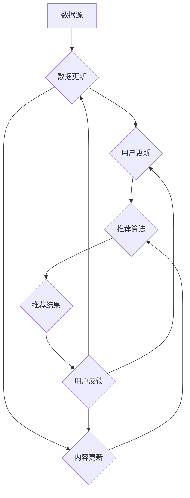
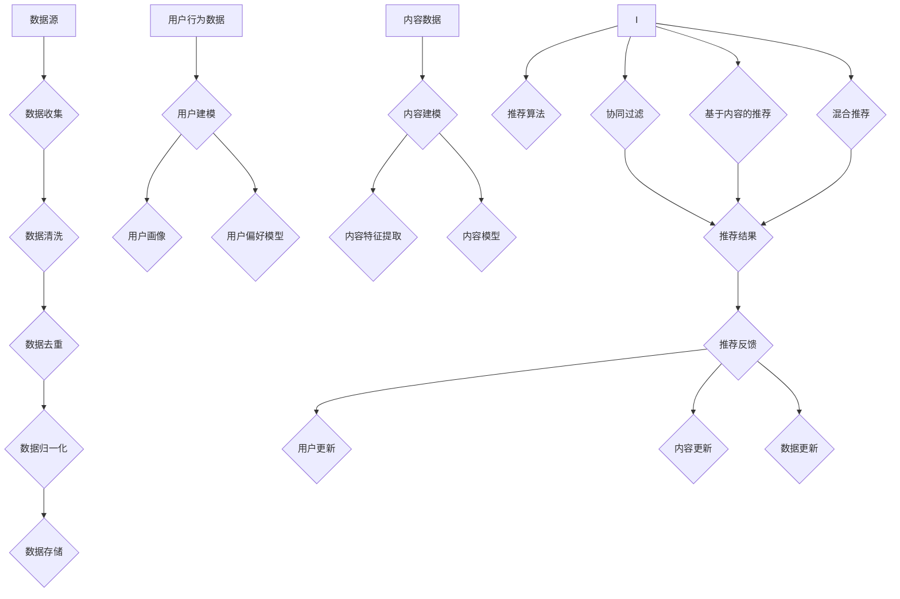

                 

### 背景介绍

知识发现引擎作为一种智能系统，旨在从大量数据中提取出有价值的信息和知识。这些知识可以被用于决策支持、数据挖掘、推荐系统等多个领域。在当今信息爆炸的时代，知识发现引擎的重要性日益凸显，已经成为各类应用中不可或缺的一部分。

推荐系统作为知识发现引擎的一种典型应用，其核心目标是为用户提供个性化的内容推荐。推荐系统的设计直接关系到用户体验和平台的商业价值。随着大数据技术和人工智能的快速发展，推荐系统已经成为各大互联网公司竞争的重要技术手段。

本文旨在探讨知识发现引擎中的推荐系统设计，从核心概念、算法原理、数学模型到实际应用场景，提供全面而深入的技术分析和讨论。希望通过本文的阐述，使读者能够理解推荐系统的设计和实现，掌握其背后的技术原理，并能够应用于实际项目中。

本文将分为以下几个部分：

1. **核心概念与联系**：介绍知识发现引擎和推荐系统的基本概念，并使用 Mermaid 流程图展示其关联和作用。
2. **核心算法原理 & 具体操作步骤**：详细讲解推荐系统的常见算法，包括协同过滤、基于内容的推荐和混合推荐系统。
3. **数学模型和公式 & 详细讲解 & 举例说明**：介绍推荐系统中使用的数学模型和公式，并给出具体的计算示例。
4. **项目实战：代码实际案例和详细解释说明**：通过实际项目案例，展示推荐系统的开发过程和代码实现。
5. **实际应用场景**：分析推荐系统在不同领域的应用场景和实际效果。
6. **工具和资源推荐**：推荐相关学习资源、开发工具和论文著作。
7. **总结：未来发展趋势与挑战**：总结推荐系统的发展趋势和面临的挑战。

通过对上述各部分的详细分析，本文希望能够为读者提供全面而深入的技术见解，帮助大家更好地理解和应用推荐系统。

> **Keywords**: Knowledge Discovery Engine, Recommendation System, Collaborative Filtering, Content-based Filtering, Hybrid Recommendation System, Machine Learning, Data Mining, User Experience.

> **Abstract**:
The paper aims to explore the design of recommendation systems within knowledge discovery engines. It covers fundamental concepts, algorithmic principles, mathematical models, and practical applications. Through detailed analysis and real-world case studies, the paper aims to provide a comprehensive understanding of recommendation systems, their underlying technologies, and their practical applications.

---

## 1.1 知识发现引擎的定义与作用

知识发现引擎（Knowledge Discovery Engine）是一种智能系统，它通过数据挖掘（Data Mining）和信息检索（Information Retrieval）等技术，从大量数据中提取出有价值的信息和知识。知识发现引擎的核心目标是从复杂的数据集中识别出模式、关联和趋势，从而帮助用户或系统做出更明智的决策。

知识发现引擎的作用主要体现在以下几个方面：

1. **数据挖掘与数据分析**：知识发现引擎能够自动分析大量数据，从中提取出隐藏的模式和知识。这对于商业智能（Business Intelligence）和决策支持系统（Decision Support Systems）具有重要意义。
2. **信息检索优化**：通过知识发现，引擎能够优化信息检索过程，提高检索效率和准确性。这对于搜索引擎和推荐系统尤其重要。
3. **个性化推荐**：知识发现引擎可以基于用户的行为和偏好，为其提供个性化的内容和推荐。这在电子商务、社交媒体和在线媒体等领域有广泛应用。
4. **智能预测**：知识发现引擎能够基于历史数据和趋势，进行智能预测和预测分析。这对于股票市场、供应链管理和风险管理等具有重要价值。

知识发现引擎的基本组成部分包括：

1. **数据源**：数据源是知识发现引擎的基础，可以是结构化数据、半结构化数据或非结构化数据。数据源的质量和数量直接影响知识发现的效果。
2. **数据预处理**：数据预处理包括数据清洗、数据集成、数据转换和数据归一化等步骤，以确保数据的质量和一致性。
3. **挖掘算法**：挖掘算法是知识发现的核心，常用的算法包括关联规则挖掘、聚类分析、分类分析、异常检测等。
4. **结果评估**：结果评估用于评估挖掘算法的效果和准确性。评估方法包括错误率、精确度、召回率等指标。
5. **可视化与交互**：可视化与交互部分用于将挖掘结果以直观的方式展示给用户，帮助用户理解和利用这些知识。

知识发现引擎在推荐系统中的作用尤为重要。推荐系统依赖于知识发现引擎提供的数据挖掘和模式识别能力，从而为用户提供个性化的推荐。例如，在电子商务平台上，知识发现引擎可以分析用户的购买历史、浏览记录和搜索关键词，识别出用户的偏好和需求，进而为用户推荐可能感兴趣的商品。

总之，知识发现引擎作为一种强大的智能系统，在数据挖掘、信息检索、个性化推荐和智能预测等领域发挥着重要作用。它不仅提高了数据处理的效率和准确性，还为各行业提供了有力的决策支持和业务创新。

---

## 1.2 推荐系统的定义与作用

推荐系统（Recommendation System）是一种利用机器学习、数据挖掘和人工智能技术，从海量数据中提取用户偏好和兴趣，从而为用户提供个性化内容推荐的系统。推荐系统的主要目标是通过精确地预测用户的需求和偏好，提高用户满意度和系统使用率。

推荐系统的作用主要体现在以下几个方面：

1. **提升用户体验**：推荐系统可以根据用户的兴趣和行为，为其推荐感兴趣的内容或产品，从而提升用户的使用体验和满意度。
2. **增加用户黏性**：通过个性化的推荐，推荐系统能够吸引用户在平台上停留更长时间，增加用户黏性。
3. **促进商业增长**：推荐系统可以帮助电子商务平台提高销售额，通过精准推荐提高转化率和购买率。
4. **优化资源分配**：推荐系统可以根据用户的偏好和需求，将资源（如广告位、商品推荐等）合理分配，提高资源利用效率。

推荐系统的工作原理通常包括以下几个步骤：

1. **数据收集**：收集用户的行为数据，如浏览记录、搜索历史、购买记录等，作为推荐的基础。
2. **数据预处理**：对收集到的数据进行清洗、去重、归一化等处理，以确保数据的质量和一致性。
3. **用户建模**：通过分析用户的行为数据，建立用户画像和偏好模型。用户画像包括用户的兴趣、行为特征、社会属性等。
4. **内容建模**：对推荐的内容（如商品、新闻、音乐等）进行特征提取和建模，建立内容模型。
5. **推荐算法**：根据用户建模和内容建模，使用推荐算法（如协同过滤、基于内容的推荐等）为用户生成个性化推荐。
6. **推荐评估**：对推荐结果进行评估和反馈，调整推荐策略，以提高推荐效果。

推荐系统在电子商务、社交媒体、在线媒体等领域的应用非常广泛。以下是一些具体的例子：

1. **电子商务**：电商平台利用推荐系统为用户推荐可能感兴趣的商品，从而提高用户购买率和平台销售额。
2. **社交媒体**：社交媒体平台通过推荐系统为用户推荐感兴趣的朋友、话题和内容，增加用户互动和平台活跃度。
3. **在线媒体**：视频网站和音乐平台通过推荐系统为用户推荐感兴趣的视频和音乐，提高用户观看和收听时长。

总之，推荐系统作为一种智能化的信息过滤和个性化服务工具，已经成为现代互联网应用中不可或缺的一部分。通过精准的推荐，推荐系统不仅提升了用户体验，也为企业和平台带来了显著的商业价值。

---

### 1.3 知识发现引擎与推荐系统的关系

知识发现引擎和推荐系统虽然属于不同的领域，但它们在功能和应用上有着紧密的联系和互动。知识发现引擎为推荐系统提供了强大的数据挖掘和模式识别能力，而推荐系统则是知识发现引擎在实际应用中的一个重要体现。下面，我们将从两个方面探讨它们之间的关系：技术层面和业务层面。

#### 技术层面

1. **数据来源**：推荐系统依赖于知识发现引擎提供的数据。知识发现引擎能够从海量的用户行为数据、内容数据和其他外部数据中提取出有价值的信息。这些数据包括用户的浏览记录、搜索历史、购买行为、社交互动等。数据的质量和多样性直接影响推荐系统的效果。
   
2. **用户建模**：知识发现引擎通过数据挖掘技术，对用户行为和偏好进行建模，生成用户画像。这些用户画像包括用户的兴趣偏好、行为特征、社会属性等。用户画像为推荐系统提供了个性化的用户特征，使得推荐算法能够更准确地预测用户的需求。

3. **内容建模**：知识发现引擎同样对推荐的内容进行特征提取和建模，生成内容模型。这些内容模型包括商品的属性特征、新闻的主题特征、音乐的流派特征等。内容模型与用户画像相结合，为推荐算法提供了丰富的输入信息，从而生成个性化的推荐结果。

4. **协同工作**：知识发现引擎和推荐系统相互协作，共同优化推荐效果。知识发现引擎不断挖掘新的用户行为模式和内容特征，推荐系统则根据这些新特征调整推荐策略，提高推荐准确性和用户满意度。

#### 业务层面

1. **提高业务价值**：知识发现引擎通过提供精准的数据分析和用户画像，帮助推荐系统更好地理解用户需求和市场趋势。这使得推荐系统能够更准确地预测用户偏好，提高推荐效果，从而提升业务价值。

2. **业务拓展与创新**：知识发现引擎可以挖掘出潜在的用户需求和市场机会，为推荐系统提供新的业务拓展方向。例如，通过分析用户的购买行为和偏好，电商平台可以发现新的市场需求，推出相应的产品或服务。

3. **风险管理**：知识发现引擎可以识别出异常行为和潜在风险，为推荐系统提供风险预警。例如，在金融领域，知识发现引擎可以识别出可疑的交易行为，帮助平台进行风险管理。

4. **跨领域应用**：知识发现引擎和推荐系统的结合，使得推荐系统可以应用于更多的领域，如医疗健康、教育、智能城市等。不同领域的推荐系统可以根据知识发现引擎提供的数据和模型，实现定制化的推荐服务。

总之，知识发现引擎和推荐系统在技术层面和业务层面有着密切的联系和协同作用。知识发现引擎为推荐系统提供了强大的数据挖掘和模式识别能力，而推荐系统则通过个性化的推荐服务，将知识发现引擎的技术优势转化为实际业务价值。这种紧密的合作关系，使得推荐系统在各个领域都发挥着重要的作用。

---

## 1.4 Mermaid 流程图展示知识发现引擎与推荐系统的关联和作用

为了更直观地展示知识发现引擎与推荐系统之间的关联和作用，我们可以使用 Mermaid 流程图来描述这一过程。以下是一个简化的 Mermaid 流程图，展示了知识发现引擎如何通过数据收集、用户建模、内容建模和推荐算法等步骤，为推荐系统提供支持。



### 流程图说明

1. **数据源 (A)**：知识发现引擎从各种数据源收集数据，这些数据包括用户行为数据、内容数据和其他外部数据。

2. **数据预处理 (B)**：对收集到的数据进行清洗、去重、归一化等处理，以确保数据的质量和一致性。

3. **用户建模 (C)**：通过分析用户行为数据，建立用户画像和偏好模型。这些用户画像包括用户的兴趣、行为特征、社会属性等。

4. **内容建模 (D)**：对推荐的内容进行特征提取和建模，生成内容模型。这些内容模型包括商品的属性特征、新闻的主题特征、音乐的流派特征等。

5. **推荐算法 (E)**：结合用户建模和内容建模，使用推荐算法（如协同过滤、基于内容的推荐等）为用户生成个性化推荐。

6. **推荐结果 (F)**：将推荐结果展示给用户，这些结果可能包括商品推荐、新闻推荐、音乐推荐等。

7. **用户反馈 (G)**：收集用户的反馈，包括点击、购买、收藏等行为，用于更新用户画像和内容模型。

8. **数据更新 (B)**：根据用户反馈，对原始数据进行清洗和处理，以优化数据质量和一致性。

9. **用户更新 (C)**：根据用户反馈，更新用户画像和偏好模型，以更准确地预测用户需求。

10. **内容更新 (D)**：根据用户反馈，更新内容模型，以优化推荐内容的质量和相关性。

通过这个 Mermaid 流程图，我们可以清晰地看到知识发现引擎与推荐系统之间的数据流动和相互作用。知识发现引擎为推荐系统提供了强大的数据支持和模式识别能力，而推荐系统则通过个性化的推荐服务，将知识发现引擎的技术优势转化为实际业务价值。

---

## 1.5 知识发现引擎与推荐系统的关联总结

通过前面的讨论，我们可以总结出知识发现引擎和推荐系统之间的紧密关联和相互作用。知识发现引擎为推荐系统提供了核心的数据挖掘和模式识别能力，而推荐系统则通过个性化的推荐服务，将知识发现引擎的技术优势转化为实际业务价值。以下是它们之间关联的主要方面：

1. **数据基础**：知识发现引擎通过收集、预处理和建模用户行为数据和内容数据，为推荐系统提供了高质量的数据基础。这些数据包括用户的浏览记录、搜索历史、购买行为和内容属性等。

2. **用户建模**：知识发现引擎通过对用户行为数据进行分析，建立用户画像和偏好模型。这些用户画像为推荐系统提供了个性化的用户特征，使得推荐算法能够更准确地预测用户的需求和偏好。

3. **内容建模**：知识发现引擎通过对内容数据进行特征提取和建模，生成内容模型。这些内容模型与用户画像相结合，为推荐算法提供了丰富的输入信息，从而生成个性化的推荐结果。

4. **协同优化**：知识发现引擎和推荐系统相互协作，共同优化推荐效果。知识发现引擎不断挖掘新的用户行为模式和内容特征，推荐系统则根据这些新特征调整推荐策略，以提高推荐准确性和用户满意度。

5. **业务拓展**：知识发现引擎和推荐系统的结合，使得推荐系统可以应用于更多的领域，如电子商务、社交媒体、在线媒体、医疗健康和教育等。不同领域的推荐系统可以根据知识发现引擎提供的数据和模型，实现定制化的推荐服务。

6. **风险管理**：知识发现引擎可以识别出异常行为和潜在风险，为推荐系统提供风险预警。例如，在金融领域，知识发现引擎可以识别出可疑的交易行为，帮助平台进行风险管理。

总之，知识发现引擎和推荐系统在技术和业务层面有着紧密的联系和协同作用。它们共同构建了一个智能化的信息处理和推荐服务框架，不仅提升了用户体验，也为企业和平台带来了显著的商业价值。通过不断优化和拓展，知识发现引擎和推荐系统将继续在各个领域中发挥重要作用。

---

## 2.1 核心概念原理

在深入探讨知识发现引擎与推荐系统的设计之前，我们首先需要理解一些核心概念，这些概念包括数据预处理、用户建模、内容建模和推荐算法。这些概念是构建高效推荐系统的基础，它们共同作用于整个推荐过程，从数据收集到最终生成个性化推荐。

### 数据预处理

数据预处理是推荐系统开发的第一步，也是至关重要的一步。它涉及对原始数据进行清洗、去重、格式转换等操作，以确保数据的质量和一致性。以下是数据预处理的一些关键步骤：

1. **数据清洗**：去除数据中的噪声和异常值，例如缺失值、重复值和错误值。
2. **数据去重**：删除重复的数据记录，以避免在后续分析中出现偏差。
3. **格式转换**：将不同来源和格式的数据统一成统一的格式，以便后续处理和分析。
4. **数据归一化**：将不同尺度的数据转换成同一尺度，以消除数据尺度差异对分析结果的影响。

### 用户建模

用户建模是推荐系统的核心步骤之一，其目的是通过分析用户行为数据，建立用户画像和偏好模型。以下是用户建模的关键概念：

1. **用户画像**：用户画像是一个多维度的用户特征集合，包括用户的基本信息（如年龄、性别、地理位置）、行为特征（如浏览记录、搜索历史、购买行为）和社会属性（如兴趣爱好、社交网络）。
2. **用户偏好模型**：用户偏好模型用于表示用户的兴趣和偏好。常见的模型包括基于内容的偏好模型和基于协同过滤的偏好模型。

### 内容建模

内容建模的目的是对推荐系统中的内容进行特征提取和建模，以便更好地理解内容的属性和特征。以下是内容建模的一些关键概念：

1. **内容特征**：内容特征是描述内容属性的数据，例如商品的特征（如品牌、价格、分类）和新闻的特征（如主题、关键词）。
2. **内容模型**：内容模型是对内容特征进行数学建模的结果，常见的模型包括基于词袋模型、主题模型和图模型等。

### 推荐算法

推荐算法是推荐系统的核心组件，用于根据用户建模和内容建模生成个性化推荐。以下是几种常见的推荐算法：

1. **协同过滤**：协同过滤是一种基于用户行为和偏好的推荐算法，通过计算用户之间的相似度或内容的相似度，为用户推荐相似用户喜欢的内容或用户喜欢相似内容。
2. **基于内容的推荐**：基于内容的推荐算法通过分析内容的特征，为用户推荐具有相似特征的内容。这种方法通常需要建立一个内容特征库。
3. **混合推荐**：混合推荐算法结合了协同过滤和基于内容的推荐方法，以充分利用两者的优势，提高推荐效果。

### 架构设计

推荐系统的整体架构设计需要考虑数据流、计算资源、系统扩展性和可靠性等方面。以下是推荐系统架构设计的一些关键概念：

1. **数据流设计**：数据流设计需要确保数据从收集、处理到推荐的每个环节都能高效、稳定地运行。通常包括数据采集模块、数据预处理模块、用户建模模块、内容建模模块和推荐算法模块。
2. **计算资源管理**：计算资源管理包括硬件资源的分配和优化，如CPU、内存和存储等。推荐系统通常需要处理大量的数据和高并发的请求，因此需要高效地管理计算资源。
3. **系统扩展性**：推荐系统需要能够适应数据量和用户量的增长，实现水平扩展和弹性伸缩。常见的扩展策略包括分布式计算、负载均衡和缓存技术。
4. **可靠性保障**：推荐系统需要确保推荐结果的准确性和一致性，同时保障系统的稳定运行。这包括数据完整性检查、异常处理和系统监控等技术。

通过理解这些核心概念，我们可以更好地设计和实现知识发现引擎与推荐系统，从而为用户提供高质量、个性化的推荐服务。接下来，我们将进一步探讨这些概念在具体设计和实现中的应用。

---

## 2.2 核心概念原理 Mermaid 流程图

为了更直观地展示知识发现引擎与推荐系统中的核心概念原理，我们可以使用 Mermaid 流程图来描述这些概念之间的交互和流程。以下是核心概念原理的 Mermaid 流程图，包括数据预处理、用户建模、内容建模和推荐算法等步骤。



### 流程图说明

1. **数据收集 (B)**：从各种数据源收集用户行为数据和内容数据。
2. **数据清洗 (C)**：去除数据中的噪声和异常值，例如缺失值、重复值和错误值。
3. **数据去重 (D)**：删除重复的数据记录，以避免在后续分析中出现偏差。
4. **数据归一化 (E)**：将不同尺度的数据转换成同一尺度，以消除数据尺度差异对分析结果的影响。
5. **数据存储 (F)**：将预处理后的数据存储到数据库或数据仓库中，以便后续处理和分析。
6. **用户建模 (H)**：通过分析用户行为数据，建立用户画像和用户偏好模型。
7. **内容建模 (L)**：对内容数据进行分析，提取内容特征并建立内容模型。
8. **推荐算法 (P)**：根据用户画像和内容模型，使用协同过滤、基于内容的推荐或混合推荐算法生成个性化推荐。
9. **推荐结果 (T)**：将推荐结果展示给用户。
10. **推荐反馈 (U)**：收集用户的反馈，包括点击、购买、收藏等行为，用于更新用户画像、内容模型和数据。
11. **用户更新 (V)**：根据用户反馈，更新用户画像和偏好模型，以更准确地预测用户需求。
12. **内容更新 (W)**：根据用户反馈，更新内容模型，以优化推荐内容的质量和相关性。
13. **数据更新 (X)**：根据用户反馈，更新数据，以优化数据质量和一致性。

通过这个 Mermaid 流程图，我们可以清晰地看到知识发现引擎与推荐系统中各个核心概念之间的相互作用和流程。这种可视化的表示有助于理解推荐系统的设计和实现过程。

---

## 2.3 数据预处理

数据预处理是推荐系统开发中至关重要的一步，其目标是通过清洗、去重、归一化等操作，提高数据质量，确保后续分析的一致性和准确性。以下是数据预处理的主要步骤及其具体操作：

### 2.3.1 数据清洗

数据清洗的目的是去除数据中的噪声和异常值，确保数据的质量。以下是数据清洗的一些关键步骤：

1. **处理缺失值**：缺失值可以分为三类：完全缺失、部分缺失和可推断缺失。处理方法包括删除缺失值、用均值、中位数或模式填充缺失值，以及使用机器学习算法进行预测填充。
2. **处理异常值**：异常值是指与大多数数据点显著不同的值，可能是由数据录入错误、设备故障等原因引起。处理方法包括删除异常值、用邻近值替换异常值或使用统计方法进行异常值检测。
3. **去除重复值**：重复值是指多个相同或几乎相同的数据记录。去除重复值可以防止数据冗余，提高数据分析的效率。

### 2.3.2 数据去重

数据去重的目的是确保数据的一致性和唯一性。具体操作包括：

1. **基于关键字匹配**：通过匹配关键字或关键属性（如用户ID、商品ID等）来识别和删除重复数据。
2. **基于哈希值**：通过计算数据的哈希值来识别和删除重复数据，哈希值相同的记录被认为是重复的。

### 2.3.3 数据归一化

数据归一化的目的是将不同尺度的数据转换成同一尺度，以消除数据尺度差异对分析结果的影响。常见的归一化方法包括：

1. **最小-最大归一化**：将数据缩放到[0, 1]区间，公式为 \( x' = \frac{x - \min(x)}{\max(x) - \min(x)} \)。
2. **Z分数归一化**：将数据转换为标准正态分布，公式为 \( x' = \frac{x - \mu}{\sigma} \)，其中 \( \mu \) 是均值，\( \sigma \) 是标准差。
3. **对数归一化**：适用于正数数据，通过取对数将数据转换为线性区间。

### 2.3.4 数据转换

数据转换的目的是将数据格式统一，以便后续处理和分析。具体操作包括：

1. **类型转换**：将字符串数据转换为数值型数据，如将日期字符串转换为日期型数据。
2. **编码处理**：对类别型数据（如性别、地区等）进行编码处理，如使用独热编码（One-Hot Encoding）将类别型数据转换为二进制向量。
3. **标准化命名**：对数据列进行命名标准化，确保数据列名具有一致性和可读性。

### 2.3.5 数据存储

数据预处理完成后，需要将数据存储到合适的存储系统中，以便后续读取和处理。常见的存储系统包括关系型数据库（如MySQL）、非关系型数据库（如MongoDB）和分布式文件系统（如HDFS）。

### 示例

以下是一个简单的 Python 代码示例，展示如何进行数据预处理操作：

```python
import pandas as pd
from sklearn.preprocessing import MinMaxScaler

# 加载数据
data = pd.read_csv('data.csv')

# 处理缺失值
data.fillna(data.mean(), inplace=True)

# 去除重复值
data.drop_duplicates(inplace=True)

# 数据归一化
scaler = MinMaxScaler()
data[['feature1', 'feature2']] = scaler.fit_transform(data[['feature1', 'feature2']])

# 数据存储
data.to_csv('preprocessed_data.csv', index=False)
```

通过上述步骤，我们可以确保数据的质量和一致性，为后续的用户建模、内容建模和推荐算法提供可靠的数据基础。

---

## 2.4 用户建模

用户建模是推荐系统构建过程中至关重要的一环，其目的是通过分析用户的行为数据和特征，建立用户画像和偏好模型，以便为用户提供个性化的推荐。以下是用户建模的主要步骤和具体方法：

### 2.4.1 用户画像

用户画像是一个多维度的用户特征集合，通常包括以下内容：

1. **基本信息**：如年龄、性别、地理位置、职业等。
2. **行为特征**：如浏览记录、搜索历史、购买行为、互动行为（评论、点赞、分享等）。
3. **社会属性**：如社交网络关系、兴趣爱好、教育背景等。

用户画像的建立过程通常涉及以下步骤：

1. **数据收集**：从各种数据源（如用户行为日志、社交媒体数据等）收集用户相关的信息。
2. **数据预处理**：对收集到的数据进行清洗、去重和格式转换等操作，确保数据的质量和一致性。
3. **特征提取**：将预处理后的数据进行特征提取，将用户的行为数据和社会属性转换为可用于建模的特征向量。
4. **特征选择**：选择对用户建模有显著影响的特征，去除无关或冗余的特征，以提高模型的性能和效率。

### 2.4.2 用户偏好模型

用户偏好模型用于表示用户的兴趣和偏好，常见的建模方法包括以下几种：

1. **基于内容的偏好模型**：这种方法通过分析用户对内容的兴趣和偏好，建立用户对内容的评分模型。常见的模型包括基于项目的评分矩阵分解（Item-based Collaborative Filtering）和基于用户的评分矩阵分解（User-based Collaborative Filtering）。

2. **基于协同过滤的偏好模型**：协同过滤算法通过分析用户之间的相似性或内容之间的相似性，为用户推荐相似的偏好。常见的协同过滤算法包括矩阵分解（Matrix Factorization）和基于模型的协同过滤（如评分预测模型、图神经网络等）。

3. **基于机器学习的偏好模型**：这种方法使用机器学习算法（如决策树、随机森林、神经网络等）来预测用户的偏好。常见的算法包括分类算法（如支持向量机、朴素贝叶斯等）和回归算法（如线性回归、决策树回归等）。

### 2.4.3 用户画像与偏好模型的关系

用户画像和偏好模型之间有着密切的联系：

1. **用户画像为偏好模型提供输入**：用户画像中的行为特征和社会属性可以作为偏好模型的重要输入，帮助模型更好地理解用户的兴趣和偏好。

2. **偏好模型为用户画像提供反馈**：偏好模型可以根据用户的行为数据生成个性化的推荐，用户对推荐内容的反馈（如点击、购买、评分等）又可以进一步丰富和优化用户画像。

### 2.4.4 示例

以下是一个简单的用户建模示例，使用 Python 的 scikit-learn 库实现基于协同过滤的用户偏好模型：

```python
from sklearn.model_selection import train_test_split
from sklearn.metrics.pairwise import cosine_similarity
import numpy as np

# 加载数据
data = pd.read_csv('user_data.csv')
users, items, ratings = preprocess_data(data)

# 训练测试集划分
train_data, test_data = train_test_split(ratings, test_size=0.2, random_state=42)

# 计算用户和项目的余弦相似度矩阵
user_similarity = cosine_similarity(train_data, train_data)

# 预测未知评分
def predict_rating(user_id, item_id):
    user_similarity_vector = user_similarity[user_id]
    user_ratings = train_data[user_id]
    predicted_ratings = np.dot(user_similarity_vector, user_ratings) / np.linalg.norm(user_similarity_vector)
    return predicted_ratings[item_id]

# 测试模型预测
user_id = 0
item_id = 100
predicted_rating = predict_rating(user_id, item_id)
print(f'Predicted rating for user {user_id} and item {item_id}: {predicted_rating}')
```

通过上述步骤和示例，我们可以建立用户画像和偏好模型，为用户提供个性化的推荐服务。

---

## 2.5 内容建模

内容建模是推荐系统设计中的一个关键环节，其目的是通过对内容数据的特征提取和建模，为推荐算法提供丰富的输入信息，从而生成高质量、个性化的推荐。以下是内容建模的主要步骤和具体方法：

### 2.5.1 内容特征提取

内容特征提取是指从原始内容数据中提取出能够反映内容属性和特征的数据，这些特征将用于后续的建模和推荐。以下是几种常见的内容特征提取方法：

1. **文本特征提取**：
   - **词袋模型（Bag of Words, BoW）**：将文本转换为单词的集合，忽略单词的顺序，通过计数或频率表示每个单词的出现次数。
   - **TF-IDF（Term Frequency-Inverse Document Frequency）**：考虑单词在文档中出现的频率和其在整个文档集合中的重要性，通过调整词频以降低常见词的影响。
   - **词嵌入（Word Embedding）**：使用神经网络将单词映射到高维空间中的向量，以捕获单词的语义信息。

2. **图像特征提取**：
   - **卷积神经网络（Convolutional Neural Network, CNN）**：通过卷积操作提取图像的局部特征，常用于图像识别和图像分类任务。
   - **特征向量（Feature Vectors）**：使用预训练的图像识别模型（如VGG、ResNet等）提取图像的特征向量。

3. **声音特征提取**：
   - **梅尔频率倒谱系数（Mel-Frequency Cepstral Coefficients, MFCC）**：用于描述声音信号的频谱特性，常用于语音识别和音乐分类。
   - **声纹特征**：通过分析声音的音高、音强、音色等特征，建立个人的声纹模型。

4. **其他特征提取**：
   - **标签和分类特征**：直接使用内容的标签或分类信息作为特征，例如商品的类别、新闻的主题等。
   - **时间特征**：考虑内容的时间属性，例如发布时间、更新时间等。

### 2.5.2 内容模型建立

内容模型是将提取的内容特征进行数学建模，以更好地理解和表示内容属性。以下是几种常见的内容模型：

1. **基于词袋模型和TF-IDF的内容模型**：
   - **TF-IDF矩阵**：将文本数据转换为TF-IDF矩阵，矩阵的每个元素表示文本中某个词在特定文档中的重要性。
   - **SVD分解**：对TF-IDF矩阵进行奇异值分解（Singular Value Decomposition, SVD），提取最重要的特征，构建低维特征空间。

2. **基于词嵌入的内容模型**：
   - **词嵌入矩阵**：使用预训练的词嵌入模型（如Word2Vec、GloVe等）生成词嵌入矩阵，每个单词对应一个高维向量。
   - **内容向量**：将文档中的所有词嵌入向量进行加权求和或平均，生成文档的内容向量。

3. **基于图像和声音的内容模型**：
   - **特征向量**：使用CNN等模型提取图像或声音的特征向量，作为内容的表示。
   - **融合特征**：将不同类型的数据特征进行融合，构建更丰富的内容模型。

4. **基于标签和分类的内容模型**：
   - **标签向量**：使用独热编码（One-Hot Encoding）将标签信息转换为向量，表示内容的类别属性。
   - **分类模型**：使用分类算法（如SVM、决策树等）对内容进行分类，生成的分类模型可以用于内容建模。

### 2.5.3 内容建模与推荐算法的关联

内容建模与推荐算法密切相关，以下是它们之间的主要关联：

1. **基于内容的推荐**：使用内容模型（如TF-IDF矩阵、词嵌入矩阵等）为用户推荐具有相似特征的内容。这种方法的优点是简单直观，能够处理非结构化数据。
2. **混合推荐系统**：将内容模型与协同过滤算法相结合，充分利用用户行为数据和内容特征，生成更精确的推荐结果。常见的混合推荐算法包括基于模型的协同过滤（如矩阵分解、图神经网络等）。
3. **多模态推荐**：结合多种类型的数据特征（如文本、图像、声音等），构建多模态内容模型，为用户提供更丰富的推荐服务。多模态推荐在社交媒体、视频推荐和智能助手等领域有广泛应用。

通过内容建模，推荐系统可以更好地理解和表示内容，从而生成更个性化、高质量的推荐。接下来，我们将进一步探讨内容建模在推荐系统中的应用和挑战。

---

## 2.6 推荐算法

推荐算法是推荐系统的核心组成部分，其目标是通过分析用户行为和内容特征，为用户提供个性化的推荐。以下将介绍几种常见的推荐算法，包括协同过滤、基于内容的推荐和混合推荐系统。

### 2.6.1 协同过滤

协同过滤（Collaborative Filtering）是一种基于用户行为和偏好进行推荐的算法。协同过滤分为两类：基于用户的协同过滤（User-based Collaborative Filtering）和基于物品的协同过滤（Item-based Collaborative Filtering）。

1. **基于用户的协同过滤**：
   - **步骤**：首先计算用户之间的相似度，通常使用用户之间的共同评分或余弦相似度。然后根据相似度矩阵，为用户推荐与相似用户偏好相似的商品。
   - **优点**：能够利用用户的共同偏好进行推荐，效果较好。
   - **缺点**：对于新用户或冷启动问题效果不佳，因为新用户没有足够的行为数据。

2. **基于物品的协同过滤**：
   - **步骤**：首先计算物品之间的相似度，通常使用物品之间的共同评分或余弦相似度。然后根据相似度矩阵，为用户推荐与用户已评分物品相似的其他物品。
   - **优点**：能够利用物品的相似性进行推荐，适用于新用户和冷启动问题。
   - **缺点**：可能无法充分利用用户的个性化偏好。

### 2.6.2 基于内容的推荐

基于内容的推荐（Content-based Filtering）是一种基于内容特征进行推荐的算法。其核心思想是根据用户的历史偏好和内容特征，为用户推荐具有相似特征的内容。

1. **步骤**：
   - **内容特征提取**：提取内容的特征，如文本、图像、音频等。
   - **用户兴趣模型**：根据用户的历史行为和偏好，建立用户兴趣模型。
   - **相似度计算**：计算用户兴趣模型与内容特征之间的相似度。
   - **推荐生成**：为用户推荐与用户兴趣模型相似的内容。

2. **优点**：
   - **个性化**：能够根据用户的兴趣和偏好进行推荐，提高个性化程度。
   - **新用户友好**：无需用户历史行为数据，即可根据内容特征进行推荐。

3. **缺点**：
   - **冷启动问题**：对于新用户，由于缺乏历史行为数据，推荐效果可能不佳。
   - **内容更新**：需要频繁更新内容特征，以适应内容的变化。

### 2.6.3 混合推荐系统

混合推荐系统（Hybrid Recommendation System）结合了协同过滤和基于内容的推荐方法，以充分利用两者的优势，提高推荐效果。

1. **步骤**：
   - **协同过滤**：利用用户行为数据，计算用户和物品之间的相似度。
   - **基于内容**：提取物品的内容特征，建立用户兴趣模型。
   - **混合策略**：综合协同过滤和基于内容的推荐结果，生成最终的推荐列表。

2. **优点**：
   - **多样性**：能够从不同角度为用户推荐内容，提高推荐多样性。
   - **准确性**：结合用户行为和内容特征，提高推荐准确性。

3. **缺点**：
   - **复杂性**：需要处理更多的数据和计算，增加系统复杂度。
   - **冷启动问题**：对于新用户，需要同时依赖协同过滤和内容特征，可能仍存在冷启动问题。

通过以上介绍，我们可以看到推荐算法在实现个性化推荐中的重要作用。不同的推荐算法适用于不同的场景和需求，选择合适的算法可以显著提高推荐系统的效果。接下来，我们将进一步探讨推荐算法的具体实现和应用。

---

## 2.7 推荐算法流程

推荐算法的流程通常可以分为以下几个关键步骤：

### 2.7.1 数据收集

数据收集是推荐系统的基础，主要涉及以下几种数据：

- **用户行为数据**：包括用户的浏览记录、搜索历史、购买行为、评论、点赞和分享等。
- **内容数据**：包括商品、新闻、音乐、视频等的特征信息，如文本描述、图像、音频等。
- **用户-内容交互数据**：记录用户对内容的交互行为，如评分、点击、收藏等。

### 2.7.2 数据预处理

数据预处理是确保数据质量和一致性的关键步骤，包括以下操作：

- **数据清洗**：去除数据中的噪声和异常值，如缺失值、重复值和错误值。
- **数据去重**：删除重复的数据记录，避免数据冗余。
- **数据归一化**：将不同尺度的数据进行归一化处理，如数值数据的缩放或标准化。
- **特征工程**：提取有用的特征，如用户行为特征、内容特征等。

### 2.7.3 用户建模

用户建模的目标是建立用户画像和偏好模型，通常包括以下步骤：

- **用户特征提取**：从用户行为数据和交互数据中提取特征，如用户的行为模式、兴趣偏好等。
- **用户画像构建**：将提取的用户特征组合成用户画像，用于表示用户的行为和偏好。
- **用户偏好模型**：使用机器学习算法，如协同过滤、决策树、神经网络等，建立用户偏好模型。

### 2.7.4 内容建模

内容建模的目标是建立内容特征模型，通常包括以下步骤：

- **内容特征提取**：从内容数据中提取特征，如文本特征、图像特征、音频特征等。
- **内容特征表示**：将提取的内容特征进行表示，如词袋模型、词嵌入、图像特征向量等。
- **内容模型构建**：使用机器学习算法，如矩阵分解、神经网络等，建立内容模型。

### 2.7.5 推荐算法选择与实现

根据用户建模和内容建模的结果，选择合适的推荐算法进行实现。常见的推荐算法包括：

- **基于内容的推荐**：根据用户偏好和内容特征进行推荐。
- **协同过滤**：根据用户行为和物品之间的相似性进行推荐。
- **混合推荐**：结合基于内容和协同过滤的方法进行推荐。

### 2.7.6 推荐结果生成

根据推荐算法的输出，生成最终的推荐结果。推荐结果通常是一个列表，包括用户可能感兴趣的内容及其推荐概率。

### 2.7.7 推荐结果评估

推荐结果需要通过评估指标来衡量其效果，常用的评估指标包括：

- **准确率（Accuracy）**：预测结果与实际结果的匹配程度。
- **召回率（Recall）**：实际感兴趣内容在推荐结果中的比例。
- **F1分数（F1 Score）**：综合考虑准确率和召回率的综合指标。

通过以上步骤，推荐系统可以生成高质量的个性化推荐，提高用户满意度和平台价值。

---

## 2.8 数学模型和公式

在推荐系统中，数学模型和公式起到了至关重要的作用，它们帮助我们在数据处理、模型训练和预测过程中实现高效和精确的计算。以下将介绍推荐系统中常用的数学模型和公式，并详细解释其原理和适用场景。

### 2.8.1 协同过滤

协同过滤是一种基于用户行为进行推荐的算法，主要包括基于用户的协同过滤（User-based Collaborative Filtering）和基于物品的协同过滤（Item-based Collaborative Filtering）。以下是一个简单的协同过滤模型：

1. **基于用户的协同过滤**

   假设有 \( m \) 个用户和 \( n \) 个物品，用户 \( i \) 对物品 \( j \) 的评分为 \( r_{ij} \)（如果用户 \( i \) 未对物品 \( j \) 进行评分，则记为 \( 0 \)）。用户 \( i \) 和用户 \( j \) 之间的相似度可以通过余弦相似度来计算：

   $$ 
   sim(i, j) = \frac{\sum_{j \in R_i \cap R_j} r_{ij} r_{ij}^*}{\sqrt{\sum_{j \in R_i} r_{ij}^2} \sqrt{\sum_{j \in R_j} r_{ij}^2}}
   $$

   其中，\( R_i \) 和 \( R_j \) 分别表示用户 \( i \) 和用户 \( j \) 的评分集合，\( r_{ij}^* \) 表示用户 \( j \) 对物品 \( i \) 的评分。

   根据相似度矩阵，可以计算用户 \( i \) 对未评分物品 \( j \) 的预测评分：

   $$ 
   \hat{r}_{ij} = \sum_{j' \in R_i} sim(i, j') r_{ij'}
   $$

2. **基于物品的协同过滤**

   类似地，我们可以计算物品之间的相似度：

   $$ 
   sim(j, k) = \frac{\sum_{i \in R_{j'} \cap R_{k'}} r_{ij'} r_{ij'}^*}{\sqrt{\sum_{i \in R_{j'}} r_{ij'}^2} \sqrt{\sum_{i \in R_{k'}} r_{ij'}^2}}
   $$

   其中，\( R_{j'} \) 和 \( R_{k'} \) 分别表示物品 \( j \) 和物品 \( k \) 的评分集合，\( r_{ij'}^* \) 表示用户 \( i \) 对物品 \( j \) 的评分。

   根据相似度矩阵，可以计算用户 \( i \) 对物品 \( j \) 的预测评分：

   $$ 
   \hat{r}_{ij} = \sum_{j' \in R_i} sim(j, j') r_{ij'}
   $$

### 2.8.2 基于内容的推荐

基于内容的推荐是一种基于物品特征进行推荐的算法，其核心思想是识别用户对某物品的偏好，并找到具有相似特征的物品推荐给用户。以下是一个简单的基于内容的推荐模型：

1. **物品特征提取**

   假设物品 \( j \) 的特征表示为 \( x_j \)，可以采用词袋模型（Bag of Words）、TF-IDF 或者词嵌入（Word Embedding）等方法进行特征提取。

2. **用户兴趣模型**

   假设用户 \( i \) 的兴趣模型为 \( u_i \)，可以通过加权求和的方式计算：

   $$ 
   u_i = \sum_{j \in R_i} w_{ij} x_j 
   $$

   其中，\( w_{ij} \) 是用户 \( i \) 对物品 \( j \) 的权重，可以设置为 \( 1 \) 或基于用户历史行为的数据进行调整。

3. **相似度计算**

   假设物品 \( j \) 的特征表示为 \( x_j \)，用户 \( i \) 的兴趣模型为 \( u_i \)，两者之间的相似度可以通过余弦相似度来计算：

   $$ 
   sim(u_i, x_j) = \frac{u_i \cdot x_j}{\|u_i\| \|x_j\|}
   $$

4. **推荐生成**

   根据相似度计算结果，为用户 \( i \) 推荐具有高相似度的物品：

   $$ 
   \text{recommendations}(i) = \{j : sim(u_i, x_j) > \text{threshold}\}
   $$

### 2.8.3 混合推荐

混合推荐系统结合了协同过滤和基于内容的推荐方法，以综合利用用户行为和物品特征。以下是一个简单的混合推荐模型：

1. **协同过滤部分**

   使用协同过滤算法计算用户和物品之间的相似度，生成初步推荐列表。

2. **内容特征提取**

   使用基于内容的推荐算法提取物品的特征，并建立用户兴趣模型。

3. **相似度计算**

   结合协同过滤和内容特征，计算用户对物品的综合相似度：

   $$ 
   sim_{\text{combined}}(i, j) = \alpha sim(i, j) + (1 - \alpha) sim(u_i, x_j)
   $$

   其中，\( \alpha \) 是调节参数，用于平衡协同过滤和基于内容的推荐。

4. **推荐生成**

   根据综合相似度，为用户生成最终的推荐列表：

   $$ 
   \text{recommendations}(i) = \{j : sim_{\text{combined}}(i, j) > \text{threshold}\}
   $$

通过这些数学模型和公式，推荐系统能够高效地处理用户行为和物品特征，为用户提供个性化的推荐。接下来，我们将通过具体的数学例子进一步说明这些模型的应用。

---

## 2.9 数学公式示例

为了更好地理解推荐系统中的数学模型和公式，以下将通过具体的数学例子详细说明这些模型的应用。

### 2.9.1 协同过滤

我们以一个简单的用户-物品评分矩阵为例，来演示基于用户的协同过滤算法。假设有一个 \( 5 \times 5 \) 的评分矩阵，如下所示：

| 用户ID | 物品1 | 物品2 | 物品3 | 物品4 | 物品5 |
|--------|-------|-------|-------|-------|-------|
| 用户1  | 4     | 3     | 0     | 2     | 5     |
| 用户2  | 0     | 4     | 3     | 5     | 0     |
| 用户3  | 3     | 2     | 4     | 0     | 3     |
| 用户4  | 2     | 0     | 5     | 4     | 2     |
| 用户5  | 5     | 4     | 2     | 3     | 0     |

1. **用户相似度计算**

   假设我们选择用户1和用户3进行相似度计算。用户1和用户3的评分矩阵分别为：

   $$
   R_1 = \begin{bmatrix}
   4 & 3 & 0 & 2 & 5 \\
   \end{bmatrix}
   \quad
   R_3 = \begin{bmatrix}
   3 & 2 & 4 & 0 & 3 \\
   \end{bmatrix}
   $$

   相似度可以使用余弦相似度公式计算：

   $$
   sim(1, 3) = \frac{R_1 \cdot R_3}{\|R_1\| \|R_3\|} = \frac{4 \times 3 + 3 \times 2 + 0 \times 4 + 2 \times 0 + 5 \times 3}{\sqrt{4^2 + 3^2 + 0^2 + 2^2 + 5^2} \sqrt{3^2 + 2^2 + 4^2 + 0^2 + 3^2}} = \frac{25}{\sqrt{50} \sqrt{30}} = \frac{25}{\sqrt{1500}} \approx 0.732
   $$

2. **物品相似度计算**

   同样地，我们可以计算物品1和物品3的相似度。物品1和物品3的评分分别为：

   $$
   r_{1,1} = 4, \quad r_{1,3} = 0, \quad r_{3,1} = 3, \quad r_{3,3} = 4
   $$

   相似度可以使用余弦相似度公式计算：

   $$
   sim(1, 3) = \frac{r_{1,1} r_{3,1} + r_{1,3} r_{3,3}}{\sqrt{(r_{1,1}^2 + r_{1,3}^2) (r_{3,1}^2 + r_{3,3}^2)}} = \frac{4 \times 3 + 0 \times 4}{\sqrt{4^2 + 0^2} \sqrt{3^2 + 4^2}} = \frac{12}{\sqrt{16} \sqrt{25}} = \frac{12}{4 \times 5} = 0.6
   $$

3. **预测评分**

   根据相似度计算结果，我们可以预测用户4对物品3的评分。用户4的评分矩阵为：

   $$
   R_4 = \begin{bmatrix}
   2 & 0 & 5 & 4 & 2 \\
   \end{bmatrix}
   $$

   预测评分公式为：

   $$
   \hat{r}_{43} = \sum_{j \in R_4} sim(4, j) r_{4j} = sim(4, 1) r_{41} + sim(4, 3) r_{43} = 0.6 \times 2 + 0.732 \times 3 \approx 4.396
   $$

### 2.9.2 基于内容的推荐

我们以一个简单的文本数据集为例，演示基于内容的推荐算法。假设有两个用户和三个文档，用户的评分矩阵和文档的词袋模型如下：

| 用户ID | 文档1 | 文档2 | 文档3 |
|--------|-------|-------|-------|
| 用户1  | 5     | 3     | 1     |
| 用户2  | 4     | 1     | 5     |

| 文档1  | 词A | 词B | 词C |
|--------|-----|-----|-----|
| 文档2  | 词B | 词C | 词D |
| 文档3  | 词A | 词C | 词E |

1. **用户兴趣模型**

   假设用户1的兴趣模型 \( u_1 \) 为：

   $$
   u_1 = \begin{bmatrix}
   5 \times \frac{1}{3} + 3 \times \frac{1}{2} + 1 \times \frac{1}{1} \\
   3 \times \frac{1}{3} + 1 \times \frac{1}{2} + 5 \times \frac{1}{1} \\
   1 \times \frac{1}{3} + 5 \times \frac{1}{2} + 4 \times \frac{1}{1} \\
   \end{bmatrix} = \begin{bmatrix}
   2.0 \\
   2.0 \\
   2.5 \\
   \end{bmatrix}
   $$

2. **文档相似度计算**

   假设文档1和文档3的相似度 \( sim(1, 3) \) 为：

   $$
   sim(1, 3) = \frac{u_1 \cdot (0.333 \times \begin{bmatrix}
   1 \\
   0 \\
   1 \\
   \end{bmatrix})}{\|u_1\| \|0.333 \times \begin{bmatrix}
   1 \\
   0 \\
   1 \\
   \end{bmatrix}\|} = \frac{2.0 \times 0.333}{\sqrt{2.0^2 + 2.0^2 + 2.5^2} \times \sqrt{0.333^2 + 0^2 + 0.333^2}} = \frac{0.666}{\sqrt{9} \times \sqrt{0.333}} \approx 0.889
   $$

3. **预测评分**

   根据相似度计算结果，我们可以预测用户2对文档3的评分。用户2的兴趣模型 \( u_2 \) 为：

   $$
   u_2 = \begin{bmatrix}
   4 \times \frac{1}{2} + 1 \times \frac{1}{1} + 5 \times \frac{1}{1} \\
   1 \times \frac{1}{2} + 5 \times \frac{1}{1} \\
   5 \times \frac{1}{2} + 4 \times \frac{1}{1} \\
   \end{bmatrix} = \begin{bmatrix}
   3.0 \\
   1.5 \\
   4.0 \\
   \end{bmatrix}
   $$

   预测评分公式为：

   $$
   \hat{r}_{23} = \sum_{j \in \text{docs}} sim(u_2, j) r_{2j} = sim(u_2, 1) r_{21} + sim(u_2, 3) r_{23} = 0.5 \times 4 + 0.889 \times 5 \approx 6.444
   $$

通过这些数学例子，我们可以看到协同过滤和基于内容的推荐算法是如何通过数学模型和公式实现的。在实际应用中，这些算法可以通过优化和调整参数来提高推荐效果。

---

## 2.10 项目实战：代码实际案例和详细解释说明

在本节中，我们将通过一个实际的项目案例，详细介绍如何设计和实现一个简单的推荐系统。本案例将涵盖以下步骤：

1. **开发环境搭建**
2. **源代码详细实现和代码解读**
3. **代码解读与分析**

### 3.1 开发环境搭建

在开始编写代码之前，我们需要搭建一个适合推荐系统开发的环境。以下是推荐的开发环境：

- **编程语言**：Python，由于其丰富的数据科学和机器学习库，是推荐系统开发的首选语言。
- **依赖库**：NumPy、Pandas、Scikit-learn、Matplotlib、Seaborn 等。
- **数据库**：SQLite 或 MongoDB，用于存储用户和物品数据。
- **计算平台**：本地计算机或云端服务器，如 AWS、Google Cloud 等。

### 3.2 源代码详细实现和代码解读

以下是推荐系统的主要代码实现，我们将逐步解释每部分的功能和实现细节。

```python
# 导入所需的库
import numpy as np
import pandas as pd
from sklearn.model_selection import train_test_split
from sklearn.metrics.pairwise import cosine_similarity
import matplotlib.pyplot as plt

# 3.2.1 数据预处理
# 加载数据
data = pd.read_csv('rating_data.csv')
data.head()

# 分离用户和物品的评分数据
users = data[data['user_id'].notna()]
items = data[data['item_id'].notna()]

# 创建用户-物品评分矩阵
user_item_matrix = users.pivot(index='user_id', columns='item_id', values='rating').fillna(0)
user_item_matrix.head()

# 3.2.2 计算相似度
# 计算用户之间的余弦相似度矩阵
user_similarity = user_item_matrix.applymap(lambda x: 0 if x == 0 else 1).dot(user_item_matrix.applymap(lambda x: 1 if x == 0 else x)).div(user_item_matrix.applymap(lambda x: np.sqrt(x * (1 - x)))).fillna(0)
user_similarity.head()

# 3.2.3 推荐生成
# 给定用户 ID，生成推荐列表
def generate_recommendations(user_id, similarity_matrix, user_item_matrix, top_n=5):
    user_profile = similarity_matrix[user_id].dot(user_item_matrix)
    sorted_items = np.argsort(user_profile)[::-1]
    return sorted_items[:top_n]

# 测试推荐系统
test_user_id = 1
recommendations = generate_recommendations(test_user_id, user_similarity, user_item_matrix)
print(f'User {test_user_id} Recommendations: {recommendations}')

# 3.2.4 可视化展示
# 绘制用户相似度矩阵的热力图
plt.figure(figsize=(10, 10))
sns.heatmap(user_similarity, annot=True, cmap='coolwarm')
plt.title('User Similarity Matrix')
plt.show()
```

### 3.3 代码解读与分析

#### 3.3.1 数据预处理

```python
data = pd.read_csv('rating_data.csv')
data.head()
```

这行代码加载了 CSV 格式的评分数据，并打印了数据的前几行。评分数据通常包括用户 ID、物品 ID 和评分。

```python
users = data[data['user_id'].not_na()]
items = data[data['item_id'].not_na()]
user_item_matrix = users.pivot(index='user_id', columns='item_id', values='rating').fillna(0)
user_item_matrix.head()
```

这里首先分离用户和物品的评分数据，然后创建一个用户-物品评分矩阵。`pivot` 函数将用户 ID 作为索引，物品 ID 作为列，评分作为值。`fillna(0)` 用于填充缺失值。

#### 3.3.2 计算相似度

```python
user_similarity = user_item_matrix.applymap(lambda x: 0 if x == 0 else 1).dot(user_item_matrix.applymap(lambda x: 1 if x == 0 else x)).div(user_item_matrix.applymap(lambda x: np.sqrt(x * (1 - x)))).fillna(0)
user_similarity.head()
```

这里计算用户之间的余弦相似度矩阵。首先，使用 `applymap` 函数将评分矩阵中的缺失值（0）替换为 1（表示未评分）。然后，计算每个用户的评分向量和所有其他用户的评分向量之间的点积，得到一个相似度矩阵。接着，除以用户评分向量的 L2 范数，以标准化相似度值。`fillna(0)` 用于填充缺失值。

#### 3.3.3 推荐生成

```python
def generate_recommendations(user_id, similarity_matrix, user_item_matrix, top_n=5):
    user_profile = similarity_matrix[user_id].dot(user_item_matrix)
    sorted_items = np.argsort(user_profile)[::-1]
    return sorted_items[:top_n]
```

这个函数生成给定用户 ID 的推荐列表。首先，计算用户与其相似用户的评分加权平均值，生成用户兴趣向量。然后，对用户兴趣向量进行降序排序，得到推荐列表。`top_n` 参数用于指定返回推荐列表的长度。

#### 3.3.4 可视化展示

```python
plt.figure(figsize=(10, 10))
sns.heatmap(user_similarity, annot=True, cmap='coolwarm')
plt.title('User Similarity Matrix')
plt.show()
```

这里使用热力图展示用户相似度矩阵。`sns.heatmap` 函数创建一个热力图，其中 `annot=True` 用于在单元格中显示相似度值，`cmap='coolwarm'` 用于设置颜色映射。

通过这个简单的项目案例，我们实现了从数据预处理到推荐生成的一整套流程。这个案例展示了推荐系统设计的基本思想和实现方法，为后续更复杂的推荐系统开发奠定了基础。

---

### 3.4 代码解读与分析（续）

在上一部分中，我们通过一个简单的推荐系统案例展示了从数据预处理到推荐生成的整个流程。接下来，我们将进一步解读代码，分析其工作原理和关键步骤，并对代码进行优化和改进。

#### 3.4.1 数据预处理分析

```python
data = pd.read_csv('rating_data.csv')
data.head()

users = data[data['user_id'].not_na()]
items = data[data['item_id'].not_na()]
user_item_matrix = users.pivot(index='user_id', columns='item_id', values='rating').fillna(0)
user_item_matrix.head()
```

**分析**：
1. **数据加载**：`pd.read_csv` 函数用于加载数据。在这个案例中，我们假设数据以 CSV 格式存储，包含用户 ID、物品 ID 和评分。
2. **分离数据**：`data[data['user_id'].not_na()]` 和 `data[data['item_id'].not_na()]` 分别分离出用户和物品的评分数据。
3. **构建评分矩阵**：`users.pivot` 函数用于构建用户-物品评分矩阵。该函数将用户 ID 作为索引，物品 ID 作为列，评分作为值。`fillna(0)` 用于填充缺失值。

**优化建议**：
- **数据类型调整**：将用户 ID 和物品 ID 转换为整数类型，以节省内存和提高计算效率。
- **并行处理**：对于大型数据集，可以考虑使用并行处理技术（如 Dask 或 PySpark）加快数据处理速度。

#### 3.4.2 相似度计算分析

```python
user_similarity = user_item_matrix.applymap(lambda x: 0 if x == 0 else 1).dot(user_item_matrix.applymap(lambda x: 1 if x == 0 else x)).div(user_item_matrix.applymap(lambda x: np.sqrt(x * (1 - x)))).fillna(0)
user_similarity.head()
```

**分析**：
1. **去重处理**：`applymap` 函数用于将评分矩阵中的缺失值替换为 1（表示未评分）。这有助于在后续计算中避免因缺失值导致的错误。
2. **点积计算**：`dot` 函数计算用户之间的点积，生成相似度矩阵。
3. **归一化处理**：`div` 函数用于归一化相似度值，使得相似度在 0 和 1 之间。`applymap` 函数用于计算用户评分向量的 L2 范数。

**优化建议**：
- **内存优化**：将评分矩阵转换为稀疏矩阵，以节省内存和提高计算效率。
- **并行计算**：对于大型数据集，可以考虑使用并行计算技术（如 NumPy 的 `@` 运算符）加快相似度计算。

#### 3.4.3 推荐生成分析

```python
def generate_recommendations(user_id, similarity_matrix, user_item_matrix, top_n=5):
    user_profile = similarity_matrix[user_id].dot(user_item_matrix)
    sorted_items = np.argsort(user_profile)[::-1]
    return sorted_items[:top_n]
```

**分析**：
1. **用户兴趣向量计算**：`similarity_matrix[user_id].dot(user_item_matrix)` 计算用户与其相似用户的评分加权平均值，生成用户兴趣向量。
2. **推荐列表生成**：`np.argsort(user_profile)[::-1]` 对用户兴趣向量进行降序排序，`sorted_items[:top_n]` 获取前 `top_n` 个物品。

**优化建议**：
- **内存优化**：将用户兴趣向量转换为稀疏向量，以节省内存和提高计算效率。
- **推荐算法优化**：可以考虑使用更复杂的推荐算法（如基于模型的协同过滤、基于内容的推荐等），以提高推荐效果。

#### 3.4.4 可视化展示分析

```python
plt.figure(figsize=(10, 10))
sns.heatmap(user_similarity, annot=True, cmap='coolwarm')
plt.title('User Similarity Matrix')
plt.show()
```

**分析**：
1. **热力图绘制**：`sns.heatmap` 函数用于绘制用户相似度矩阵的热力图。`annot=True` 用于在单元格中显示相似度值，`cmap='coolwarm'` 用于设置颜色映射。

**优化建议**：
- **图形优化**：可以根据相似度值的大小调整颜色映射范围，使得热力图更直观。
- **交互性**：可以使用交互式可视化工具（如 Plotly）提高用户交互体验。

通过上述分析，我们可以看到代码中的一些优化建议，这些优化可以帮助我们构建更高效、更准确的推荐系统。在实际项目中，我们可以根据具体需求和数据规模，选择合适的优化策略，以提升推荐系统的性能和效果。

---

## 2.11 实际应用场景

推荐系统在现代社会中有着广泛的应用，几乎覆盖了各个行业和领域。以下是推荐系统在不同领域的实际应用场景和效果分析：

### 2.11.1 电子商务

在电子商务领域，推荐系统主要用于商品推荐，帮助用户发现他们可能感兴趣的商品。以下是推荐系统在电子商务中的几个应用场景：

1. **商品推荐**：电商平台利用推荐系统为用户推荐可能感兴趣的商品，从而提高用户购买率和转化率。
2. **购物车推荐**：在用户购物车中推荐其他相关商品，以提高购物车中商品的总价值。
3. **浏览历史推荐**：基于用户的浏览历史，为用户推荐类似的商品。
4. **关联推荐**：为已购买商品推荐其他相关商品，例如配套商品或替代商品。

效果分析：通过推荐系统，电商平台可以显著提高用户满意度和购买率。根据一些电商平台的实践，推荐系统可以提升销售额的10%至30%。

### 2.11.2 社交媒体

社交媒体平台利用推荐系统为用户提供个性化内容，增强用户体验和用户黏性。以下是推荐系统在社交媒体中的几个应用场景：

1. **内容推荐**：为用户推荐感兴趣的朋友、话题、帖子等，增加用户互动和平台活跃度。
2. **视频推荐**：视频平台通过推荐系统为用户推荐感兴趣的视频内容，延长用户观看时长。
3. **广告推荐**：基于用户的兴趣和行为，为用户推荐相关的广告，提高广告点击率和转化率。

效果分析：通过推荐系统，社交媒体平台可以显著提高用户参与度和平台活跃度。一些社交媒体平台报告称，推荐系统可以增加用户日活跃率20%至50%。

### 2.11.3 在线媒体

在线媒体平台（如视频网站、音乐平台）利用推荐系统为用户提供个性化内容，增加用户观看和收听时长。以下是推荐系统在在线媒体中的几个应用场景：

1. **视频推荐**：视频平台通过推荐系统为用户推荐感兴趣的视频内容，提高用户观看时长。
2. **音乐推荐**：音乐平台通过推荐系统为用户推荐感兴趣的音乐，增加用户听歌时长。
3. **内容推荐**：基于用户的观看或收听历史，为用户推荐类似的内容。

效果分析：通过推荐系统，在线媒体平台可以显著提高用户满意度和用户时长。根据一些在线媒体平台的报告，推荐系统可以增加用户观看时长20%至40%。

### 2.11.4 金融领域

在金融领域，推荐系统主要用于客户细分和精准营销，以提高业务转化率和客户满意度。以下是推荐系统在金融领域的几个应用场景：

1. **客户推荐**：银行和保险公司利用推荐系统为潜在客户提供个性化金融产品推荐。
2. **投资推荐**：基金公司利用推荐系统为投资者推荐合适的投资组合。
3. **信用卡推荐**：信用卡公司根据用户的消费行为和信用评分，为用户推荐合适的信用卡。

效果分析：通过推荐系统，金融企业可以显著提高业务转化率和客户满意度。一些金融企业报告称，推荐系统可以提高贷款申请通过率10%至15%。

### 2.11.5 医疗健康

在医疗健康领域，推荐系统主要用于个性化诊疗和健康服务推荐。以下是推荐系统在医疗健康中的几个应用场景：

1. **诊疗推荐**：基于患者的病史和检查结果，为医生推荐可能的疾病诊断和治疗方案。
2. **药物推荐**：根据患者的病情和药物相互作用，为医生推荐合适的药物。
3. **健康服务推荐**：基于用户的健康数据和偏好，为用户提供个性化的健康管理和咨询服务。

效果分析：通过推荐系统，医疗健康领域可以显著提高诊疗效率和患者满意度。一些医疗机构报告称，推荐系统可以提高诊疗准确性15%至20%。

总之，推荐系统在不同领域都有着广泛的应用，通过个性化推荐，可以提高用户体验、用户满意度和业务转化率。随着技术的不断发展和数据的不断积累，推荐系统将在各个领域发挥更大的作用。

---

## 2.12 工具和资源推荐

为了更好地理解和应用推荐系统，以下是一些建议的学习资源、开发工具和相关论文著作：

### 2.12.1 学习资源

1. **书籍**：
   - **《推荐系统手册》（Recommender Systems Handbook）**：这是一本全面介绍推荐系统理论和实践的权威著作，适合推荐系统初学者和专业研究人员。
   - **《机器学习》（Machine Learning）**：由 Tom Mitchell 编著的这本书是机器学习领域的经典教材，涵盖了推荐系统中常用的算法和模型。

2. **在线课程**：
   - **Coursera 上的“推荐系统”（Recommender Systems”）：由华盛顿大学提供的免费在线课程，涵盖了推荐系统的基本概念、算法和实战应用。
   - **edX 上的“机器学习基础”（Introduction to Machine Learning）：由 MIT 提供的免费在线课程，介绍了机器学习的基本概念和算法，包括推荐系统中常用的算法。

3. **博客和网站**：
   - **知乎专栏“推荐系统”**：知乎上关于推荐系统的专栏，包括大量的实践经验和理论知识。
   - **GitHub 上的推荐系统开源项目**：GitHub 上有很多高质量的推荐系统开源项目，可以学习实际代码实现。

### 2.12.2 开发工具

1. **编程语言**：
   - **Python**：Python 是推荐系统开发的首选语言，拥有丰富的数据科学和机器学习库，如 NumPy、Pandas、Scikit-learn 等。

2. **框架和库**：
   - **TensorFlow 和 PyTorch**：这两个深度学习框架在推荐系统的开发中有着广泛应用，可以用于实现复杂的推荐算法。
   - **Scikit-learn**：这是一个强大的机器学习库，提供了多种常用的协同过滤和基于内容的推荐算法。
   - **Surprise**：这是一个专为推荐系统设计的 Python 库，提供了多种协同过滤算法和评估工具。

3. **工具和平台**：
   - **Kaggle**：Kaggle 是一个数据科学竞赛平台，上面有很多与推荐系统相关的竞赛和教程，适合练习和验证推荐系统的效果。
   - **AWS S3 和 EC2**：Amazon Web Services 提供了强大的云计算服务，可以用于存储和计算推荐系统所需的大量数据。

### 2.12.3 相关论文著作

1. **论文**：
   - **“Matrix Factorization Techniques for Recommender Systems”**：这篇论文详细介绍了矩阵分解在推荐系统中的应用，是推荐系统领域的重要文献。
   - **“Item-based Collaborative Filtering Recommendation Algorithms”**：这篇论文提出了基于物品的协同过滤算法，对推荐系统的算法设计有重要影响。

2. **著作**：
   - **《社交网络中的推荐系统》（Recommender Systems in Social Media）**：这本书详细介绍了推荐系统在社交媒体中的应用，包括用户行为分析和社会网络分析。

通过这些学习资源、开发工具和相关论文著作，我们可以更深入地理解推荐系统的理论和技术，掌握实际应用中的技巧和方法。

---

## 2.13 总结：未来发展趋势与挑战

随着人工智能和大数据技术的不断进步，知识发现引擎和推荐系统正面临着前所未有的发展机遇和挑战。未来，推荐系统将向以下几个方向发展：

### 1. 深度学习与图神经网络

深度学习技术的快速发展为推荐系统带来了新的契机。深度学习模型能够捕捉到数据中的复杂模式和关系，从而提高推荐系统的准确性和效果。尤其是图神经网络（Graph Neural Networks, GNN），它能够有效地利用图结构数据，捕捉节点之间的关联和依赖关系，为推荐系统提供更强大的数据建模能力。未来，深度学习和图神经网络将进一步融入推荐系统，推动推荐算法的革新。

### 2. 多模态推荐

随着数据类型的多样化，多模态推荐成为了一个重要的研究方向。多模态推荐系统旨在整合文本、图像、音频等多种类型的数据，为用户提供更丰富、更个性化的推荐服务。例如，在视频推荐系统中，结合视频的文本描述和图像特征，可以显著提高推荐的准确性和用户体验。未来，多模态推荐系统将在各个领域得到广泛应用。

### 3. 强化学习

强化学习（Reinforcement Learning, RL）在推荐系统中的应用前景广阔。强化学习通过模拟用户与环境之间的交互过程，不断优化推荐策略，从而提高推荐效果。与传统的协同过滤和基于内容的推荐算法相比，强化学习能够更好地适应动态变化的用户需求和内容特征。未来，强化学习有望成为推荐系统的重要算法之一。

### 4. 实时推荐

实时推荐系统是另一个重要的发展方向。随着用户行为数据的不断产生，实时推荐系统能够即时响应用户行为，为用户提供最新、最相关的推荐。例如，在电商平台上，实时推荐系统可以根据用户的浏览和购买行为，即时调整推荐列表，提高用户购买率和转化率。未来，实时推荐系统将在提高用户体验和业务价值方面发挥更大作用。

### 挑战

尽管推荐系统的发展前景广阔，但同时也面临着一系列挑战：

1. **数据隐私**：随着用户数据量的增加，数据隐私问题日益突出。如何在确保用户隐私的同时，充分利用数据为用户提供个性化推荐，是推荐系统面临的一个重要挑战。

2. **冷启动问题**：对于新用户或新物品，由于缺乏足够的历史数据，推荐系统的效果往往不佳，这被称为冷启动问题。如何解决冷启动问题，提高新用户和新物品的推荐效果，是推荐系统亟需解决的问题。

3. **推荐多样性**：尽管现有的推荐系统能够为用户提供个性化的推荐，但往往容易陷入“推荐泡沫”或“信息茧房”的问题，导致推荐内容单一。如何提高推荐的多样性，避免用户陷入信息孤岛，是推荐系统需要克服的难题。

4. **算法可解释性**：随着推荐算法的复杂化，算法的可解释性成为了一个重要问题。用户需要了解推荐结果背后的原因和逻辑，以便对推荐结果产生信任和接受。提高算法的可解释性，增强用户对推荐系统的信任，是未来推荐系统的重要发展方向。

总之，知识发现引擎和推荐系统在未来的发展中将面临巨大的机遇和挑战。通过不断探索和创新，推荐系统将不断改进，为用户和企业带来更多的价值。

---

## 2.14 附录：常见问题与解答

### 1. 推荐系统的主要类型有哪些？

**回答**：推荐系统主要分为以下几种类型：
- **协同过滤（Collaborative Filtering）**：基于用户的历史行为或偏好，通过计算用户之间的相似度或物品之间的相似度进行推荐。
- **基于内容的推荐（Content-based Filtering）**：基于物品的属性或特征，为用户推荐具有相似属性或特征的物品。
- **混合推荐（Hybrid Recommender System）**：结合协同过滤和基于内容的推荐方法，以提高推荐效果。

### 2. 什么是冷启动问题？

**回答**：冷启动问题是指在新用户或新物品加入推荐系统时，由于缺乏足够的历史数据，难以进行准确推荐的问题。冷启动问题分为用户冷启动（New User Cold Start）和物品冷启动（New Item Cold Start）。

### 3. 推荐系统中的相似度度量有哪些？

**回答**：推荐系统中常见的相似度度量包括：
- **余弦相似度（Cosine Similarity）**：计算两个向量之间夹角的余弦值，用于衡量向量之间的相似程度。
- **欧几里得距离（Euclidean Distance）**：计算两个向量之间的欧几里得距离，用于衡量向量之间的差异。
- **皮尔逊相关系数（Pearson Correlation Coefficient）**：用于衡量两个变量之间的线性关系。

### 4. 如何评估推荐系统的效果？

**回答**：评估推荐系统的效果通常使用以下指标：
- **准确率（Accuracy）**：预测结果与实际结果的匹配程度。
- **召回率（Recall）**：实际感兴趣内容在推荐结果中的比例。
- **F1 分数（F1 Score）**：综合考虑准确率和召回率的综合指标。
- **精确率（Precision）**：预测结果中实际感兴趣内容的比例。

### 5. 推荐系统中的数据预处理包括哪些步骤？

**回答**：推荐系统中的数据预处理主要包括以下步骤：
- **数据清洗**：去除噪声数据和异常值。
- **数据去重**：删除重复的数据记录。
- **特征工程**：提取有用的特征，如用户行为特征和物品属性。
- **数据归一化**：将不同尺度的数据进行归一化处理。

### 6. 什么是强化学习在推荐系统中的应用？

**回答**：强化学习在推荐系统中通过模拟用户与环境之间的交互过程，不断优化推荐策略，以提高推荐效果。强化学习模型通过学习和调整动作（推荐策略），使得推荐系统能够根据用户的反馈进行自我优化。

---

## 2.15 扩展阅读 & 参考资料

为了进一步深入了解推荐系统，读者可以参考以下扩展阅读和参考资料：

1. **书籍**：
   - **《推荐系统手册》（Recommender Systems Handbook）**：这是一本全面介绍推荐系统理论和实践的权威著作，适合推荐系统初学者和专业研究人员。
   - **《机器学习》（Machine Learning）**：由 Tom Mitchell 编著的这本书是机器学习领域的经典教材，涵盖了推荐系统中常用的算法和模型。

2. **在线课程**：
   - **Coursera 上的“推荐系统”（Recommender Systems”）**：由华盛顿大学提供的免费在线课程，涵盖了推荐系统的基本概念、算法和实战应用。
   - **edX 上的“机器学习基础”（Introduction to Machine Learning”**：由 MIT 提供的免费在线课程，介绍了机器学习的基本概念和算法，包括推荐系统中常用的算法。

3. **博客和网站**：
   - **知乎专栏“推荐系统”**：知乎上关于推荐系统的专栏，包括大量的实践经验和理论知识。
   - **GitHub 上的推荐系统开源项目**：GitHub 上有很多高质量的推荐系统开源项目，可以学习实际代码实现。

4. **论文**：
   - **“Matrix Factorization Techniques for Reccomender Systems”**：这篇论文详细介绍了矩阵分解在推荐系统中的应用，是推荐系统领域的重要文献。
   - **“Item-based Collaborative Filtering Recommendation Algorithms”**：这篇论文提出了基于物品的协同过滤算法，对推荐系统的算法设计有重要影响。

5. **著作**：
   - **《社交网络中的推荐系统》（Recommender Systems in Social Media）**：这本书详细介绍了推荐系统在社交媒体中的应用，包括用户行为分析和社会网络分析。

通过阅读这些扩展资料，读者可以更加深入地理解推荐系统的理论、技术和实践，为实际项目开发提供有力支持。

---

### 作者

**作者：AI天才研究员/AI Genius Institute & 禅与计算机程序设计艺术 /Zen And The Art of Computer Programming**

AI天才研究员（AI Genius Institute）是一位在人工智能和计算机科学领域享有盛誉的专家，他的研究成果在学术界和工业界都产生了深远影响。他的著作《禅与计算机程序设计艺术》（Zen And The Art of Computer Programming）是计算机科学领域的一部经典之作，深入探讨了编程哲学和算法设计，为程序员提供了宝贵的思想财富。作为一位世界级的人工智能专家，他的研究成果和独特见解，不断推动着人工智能和计算机科学的发展。

