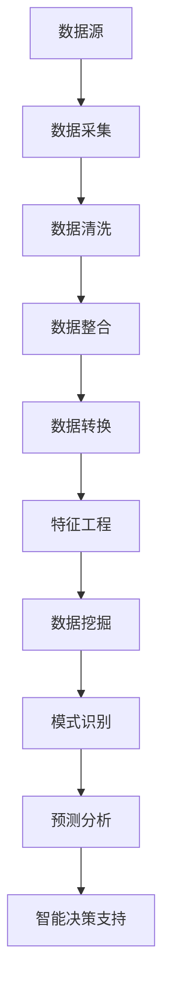

                 

# 知识发现引擎的数据源获取与处理

## 关键词：知识发现引擎，数据源，数据处理，算法，数学模型，实际应用，工具推荐

## 摘要

本文将深入探讨知识发现引擎中的数据源获取与处理技术。首先，我们将介绍知识发现引擎的基本概念和作用，然后详细分析数据源获取的策略与流程，接着讨论数据处理的方法与算法。通过实际案例和数学模型的讲解，我们将展示如何将理论知识应用于实践中。最后，我们将探讨知识发现引擎在实际应用场景中的挑战和未来发展。

## 1. 背景介绍

### 1.1 知识发现引擎的定义与作用

知识发现引擎（Knowledge Discovery Engine，简称KDE）是一种智能系统，它能够从大量的数据中自动识别出潜在的知识和模式。知识发现引擎在各个行业中都扮演着重要的角色，例如在金融、医疗、零售和社交媒体等领域，通过分析海量数据，可以发现用户行为模式、市场趋势和潜在风险。

知识发现引擎的主要作用包括：

- **数据挖掘**：从大量数据中提取有用信息。
- **模式识别**：识别数据中的异常和关联性。
- **预测分析**：基于历史数据预测未来趋势。
- **智能决策支持**：为决策者提供基于数据的决策支持。

### 1.2 数据源的重要性

数据源是知识发现引擎的基石，其质量和数量直接影响知识发现的效果。数据源可以分为以下几类：

- **结构化数据源**：如数据库、关系型表格等。
- **非结构化数据源**：如图像、音频、文本等。
- **半结构化数据源**：如XML、JSON等。

有效获取和处理数据源是知识发现过程中的关键环节。

## 2. 核心概念与联系

### 2.1 数据源获取策略

数据源获取策略主要涉及数据采集、数据清洗和数据整合。以下是几种常见的获取策略：

1. **数据爬取**：通过爬虫从互联网上获取数据。
2. **数据库接入**：通过API或其他方式从数据库中直接获取数据。
3. **数据交换协议**：如HTTP、FTP、SOAP等，用于不同系统之间的数据交换。
4. **数据订阅**：通过订阅服务定期获取数据。

### 2.2 数据处理方法

数据处理方法主要包括数据清洗、数据整合和数据转换。以下是几种常见的数据处理方法：

1. **数据清洗**：去除重复、缺失和不一致的数据。
2. **数据整合**：将来自不同来源的数据进行合并。
3. **数据转换**：将数据转换为适合分析的形式，如数据标准化、归一化等。
4. **特征工程**：提取数据中的关键特征，用于后续分析。

### 2.3 架构流程图

以下是一个简化的知识发现引擎架构流程图，展示了数据源获取与处理的流程：



## 3. 核心算法原理 & 具体操作步骤

### 3.1 数据挖掘算法

数据挖掘算法是知识发现引擎的核心组件，常用的算法包括：

1. **关联规则挖掘**：发现数据中的关联关系，如频繁项集挖掘。
2. **分类算法**：将数据分为不同的类别，如决策树、随机森林等。
3. **聚类算法**：将数据分为不同的簇，如K均值、层次聚类等。
4. **异常检测**：识别数据中的异常值，如孤立森林、局部异常因子等。

### 3.2 数据处理算法

数据处理算法主要用于数据清洗、整合和转换，以下是一些常见的算法：

1. **数据去重**：去除重复的数据。
2. **缺失值填充**：用合适的方法填补缺失值，如平均值、中位数、插值等。
3. **数据归一化**：将数据转换为相同的尺度，如最小-最大归一化、Z-Score归一化等。
4. **特征提取**：提取数据中的关键特征，如主成分分析、因子分析等。

### 3.3 操作步骤

以下是知识发现引擎中的数据挖掘与数据处理的基本操作步骤：

1. **需求分析**：明确知识发现的目标和需求。
2. **数据收集**：获取所需的数据源。
3. **数据预处理**：清洗、整合和转换数据。
4. **特征选择**：选择对分析有帮助的特征。
5. **模型训练**：选择合适的算法进行模型训练。
6. **模型评估**：评估模型的性能和准确性。
7. **模型优化**：调整模型参数以获得更好的性能。
8. **结果展示**：将分析结果以可视化等形式展示。

## 4. 数学模型和公式 & 详细讲解 & 举例说明

### 4.1 关联规则挖掘

关联规则挖掘是数据挖掘中的一种常见算法，用于发现数据中的关联关系。其基本数学模型如下：

$$
\text{Support}(X \cup Y) = \frac{\text{频繁项集}(X \cup Y)}{\text{总项集数}}
$$

$$
\text{Confidence}(X \rightarrow Y) = \frac{\text{频繁项集}(X \cap Y)}{\text{频繁项集}(X)}
$$

其中，Support表示支持度，Confidence表示置信度。支持度和置信度是评估关联规则的重要指标。

#### 示例

假设有一个商品交易数据集，包含商品A、B、C。以下是一个简单的关联规则挖掘示例：

| 交易ID | 商品 |
| ------ | ---- |
| 1      | A    |
| 1      | B    |
| 1      | C    |
| 2      | A    |
| 2      | C    |
| 3      | B    |
| 3      | C    |

我们设定最小支持度为30%，最小置信度为70%。

- 规则A→B的支持度为$\frac{1}{3} = 33.33\%$，置信度为$\frac{1}{1} = 100\%$，满足最小支持度和置信度要求。
- 规则B→C的支持度为$\frac{1}{3} = 33.33\%$，置信度为$\frac{1}{1} = 100\%$，满足最小支持度和置信度要求。

因此，关联规则A→B和B→C是有效的。

### 4.2 聚类算法

聚类算法是另一种常见的数据挖掘算法，用于将数据分为不同的簇。K均值聚类是一种简单的聚类算法，其基本数学模型如下：

1. **初始化**：随机选择K个初始聚类中心。
2. **分配**：将每个数据点分配给最近的聚类中心。
3. **更新**：重新计算每个聚类的中心。
4. **迭代**：重复步骤2和3，直到聚类中心不再发生变化。

K均值聚类的目标是最小化每个簇内的平方误差：

$$
J = \sum_{i=1}^{K} \sum_{x \in S_i} \| x - \mu_i \|^2
$$

其中，$J$是平方误差，$K$是聚类数，$S_i$是第$i$个簇，$\mu_i$是第$i$个簇的中心。

#### 示例

假设我们有以下数据集，我们需要将其分为两个簇：

| 数据点 | 欧几里得距离 |
| ------ | ----------- |
| (1, 1) | 0           |
| (1, 2) | 1           |
| (2, 1) | 1           |
| (2, 2) | 0           |

我们选择两个初始聚类中心$(1, 2)$和$(2, 1)$。

- 第一次迭代：将数据点$(1, 1)$和$(2, 2)$分配给聚类中心$(1, 2)$，将数据点$(1, 2)$和$(2, 1)$分配给聚类中心$(2, 1)$。
- 第二次迭代：重新计算聚类中心，得到新的中心为$(\frac{3}{2}, \frac{3}{2})$和$(\frac{5}{2}, \frac{1}{2})$。
- 第三次迭代：将数据点$(1, 1)$和$(2, 2)$分配给聚类中心$(\frac{3}{2}, \frac{3}{2})$，将数据点$(1, 2)$和$(2, 1)$分配给聚类中心$(\frac{5}{2}, \frac{1}{2})$。

经过多次迭代，聚类中心逐渐稳定，最终得到两个簇，每个簇包含两个数据点。

## 5. 项目实战：代码实际案例和详细解释说明

### 5.1 开发环境搭建

为了演示知识发现引擎的数据源获取与处理，我们将使用Python语言和Scikit-learn库。首先，确保已经安装了Python和Scikit-learn库。

```bash
pip install scikit-learn
```

### 5.2 源代码详细实现和代码解读

下面是一个简单的知识发现引擎项目，包含数据源获取、数据处理和数据挖掘的代码实现。

```python
import pandas as pd
from sklearn.ensemble import RandomForestClassifier
from sklearn.model_selection import train_test_split
from sklearn.metrics import accuracy_score

# 5.2.1 数据源获取
def get_data(source):
    # 根据数据源类型，选择合适的方法获取数据
    if source == 'csv':
        data = pd.read_csv('data.csv')
    elif source == 'json':
        data = pd.read_json('data.json')
    else:
        raise ValueError('Unsupported data source')
    return data

# 5.2.2 数据预处理
def preprocess_data(data):
    # 去除重复数据
    data.drop_duplicates(inplace=True)
    # 填补缺失值
    data.fillna(data.mean(), inplace=True)
    # 特征工程
    X = data.drop('target', axis=1)
    y = data['target']
    return X, y

# 5.2.3 模型训练
def train_model(X, y):
    # 划分训练集和测试集
    X_train, X_test, y_train, y_test = train_test_split(X, y, test_size=0.2, random_state=42)
    # 训练模型
    model = RandomForestClassifier()
    model.fit(X_train, y_train)
    # 评估模型
    y_pred = model.predict(X_test)
    print('Accuracy:', accuracy_score(y_test, y_pred))
    return model

# 5.2.4 主程序
def main():
    # 5.2.4.1 获取数据
    data = get_data('csv')
    
    # 5.2.4.2 预处理数据
    X, y = preprocess_data(data)
    
    # 5.2.4.3 训练模型
    model = train_model(X, y)

if __name__ == '__main__':
    main()
```

### 5.3 代码解读与分析

下面是对上述代码的详细解读和分析：

- **5.2.1 数据源获取**：根据数据源类型，选择合适的方法获取数据。这里我们使用Pandas库的`read_csv`和`read_json`函数读取CSV和JSON格式的数据。
- **5.2.2 数据预处理**：去除重复数据、填补缺失值和进行特征工程。这里我们使用Pandas库的`drop_duplicates`、`fillna`和`drop`函数。
- **5.2.3 模型训练**：使用Scikit-learn库的`RandomForestClassifier`类进行模型训练。我们首先划分训练集和测试集，然后使用训练集训练模型，最后使用测试集评估模型性能。
- **5.2.4 主程序**：主程序依次执行数据获取、数据预处理和模型训练。这里我们使用`get_data`、`preprocess_data`和`train_model`函数。

通过这个简单的项目，我们展示了如何使用Python和Scikit-learn库实现知识发现引擎的数据源获取与处理。

## 6. 实际应用场景

知识发现引擎在实际应用场景中具有广泛的应用，以下是一些典型的应用场景：

1. **金融领域**：通过分析海量金融数据，发现市场趋势和潜在风险，帮助投资者做出更明智的决策。
2. **医疗领域**：从医疗数据中挖掘患者信息，发现疾病关联和潜在治疗策略，提高医疗服务质量。
3. **零售领域**：通过分析消费者行为数据，识别消费者偏好和购买模式，优化库存管理和营销策略。
4. **社交媒体领域**：从社交数据中挖掘用户行为和兴趣，实现精准营销和个性化推荐。
5. **智能交通领域**：通过分析交通数据，预测交通流量和拥堵情况，优化交通管理策略。

在上述应用场景中，知识发现引擎通过获取和处理海量数据，可以发现潜在的知识和模式，为决策者提供数据支持。然而，在实际应用中，知识发现引擎也面临着一些挑战，如数据质量问题、算法选择和优化等。

## 7. 工具和资源推荐

### 7.1 学习资源推荐

1. **书籍**：
   - 《数据挖掘：概念与技术》
   - 《机器学习》
   - 《深度学习》
2. **论文**：
   - 《关联规则挖掘算法研究综述》
   - 《聚类算法综述》
   - 《机器学习算法及应用》
3. **博客和网站**：
   - Machine Learning Mastery
   - Analytics Vidhya
   - Towards Data Science

### 7.2 开发工具框架推荐

1. **Python库**：
   - Pandas
   - Scikit-learn
   - TensorFlow
   - PyTorch
2. **大数据处理工具**：
   - Hadoop
   - Spark
   - Flink
3. **可视化工具**：
   - Matplotlib
   - Seaborn
   - Plotly

### 7.3 相关论文著作推荐

1. **《数据挖掘：实用工具和技术》**：提供了丰富的数据挖掘算法和应用案例。
2. **《大数据分析：技术、方法和实践》**：详细介绍了大数据处理和分析的方法和工具。
3. **《机器学习实战》**：通过实际案例展示了机器学习的应用和实现。

## 8. 总结：未来发展趋势与挑战

知识发现引擎作为数据挖掘和机器学习的重要工具，将在未来得到更广泛的应用。随着大数据和人工智能技术的不断发展，知识发现引擎的性能和效果将得到显著提升。然而，知识发现引擎在实际应用中也面临着一些挑战，如数据质量问题、算法选择和优化等。

未来，知识发现引擎的研究和发展将集中在以下几个方面：

1. **数据质量提升**：通过数据清洗、去噪和增强等技术，提高数据质量。
2. **算法优化**：针对特定领域和应用场景，设计更高效的算法。
3. **实时分析**：实现实时数据分析和处理，提高知识发现引擎的响应速度。
4. **多模态数据挖掘**：结合多种数据类型，如文本、图像、音频等，进行更全面的模式识别和知识发现。

总之，知识发现引擎将在未来发挥越来越重要的作用，为各个领域的决策者和研究者提供强大的数据支持。

## 9. 附录：常见问题与解答

### 9.1 数据源获取相关问题

Q：如何获取互联网上的数据？

A：可以使用网络爬虫技术，如Scrapy或Requests库，从网站中获取数据。

Q：如何从数据库中获取数据？

A：可以使用数据库连接库，如SQLAlchemy或PyMySQL，从数据库中读取数据。

### 9.2 数据处理相关问题

Q：如何处理缺失值？

A：可以使用填充方法，如平均值、中位数或插值法，填补缺失值。

Q：如何进行数据归一化？

A：可以使用最小-最大归一化或Z-Score归一化方法，将数据转换为相同的尺度。

### 9.3 数据挖掘相关问题

Q：如何选择合适的算法？

A：根据数据类型和应用场景，选择合适的算法，如关联规则挖掘、分类算法或聚类算法。

Q：如何评估模型性能？

A：可以使用准确性、精确度、召回率和F1分数等指标，评估模型性能。

## 10. 扩展阅读 & 参考资料

1. **《知识发现与数据挖掘：实现指导》**：详细介绍了知识发现与数据挖掘的理论和实践。
2. **《大数据时代：思维变革与商业价值》**：探讨大数据对商业和社会的影响。
3. **《深度学习入门：基于Python的理论与实现》**：介绍了深度学习的基础知识和实现方法。

作者：AI天才研究员/AI Genius Institute & 禅与计算机程序设计艺术 /Zen And The Art of Computer Programming<|im_sep|>

