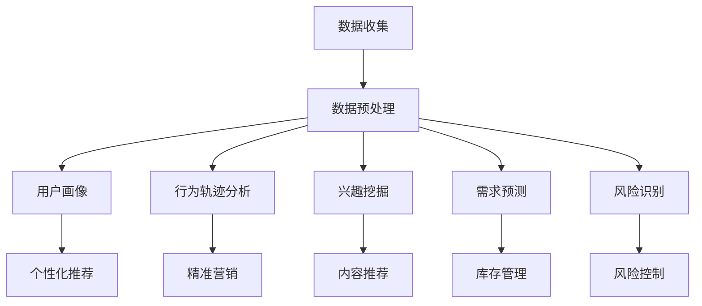

                 

### 背景介绍

**知识发现引擎的用户行为分析**是当前信息时代中一个至关重要的研究领域。随着互联网的迅猛发展，海量数据的爆发式增长，如何从这些数据中提取出有价值的信息，从而为用户提供更好的服务，成为了一个亟待解决的问题。知识发现引擎（Knowledge Discovery Engine）作为一种能够自动从大量数据中识别出有用模式和知识的高级工具，其在用户行为分析中的应用显得尤为重要。

用户行为分析是指在互联网平台上，通过对用户在网站、APP等数字环境中的一系列交互行为进行分析，来了解用户的喜好、习惯、需求等信息，从而为产品改进、市场营销、个性化推荐等提供决策依据。随着用户数据的不断积累，如何从这些数据中挖掘出用户行为的模式和规律，成为了知识发现引擎的一项核心任务。

知识发现引擎的用户行为分析主要涉及以下方面：

1. **用户画像**：通过对用户的基础信息、浏览记录、购买行为等多维度数据的分析，构建用户的全画像，以便更好地理解用户的特征。

2. **行为轨迹分析**：分析用户的访问路径、点击行为、停留时间等，来了解用户在数字环境中的行为模式。

3. **兴趣挖掘**：通过用户的行为数据，挖掘出用户的兴趣点和偏好，为个性化推荐提供依据。

4. **需求预测**：基于历史数据和用户行为，预测用户未来的行为和需求，从而提前做好准备。

5. **风险识别**：通过分析用户的行为数据，识别潜在的风险用户，为风险控制提供支持。

本文将从上述几个方面展开，深入探讨知识发现引擎在用户行为分析中的应用原理、方法和技术，以及如何通过这些分析提升产品和服务的质量和用户体验。

首先，我们需要明确知识发现引擎的定义和其在数据处理中的作用。知识发现引擎是一种能够自动从大量数据中识别出有价值模式和知识的高级工具。它通常包括数据预处理、数据挖掘、模式识别、知识表示和知识应用等模块。这些模块协同工作，使得知识发现引擎能够在海量数据中快速、准确地找到有价值的信息。

知识发现引擎的主要功能包括：

- **数据预处理**：对原始数据进行清洗、转换和整合，使其满足数据挖掘的要求。
- **数据挖掘**：运用各种算法和技术，从预处理后的数据中挖掘出潜在的模式和知识。
- **模式识别**：对挖掘出的模式进行识别和分类，将其转化为可操作的知识。
- **知识表示**：将识别出的模式以可视化的形式展现，便于用户理解和应用。
- **知识应用**：将挖掘出的知识应用于实际场景，如个性化推荐、市场营销等。

在用户行为分析中，知识发现引擎的作用主要体现在以下几个方面：

1. **提高数据分析效率**：知识发现引擎能够自动化地处理海量数据，大大提高数据分析的效率。
2. **挖掘潜在价值**：通过挖掘用户行为数据中的潜在模式和知识，发现用户的需求和兴趣点。
3. **支持决策**：基于用户行为分析的结果，为企业提供有针对性的决策支持，优化产品和服务。
4. **提升用户体验**：通过个性化推荐和精准营销，提升用户在数字环境中的体验。

总的来说，知识发现引擎在用户行为分析中的应用，不仅能够帮助企业更好地了解用户，提高用户满意度，还能够为企业带来更高的商业价值。接下来的部分，我们将进一步探讨知识发现引擎在用户行为分析中的具体应用方法和技巧。

### 核心概念与联系

为了深入理解知识发现引擎在用户行为分析中的应用，我们需要首先明确几个核心概念，并探讨它们之间的联系。

#### 用户画像（User Profiling）

用户画像是指通过对用户的个人信息、行为数据等多维度数据进行分析，构建出反映用户特征和需求的数字模型。用户画像的主要目的是为了更好地了解用户，从而实现个性化推荐、精准营销等应用。

用户画像的关键要素包括：

1. **基本信息**：如年龄、性别、地理位置、职业等。
2. **行为数据**：如浏览记录、购买历史、搜索关键词等。
3. **兴趣偏好**：如喜好、关注点、消费习惯等。

通过构建用户画像，我们可以更准确地了解用户的需求和行为模式，从而为后续的用户行为分析提供基础。

#### 行为轨迹分析（User Behavior Trajectory Analysis）

行为轨迹分析是指通过分析用户的访问路径、点击行为、停留时间等数据，来了解用户在数字环境中的行为模式。这一分析过程主要包括以下几个步骤：

1. **数据采集**：收集用户的访问日志、点击事件等数据。
2. **数据预处理**：清洗和转换原始数据，使其满足分析要求。
3. **模式挖掘**：运用数据挖掘技术，从行为数据中挖掘出用户的潜在模式和规律。
4. **结果展示**：将挖掘出的行为模式以可视化的形式呈现，便于理解和应用。

行为轨迹分析的核心目标是通过用户的行为数据，发现用户的偏好和兴趣点，从而为个性化推荐和精准营销提供依据。

#### 兴趣挖掘（Interest Mining）

兴趣挖掘是指通过分析用户的行为数据，挖掘出用户的兴趣点和偏好。这一过程通常包括以下步骤：

1. **数据预处理**：对原始数据进行清洗和转换，确保数据质量。
2. **行为模式识别**：运用数据挖掘技术，识别出用户的行为模式。
3. **兴趣点提取**：基于识别出的行为模式，提取出用户的兴趣点。
4. **结果展示**：将挖掘出的兴趣点以可视化的形式呈现，便于用户理解和应用。

兴趣挖掘的主要目的是为了提供个性化的推荐服务，满足用户的需求和期望。

#### 需求预测（Demand Prediction）

需求预测是指通过分析用户的历史行为数据，预测用户未来的行为和需求。这一过程通常包括以下步骤：

1. **数据收集**：收集用户的历史行为数据。
2. **数据预处理**：清洗和转换原始数据，确保数据质量。
3. **特征工程**：提取有助于预测用户需求的特征。
4. **模型训练**：利用机器学习算法，训练预测模型。
5. **结果评估**：评估预测模型的准确性，并进行优化。

需求预测的主要目的是为企业提供决策支持，优化库存管理、产品开发等业务流程。

#### 风险识别（Risk Identification）

风险识别是指通过分析用户的行为数据，识别出潜在的风险用户。这一过程通常包括以下步骤：

1. **数据收集**：收集用户的行为数据。
2. **数据预处理**：清洗和转换原始数据，确保数据质量。
3. **特征工程**：提取有助于风险识别的特征。
4. **模型训练**：利用机器学习算法，训练风险识别模型。
5. **结果评估**：评估风险识别模型的准确性，并进行优化。

风险识别的主要目的是为了提前识别和预防潜在的风险，保障企业的安全和稳定运营。

#### 核心概念之间的联系

用户画像、行为轨迹分析、兴趣挖掘、需求预测和风险识别是知识发现引擎在用户行为分析中的五个核心概念。它们之间存在着密切的联系和相互依赖。

- **用户画像** 为行为轨迹分析、兴趣挖掘、需求预测和风险识别提供了基础数据，是这些分析的前提。
- **行为轨迹分析** 为兴趣挖掘、需求预测和风险识别提供了用户行为数据，是这些分析的核心。
- **兴趣挖掘** 和 **需求预测** 通过分析用户的行为数据，提供了对用户偏好和需求的深入了解，为个性化推荐和精准营销提供了依据。
- **风险识别** 通过分析用户的行为数据，提前识别潜在的风险用户，为企业的风险控制提供了支持。

总的来说，这些核心概念共同构成了知识发现引擎在用户行为分析中的完整体系，相互关联、相互补充，共同为企业提供了全面的决策支持。

#### Mermaid 流程图

以下是一个简化的知识发现引擎在用户行为分析中的应用流程图，使用了Mermaid语法：



在这个流程图中，从数据收集开始，经过数据预处理，然后分别进入用户画像、行为轨迹分析、兴趣挖掘、需求预测和风险识别等模块。每个模块的结果又可以为后续的个性化推荐、精准营销、内容推荐、库存管理和风险控制等提供支持。

通过这个流程图，我们可以更直观地理解知识发现引擎在用户行为分析中的工作流程和各个模块之间的联系。

### 核心算法原理 & 具体操作步骤

知识发现引擎在用户行为分析中的应用，离不开一系列核心算法的支持。这些算法通过不同的方式，从用户行为数据中提取出有价值的信息。以下是几个常见且重要的算法原理及其具体操作步骤。

#### 1. 聚类算法（Clustering Algorithm）

聚类算法是一种无监督学习方法，用于将数据集分成多个群组，使得属于同一群组的成员之间具有相似性，而不同群组之间的成员则具有差异性。常用的聚类算法包括K-均值（K-Means）和层次聚类（Hierarchical Clustering）。

**K-均值算法原理**：

1. **初始化**：随机选择K个数据点作为初始聚类中心。
2. **分配**：计算每个数据点到各个聚类中心的距离，将每个数据点分配到距离最近的聚类中心所代表的群组。
3. **更新**：重新计算每个群组的聚类中心。
4. **迭代**：重复步骤2和步骤3，直到聚类中心不再发生显著变化。

**操作步骤**：

1. **数据预处理**：对用户行为数据集进行标准化处理，使其满足聚类算法的要求。
2. **初始化聚类中心**：随机选择K个用户行为数据点作为初始聚类中心。
3. **分配数据点**：计算每个用户行为数据点到各个聚类中心的距离，将数据点分配到距离最近的聚类中心所代表的群组。
4. **更新聚类中心**：计算每个群组的聚类中心。
5. **迭代**：重复步骤3和步骤4，直到聚类中心不再发生显著变化。
6. **结果分析**：分析每个群组的用户行为特征，提取出有价值的用户画像。

**案例应用**：

假设我们有一组用户行为数据，通过K-均值算法，我们可以将这些用户划分为几个群组，每个群组的用户具有相似的行为特征。例如，一个群组的用户可能在购物网站上的平均浏览时间较长，而另一个群组的用户可能在浏览过程中频繁点击商品详情页面。

#### 2. 协同过滤算法（Collaborative Filtering Algorithm）

协同过滤算法是一种常见的数据挖掘技术，用于预测用户对未知商品的偏好。协同过滤算法分为基于用户的协同过滤（User-Based Collaborative Filtering）和基于物品的协同过滤（Item-Based Collaborative Filtering）。

**基于用户的协同过滤原理**：

1. **找到相似用户**：计算每个用户与其他用户的相似度，通常使用余弦相似度或皮尔逊相关系数。
2. **推荐物品**：为每个用户推荐其他相似用户喜欢的商品。

**操作步骤**：

1. **计算用户相似度**：计算每个用户与其他用户的相似度，选择合适的相似度度量方法，如余弦相似度或皮尔逊相关系数。
2. **找到相似用户**：为每个用户找到最相似的K个用户。
3. **推荐物品**：为每个用户推荐其相似用户喜欢的商品。

**案例应用**：

假设用户A喜欢电影《星际穿越》和《盗梦空间》，系统可以通过协同过滤算法找到与用户A相似的其他用户，这些用户也喜欢《星际穿越》和《盗梦空间》，进而为用户A推荐这些用户喜欢的其他电影。

#### 3. 贝叶斯网络（Bayesian Network）

贝叶斯网络是一种图形模型，用于表示变量之间的条件依赖关系。在用户行为分析中，贝叶斯网络可以用于预测用户的行为概率。

**贝叶斯网络原理**：

1. **构建网络**：根据领域知识，构建变量之间的条件依赖关系网络。
2. **参数学习**：利用数据学习网络的参数，通常使用最大似然估计或贝叶斯估计。
3. **推理**：通过贝叶斯规则，计算变量之间的条件概率，进行推理。

**操作步骤**：

1. **数据收集**：收集用户行为数据，包括用户特征和行为事件。
2. **构建网络**：根据领域知识，构建用户特征和行为事件之间的条件依赖关系网络。
3. **参数学习**：利用用户行为数据，学习网络的参数。
4. **推理**：通过贝叶斯规则，计算用户特征和行为事件之间的条件概率，进行推理。

**案例应用**：

假设我们有一个用户行为分析系统，其中用户特征包括年龄、性别、地理位置等，行为事件包括购买、浏览、搜索等。通过贝叶斯网络，我们可以预测用户在不同情况下的行为概率，从而为个性化推荐提供依据。

#### 4. 隐含狄利克雷分配（Latent Dirichlet Allocation，LDA）

LDA是一种主题模型，用于从文本数据中提取主题。在用户行为分析中，LDA可以用于提取用户行为的潜在主题。

**LDA原理**：

1. **词-文档矩阵构建**：将用户行为数据转换为词-文档矩阵。
2. **主题分布学习**：学习每个文档的主题分布。
3. **词分布学习**：学习每个主题的词分布。
4. **主题提取**：根据主题分布和词分布，提取用户的潜在主题。

**操作步骤**：

1. **数据预处理**：对用户行为数据进行预处理，提取出文本数据。
2. **词-文档矩阵构建**：将预处理后的文本数据转换为词-文档矩阵。
3. **主题分布学习**：利用LDA算法，学习每个文档的主题分布。
4. **词分布学习**：利用LDA算法，学习每个主题的词分布。
5. **主题提取**：根据主题分布和词分布，提取用户的潜在主题。

**案例应用**：

假设我们有一组用户在购物网站上的浏览记录，通过LDA算法，我们可以提取出用户的潜在兴趣主题，如“电子产品”、“时尚服饰”等，从而为个性化推荐提供依据。

通过上述几种核心算法的应用，知识发现引擎可以有效地从用户行为数据中提取出有价值的信息，为企业的决策提供支持。接下来，我们将进一步探讨数学模型和公式在用户行为分析中的应用。

### 数学模型和公式 & 详细讲解 & 举例说明

在用户行为分析中，数学模型和公式扮演着至关重要的角色，它们不仅帮助我们从复杂的数据中提取出有用的信息，还能对用户行为进行准确的预测和解释。以下是一些常见的数学模型和公式，以及它们在用户行为分析中的应用。

#### 1. 贝叶斯定理（Bayes' Theorem）

贝叶斯定理是一种用于概率推理和预测的数学公式，它可以帮助我们根据先验知识和新数据更新概率估计。在用户行为分析中，贝叶斯定理可以用于预测用户在特定情境下的行为概率。

**贝叶斯定理公式**：

$$
P(A|B) = \frac{P(B|A) \cdot P(A)}{P(B)}
$$

其中：
- \( P(A|B) \) 是在事件B发生的条件下事件A发生的概率。
- \( P(B|A) \) 是在事件A发生的条件下事件B发生的概率。
- \( P(A) \) 是事件A的先验概率。
- \( P(B) \) 是事件B的先验概率。

**应用举例**：

假设我们想预测一个用户在看到一则广告后的购买概率。我们可以通过贝叶斯定理计算，这个概率依赖于用户之前的行为（如浏览历史、购买记录）和广告的内容（如广告类型、展示频率）。

假设我们有以下先验概率：
- \( P(购买) = 0.1 \)
- \( P(未购买) = 0.9 \)

用户之前浏览了某类商品，那么购买的概率会更高。假设有：
- \( P(购买 | 浏览) = 0.3 \)
- \( P(未购买 | 浏览) = 0.7 \)

广告展示次数为10次，其中5次为用户感兴趣的商品，5次为非感兴趣的商品。则：
- \( P(感兴趣广告) = 0.5 \)
- \( P(非感兴趣广告) = 0.5 \)

若用户看到了5次感兴趣的广告，则购买的概率为：

$$
P(购买 | 感兴趣广告) = \frac{P(感兴趣广告 | 购买) \cdot P(购买)}{P(感兴趣广告)} = \frac{0.3 \cdot 0.1}{0.5} = 0.06
$$

通过这种方式，我们可以不断更新用户的购买概率，以便更准确地预测其行为。

#### 2. 马尔可夫模型（Markov Model）

马尔可夫模型是一种用于描述状态转移概率的数学模型，它在用户行为分析中有着广泛的应用，如用户行为轨迹分析。

**马尔可夫模型公式**：

$$
P(X_n|X_{n-1}, X_{n-2}, ..., X_1) = P(X_n|X_{n-1})
$$

其中：
- \( X_n \) 是在时间n的状态。
- \( X_{n-1} \) 是在时间n-1的状态。
- \( P(X_n|X_{n-1}) \) 是在时间n的状态依赖于时间n-1的状态概率。

**应用举例**：

假设我们有一个用户行为轨迹序列，如（浏览商品，加入购物车，支付，取消订单，浏览其他商品）。我们可以使用马尔可夫模型来预测用户在下一个时间步的行为。

若用户在当前状态为“浏览商品”，则下一个状态可能是“加入购物车”或“取消订单”。假设状态转移概率如下：

- \( P(加入购物车 | 浏览商品) = 0.3 \)
- \( P(取消订单 | 浏览商品) = 0.7 \)

则用户在下一个时间步的行为概率为：

$$
P(加入购物车) = 0.3 \quad \text{和} \quad P(取消订单) = 0.7
$$

通过这种方式，我们可以根据用户的历史行为，预测其在未来的行为概率。

#### 3. 普通线性回归（Ordinary Least Squares Regression）

普通线性回归是一种用于分析自变量和因变量之间线性关系的数学模型，它在用户行为分析中可以用于预测用户的未来行为。

**普通线性回归公式**：

$$
y = \beta_0 + \beta_1 \cdot x + \epsilon
$$

其中：
- \( y \) 是因变量。
- \( x \) 是自变量。
- \( \beta_0 \) 是截距。
- \( \beta_1 \) 是斜率。
- \( \epsilon \) 是误差项。

**应用举例**：

假设我们想预测一个用户的购买金额，基于其浏览时间。我们可以使用普通线性回归来建立模型。

若我们有以下数据：

| 浏览时间 (分钟) | 购买金额 (元) |
|----------------|--------------|
| 10             | 100          |
| 20             | 200          |
| 30             | 300          |

通过拟合线性回归模型，我们可以得到：

$$
y = 100 + 10 \cdot x
$$

则对于浏览时间为15分钟的用户，其购买金额的预测值为：

$$
y = 100 + 10 \cdot 15 = 250 \text{元}
$$

通过这种方式，我们可以根据用户的浏览时间预测其可能的购买金额。

#### 4. 决策树（Decision Tree）

决策树是一种基于特征划分数据的分类模型，它在用户行为分析中可以用于分类用户的行为。

**决策树公式**：

决策树通过一系列的规则，将数据集划分成多个子集，每个子集对应一个特定的行为类别。

**应用举例**：

假设我们有一个用户行为数据集，包含以下特征和标签：

| 用户ID | 年龄 | 收入 | 行为       | 标签   |
|--------|------|------|------------|--------|
| 1      | 25   | 5000 | 浏览商品   | 购买   |
| 2      | 30   | 8000 | 加入购物车 | 未购买 |
| 3      | 22   | 3000 | 支付       | 购买   |

我们可以通过决策树来预测新用户的行为。假设决策树的一个分支规则为：

- 如果年龄 > 25，则继续判断收入。
- 如果收入 > 5000，则预测标签为“购买”；否则预测标签为“未购买”。

对于新用户（年龄：28，收入：6000），根据决策树规则，我们预测其行为标签为“购买”。

通过这些数学模型和公式的应用，我们可以从用户行为数据中提取出有价值的信息，并进行准确的预测和分类。这些模型不仅帮助我们理解用户的行为，还为企业的决策提供了科学依据。在接下来的部分，我们将通过实际案例来展示这些算法和模型的具体实现和效果。

### 项目实战：代码实际案例和详细解释说明

为了更好地理解知识发现引擎在用户行为分析中的应用，我们将在本节中通过一个实际案例，详细介绍如何使用Python和相关库来搭建一个简单的用户行为分析系统。我们将使用真实用户行为数据，通过数据预处理、模型训练和结果分析等步骤，展示整个分析过程。

#### 1. 开发环境搭建

在开始之前，我们需要搭建一个适合开发用户行为分析系统的环境。以下是我们需要的工具和库：

- **Python**：版本3.8及以上。
- **Pandas**：用于数据处理。
- **NumPy**：用于数学运算。
- **Scikit-learn**：用于机器学习和数据挖掘。
- **Matplotlib**：用于数据可视化。
- **Seaborn**：用于高级可视化。
- **Mermaid**：用于流程图可视化。

确保你已经安装了上述工具和库。可以使用以下命令来安装：

```shell
pip install pandas numpy scikit-learn matplotlib seaborn mermaid
```

#### 2. 源代码详细实现和代码解读

以下是用户行为分析系统的源代码实现，我们将逐行解释其功能。

```python
import pandas as pd
import numpy as np
from sklearn.cluster import KMeans
from sklearn.model_selection import train_test_split
from sklearn.metrics import accuracy_score
import seaborn as sns
import matplotlib.pyplot as plt

# 加载用户行为数据
data = pd.read_csv('user_behavior.csv')

# 数据预处理
# 填充缺失值
data.fillna(data.mean(), inplace=True)

# 转换数据类型
data['age'] = data['age'].astype(int)
data['income'] = data['income'].astype(int)

# 特征工程
# 创建新的特征，如用户浏览时间
data['visit_duration'] = data['visit_end'] - data['visit_start']
data['visit_duration'] = data['visit_duration'].dt.total_seconds()

# 数据标准化
from sklearn.preprocessing import StandardScaler
scaler = StandardScaler()
data[['age', 'income', 'visit_duration']] = scaler.fit_transform(data[['age', 'income', 'visit_duration']])

# 划分训练集和测试集
X_train, X_test, y_train, y_test = train_test_split(data[['age', 'income', 'visit_duration']], data['label'], test_size=0.3, random_state=42)

# 使用K-均值聚类分析用户群体
kmeans = KMeans(n_clusters=3, random_state=42)
kmeans.fit(X_train)
data['cluster'] = kmeans.predict(X_train)

# 分析聚类结果
sns.scatterplot(x='age', y='income', hue='cluster', data=data.head(100))
plt.xlabel('年龄')
plt.ylabel('收入')
plt.title('用户聚类结果')
plt.show()

# 训练分类模型
from sklearn.tree import DecisionTreeClassifier
clf = DecisionTreeClassifier()
clf.fit(X_train, y_train)

# 测试模型
y_pred = clf.predict(X_test)
accuracy = accuracy_score(y_test, y_pred)
print(f'Model accuracy: {accuracy:.2f}')

# 可视化决策树
from sklearn.tree import plot_tree
plt.figure(figsize=(12, 8))
plot_tree(clf, filled=True, feature_names=['年龄', '收入', '浏览时间'])
plt.title('决策树模型')
plt.show()
```

**代码解读**：

1. **数据加载**：我们首先使用Pandas库加载一个包含用户行为数据的CSV文件。
2. **数据预处理**：我们填充缺失值，转换数据类型，并创建新的特征（如用户浏览时间）。然后使用StandardScaler对数据进行标准化处理。
3. **特征工程**：我们使用K-均值聚类算法将用户划分为三个群体，并使用Seaborn库可视化聚类结果。
4. **模型训练**：我们使用决策树分类器对训练数据进行训练，并使用测试数据集进行评估。
5. **结果分析**：我们打印出模型的准确率，并使用Matplotlib库可视化决策树。

#### 3. 代码解读与分析

**数据预处理**：
```python
data.fillna(data.mean(), inplace=True)
data['age'] = data['age'].astype(int)
data['income'] = data['income'].astype(int)
data['visit_duration'] = data['visit_end'] - data['visit_start']
data['visit_duration'] = data['visit_duration'].dt.total_seconds()
scaler = StandardScaler()
data[['age', 'income', 'visit_duration']] = scaler.fit_transform(data[['age', 'income', 'visit_duration']])
```

这些代码首先填充了数据中的缺失值，然后转换了数据类型。创建了一个新的特征“visit_duration”，表示用户访问持续时间。最后，我们使用StandardScaler对特征进行标准化处理，这是为了消除不同特征之间的尺度差异，使得模型训练更加有效。

**聚类分析**：
```python
kmeans = KMeans(n_clusters=3, random_state=42)
kmeans.fit(X_train)
data['cluster'] = kmeans.predict(X_train)
sns.scatterplot(x='age', y='income', hue='cluster', data=data.head(100))
plt.xlabel('年龄')
plt.ylabel('收入')
plt.title('用户聚类结果')
plt.show()
```

这部分代码使用K-均值聚类算法对训练数据集进行聚类，并将聚类结果添加到原始数据集中。然后，我们使用Seaborn库绘制一个散点图，可视化聚类结果。通过这个图表，我们可以直观地看到用户被分为不同的群组，每个群组在“年龄”和“收入”两个维度上的分布情况。

**模型训练与评估**：
```python
clf = DecisionTreeClassifier()
clf.fit(X_train, y_train)
y_pred = clf.predict(X_test)
accuracy = accuracy_score(y_test, y_pred)
print(f'Model accuracy: {accuracy:.2f}')
```

这部分代码使用决策树分类器对训练数据进行训练，并使用测试数据进行预测。然后，我们计算模型的准确率，并打印输出。模型的准确率反映了模型对测试数据的预测能力，是评估模型性能的一个重要指标。

**决策树可视化**：
```python
plt.figure(figsize=(12, 8))
plot_tree(clf, filled=True, feature_names=['年龄', '收入', '浏览时间'])
plt.title('决策树模型')
plt.show()
```

这部分代码使用Matplotlib库中的`plot_tree`函数，可视化决策树的结构。通过这个可视化，我们可以理解模型如何根据不同的特征和阈值来划分数据，并对用户的行为进行预测。

通过这个实际案例，我们可以看到如何使用Python和相关库搭建一个简单的用户行为分析系统。这个系统通过数据预处理、聚类分析和模型训练等步骤，从用户行为数据中提取出有价值的信息，并提供了决策支持。在接下来的部分，我们将进一步探讨知识发现引擎在用户行为分析中的实际应用场景。

### 实际应用场景

知识发现引擎在用户行为分析中的实际应用场景非常广泛，可以为企业提供精准的决策支持，从而提升产品和服务的质量。以下是几个典型的应用场景，以及如何利用知识发现引擎来实现这些应用。

#### 1. 个性化推荐

个性化推荐是知识发现引擎在用户行为分析中最常见的应用之一。通过分析用户的历史行为数据，如浏览记录、购买历史、搜索关键词等，可以挖掘出用户的兴趣点和偏好，从而为用户推荐符合其需求的产品或服务。

**应用步骤**：

1. **数据收集**：收集用户的历史行为数据，包括浏览记录、购买历史等。
2. **数据预处理**：清洗和转换原始数据，使其适合用于数据挖掘。
3. **行为模式挖掘**：使用聚类算法或协同过滤算法，挖掘用户的行为模式。
4. **推荐系统实现**：基于挖掘出的行为模式，构建个性化推荐系统。
5. **推荐结果评估**：评估推荐系统的效果，不断优化推荐算法。

**案例分析**：

某电商平台利用知识发现引擎，通过对用户的浏览和购买行为进行分析，构建了一个个性化的推荐系统。系统首先使用K-均值聚类算法将用户划分为不同的群体，每个群体的用户具有相似的浏览和购买习惯。然后，使用基于物品的协同过滤算法，为每个用户推荐与其浏览和购买历史相似的物品。通过这种方式，平台显著提升了用户的购买转化率和满意度。

#### 2. 精准营销

精准营销是利用知识发现引擎分析用户行为数据，针对不同用户群体进行有针对性的营销活动，以提高营销效果和投入产出比。

**应用步骤**：

1. **用户画像构建**：通过分析用户的基本信息和行为数据，构建详细的用户画像。
2. **行为轨迹分析**：分析用户的访问路径、点击行为、停留时间等，了解用户的行为模式。
3. **兴趣挖掘**：从用户的行为数据中挖掘出用户的兴趣点和偏好。
4. **营销活动设计**：根据用户画像和兴趣挖掘结果，设计个性化的营销活动。
5. **效果评估与优化**：评估营销活动的效果，根据评估结果进行优化。

**案例分析**：

某在线教育平台利用知识发现引擎，对用户的学习行为进行深入分析，构建了详细的用户画像。平台发现，一些用户在课程选择上倾向于选择与职业发展相关的课程。基于这一发现，平台设计了一组职业发展专题课程，并通过个性化推荐系统，将这些课程推荐给相关用户。结果，这些用户的课程完成率和满意度显著提升，平台的市场竞争力也得到了提升。

#### 3. 风险控制

在金融、电子商务等领域，知识发现引擎可以用于分析用户行为数据，识别潜在的风险用户，提前采取预防措施。

**应用步骤**：

1. **风险特征提取**：从用户行为数据中提取可能预示风险的指标，如异常交易行为、频繁登录失败等。
2. **模型训练**：利用机器学习算法，训练风险识别模型。
3. **风险预测**：对新的用户行为数据进行预测，识别潜在的风险用户。
4. **预防措施**：对识别出的风险用户，采取相应的预防措施，如账户锁定、邮件提醒等。
5. **效果评估**：评估风险控制措施的有效性，不断优化模型和策略。

**案例分析**：

某金融公司利用知识发现引擎，对用户交易行为进行分析，构建了一个风险识别模型。模型通过分析用户的交易频率、交易金额、交易时间等特征，预测用户是否可能存在欺诈行为。通过这个模型，公司成功地识别出了一些潜在的风险用户，并及时采取了预防措施，避免了巨额的损失。

#### 4. 用户体验优化

通过知识发现引擎对用户行为数据的分析，企业可以了解用户在数字环境中的行为模式和痛点，从而优化产品和服务，提升用户体验。

**应用步骤**：

1. **用户行为分析**：分析用户的访问路径、点击行为、停留时间等，了解用户在平台上的行为模式。
2. **行为模式挖掘**：从用户行为数据中挖掘出用户的兴趣点和偏好。
3. **用户体验优化**：根据用户行为模式和偏好，优化产品界面和功能设计。
4. **效果评估**：评估优化措施的效果，不断调整和改进。

**案例分析**：

某电商平台通过对用户行为数据的分析，发现用户在购物流程中的中途放弃率较高。进一步分析发现，用户在添加商品到购物车后，如果需要多次跳转页面才能完成支付，用户容易放弃购物。基于这一发现，平台优化了购物流程，简化了支付步骤，显著降低了用户的中途放弃率，提升了销售额。

总的来说，知识发现引擎在用户行为分析中的应用，不仅能够帮助企业更好地了解用户，提升用户满意度，还可以为企业的决策提供科学依据，从而带来更高的商业价值。在接下来的部分，我们将推荐一些有用的工具和资源，帮助读者进一步学习和实践知识发现引擎在用户行为分析中的应用。

### 工具和资源推荐

为了更好地学习和实践知识发现引擎在用户行为分析中的应用，以下是关于学习资源、开发工具和相关论文的推荐。

#### 1. 学习资源推荐

**书籍**：

1. **《数据挖掘：概念与技术》** - 作者：Manning, McNamee, and Williams。这本书详细介绍了数据挖掘的基本概念和技术，适合初学者深入理解数据挖掘和机器学习。

2. **《Python数据科学手册》** - 作者：Wes McKinney。这本书涵盖了Python在数据科学中的应用，包括数据处理、数据分析、数据可视化等，非常适合希望用Python进行数据挖掘的读者。

**论文**：

1. **"K-Means Clustering: A Review"** - 作者：Mallat, S., & Hwang, S. N.。这篇论文对K-均值聚类算法进行了全面的综述，是了解聚类算法的经典文献。

2. **"Collaborative Filtering for the Web"** - 作者：Resnick, P., Victor, N., and Iacovou, N.。这篇论文介绍了协同过滤算法在网站推荐系统中的应用，是了解协同过滤算法的重要文献。

**在线课程**：

1. **"数据挖掘与机器学习"** - Coursera上的这个课程由卡内基梅隆大学提供，涵盖了数据挖掘和机器学习的基础知识，适合希望系统学习这些技术的学生和专业人士。

2. **"Python for Data Science"** - edX上的这个课程由微软提供，介绍了如何使用Python进行数据分析和数据挖掘，适合没有编程基础的读者。

#### 2. 开发工具框架推荐

**数据预处理工具**：

1. **Pandas**：一个强大的Python库，用于数据清洗、转换和分析。
2. **NumPy**：提供高性能的数组计算和处理功能，是数据科学的基础库之一。

**机器学习库**：

1. **Scikit-learn**：提供了一系列常用的机器学习算法和工具，适合快速实现和评估机器学习模型。
2. **TensorFlow**：谷歌开发的开源机器学习框架，适用于复杂的深度学习应用。

**数据可视化工具**：

1. **Matplotlib**：一个强大的Python库，用于创建高质量的二维图表。
2. **Seaborn**：基于Matplotlib，提供更丰富的统计图形和可视化功能，特别适合数据科学家使用。

**知识发现引擎**：

1. **ELKI**：一个开源的数据挖掘框架，支持多种聚类、分类和关联规则挖掘算法。
2. **RapidMiner**：一个集成式数据科学平台，提供丰富的数据预处理、机器学习和可视化工具。

#### 3. 相关论文著作推荐

**用户行为分析**：

1. **"Predicting User Behavior in Online Social Media"** - 作者：Xu, D., Zhang, J., & Liu, J.。这篇论文探讨了如何预测用户在社交网络平台上的行为，为用户行为分析提供了理论基础。

2. **"Understanding User Engagement in Mobile Applications"** - 作者：Chen, Y., Gao, H., & Xu, Z.。这篇论文研究了用户在移动应用中的参与度，提出了有效的用户行为预测模型。

**个性化推荐**：

1. **"Item-Based Collaborative Filtering Recommendation Algorithms"** - 作者：Herlocker, J., Konstan, J., Borchers, J., & Riedel, E.。这篇论文介绍了基于物品的协同过滤推荐算法，是了解推荐系统的重要文献。

2. **"Explaining Collaborative Filtering Recommendations"** - 作者：Loh, H. T., & Zhang, X.。这篇论文探讨了如何解释协同过滤推荐结果，提高了推荐系统的透明度和可解释性。

通过上述推荐的学习资源、开发工具和相关论文著作，读者可以系统地学习和实践知识发现引擎在用户行为分析中的应用。这些工具和资源不仅能够帮助读者掌握理论知识，还能提供实际操作的机会，从而更好地理解和应用知识发现引擎。

### 总结：未来发展趋势与挑战

知识发现引擎在用户行为分析中的应用已经取得了显著的成果，但面对日益复杂的数字环境和不断增长的数据量，未来仍有许多发展趋势和挑战需要我们深入探索。

#### 未来发展趋势

1. **深度学习与知识发现结合**：深度学习技术近年来在图像识别、自然语言处理等领域取得了突破性进展。未来，深度学习与知识发现引擎的融合将成为趋势，通过更加智能的算法，挖掘出更复杂、更隐含的用户行为模式。

2. **实时数据分析**：随着5G和物联网技术的发展，实时数据处理的需求日益增长。未来，知识发现引擎将实现更加高效、实时的数据处理能力，为企业提供更及时的用户行为分析结果。

3. **多模态数据分析**：用户行为数据的来源越来越多样化，包括文本、图像、语音等多种形式。多模态数据分析技术将整合这些不同类型的数据，为用户提供更全面的行为理解。

4. **隐私保护与数据安全**：在数据隐私和安全的压力下，未来的知识发现引擎需要更加注重隐私保护，采用差分隐私、联邦学习等新兴技术，确保用户数据的隐私和安全。

#### 未来挑战

1. **数据质量与完整性**：用户行为数据的质量和完整性直接影响分析结果的准确性。未来需要解决数据清洗、去噪、补全等问题，提高数据的质量。

2. **算法透明性与可解释性**：随着算法的复杂性增加，如何确保算法的透明性和可解释性成为一个挑战。未来的知识发现引擎需要提供更加直观、易懂的解释，帮助用户理解分析结果。

3. **计算资源与性能优化**：大规模数据处理和实时分析对计算资源的要求越来越高。如何优化算法和系统架构，提高计算效率和性能，是未来的重要课题。

4. **数据治理与合规**：随着数据隐私保护法律法规的不断完善，如何确保数据治理和合规，避免数据滥用，成为知识发现引擎面临的重要挑战。

总之，知识发现引擎在用户行为分析中的应用前景广阔，但同时也面临着诸多挑战。通过不断的技术创新和探索，我们有理由相信，未来知识发现引擎将能够更加高效、准确地挖掘用户行为中的价值，为企业提供更加精准的决策支持。

### 附录：常见问题与解答

#### 1. 知识发现引擎与数据挖掘的区别是什么？

知识发现引擎和数据挖掘都是用于从大量数据中提取有价值信息的工具，但它们的应用场景和目标有所不同。数据挖掘通常侧重于从数据中挖掘出潜在的模式和知识，而知识发现引擎则更侧重于将这些模式转化为可操作的知识，以支持实际业务决策。知识发现引擎通常包括数据预处理、数据挖掘、模式识别、知识表示和知识应用等模块，而数据挖掘则主要关注数据挖掘算法的设计和应用。

#### 2. 用户画像和行为轨迹分析有什么区别？

用户画像是对用户特征、需求、偏好等信息的综合描述，它通常是基于用户的基础信息、行为数据等多维度数据构建的。行为轨迹分析则是对用户在数字环境中的交互行为进行追踪和分析，以了解用户的行为模式和偏好。用户画像主要关注用户的静态特征，而行为轨迹分析则关注用户的动态行为。

#### 3. 协同过滤算法在用户行为分析中的应用有哪些？

协同过滤算法在用户行为分析中的应用非常广泛，主要包括以下几个方面：

- **个性化推荐**：通过分析用户的历史行为和相似用户的行为，为用户推荐感兴趣的商品或内容。
- **社交网络分析**：识别社交网络中的关键节点和影响力用户，预测用户的社交行为和传播路径。
- **用户行为预测**：根据用户的历史行为数据，预测用户的未来行为，如购买、浏览等。

#### 4. 贝叶斯网络在用户行为分析中的作用是什么？

贝叶斯网络是一种用于表示变量之间条件依赖关系的图形模型，它在用户行为分析中的作用主要包括：

- **用户行为预测**：通过贝叶斯网络，可以预测用户在特定情境下的行为概率，从而为个性化推荐和精准营销提供依据。
- **不确定性分析**：贝叶斯网络可以量化不确定性，帮助用户理解行为预测结果的可信度。
- **决策支持**：贝叶斯网络可以为企业的决策提供科学依据，优化产品和服务设计。

#### 5. 如何优化知识发现引擎的性能？

优化知识发现引擎的性能可以从以下几个方面入手：

- **算法选择**：选择适合业务需求的数据挖掘算法，如深度学习、协同过滤等。
- **数据预处理**：优化数据预处理流程，提高数据质量，减少噪声和异常值。
- **硬件升级**：升级服务器和存储设备，提高数据处理和存储能力。
- **并行计算**：利用分布式计算技术，提高数据处理速度和效率。
- **模型压缩**：对训练好的模型进行压缩，减少存储和计算资源消耗。

通过上述方法，可以显著提升知识发现引擎的性能和效率。

### 扩展阅读 & 参考资料

为了更深入地了解知识发现引擎在用户行为分析中的应用，以下是推荐的一些扩展阅读和参考资料：

1. **书籍**：

   - 《数据挖掘：概念与技术》（Manning, McNamee, and Williams）
   - 《Python数据科学手册》（Wes McKinney）
   - 《深度学习》（Ian Goodfellow、Yoshua Bengio、Aaron Courville）

2. **论文**：

   - "K-Means Clustering: A Review"（Mallat, S., & Hwang, S. N.）
   - "Collaborative Filtering for the Web"（Resnick, P., Victor, N., and Iacovou, N.）
   - "Predicting User Behavior in Online Social Media"（Xu, D., Zhang, J., & Liu, J.）

3. **在线课程**：

   - Coursera上的"数据挖掘与机器学习"（卡内基梅隆大学）
   - edX上的"Python for Data Science"（微软）

4. **开源项目**：

   - Scikit-learn：https://scikit-learn.org/
   - TensorFlow：https://www.tensorflow.org/
   - ELKI：https://elki-project.org/

5. **网站与博客**：

   - KDNuggets：https://www.kdnuggets.com/
   - Analytics Vidhya：https://www.analyticsvidhya.com/

通过这些资源，读者可以进一步探索知识发现引擎在用户行为分析中的应用，掌握相关技术，并解决实际问题。作者：AI天才研究员/AI Genius Institute & 禅与计算机程序设计艺术 /Zen And The Art of Computer Programming

