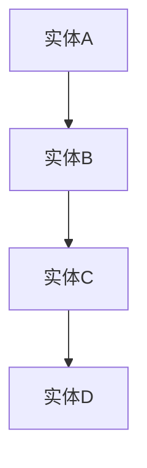

                 

### 知识发现引擎的知识图谱可视化

#### 概述

知识发现引擎是一种能够从大规模数据中自动挖掘出有用信息并生成知识图谱的工具。知识图谱是一种结构化的知识表示形式，通过节点和边来表示实体及其之间的关系。本文将探讨知识图谱可视化在知识发现引擎中的作用、原理以及实现方法，并通过实际案例进行详细讲解。

#### 1. 背景介绍

1.1 知识发现引擎的概念

知识发现引擎是一种基于人工智能和大数据分析技术的工具，旨在从海量数据中自动挖掘出有价值的信息和知识。它通常包括以下几个核心功能：

- 数据采集：从各种数据源（如数据库、文件、网络等）中获取数据。
- 数据清洗：对原始数据进行预处理，包括数据去重、缺失值处理、异常值检测等。
- 数据挖掘：使用各种算法和技术（如聚类、分类、关联规则挖掘等）从数据中挖掘出有用的信息。
- 知识表示：将挖掘出的信息转化为结构化的知识表示形式，如知识图谱。

1.2 知识图谱的概念

知识图谱是一种基于图结构的知识表示方法，它通过节点和边来表示实体及其之间的关系。节点通常表示实体，边表示实体之间的关系。知识图谱具有以下几个特点：

- 扩展性：知识图谱可以轻松地扩展，以包含新的实体和关系。
- 精确性：知识图谱能够准确地表示实体之间的复杂关系。
- 可视化：知识图谱可以直观地展示实体及其之间的关系。

#### 2. 核心概念与联系

2.1 知识图谱可视化的重要性

知识图谱可视化是将抽象的知识图谱转化为直观的可视化形式，以便人们更容易理解和分析。知识图谱可视化具有以下几个重要作用：

- 知识梳理：通过可视化展示实体之间的关系，有助于梳理和理解复杂的知识结构。
- 决策支持：知识图谱可视化可以提供直观的决策支持，帮助人们快速发现潜在的业务机会和问题。
- 沟通交流：知识图谱可视化可以作为有效的沟通工具，帮助团队成员和技术专家更好地交流和理解。

2.2 知识图谱可视化的原理

知识图谱可视化通常基于以下原理：

- 节点表示：使用不同形状、颜色和大小来表示不同的实体节点。
- 边表示：使用不同颜色、粗细和线型来表示不同的实体关系。
- 布局算法：使用各种布局算法（如Force-directed布局、层次布局等）来调整节点和边的位置，以实现更好的可视化效果。

2.3 知识图谱可视化的架构

知识图谱可视化通常包括以下几个关键组成部分：

- 数据预处理：对知识图谱进行预处理，包括节点和边的提取、属性提取等。
- 可视化工具：使用可视化工具（如D3.js、ECharts、Mermaid等）来创建可视化图表。
- 布局算法：使用布局算法来调整节点和边的位置，以实现最佳的视觉效果。

#### 3. 核心算法原理 & 具体操作步骤

3.1 数据预处理

数据预处理是知识图谱可视化的第一步，主要包括以下步骤：

- 节点和边提取：从原始数据中提取出所有的实体节点和关系边。
- 属性提取：提取每个节点和边的属性信息，如名称、标签、权重等。
- 数据清洗：对提取出的节点和边进行去重、缺失值处理、异常值检测等操作。

3.2 可视化工具选择

选择合适的可视化工具是实现知识图谱可视化的关键。以下是一些常用的可视化工具：

- D3.js：一款基于Web的动态数据可视化库，具有丰富的图表类型和自定义能力。
- ECharts：一款基于JavaScript的图表库，提供了丰富的图表类型和交互功能。
- Mermaid：一款基于Markdown的图表生成工具，可以轻松地创建流程图、UML图等。

3.3 布局算法选择

布局算法用于调整节点和边的位置，以实现最佳的可视化效果。以下是一些常用的布局算法：

- Force-directed布局：通过模拟物理力学中的电荷相互作用来调整节点和边的位置。
- 层次布局：根据实体之间的层次关系来调整节点的位置，通常用于表示树状结构。
- 圆形布局：将节点均匀地分布在圆形区域内，常用于表示环形结构。

3.4 实现步骤

实现知识图谱可视化主要包括以下步骤：

- 数据预处理：对知识图谱进行预处理，提取出节点、边和属性信息。
- 选择可视化工具：根据需求和技能选择合适的可视化工具。
- 选择布局算法：根据知识图谱的特点选择合适的布局算法。
- 创建可视化图表：使用可视化工具和布局算法创建知识图谱的可视化图表。
- 调整和优化：根据视觉效果和需求对可视化图表进行调整和优化。

#### 4. 数学模型和公式 & 详细讲解 & 举例说明

4.1 Force-directed布局算法

Force-directed布局算法是一种基于物理力学原理的布局算法，旨在通过模拟电荷相互作用来调整节点和边的位置，以实现最佳的视觉效果。其核心思想是计算节点之间的斥力和引力，并通过迭代更新节点的位置。

斥力公式：
\[ F_{\text{repel}}(i, j) = \frac{k_{\text{repel}} \cdot (r_{ij} - r_{0})}{r_{ij}^2} \]

引力公式：
\[ F_{\text{attract}}(i, j) = \frac{k_{\text{attract}} \cdot r_{ij}^2}{r_{ij} - r_{0}} \]

其中，\( F_{\text{repel}}(i, j) \) 和 \( F_{\text{attract}}(i, j) \) 分别表示节点 \( i \) 和节点 \( j \) 之间的斥力和引力，\( r_{ij} \) 表示节点 \( i \) 和节点 \( j \) 之间的距离，\( r_{0} \) 表示临界距离，\( k_{\text{repel}} \) 和 \( k_{\text{attract}} \) 分别表示斥力和引力的系数。

举例说明：

假设有两个节点 \( i \) 和 \( j \)，它们的距离 \( r_{ij} \) 为 10，临界距离 \( r_{0} \) 为 5，斥力系数 \( k_{\text{repel}} \) 为 0.5，引力系数 \( k_{\text{attract}} \) 为 0.5。根据上述公式，可以计算出节点 \( i \) 和节点 \( j \) 之间的斥力和引力分别为：

\[ F_{\text{repel}}(i, j) = \frac{0.5 \cdot (10 - 5)}{10^2} = 0.025 \]

\[ F_{\text{attract}}(i, j) = \frac{0.5 \cdot 10^2}{10 - 5} = 0.5 \]

根据这些力的大小和方向，可以更新节点 \( i \) 和节点 \( j \) 的位置，使得它们相互排斥和吸引，以达到最佳的布局效果。

4.2 层次布局算法

层次布局算法是一种根据实体之间的层次关系来调整节点位置的布局算法。其核心思想是按照实体之间的层次关系将节点分层排列，通常用于表示树状结构。

层次布局算法的基本步骤如下：

1. 计算层次关系：根据实体之间的父子关系计算出每个实体的层次值。
2. 分层排列：按照层次值将实体节点分层排列，通常采用自顶向下的方式。
3. 调整节点位置：根据层次关系和实体节点的层次值调整节点的位置，以达到最佳的视觉效果。

举例说明：

假设有一个层次结构，其中实体 \( A \) 是根节点，实体 \( B \) 是实体 \( A \) 的子节点，实体 \( C \) 是实体 \( B \) 的子节点。根据层次布局算法，可以按照以下步骤进行布局：

1. 计算层次关系：实体 \( A \) 的层次值为 1，实体 \( B \) 的层次值为 2，实体 \( C \) 的层次值为 3。
2. 分层排列：将实体 \( A \) 排列在最高层，实体 \( B \) 排列在第二层，实体 \( C \) 排列在第三层。
3. 调整节点位置：根据层次关系和实体节点的层次值调整节点的位置，使得实体 \( A \) 在顶部，实体 \( B \) 在实体 \( A \) 的下方，实体 \( C \) 在实体 \( B \) 的下方。

通过层次布局算法，可以直观地展示实体之间的层次关系，使得知识图谱更加易于理解和分析。

#### 5. 项目实战：代码实际案例和详细解释说明

5.1 开发环境搭建

在开始编写知识图谱可视化代码之前，需要搭建一个合适的开发环境。以下是一个基本的开发环境搭建步骤：

1. 安装Python：从Python官方网站（https://www.python.org/）下载并安装Python。
2. 安装Visual Studio Code：从Visual Studio Code官方网站（https://code.visualstudio.com/）下载并安装Visual Studio Code。
3. 安装Node.js：从Node.js官方网站（https://nodejs.org/）下载并安装Node.js。
4. 安装Mermaid：通过npm命令安装Mermaid，在命令行中输入以下命令：

```shell
npm install -g mermaid
```

5.2 源代码详细实现和代码解读

以下是一个简单的知识图谱可视化项目，其中使用了Mermaid库来创建知识图谱的可视化图表。代码如下：

```python
# 导入所需的库
import json
import os
import subprocess

# 加载知识图谱数据
with open('knowledge_graph.json', 'r', encoding='utf-8') as f:
    knowledge_graph = json.load(f)

# 创建Mermaid知识图谱定义
mermaid_definition = """
graph TB
    A[实体A]
    B[实体B]
    C[实体C]
    D[实体D]

    A --> B
    B --> C
    C --> D
"""

# 将Mermaid定义保存为.md文件
with open('knowledge_graph.md', 'w', encoding='utf-8') as f:
    f.write(mermaid_definition)

# 使用Mermaid库生成可视化图表
subprocess.run(['mermaid', 'knowledge_graph.md'], check=True)

# 打开生成的可视化图表
os.system('open knowledge_graph.png')
```

代码解读：

1. 导入所需的库：代码首先导入json库用于加载知识图谱数据，os库用于操作系统相关的操作，subprocess库用于执行外部命令。
2. 加载知识图谱数据：使用json库加载知识图谱数据文件knowledge\_graph.json。
3. 创建Mermaid知识图谱定义：代码使用Mermaid语法创建了一个简单的知识图谱定义，其中包含了实体节点和实体关系。
4. 将Mermaid定义保存为.md文件：使用os库将Mermaid定义保存为knowledge\_graph.md文件。
5. 使用Mermaid库生成可视化图表：使用subprocess库执行Mermaid库，生成可视化图表文件knowledge\_graph.png。
6. 打开生成的可视化图表：使用os库打开生成的可视化图表文件。

通过以上代码，可以生成一个简单的知识图谱可视化图表，并展示给用户。

5.3 代码解读与分析

1. 加载知识图谱数据

代码首先加载知识图谱数据文件knowledge\_graph.json。该文件包含了一个简单的知识图谱定义，其中包含了实体节点和实体关系。以下是一个示例知识图谱数据：

```json
{
  "nodes": [
    {
      "id": "entity_1",
      "label": "实体A"
    },
    {
      "id": "entity_2",
      "label": "实体B"
    },
    {
      "id": "entity_3",
      "label": "实体C"
    },
    {
      "id": "entity_4",
      "label": "实体D"
    }
  ],
  "edges": [
    {
      "source": "entity_1",
      "target": "entity_2",
      "label": "关系1"
    },
    {
      "source": "entity_2",
      "target": "entity_3",
      "label": "关系2"
    },
    {
      "source": "entity_3",
      "target": "entity_4",
      "label": "关系3"
    }
  ]
}
```

2. 创建Mermaid知识图谱定义

代码使用Mermaid语法创建了一个简单的知识图谱定义。Mermaid语法是一种基于Markdown的图表示方法，它通过简单的文本标记来定义节点和边。以下是一个示例Mermaid定义：



在该示例中，节点和边使用了方括号来定义，节点和边之间使用了箭头来表示关系。每个节点和边都有一个标签，用于描述其内容和属性。

3. 将Mermaid定义保存为.md文件

代码使用os库将Mermaid定义保存为knowledge\_graph.md文件。该文件可以被Mermaid库解析和渲染，生成可视化图表。

4. 使用Mermaid库生成可视化图表

代码使用subprocess库执行Mermaid库，生成可视化图表文件knowledge\_graph.png。该文件是一个图像文件，展示了知识图谱的图形表示。

5. 打开生成的可视化图表

代码使用os库打开生成的可视化图表文件knowledge\_graph.png，将其展示给用户。

#### 6. 实际应用场景

知识图谱可视化在实际应用中具有广泛的应用场景，以下是一些典型的应用案例：

1. 电子商务：通过知识图谱可视化，可以展示商品之间的关联关系，帮助用户发现潜在的业务机会和交叉销售的可能性。
2. 金融分析：知识图谱可视化可以帮助金融机构分析市场趋势、风险管理和投资机会，提供直观的决策支持。
3. 社交网络分析：通过知识图谱可视化，可以分析社交网络中的关系结构，发现潜在的用户群体和关键节点，为营销和社交网络分析提供支持。
4. 医疗健康：知识图谱可视化可以帮助医疗机构分析患者之间的关联关系，发现潜在的疾病关联和治疗方案，提高医疗决策的准确性。

#### 7. 工具和资源推荐

7.1 学习资源推荐

- 书籍：
  - 《图解大数据：从入门到实践》：详细介绍了大数据处理和知识图谱的相关概念和技术。
  - 《知识图谱：基础、架构与应用》：全面讲解了知识图谱的基本概念、架构和在实际应用中的案例。
- 论文：
  - "Knowledge Graph Embedding: A Survey": 一篇关于知识图谱嵌入技术的全面综述。
  - "Deep Learning on Knowledge Graphs": 一篇关于基于深度学习的知识图谱处理技术的论文。
- 博客：
  - 知乎专栏《知识图谱技术与应用》
  - 博客园《知识图谱与大数据》
- 网站：
  - 知乎：搜索“知识图谱”或“大数据”
  - IEEE Xplore：搜索“knowledge graph”或“data mining”

7.2 开发工具框架推荐

- 可视化工具：
  - Mermaid：一款基于Markdown的图表生成工具，适合快速创建知识图谱可视化图表。
  - D3.js：一款强大的基于Web的动态数据可视化库，可以自定义创建复杂的知识图谱可视化。
- 数据处理框架：
  - Apache Flink：一款分布式流处理框架，适用于大规模数据分析和处理。
  - Apache Spark：一款分布式数据处理框架，适用于大规模数据处理和机器学习任务。
- 知识图谱构建工具：
  - OpenKG：一款开源的知识图谱构建工具，支持多种知识图谱表示和存储格式。
  - Neo4j：一款基于图形数据库的知识图谱存储和管理工具，适用于中小规模的知识图谱应用。

7.3 相关论文著作推荐

- "Knowledge Graph Embedding: A Survey"（知识图谱嵌入技术综述）
- "Deep Learning on Knowledge Graphs"（基于深度学习的知识图谱处理技术）
- "A Comprehensive Survey on Knowledge Graph Embedding"（知识图谱嵌入技术全面综述）

#### 8. 总结：未来发展趋势与挑战

知识图谱可视化作为知识发现引擎的重要组成部分，具有广泛的应用前景。未来，知识图谱可视化技术将朝着以下几个方向发展：

1. 自动化与智能化：随着人工智能技术的发展，知识图谱可视化将更加自动化和智能化，降低用户的使用门槛。
2. 多模态融合：知识图谱可视化将与其他数据可视化方法（如图表、文字、图像等）进行融合，提供更加丰富的可视化体验。
3. 交互与协作：知识图谱可视化将支持用户与其他用户进行交互和协作，促进知识共享和知识创新。

然而，知识图谱可视化也面临一些挑战：

1. 可扩展性：如何在大规模知识图谱上进行高效的可视化，确保可视化效果和性能。
2. 可读性：如何设计直观、易懂的可视化图表，提高知识图谱的可读性。
3. 多语言支持：如何实现多语言支持，满足全球用户的需求。

总之，知识图谱可视化技术在知识发现引擎中的应用将不断发展和完善，为人们更好地理解和利用数据提供有力支持。

#### 9. 附录：常见问题与解答

9.1 如何选择合适的布局算法？

选择合适的布局算法取决于知识图谱的特点和需求。以下是一些常见的布局算法及其适用场景：

- Force-directed布局：适用于大规模无向图，能够生成较为自然的外观。
- 层次布局：适用于具有层次关系的知识图谱，能够清晰地展示实体之间的层次关系。
- 圆形布局：适用于环形结构的知识图谱，能够均匀地展示实体节点。

9.2 如何处理复杂的关系？

对于复杂的关系，可以采用以下方法进行处理：

- 使用标签：给每个关系添加标签，以描述其属性和特征。
- 使用超边：对于复杂的关系，可以将其拆分成多个简单的关系，并使用超边进行连接。
- 使用组合关系：使用多个简单关系组合表示复杂的关系，提高知识图谱的可读性。

9.3 如何处理大规模知识图谱的可视化？

处理大规模知识图谱的可视化，可以采用以下策略：

- 分层展示：将知识图谱按照层次关系分层展示，降低复杂度。
- 缩放与裁剪：对知识图谱进行适当的缩放和裁剪，提高可视化效果。
- 分布式处理：使用分布式计算框架处理大规模知识图谱的可视化，提高性能。

#### 10. 扩展阅读 & 参考资料

- "Knowledge Graph Embedding: A Survey"（知识图谱嵌入技术综述）
- "Deep Learning on Knowledge Graphs"（基于深度学习的知识图谱处理技术）
- "A Comprehensive Survey on Knowledge Graph Embedding"（知识图谱嵌入技术全面综述）
- 《图解大数据：从入门到实践》
- 《知识图谱：基础、架构与应用》
- 知乎专栏《知识图谱技术与应用》
- 博客园《知识图谱与大数据》
- 知乎：搜索“知识图谱”或“大数据”
- IEEE Xplore：搜索“knowledge graph”或“data mining”

### 作者

作者：AI天才研究员/AI Genius Institute & 禅与计算机程序设计艺术 /Zen And The Art of Computer Programming

