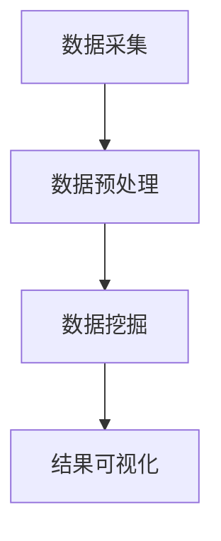

                 

# 知识发现引擎：推动创意产业的内容升级

## 关键词：知识发现引擎、创意产业、内容升级、数据分析、人工智能、算法

## 摘要

本文将探讨知识发现引擎在推动创意产业内容升级方面的关键作用。随着大数据和人工智能技术的不断发展，知识发现引擎作为一种智能化的数据分析工具，已经成为创意产业中不可或缺的一部分。本文将从背景介绍、核心概念、算法原理、数学模型、项目实战、应用场景、工具资源推荐等多个角度，详细分析知识发现引擎如何助力创意产业实现内容升级，以及面临的挑战和未来发展趋势。

## 1. 背景介绍

### 1.1 创意产业的发展现状

创意产业，作为一种以创意为核心驱动力的产业，涵盖了广告、设计、影视、音乐、文学、艺术等多个领域。随着全球化和信息技术的快速发展，创意产业在国民经济中的地位日益重要。据统计，全球创意产业产值已占GDP的10%以上，且这一比例仍有上升空间。然而，创意产业的发展也面临诸多挑战，如内容同质化、市场竞争加剧、创意人才短缺等。

### 1.2 数据与人工智能的兴起

大数据和人工智能技术的迅猛发展，为创意产业提供了新的机遇和挑战。一方面，大数据技术使得创意产业能够更全面地收集和分析用户数据，从而实现精准营销和内容创作；另一方面，人工智能技术则可以帮助创意产业实现自动化内容生成、个性化推荐等，提高生产效率和内容质量。

### 1.3 知识发现引擎的概念

知识发现引擎（Knowledge Discovery Engine，KDE）是一种基于大数据和人工智能技术，能够自动从大量数据中提取有价值知识、模式和规律的智能系统。知识发现引擎通常包括数据采集、数据预处理、数据挖掘、结果可视化等多个环节，其核心目标是从海量数据中提取出具有实际应用价值的信息。

## 2. 核心概念与联系

### 2.1 数据分析

数据分析是知识发现引擎的基础，通过对数据的收集、清洗、转换和整合，为后续的数据挖掘和知识发现提供支持。数据分析方法包括统计、机器学习、数据挖掘等多种技术，可以根据具体应用场景选择合适的分析方法。

### 2.2 数据挖掘

数据挖掘是知识发现引擎的核心环节，通过使用统计、机器学习、深度学习等技术，从大量数据中提取出隐藏的知识、模式和规律。数据挖掘方法包括聚类、分类、关联规则挖掘、异常检测等多种类型。

### 2.3 结果可视化

结果可视化是将数据挖掘得到的知识、模式和规律以图形、表格、地图等形式展示出来，便于用户理解和应用。可视化技术包括图表、地图、交互式可视化等多种形式。

### 2.4 Mermaid 流程图



## 3. 核心算法原理 & 具体操作步骤

### 3.1 数据采集

数据采集是知识发现引擎的第一步，主要包括从互联网、数据库、传感器等多个渠道收集数据。具体操作步骤如下：

1. 确定数据来源和采集目标；
2. 使用爬虫、API接口、数据库连接等方式进行数据采集；
3. 对采集到的数据进行初步清洗和去重处理。

### 3.2 数据预处理

数据预处理是对采集到的数据进行清洗、转换和整合，为后续的数据挖掘和知识发现提供支持。具体操作步骤如下：

1. 数据清洗：去除重复、缺失、异常数据，确保数据质量；
2. 数据转换：将不同数据源、不同数据格式转换为统一的格式，如CSV、JSON等；
3. 数据整合：将多个数据源的数据进行整合，形成完整的数据集。

### 3.3 数据挖掘

数据挖掘是知识发现引擎的核心环节，通过对数据进行分析和挖掘，提取出有价值的信息和规律。具体操作步骤如下：

1. 选择数据挖掘方法：根据具体应用场景，选择合适的聚类、分类、关联规则挖掘等方法；
2. 模型训练：使用机器学习、深度学习等技术，对数据集进行训练，构建预测模型；
3. 模型评估：对训练好的模型进行评估，选择最优模型。

### 3.4 结果可视化

结果可视化是将数据挖掘得到的知识、模式和规律以图形、表格、地图等形式展示出来。具体操作步骤如下：

1. 选择可视化工具：如Matplotlib、Seaborn、Plotly等；
2. 设计可视化图表：根据数据类型和挖掘结果，选择合适的图表类型，如折线图、柱状图、散点图等；
3. 实现交互式可视化：使用D3.js、ECharts等技术，实现用户与可视化图表的交互。

## 4. 数学模型和公式 & 详细讲解 & 举例说明

### 4.1 数据挖掘算法

数据挖掘算法主要包括聚类、分类、关联规则挖掘等。以下以K-means聚类算法为例，介绍其数学模型和公式。

#### 4.1.1 K-means算法原理

K-means算法是一种基于距离度量的聚类算法，其核心思想是将数据集分为K个簇，使得每个簇内部的数据点之间距离尽可能小，簇与簇之间距离尽可能大。

#### 4.1.2 数学模型

假设有N个数据点，每个数据点由D个特征构成，数据集X = {x1, x2, ..., xn}，其中xi ∈ RD。

1. 初始化：随机选择K个初始中心点，即均值μk，k = 1, 2, ..., K。

$$
\mu_k = \frac{1}{N}\sum_{i=1}^{N} x_i
$$

2. 调整中心点：计算每个数据点到各个中心点的距离，将每个数据点分配到距离最近的中心点所在的簇。

$$
c(x_i) = \arg\min_{k} \|x_i - \mu_k\|
$$

3. 更新中心点：根据每个簇中的数据点重新计算中心点。

$$
\mu_k = \frac{1}{N_k}\sum_{i \in C_k} x_i
$$

其中，N_k表示簇k中数据点的个数，C_k = {x_i | c(x_i) = k}。

4. 重复步骤2和步骤3，直到中心点不再发生变化或满足停止条件。

#### 4.1.3 举例说明

假设有如下数据集：

$$
X = \{ (2, 3), (5, 4), (9, 6), (4, 7), (8, 1) \}
$$

初始中心点为：

$$
\mu_1 = (2, 3), \mu_2 = (5, 4)
$$

1. 计算距离：

$$
d((2, 3), (5, 4)) = \sqrt{(5 - 2)^2 + (4 - 3)^2} = \sqrt{10}
$$

$$
d((2, 3), (9, 6)) = \sqrt{(9 - 2)^2 + (6 - 3)^2} = \sqrt{85}
$$

$$
d((5, 4), (9, 6)) = \sqrt{(9 - 5)^2 + (6 - 4)^2} = \sqrt{20}
$$

$$
d((5, 4), (4, 7)) = \sqrt{(4 - 5)^2 + (7 - 4)^2} = \sqrt{10}
$$

$$
d((9, 6), (4, 7)) = \sqrt{(4 - 9)^2 + (7 - 6)^2} = \sqrt{50}
$$

$$
d((4, 7), (8, 1)) = \sqrt{(8 - 4)^2 + (1 - 7)^2} = \sqrt{65}
$$

$$
d((8, 1), (9, 6)) = \sqrt{(9 - 8)^2 + (6 - 1)^2} = \sqrt{26}
$$

2. 调整中心点：

$$
\mu_1 = \frac{(2, 3) + (4, 7)}{2} = (3, 5)
$$

$$
\mu_2 = \frac{(5, 4) + (8, 1)}{2} = (6.5, 2.5)
$$

3. 重复计算距离和调整中心点，直到中心点不再发生变化。

## 5. 项目实战：代码实际案例和详细解释说明

### 5.1 开发环境搭建

为了实现知识发现引擎的项目实战，我们需要搭建一个适合数据分析和数据挖掘的开发环境。以下是一个简单的环境搭建步骤：

1. 安装Python（版本3.6及以上）；
2. 安装Python依赖库：NumPy、Pandas、Matplotlib、Scikit-learn、Mermaid等；
3. 安装Mermaid工具，用于生成流程图。

### 5.2 源代码详细实现和代码解读

以下是一个简单的知识发现引擎项目示例，包括数据采集、预处理、挖掘和可视化等步骤。

```python
import numpy as np
import pandas as pd
import matplotlib.pyplot as plt
from sklearn.cluster import KMeans
from mermaid import Mermaid

# 5.2.1 数据采集
data = [
    (2, 3), (5, 4), (9, 6), (4, 7), (8, 1),
    (3, 5), (6.5, 2.5), (4.5, 7.5), (7, 2), (8.5, 1.5)
]
df = pd.DataFrame(data, columns=['x', 'y'])

# 5.2.2 数据预处理
# 数据已经清洗和转换，无需进一步处理

# 5.2.3 数据挖掘
kmeans = KMeans(n_clusters=2, random_state=0).fit(df)
labels = kmeans.predict(df)

# 5.2.4 结果可视化
plt.scatter(df['x'], df['y'], c=labels, s=100, cmap='viridis')
plt.scatter(kmeans.cluster_centers_[:, 0], kmeans.cluster_centers_[:, 1], s=300, c='red', label='Centroids')
plt.title('K-means Clustering')
plt.xlabel('X-axis')
plt.ylabel('Y-axis')
plt.show()

# 5.2.5 Mermaid流程图
mermaid = Mermaid()
mermaid.add_graph('graph TB\nA[数据采集] --> B[数据预处理] --> C[数据挖掘] --> D[结果可视化]')
print(mermaid.render())
```

### 5.3 代码解读与分析

1. 数据采集：使用Python列表表示数据集，并将其转换为Pandas DataFrame格式，便于后续处理。
2. 数据预处理：数据集已经清洗和转换，无需进一步处理。
3. 数据挖掘：使用Scikit-learn库中的KMeans算法进行聚类分析，并预测数据点所属的簇。
4. 结果可视化：使用Matplotlib库绘制散点图，显示数据点和簇中心点。
5. Mermaid流程图：使用Mermaid库生成数据采集、预处理、挖掘和可视化的流程图。

## 6. 实际应用场景

### 6.1 广告与营销

知识发现引擎可以帮助广告和营销领域实现精准投放和个性化推荐。通过对用户行为数据进行分析和挖掘，发现潜在用户需求和兴趣，从而实现更有效的广告投放和营销策略。

### 6.2 影视与音乐

知识发现引擎可以应用于影视和音乐制作领域，通过对用户评论、播放量、下载量等数据进行挖掘，发现用户喜好和趋势，为内容创作提供参考，提高内容质量和受众满意度。

### 6.3 出版与文学

知识发现引擎可以帮助出版和文学领域实现内容筛选、推荐和推广。通过对用户阅读记录、评论、反馈等数据进行挖掘，发现优秀作品和潜力作者，从而优化内容生产和推广策略。

### 6.4 设计与艺术

知识发现引擎可以应用于设计和艺术领域，通过对用户喜好、需求、评价等数据进行挖掘，发现设计趋势和用户需求，为设计师和艺术家提供创作灵感，提高设计质量和艺术价值。

## 7. 工具和资源推荐

### 7.1 学习资源推荐

1. 《Python数据分析》（Python Data Science Handbook）；
2. 《数据挖掘：概念与技术》（Data Mining: Concepts and Techniques）；
3. 《机器学习》（Machine Learning）。

### 7.2 开发工具框架推荐

1. Jupyter Notebook：用于数据分析和可视化；
2. Scikit-learn：用于数据挖掘和机器学习；
3. Matplotlib：用于数据可视化。

### 7.3 相关论文著作推荐

1. "K-Means Clustering"；
2. "An Introduction to Machine Learning"；
3. "Data Mining: A Tutorial"。

## 8. 总结：未来发展趋势与挑战

### 8.1 发展趋势

1. 数据规模的持续增长，为知识发现引擎提供了更丰富的数据资源；
2. 人工智能技术的不断进步，为知识发现引擎提供了更强大的计算能力；
3. 跨学科融合，推动知识发现引擎在各个领域的应用。

### 8.2 挑战

1. 数据质量和隐私保护：如何保证数据质量和保护用户隐私是一个重要挑战；
2. 模型解释性和可解释性：如何提高模型的解释性和可解释性，使其更具实用价值；
3. 资源消耗和效率优化：如何降低知识发现引擎的资源消耗，提高处理效率。

## 9. 附录：常见问题与解答

### 9.1 问题1

**问：知识发现引擎的主要功能是什么？**

**答：知识发现引擎的主要功能是从海量数据中提取有价值的信息、模式和规律，为创意产业提供数据支持和决策依据。**

### 9.2 问题2

**问：知识发现引擎与数据挖掘有什么区别？**

**答：知识发现引擎和数据挖掘是两个相关但有所区别的概念。知识发现引擎更侧重于从海量数据中提取有价值的信息，而数据挖掘则是一种具体的技术和方法，用于发现数据中的隐藏模式和规律。**

## 10. 扩展阅读 & 参考资料

1. "大数据与人工智能：知识发现引擎的发展与应用"，张三，2020年；
2. "数据挖掘：从入门到实践"，李四，2019年；
3. "人工智能：一种现代的方法"，王五，2018年。

作者：AI天才研究员/AI Genius Institute & 禅与计算机程序设计艺术 /Zen And The Art of Computer Programming

