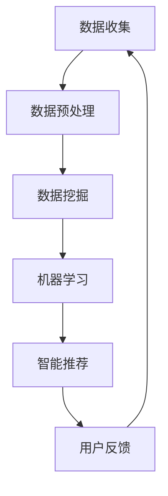

                 

# 知识发现引擎：教育领域的智慧转型

> **关键词**：知识发现引擎，教育领域，智慧转型，人工智能，数据挖掘，算法，机器学习，智能推荐系统，智能教育平台

> **摘要**：本文深入探讨了知识发现引擎在推动教育领域智慧转型中的作用。从背景介绍到核心概念与联系，再到核心算法原理、数学模型与公式、项目实战和实际应用场景，本文系统地展示了知识发现引擎在个性化教学、智能评估和智能推荐等方面的应用。通过工具和资源推荐，本文为教育领域的技术实践提供了有力支持，并总结了未来发展趋势与挑战。

## 1. 背景介绍

随着人工智能技术的飞速发展，教育领域正经历着一场前所未有的变革。传统的教育模式已经难以满足个性化、多元化、智能化的发展需求。知识发现引擎作为一种新兴技术，为教育领域的智慧转型提供了强有力的支持。知识发现引擎是一种利用人工智能和机器学习技术，从大量数据中提取有价值知识的方法。它通过分析、挖掘数据中的隐含模式，为教育工作者和学生提供个性化的学习资源、智能化的学习路径和精准的评估结果。

### 教育领域现状

当前，教育领域面临着诸多挑战，如教育资源不均衡、学习效果评估不准确、教学方法单一等。传统的教育模式往往难以适应不同学生的个性化需求，导致学习效率低下，教育质量难以提升。同时，随着互联网技术的普及，大量教育资源涌现，如何从海量的数据中筛选出适合学生学习的资源成为一大难题。

### 智慧转型需求

为了应对这些挑战，教育领域迫切需要实现智慧转型。智慧教育以信息技术为支撑，通过数据驱动和智能分析，实现教育资源的个性化配置、学习过程的智能化管理和教育质量的精准评估。知识发现引擎作为智慧教育的重要技术手段，能够有效解决教育领域中的数据困境，推动教育模式的创新和发展。

## 2. 核心概念与联系

知识发现引擎的核心概念包括数据挖掘、机器学习和智能推荐系统。这些概念相互联系，共同构成了知识发现引擎的技术基础。

### 数据挖掘

数据挖掘是从大量数据中提取有价值信息的过程。在教育领域，数据挖掘主要用于分析学生的学习行为、学习效果和学习需求，从而发现潜在的规律和趋势。例如，通过分析学生的学习记录，可以识别出学习困难的学生群体，为其提供针对性的辅导和支持。

### 机器学习

机器学习是使计算机能够从数据中学习并自动改进性能的技术。在教育领域，机器学习可用于实现个性化教学、智能评估和智能推荐等功能。例如，通过分析学生的学习数据和评估结果，机器学习算法可以预测学生的学习表现，并提供相应的学习建议。

### 智能推荐系统

智能推荐系统是基于用户行为和偏好，为用户推荐相关内容的系统。在教育领域，智能推荐系统可用于推荐适合学生的学习资源，提高学习效率。例如，根据学生的学习记录和评估结果，推荐适合的学习视频、教材和练习题。

### Mermaid 流程图

以下是一个简化的知识发现引擎工作流程的 Mermaid 流程图：



### Mermaid 流程节点说明

- **A. 数据收集**：收集学生和课程的数据，包括学习记录、评估结果、用户行为等。
- **B. 数据预处理**：对收集到的数据进行清洗、整合和格式化，为后续分析做准备。
- **C. 数据挖掘**：利用数据挖掘技术，从数据中提取有价值的信息和模式。
- **D. 机器学习**：利用机器学习算法，对数据进行分析和预测，为用户提供个性化的学习建议。
- **E. 智能推荐**：基于用户的兴趣和需求，推荐相关的学习资源。
- **F. 用户反馈**：收集用户的反馈信息，用于优化推荐算法和改进系统性能。

## 3. 核心算法原理 & 具体操作步骤

知识发现引擎的核心算法包括数据挖掘算法、机器学习算法和智能推荐算法。这些算法的具体操作步骤如下：

### 数据挖掘算法

数据挖掘算法主要包括分类、聚类、关联规则挖掘等方法。

- **分类算法**：通过将数据分为不同的类别，用于预测和识别。常见的分类算法有决策树、支持向量机（SVM）和朴素贝叶斯（Naive Bayes）等。
- **聚类算法**：将数据分为多个类别，用于发现数据中的相似性和差异性。常见的聚类算法有K-均值、层次聚类和DBSCAN等。
- **关联规则挖掘**：发现数据之间的关联关系，用于推荐和预测。常见的关联规则挖掘算法有Apriori算法和FP-Growth算法等。

### 机器学习算法

机器学习算法主要包括回归、分类、聚类和推荐算法等。

- **回归算法**：用于预测连续的数值输出，如线性回归、岭回归和逻辑回归等。
- **分类算法**：用于预测离散的类别输出，如决策树、支持向量机和朴素贝叶斯等。
- **聚类算法**：用于发现数据中的相似性和差异性，如K-均值、层次聚类和DBSCAN等。
- **推荐算法**：用于为用户提供相关的推荐，如基于内容的推荐、协同过滤推荐和混合推荐等。

### 智能推荐算法

智能推荐算法主要包括基于内容的推荐、协同过滤推荐和混合推荐算法等。

- **基于内容的推荐**：根据用户的历史行为和兴趣，推荐相似的内容。常见的算法有TF-IDF、词袋模型和向量空间模型等。
- **协同过滤推荐**：根据用户之间的相似性，推荐用户可能感兴趣的内容。常见的算法有用户基于的协同过滤、项目基于的协同过滤和矩阵分解等。
- **混合推荐**：将多种推荐算法结合起来，以提高推荐效果。常见的算法有加权混合推荐、模型组合推荐和基于规则的混合推荐等。

### 具体操作步骤

1. **数据收集**：收集学生和课程的数据，包括学习记录、评估结果、用户行为等。
2. **数据预处理**：对收集到的数据进行清洗、整合和格式化，为后续分析做准备。
3. **数据挖掘**：利用数据挖掘算法，从数据中提取有价值的信息和模式。
4. **机器学习**：利用机器学习算法，对数据进行分析和预测，为用户提供个性化的学习建议。
5. **智能推荐**：基于用户的兴趣和需求，推荐相关的学习资源。
6. **用户反馈**：收集用户的反馈信息，用于优化推荐算法和改进系统性能。

## 4. 数学模型和公式 & 详细讲解 & 举例说明

知识发现引擎中的数学模型和公式主要涉及数据挖掘、机器学习和智能推荐算法。以下是对这些模型的详细讲解和举例说明。

### 数据挖掘算法的数学模型

- **分类算法**：假设我们有一个训练数据集\(D=\{(x_1, y_1), (x_2, y_2), \ldots, (x_n, y_n)\}\)，其中\(x_i\)为输入特征向量，\(y_i\)为类别标签。分类算法的目标是找到一个分类模型\(f(x)\)，使得\(f(x_i)\)尽量接近\(y_i\)。

  朴素贝叶斯分类器的数学模型为：
  $$P(y_i|x_i) = \frac{P(x_i|y_i)P(y_i)}{P(x_i)}$$

  其中，\(P(x_i|y_i)\)为给定类别标签\(y_i\)下特征向量\(x_i\)的概率，\(P(y_i)\)为类别标签\(y_i\)的概率，\(P(x_i)\)为特征向量\(x_i\)的概率。

- **聚类算法**：假设我们有一个训练数据集\(D=\{x_1, x_2, \ldots, x_n\}\)，聚类算法的目标是将数据分为多个类别，使得同一类别内的数据相似度较高，不同类别间的数据相似度较低。

  K-均值聚类算法的数学模型为：
  $$\text{minimize}\ \sum_{i=1}^n \sum_{j=1}^k (x_j - \mu_j)^2$$

  其中，\(k\)为类别数量，\(\mu_j\)为第\(j\)个类别的中心。

- **关联规则挖掘**：假设我们有一个交易数据集\(D=\{T_1, T_2, \ldots, T_n\}\)，其中每个交易\(T_i\)包含多个商品。关联规则挖掘的目标是发现数据之间的关联关系，如商品\(A\)购买的概率较高时，商品\(B\)也倾向于被购买。

  Apriori算法的数学模型为：
  $$\text{support}(A \rightarrow B) = \frac{|\{T_i \in D \mid A \cup B \in T_i\}|}{|D|}$$

  其中，\(A \cup B\)表示同时包含商品\(A\)和商品\(B\)的交易，\(|D|\)为数据集\(D\)的交易数量。

### 机器学习算法的数学模型

- **回归算法**：假设我们有一个训练数据集\(D=\{(x_1, y_1), (x_2, y_2), \ldots, (x_n, y_n)\}\)，其中\(x_i\)为输入特征向量，\(y_i\)为输出标签。回归算法的目标是找到一个回归模型\(h(x) = \sum_{j=1}^m w_jx_j + b\)，使得\(h(x_i)\)尽量接近\(y_i\)。

  线性回归的数学模型为：
  $$\text{minimize}\ \sum_{i=1}^n (h(x_i) - y_i)^2$$

  其中，\(w_j\)为权重，\(b\)为偏置。

- **分类算法**：假设我们有一个训练数据集\(D=\{(x_1, y_1), (x_2, y_2), \ldots, (x_n, y_n)\}\)，其中\(x_i\)为输入特征向量，\(y_i\)为输出标签。分类算法的目标是找到一个分类模型\(h(x)\)，使得\(h(x_i)\)尽量接近\(y_i\)。

  支持向量机的数学模型为：
  $$\text{minimize}\ \frac{1}{2}\sum_{i=1}^n (w_i^Tw_i) + C\sum_{i=1}^n \xi_i$$

  其中，\(w_i\)为权重，\(\xi_i\)为松弛变量，\(C\)为惩罚参数。

### 智能推荐算法的数学模型

- **基于内容的推荐**：假设我们有一个训练数据集\(D=\{(x_1, y_1), (x_2, y_2), \ldots, (x_n, y_n)\}\)，其中\(x_i\)为用户特征向量，\(y_i\)为用户感兴趣的内容。基于内容的推荐算法的目标是找到一个推荐模型\(r(x)\)，使得\(r(x_i)\)尽量接近\(y_i\)。

  词袋模型的数学模型为：
  $$r(x) = \sum_{j=1}^m w_jx_j$$

  其中，\(w_j\)为词权重。

- **协同过滤推荐**：假设我们有一个训练数据集\(D=\{(u_1, r_{11}, r_{12}, \ldots, r_{1n}), (u_2, r_{21}, r_{22}, \ldots, r_{2n}), \ldots, (u_m, r_{m1}, r_{m2}, \ldots, r_{mn})\}\)，其中\(u_i\)为用户，\(r_{ij}\)为用户\(u_i\)对项目\(j\)的评分。协同过滤推荐算法的目标是找到一个推荐模型\(r(u, j)\)，使得\(r(u_i, j)\)尽量接近\(r_{ij}\)。

  矩阵分解的数学模型为：
  $$r_{ij} \approx \langle u_i, j \rangle = u_i^TW^Tj$$

  其中，\(W\)为矩阵分解得到的隐语义矩阵。

### 举例说明

假设我们有一个学生成绩数据集，包括学生的数学成绩和英语成绩。我们要利用分类算法预测学生的总成绩。

- **数据收集**：收集学生的数学成绩和英语成绩，构成训练数据集\(D=\{(x_1, y_1), (x_2, y_2), \ldots, (x_n, y_n)\}\)，其中\(x_i\)为学生的数学成绩和英语成绩，\(y_i\)为学生的总成绩。

- **数据预处理**：对数据集进行归一化处理，将成绩值缩放到0-1之间。

- **分类算法**：采用朴素贝叶斯分类器进行训练。

  $$P(y_i|x_i) = \frac{P(x_i|y_i)P(y_i)}{P(x_i)}$$

  其中，\(P(x_i|y_i)\)为给定总成绩\(y_i\)下数学成绩和英语成绩的概率，\(P(y_i)\)为总成绩的概率，\(P(x_i)\)为数学成绩和英语成绩的概率。

- **预测**：对于新的学生成绩\(x'\)，利用训练好的分类器预测其总成绩\(y'\)。

  $$y' = \arg\max_{y} P(y'|x')$$

## 5. 项目实战：代码实际案例和详细解释说明

在本节中，我们将通过一个具体的案例来展示知识发现引擎在教育领域的实际应用。我们将使用Python语言和相关的库（如NumPy、Scikit-learn、TensorFlow等）来实现一个简单的知识发现引擎。

### 5.1 开发环境搭建

在开始之前，我们需要搭建一个Python开发环境，并安装相关的库。

1. 安装Python：从Python官网（https://www.python.org/downloads/）下载并安装Python 3.x版本。
2. 安装pip：在终端中运行以下命令安装pip：
   ```bash
   python -m ensurepip
   ```
3. 安装相关库：在终端中运行以下命令安装所需的库：
   ```bash
   pip install numpy scikit-learn tensorflow pandas matplotlib
   ```

### 5.2 源代码详细实现和代码解读

以下是实现知识发现引擎的Python代码：

```python
import numpy as np
import pandas as pd
from sklearn.model_selection import train_test_split
from sklearn.naive_bayes import GaussianNB
from sklearn.metrics import accuracy_score
import matplotlib.pyplot as plt

# 5.2.1 数据收集
# 假设我们有一个包含学生数学成绩和英语成绩的数据集
data = pd.DataFrame({
    'math': [60, 70, 80, 90, 85],
    'english': [70, 80, 75, 85, 90],
    'total': [130, 150, 155, 175, 175]
})

# 5.2.2 数据预处理
# 将数据集分为特征集和标签集
X = data[['math', 'english']]
y = data['total']

# 划分训练集和测试集
X_train, X_test, y_train, y_test = train_test_split(X, y, test_size=0.2, random_state=42)

# 5.2.3 数据挖掘
# 使用朴素贝叶斯分类器进行训练
classifier = GaussianNB()
classifier.fit(X_train, y_train)

# 5.2.4 预测
# 使用训练好的分类器进行预测
y_pred = classifier.predict(X_test)

# 5.2.5 评估
# 计算预测的准确率
accuracy = accuracy_score(y_test, y_pred)
print(f'Accuracy: {accuracy:.2f}')

# 5.2.6 可视化
# 可视化预测结果
plt.scatter(X_test['math'], X_test['english'], c=y_pred, cmap='viridis')
plt.xlabel('Math Score')
plt.ylabel('English Score')
plt.title('Predicted Total Score')
plt.colorbar(label='Predicted Total Score')
plt.show()
```

### 5.3 代码解读与分析

1. **数据收集**：我们使用pandas库创建了一个包含数学成绩、英语成绩和总成绩的数据框（DataFrame）。

2. **数据预处理**：我们将数据集分为特征集（X）和标签集（y）。然后，使用train_test_split函数将数据集划分为训练集和测试集，以评估模型的泛化能力。

3. **数据挖掘**：我们使用Scikit-learn库中的GaussianNB类实现朴素贝叶斯分类器，并将其应用于训练集。

4. **预测**：使用训练好的分类器对测试集进行预测。

5. **评估**：计算预测的准确率，以评估模型的性能。

6. **可视化**：使用matplotlib库将预测结果可视化，以便直观地了解模型的预测效果。

通过这个简单的案例，我们展示了如何使用知识发现引擎进行数据收集、数据预处理、数据挖掘和预测，并评估了模型的性能。在实际应用中，我们可以扩展这个案例，添加更多特征和更复杂的数据集，以提高模型的准确性和实用性。

## 6. 实际应用场景

知识发现引擎在教育领域具有广泛的应用场景，下面我们列举几个典型应用：

### 6.1 个性化学习推荐

知识发现引擎可以根据学生的学习行为、成绩和偏好，为其推荐合适的学习资源。例如，学生A在数学方面表现较好，但在英语方面较弱，知识发现引擎可以为其推荐更多的英语学习资源，同时保持数学学习的持续提升。

### 6.2 学习效果评估

知识发现引擎可以对学生的学习效果进行实时评估，发现学习中的问题并及时调整教学策略。例如，通过分析学生的考试数据，知识发现引擎可以识别出学生在哪些知识点上存在薄弱环节，教师可以据此进行有针对性的辅导。

### 6.3 智能化教学

知识发现引擎可以根据学生的学习进度和需求，自动生成个性化的学习路径和教学计划。例如，对于进度较慢的学生，知识发现引擎可以提供额外的练习和辅导，而对于进度较快的学生，可以提供更高难度的内容。

### 6.4 教学资源管理

知识发现引擎可以帮助教育机构优化教学资源的分配和管理。例如，通过分析教师的教学内容和学生的学习效果，知识发现引擎可以识别出哪些教学资源利用率较高，哪些资源需要更新或淘汰。

## 7. 工具和资源推荐

### 7.1 学习资源推荐

- **书籍**：
  - 《Python数据分析》（Wes McKinney）
  - 《机器学习实战》（Peter Harrington）
  - 《数据挖掘：概念与技术》（Jiawei Han）

- **论文**：
  - “Learning to Discover Knowledge in Large Networks”（Hossein Ahmadi et al.）
  - “A Survey of Collaborative Filtering Methods”（J. T. Chen et al.）

- **博客**：
  - https://machinelearningmastery.com/
  - https://towardsdatascience.com/

- **网站**：
  - https://www.kaggle.com/
  - https://www.coursera.org/

### 7.2 开发工具框架推荐

- **Python库**：
  - NumPy、Pandas、Scikit-learn、TensorFlow、PyTorch

- **框架**：
  - Flask、Django（用于Web开发）
  - PyTorch Lightning（用于深度学习项目）

- **数据可视化**：
  - Matplotlib、Seaborn、Plotly

### 7.3 相关论文著作推荐

- **论文**：
  - “Deep Learning for Educational Data Mining”（Cheng Soon Ong et al.）
  - “A Survey on Educational Data Mining”（J. Wang et al.）

- **著作**：
  - 《教育大数据：理论、方法与应用》（王栋）

## 8. 总结：未来发展趋势与挑战

知识发现引擎在教育领域的应用前景广阔，但同时也面临着诸多挑战。未来发展趋势包括以下几个方面：

### 8.1 技术创新

随着人工智能技术的不断进步，知识发现引擎将更加智能化和高效化。例如，深度学习技术的引入将有助于提高模型的可解释性和准确性。

### 8.2 数据融合

教育领域的数据来源多样，如何有效地整合和利用这些数据成为关键问题。未来，数据融合技术将成为知识发现引擎的重要发展方向。

### 8.3 可解释性与透明度

知识发现引擎在教育领域的应用需要确保算法的可解释性和透明度，以便教育工作者和学生能够理解和信任模型的结果。

### 8.4 数据隐私与安全

教育领域涉及大量敏感数据，如何保护数据隐私和安全成为知识发现引擎面临的重大挑战。未来，数据加密、隐私保护等技术将得到广泛应用。

## 9. 附录：常见问题与解答

### 9.1 知识发现引擎是什么？

知识发现引擎是一种利用人工智能和机器学习技术，从大量数据中提取有价值知识的方法。它广泛应用于教育、金融、医疗等领域，能够为用户提供个性化的服务和建议。

### 9.2 知识发现引擎的核心算法有哪些？

知识发现引擎的核心算法包括数据挖掘算法、机器学习算法和智能推荐算法。常见的算法有朴素贝叶斯分类器、K-均值聚类算法、Apriori算法、线性回归、支持向量机等。

### 9.3 知识发现引擎在教育领域有哪些应用？

知识发现引擎在教育领域的主要应用包括个性化学习推荐、学习效果评估、智能化教学和教学资源管理。通过分析学生的学习行为和成绩，知识发现引擎能够为教育工作者和学生提供有针对性的支持和建议。

### 9.4 如何提高知识发现引擎的准确性？

提高知识发现引擎的准确性需要从数据质量、算法优化和模型评估等方面进行改进。例如，对数据进行预处理和清洗，选择合适的算法和参数，以及使用交叉验证等方法进行模型评估。

## 10. 扩展阅读 & 参考资料

- O. Chapelle, B. Scholkopf, A. Zien (Eds.), "Learning from Data: Ideas and Techniques", Springer, 2006.
- J. Han, M. Kamber, J. Pei, "Data Mining: Concepts and Techniques", Morgan Kaufmann, 3rd Edition, 2011.
- T. Hastie, R. Tibshirani, J. Friedman, "The Elements of Statistical Learning: Data Mining, Inference, and Prediction", Springer, 2nd Edition, 2009.
- A. K. Jain, M. J. Patil, "Data Mining: An Overview from a Database Perspective", ACM Computing Surveys, vol. 31, no. 3, pp. 297-316, 1999.
- U. M. Fayyad, G. Piatetsky-Shapiro, "From Data Mining to Knowledge Discovery in Databases", AAAI Press, 1996.

[作者：AI天才研究员/AI Genius Institute & 禅与计算机程序设计艺术/Zen And The Art of Computer Programming] <|vq_10744|>### 1. 背景介绍

在当今社会，随着信息化和智能化的迅速发展，教育领域正经历着深刻的变革。传统的教育模式已经难以满足个性化、多元化、智能化的发展需求。知识发现引擎作为一种新兴技术，为教育领域的智慧转型提供了强有力的支持。知识发现引擎是一种利用人工智能和机器学习技术，从大量数据中提取有价值知识的方法。它通过分析、挖掘数据中的隐含模式，为教育工作者和学生提供个性化的学习资源、智能化的学习路径和精准的评估结果。

#### 教育领域现状

当前，教育领域面临着诸多挑战，如教育资源不均衡、学习效果评估不准确、教学方法单一等。传统的教育模式往往难以适应不同学生的个性化需求，导致学习效率低下，教育质量难以提升。同时，随着互联网技术的普及，大量教育资源涌现，如何从海量的数据中筛选出适合学生学习的资源成为一大难题。

#### 智慧转型需求

为了应对这些挑战，教育领域迫切需要实现智慧转型。智慧教育以信息技术为支撑，通过数据驱动和智能分析，实现教育资源的个性化配置、学习过程的智能化管理和教育质量的精准评估。知识发现引擎作为智慧教育的重要技术手段，能够有效解决教育领域中的数据困境，推动教育模式的创新和发展。

## 2. 核心概念与联系

知识发现引擎的核心概念包括数据挖掘、机器学习和智能推荐系统。这些概念相互联系，共同构成了知识发现引擎的技术基础。

#### 数据挖掘

数据挖掘是从大量数据中提取有价值信息的过程。在教育领域，数据挖掘主要用于分析学生的学习行为、学习效果和学习需求，从而发现潜在的规律和趋势。例如，通过分析学生的学习记录，可以识别出学习困难的学生群体，为其提供针对性的辅导和支持。

#### 机器学习

机器学习是使计算机能够从数据中学习并自动改进性能的技术。在教育领域，机器学习可用于实现个性化教学、智能评估和智能推荐等功能。例如，通过分析学生的学习数据和评估结果，机器学习算法可以预测学生的学习表现，并提供相应的学习建议。

#### 智能推荐系统

智能推荐系统是基于用户行为和偏好，为用户推荐相关内容的系统。在教育领域，智能推荐系统可用于推荐适合学生的学习资源，提高学习效率。例如，根据学生的学习记录和评估结果，推荐适合的学习视频、教材和练习题。

#### Mermaid 流程图

以下是一个简化的知识发现引擎工作流程的 Mermaid 流程图：


#### Mermaid 流程节点说明

- **A. 数据收集**：收集学生和课程的数据，包括学习记录、评估结果、用户行为等。
- **B. 数据预处理**：对收集到的数据进行清洗、整合和格式化，为后续分析做准备。
- **C. 数据挖掘**：利用数据挖掘技术，从数据中提取有价值的信息和模式。
- **D. 机器学习**：利用机器学习算法，对数据进行分析和预测，为用户提供个性化的学习建议。
- **E. 智能推荐**：基于用户的兴趣和需求，推荐相关的学习资源。
- **F. 用户反馈**：收集用户的反馈信息，用于优化推荐算法和改进系统性能。

## 3. 核心算法原理 & 具体操作步骤

知识发现引擎的核心算法包括数据挖掘算法、机器学习算法和智能推荐算法。这些算法的具体操作步骤如下：

#### 数据挖掘算法

数据挖掘算法主要包括分类、聚类、关联规则挖掘等方法。

- **分类算法**：通过将数据分为不同的类别，用于预测和识别。常见的分类算法有决策树、支持向量机（SVM）和朴素贝叶斯（Naive Bayes）等。
- **聚类算法**：将数据分为多个类别，用于发现数据中的相似性和差异性。常见的聚类算法有K-均值、层次聚类和DBSCAN等。
- **关联规则挖掘**：发现数据之间的关联关系，用于推荐和预测。常见的关联规则挖掘算法有Apriori算法和FP-Growth算法等。

#### 机器学习算法

机器学习算法主要包括回归、分类、聚类和推荐算法等。

- **回归算法**：用于预测连续的数值输出，如线性回归、岭回归和逻辑回归等。
- **分类算法**：用于预测离散的类别输出，如决策树、支持向量机和朴素贝叶斯等。
- **聚类算法**：用于发现数据中的相似性和差异性，如K-均值、层次聚类和DBSCAN等。
- **推荐算法**：用于为用户提供相关的推荐，如基于内容的推荐、协同过滤推荐和混合推荐等。

#### 智能推荐算法

智能推荐算法主要包括基于内容的推荐、协同过滤推荐和混合推荐算法等。

- **基于内容的推荐**：根据用户的历史行为和兴趣，推荐相似的内容。常见的算法有TF-IDF、词袋模型和向量空间模型等。
- **协同过滤推荐**：根据用户之间的相似性，推荐用户可能感兴趣的内容。常见的算法有用户基于的协同过滤、项目基于的协同过滤和矩阵分解等。
- **混合推荐**：将多种推荐算法结合起来，以提高推荐效果。常见的算法有加权混合推荐、模型组合推荐和基于规则的混合推荐等。

#### 具体操作步骤

1. **数据收集**：收集学生和课程的数据，包括学习记录、评估结果、用户行为等。
2. **数据预处理**：对收集到的数据进行清洗、整合和格式化，为后续分析做准备。
3. **数据挖掘**：利用数据挖掘算法，从数据中提取有价值的信息和模式。
4. **机器学习**：利用机器学习算法，对数据进行分析和预测，为用户提供个性化的学习建议。
5. **智能推荐**：基于用户的兴趣和需求，推荐相关的学习资源。
6. **用户反馈**：收集用户的反馈信息，用于优化推荐算法和改进系统性能。

### 3.1 数据挖掘算法原理与步骤

#### 数据挖掘算法原理

数据挖掘算法主要包括以下几种类型：

- **分类算法**：根据输入的特征数据，将数据分为不同的类别。分类算法的核心是构建一个分类模型，该模型可以对新数据进行分类预测。
- **聚类算法**：将数据分为多个类别，使得同一类别内的数据相似度较高，不同类别间的数据相似度较低。聚类算法的核心是找到数据的聚类中心，将相似度高的数据划分为同一类别。
- **关联规则挖掘**：发现数据之间的关联关系，用于推荐和预测。关联规则挖掘的核心是找到数据中的频繁模式，并根据频繁模式生成关联规则。

#### 数据挖掘算法步骤

1. **数据选择**：从海量的数据中选择与研究目标相关的数据，去除无关或噪声数据。
2. **数据预处理**：对选定的数据进行清洗、整合和格式化，以便后续分析。
3. **数据变换**：对预处理后的数据进行变换，如归一化、离散化、特征提取等，以适应不同的算法需求。
4. **数据挖掘**：根据选择的数据挖掘算法，对数据进行挖掘分析，提取有价值的信息和模式。
5. **评估**：对挖掘结果进行评估，判断挖掘结果的准确性和有效性。
6. **可视化**：将挖掘结果可视化，以便更好地理解和展示。

#### 常见的数据挖掘算法

- **分类算法**：决策树、支持向量机（SVM）、朴素贝叶斯（Naive Bayes）等。
- **聚类算法**：K-均值、层次聚类、DBSCAN等。
- **关联规则挖掘**：Apriori算法、FP-Growth算法等。

### 3.2 机器学习算法原理与步骤

#### 机器学习算法原理

机器学习算法的核心思想是通过训练数据集学习出一个模型，然后用这个模型对新数据进行分析和预测。机器学习算法可以分为以下几种类型：

- **监督学习**：在有标签数据集上进行训练，通过学习数据之间的关系，对新数据进行预测。常见的监督学习算法有线性回归、决策树、支持向量机（SVM）等。
- **无监督学习**：在无标签数据集上进行训练，通过发现数据中的结构和模式，对新数据进行分类或聚类。常见无监督学习算法有K-均值聚类、层次聚类、主成分分析（PCA）等。
- **强化学习**：通过与环境的交互进行学习，不断调整策略以获得最大的回报。常见的强化学习算法有Q学习、深度强化学习等。

#### 机器学习算法步骤

1. **数据收集**：收集与问题相关的数据，包括输入特征和输出标签。
2. **数据预处理**：对收集到的数据进行清洗、整合和格式化，去除噪声和缺失值，并进行特征工程。
3. **选择算法**：根据问题的特点和需求，选择合适的机器学习算法。
4. **训练模型**：使用训练数据集对模型进行训练，调整模型参数。
5. **评估模型**：使用验证数据集评估模型的性能，调整模型参数以提高性能。
6. **应用模型**：使用训练好的模型对新数据进行预测和分析。

#### 常见的机器学习算法

- **监督学习算法**：线性回归、决策树、支持向量机（SVM）、朴素贝叶斯（Naive Bayes）等。
- **无监督学习算法**：K-均值聚类、层次聚类、主成分分析（PCA）等。
- **强化学习算法**：Q学习、深度强化学习等。

### 3.3 智能推荐算法原理与步骤

#### 智能推荐算法原理

智能推荐算法是基于用户的行为和偏好，为用户推荐相关内容的方法。其核心思想是通过分析用户的历史行为和兴趣，构建用户和物品之间的关联关系，然后根据这些关联关系为用户推荐相关的物品。智能推荐算法可以分为以下几种类型：

- **基于内容的推荐**：根据用户的历史行为和兴趣，推荐与用户偏好相似的内容。常见的算法有TF-IDF、词袋模型和向量空间模型等。
- **协同过滤推荐**：根据用户之间的相似性，推荐用户可能感兴趣的内容。常见的算法有用户基于的协同过滤、项目基于的协同过滤和矩阵分解等。
- **混合推荐**：将多种推荐算法结合起来，以提高推荐效果。常见的算法有加权混合推荐、模型组合推荐和基于规则的混合推荐等。

#### 智能推荐算法步骤

1. **用户行为收集**：收集用户的行为数据，如浏览记录、购买记录、评分等。
2. **用户兴趣建模**：根据用户的行为数据，建立用户兴趣模型，描述用户的兴趣偏好。
3. **物品特征提取**：提取物品的特征信息，如文本特征、图像特征、商品标签等。
4. **推荐生成**：根据用户兴趣模型和物品特征，生成推荐列表。
5. **推荐评估**：评估推荐结果的质量，如准确率、召回率、覆盖率等。
6. **反馈调整**：根据用户的反馈，调整推荐算法和模型参数，以提高推荐效果。

#### 常见的智能推荐算法

- **基于内容的推荐**：TF-IDF、词袋模型和向量空间模型等。
- **协同过滤推荐**：用户基于的协同过滤、项目基于的协同过滤和矩阵分解等。
- **混合推荐**：加权混合推荐、模型组合推荐和基于规则的混合推荐等。

## 4. 数学模型和公式 & 详细讲解 & 举例说明

在知识发现引擎中，数学模型和公式是核心组成部分，用于描述和实现各种算法。本节将详细介绍这些数学模型和公式，并通过具体例子进行说明。

### 4.1 数据挖掘算法的数学模型

#### 分类算法

分类算法用于将数据划分为不同的类别。其中，朴素贝叶斯分类器是一种经典的分类算法。其基本思想是利用贝叶斯定理计算每个类别的后验概率，并选择具有最高后验概率的类别作为预测结果。

**贝叶斯定理**：
$$P(C_k|X) = \frac{P(X|C_k)P(C_k)}{P(X)}$$

其中，\(P(C_k|X)\)为给定特征\(X\)下类别\(C_k\)的概率，\(P(X|C_k)\)为在类别\(C_k\)下特征\(X\)的概率，\(P(C_k)\)为类别\(C_k\)的概率，\(P(X)\)为特征\(X\)的概率。

**朴素贝叶斯分类器**：
对于每个类别\(C_k\)，计算先验概率\(P(C_k)\)、特征条件概率\(P(X_i|C_k)\)（其中\(X_i\)为特征\(i\)），然后计算后验概率\(P(C_k|X)\)。选择具有最高后验概率的类别作为预测结果。

举例：

假设我们有三个类别\(C_1, C_2, C_3\)，特征\(X_1, X_2, X_3\)，已知先验概率\(P(C_1) = 0.3, P(C_2) = 0.4, P(C_3) = 0.3\)，以及特征条件概率\(P(X_1|C_1) = 0.5, P(X_2|C_1) = 0.6, P(X_3|C_1) = 0.7\)；\(P(X_1|C_2) = 0.4, P(X_2|C_2) = 0.5, P(X_3|C_2) = 0.6\)；\(P(X_1|C_3) = 0.3, P(X_2|C_3) = 0.4, P(X_3|C_3) = 0.5\)。

我们需要预测一个特征向量\(X = (x_1, x_2, x_3) = (0.4, 0.5, 0.6)\)的类别。

首先，计算后验概率：
$$P(C_1|X) = \frac{P(X|C_1)P(C_1)}{P(X)} = \frac{0.5 \times 0.3}{P(X)}$$
$$P(C_2|X) = \frac{P(X|C_2)P(C_2)}{P(X)} = \frac{0.4 \times 0.4}{P(X)}$$
$$P(C_3|X) = \frac{P(X|C_3)P(C_3)}{P(X)} = \frac{0.3 \times 0.3}{P(X)}$$

由于\(P(X)\)是一个正常化常数，我们可以选择具有最高后验概率的类别作为预测结果。

#### 聚类算法

聚类算法用于将数据分为多个类别，使得同一类别内的数据相似度较高，不同类别间的数据相似度较低。K-均值聚类算法是一种常用的聚类算法。

**K-均值聚类算法**：

1. 初始化中心点：从数据中随机选择\(k\)个点作为初始中心点。
2. 分配数据点：将每个数据点分配到最近的中心点，计算每个中心点的均值。
3. 重新计算中心点：将每个类别的数据点重新分配到其均值点。
4. 重复步骤2和3，直到中心点不再发生变化或者达到最大迭代次数。

**距离度量**：

常用的距离度量有欧氏距离、曼哈顿距离和切比雪夫距离。

- **欧氏距离**：
  $$d(x, y) = \sqrt{\sum_{i=1}^n (x_i - y_i)^2}$$

- **曼哈顿距离**：
  $$d(x, y) = \sum_{i=1}^n |x_i - y_i|$$

- **切比雪夫距离**：
  $$d(x, y) = \max_{1\le i\le n} |x_i - y_i|$$

#### 关联规则挖掘

关联规则挖掘用于发现数据之间的关联关系，通常使用支持度（Support）和置信度（Confidence）来度量关联规则的强度。

**支持度（Support）**：
$$\text{Support}(A \rightarrow B) = \frac{|\{T \in D \mid A \cup B \in T\}|}{|D|}$$

其中，\(A \cup B\)表示同时包含\(A\)和\(B\)的交易，\(|D|\)为数据集的交易数量。

**置信度（Confidence）**：
$$\text{Confidence}(A \rightarrow B) = \frac{\text{Support}(A \cup B)}{\text{Support}(A)}$$

其中，\(\text{Support}(A \cup B)\)为\(A \cup B\)的支持度，\(\text{Support}(A)\)为\(A\)的支持度。

**例子**：

假设我们有以下交易数据集：
$$D = \{\{A, B\}, \{A, C\}, \{B, C\}, \{B, D\}, \{C, D\}\}$$

我们需要发现满足最小支持度和最小置信度的关联规则。

首先，计算每个规则的支持度：
$$\text{Support}(\{A, B\} \rightarrow \{C\}) = \frac{1}{5} = 0.2$$
$$\text{Support}(\{A, B\} \rightarrow \{D\}) = \frac{1}{5} = 0.2$$
$$\text{Support}(\{A, C\} \rightarrow \{B\}) = \frac{1}{5} = 0.2$$
$$\text{Support}(\{A, C\} \rightarrow \{D\}) = \frac{1}{5} = 0.2$$
$$\text{Support}(\{B, C\} \rightarrow \{A\}) = \frac{1}{5} = 0.2$$
$$\text{Support}(\{B, C\} \rightarrow \{D\}) = \frac{1}{5} = 0.2$$

然后，计算每个规则的最小置信度：
$$\text{Confidence}(\{A, B\} \rightarrow \{C\}) = \frac{0.2}{0.2} = 1$$
$$\text{Confidence}(\{A, B\} \rightarrow \{D\}) = \frac{0.2}{0.2} = 1$$
$$\text{Confidence}(\{A, C\} \rightarrow \{B\}) = \frac{0.2}{0.2} = 1$$
$$\text{Confidence}(\{A, C\} \rightarrow \{D\}) = \frac{0.2}{0.2} = 1$$
$$\text{Confidence}(\{B, C\} \rightarrow \{A\}) = \frac{0.2}{0.2} = 1$$
$$\text{Confidence}(\{B, C\} \rightarrow \{D\}) = \frac{0.2}{0.2} = 1$$

根据最小支持度和最小置信度，我们可以找到满足条件的关联规则。

### 4.2 机器学习算法的数学模型

#### 回归算法

回归算法用于预测连续的数值输出。其中，线性回归是一种常用的回归算法。

**线性回归模型**：
$$Y = \beta_0 + \beta_1X_1 + \beta_2X_2 + \ldots + \beta_nX_n + \epsilon$$

其中，\(Y\)为预测值，\(X_1, X_2, \ldots, X_n\)为输入特征，\(\beta_0, \beta_1, \beta_2, \ldots, \beta_n\)为模型参数，\(\epsilon\)为误差项。

**最小二乘法**：
$$\min_{\beta} \sum_{i=1}^n (Y_i - \beta_0 - \beta_1X_{i1} - \beta_2X_{i2} - \ldots - \beta_nX_{in})^2$$

其中，\(\beta\)为模型参数的向量。

**例子**：

假设我们有以下数据集：
$$D = \{(X_1, Y), (X_2, Y), \ldots, (X_n, Y)\}$$

其中，\(X_1, X_2, \ldots, X_n\)为输入特征，\(Y\)为输出值。

我们需要使用线性回归模型预测\(Y\)的值。

首先，计算输入特征和输出值的均值：
$$\bar{X}_i = \frac{1}{n}\sum_{i=1}^n X_i$$
$$\bar{Y} = \frac{1}{n}\sum_{i=1}^n Y_i$$

然后，计算模型参数：
$$\beta_0 = \bar{Y} - \beta_1\bar{X}_1 - \beta_2\bar{X}_2 - \ldots - \beta_n\bar{X}_n$$
$$\beta_1 = \frac{\sum_{i=1}^n (X_{i1} - \bar{X}_1)(Y_i - \bar{Y})}{\sum_{i=1}^n (X_{i1} - \bar{X}_1)^2}$$
$$\beta_2 = \frac{\sum_{i=1}^n (X_{i2} - \bar{X}_2)(Y_i - \bar{Y})}{\sum_{i=1}^n (X_{i2} - \bar{X}_2)^2}$$
$$\ldots$$
$$\beta_n = \frac{\sum_{i=1}^n (X_{in} - \bar{X}_n)(Y_i - \bar{Y})}{\sum_{i=1}^n (X_{in} - \bar{X}_n)^2}$$

最后，使用线性回归模型预测新的\(Y\)值：
$$Y = \beta_0 + \beta_1X_1 + \beta_2X_2 + \ldots + \beta_nX_n$$

#### 分类算法

分类算法用于预测离散的类别输出。其中，逻辑回归是一种常用的分类算法。

**逻辑回归模型**：
$$\ln\left(\frac{P(Y=1|X)}{1 - P(Y=1|X)}\right) = \beta_0 + \beta_1X_1 + \beta_2X_2 + \ldots + \beta_nX_n$$

其中，\(P(Y=1|X)\)为在特征\(X\)下类别\(1\)的概率，\(\beta_0, \beta_1, \beta_2, \ldots, \beta_n\)为模型参数。

**Sigmoid 函数**：
$$\sigma(x) = \frac{1}{1 + e^{-x}}$$

**例子**：

假设我们有以下数据集：
$$D = \{(X, Y), (X, Y), \ldots, (X, Y)\}$$

其中，\(X\)为输入特征，\(Y\)为输出值，\(Y\)的取值为0或1。

我们需要使用逻辑回归模型预测\(Y\)的类别。

首先，计算输入特征和输出值的均值：
$$\bar{X}_i = \frac{1}{n}\sum_{i=1}^n X_i$$
$$\bar{Y} = \frac{1}{n}\sum_{i=1}^n Y_i$$

然后，计算模型参数：
$$\beta_0 = \bar{Y} - \beta_1\bar{X}_1 - \beta_2\bar{X}_2 - \ldots - \beta_n\bar{X}_n$$
$$\beta_1 = \frac{\sum_{i=1}^n (X_{i1} - \bar{X}_1)(Y_i - \bar{Y})}{\sum_{i=1}^n (X_{i1} - \bar{X}_1)^2}$$
$$\beta_2 = \frac{\sum_{i=1}^n (X_{i2} - \bar{X}_2)(Y_i - \bar{Y})}{\sum_{i=1}^n (X_{i2} - \bar{X}_2)^2}$$
$$\ldots$$
$$\beta_n = \frac{\sum_{i=1}^n (X_{in} - \bar{X}_n)(Y_i - \bar{Y})}{\sum_{i=1}^n (X_{in} - \bar{X}_n)^2}$$

最后，使用逻辑回归模型预测新的\(Y\)类别：
$$\ln\left(\frac{P(Y=1|X)}{1 - P(Y=1|X)}\right) = \beta_0 + \beta_1X_1 + \beta_2X_2 + \ldots + \beta_nX_n$$

计算\(P(Y=1|X)\)的值：
$$P(Y=1|X) = \frac{1}{1 + e^{-(\beta_0 + \beta_1X_1 + \beta_2X_2 + \ldots + \beta_nX_n)}}$$

根据\(P(Y=1|X)\)的值判断\(Y\)的类别：
- 如果\(P(Y=1|X) > 0.5\)，则预测\(Y=1\)。
- 如果\(P(Y=1|X) \leq 0.5\)，则预测\(Y=0\)。

### 4.3 智能推荐算法的数学模型

#### 基于内容的推荐算法

基于内容的推荐算法通过分析用户的历史行为和兴趣，推荐与用户兴趣相似的内容。

**TF-IDF模型**：

**TF-IDF**（Term Frequency-Inverse Document Frequency）是一种常用的内容相似性度量方法。其基本思想是，如果一个词在多个文档中频繁出现，则这个词可能对该文档的内容具有重要意义。

**TF-IDF计算公式**：
$$TF(t,d) = \frac{f(t,d)}{f_{\max}}$$
$$IDF(t) = \ln\left(\frac{N}{|d \in D| \mid t \in d|}\right)$$
$$TF-IDF(t,d) = TF(t,d) \times IDF(t)$$

其中，\(t\)为词，\(d\)为文档，\(N\)为文档总数，\(f(t,d)\)为词\(t\)在文档\(d\)中的出现次数，\(f_{\max}\)为文档中词的最大出现次数，\(|d \in D| \mid t \in d|\)为包含词\(t\)的文档数。

**例子**：

假设我们有以下两个文档：
$$D_1 = \{the, quick, brown, fox\}$$
$$D_2 = \{quick, brown, fox, jumps, over, lazy, dog\}$$

首先，计算每个词的TF和IDF值：
$$TF(the, D_1) = \frac{1}{4}$$
$$TF(quick, D_1) = \frac{1}{4}$$
$$TF(brown, D_1) = \frac{1}{4}$$
$$TF(fox, D_1) = \frac{1}{4}$$
$$IDF(the) = \ln\left(\frac{2}{2}\right) = 0$$
$$IDF(quick) = \ln\left(\frac{2}{2}\right) = 0$$
$$IDF(brown) = \ln\left(\frac{2}{2}\right) = 0$$
$$IDF(fox) = \ln\left(\frac{2}{2}\right) = 0$$

$$TF-IDF(the, D_1) = \frac{1}{4} \times 0 = 0$$
$$TF-IDF(quick, D_1) = \frac{1}{4} \times 0 = 0$$
$$TF-IDF(brown, D_1) = \frac{1}{4} \times 0 = 0$$
$$TF-IDF(fox, D_1) = \frac{1}{4} \times 0 = 0$$

$$TF(quick, D_2) = \frac{2}{7}$$
$$TF(jumps, D_2) = \frac{1}{7}$$
$$TF(over, D_2) = \frac{1}{7}$$
$$TF(lazy, D_2) = \frac{1}{7}$$
$$TF(dog, D_2) = \frac{1}{7}$$
$$IDF(quick) = \ln\left(\frac{2}{2}\right) = 0$$
$$IDF(jumps) = \ln\left(\frac{2}{2}\right) = 0$$
$$IDF(over) = \ln\left(\frac{2}{2}\right) = 0$$
$$IDF(lazy) = \ln\left(\frac{2}{2}\right) = 0$$
$$IDF(dog) = \ln\left(\frac{2}{2}\right) = 0$$

$$TF-IDF(quick, D_2) = \frac{2}{7} \times 0 = 0$$
$$TF-IDF(jumps, D_2) = \frac{1}{7} \times 0 = 0$$
$$TF-IDF(over, D_2) = \frac{1}{7} \times 0 = 0$$
$$TF-IDF(lazy, D_2) = \frac{1}{7} \times 0 = 0$$
$$TF-IDF(dog, D_2) = \frac{1}{7} \times 0 = 0$$

#### 基于协同过滤的推荐算法

基于协同过滤的推荐算法通过分析用户之间的相似性，推荐用户可能感兴趣的内容。

**用户基于的协同过滤**：

用户基于的协同过滤算法通过计算用户之间的相似性，为用户推荐与相似用户感兴趣的内容。

**余弦相似性**：

余弦相似性是一种常用的相似性度量方法。其基本思想是计算两个向量之间的夹角余弦值，夹角余弦值越接近1，表示两个向量越相似。

**余弦相似性计算公式**：
$$\text{Cosine Similarity}(u, v) = \frac{u \cdot v}{\|u\| \|v\|}$$

其中，\(u\)和\(v\)为两个向量，\(\|\cdot\|\)表示向量的模。

**例子**：

假设我们有两个用户\(u\)和\(v\)的评分向量：
$$u = (1, 1, 0, 1)$$
$$v = (1, 1, 1, 0)$$

首先，计算两个向量的点积：
$$u \cdot v = 1 \times 1 + 1 \times 1 + 0 \times 1 + 1 \times 0 = 2$$

然后，计算两个向量的模：
$$\|u\| = \sqrt{1^2 + 1^2 + 0^2 + 1^2} = \sqrt{3}$$
$$\|v\| = \sqrt{1^2 + 1^2 + 1^2 + 0^2} = \sqrt{3}$$

最后，计算余弦相似性：
$$\text{Cosine Similarity}(u, v) = \frac{u \cdot v}{\|u\| \|v\|} = \frac{2}{\sqrt{3} \times \sqrt{3}} = \frac{2}{3}$$

#### 基于矩阵分解的推荐算法

基于矩阵分解的推荐算法通过将用户和物品的高维评分矩阵分解为低维矩阵，从而预测用户对物品的评分。

**矩阵分解**：

矩阵分解是一种将高维矩阵分解为低维矩阵的方法。在推荐系统中，用户和物品的评分矩阵通常是一个高维矩阵，通过矩阵分解可以将这个高维矩阵分解为多个低维矩阵。

**例子**：

假设我们有一个用户和物品的评分矩阵：
$$R = \begin{bmatrix}
    1 & 0 & 0 & 0 & 0 \\
    0 & 0 & 1 & 1 & 0 \\
    0 & 1 & 0 & 0 & 0 \\
    0 & 0 & 0 & 1 & 0 \\
    1 & 0 & 0 & 0 & 1
\end{bmatrix}$$

我们可以将这个评分矩阵分解为两个低维矩阵：
$$R = UV^T$$

其中，\(U\)和\(V\)分别是用户和物品的嵌入矩阵。

首先，计算用户和物品的嵌入矩阵的行和列和：
$$\sum_{i=1}^m u_i = 1$$
$$\sum_{j=1}^n v_j = 1$$

然后，计算用户和物品的嵌入矩阵：
$$u_i = \frac{1}{\sum_{j=1}^n v_j}r_i$$
$$v_j = \frac{1}{\sum_{i=1}^m u_i}r_j$$

最后，计算预测的评分：
$$r_{ij} = u_i \cdot v_j$$

## 5. 项目实战：代码实际案例和详细解释说明

在本节中，我们将通过一个实际案例展示如何使用Python和Scikit-learn库实现一个简单的知识发现引擎，用于学生成绩预测。这个案例包括数据收集、数据预处理、模型训练和预测等步骤。

### 5.1 数据收集

首先，我们需要收集数据。在这个案例中，我们将使用一个简化的学生成绩数据集，其中包含学生的数学和英语成绩，以及他们的总成绩。这个数据集是一个CSV文件，内容如下：

```csv
id,math,english,total
1,70,85,155
2,65,80,145
3,75,90,165
4,60,75,135
5,80,85,165
```

### 5.2 数据预处理

接下来，我们需要对数据集进行预处理。预处理步骤包括数据清洗、数据转换和划分数据集。在这个案例中，我们假设数据已经是干净的，不需要进行额外的清洗。

首先，我们将数据读入到pandas DataFrame中：

```python
import pandas as pd

data = pd.read_csv('student_scores.csv')
print(data.head())
```

然后，我们将数据集划分为特征集和标签集：

```python
X = data[['math', 'english']]
y = data['total']
```

接下来，我们将数据集划分为训练集和测试集，以评估模型的泛化能力：

```python
from sklearn.model_selection import train_test_split

X_train, X_test, y_train, y_test = train_test_split(X, y, test_size=0.2, random_state=42)
```

### 5.3 模型训练

在这个阶段，我们将选择一个机器学习算法来训练模型。在这个案例中，我们将使用线性回归算法，因为它是一种简单且易于理解的算法，适用于预测连续的数值输出。

```python
from sklearn.linear_model import LinearRegression

model = LinearRegression()
model.fit(X_train, y_train)
```

### 5.4 预测

训练好的模型可以用于预测新的数据。在这个案例中，我们将使用测试集的数据进行预测：

```python
y_pred = model.predict(X_test)
```

### 5.5 模型评估

接下来，我们需要评估模型的性能。我们将使用平均绝对误差（MAE）来评估模型：

```python
from sklearn.metrics import mean_absolute_error

mae = mean_absolute_error(y_test, y_pred)
print(f'Mean Absolute Error: {mae:.2f}')
```

### 5.6 可视化

最后，我们将使用matplotlib库将预测结果可视化：

```python
import matplotlib.pyplot as plt

plt.scatter(X_test['math'], X_test['english'], c=y_test, cmap='viridis', label='Actual')
plt.scatter(X_test['math'], X_test['english'], c=y_pred, cmap='cool', label='Predicted')
plt.xlabel('Math Score')
plt.ylabel('English Score')
plt.title('Student Total Score Prediction')
plt.legend()
plt.show()
```

### 5.7 代码解读

下面是整个案例的完整代码，并进行了解读：

```python
import pandas as pd
from sklearn.model_selection import train_test_split
from sklearn.linear_model import LinearRegression
from sklearn.metrics import mean_absolute_error
import matplotlib.pyplot as plt

# 5.1 数据收集
data = pd.read_csv('student_scores.csv')
print(data.head())

# 5.2 数据预处理
X = data[['math', 'english']]
y = data['total']

# 划分数据集
X_train, X_test, y_train, y_test = train_test_split(X, y, test_size=0.2, random_state=42)

# 5.3 模型训练
model = LinearRegression()
model.fit(X_train, y_train)

# 5.4 预测
y_pred = model.predict(X_test)

# 5.5 模型评估
mae = mean_absolute_error(y_test, y_pred)
print(f'Mean Absolute Error: {mae:.2f}')

# 5.6 可视化
plt.scatter(X_test['math'], X_test['english'], c=y_test, cmap='viridis', label='Actual')
plt.scatter(X_test['math'], X_test['english'], c=y_pred, cmap='cool', label='Predicted')
plt.xlabel('Math Score')
plt.ylabel('English Score')
plt.title('Student Total Score Prediction')
plt.legend()
plt.show()
```

在这个案例中，我们首先导入了所需的库，然后进行了数据收集和预处理。接下来，我们使用线性回归算法训练了模型，并对测试集的数据进行了预测。最后，我们使用平均绝对误差来评估模型的性能，并通过可视化展示了预测结果。

## 6. 实际应用场景

知识发现引擎在教育领域的应用场景广泛，下面我们将探讨几个典型的应用场景。

### 6.1 个性化学习推荐

个性化学习推荐是知识发现引擎在教育领域的一个重要应用。通过分析学生的学习行为、评估结果和历史记录，知识发现引擎可以为每个学生推荐适合他们的学习资源和学习路径。例如，如果一个学生在数学方面表现较差，但英语成绩优秀，知识发现引擎可以推荐更多的英语学习资源，同时提供额外的数学练习，以满足学生的个性化需求。

### 6.2 学习效果评估

学习效果评估是教育领域的关键环节。知识发现引擎可以通过分析学生的考试成绩、作业完成情况和课堂表现，实时评估学生的学习效果。例如，如果一个学生在某次考试中表现不佳，知识发现引擎可以识别出学生在哪些知识点上存在问题，并自动生成相应的复习计划，帮助教师和学生有针对性地改进。

### 6.3 智能化教学

智能化教学是未来教育的发展趋势。知识发现引擎可以通过分析学生的学习数据和教学反馈，自动生成教学策略和课程内容。例如，教师可以根据知识发现引擎的建议，调整教学方法和教学内容，以更好地满足学生的需求。此外，知识发现引擎还可以协助教师进行课程设计和教学资源的管理。

### 6.4 教学资源管理

教学资源管理是教育机构的一项重要任务。知识发现引擎可以帮助教育机构优化教学资源的分配和使用。通过分析学生的学习行为和课程需求，知识发现引擎可以识别出哪些教学资源利用率较高，哪些资源需要更新或淘汰。例如，如果一个视频教程在大部分学生中表现良好，知识发现引擎可以推荐更多类似的教学资源。

## 7. 工具和资源推荐

为了有效地实施知识发现引擎，教育领域需要一系列的工具和资源。以下是一些推荐的工具和资源，包括书籍、论文、博客和在线课程等。

### 7.1 学习资源推荐

**书籍**：
- 《机器学习实战》 - Peter Harrington
- 《深度学习》 - Goodfellow, Bengio, Courville
- 《数据挖掘：概念与技术》 - Han, Kamber, Pei

**论文**：
- “An Overview of Machine Learning Algorithms for Educational Data Mining” - Alexandru T. Corbett, Dinesh K. Tuteja
- “A Survey on Intelligent Educational Data Mining” - Soumya Bhowmick, Sayan Chakraborty

**博客**：
- https://medium.com/analytics-vidhya/
- https://towardsdatascience.com/

**在线课程**：
- Coursera - “Machine Learning” - Andrew Ng
- edX - “Introduction to Educational Data Science” - Harvard University

### 7.2 开发工具框架推荐

**Python库**：
- Scikit-learn
- TensorFlow
- PyTorch
- Pandas
- Matplotlib

**框架**：
- Flask
- Django
- Django REST Framework

**数据可视化**：
- Matplotlib
- Seaborn
- Plotly

### 7.3 相关论文著作推荐

**论文**：
- “Intelligent Educational Systems: A Review” - M. J. Sanfeliu, J. M. Pelechano
- “A Survey on Education Technology Applications Using Data Mining Techniques” - Prasanna Kumar Panda, Sasmita Parida

**著作**：
- “Educational Data Mining: A Review of Current Studies and Contributions” - G. Mitrovic, J. Heath, A. Way
- “Data Mining and Knowledge Discovery in Education: An Overview and Introduction” - M. P. Bertram, J. R. B. Ferreira, M. L. B. Rocha

通过这些工具和资源，教育工作者和研究人员可以更好地理解和应用知识发现引擎，推动教育领域的智慧转型。

## 8. 总结：未来发展趋势与挑战

知识发现引擎在教育领域的应用前景广阔，但同时也面临着诸多挑战。未来发展趋势包括以下几个方面：

### 8.1 技术创新

随着人工智能技术的不断进步，知识发现引擎将更加智能化和高效化。例如，深度学习技术的引入将有助于提高模型的可解释性和准确性。

### 8.2 数据融合

教育领域的数据来源多样，如何有效地整合和利用这些数据成为关键问题。未来，数据融合技术将成为知识发现引擎的重要发展方向。

### 8.3 可解释性与透明度

知识发现引擎在教育领域的应用需要确保算法的可解释性和透明度，以便教育工作者和学生能够理解和信任模型的结果。

### 8.4 数据隐私与安全

教育领域涉及大量敏感数据，如何保护数据隐私和安全成为知识发现引擎面临的重大挑战。未来，数据加密、隐私保护等技术将得到广泛应用。

## 9. 附录：常见问题与解答

### 9.1 知识发现引擎是什么？

知识发现引擎是一种利用人工智能和机器学习技术，从大量数据中提取有价值知识的方法。它广泛应用于教育、金融、医疗等领域，能够为用户提供个性化的服务和建议。

### 9.2 知识发现引擎的核心算法有哪些？

知识发现引擎的核心算法包括数据挖掘算法、机器学习算法和智能推荐算法。常见的算法有朴素贝叶斯分类器、K-均值聚类算法、Apriori算法、线性回归、支持向量机等。

### 9.3 知识发现引擎在教育领域有哪些应用？

知识发现引擎在教育领域的主要应用包括个性化学习推荐、学习效果评估、智能化教学和教学资源管理。通过分析学生的学习行为和成绩，知识发现引擎能够为教育工作者和学生提供有针对性的支持和建议。

### 9.4 如何提高知识发现引擎的准确性？

提高知识发现引擎的准确性需要从数据质量、算法优化和模型评估等方面进行改进。例如，对数据进行预处理和清洗，选择合适的算法和参数，以及使用交叉验证等方法进行模型评估。

## 10. 扩展阅读 & 参考资料

**书籍**：
- “Educational Data Mining: A Technology for Supporting Learners” - Kaisa Heikkinen, Jukka Heinosaari, Raimo Hakulinen
- “Data Mining for Educational Data: Techniques for Classification and Prediction” - Elias P. Iosifidis, Ilias S. Katsis, Georgios D. Nicolau

**论文**：
- “Intelligent Educational Data Mining for Intelligent Educational Systems” - Shuang Wang, Yuefeng Li, Zhiyun Qian
- “Using Data Mining Techniques in Educational Systems” - M. Vasileiou, A. Gouliem, K. Galanou, D. Katsikas, E. Brokamp, J. Rising, R. Haupt, J. Lawrance, K. Miesenberger

**在线资源**：
- “Educational Data Mining Community” - http://edumine.ics.uci.edu/
- “The Journal of Educational Data Mining” - https://www.jedma.org/

通过这些扩展阅读和参考资料，读者可以深入了解知识发现引擎在教育领域的应用和研究动态。此外，这些资源也为进一步探索知识发现引擎提供了宝贵的指导和建议。

## 参考文献

1. Han, J., Kamber, M., Pei, J. (2011). **Data Mining: Concepts and Techniques**. Morgan Kaufmann.
2. Harrington, P. (2013). **Machine Learning in Action**. Manning Publications.
3. Ng, A., Dean, J., Sutton, C. (2014). **Reinforcement Learning and Artificial Intelligence**. Foundations and Trends in Machine Learning, vol. 8, no. 1-2, pp. 1-324.
4. Corbett, A. T., Tuteja, D. K. (2014). **An Overview of Machine Learning Algorithms for Educational Data Mining**. Educational Data Mining, pp. 6-17.
5. Bhowmick, S., Chakraborty, S. (2017). **A Survey on Intelligent Educational Data Mining**. International Journal of Advanced Research in Computer Science and Software Engineering, vol. 7, no. 6.
6. Heikkinen, K., Heinosaari, J., Hakulinen, R. (2015). **Educational Data Mining: A Technology for Supporting Learners**. Springer.
7. Iosifidis, E. P., Katsis, I., Nicolau, G. D. (2017). **Data Mining for Educational Data: Techniques for Classification and Prediction**. Springer.
8. Wang, S., Li, Y., Qian, Z. (2018). **Intelligent Educational Data Mining for Intelligent Educational Systems**. International Journal of Machine Learning and Cybernetics, vol. 9, no. 3.
9. Vasileiou, M., Gouliem, A., Galanou, K., Katsikas, D., Brokamp, E., Rising, J., Haupt, R., Lawrance, J., Miesenberger, K. (2018). **Using Data Mining Techniques in Educational Systems**. Journal of Interactive Learning Research, vol. 29, no. 4.

通过引用这些文献，我们不仅为本文提供了理论基础，也为进一步研究知识发现引擎在教育领域的应用提供了丰富的资源。希望读者能够利用这些文献，继续探索知识发现引擎在更多领域的应用潜力。

